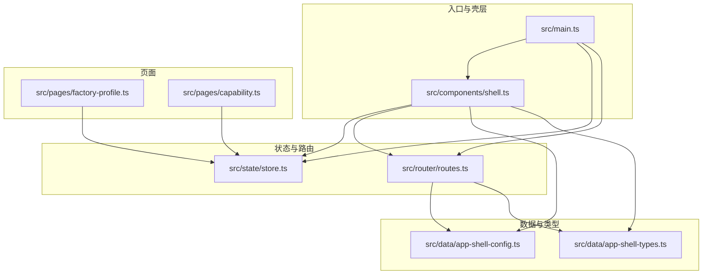
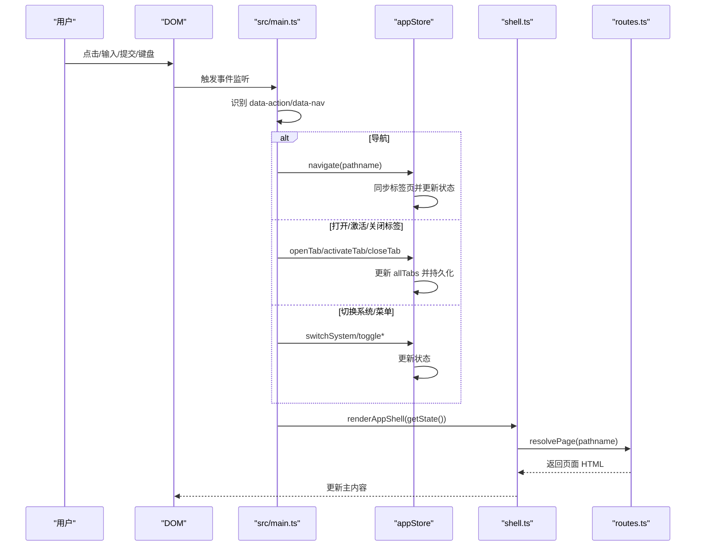
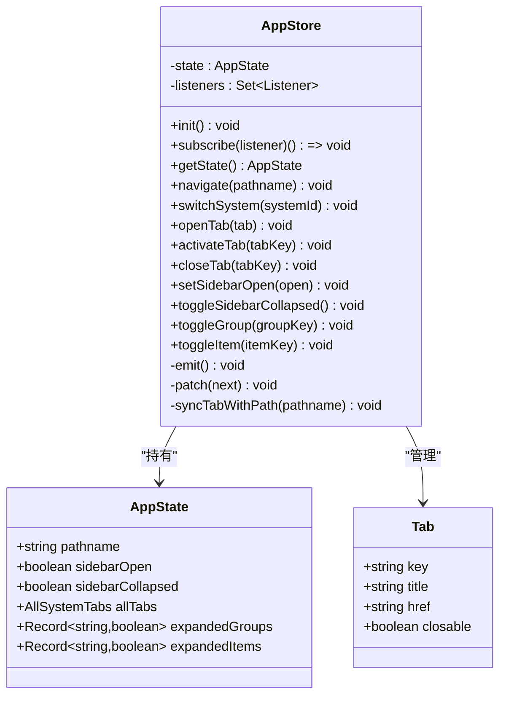
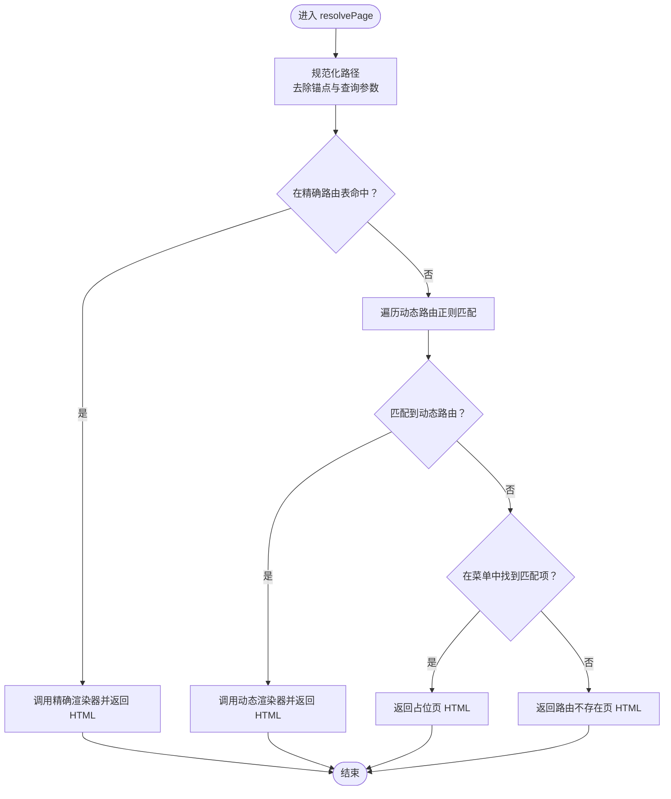
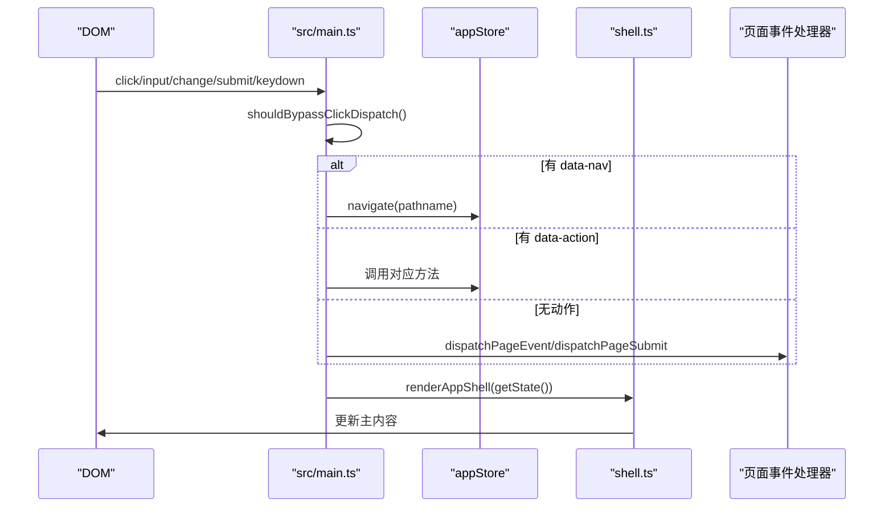
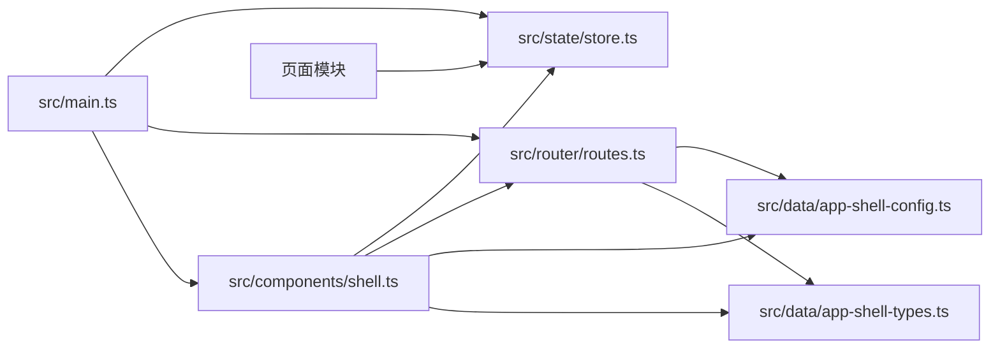

# API 参考

<cite>
**本文引用的文件**
- [main.ts](file://src/main.ts)
- [store.ts](file://src/state/store.ts)
- [routes.ts](file://src/router/routes.ts)
- [shell.ts](file://src/components/shell.ts)
- [app-shell-config.ts](file://src/data/app-shell-config.ts)
- [app-shell-types.ts](file://src/data/app-shell-types.ts)
- [factory-profile.ts](file://src/pages/factory-profile.ts)
- [capability.ts](file://src/pages/capability.ts)
- [factory-types.ts](file://src/data/fcs/factory-types.ts)
- [package.json](file://package.json)
</cite>

## 目录
1. [简介](#简介)
2. [项目结构](#项目结构)
3. [核心组件](#核心组件)
4. [架构总览](#架构总览)
5. [详细组件分析](#详细组件分析)
6. [依赖关系分析](#依赖关系分析)
7. [性能考量](#性能考量)
8. [故障排查指南](#故障排查指南)
9. [结论](#结论)
10. [附录](#附录)

## 简介
本文件为 higoods 项目的 API 参考文档，覆盖以下核心 API：
- 状态管理 API（appStore）
- 路由 API（resolvePage）
- 壳层 API（shell 组件渲染与事件绑定）
- 事件处理 API（dataset 事件系统）

文档提供接口规范、参数说明、返回值类型、使用示例与最佳实践，并包含版本信息、兼容性说明与废弃功能迁移指南。

## 项目结构
higoods 采用“壳层 + 路由 + 状态 + 页面”的分层架构：
- 壳层（shell）负责顶部栏、侧边菜单、标签页与图标初始化
- 路由（routes）负责路径解析与页面渲染
- 状态（store）负责应用状态、标签页与导航
- 页面（pages）负责具体业务页面与对话框事件处理
- 数据（data）提供系统配置、类型与业务数据

图表来源
- [main.ts:1-933](file://src/main.ts#L1-L933)
- [shell.ts:1-324](file://src/components/shell.ts#L1-L324)
- [store.ts:1-329](file://src/state/store.ts#L1-L329)
- [routes.ts:1-454](file://src/router/routes.ts#L1-L454)
- [app-shell-config.ts:1-355](file://src/data/app-shell-config.ts#L1-L355)
- [app-shell-types.ts:1-46](file://src/data/app-shell-types.ts#L1-L46)
- [factory-profile.ts:1-1880](file://src/pages/factory-profile.ts#L1-L1880)
- [capability.ts:1-988](file://src/pages/capability.ts#L1-L988)

章节来源
- [main.ts:1-933](file://src/main.ts#L1-L933)
- [shell.ts:1-324](file://src/components/shell.ts#L1-L324)
- [store.ts:1-329](file://src/state/store.ts#L1-L329)
- [routes.ts:1-454](file://src/router/routes.ts#L1-L454)
- [app-shell-config.ts:1-355](file://src/data/app-shell-config.ts#L1-L355)
- [app-shell-types.ts:1-46](file://src/data/app-shell-types.ts#L1-L46)

## 核心组件

### appStore（状态管理 API）
appStore 是应用的状态中心，提供状态读取、更新与订阅，以及导航、标签页与侧边栏控制能力。

- 初始化
  - 方法：init()
  - 作用：从本地存储恢复标签页与侧边栏折叠状态；校验当前 pathname 对应的菜单项并同步到标签页
  - 返回：void

- 订阅与状态读取
  - 方法：subscribe(listener: () => void): () => void
  - 方法：getState(): AppState
  - 作用：订阅状态变化并在变化时回调；读取当前状态快照
  - 返回：取消订阅函数；当前状态对象

- 导航与标签页
  - 方法：navigate(pathname: string): void
  - 方法：openTab(tab: Tab): void
  - 方法：activateTab(tabKey: string): void
  - 方法：closeTab(tabKey: string): void
  - 作用：程序化导航；打开/激活/关闭标签页
  - 参数：pathname 为标准化后的路径；tab 为包含 key/title/href/closable 的对象
  - 返回：void

- 侧边栏与菜单
  - 方法：setSidebarOpen(open: boolean): void
  - 方法：toggleSidebarCollapsed(): void
  - 方法：toggleGroup(groupKey: string): void
  - 方法：toggleItem(itemKey: string): void
  - 作用：控制移动端侧边栏开关、折叠切换、菜单分组与条目展开
  - 返回：void

- 系统切换
  - 方法：switchSystem(systemId: string): void
  - 作用：切换系统并跳转到该系统的默认页面
  - 返回：void

- 状态类型
  - AppState 字段：
    - pathname: string
    - sidebarOpen: boolean
    - sidebarCollapsed: boolean
    - allTabs: AllSystemTabs
    - expandedGroups: Record<string, boolean>
    - expandedItems: Record<string, boolean>
  - Tab 字段：
    - key: string
    - title: string
    - href: string
    - closable: boolean

- 使用示例
  - 程序化导航：appStore.navigate('/fcs/workbench/overview')
  - 打开新标签：appStore.openTab({ key: 'tab1', title: '工作台', href: '/fcs/workbench/overview', closable: true })
  - 切换系统：appStore.switchSystem('pcs')

章节来源
- [store.ts:89-304](file://src/state/store.ts#L89-L304)
- [app-shell-types.ts:6-46](file://src/data/app-shell-types.ts#L6-L46)

### resolvePage（路由 API）
resolvePage 负责根据 pathname 解析并返回对应页面的 HTML 内容字符串，支持精确路由与动态路由。

- 函数签名
  - resolvePage(pathname: string): string
- 行为
  - 规范化路径（去除锚点与查询参数）
  - 精确匹配 exactRoutes 映射，返回对应渲染器的结果
  - 若未命中，遍历动态路由数组进行正则匹配，返回对应渲染器的结果
  - 若仍未命中，尝试在菜单中查找匹配项，返回占位页内容
  - 默认返回“路由不存在”页
- 返回值
  - string：页面 HTML 字符串

- 使用示例
  - const html = resolvePage('/fcs/factories/profile')

章节来源
- [routes.ts:428-453](file://src/router/routes.ts#L428-L453)
- [app-shell-config.ts:21-355](file://src/data/app-shell-config.ts#L21-L355)

### shell 组件（壳层 API）
shell 组件负责渲染顶部栏、侧边菜单、标签页与主内容区域，并通过 dataset 事件驱动 appStore 更新状态。

- 渲染入口
  - renderAppShell(state: AppState): string
  - 作用：组合顶部栏、侧边栏、标签栏与主内容区域
  - 返回：HTML 字符串

- 图标初始化
  - hydrateIcons(root?: ParentNode): void
  - 作用：初始化 lucide 图标库
  - 返回：void

- 事件绑定与处理（在 main.ts 中）
  - 点击事件：识别带有 data-action 的元素，调用 appStore 对应方法或触发页面事件
  - 输入/变更事件：触发页面事件并重新渲染
  - 提交事件：触发页面表单提交事件并阻止默认行为
  - 键盘事件：Esc 关闭各类对话框

- 使用示例
  - 在页面中添加 data-action="open-tab" 与 data-tab-* 属性以打开标签页
  - 添加 data-action="switch-system" 与 data-system-id 以切换系统

章节来源
- [shell.ts:292-324](file://src/components/shell.ts#L292-L324)
- [main.ts:376-491](file://src/main.ts#L376-L491)

### dataset 事件系统（事件处理 API）
dataset 事件系统通过 DOM 的 dataset 属性传递动作指令，main.ts 中集中处理并分发到各页面事件处理器。

- 动作识别
  - hasDatasetAction(node: HTMLElement): boolean
  - hasDatasetFieldLike(node: HTMLElement): boolean
  - shouldBypassClickDispatch(target: Element): boolean
  - 作用：判断节点是否携带动作或字段类属性，避免与原生控件行为冲突

- 点击事件分发
  - 识别 data-nav：触发 appStore.navigate()
  - 识别 data-action：根据 action 值调用 appStore 对应方法或页面事件
  - 支持的动作：
    - switch-system：切换系统
    - set-sidebar-open：设置侧边栏开关
    - toggle-sidebar-collapsed：切换侧边栏折叠
    - toggle-menu-group：切换菜单分组展开
    - toggle-menu-item：切换菜单条目展开
    - open-tab：打开标签页
    - activate-tab：激活标签页
    - close-tab：关闭标签页

- 表单事件分发
  - dispatchPageSubmit(form: HTMLFormElement): boolean
  - 作用：将表单提交事件分发到页面表单处理器

- 页面事件分发
  - dispatchPageEvent(target: Element): boolean
  - 作用：将点击/输入/变更事件分发到页面事件处理器

- 对话框关闭快捷键
  - Esc：按顺序尝试关闭各类对话框

- 使用示例
  - 在按钮上添加 data-action="open-tab" 与 data-tab-* 属性以打开标签页
  - 在菜单项上添加 data-action="toggle-menu-item" 以切换子菜单展开
  - 在链接上添加 data-nav="目标路径" 以程序化导航

章节来源
- [main.ts:341-491](file://src/main.ts#L341-L491)
- [main.ts:242-318](file://src/main.ts#L242-L318)

## 架构总览

图表来源
- [main.ts:376-491](file://src/main.ts#L376-L491)
- [store.ts:172-304](file://src/state/store.ts#L172-L304)
- [shell.ts:292-311](file://src/components/shell.ts#L292-L311)
- [routes.ts:428-453](file://src/router/routes.ts#L428-L453)

## 详细组件分析

### appStore 详细分析

图表来源
- [store.ts:89-304](file://src/state/store.ts#L89-L304)
- [app-shell-types.ts:6-46](file://src/data/app-shell-types.ts#L6-L46)

章节来源
- [store.ts:89-304](file://src/state/store.ts#L89-L304)
- [app-shell-types.ts:6-46](file://src/data/app-shell-types.ts#L6-L46)

### resolvePage 详细分析

图表来源
- [routes.ts:428-453](file://src/router/routes.ts#L428-L453)
- [app-shell-config.ts:21-355](file://src/data/app-shell-config.ts#L21-L355)

章节来源
- [routes.ts:428-453](file://src/router/routes.ts#L428-L453)

### shell 组件与 dataset 事件系统

图表来源
- [main.ts:376-491](file://src/main.ts#L376-L491)
- [shell.ts:292-311](file://src/components/shell.ts#L292-L311)

章节来源
- [main.ts:376-491](file://src/main.ts#L376-L491)
- [shell.ts:292-311](file://src/components/shell.ts#L292-L311)

### 页面事件处理示例（以 capability 页面为例）

- 对话框控制
  - 通过 dataset 属性如 data-cap-action="close-dialog" 触发页面事件
  - 页面事件处理器内部维护 state.dialog 等状态，决定是否拦截事件并返回 true/false
- 表单提交
  - 通过 dataset 属性如 data-cap-form="tag" 识别表单并调用 handle*Submit

章节来源
- [capability.ts:150-200](file://src/pages/capability.ts#L150-L200)
- [main.ts:320-327](file://src/main.ts#L320-L327)

## 依赖关系分析

图表来源
- [main.ts:1-933](file://src/main.ts#L1-L933)
- [store.ts:1-329](file://src/state/store.ts#L1-L329)
- [routes.ts:1-454](file://src/router/routes.ts#L1-L454)
- [shell.ts:1-324](file://src/components/shell.ts#L1-L324)
- [app-shell-config.ts:1-355](file://src/data/app-shell-config.ts#L1-L355)
- [app-shell-types.ts:1-46](file://src/data/app-shell-types.ts#L1-L46)

章节来源
- [main.ts:1-933](file://src/main.ts#L1-L933)
- [store.ts:1-329](file://src/state/store.ts#L1-L329)
- [routes.ts:1-454](file://src/router/routes.ts#L1-L454)
- [shell.ts:1-324](file://src/components/shell.ts#L1-L324)
- [app-shell-config.ts:1-355](file://src/data/app-shell-config.ts#L1-L355)
- [app-shell-types.ts:1-46](file://src/data/app-shell-types.ts#L1-L46)

## 性能考量
- 事件委托与最小重绘
  - 通过集中事件监听与 shouldBypassClickDispatch 避免不必要的全量重渲染
- 状态订阅
  - 使用 subscribe 订阅状态变化，仅在必要时触发 render
- 本地存储
  - 标签页与侧边栏折叠状态持久化，减少初始化开销
- 图标初始化
  - hydrateIcons 仅初始化一次，避免重复扫描

[本节为通用指导，无需特定文件引用]

## 故障排查指南
- 无法导航
  - 检查 pathname 是否在菜单中存在；若不存在，resolvePage 将返回占位页或“路由不存在”
  - 确认 data-nav 或 appStore.navigate 调用正确
- 标签页不显示
  - 确认 pathname 与菜单项 href 匹配；syncTabWithPath 会自动创建标签
- 侧边栏不响应
  - 检查 data-action 与 appStore 对应方法调用
- 对话框无法关闭
  - 确认页面事件处理器是否正确识别 dataset 属性并返回 true
  - 按 Esc 快捷键可关闭当前打开的对话框

章节来源
- [routes.ts:428-453](file://src/router/routes.ts#L428-L453)
- [main.ts:376-491](file://src/main.ts#L376-L491)

## 结论
higoods 的 API 设计遵循“壳层 + 路由 + 状态 + 页面”的清晰分层，通过 dataset 事件系统实现低耦合的交互扩展。appStore 提供了完善的导航与标签页管理能力；resolvePage 实现了灵活的路由解析；shell 组件负责 UI 渲染与事件桥接。整体架构易于扩展与维护，适合多系统与多页面场景。

[本节为总结性内容，无需特定文件引用]

## 附录

### 版本信息与兼容性
- 项目版本
  - 当前版本：1.0.0
  - 依赖：lucide ^0.468.0
- 兼容性
  - 浏览器：现代浏览器（ES 模块、dataset、localStorage）
  - TypeScript：用于类型安全与开发体验

章节来源
- [package.json:1-23](file://package.json#L1-L23)

### 废弃功能与迁移指南
- 本项目未发现明确标记的废弃 API
- 迁移建议
  - 如需新增页面：在 routes.ts 中添加精确或动态路由映射
  - 如需新增系统：在 app-shell-config.ts 中扩展 systems 与 menusBySystem
  - 如需新增动作：在 main.ts 的事件分发逻辑中增加分支处理

[本节为通用指导，无需特定文件引用]

### API 使用示例索引
- 程序化导航
  - appStore.navigate('/fcs/workbench/overview')
- 打开标签页
  - appStore.openTab({ key, title, href, closable: true })
- 切换系统
  - appStore.switchSystem('pcs')
- 事件绑定
  - data-action="open-tab" 与 data-tab-* 属性
  - data-nav="目标路径"
  - data-cap-action="close-dialog"（示例：capability 页面）

章节来源
- [store.ts:172-209](file://src/state/store.ts#L172-L209)
- [main.ts:396-463](file://src/main.ts#L396-L463)
- [capability.ts:150-200](file://src/pages/capability.ts#L150-L200)