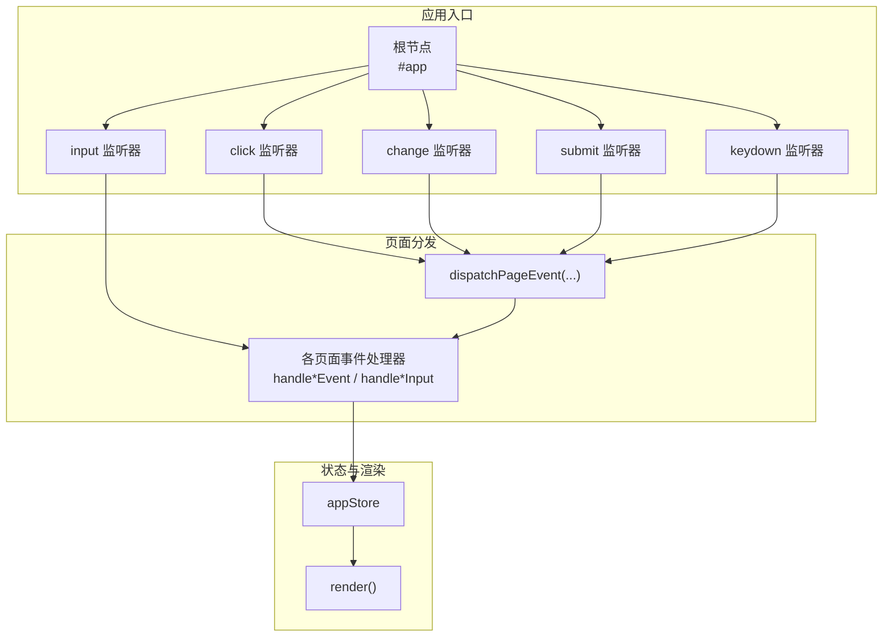
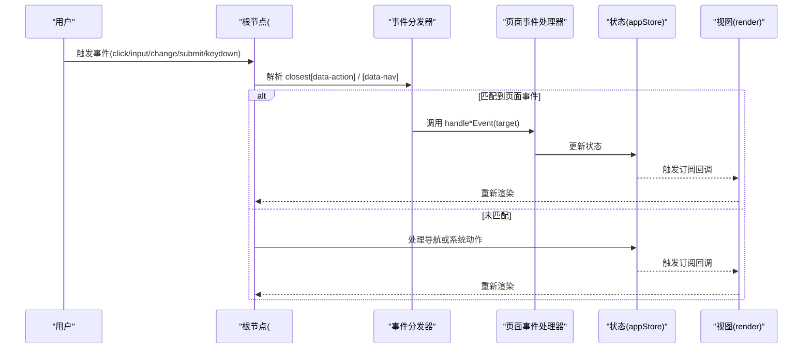
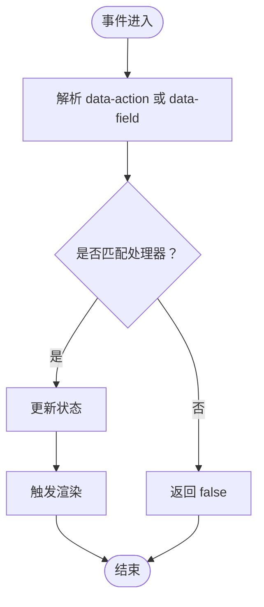
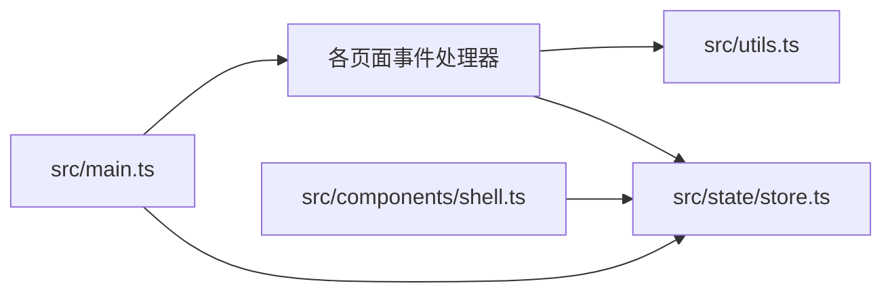

# 事件处理 API

<cite>
**本文档引用的文件**
- [src/main.ts](file://src/main.ts)
- [src/pages/pcs-sample-ledger.ts](file://src/pages/pcs-sample-ledger.ts)
- [src/components/shell.ts](file://src/components/shell.ts)
- [src/state/store.ts](file://src/state/store.ts)
- [src/utils.ts](file://src/utils.ts)
</cite>

## 目录
1. [简介](#简介)
2. [项目结构](#项目结构)
3. [核心组件](#核心组件)
4. [架构总览](#架构总览)
5. [详细组件分析](#详细组件分析)
6. [依赖关系分析](#依赖关系分析)
7. [性能考量](#性能考量)
8. [故障排查指南](#故障排查指南)
9. [结论](#结论)
10. [附录](#附录)

## 简介
本文件为 higoods 项目的事件处理 API 参考文档，聚焦于基于 data-* 属性的事件系统与事件委托模式。文档说明了：
- 如何通过 data-* 属性传递事件信息与处理参数
- 事件委托在根节点上的实现与控制流
- 事件处理器的注册机制（事件类型、处理函数与绑定方式）
- dataset 事件系统的完整使用示例与可复用事件处理器的设计
- 事件冒泡与捕获的处理方式及阻止传播的方法
- 自定义事件处理器的开发指南与扩展建议
- 事件调试与性能优化的最佳实践

## 项目结构
事件系统围绕应用入口文件组织，采用“根节点事件委托 + 页面级事件分发”的架构：
- 应用入口负责在根节点监听 click/input/change/submit/keydown 等事件
- 通过事件委托解析 closest 元素的 data-* 属性，决定是否由页面级处理器消费
- 页面级处理器负责更新状态并触发重新渲染

图表来源
- [src/main.ts:382-502](file://src/main.ts#L382-L502)
- [src/main.ts:247-324](file://src/main.ts#L247-L324)
- [src/state/store.ts:89-304](file://src/state/store.ts#L89-L304)

章节来源
- [src/main.ts:237-502](file://src/main.ts#L237-L502)

## 核心组件
- 根节点事件监听器
  - 在根节点上统一监听 click/input/change/submit/keydown，实现事件委托
  - 通过 closest 查找最近的 [data-action] 或 [data-nav] 节点，解析 action 参数
- 事件分发器
  - dispatchPageEvent 将事件委派给各页面处理器，按顺序尝试匹配
  - dispatchPageSubmit 处理表单提交
- 页面事件处理器
  - 各页面模块提供 handle*Event 与 handle*Input 函数，消费 data-* 属性并更新状态
  - 示例：样衣台账页面提供 handleSampleLedgerEvent 与 handleSampleLedgerInput
- 状态与渲染
  - appStore 维护应用状态，subscribe 订阅变更后调用 render
  - render 将新状态渲染到 #app 内容区域

章节来源
- [src/main.ts:247-502](file://src/main.ts#L247-L502)
- [src/pages/pcs-sample-ledger.ts:1248-1392](file://src/pages/pcs-sample-ledger.ts#L1248-L1392)
- [src/state/store.ts:89-304](file://src/state/store.ts#L89-L304)

## 架构总览
事件系统采用“事件委托 + 分层处理 + 单向数据流”设计：
- 事件从根节点捕获，优先由页面级处理器消费
- 页面级处理器通过 appStore 更新状态，触发订阅者渲染
- 对于输入类事件，先由页面级输入处理器同步字段，再统一渲染

图表来源
- [src/main.ts:382-502](file://src/main.ts#L382-L502)
- [src/main.ts:247-324](file://src/main.ts#L247-L324)
- [src/state/store.ts:119-139](file://src/state/store.ts#L119-L139)

## 详细组件分析

### 事件委托与根节点监听
- 根节点监听策略
  - click：优先检查是否应绕过（如原生 select/textarea 的默认行为），否则尝试页面事件分发；若未命中则解析 [data-nav] 进行导航；最后解析 [data-action] 执行系统动作
  - input：先尝试页面输入处理器，再进行页面事件分发
  - change：直接进行页面事件分发
  - submit：表单提交时进行页面提交分发
  - keydown：Esc 键触发多处对话框关闭的“假按钮”事件
- 绕过策略
  - shouldBypassClickDispatch 针对原生控件与带 data-field/data-filter 的输入控件，避免不必要的全量重渲染

章节来源
- [src/main.ts:347-470](file://src/main.ts#L347-L470)
- [src/main.ts:471-502](file://src/main.ts#L471-L502)
- [src/main.ts:504-952](file://src/main.ts#L504-L952)

### 事件分发器与处理器注册
- 分发器
  - dispatchPageEvent：按顺序尝试多个页面处理器，返回首个匹配成功的处理器结果
  - dispatchPageSubmit：处理表单提交，返回首个匹配成功的处理器结果
- 注册机制
  - 在入口文件集中导入各页面事件处理器，并在分发器中依次调用
  - 通过 data-action 与 data-field 等属性驱动处理器执行

章节来源
- [src/main.ts:247-333](file://src/main.ts#L247-L333)

### 页面事件处理器（样衣台账示例）
- 处理器职责
  - handleSampleLedgerEvent：解析 data-action 并执行对应业务逻辑（如打开详情抽屉、切换事件类型过滤、重置筛选等）
  - handleSampleLedgerInput：解析 data-field 并更新对应状态字段（如搜索词、站点、时间范围、来源单据类型、显示已作废、作废原因等）
- 状态管理
  - 使用局部状态对象维护筛选条件、选中事件 ID、抽屉开关等
  - 通过 appStore 订阅触发渲染

图表来源
- [src/pages/pcs-sample-ledger.ts:1248-1392](file://src/pages/pcs-sample-ledger.ts#L1248-L1392)

章节来源
- [src/pages/pcs-sample-ledger.ts:1248-1392](file://src/pages/pcs-sample-ledger.ts#L1248-L1392)

### 导航与系统动作
- 导航
  - [data-nav]：点击后调用 appStore.navigate 切换路径
- 系统动作
  - [data-action]：根据 action 值执行系统级操作（如切换系统、打开/关闭侧边栏、展开/折叠菜单、打开/激活/关闭标签页等）

章节来源
- [src/main.ts:394-470](file://src/main.ts#L394-L470)
- [src/components/shell.ts:29-311](file://src/components/shell.ts#L29-L311)

### 输入与字段同步
- 输入同步
  - input/change 事件优先交由页面输入处理器（如 handleSampleLedgerInput）同步字段
  - 同步完成后统一触发渲染，避免因原生控件默认行为导致的闪烁与焦点丢失

章节来源
- [src/main.ts:471-492](file://src/main.ts#L471-L492)
- [src/pages/pcs-sample-ledger.ts:1353-1388](file://src/pages/pcs-sample-ledger.ts#L1353-L1388)

### 事件冒泡与捕获
- 当前实现
  - 在根节点监听器中显式调用 preventDefault 阻止默认行为
  - 未显式调用 stopPropagation，因此事件仍会冒泡至父级
- 使用建议
  - 若需阻止冒泡，可在处理器内部调用 stopPropagation
  - 若需阻止默认行为，确保调用 preventDefault

章节来源
- [src/main.ts:388-390](file://src/main.ts#L388-L390)
- [src/main.ts:407-407](file://src/main.ts#L407-L407)

### 自定义事件处理器开发指南
- 设计原则
  - 以 data-* 属性作为事件契约，保持 UI 与逻辑解耦
  - 处理器函数返回布尔值，表示是否消费该事件
- 开发步骤
  - 在页面模板中添加 [data-action] 或 [data-field] 属性
  - 在页面模块中实现 handle*Event 与 handle*Input 函数
  - 在入口文件的分发器中注册处理器
  - 通过 appStore 更新状态并触发渲染
- 最佳实践
  - 为复杂交互提供 data-* 参数（如 data-event-id、data-system-id 等）
  - 对于输入控件，优先使用 data-field 与全局 input 监听器同步状态
  - 对于对话框/抽屉等，提供统一的 Esc 关闭流程

章节来源
- [src/main.ts:247-333](file://src/main.ts#L247-L333)
- [src/pages/pcs-sample-ledger.ts:1248-1392](file://src/pages/pcs-sample-ledger.ts#L1248-L1392)

## 依赖关系分析
- 入口文件依赖
  - 各页面事件处理器模块（通过导入与分发器注册）
  - appStore（状态与渲染）
- 页面模块依赖
  - utils（字符串转义、格式化等）
  - appStore（状态读取与渲染触发）

图表来源
- [src/main.ts:1-18](file://src/main.ts#L1-L18)
- [src/pages/pcs-sample-ledger.ts:1-3](file://src/pages/pcs-sample-ledger.ts#L1-L3)
- [src/state/store.ts:1-11](file://src/state/store.ts#L1-L11)
- [src/components/shell.ts:1-11](file://src/components/shell.ts#L1-L11)

章节来源
- [src/main.ts:1-18](file://src/main.ts#L1-L18)
- [src/pages/pcs-sample-ledger.ts:1-3](file://src/pages/pcs-sample-ledger.ts#L1-L3)
- [src/state/store.ts:1-11](file://src/state/store.ts#L1-L11)
- [src/components/shell.ts:1-11](file://src/components/shell.ts#L1-L11)

## 性能考量
- 事件委托减少监听器数量，降低内存占用
- 绕过策略避免对原生控件的不必要干预，减少重渲染
- 输入同步与统一渲染结合，避免频繁 DOM 更新
- 建议
  - 对高频交互使用节流/防抖（如搜索输入）
  - 对复杂列表渲染使用虚拟滚动
  - 对大对象状态更新使用不可变更新策略

## 故障排查指南
- 事件未生效
  - 检查元素是否包含正确的 data-* 属性
  - 确认入口文件已注册对应页面处理器
  - 确认未被 shouldBypassClickDispatch 绕过
- 输入不同步
  - 检查是否使用了 [data-field] 且存在对应的 handle*Input
  - 确认 input/change 事件监听器已触发
- Esc 无法关闭对话框
  - 检查是否存在对应 is*DialogOpen 的判断与 fake button 触发
- 性能问题
  - 使用浏览器性能面板定位重渲染热点
  - 检查是否存在不必要的全局渲染

章节来源
- [src/main.ts:347-380](file://src/main.ts#L347-L380)
- [src/main.ts:504-952](file://src/main.ts#L504-L952)

## 结论
本事件处理 API 通过 data-* 属性与事件委托实现了高内聚、低耦合的交互体系。页面级处理器专注于状态更新与业务逻辑，入口文件统一调度与渲染，形成清晰的单向数据流。遵循本文档的开发与调试建议，可快速扩展新的交互模式并保持良好的性能与可维护性。

## 附录

### 常用 data-* 属性清单
- [data-action]：触发页面或系统动作
- [data-field]：标识输入字段并同步状态
- [data-nav]：导航到指定路径
- [data-event-id]：标识事件 ID
- [data-system-id]：标识系统 ID
- [data-tab-*]：标签页相关参数（键、标题、链接等）
- [data-group-key] / [data-item-key]：菜单分组/条目键
- [data-filter] / [data-*-filter]：过滤器参数
- [data-*-field]：字段参数（如 site、time-range、source-doc-type 等）

章节来源
- [src/main.ts:394-470](file://src/main.ts#L394-L470)
- [src/pages/pcs-sample-ledger.ts:1152-1183](file://src/pages/pcs-sample-ledger.ts#L1152-L1183)