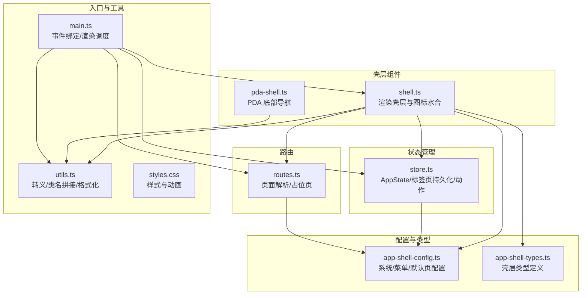
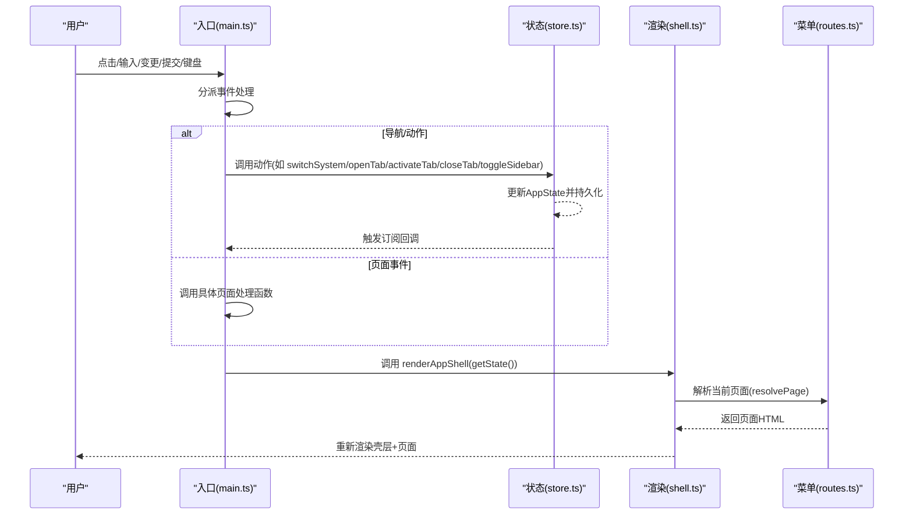
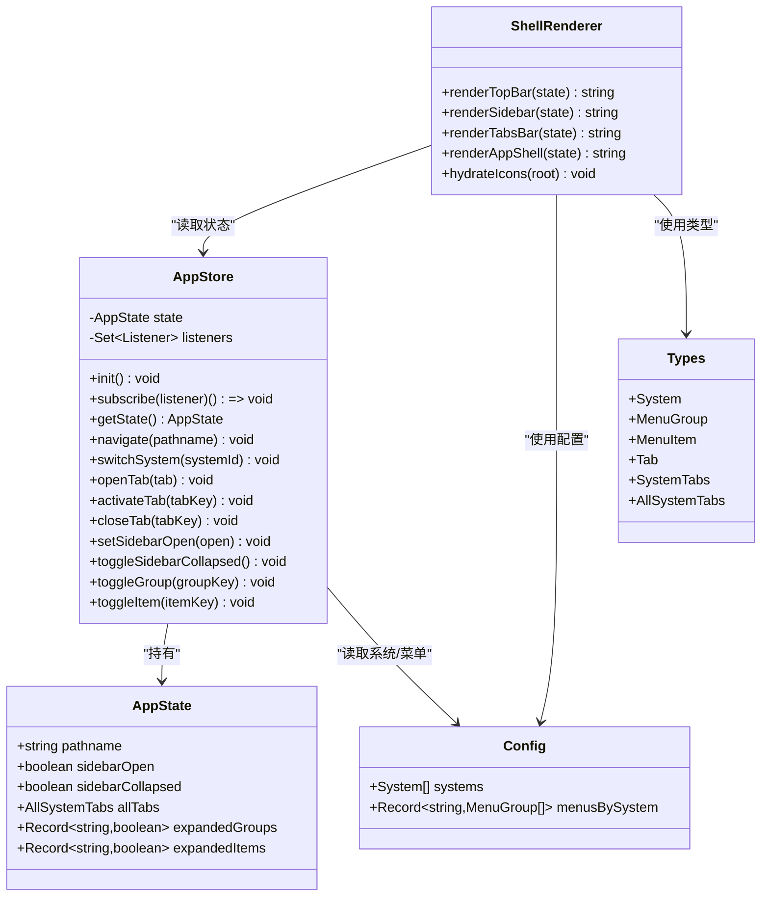

# 壳层 API

<cite>
**本文引用的文件**
- [shell.ts](file://src/components/shell.ts)
- [app-shell-config.ts](file://src/data/app-shell-config.ts)
- [app-shell-types.ts](file://src/data/app-shell-types.ts)
- [store.ts](file://src/state/store.ts)
- [routes.ts](file://src/router/routes.ts)
- [utils.ts](file://src/utils.ts)
- [main.ts](file://src/main.ts)
- [pda-shell.ts](file://src/pages/pda-shell.ts)
- [placeholder.ts](file://src/pages/placeholder.ts)
- [styles.css](file://src/styles.css)
</cite>

## 目录
1. [简介](#简介)
2. [项目结构](#项目结构)
3. [核心组件](#核心组件)
4. [架构总览](#架构总览)
5. [详细组件分析](#详细组件分析)
6. [依赖关系分析](#依赖关系分析)
7. [性能考量](#性能考量)
8. [故障排查指南](#故障排查指南)
9. [结论](#结论)
10. [附录](#附录)

## 简介
本文件为 higoods 应用“壳层 API”的权威参考文档，覆盖顶部栏、侧边栏、标签页管理等壳层功能的公共接口与配置选项，并说明如何通过壳层 API 控制界面布局与用户交互。文档同时解释壳层与状态管理系统的集成方式、生命周期与事件处理机制，并提供可复用的初始化与配置示例，帮助开发者快速扩展与定制壳层功能。

## 项目结构
壳层相关代码主要分布在以下模块：
- 组件层：壳层渲染与图标水合
- 数据层：系统、菜单、标签页配置与类型
- 状态层：应用状态与标签页持久化
- 路由层：页面解析与占位页渲染
- 主入口：事件绑定、状态订阅与渲染调度

图表来源
- [shell.ts:1-324](file://src/components/shell.ts#L1-L324)
- [app-shell-config.ts:1-355](file://src/data/app-shell-config.ts#L1-L355)
- [app-shell-types.ts:1-46](file://src/data/app-shell-types.ts#L1-L46)
- [store.ts:1-329](file://src/state/store.ts#L1-L329)
- [routes.ts:1-456](file://src/router/routes.ts#L1-L456)
- [utils.ts:1-18](file://src/utils.ts#L1-L18)
- [main.ts:1-939](file://src/main.ts#L1-L939)
- [pda-shell.ts:1-51](file://src/pages/pda-shell.ts#L1-L51)
- [styles.css:1-103](file://src/styles.css#L1-L103)

章节来源
- [shell.ts:1-324](file://src/components/shell.ts#L1-L324)
- [app-shell-config.ts:1-355](file://src/data/app-shell-config.ts#L1-L355)
- [app-shell-types.ts:1-46](file://src/data/app-shell-types.ts#L1-L46)
- [store.ts:1-329](file://src/state/store.ts#L1-L329)
- [routes.ts:1-456](file://src/router/routes.ts#L1-L456)
- [utils.ts:1-18](file://src/utils.ts#L1-L18)
- [main.ts:1-939](file://src/main.ts#L1-L939)
- [pda-shell.ts:1-51](file://src/pages/pda-shell.ts#L1-L51)
- [styles.css:1-103](file://src/styles.css#L1-L103)

## 核心组件
- 壳层渲染器：负责渲染顶部栏、侧边栏、标签页条与主内容区域，并将页面内容通过路由解析器注入。
- 状态存储器：维护当前路径、侧边栏状态、展开状态、全部系统的标签页集合，并提供持久化与订阅机制。
- 配置与类型：集中定义系统、菜单、标签页的数据结构与默认页；菜单按系统维度组织，支持多级子菜单。
- 路由解析器：根据路径精确匹配或动态匹配，找不到时回退到占位页或“未找到”页。
- 事件与渲染调度：在入口处统一监听点击、输入、变更、提交与键盘事件，触发状态动作并重新渲染。

章节来源
- [shell.ts:25-324](file://src/components/shell.ts#L25-L324)
- [store.ts:4-12](file://src/state/store.ts#L4-L12)
- [app-shell-config.ts:8-355](file://src/data/app-shell-config.ts#L8-L355)
- [app-shell-types.ts:6-46](file://src/data/app-shell-types.ts#L6-L46)
- [routes.ts:107-456](file://src/router/routes.ts#L107-L456)
- [main.ts:335-497](file://src/main.ts#L335-L497)

## 架构总览
壳层 API 的调用链路如下：
- 用户交互触发事件（点击、输入、变更、提交、键盘）
- 入口层根据事件类型分派到对应处理逻辑
- 处理逻辑调用状态存储器的动作函数（如切换系统、打开/激活/关闭标签、切换侧边栏等）
- 状态存储器更新内部状态并发出订阅通知
- 渲染层读取最新状态，重新渲染壳层与页面内容

图表来源
- [main.ts:382-497](file://src/main.ts#L382-L497)
- [store.ts:119-304](file://src/state/store.ts#L119-L304)
- [shell.ts:292-311](file://src/components/shell.ts#L292-L311)
- [routes.ts:430-456](file://src/router/routes.ts#L430-L456)

## 详细组件分析

### 顶部栏（TopBar）
- 功能：显示系统切换按钮、品牌标识、通知与用户信息。
- 关键行为：
  - 系统切换：通过“switch-system”动作，携带目标系统 ID，触发状态切换并跳转到该系统默认页。
  - 移动端菜单：在移动端显示“打开菜单”按钮，用于控制侧边栏显隐。
- 交互元素：
  - 系统按钮：带活动态指示与短名标注。
  - 通知与用户下拉：预留交互点位。

章节来源
- [shell.ts:25-79](file://src/components/shell.ts#L25-L79)
- [main.ts:410-417](file://src/main.ts#L410-L417)

### 侧边栏（Left Sidebar）
- 功能：按当前系统渲染菜单分组与条目，支持折叠与展开；移动端以抽屉形式呈现。
- 关键行为：
  - 折叠/展开：通过“toggle-sidebar-collapsed”切换宽度与图标。
  - 折叠模式：仅显示图标，适合窄屏或空间受限场景。
  - 菜单分组：支持标题与展开状态记忆。
  - 子菜单：支持二级菜单，点击条目可展开/收起。
  - 打开标签：点击菜单项触发“open-tab”，自动在当前系统标签页中新增并激活对应标签。
- 交互元素：
  - 折叠按钮：在桌面端显示。
  - 分组标题：点击切换展开状态。
  - 条目按钮：点击打开标签或切换展开状态。
  - 移动端遮罩：点击遮罩关闭侧边栏。

章节来源
- [shell.ts:185-251](file://src/components/shell.ts#L185-L251)
- [main.ts:424-456](file://src/main.ts#L424-L456)

### 标签页条（Tabs Bar）
- 功能：按当前系统维护标签页集合，支持激活、关闭与滚动浏览。
- 关键行为：
  - 新增标签：当导航到菜单项时，自动在当前系统标签页中新增对应标签并激活。
  - 激活标签：点击标签页可切换激活状态。
  - 关闭标签：点击“×”关闭标签，若关闭的是当前激活标签，会回退到相邻标签或系统默认页。
  - 持久化：标签页集合保存在本地存储，刷新后恢复。
- 交互元素：
  - 标签按钮：点击激活。
  - 关闭按钮：仅在可关闭标签上可见，悬停或激活时显示。

章节来源
- [shell.ts:253-290](file://src/components/shell.ts#L253-L290)
- [store.ts:186-269](file://src/state/store.ts#L186-L269)
- [main.ts:458-468](file://src/main.ts#L458-L468)

### 页面内容区（Main Content）
- 功能：在标签页下方渲染当前页面内容。
- 关键行为：
  - 页面解析：根据当前路径匹配精确路由或动态路由，找不到时返回占位页或“未找到”页。
  - 占位页：提示页面正在开发中，便于过渡期使用。
- 交互元素：
  - 无直接交互，内容由路由解析器决定。

章节来源
- [shell.ts:300-307](file://src/components/shell.ts#L300-L307)
- [routes.ts:430-456](file://src/router/routes.ts#L430-L456)
- [placeholder.ts:3-32](file://src/pages/placeholder.ts#L3-L32)

### PDA 底部导航（移动端）
- 功能：在 PDA 场景下提供底部导航，适配移动端高触达区域。
- 关键行为：
  - 活动态：根据当前活跃标签高亮。
  - 导航：点击底部按钮跳转至对应 PDA 页面。
- 交互元素：
  - 底部导航按钮：包含图标与文字标签。

章节来源
- [pda-shell.ts:20-51](file://src/pages/pda-shell.ts#L20-L51)

### 图标水合（Icons Hydration）
- 功能：使用 lucide 图标库进行图标水合，确保 SVG 图标正确渲染。
- 关键行为：
  - 初始化：在文档根节点扫描并替换 data-lucide 属性为实际 SVG。
  - 可选参数：保留 root 参数以保持 API 对称性。

章节来源
- [shell.ts:313-324](file://src/components/shell.ts#L313-L324)

### 壳层渲染流程（渲染器）
- 功能：组合顶部栏、侧边栏、标签页条与页面内容，形成完整的壳层布局。
- 关键行为：
  - 读取状态：从状态存储器获取当前路径、侧边栏状态、展开状态与标签页集合。
  - 渲染各部分：分别调用顶部栏、侧边栏、标签页条与页面解析器。
  - 注入页面：将解析后的页面 HTML 插入主内容区。

章节来源
- [shell.ts:292-311](file://src/components/shell.ts#L292-L311)

### 状态管理与持久化
- 功能：集中管理应用状态，提供动作函数以响应用户交互，并持久化关键状态。
- 关键行为：
  - 初始化：加载本地存储中的标签页与侧边栏折叠状态，校验并回退到默认页。
  - 订阅：提供订阅接口，供渲染层在状态变化时重新渲染。
  - 动作：
    - 导航：切换路径并同步标签页。
    - 切换系统：根据系统 ID 跳转到默认页。
    - 标签页：打开、激活、关闭标签。
    - 侧边栏：设置显隐与切换折叠状态。
    - 菜单：切换分组与条目的展开状态。
  - 持久化：标签页集合与侧边栏折叠状态写入本地存储。

章节来源
- [store.ts:89-304](file://src/state/store.ts#L89-L304)

### 路由解析与页面渲染
- 功能：根据路径精确匹配或动态匹配，找不到时回退到占位页或“未找到”页。
- 关键行为：
  - 精确路由：预定义的静态路径映射。
  - 动态路由：正则匹配参数化路径。
  - 回退策略：若无法匹配，尝试在菜单中查找，找不到则返回“未找到”页。

章节来源
- [routes.ts:107-456](file://src/router/routes.ts#L107-L456)

### 事件处理与渲染调度
- 功能：统一处理用户交互事件，分派到页面处理函数或状态动作，再触发重新渲染。
- 关键行为：
  - 点击事件：优先分派到页面事件处理，否则根据 data-* 属性执行壳层动作。
  - 输入/变更事件：分派到页面事件处理，避免重复渲染。
  - 提交事件：分派到页面表单处理。
  - 键盘事件：Esc 关闭对话框。
  - 渲染：每次状态变化后重新渲染壳层与页面。

章节来源
- [main.ts:382-497](file://src/main.ts#L382-L497)

## 依赖关系分析

图表来源
- [store.ts:4-12](file://src/state/store.ts#L4-L12)
- [store.ts:89-304](file://src/state/store.ts#L89-L304)
- [shell.ts:25-324](file://src/components/shell.ts#L25-L324)
- [app-shell-config.ts:8-355](file://src/data/app-shell-config.ts#L8-L355)
- [app-shell-types.ts:6-46](file://src/data/app-shell-types.ts#L6-L46)

## 性能考量
- 渲染粒度：壳层渲染器采用字符串拼接与模板，避免复杂虚拟 DOM 开销；建议在大型页面中谨慎使用大量动态内容。
- 事件分派：入口层对输入/变更事件进行分流，避免不必要的全量重渲染，减少闪烁与焦点丢失。
- 持久化：标签页与侧边栏状态本地存储，减少初始化成本；注意存储异常的兜底处理。
- 图标水合：仅在首次渲染时执行一次图标水合，避免重复扫描。

[本节为通用指导，不直接分析特定文件]

## 故障排查指南
- 问题：点击菜单无反应
  - 排查：确认 data-action 是否存在且值正确；检查入口层是否命中动作分支。
  - 参考
    - [main.ts:402-468](file://src/main.ts#L402-L468)
- 问题：标签页未持久化
  - 排查：检查本地存储权限与 JSON 解析；确认动作是否调用保存函数。
  - 参考
    - [store.ts:30-56](file://src/state/store.ts#L30-L56)
    - [store.ts:206-209](file://src/state/store.ts#L206-L209)
- 问题：页面未显示或显示“未找到”
  - 排查：确认路径是否在精确/动态路由中注册；检查菜单中是否存在对应项。
  - 参考
    - [routes.ts:113-406](file://src/router/routes.ts#L113-L406)
    - [routes.ts:430-456](file://src/router/routes.ts#L430-L456)
- 问题：移动端侧边栏无法关闭
  - 排查：确认遮罩点击事件是否触发 set-sidebar-open=false。
  - 参考
    - [main.ts:394-400](file://src/main.ts#L394-L400)
    - [shell.ts:240-248](file://src/components/shell.ts#L240-L248)

章节来源
- [main.ts:382-497](file://src/main.ts#L382-L497)
- [store.ts:30-56](file://src/state/store.ts#L30-L56)
- [routes.ts:113-456](file://src/router/routes.ts#L113-L456)
- [shell.ts:240-248](file://src/components/shell.ts#L240-L248)

## 结论
higoods 壳层 API 通过清晰的职责分离与事件驱动机制，实现了系统切换、菜单渲染、标签页管理与页面内容解耦。状态管理器提供持久化与订阅能力，入口层统一处理交互并驱动渲染。该设计既保证了可扩展性，又兼顾了性能与可用性，适合在多系统、多层级菜单与多标签页场景下稳定运行。

[本节为总结，不直接分析特定文件]

## 附录

### 壳层 API 公共接口与配置选项

- 系统配置
  - 字段：id、name、shortName、defaultPage
  - 用途：定义系统标识、显示名称、简称与默认页
  - 示例路径
    - [app-shell-config.ts:8-18](file://src/data/app-shell-config.ts#L8-L18)

- 菜单配置
  - 字段：title、items（含 key、title、icon、href、children）
  - 用途：定义系统内菜单分组与条目，支持二级子菜单
  - 示例路径
    - [app-shell-config.ts:21-355](file://src/data/app-shell-config.ts#L21-L355)

- 标签页类型
  - 字段：key、title、href、closable
  - 用途：描述标签页属性，用于标签页条渲染与交互
  - 示例路径
    - [app-shell-types.ts:29-35](file://src/data/app-shell-types.ts#L29-L35)

- 状态结构
  - 字段：pathname、sidebarOpen、sidebarCollapsed、allTabs、expandedGroups、expandedItems
  - 用途：壳层渲染与交互的状态载体
  - 示例路径
    - [store.ts:4-11](file://src/state/store.ts#L4-L11)

- 壳层渲染器
  - 方法：renderTopBar、renderSidebar、renderTabsBar、renderAppShell、hydrateIcons
  - 用途：渲染壳层与页面内容，水合图标
  - 示例路径
    - [shell.ts:25-324](file://src/components/shell.ts#L25-L324)

- 状态动作（示例）
  - 切换系统：switchSystem(systemId)
  - 导航：navigate(pathname)
  - 标签页：openTab/tab/activateTab/closeTab
  - 侧边栏：setSidebarOpen/toggleSidebarCollapsed
  - 菜单：toggleGroup/toggleItem
  - 示例路径
    - [store.ts:172-304](file://src/state/store.ts#L172-L304)

- 路由解析
  - 精确路由：exactRoutes
  - 动态路由：dynamicRoutes
  - 回退策略：占位页/未找到页
  - 示例路径
    - [routes.ts:113-406](file://src/router/routes.ts#L113-L406)
    - [routes.ts:430-456](file://src/router/routes.ts#L430-L456)

- 事件处理
  - 点击：导航/动作/页面事件
  - 输入/变更：页面事件
  - 提交：页面表单处理
  - 键盘：Esc 关闭对话框
  - 示例路径
    - [main.ts:382-497](file://src/main.ts#L382-L497)

### 初始化与配置示例

- 初始化步骤
  - 在入口初始化状态存储器
  - 绑定事件监听器
  - 首次渲染壳层与页面
  - 示例路径
    - [main.ts:245-246](file://src/main.ts#L245-L246)
    - [main.ts:335-338](file://src/main.ts#L335-L338)

- 自定义系统与菜单
  - 在配置文件中添加系统与菜单项
  - 在路由中补充对应页面映射
  - 示例路径
    - [app-shell-config.ts:8-355](file://src/data/app-shell-config.ts#L8-L355)
    - [routes.ts:113-406](file://src/router/routes.ts#L113-L406)

- 自定义标签页行为
  - 通过 openTab/activateTab/closeTab 控制标签页集合
  - 通过持久化键名读取/写入标签页状态
  - 示例路径
    - [store.ts:186-269](file://src/state/store.ts#L186-L269)
    - [store.ts:30-56](file://src/state/store.ts#L30-L56)

- 自定义壳层样式
  - 通过 CSS 变量与类名控制外观
  - 通过 data-* 属性与伪类控制交互态
  - 示例路径
    - [styles.css:1-103](file://src/styles.css#L1-L103)

### 生命周期与事件处理机制

- 生命周期阶段
  - 初始化：加载本地存储状态，校验并回退默认页
  - 运行时：事件监听与状态更新
  - 渲染：读取最新状态并重新渲染
- 事件处理
  - 点击：优先页面事件，其次壳层动作
  - 输入/变更：页面事件，避免全量重渲染
  - 提交：页面表单处理
  - 键盘：Esc 关闭对话框
- 示例路径
  - [main.ts:382-497](file://src/main.ts#L382-L497)
  - [store.ts:119-134](file://src/state/store.ts#L119-L134)