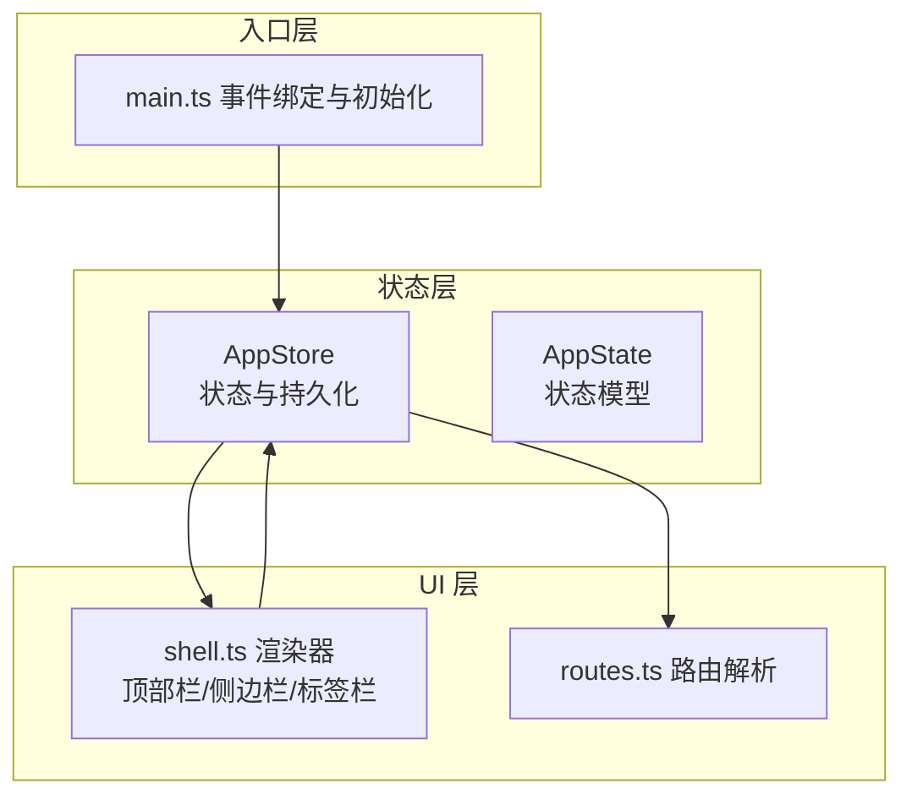
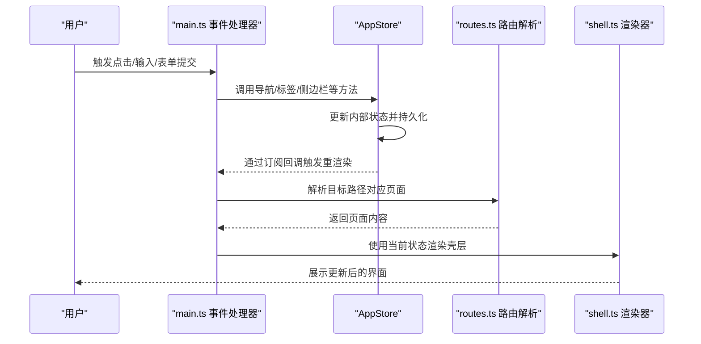
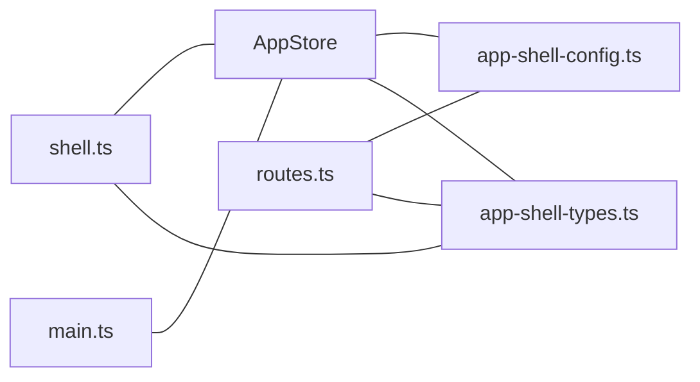

# 状态管理 API

<cite>
**本文引用的文件**
- [src/state/store.ts](file://src/state/store.ts)
- [src/components/shell.ts](file://src/components/shell.ts)
- [src/main.ts](file://src/main.ts)
- [src/router/routes.ts](file://src/router/routes.ts)
- [src/data/app-shell-types.ts](file://src/data/app-shell-types.ts)
- [src/data/app-shell-config.ts](file://src/data/app-shell-config.ts)
</cite>

## 目录
1. [简介](#简介)
2. [项目结构](#项目结构)
3. [核心组件](#核心组件)
4. [架构总览](#架构总览)
5. [详细组件分析](#详细组件分析)
6. [依赖关系分析](#依赖关系分析)
7. [性能考量](#性能考量)
8. [故障排查指南](#故障排查指南)
9. [结论](#结论)
10. [附录](#附录)

## 简介
本文件为 higoods 应用的状态管理 API 参考文档，围绕 appStore 实例提供的公共方法与状态模型进行系统化说明。内容涵盖：
- 状态模型 AppState 的字段与作用
- 所有公共方法的参数、返回值与典型用法
- 响应式机制与订阅者模式的实现原理
- 状态持久化与本地存储键值说明
- 与 UI 组件、路由与事件系统的集成方式

## 项目结构
与状态管理直接相关的核心文件与职责如下：
- src/state/store.ts：定义 AppState、AppStore 类与持久化逻辑
- src/components/shell.ts：渲染壳层 UI（顶部栏、侧边栏、标签栏），读取并驱动状态
- src/main.ts：应用入口，初始化 appStore 并绑定事件到状态变更
- src/router/routes.ts：页面路由解析，配合状态驱动页面内容
- src/data/app-shell-types.ts：壳层类型定义（系统、菜单、标签）
- src/data/app-shell-config.ts：系统与菜单配置

图表来源
- [src/state/store.ts:89-304](file://src/state/store.ts#L89-L304)
- [src/components/shell.ts:292-311](file://src/components/shell.ts#L292-L311)
- [src/main.ts:240-463](file://src/main.ts#L240-L463)
- [src/router/routes.ts:428-453](file://src/router/routes.ts#L428-L453)

章节来源
- [src/state/store.ts:1-329](file://src/state/store.ts#L1-L329)
- [src/components/shell.ts:1-324](file://src/components/shell.ts#L1-L324)
- [src/main.ts:1-933](file://src/main.ts#L1-L933)
- [src/router/routes.ts:1-454](file://src/router/routes.ts#L1-L454)
- [src/data/app-shell-types.ts:1-46](file://src/data/app-shell-types.ts#L1-L46)
- [src/data/app-shell-config.ts:1-355](file://src/data/app-shell-config.ts#L1-L355)

## 核心组件
- AppStore：单例状态容器，负责状态读写、订阅通知、持久化与导航控制
- AppState：应用状态模型，包含路径、侧边栏状态、标签页集合、菜单展开状态等
- 订阅者模式：通过 subscribe 注册监听器，在状态变更时批量触发回调

章节来源
- [src/state/store.ts:89-304](file://src/state/store.ts#L89-L304)
- [src/state/store.ts:4-11](file://src/state/store.ts#L4-L11)

## 架构总览
下图展示从用户交互到状态更新再到 UI 重新渲染的完整流程。

图表来源
- [src/main.ts:376-463](file://src/main.ts#L376-L463)
- [src/state/store.ts:119-139](file://src/state/store.ts#L119-L139)
- [src/router/routes.ts:428-453](file://src/router/routes.ts#L428-L453)
- [src/components/shell.ts:292-311](file://src/components/shell.ts#L292-L311)

## 详细组件分析

### 状态模型 AppState
- 字段说明
  - pathname: string
    - 当前激活路径
  - sidebarOpen: boolean
    - 移动端侧边栏是否打开
  - sidebarCollapsed: boolean
    - 侧边栏是否折叠
  - allTabs: AllSystemTabs
    - 按系统组织的标签页集合
  - expandedGroups: Record<string, boolean>
    - 菜单分组展开状态
  - expandedItems: Record<string, boolean>
    - 菜单项展开状态

- 数据结构关系
  - SystemTabs：包含 systemId、tabs 数组、activeKey
  - Tab：包含 key、title、href、closable
  - MenuGroup/MenuItem：菜单树形结构，支持 children

章节来源
- [src/state/store.ts:4-11](file://src/state/store.ts#L4-L11)
- [src/data/app-shell-types.ts:6-46](file://src/data/app-shell-types.ts#L6-L46)
- [src/data/app-shell-config.ts:21-354](file://src/data/app-shell-config.ts#L21-L354)

### 订阅者模式与响应式机制
- 订阅接口
  - subscribe(listener: () => void): () => void
    - 注册监听器，返回取消订阅函数
- 内部实现
  - 使用 Set 存储监听器
  - 通过 patch 方法合并状态并调用 emit 逐个触发监听器
- 应用场景
  - main.ts 中注册 render 回调，确保 UI 随状态变化自动更新

章节来源
- [src/state/store.ts:119-139](file://src/state/store.ts#L119-L139)
- [src/main.ts:931-932](file://src/main.ts#L931-L932)

### 状态获取与初始化
- getState(): AppState
  - 返回当前状态快照
- init(): void
  - 初始化流程
    - 从本地存储恢复标签页与侧边栏折叠状态
    - 根据 pathname 推断当前系统并校验 activeKey
    - 若无效则回退到系统默认页
    - 同步 pathname 对应的菜单项到标签页

章节来源
- [src/state/store.ts:126-128](file://src/state/store.ts#L126-L128)
- [src/state/store.ts:101-117](file://src/state/store.ts#L101-L117)

### 导航与页面切换
- navigate(pathname: string): void
  - 更新 pathname，并同步标签页；最后通过 patch 通知订阅者
- switchSystem(systemId: string): void
  - 根据系统 ID 定位默认页并导航

章节来源
- [src/state/store.ts:172-178](file://src/state/store.ts#L172-L178)
- [src/state/store.ts:180-184](file://src/state/store.ts#L180-L184)

### 标签页管理
- openTab(tab: Tab): void
  - 将新标签加入当前系统标签集合，设置为活动标签
  - 保存到本地存储并通知订阅者
- activateTab(tabKey: string): void
  - 切换当前系统活动标签，必要时同步 pathname
- closeTab(tabKey: string): void
  - 关闭指定标签；若关闭的是活动标签，按顺序选择下一个或回退到系统默认页
  - 保存到本地存储并通知订阅者

章节来源
- [src/state/store.ts:186-209](file://src/state/store.ts#L186-L209)
- [src/state/store.ts:211-230](file://src/state/store.ts#L211-L230)
- [src/state/store.ts:232-269](file://src/state/store.ts#L232-L269)

### 侧边栏与菜单展开控制
- setSidebarOpen(open: boolean): void
  - 设置移动端侧边栏打开状态
- toggleSidebarCollapsed(): void
  - 切换侧边栏折叠状态，并持久化到本地存储
- toggleGroup(groupKey: string): void
  - 切换菜单分组展开状态
- toggleItem(itemKey: string): void
  - 切换菜单项展开状态

章节来源
- [src/state/store.ts:271-273](file://src/state/store.ts#L271-L273)
- [src/state/store.ts:275-283](file://src/state/store.ts#L275-L283)
- [src/state/store.ts:285-303](file://src/state/store.ts#L285-L303)

### 状态持久化与本地存储键值
- 本地存储键值
  - higood-tabs：存储所有系统的标签页集合（AllSystemTabs）
  - sidebar-collapsed：存储侧边栏折叠状态（布尔字符串）
- 恢复与保存
  - init 时从 localStorage 读取并校验结构，缺失或异常时回退到默认值
  - 打开/关闭标签、切换折叠状态时写入 localStorage

章节来源
- [src/state/store.ts:15-16](file://src/state/store.ts#L15-L16)
- [src/state/store.ts:30-56](file://src/state/store.ts#L30-L56)
- [src/state/store.ts:83-85](file://src/state/store.ts#L83-L85)
- [src/state/store.ts:277-282](file://src/state/store.ts#L277-L282)

### 与 UI 和路由的集成
- 事件绑定
  - main.ts 监听点击、输入、表单提交等事件，将行为转换为对 appStore 的调用
  - 事件处理后调用 render，基于当前状态重新渲染壳层
- 路由解析
  - routes.ts 根据 pathname 返回对应页面内容
  - shell.ts 使用当前状态渲染顶部栏、侧边栏与标签栏

章节来源
- [src/main.ts:376-463](file://src/main.ts#L376-L463)
- [src/main.ts:931-932](file://src/main.ts#L931-L932)
- [src/router/routes.ts:428-453](file://src/router/routes.ts#L428-L453)
- [src/components/shell.ts:292-311](file://src/components/shell.ts#L292-L311)

## 依赖关系分析
- AppStore 依赖
  - 系统与菜单配置：用于推断当前系统、构建菜单与匹配路径
  - 本地存储：用于标签页与侧边栏状态的持久化
- UI 渲染
  - shell.ts 依赖 AppStore 的状态与工具函数（如 getCurrentSystem、getCurrentTabs）
- 事件处理
  - main.ts 依赖 AppStore 的导航与标签页控制方法

图表来源
- [src/state/store.ts:1-2](file://src/state/store.ts#L1-L2)
- [src/components/shell.ts:3-8](file://src/components/shell.ts#L3-L8)
- [src/main.ts:2-3](file://src/main.ts#L2-L3)
- [src/router/routes.ts:1-1](file://src/router/routes.ts#L1-L1)

章节来源
- [src/state/store.ts:1-329](file://src/state/store.ts#L1-L329)
- [src/components/shell.ts:1-324](file://src/components/shell.ts#L1-L324)
- [src/main.ts:1-933](file://src/main.ts#L1-L933)
- [src/router/routes.ts:1-454](file://src/router/routes.ts#L1-L454)
- [src/data/app-shell-types.ts:1-46](file://src/data/app-shell-types.ts#L1-L46)
- [src/data/app-shell-config.ts:1-355](file://src/data/app-shell-config.ts#L1-L355)

## 性能考量
- 状态更新粒度
  - 通过 patch 进行浅合并，避免频繁深拷贝
- 订阅者触发
  - emit 对所有监听器逐一调用，建议在 render 中尽量减少 DOM 操作
- 本地存储
  - 仅在必要时写入（标签页开关、侧边栏折叠），避免高频 I/O
- 路由解析
  - resolvePage 采用精确匹配与动态正则匹配结合，注意正则复杂度

## 故障排查指南
- 标签页不显示或丢失
  - 检查本地存储键 higood-tabs 是否存在且格式正确
  - 若解析失败会回退到空标签集合，确认系统默认页是否有效
- 侧边栏状态不同步
  - 检查 sidebar-collapsed 键值是否为 "true"/"false"
  - 确认 toggleSidebarCollapsed 是否被调用
- 导航无效
  - 确认 navigate 参数 pathname 是否与菜单项 href 匹配
  - 检查 switchSystem 的 systemId 是否存在于系统列表
- UI 不更新
  - 确认已调用 subscribe 注册 render 回调
  - 检查事件处理器是否正确调用 appStore 的方法

章节来源
- [src/state/store.ts:30-56](file://src/state/store.ts#L30-L56)
- [src/state/store.ts:83-85](file://src/state/store.ts#L83-L85)
- [src/main.ts:931-932](file://src/main.ts#L931-L932)

## 结论
appStore 提供了简洁而强大的状态管理能力，覆盖导航、标签页、侧边栏与菜单展开等核心交互。其订阅者模式与本地存储持久化设计使得 UI 能够实时响应状态变化，同时保证用户体验的一致性。通过本文档的方法说明与最佳实践，开发者可以高效地扩展与维护状态管理功能。

## 附录

### 方法速查表
- getState(): AppState
  - 获取当前状态快照
- subscribe(listener: () => void): () => void
  - 注册监听器，返回取消订阅函数
- navigate(pathname: string): void
  - 导航到指定路径，同步标签页
- switchSystem(systemId: string): void
  - 切换到指定系统并跳转到默认页
- openTab(tab: Tab): void
  - 打开新标签并设为活动
- activateTab(tabKey: string): void
  - 激活指定标签
- closeTab(tabKey: string): void
  - 关闭指定标签
- setSidebarOpen(open: boolean): void
  - 设置移动端侧边栏打开状态
- toggleSidebarCollapsed(): void
  - 切换侧边栏折叠状态并持久化
- toggleGroup(groupKey: string): void
  - 切换菜单分组展开状态
- toggleItem(itemKey: string): void
  - 切换菜单项展开状态

章节来源
- [src/state/store.ts:126-128](file://src/state/store.ts#L126-L128)
- [src/state/store.ts:119-139](file://src/state/store.ts#L119-L139)
- [src/state/store.ts:172-178](file://src/state/store.ts#L172-L178)
- [src/state/store.ts:180-184](file://src/state/store.ts#L180-L184)
- [src/state/store.ts:186-209](file://src/state/store.ts#L186-L209)
- [src/state/store.ts:211-230](file://src/state/store.ts#L211-L230)
- [src/state/store.ts:232-269](file://src/state/store.ts#L232-L269)
- [src/state/store.ts:271-273](file://src/state/store.ts#L271-L273)
- [src/state/store.ts:275-283](file://src/state/store.ts#L275-L283)
- [src/state/store.ts:285-303](file://src/state/store.ts#L285-L303)