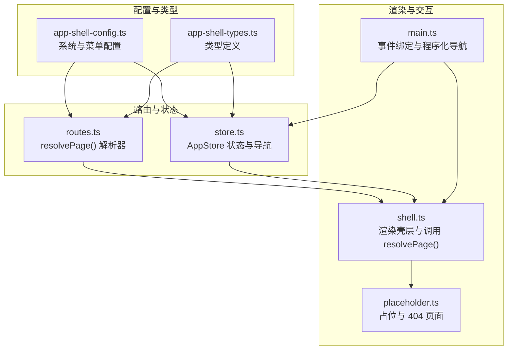
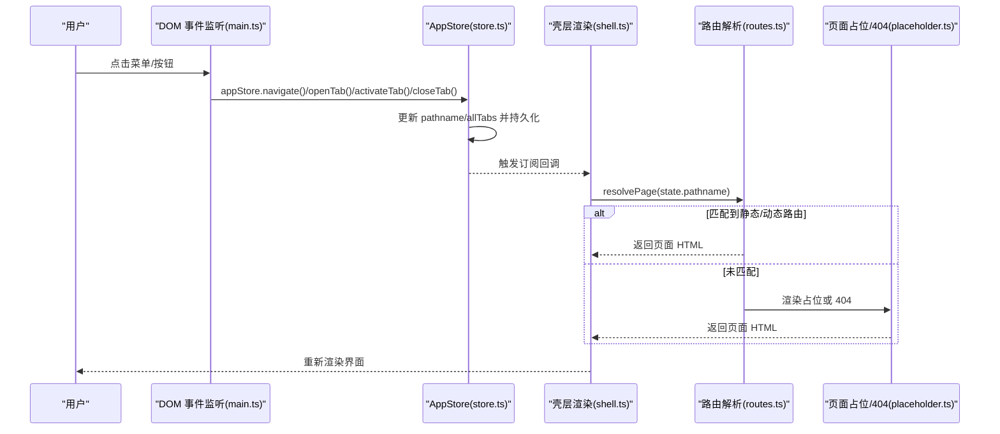
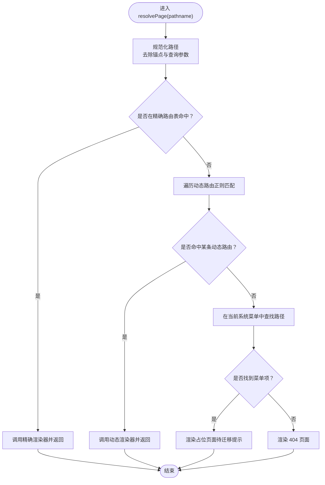
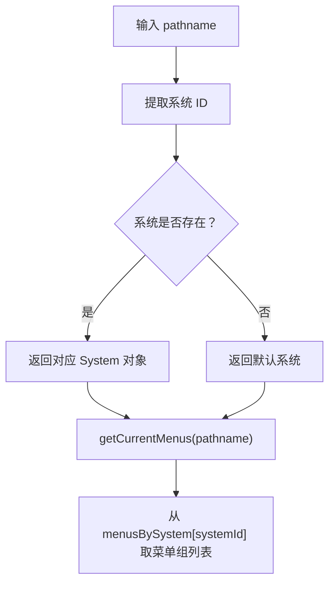
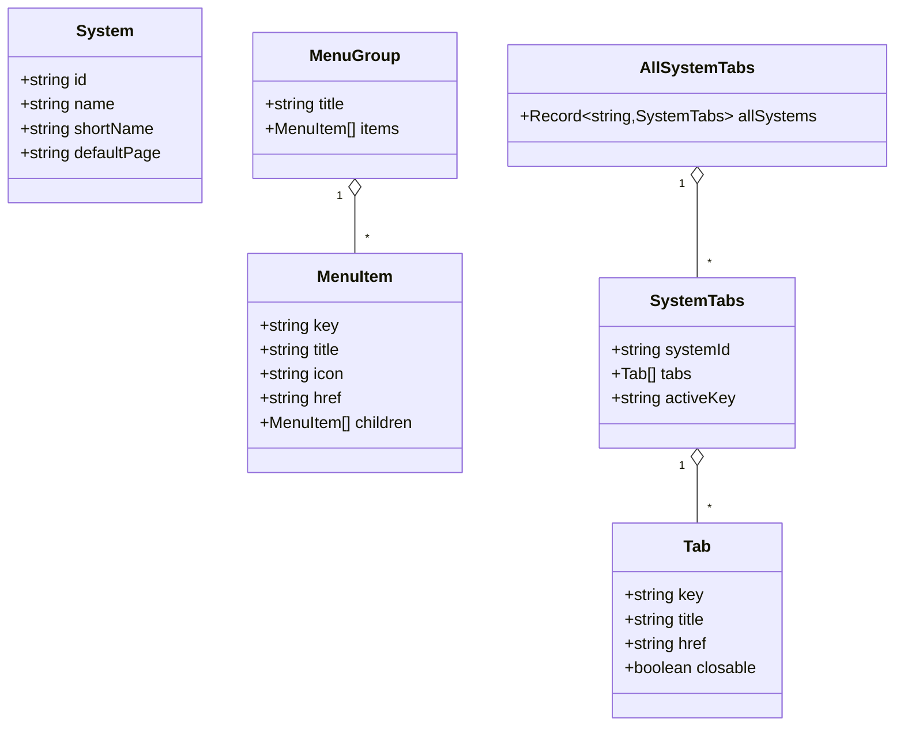
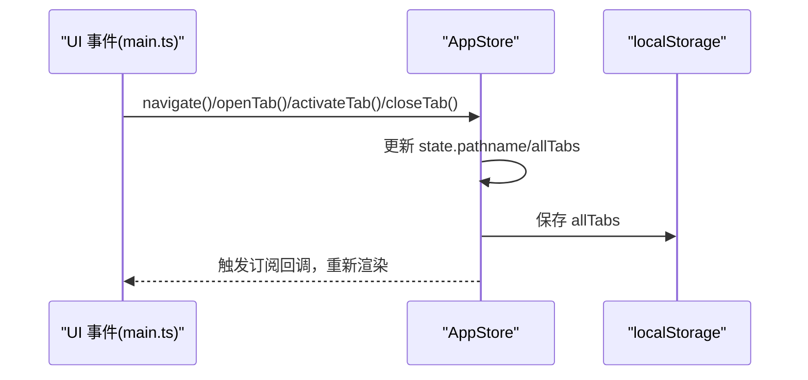
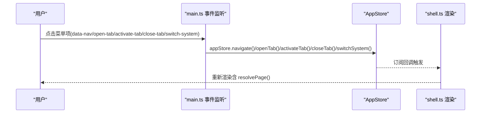
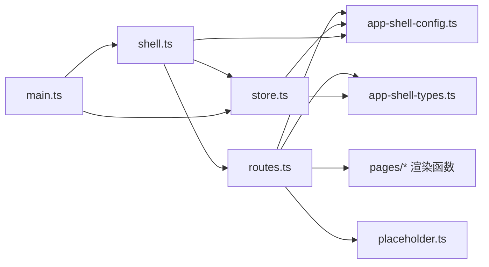

# 路由 API

<cite>
**本文引用的文件**   
- [routes.ts](file://src/router/routes.ts)
- [store.ts](file://src/state/store.ts)
- [app-shell-config.ts](file://src/data/app-shell-config.ts)
- [app-shell-types.ts](file://src/data/app-shell-types.ts)
- [shell.ts](file://src/components/shell.ts)
- [placeholder.ts](file://src/pages/placeholder.ts)
- [main.ts](file://src/main.ts)
</cite>

## 目录
1. [简介](#简介)
2. [项目结构](#项目结构)
3. [核心组件](#核心组件)
4. [架构总览](#架构总览)
5. [详细组件分析](#详细组件分析)
6. [依赖关系分析](#依赖关系分析)
7. [性能考量](#性能考量)
8. [故障排查指南](#故障排查指南)
9. [结论](#结论)
10. [附录](#附录)

## 简介
本文件为 higoods 项目的路由 API 参考文档，重点覆盖以下主题：
- resolvePage() 页面解析函数的使用方法：参数类型、返回值、调用方式与行为。
- 路由系统如何处理静态路由映射与动态路由匹配。
- getCurrentSystem() 与 getCurrentMenus() 如何根据当前路径获取系统信息与菜单配置。
- 路由配置的数据结构说明：System、MenuGroup、MenuItem、Tab 等类型定义。
- 路由变化时的状态同步机制：如何将路由变化反映到标签页系统中。
- 程序化导航的完整示例：如何在代码中进行页面跳转与路由控制。
- 路由解析的优先级与匹配规则。

## 项目结构
路由与导航相关的关键文件分布如下：
- 路由解析与页面渲染：src/router/routes.ts
- 应用状态与标签页：src/state/store.ts
- 导航配置与菜单：src/data/app-shell-config.ts
- 类型定义：src/data/app-shell-types.ts
- 组件壳层渲染：src/components/shell.ts
- 占位与 404 页面：src/pages/placeholder.ts
- 事件绑定与程序化导航入口：src/main.ts

**图表来源**
- [routes.ts:428-453](file://src/router/routes.ts#L428-L453)
- [store.ts:89-304](file://src/state/store.ts#L89-L304)
- [app-shell-config.ts:8-355](file://src/data/app-shell-config.ts#L8-L355)
- [app-shell-types.ts:6-46](file://src/data/app-shell-types.ts#L6-L46)
- [shell.ts:292-311](file://src/components/shell.ts#L292-L311)
- [placeholder.ts:3-32](file://src/pages/placeholder.ts#L3-L32)
- [main.ts:376-463](file://src/main.ts#L376-L463)

**章节来源**
- [routes.ts:1-454](file://src/router/routes.ts#L1-L454)
- [store.ts:1-329](file://src/state/store.ts#L1-L329)
- [app-shell-config.ts:1-355](file://src/data/app-shell-config.ts#L1-L355)
- [app-shell-types.ts:1-46](file://src/data/app-shell-types.ts#L1-L46)
- [shell.ts:1-324](file://src/components/shell.ts#L1-L324)
- [placeholder.ts:1-33](file://src/pages/placeholder.ts#L1-L33)
- [main.ts:1-933](file://src/main.ts#L1-L933)

## 核心组件
- 路由解析器：resolvePage(pathname) 将当前路径解析为对应页面字符串，支持静态精确匹配与动态正则匹配，并回退到菜单占位或 404。
- 应用状态与导航：AppStore 提供 navigate()、openTab()、activateTab()、closeTab() 等方法；并维护 pathname、所有系统标签页、侧边栏状态等。
- 导航配置：系统列表与菜单树通过 menusBySystem 与 System 定义，用于获取当前系统与菜单、以及标签页同步。
- 壳层渲染：renderAppShell() 调用 resolvePage() 渲染页面主体，同时渲染顶部系统切换、侧边菜单与标签栏。
- 程序化导航：main.ts 中监听点击与表单事件，触发 appStore.navigate()/openTab()/activateTab()/closeTab() 实现路由控制。

**章节来源**
- [routes.ts:428-453](file://src/router/routes.ts#L428-L453)
- [store.ts:172-269](file://src/state/store.ts#L172-L269)
- [app-shell-config.ts:8-355](file://src/data/app-shell-config.ts#L8-L355)
- [shell.ts:292-311](file://src/components/shell.ts#L292-L311)
- [main.ts:376-463](file://src/main.ts#L376-L463)

## 架构总览
路由与状态同步的整体流程如下：

**图表来源**
- [main.ts:376-463](file://src/main.ts#L376-L463)
- [store.ts:172-269](file://src/state/store.ts#L172-L269)
- [shell.ts:292-311](file://src/components/shell.ts#L292-L311)
- [routes.ts:428-453](file://src/router/routes.ts#L428-L453)
- [placeholder.ts:3-32](file://src/pages/placeholder.ts#L3-L32)

## 详细组件分析

### resolvePage() 页面解析函数
- 功能：根据传入的 pathname，返回对应页面的 HTML 字符串。
- 参数
  - pathname: string（URL 路径）
- 返回值
  - string（页面 HTML 片段）
- 调用方式
  - 在壳层渲染中直接调用：resolvePage(state.pathname)
- 匹配规则与优先级
  1) 规范化路径：移除查询参数与锚点后进行匹配。
  2) 精确静态路由：exactRoutes 中的键完全匹配。
  3) 动态路由：遍历 dynamicRoutes，按顺序执行正则匹配，命中即返回渲染结果。
  4) 菜单占位：若路径存在于当前系统菜单中，则渲染占位页面（提示待迁移）。
  5) 默认 404：否则返回“页面未找到”。
- 关键实现位置
  - 路径规范化：normalizePathname()
  - 精确路由映射：exactRoutes
  - 动态路由映射：dynamicRoutes
  - 菜单查找：findMenuByPath()
  - 最终渲染：renderPlaceholderPage() 与 renderRouteNotFound()

**图表来源**
- [routes.ts:108-110](file://src/router/routes.ts#L108-L110)
- [routes.ts:112-325](file://src/router/routes.ts#L112-L325)
- [routes.ts:327-404](file://src/router/routes.ts#L327-L404)
- [routes.ts:406-426](file://src/router/routes.ts#L406-L426)
- [routes.ts:428-453](file://src/router/routes.ts#L428-L453)

**章节来源**
- [routes.ts:108-110](file://src/router/routes.ts#L108-L110)
- [routes.ts:112-325](file://src/router/routes.ts#L112-L325)
- [routes.ts:327-404](file://src/router/routes.ts#L327-L404)
- [routes.ts:406-426](file://src/router/routes.ts#L406-L426)
- [routes.ts:428-453](file://src/router/routes.ts#L428-L453)

### getCurrentSystem() 与 getCurrentMenus()
- getCurrentSystem(pathname)
  - 输入：pathname: string
  - 输出：System（当前系统对象）
  - 行为：从 pathname 中提取系统 ID，返回系统列表中的对应项，若不存在则回退到默认系统。
- getCurrentMenus(pathname)
  - 输入：pathname: string
  - 输出：MenuGroup[]（当前系统菜单组列表）
  - 行为：基于 getCurrentSystem() 获取当前系统 ID，再从 menusBySystem 中取对应菜单数组。
- 使用场景：壳层渲染顶部系统切换、侧边菜单渲染、标签栏渲染。

**图表来源**
- [store.ts:58-63](file://src/state/store.ts#L58-L63)
- [store.ts:308-316](file://src/state/store.ts#L308-L316)
- [app-shell-config.ts:21-355](file://src/data/app-shell-config.ts#L21-L355)

**章节来源**
- [store.ts:58-63](file://src/state/store.ts#L58-L63)
- [store.ts:308-316](file://src/state/store.ts#L308-L316)
- [app-shell-config.ts:21-355](file://src/data/app-shell-config.ts#L21-L355)

### 路由配置数据结构
- System
  - id: string（系统标识）
  - name: string（系统全名）
  - shortName: string（简称）
  - defaultPage: string（默认页面路径）
- MenuGroup
  - title: string（分组标题）
  - items: MenuItem[]
- MenuItem
  - key: string（唯一键）
  - title: string（菜单标题）
  - icon?: string（图标名）
  - href?: string（菜单链接）
  - children?: MenuItem[]（子菜单）
- Tab
  - key: string（标签键）
  - title: string（标签标题）
  - href: string（标签链接）
  - closable: boolean（是否可关闭）
- SystemTabs
  - systemId: string
  - tabs: Tab[]
  - activeKey: string
- AllSystemTabs
  - Record<string, SystemTabs>（按系统 ID 索引）

**图表来源**
- [app-shell-types.ts:6-46](file://src/data/app-shell-types.ts#L6-L46)

**章节来源**
- [app-shell-types.ts:6-46](file://src/data/app-shell-types.ts#L6-L46)

### 路由变化与标签页状态同步
- 同步逻辑
  - 当调用 navigate(pathname) 或 openTab(tab) 时，AppStore 会：
    1) 更新 pathname；
    2) 调用 syncTabWithPath(pathname)，根据当前系统与菜单项自动添加/激活标签；
    3) 持久化 allTabs 至本地存储；
    4) 通过 patch() 通知订阅者重新渲染。
- 关键方法
  - navigate(pathname)
  - openTab(tab)
  - activateTab(tabKey)
  - closeTab(tabKey)
  - syncTabWithPath(pathname)

**图表来源**
- [store.ts:172-269](file://src/state/store.ts#L172-L269)
- [store.ts:141-170](file://src/state/store.ts#L141-L170)
- [main.ts:376-463](file://src/main.ts#L376-L463)

**章节来源**
- [store.ts:141-170](file://src/state/store.ts#L141-L170)
- [store.ts:172-269](file://src/state/store.ts#L172-L269)
- [main.ts:376-463](file://src/main.ts#L376-L463)

### 程序化导航示例
- 点击导航
  - 在 main.ts 中，当捕获到带 data-nav 的元素时，调用 appStore.navigate() 切换页面。
- 打开新标签
  - 当菜单项有子项或需要新开标签时，通过 data-action="open-tab" 传递 tabHref/tabKey/tabTitle，调用 appStore.openTab()。
- 切换/关闭标签
  - 通过 data-action="activate-tab" 与 data-action="close-tab" 分别调用 appStore.activateTab()/closeTab()。
- 切换系统
  - 通过 data-action="switch-system" 与 data-system-id 切换系统并回到该系统默认页。

**图表来源**
- [main.ts:376-463](file://src/main.ts#L376-L463)
- [store.ts:172-269](file://src/state/store.ts#L172-L269)
- [shell.ts:292-311](file://src/components/shell.ts#L292-L311)

**章节来源**
- [main.ts:376-463](file://src/main.ts#L376-L463)
- [store.ts:172-269](file://src/state/store.ts#L172-L269)
- [shell.ts:292-311](file://src/components/shell.ts#L292-L311)

## 依赖关系分析
- routes.ts 依赖：
  - app-shell-config.ts（menusBySystem、系统默认页）
  - app-shell-types.ts（MenuGroup、MenuItem）
  - pages 下各页面渲染函数（精确路由映射）
  - placeholder.ts（占位与 404）
- store.ts 依赖：
  - app-shell-config.ts（systems、menusBySystem）
  - app-shell-types.ts（AllSystemTabs、Tab）
  - localStorage（标签页持久化）
- shell.ts 依赖：
  - routes.ts（resolvePage）
  - store.ts（getCurrentSystem/getCurrentMenus/getCurrentTabs）
  - app-shell-config.ts（systems）
  - utils.ts（工具函数）
- main.ts 依赖：
  - store.ts（导航与标签操作）
  - shell.ts（渲染壳层）

**图表来源**
- [routes.ts:1-104](file://src/router/routes.ts#L1-L104)
- [store.ts:1-28](file://src/state/store.ts#L1-L28)
- [shell.ts:2-11](file://src/components/shell.ts#L2-L11)
- [main.ts:232-240](file://src/main.ts#L232-L240)

**章节来源**
- [routes.ts:1-104](file://src/router/routes.ts#L1-L104)
- [store.ts:1-28](file://src/state/store.ts#L1-L28)
- [shell.ts:2-11](file://src/components/shell.ts#L2-L11)
- [main.ts:232-240](file://src/main.ts#L232-L240)

## 性能考量
- 路由匹配复杂度
  - 精确路由：O(1) 查找（对象键访问）。
  - 动态路由：O(n) 正则匹配（n 为动态路由条目数），建议控制动态路由数量与正则复杂度。
- 标签页同步
  - 每次 navigate/openTab/activateTab/closeTab 均会写入 localStorage，频繁操作可能带来 I/O 开销；可通过批量更新或节流优化。
- 渲染开销
  - resolvePage() 返回字符串后由 shell.ts 渲染，避免重复 DOM 操作；如需进一步优化，可在上层引入虚拟 DOM 或组件化渲染。

[本节为通用指导，无需特定文件来源]

## 故障排查指南
- 路由未命中
  - 检查 pathname 是否包含锚点或查询参数；resolvePage() 已做规范化处理，但确保传入的是最终目标路径。
  - 确认 exactRoutes 与 dynamicRoutes 中是否存在对应映射。
- 菜单占位页面
  - 若路径存在于菜单但未实现具体页面，将显示“待迁移”占位页面；请完善对应页面渲染函数。
- 标签页未同步
  - 确认 pathname 是否能被 findMenuItemByPath() 正确解析为菜单项；检查当前系统与菜单配置。
  - 检查 localStorage 是否可用，标签页持久化失败会导致初始化异常。
- 程序化导航无效
  - 确认事件绑定是否正确（data-nav、data-action 等属性）；检查 main.ts 中的事件监听与 appStore 方法调用。

**章节来源**
- [routes.ts:406-426](file://src/router/routes.ts#L406-L426)
- [store.ts:141-170](file://src/state/store.ts#L141-L170)
- [main.ts:376-463](file://src/main.ts#L376-L463)

## 结论
higoods 的路由系统采用“精确静态 + 动态正则”的双轨匹配策略，并通过 AppStore 将路由变化与标签页状态进行强一致同步。配合壳层渲染与程序化导航，实现了清晰、可扩展的前端路由体验。建议在动态路由较多时关注匹配顺序与正则性能，并对标签页写入进行必要的节流与错误兜底。

[本节为总结性内容，无需特定文件来源]

## 附录

### API 速查
- resolvePage(pathname: string): string
  - 用途：将路径解析为页面 HTML。
  - 优先级：精确路由 > 动态路由 > 菜单占位 > 404。
- getCurrentSystem(pathname: string): System
  - 用途：获取当前系统对象。
- getCurrentMenus(pathname: string): MenuGroup[]
  - 用途：获取当前系统菜单组列表。
- getCurrentTabs(pathname: string, allTabs: AllSystemTabs): { tabs: Tab[], activeKey: string }
  - 用途：获取当前系统标签页集合与活动键。
- 程序化导航
  - appStore.navigate(pathname)
  - appStore.openTab(tab)
  - appStore.activateTab(tabKey)
  - appStore.closeTab(tabKey)
  - appStore.switchSystem(systemId)

**章节来源**
- [routes.ts:428-453](file://src/router/routes.ts#L428-L453)
- [store.ts:308-328](file://src/state/store.ts#L308-L328)
- [main.ts:376-463](file://src/main.ts#L376-L463)