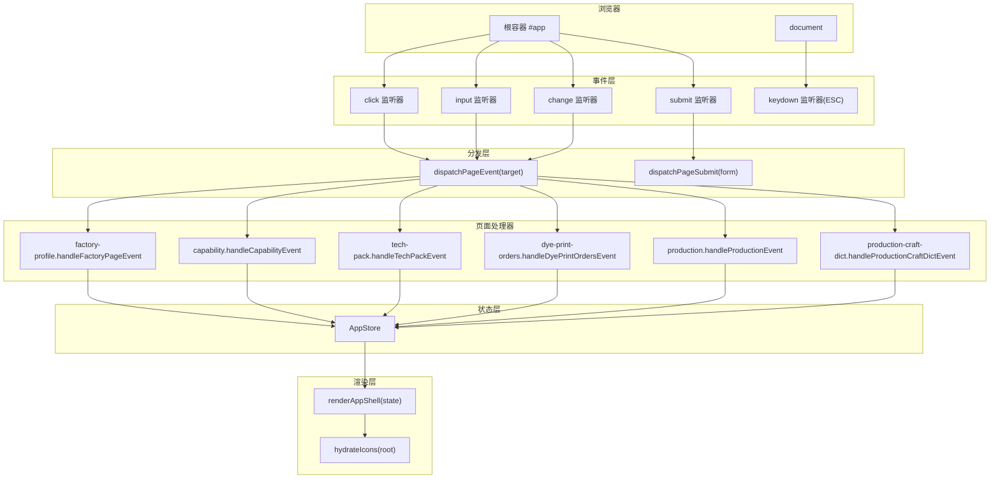
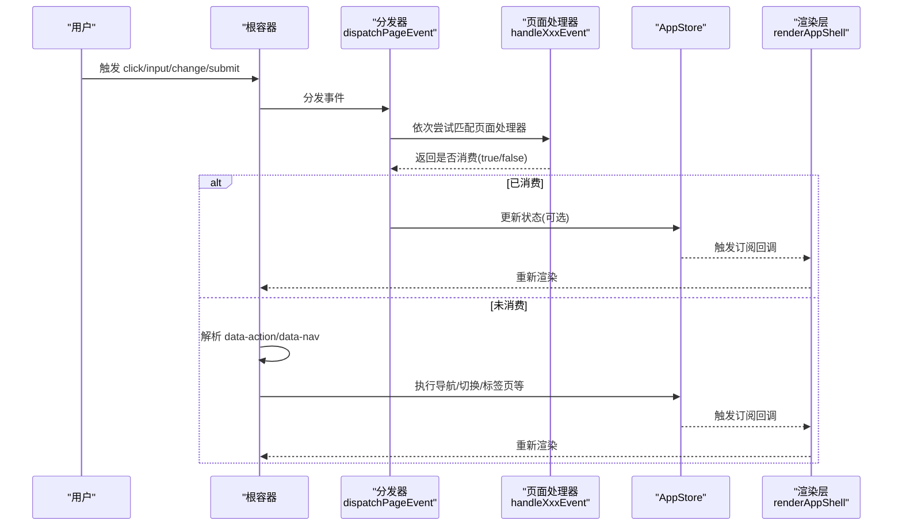
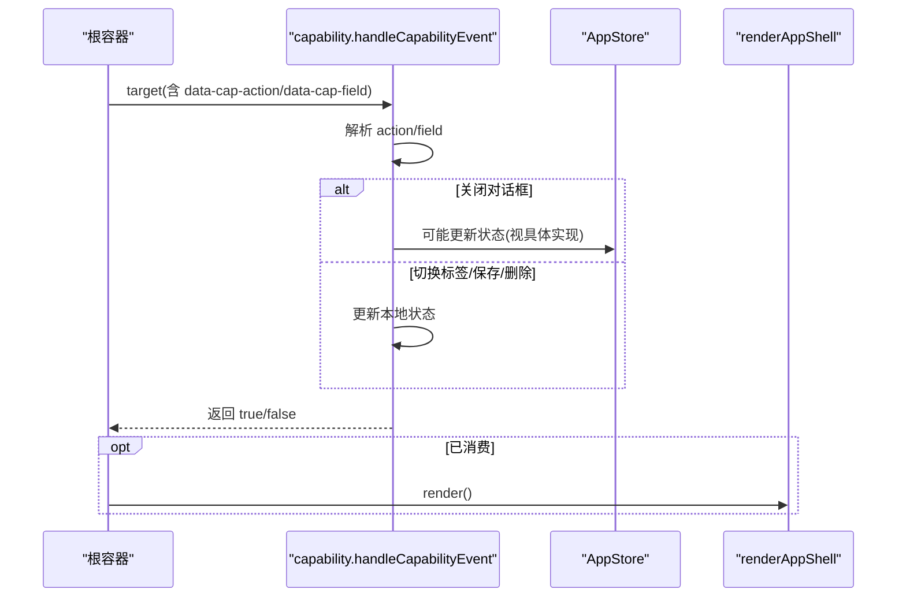
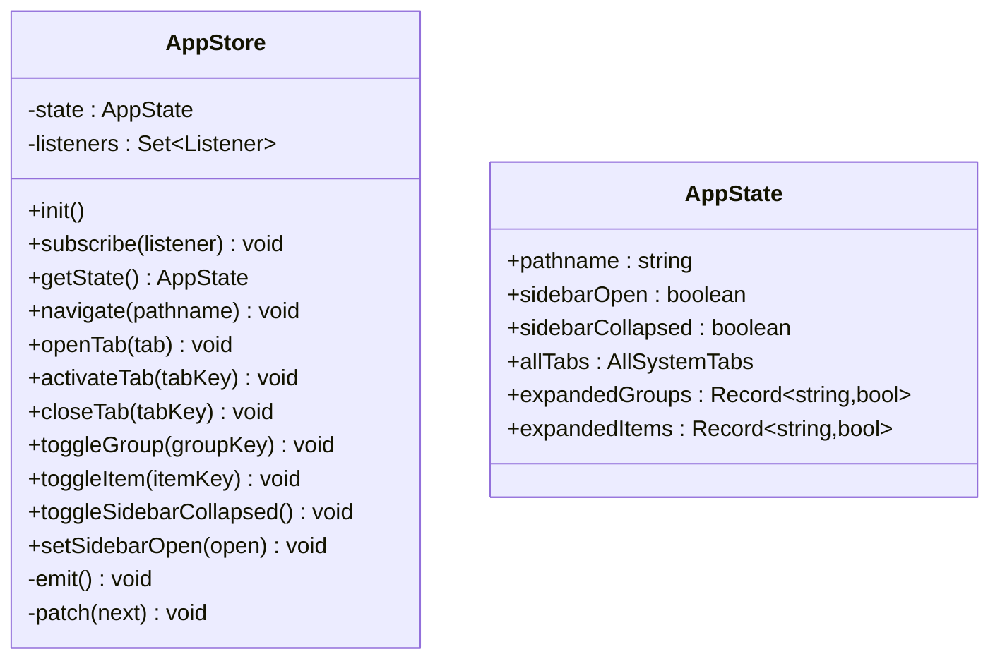
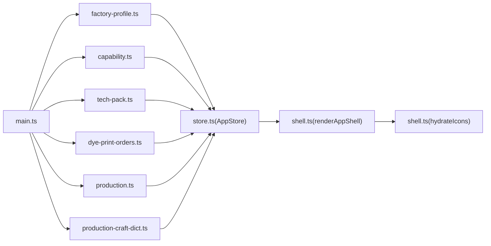

# 事件处理系统

<cite>
**本文档引用的文件**
- [src/main.ts](file://src/main.ts)
- [src/state/store.ts](file://src/state/store.ts)
- [src/components/shell.ts](file://src/components/shell.ts)
- [src/utils.ts](file://src/utils.ts)
- [src/pages/factory-profile.ts](file://src/pages/factory-profile.ts)
- [src/pages/capability.ts](file://src/pages/capability.ts)
- [src/pages/tech-pack.ts](file://src/pages/tech-pack.ts)
- [src/pages/dye-print-orders.ts](file://src/pages/dye-print-orders.ts)
- [src/pages/production-craft-dict.ts](file://src/pages/production-craft-dict.ts)
- [src/pages/production.ts](file://src/pages/production.ts)
</cite>

## 目录
1. [简介](#简介)
2. [项目结构](#项目结构)
3. [核心组件](#核心组件)
4. [架构总览](#架构总览)
5. [详细组件分析](#详细组件分析)
6. [依赖关系分析](#依赖关系分析)
7. [性能考量](#性能考量)
8. [故障排查指南](#故障排查指南)
9. [结论](#结论)
10. [附录](#附录)

## 简介
本项目采用基于 dataset 的事件驱动架构，通过在 DOM 元素上声明性地使用 data-* 属性（如 data-action、data-field、data-filter 等）来传递事件信息与处理参数，结合集中式事件分发器与应用状态管理，实现从用户交互到状态更新再到页面渲染的完整闭环。该设计遵循事件委托模式，将事件监听器集中在根节点，减少内存占用并提升可维护性。

## 项目结构
事件处理系统的核心由以下部分组成：
- 入口与事件分发：在根节点注册点击、输入、变更、提交等事件监听器，并通过 dispatchPageEvent 与 dispatchPageSubmit 将事件委派给具体页面处理器。
- 页面级事件处理器：每个页面模块导出 handleXxxEvent 与 handleXxxSubmit/isXxxDialogOpen 等函数，负责解析 dataset 并更新本地状态。
- 应用状态管理：AppStore 提供全局状态与订阅机制，统一管理路由、侧边栏、标签页等系统级状态。
- Shell 渲染：根据 AppStore 状态生成应用外壳（顶部栏、侧边栏、标签栏），并在每次状态变化后重新渲染。
- 工具函数：提供 HTML 转义、类名拼接、时间格式化等通用工具。



图表来源
- [src/main.ts:376-491](file://src/main.ts#L376-L491)
- [src/main.ts:242-327](file://src/main.ts#L242-L327)
- [src/state/store.ts:89-304](file://src/state/store.ts#L89-L304)
- [src/components/shell.ts:292-324](file://src/components/shell.ts#L292-L324)

章节来源
- [src/main.ts:232-332](file://src/main.ts#L232-L332)
- [src/state/store.ts:89-304](file://src/state/store.ts#L89-L304)
- [src/components/shell.ts:292-324](file://src/components/shell.ts#L292-L324)

## 核心组件
- 事件分发器（根节点监听）
  - 在根容器上注册 click/input/change/submit 监听器，统一进行事件分发与渲染控制。
  - 对于 click 事件，优先尝试 dispatchPageEvent；若未命中页面处理器，则检查 data-nav 进行导航；否则解析 data-action 执行应用状态操作。
  - 对于 input/change 事件，调用 dispatchPageEvent 后触发渲染。
  - 对于 submit 事件，调用 dispatchPageSubmit 并阻止默认提交。
- 页面事件处理器
  - 每个页面模块导出 handleXxxEvent 与 handleXxxSubmit/isXxxDialogOpen 等函数，内部通过 closest 匹配带特定 dataset 的元素，解析 action/field/filter 等键值，更新本地状态。
  - 处理器返回布尔值表示是否消费了该事件，用于分发器决定是否继续后续处理。
- 应用状态管理（AppStore）
  - 维护 pathname、侧边栏开关/折叠、标签页集合、菜单展开状态等。
  - 提供 navigate/openTab/activateTab/closeTab/toggleSidebarCollapsed 等方法，支持持久化与路径同步。
- Shell 渲染
  - 根据 AppStore 状态生成外壳结构，包含顶部栏、侧边栏、标签栏与主内容区。
  - 渲染完成后调用 hydrateIcons 进行图标初始化。

章节来源
- [src/main.ts:376-491](file://src/main.ts#L376-L491)
- [src/main.ts:242-327](file://src/main.ts#L242-L327)
- [src/state/store.ts:89-304](file://src/state/store.ts#L89-L304)
- [src/components/shell.ts:292-324](file://src/components/shell.ts#L292-L324)

## 架构总览
事件处理系统采用“事件委托 + 命令式分发 + 状态驱动渲染”的架构模式：
- 事件委托：根节点统一监听，避免为每个元素单独绑定监听器。
- 命令式分发：dispatchPageEvent/dispatchPageSubmit 将事件按顺序委派给各页面处理器，首个返回 true 的处理器即视为已消费事件。
- 状态驱动：页面处理器更新本地状态或 AppStore，触发订阅者回调，最终统一渲染。



图表来源
- [src/main.ts:376-491](file://src/main.ts#L376-L491)
- [src/main.ts:242-327](file://src/main.ts#L242-L327)
- [src/state/store.ts:119-139](file://src/state/store.ts#L119-L139)
- [src/components/shell.ts:292-324](file://src/components/shell.ts#L292-L324)

## 详细组件分析

### 事件分发与委托（main.ts）
- 事件监听
  - click：优先 dispatchPageEvent；若未消费且存在 data-nav 则执行导航；否则解析 data-action 执行应用状态操作。
  - input/change：调用 dispatchPageEvent 后触发渲染。
  - submit：调用 dispatchPageSubmit 并阻止默认提交。
  - keydown(ESC)：根据当前对话框状态，构造虚拟按钮并调用对应页面处理器关闭对话框。
- 事件旁路策略
  - shouldBypassClickDispatch 针对原生表单控件（input/select/textarea/option）与带有特定 dataset 的字段/过滤器控件进行旁路，避免重复触发全量渲染。
- 数据集解析
  - hasDatasetAction/hasDatasetFieldLike 用于判断元素是否绑定了动作或字段/过滤器相关 dataset，辅助旁路策略与事件消费判定。

```mermaid
flowchart TD
Start(["事件进入"]) --> Type{"事件类型？"}
Type --> |click| Click["dispatchPageEvent(target)"]
Type --> |input/change| PageEvt["dispatchPageEvent(target)"]
Type --> |submit| SubmitEvt["dispatchPageSubmit(target)"]
Type --> |keydown(ESC)| ESC["根据对话框状态构造虚拟按钮并调用处理器"]
Click --> Dispatched{"是否被页面处理器消费？"}
Dispatched --> |是| Render["render()"]
Dispatched --> |否| Nav{"是否存在 data-nav？"}
Nav --> |是| Navigate["appStore.navigate()"]
Nav --> |否| Action{"是否存在 data-action？"}
Action --> |是| ApplyAction["解析 action 并执行 AppStore 操作"]
Action --> |否| End(["结束"])
PageEvt --> Render
SubmitEvt --> Prevent["preventDefault()"] --> Render
Navigate --> Render
ApplyAction --> Render
Render --> End
```

图表来源
- [src/main.ts:376-491](file://src/main.ts#L376-L491)
- [src/main.ts:351-374](file://src/main.ts#L351-L374)
- [src/main.ts:341-349](file://src/main.ts#L341-L349)

章节来源
- [src/main.ts:376-491](file://src/main.ts#L376-L491)
- [src/main.ts:351-374](file://src/main.ts#L351-L374)
- [src/main.ts:341-349](file://src/main.ts#L341-L349)

### 页面事件处理器（以 capability 为例）
- 事件匹配
  - 使用 closest 查找带 data-cap-action/data-cap-field 的元素，解析 action/field 键值。
- 动作处理
  - 如打开/关闭对话框、切换标签、保存/删除条目、重置筛选等。
- 表单提交
  - 通过 handleCapabilitySubmit 处理表单提交，返回布尔值表示是否消费。



图表来源
- [src/pages/capability.ts:650-750](file://src/pages/capability.ts#L650-L750)
- [src/main.ts:376-491](file://src/main.ts#L376-L491)

章节来源
- [src/pages/capability.ts:650-750](file://src/pages/capability.ts#L650-L750)

### 页面事件处理器（以 factory-profile 为例）
- 事件匹配
  - 使用 data-factory-action/data-factory-field 等 dataset。
- 动作处理
  - 编辑/删除工厂、分页跳转、排序切换、对话框开关等。
- 表单提交
  - 通过 handleFactoryPageSubmit 处理表单提交。

章节来源
- [src/pages/factory-profile.ts:640-695](file://src/pages/factory-profile.ts#L640-L695)
- [src/pages/factory-profile.ts:1472-1520](file://src/pages/factory-profile.ts#L1472-L1520)

### 页面事件处理器（以 tech-pack 为例）
- 事件匹配
  - 使用 data-tech-action 等 dataset。
- 动作处理
  - 切换标签、打开/关闭发布/添加图案对话框、保存/删除图案等。

章节来源
- [src/pages/tech-pack.ts:2613-2706](file://src/pages/tech-pack.ts#L2613-L2706)

### 页面事件处理器（以 dye-print-orders 为例）
- 事件匹配
  - 使用 data-dye-action/data-dye-field 等 dataset。
- 动作处理
  - 打开/关闭创建/退回对话框、清空对话框、保存草稿等。
- 字段更新
  - 通过 data-dye-field 解析字段名并更新状态。

章节来源
- [src/pages/dye-print-orders.ts:1146-1207](file://src/pages/dye-print-orders.ts#L1146-L1207)

### 页面事件处理器（以 production-craft-dict 为例）
- 事件匹配
  - 使用 data-craft-dict-action/data-craft-dict-field 等 dataset。
- 动作处理
  - 清除筛选、切换标签、打开/关闭详情面板等。
- 字段更新
  - 通过 data-craft-dict-field 解析字段名并更新状态。

章节来源
- [src/pages/production-craft-dict.ts:1047-1091](file://src/pages/production-craft-dict.ts#L1047-L1091)

### 页面事件处理器（以 production 为例）
- 字段更新
  - 通过 data-prod-field 等 dataset 解析字段名并更新状态，如需求状态、技术包状态、优先级、工厂筛选等。

章节来源
- [src/pages/production.ts:4377-4434](file://src/pages/production.ts#L4377-L4434)

### 应用状态管理（AppStore）
- 订阅与发布
  - subscribe 注册监听器，patch 触发 emit 通知所有监听器。
- 导航与标签页
  - navigate/openTab/activateTab/closeTab 支持路径同步与持久化。
- 菜单与侧边栏
  - toggleGroup/toggleItem/toggleSidebarCollapsed/setSidebarOpen 等控制菜单展开与侧边栏状态。



图表来源
- [src/state/store.ts:89-304](file://src/state/store.ts#L89-L304)

章节来源
- [src/state/store.ts:89-304](file://src/state/store.ts#L89-L304)

### Shell 渲染与图标初始化
- renderAppShell 根据 AppStore 状态生成外壳结构。
- hydrateIcons 初始化图标库，确保渲染后的 SVG 图标正确显示。

章节来源
- [src/components/shell.ts:292-324](file://src/components/shell.ts#L292-L324)

## 依赖关系分析
- main.ts 依赖各页面事件处理器模块，形成“根节点监听 → 页面处理器 → AppStore → 渲染”的链路。
- 页面处理器内部可能直接更新本地状态，也可能通过 AppStore 修改全局状态。
- AppStore 与 renderAppShell 形成单向数据流：状态变更 → 订阅回调 → 重新渲染。



图表来源
- [src/main.ts:1-231](file://src/main.ts#L1-L231)
- [src/state/store.ts:89-304](file://src/state/store.ts#L89-L304)
- [src/components/shell.ts:292-324](file://src/components/shell.ts#L292-L324)

章节来源
- [src/main.ts:1-231](file://src/main.ts#L1-L231)
- [src/state/store.ts:89-304](file://src/state/store.ts#L89-L304)
- [src/components/shell.ts:292-324](file://src/components/shell.ts#L292-L324)

## 性能考量
- 事件委托与旁路策略
  - 通过 shouldBypassClickDispatch 对原生控件与字段/过滤器控件进行旁路，避免不必要的全量渲染，减少闪烁与焦点丢失。
- 最小化渲染范围
  - 仅在事件被页面处理器消费或应用状态发生变更时触发 render，降低重绘成本。
- 状态持久化
  - AppStore 将标签页与侧边栏折叠状态持久化至 localStorage，减少初始化开销。
- 图标初始化
  - hydrateIcons 仅在渲染后调用，避免重复扫描文档。

章节来源
- [src/main.ts:351-374](file://src/main.ts#L351-L374)
- [src/state/store.ts:30-56](file://src/state/store.ts#L30-L56)
- [src/components/shell.ts:313-324](file://src/components/shell.ts#L313-L324)

## 故障排查指南
- 事件未响应
  - 检查元素是否正确设置 data-action 或 data-field 等 dataset。
  - 确认 closest 是否能匹配到带 dataset 的父元素。
  - 排查 shouldBypassClickDispatch 是否误判导致旁路。
- 默认行为未阻止
  - 确认 submit 事件是否被 dispatchPageSubmit 消费并调用 preventDefault。
- 导航不生效
  - 检查 data-nav 是否存在且值有效；确认 AppStore.navigate 是否被调用。
- ESC 关闭无效
  - 确认 isXxxDialogOpen 函数返回正确状态；检查对应的 fakeButton 创建与 dataset 设置。
- 渲染异常
  - 确保 render 被调用；检查 AppStore.subscribe 是否有监听器；确认 renderAppShell 输出正确。

章节来源
- [src/main.ts:376-491](file://src/main.ts#L376-L491)
- [src/main.ts:493-800](file://src/main.ts#L493-L800)

## 结论
本事件处理系统通过 dataset 驱动的事件委托模式，实现了清晰、可扩展的事件处理机制。页面处理器专注于业务逻辑，AppStore 统一管理状态，Shell 负责渲染，三者职责明确、耦合度低。配合旁路策略与最小化渲染，系统具备良好的性能与可维护性。扩展新页面事件时，建议遵循现有命名规范与处理模式，确保一致性与可测试性。

## 附录

### 事件处理最佳实践
- 命名规范
  - 动作：data-xxx-action
  - 字段：data-xxx-field
  - 过滤器：data-xxx-filter
  - 表单：data-xxx-form
- 事件消费
  - 处理器应尽早返回，避免多余计算；仅在真正消费事件时返回 true。
- 默认行为
  - 表单提交必须调用 preventDefault；非表单交互可按需阻止默认行为。
- 旁路策略
  - 对原生控件与字段/过滤器控件使用旁路，避免重复触发全量渲染。
- 状态更新
  - 优先通过 AppStore 更新系统级状态；局部状态在页面模块内维护。
- 渲染控制
  - 仅在必要时调用 render，避免频繁重绘。

### 如何注册新的事件处理器
- 在目标页面模块中：
  - 定义 handleXxxEvent(target: HTMLElement): boolean，解析 data-xxx-action 与 data-xxx-field。
  - 若涉及表单提交，定义 handleXxxSubmit(form: HTMLFormElement): boolean。
  - 若存在对话框状态，定义 isXxxDialogOpen(): boolean。
- 在 main.ts 中：
  - 引入新页面的处理器与 isXxxDialogOpen。
  - 在 dispatchPageEvent/dispatchPageSubmit 中加入对应调用。
  - 在 keydown(ESC) 分支中加入关闭逻辑。

章节来源
- [src/main.ts:1-231](file://src/main.ts#L1-L231)
- [src/main.ts:242-327](file://src/main.ts#L242-L327)
- [src/main.ts:493-800](file://src/main.ts#L493-L800)