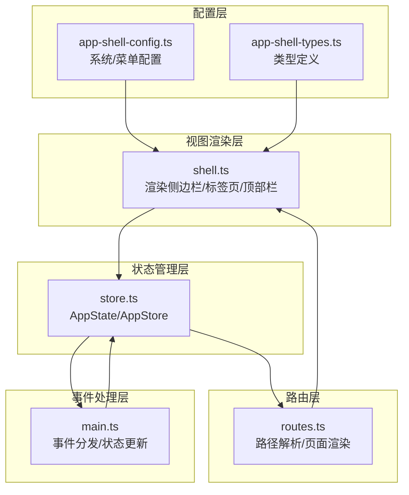
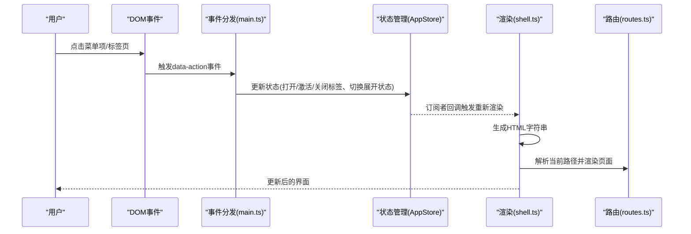
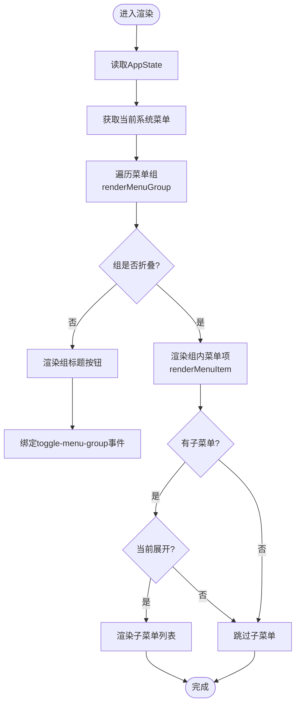
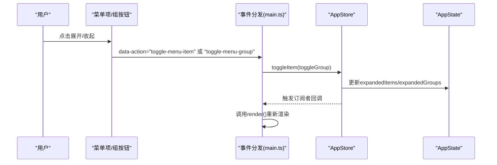
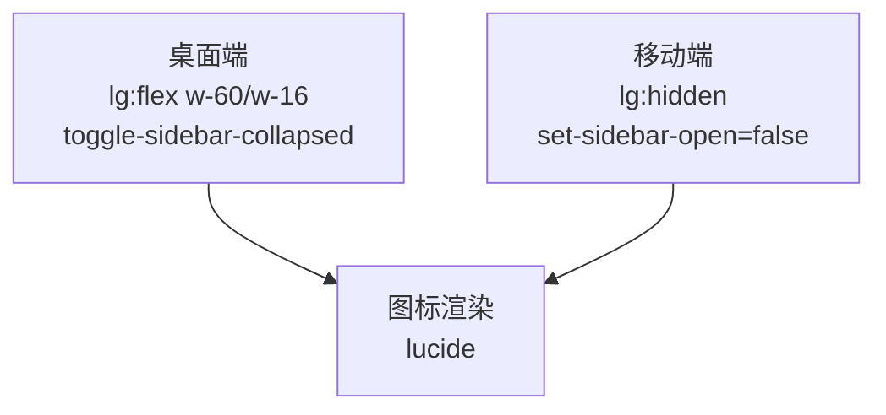
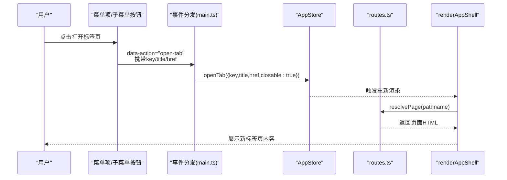
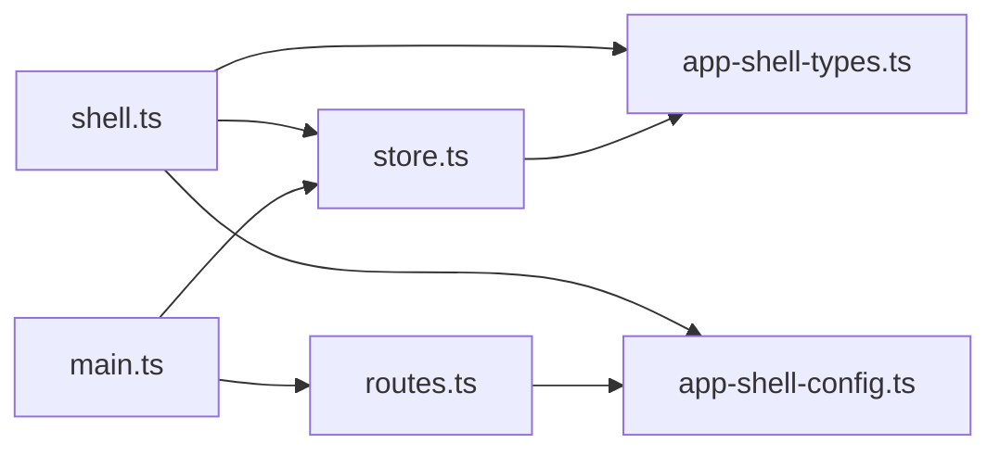

# 侧边栏菜单系统

<cite>
**本文档引用的文件**
- [src/components/shell.ts](file://src/components/shell.ts)
- [src/state/store.ts](file://src/state/store.ts)
- [src/data/app-shell-config.ts](file://src/data/app-shell-config.ts)
- [src/data/app-shell-types.ts](file://src/data/app-shell-types.ts)
- [src/router/routes.ts](file://src/router/routes.ts)
- [src/main.ts](file://src/main.ts)
- [src/pages/placeholder.ts](file://src/pages/placeholder.ts)
</cite>

## 目录
1. [简介](#简介)
2. [项目结构](#项目结构)
3. [核心组件](#核心组件)
4. [架构总览](#架构总览)
5. [详细组件分析](#详细组件分析)
6. [依赖关系分析](#依赖关系分析)
7. [性能考量](#性能考量)
8. [故障排查指南](#故障排查指南)
9. [结论](#结论)
10. [附录](#附录)

## 简介
本技术文档围绕前端应用的侧边栏菜单系统进行深入解析，涵盖菜单渲染的完整流程、菜单组的折叠展开机制、菜单项的层级结构处理、响应式设计策略，以及菜单与标签页系统的集成方式。文档还提供新增菜单项、权限控制与菜单搜索功能的实践指导，并通过序列图和流程图直观展示关键交互。

## 项目结构
侧边栏菜单系统由以下模块协作完成：
- 视图渲染层：负责将状态转换为HTML字符串，包含菜单组、菜单项、图标、标签页条等。
- 状态管理层：集中管理当前路径、侧边栏开关与折叠状态、各系统标签页集合、展开的菜单组与菜单项。
- 配置层：定义系统、菜单组与菜单项的数据结构及各系统的菜单树。
- 路由层：根据路径解析页面内容，支持精确路由与动态路由。
- 事件处理层：监听DOM事件，调用状态管理器更新状态并触发重新渲染。

图表来源
- [src/components/shell.ts:292-324](file://src/components/shell.ts#L292-L324)
- [src/state/store.ts:89-304](file://src/state/store.ts#L89-L304)
- [src/data/app-shell-config.ts:1-355](file://src/data/app-shell-config.ts#L1-L355)
- [src/data/app-shell-types.ts:1-46](file://src/data/app-shell-types.ts#L1-L46)
- [src/router/routes.ts:428-454](file://src/router/routes.ts#L428-L454)
- [src/main.ts:400-476](file://src/main.ts#L400-L476)

章节来源
- [src/components/shell.ts:292-324](file://src/components/shell.ts#L292-L324)
- [src/state/store.ts:89-304](file://src/state/store.ts#L89-L304)
- [src/data/app-shell-config.ts:1-355](file://src/data/app-shell-config.ts#L1-L355)
- [src/data/app-shell-types.ts:1-46](file://src/data/app-shell-types.ts#L1-L46)
- [src/router/routes.ts:428-454](file://src/router/routes.ts#L428-L454)
- [src/main.ts:400-476](file://src/main.ts#L400-L476)

## 核心组件
- 渲染函数
  - renderMenuItem：渲染单个菜单项，支持子菜单展开/收起、激活态高亮、图标渲染、移动端紧凑模式。
  - renderMenuGroup：渲染菜单组标题与分隔线，控制组内所有菜单项的展开/收起。
  - renderSidebarContent/renderSidebar：根据状态决定桌面端与移动端布局，支持侧边栏折叠宽度切换。
  - renderTabsBar：渲染当前系统下的标签页条，支持激活态与可关闭标签。
  - renderAppShell：组合顶部栏、侧边栏与主内容区。
- 状态管理
  - AppState：包含当前路径、侧边栏开关与折叠状态、各系统标签页集合、展开的菜单组与菜单项。
  - AppStore：提供导航、切换系统、打开/激活/关闭标签、切换侧边栏、切换菜单组/菜单项展开状态等方法。
- 配置与类型
  - 系统与菜单配置：按系统组织菜单树，支持多级子菜单。
  - 类型定义：System、MenuItem、MenuGroup、Tab、SystemTabs、AllSystemTabs。

章节来源
- [src/components/shell.ts:81-148](file://src/components/shell.ts#L81-L148)
- [src/components/shell.ts:150-183](file://src/components/shell.ts#L150-L183)
- [src/components/shell.ts:185-251](file://src/components/shell.ts#L185-L251)
- [src/components/shell.ts:253-290](file://src/components/shell.ts#L253-L290)
- [src/components/shell.ts:292-324](file://src/components/shell.ts#L292-L324)
- [src/state/store.ts:4-11](file://src/state/store.ts#L4-L11)
- [src/state/store.ts:89-304](file://src/state/store.ts#L89-L304)
- [src/data/app-shell-config.ts:21-355](file://src/data/app-shell-config.ts#L21-L355)
- [src/data/app-shell-types.ts:6-46](file://src/data/app-shell-types.ts#L6-L46)

## 架构总览
侧边栏菜单系统采用“状态驱动视图”的架构模式：
- 状态驱动：AppStore集中维护AppState，任何UI变化都通过调用AppStore的方法更新状态。
- 事件驱动：main.ts监听DOM事件，根据data-action分发到对应的状态更新逻辑。
- 渲染驱动：shell.ts将AppState转换为HTML字符串，再由hydrateIcons注入图标资源。
- 路由驱动：routes.ts根据路径解析页面内容，与菜单项形成闭环。

图表来源
- [src/main.ts:400-476](file://src/main.ts#L400-L476)
- [src/state/store.ts:136-178](file://src/state/store.ts#L136-L178)
- [src/components/shell.ts:292-324](file://src/components/shell.ts#L292-L324)
- [src/router/routes.ts:428-454](file://src/router/routes.ts#L428-L454)

## 详细组件分析

### 渲染流程与状态控制
- 菜单项渲染(renderMenuItem)
  - 判断是否有子菜单、当前是否展开、是否处于激活或子项激活状态，据此设置按钮样式与箭头方向。
  - 在非折叠模式下，若存在子菜单且已展开，则渲染子菜单列表，每个子项独立触发打开标签页。
  - 支持移动端紧凑模式：仅显示图标，title作为按钮title属性。
- 菜单组渲染(renderMenuGroup)
  - 使用“索引+标题”构造唯一groupKey，从AppState.expandedGroups读取展开状态，默认展开。
  - 若处于折叠模式，直接渲染组内所有菜单项，不显示组标题与分隔线。
  - 非折叠模式下，组标题按钮绑定toggle-menu-group事件，点击切换该组展开状态。
- 侧边栏内容与布局(renderSidebarContent/renderSidebar)
  - 桌面端：根据sidebarCollapsed切换宽度(w-60/w-16)，显示系统名称与折叠按钮。
  - 移动端：根据sidebarOpen决定是否弹出遮罩层与侧边栏容器。
- 标签页条渲染(renderTabsBar)
  - 从当前系统标签集合中提取tabs与activeKey，渲染可关闭标签，激活标签带底部高亮条。

图表来源
- [src/components/shell.ts:150-183](file://src/components/shell.ts#L150-L183)
- [src/components/shell.ts:81-148](file://src/components/shell.ts#L81-L148)
- [src/state/store.ts:95-96](file://src/state/store.ts#L95-L96)

章节来源
- [src/components/shell.ts:81-148](file://src/components/shell.ts#L81-L148)
- [src/components/shell.ts:150-183](file://src/components/shell.ts#L150-L183)
- [src/components/shell.ts:185-251](file://src/components/shell.ts#L185-L251)
- [src/components/shell.ts:253-290](file://src/components/shell.ts#L253-L290)
- [src/state/store.ts:95-96](file://src/state/store.ts#L95-L96)

### 折叠展开机制
- 菜单组展开控制
  - 组展开状态来源于AppState.expandedGroups[groupKey]，默认值为true。
  - 用户点击组标题按钮触发toggle-menu-group，AppStore.toggleGroup更新expandedGroups并触发重新渲染。
- 菜单项展开控制
  - 项展开状态来源于AppState.expandedItems[itemKey]，初始为空对象。
  - 用户点击菜单项按钮触发toggle-menu-item，AppStore.toggleItem更新expandedItems并触发重新渲染。
- 侧边栏折叠控制
  - Desktop模式下，点击折叠按钮触发toggle-sidebar-collapsed，AppStore.toggleSidebarCollapsed写入localStorage并更新sidebarCollapsed。
  - 折叠后菜单项仅显示图标，title作为按钮title；组标题隐藏。

图表来源
- [src/main.ts:423-433](file://src/main.ts#L423-L433)
- [src/state/store.ts:285-303](file://src/state/store.ts#L285-L303)
- [src/state/store.ts:95-96](file://src/state/store.ts#L95-L96)

章节来源
- [src/main.ts:423-433](file://src/main.ts#L423-L433)
- [src/state/store.ts:285-303](file://src/state/store.ts#L285-L303)
- [src/state/store.ts:95-96](file://src/state/store.ts#L95-L96)

### 响应式设计
- 桌面端
  - 侧边栏宽度随折叠状态切换，使用Tailwind类控制宽度与过渡动画。
  - 组标题显示系统名称与折叠按钮，折叠时仅显示图标。
- 移动端
  - 通过sidebarOpen控制遮罩层与侧边栏容器的显示，点击遮罩层可关闭侧边栏。
  - 侧边栏内容在移动端始终以完整模式渲染，不支持折叠。

图表来源
- [src/components/shell.ts:230-251](file://src/components/shell.ts#L230-L251)
- [src/components/shell.ts:185-227](file://src/components/shell.ts#L185-L227)
- [src/main.ts:413-421](file://src/main.ts#L413-L421)

章节来源
- [src/components/shell.ts:230-251](file://src/components/shell.ts#L230-L251)
- [src/components/shell.ts:185-227](file://src/components/shell.ts#L185-L227)
- [src/main.ts:413-421](file://src/main.ts#L413-L421)

### 菜单与标签页集成
- 打开标签页(open-tab)
  - 菜单项或子菜单项按钮绑定open-tab事件，携带tab-key、tab-title、tab-href。
  - main.ts调用appStore.openTab，将新标签加入当前系统标签集合并设为激活。
- 激活标签页(activate-tab)
  - 点击标签页按钮触发activate-tab，更新当前系统activeKey并同步路径。
- 关闭标签页(close-tab)
  - 点击标签页关闭按钮触发close-tab，若关闭的是激活标签，自动选择相邻标签或回退到系统默认页。
- 路由与页面渲染
  - routes.ts根据当前路径解析页面内容，支持精确路由与动态路由，找不到路由时返回占位页或404。

图表来源
- [src/main.ts:435-450](file://src/main.ts#L435-L450)
- [src/state/store.ts:186-209](file://src/state/store.ts#L186-L209)
- [src/router/routes.ts:428-454](file://src/router/routes.ts#L428-L454)
- [src/components/shell.ts:292-324](file://src/components/shell.ts#L292-L324)

章节来源
- [src/main.ts:435-450](file://src/main.ts#L435-L450)
- [src/state/store.ts:186-209](file://src/state/store.ts#L186-L209)
- [src/router/routes.ts:428-454](file://src/router/routes.ts#L428-L454)
- [src/components/shell.ts:292-324](file://src/components/shell.ts#L292-L324)

### 菜单搜索功能
- 当前实现
  - 侧边栏菜单未内置搜索过滤逻辑，渲染时直接遍历当前系统菜单树。
- 实现建议
  - 在shell.ts中增加一个搜索输入框，监听input事件，将搜索词存入AppState。
  - 在renderMenuGroup/renderMenuItem中根据搜索词过滤匹配的菜单项，支持标题模糊匹配与层级展开。
  - 可结合本地存储恢复上次搜索状态，提升用户体验。

章节来源
- [src/components/shell.ts:185-227](file://src/components/shell.ts#L185-L227)
- [src/state/store.ts:4-11](file://src/state/store.ts#L4-L11)

### 新增菜单项与权限控制
- 新增菜单项
  - 在app-shell-config.ts的menusBySystem中为目标系统添加MenuItem或子菜单项，确保包含key、title、icon、href。
  - 若需要权限控制，可在渲染时根据用户权限动态决定是否渲染该菜单项或其子项。
- 权限控制
  - 在shell.ts渲染逻辑中增加权限判断分支，仅当用户具备相应权限时才渲染对应菜单项。
  - 可结合状态管理器的权限状态字段，实现细粒度的菜单可见性控制。

章节来源
- [src/data/app-shell-config.ts:21-355](file://src/data/app-shell-config.ts#L21-L355)
- [src/components/shell.ts:81-148](file://src/components/shell.ts#L81-L148)

## 依赖关系分析
- 组件耦合
  - shell.ts依赖store.ts的状态与类型定义，同时依赖app-shell-config.ts提供的菜单配置。
  - main.ts依赖store.ts进行状态更新，依赖routes.ts进行页面解析。
- 外部依赖
  - 图标库：lucide通过hydrateIcons初始化，图标名称转换为kebab-case。
  - 本地存储：用于持久化标签页集合与侧边栏折叠状态。

图表来源
- [src/components/shell.ts:1-12](file://src/components/shell.ts#L1-L12)
- [src/state/store.ts:1-11](file://src/state/store.ts#L1-L11)
- [src/data/app-shell-config.ts:1-7](file://src/data/app-shell-config.ts#L1-L7)
- [src/data/app-shell-types.ts:1-6](file://src/data/app-shell-types.ts#L1-L6)
- [src/router/routes.ts:1-10](file://src/router/routes.ts#L1-L10)
- [src/main.ts:1-10](file://src/main.ts#L1-L10)

章节来源
- [src/components/shell.ts:1-12](file://src/components/shell.ts#L1-L12)
- [src/state/store.ts:1-11](file://src/state/store.ts#L1-L11)
- [src/data/app-shell-config.ts:1-7](file://src/data/app-shell-config.ts#L1-L7)
- [src/data/app-shell-types.ts:1-6](file://src/data/app-shell-types.ts#L1-L6)
- [src/router/routes.ts:1-10](file://src/router/routes.ts#L1-L10)
- [src/main.ts:1-10](file://src/main.ts#L1-L10)

## 性能考量
- 渲染优化
  - 将菜单树扁平化与路径查找逻辑集中在store.ts，避免每次渲染重复计算。
  - 使用CSS类名拼接工具函数减少字符串拼接开销。
- 状态更新
  - 通过局部patch更新expandedGroups/expandedItems，避免全量替换状态导致不必要的重渲染。
- 存储与缓存
  - 标签页集合与侧边栏状态使用localStorage持久化，减少初始化时的计算与网络请求。

## 故障排查指南
- 菜单无法展开/收起
  - 检查data-action是否正确绑定，确认groupKey/itemKey是否唯一且与状态一致。
  - 查看AppStore.toggleGroup/toggleItem是否被调用，确认expandedGroups/expandedItems更新成功。
- 标签页未正确打开/激活
  - 检查open-tab事件参数是否包含key/title/href，确认appStore.openTab/activateTab调用顺序。
  - 确认routes.ts中是否存在对应路径的渲染器，否则会返回占位页或404。
- 侧边栏折叠状态异常
  - 检查toggle-sidebar-collapsed事件是否触发，确认localStorage写入成功且sidebarCollapsed状态更新。

章节来源
- [src/main.ts:423-450](file://src/main.ts#L423-L450)
- [src/state/store.ts:275-283](file://src/state/store.ts#L275-L283)
- [src/router/routes.ts:428-454](file://src/router/routes.ts#L428-L454)
- [src/pages/placeholder.ts:25-32](file://src/pages/placeholder.ts#L25-L32)

## 结论
侧边栏菜单系统通过清晰的状态驱动与事件分发机制，实现了菜单组与菜单项的灵活展开/收起、响应式布局适配、以及与标签页系统的无缝集成。配合配置层的菜单树定义与路由层的路径解析，系统具备良好的扩展性与可维护性。未来可在菜单搜索与权限控制方面进一步增强，以满足更复杂的业务场景。

## 附录
- 代码片段路径参考
  - [renderMenuItem实现:81-148](file://src/components/shell.ts#L81-L148)
  - [renderMenuGroup实现:150-183](file://src/components/shell.ts#L150-L183)
  - [AppStore状态管理:89-304](file://src/state/store.ts#L89-L304)
  - [菜单配置示例:21-355](file://src/data/app-shell-config.ts#L21-L355)
  - [路由解析逻辑:428-454](file://src/router/routes.ts#L428-454)
  - [事件分发入口:400-476](file://src/main.ts#L400-476)