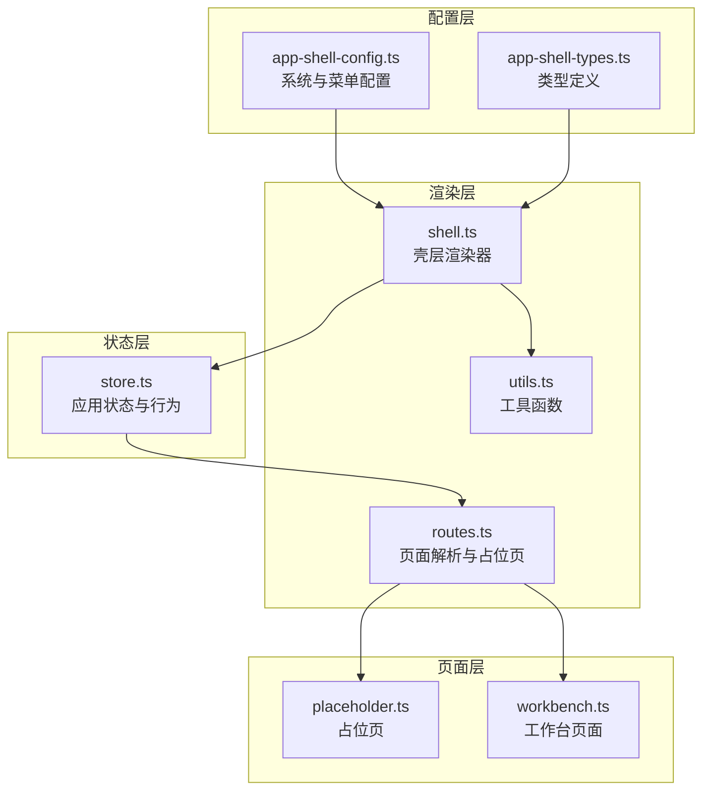
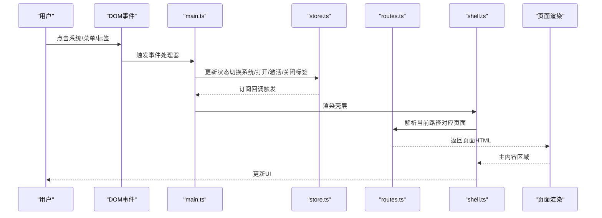
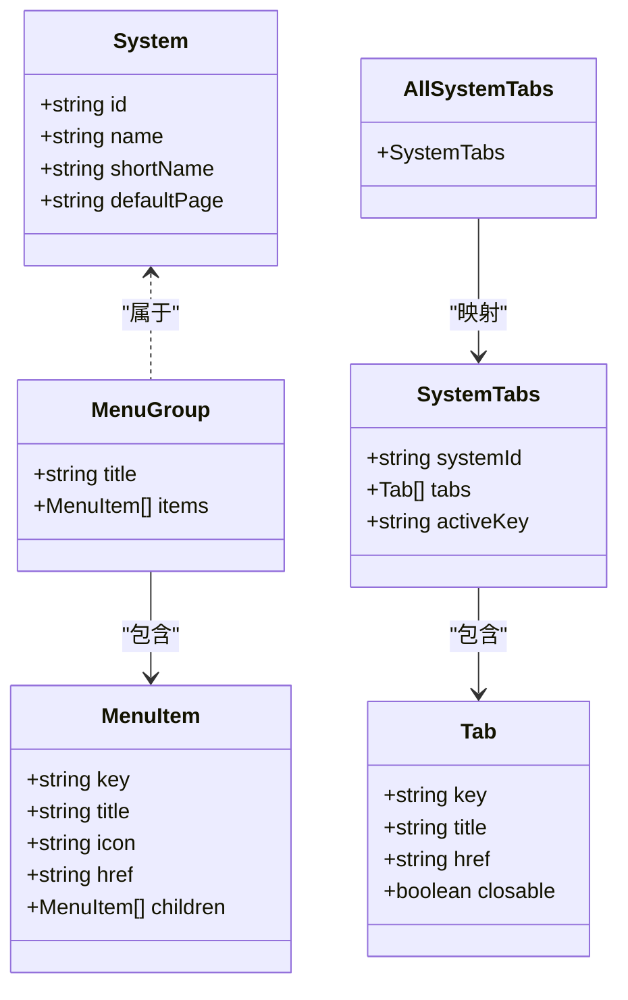
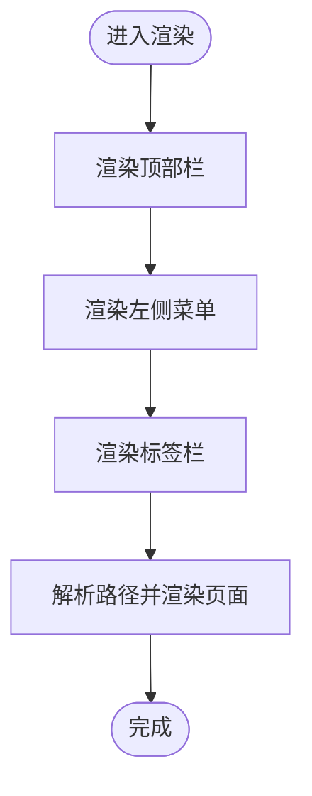
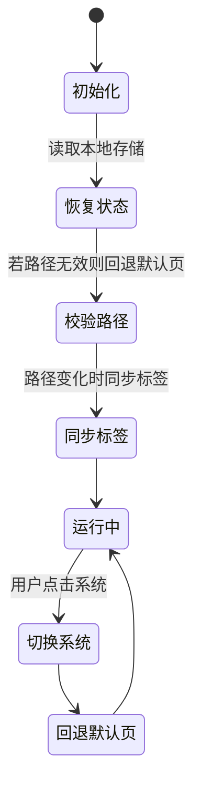
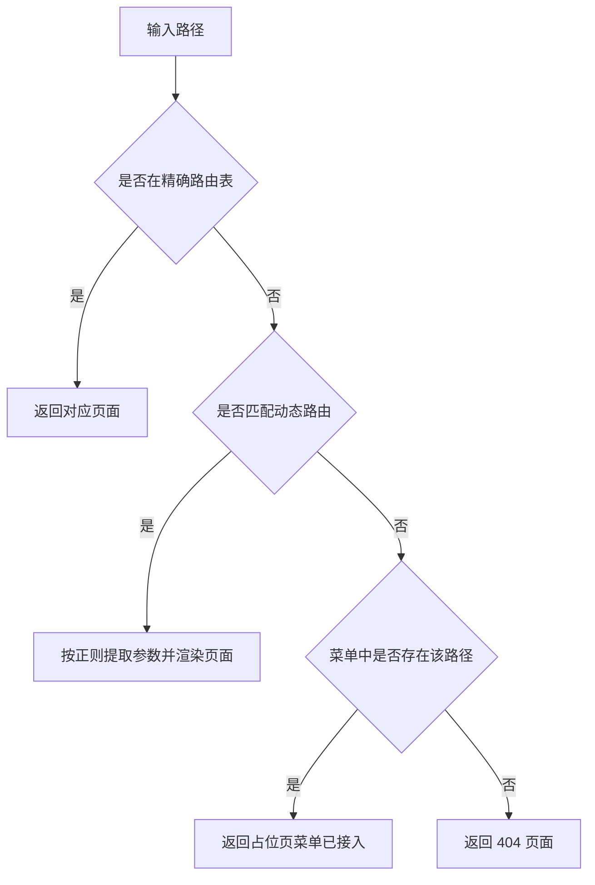
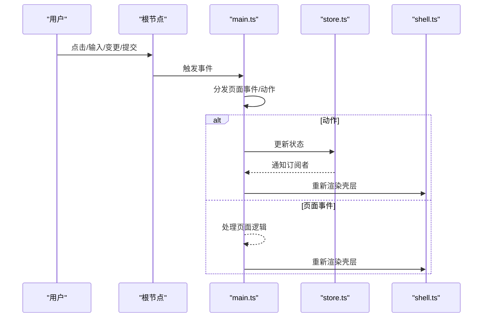
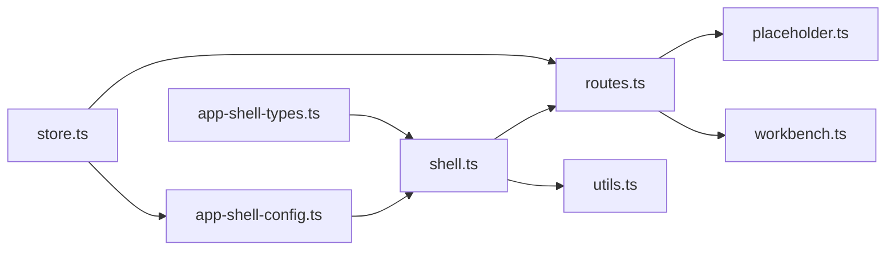

# 应用壳层系统

<cite>
**本文引用的文件**
- [app-shell-config.ts](file://src/data/app-shell-config.ts)
- [app-shell-types.ts](file://src/data/app-shell-types.ts)
- [shell.ts](file://src/components/shell.ts)
- [routes.ts](file://src/router/routes.ts)
- [store.ts](file://src/state/store.ts)
- [utils.ts](file://src/utils.ts)
- [placeholder.ts](file://src/pages/placeholder.ts)
- [workbench.ts](file://src/pages/workbench.ts)
- [main.ts](file://src/main.ts)
</cite>

## 目录
1. [简介](#简介)
2. [项目结构](#项目结构)
3. [核心组件](#核心组件)
4. [架构总览](#架构总览)
5. [详细组件分析](#详细组件分析)
6. [依赖关系分析](#依赖关系分析)
7. [性能考量](#性能考量)
8. [故障排查指南](#故障排查指南)
9. [结论](#结论)
10. [附录](#附录)

## 简介
本文件面向应用壳层系统，系统性梳理其架构设计与实现细节，重点覆盖：
- 顶部栏、左侧菜单系统、标签页管理的实现机制
- app-shell-config.ts 的系统配置与菜单定义
- shell.ts 的渲染逻辑（系统切换、菜单更新、默认页面加载）
- 如何通过配置文件动态生成菜单结构
- 与状态管理、路由系统的集成方式
- 扩展新系统或菜单项的实际步骤与最佳实践

## 项目结构
壳层系统采用“配置驱动 + 渲染器 + 状态管理 + 路由解析”的分层组织方式：
- 配置层：系统与菜单配置集中于配置文件，便于维护与扩展
- 渲染层：以函数式渲染的方式生成壳层 UI 结构
- 状态层：集中管理路径、侧边栏状态、标签页集合与展开状态
- 路由层：负责页面内容解析与占位页生成

图表来源
- [app-shell-config.ts:1-355](file://src/data/app-shell-config.ts#L1-L355)
- [app-shell-types.ts:1-46](file://src/data/app-shell-types.ts#L1-L46)
- [shell.ts:1-324](file://src/components/shell.ts#L1-L324)
- [routes.ts:1-454](file://src/router/routes.ts#L1-L454)
- [store.ts:1-329](file://src/state/store.ts#L1-L329)
- [placeholder.ts:1-33](file://src/pages/placeholder.ts#L1-L33)
- [workbench.ts:1-582](file://src/pages/workbench.ts#L1-L582)
- [utils.ts:1-18](file://src/utils.ts#L1-L18)

章节来源
- [app-shell-config.ts:1-355](file://src/data/app-shell-config.ts#L1-L355)
- [shell.ts:1-324](file://src/components/shell.ts#L1-L324)
- [store.ts:1-329](file://src/state/store.ts#L1-L329)
- [routes.ts:1-454](file://src/router/routes.ts#L1-L454)

## 核心组件
- 配置层：集中定义系统列表与各系统菜单结构，支持多级菜单与图标
- 渲染层：以纯函数渲染顶部栏、左侧菜单、标签栏与主内容区域
- 状态层：管理路径、侧边栏开关与折叠、标签页集合、菜单展开状态，并持久化部分状态
- 路由层：根据路径解析到具体页面，找不到时返回占位页或 404

章节来源
- [app-shell-config.ts:1-355](file://src/data/app-shell-config.ts#L1-L355)
- [shell.ts:25-324](file://src/components/shell.ts#L25-L324)
- [store.ts:4-329](file://src/state/store.ts#L4-L329)
- [routes.ts:428-454](file://src/router/routes.ts#L428-L454)

## 架构总览
壳层系统通过“配置驱动 + 函数式渲染 + 状态管理 + 路由解析”形成闭环：
- 配置层提供系统与菜单元数据
- 渲染层根据状态生成 UI
- 状态层响应用户交互并更新 UI
- 路由层决定主内容区域显示

图表来源
- [main.ts:376-463](file://src/main.ts#L376-L463)
- [store.ts:172-303](file://src/state/store.ts#L172-L303)
- [routes.ts:428-454](file://src/router/routes.ts#L428-L454)
- [shell.ts:292-311](file://src/components/shell.ts#L292-L311)

## 详细组件分析

### 配置层：系统与菜单定义
- 系统列表：包含系统标识、名称、简称与默认页面
- 菜单结构：按系统分组，支持多级子菜单，每个菜单项包含键值、标题、图标与链接
- 动态菜单来源：所有菜单来源于配置文件，渲染器直接消费

图表来源
- [app-shell-types.ts:6-46](file://src/data/app-shell-types.ts#L6-L46)
- [app-shell-config.ts:8-355](file://src/data/app-shell-config.ts#L8-L355)

章节来源
- [app-shell-config.ts:8-355](file://src/data/app-shell-config.ts#L8-L355)
- [app-shell-types.ts:6-46](file://src/data/app-shell-types.ts#L6-L46)

### 渲染层：壳层渲染器
- 顶部栏：展示系统列表，支持移动端侧边栏按钮与用户信息
- 左侧菜单：按系统分组，支持折叠/展开、子菜单展开、高亮当前项
- 标签栏：按系统维度维护标签页集合，支持激活、关闭、可关闭性
- 主内容区：根据路径解析页面，找不到时返回占位页或 404

图表来源
- [shell.ts:25-311](file://src/components/shell.ts#L25-L311)
- [routes.ts:428-454](file://src/router/routes.ts#L428-L454)

章节来源
- [shell.ts:25-324](file://src/components/shell.ts#L25-L324)
- [routes.ts:428-454](file://src/router/routes.ts#L428-L454)

### 状态层：应用状态与行为
- 初始状态：从本地存储恢复标签页与侧边栏折叠状态；若当前路径无效则回退到系统默认页
- 路由同步：当路径变化时自动同步标签页集合与激活项
- 标签页管理：按系统维度维护标签页集合，支持打开、激活、关闭标签
- 菜单状态：记录分组与菜单项的展开状态

图表来源
- [store.ts:89-117](file://src/state/store.ts#L89-L117)
- [store.ts:141-170](file://src/state/store.ts#L141-L170)
- [store.ts:180-184](file://src/state/store.ts#L180-L184)

章节来源
- [store.ts:4-329](file://src/state/store.ts#L4-L329)

### 路由层：页面解析与占位页
- 精确路由：内置精确路径映射到具体页面
- 动态路由：正则匹配参数化路径
- 菜单回退：若路径未在精确/动态路由命中，则尝试从菜单中查找，找不到则返回占位页或 404

图表来源
- [routes.ts:112-404](file://src/router/routes.ts#L112-L404)
- [routes.ts:406-426](file://src/router/routes.ts#L406-L426)
- [routes.ts:428-454](file://src/router/routes.ts#L428-L454)

章节来源
- [routes.ts:112-454](file://src/router/routes.ts#L112-L454)

### 事件与交互：从用户到状态的流程
- 事件捕获：统一在根节点监听点击、输入、变更、提交
- 动作分发：根据 data-action 与 data-nav 分发到状态管理或页面事件
- 状态更新：状态变更后触发重新渲染

图表来源
- [main.ts:376-463](file://src/main.ts#L376-L463)
- [main.ts:29-332](file://src/main.ts#L29-L332)
- [store.ts:130-139](file://src/state/store.ts#L130-L139)
- [shell.ts:292-311](file://src/components/shell.ts#L292-L311)

章节来源
- [main.ts:29-800](file://src/main.ts#L29-L800)
- [shell.ts:292-324](file://src/components/shell.ts#L292-L324)

## 依赖关系分析
- 配置层被渲染层与状态层共同依赖
- 渲染层依赖工具函数与路由解析
- 状态层依赖配置层与路由解析
- 路由层依赖页面渲染与占位页

图表来源
- [app-shell-config.ts:1-355](file://src/data/app-shell-config.ts#L1-L355)
- [app-shell-types.ts:1-46](file://src/data/app-shell-types.ts#L1-L46)
- [shell.ts:1-324](file://src/components/shell.ts#L1-L324)
- [routes.ts:1-454](file://src/router/routes.ts#L1-L454)
- [store.ts:1-329](file://src/state/store.ts#L1-L329)
- [placeholder.ts:1-33](file://src/pages/placeholder.ts#L1-L33)
- [workbench.ts:1-582](file://src/pages/workbench.ts#L1-L582)
- [utils.ts:1-18](file://src/utils.ts#L1-L18)

章节来源
- [app-shell-config.ts:1-355](file://src/data/app-shell-config.ts#L1-L355)
- [shell.ts:1-324](file://src/components/shell.ts#L1-L324)
- [store.ts:1-329](file://src/state/store.ts#L1-L329)
- [routes.ts:1-454](file://src/router/routes.ts#L1-L454)

## 性能考量
- 渲染策略：采用纯函数渲染，避免不必要的重渲染；通过订阅模式仅在状态变化时更新
- 本地存储：标签页与侧边栏折叠状态持久化，减少初始化开销
- 路由解析：精确路由优先，动态路由次之，菜单回退作为兜底，降低匹配复杂度
- 图标渲染：统一使用图标库，按需创建，避免重复初始化

## 故障排查指南
- 路由不生效
  - 检查路径是否在精确路由或动态路由中注册
  - 若未注册，确认菜单中是否存在该路径，否则将返回占位页或 404
- 标签页不显示或无法关闭
  - 确认路径是否能匹配到菜单项，否则不会自动加入标签页
  - 检查标签页集合是否正确持久化
- 侧边栏状态异常
  - 检查本地存储中的侧边栏折叠状态键值
- 图标不显示
  - 确认图标名称与图标库一致，且已调用图标初始化

章节来源
- [routes.ts:428-454](file://src/router/routes.ts#L428-L454)
- [store.ts:30-56](file://src/state/store.ts#L30-L56)
- [store.ts:83-85](file://src/state/store.ts#L83-L85)
- [shell.ts:313-324](file://src/components/shell.ts#L313-L324)

## 结论
壳层系统通过“配置驱动 + 函数式渲染 + 状态管理 + 路由解析”的清晰分层，实现了高度可维护与可扩展的导航与页面容器。配置层集中管理系统与菜单，渲染层专注 UI 生成，状态层统一处理交互与持久化，路由层保证页面解析的灵活性。该架构为后续扩展新系统与菜单项提供了明确路径。

## 附录

### 扩展新系统
- 在系统列表中新增系统条目，设置默认页面
- 在菜单配置中为该系统添加菜单分组与菜单项
- 在路由层补充精确或动态路由映射
- 如需占位页，可在路由层返回占位页或 404

章节来源
- [app-shell-config.ts:8-18](file://src/data/app-shell-config.ts#L8-L18)
- [app-shell-config.ts:21-355](file://src/data/app-shell-config.ts#L21-L355)
- [routes.ts:112-404](file://src/router/routes.ts#L112-L404)

### 扩展新菜单项
- 在目标系统对应的菜单分组中添加菜单项
- 设置键值、标题、图标与链接
- 如为子菜单，添加 children 并确保键值唯一
- 在路由层补充对应页面映射

章节来源
- [app-shell-config.ts:21-355](file://src/data/app-shell-config.ts#L21-L355)
- [routes.ts:406-426](file://src/router/routes.ts#L406-L426)

### 自定义扩展指南
- 使用工具函数进行安全转义与类名拼接
- 保持键值唯一，避免冲突
- 通过状态层提供的方法更新标签页与菜单展开状态
- 通过路由层解析页面，必要时返回占位页

章节来源
- [utils.ts:1-18](file://src/utils.ts#L1-L18)
- [store.ts:186-269](file://src/state/store.ts#L186-L269)
- [routes.ts:428-454](file://src/router/routes.ts#L428-L454)