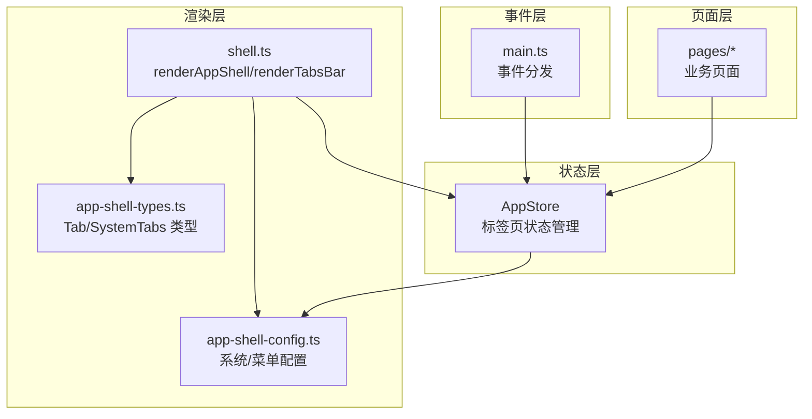
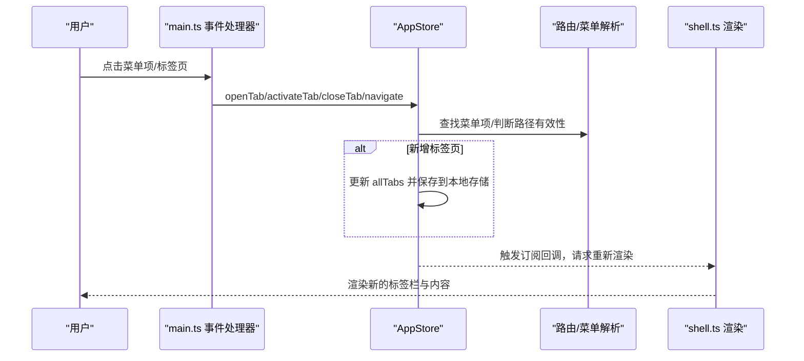
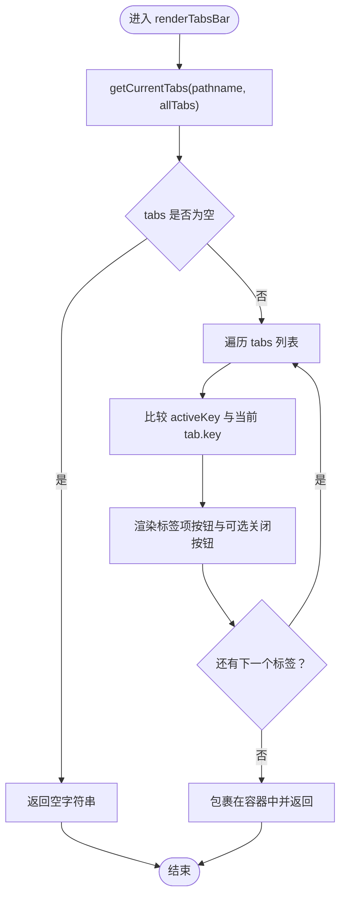
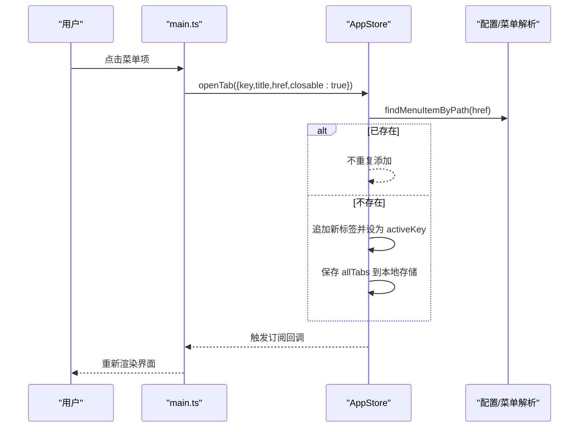
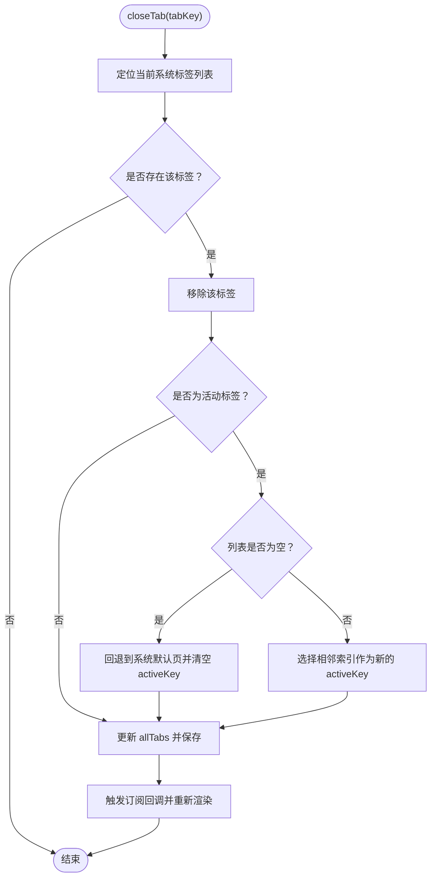
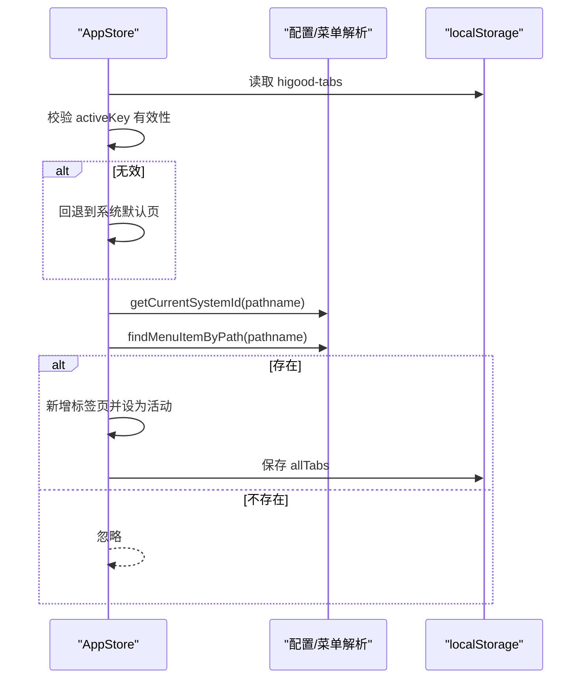
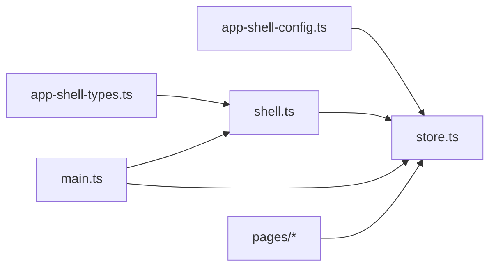

# 标签页管理机制

<cite>
**本文档引用的文件**
- [shell.ts](file://src/components/shell.ts)
- [store.ts](file://src/state/store.ts)
- [app-shell-types.ts](file://src/data/app-shell-types.ts)
- [app-shell-config.ts](file://src/data/app-shell-config.ts)
- [main.ts](file://src/main.ts)
- [pcs-workspace-todos.ts](file://src/pages/pcs-workspace-todos.ts)
</cite>

## 目录
1. [引言](#引言)
2. [项目结构](#项目结构)
3. [核心组件](#核心组件)
4. [架构总览](#架构总览)
5. [详细组件分析](#详细组件分析)
6. [依赖关系分析](#依赖关系分析)
7. [性能考虑](#性能考虑)
8. [故障排除指南](#故障排除指南)
9. [结论](#结论)

## 引言

本文件针对应用壳层中的标签页管理机制进行深入技术文档编写，重点覆盖以下方面：
- 标签页的渲染逻辑：创建、激活、关闭流程
- renderTabsBar 函数的实现细节：如何基于当前路由状态动态生成标签页列表
- 标签页交互功能：切换、关闭按钮、拖拽排序（如有）
- 扩展能力：固定标签页、批量关闭、历史记录等
- 标签页与路由系统的协作：状态持久化与恢复机制

该机制采用“纯前端模板渲染 + 状态驱动”的设计，通过 AppStore 统一管理标签页状态，并在 shell.ts 中以函数式模板渲染的方式输出标签栏 UI。

## 项目结构

标签页管理涉及的核心文件与职责如下：
- src/state/store.ts：应用状态管理，包含标签页状态、持久化与路由同步逻辑
- src/components/shell.ts：壳层渲染，负责顶部系统切换、侧边菜单、标签栏渲染
- src/data/app-shell-types.ts：标签页类型定义（Tab、SystemTabs、AllSystemTabs）
- src/data/app-shell-config.ts：系统与菜单配置，用于从路径解析到菜单项
- src/main.ts：事件分发入口，将用户交互转换为状态变更
- src/pages/...：各业务页面，部分页面也包含自身标签页逻辑（如 PCS 待办）

图表来源
- [store.ts:1-329](file://src/state/store.ts#L1-L329)
- [shell.ts:1-324](file://src/components/shell.ts#L1-L324)
- [app-shell-types.ts:1-46](file://src/data/app-shell-types.ts#L1-L46)
- [app-shell-config.ts:1-355](file://src/data/app-shell-config.ts#L1-L355)
- [main.ts:329-476](file://src/main.ts#L329-L476)

章节来源
- [store.ts:1-329](file://src/state/store.ts#L1-L329)
- [shell.ts:1-324](file://src/components/shell.ts#L1-L324)
- [app-shell-types.ts:1-46](file://src/data/app-shell-types.ts#L1-L46)
- [app-shell-config.ts:1-355](file://src/data/app-shell-config.ts#L1-L355)
- [main.ts:329-476](file://src/main.ts#L329-L476)

## 核心组件

- AppStore：集中管理应用状态，包括 pathname、sidebar 状态、所有系统的标签页集合、展开的菜单组/项等。提供 openTab、activateTab、closeTab、navigate、switchSystem 等方法，负责标签页的增删改查与持久化。
- shell.ts：负责渲染应用壳层，其中 renderTabsBar 基于当前系统与 allTabs 动态生成标签页列表；renderAppShell 将标签栏嵌入整体布局。
- app-shell-types.ts：定义 Tab、SystemTabs、AllSystemTabs 的结构，确保类型安全。
- app-shell-config.ts：提供系统列表与菜单树，用于从路径解析到菜单项，从而决定是否需要新增标签页。
- main.ts：事件总线，将点击、输入、表单提交等事件转换为状态操作，触发重新渲染。

章节来源
- [store.ts:89-304](file://src/state/store.ts#L89-L304)
- [shell.ts:253-290](file://src/components/shell.ts#L253-L290)
- [app-shell-types.ts:29-46](file://src/data/app-shell-types.ts#L29-L46)
- [app-shell-config.ts:9-355](file://src/data/app-shell-config.ts#L9-L355)
- [main.ts:376-463](file://src/main.ts#L376-L463)

## 架构总览

标签页管理的整体流程如下：
- 初始化：AppStore 从本地存储恢复标签页状态，若当前 activeKey 无效则回退到系统默认页，并同步一次标签页。
- 路由变化：当用户通过导航或点击菜单项切换路由时，AppStore 根据路径查找对应菜单项，若不存在则忽略；若存在且标签页列表中无重复，则新增一个可关闭的标签页，并将其设为活动状态。
- 渲染：shell.ts 的 renderTabsBar 读取当前系统下的标签页集合，按顺序渲染每个标签项，包含标题与关闭按钮（可关闭项）。
- 交互：main.ts 捕获用户点击事件，调用 AppStore 的 openTab/activateTab/closeTab 等方法，触发状态变更与重新渲染。

图表来源
- [main.ts:376-463](file://src/main.ts#L376-L463)
- [store.ts:141-170](file://src/state/store.ts#L141-L170)
- [store.ts:186-209](file://src/state/store.ts#L186-L209)
- [store.ts:211-230](file://src/state/store.ts#L211-L230)
- [store.ts:232-269](file://src/state/store.ts#L232-L269)
- [shell.ts:253-290](file://src/components/shell.ts#L253-L290)

## 详细组件分析

### renderTabsBar 函数实现

renderTabsBar 的职责是根据当前路由与全局标签页状态，动态生成标签页列表。其关键步骤如下：
- 获取当前系统：getCurrentSystem(pathname) 从路径中提取系统标识
- 获取当前系统标签页：getCurrentTabs(pathname, allTabs) 返回 tabs 与 activeKey
- 列表为空则不渲染标签栏
- 对每个标签项：
  - 计算 active 状态并与 activeKey 比较
  - 渲染标题按钮，绑定 data-action="activate-tab" 与 data-tab-key
  - 若 tab.closable 为真，渲染关闭按钮，绑定 data-action="close-tab" 与 data-tab-key
  - 活动标签项底部绘制强调条

图表来源
- [shell.ts:253-290](file://src/components/shell.ts#L253-L290)
- [store.ts:318-328](file://src/state/store.ts#L318-L328)

章节来源
- [shell.ts:253-290](file://src/components/shell.ts#L253-L290)
- [store.ts:318-328](file://src/state/store.ts#L318-L328)

### 标签页创建与激活流程

- 创建：当 navigate 或 openTab 被调用时，AppStore 会根据路径查找菜单项，若不存在则忽略；若存在且当前系统标签列表中不存在相同 key，则新增一个 {key,title,href,closable:true} 的标签项，并将其设为 activeKey。
- 激活：activateTab 接收 tabKey，更新当前系统 activeKey，并同步 pathname 为该标签的 href，随后触发状态变更与重新渲染。

图表来源
- [main.ts:435-450](file://src/main.ts#L435-L450)
- [store.ts:186-209](file://src/state/store.ts#L186-L209)
- [store.ts:75-81](file://src/state/store.ts#L75-L81)

章节来源
- [main.ts:435-450](file://src/main.ts#L435-L450)
- [store.ts:186-209](file://src/state/store.ts#L186-L209)
- [store.ts:75-81](file://src/state/store.ts#L75-L81)

### 标签页关闭流程

- 关闭：closeTab 接收 tabKey，定位当前系统标签列表，找到对应索引后移除该标签。
- 活动标签被关闭时：
  - 若列表非空，选择相邻索引（取最小索引，避免越界）作为新的 activeKey
  - 若列表为空，回退到当前系统默认页，并清空 activeKey
- 更新 allTabs 并保存到本地存储，触发重新渲染。

图表来源
- [store.ts:232-269](file://src/state/store.ts#L232-L269)

章节来源
- [store.ts:232-269](file://src/state/store.ts#L232-L269)

### 标签页与路由系统的协作

- 路由到标签页的同步：syncTabWithPath 在每次 navigate 后被调用，根据 pathname 解析菜单项，若存在且列表中无重复则新增标签页并设为活动。
- 默认页回退：init 时若当前系统 activeKey 无效，回退到系统默认页，保证初始状态有效。
- 持久化：标签页状态保存在 localStorage 中，键值为 higood-tabs；侧边栏折叠状态保存在键值为 sidebar-collapsed 中。

图表来源
- [store.ts:101-117](file://src/state/store.ts#L101-L117)
- [store.ts:141-170](file://src/state/store.ts#L141-L170)
- [store.ts:30-48](file://src/state/store.ts#L30-L48)

章节来源
- [store.ts:101-117](file://src/state/store.ts#L101-L117)
- [store.ts:141-170](file://src/state/store.ts#L141-L170)
- [store.ts:30-48](file://src/state/store.ts#L30-L48)

### 交互功能与扩展点

- 标签页切换：通过 data-action="activate-tab" 与 data-tab-key 实现，事件处理器调用 activateTab。
- 关闭按钮：通过 data-action="close-tab" 与 data-tab-key 实现，事件处理器调用 closeTab。
- 打开标签：通过 data-action="open-tab" 与 data-tabHref/data-tabKey/data-tabTitle 实现，事件处理器调用 openTab。
- 拖拽排序：当前代码未实现拖拽排序功能。若需扩展，可在 renderTabsBar 中为每个标签项增加拖拽属性，并在 main.ts 中监听拖拽事件，更新 allTabs 的顺序，最后保存到本地存储。

章节来源
- [shell.ts:275-282](file://src/components/shell.ts#L275-L282)
- [main.ts:452-462](file://src/main.ts#L452-L462)

### 扩展功能示例（实现思路）

- 固定标签页：在 Tab 结构中增加 fixed 字段，渲染时区分固定与普通标签；关闭逻辑中跳过固定标签。
- 批量关闭：在 shell.ts 中添加“关闭其他/关闭全部”按钮，事件处理器遍历当前系统标签列表，过滤掉活动标签与固定标签后批量关闭。
- 标签页历史记录：在 AppStore 中维护最近访问的标签页队列，支持前进/后退；结合浏览器历史 API 或自定义栈实现。

章节来源
- [app-shell-types.ts:29-46](file://src/data/app-shell-types.ts#L29-L46)
- [store.ts:186-209](file://src/state/store.ts#L186-L209)

### 与业务页面的对比

部分页面（如 PCS 待办）使用了自身的标签页逻辑，与壳层标签页不同：
- PCS 待办的标签页是页面内的 UI 组件，用于切换不同的数据视图，而非系统级标签页。
- 壳层标签页是跨页面的导航容器，与路由系统强耦合，支持持久化与恢复。

章节来源
- [pcs-workspace-todos.ts:654-688](file://src/pages/pcs-workspace-todos.ts#L654-L688)

## 依赖关系分析

- 类型依赖：shell.ts 依赖 app-shell-types.ts 提供的 Tab、SystemTabs、AllSystemTabs 类型。
- 配置依赖：store.ts 依赖 app-shell-config.ts 提供的系统与菜单配置，用于路径到菜单项的映射。
- 事件依赖：main.ts 依赖 shell.ts 的渲染输出与 store.ts 的状态变更，形成事件-状态-渲染闭环。
- 页面依赖：各业务页面可直接调用 AppStore 的 openTab/activateTab/closeTab 等方法，实现页面内标签页行为。

图表来源
- [app-shell-types.ts:1-46](file://src/data/app-shell-types.ts#L1-L46)
- [app-shell-config.ts:1-355](file://src/data/app-shell-config.ts#L1-L355)
- [shell.ts:1-324](file://src/components/shell.ts#L1-L324)
- [store.ts:1-329](file://src/state/store.ts#L1-L329)
- [main.ts:329-476](file://src/main.ts#L329-L476)

章节来源
- [app-shell-types.ts:1-46](file://src/data/app-shell-types.ts#L1-L46)
- [app-shell-config.ts:1-355](file://src/data/app-shell-config.ts#L1-L355)
- [shell.ts:1-324](file://src/components/shell.ts#L1-L324)
- [store.ts:1-329](file://src/state/store.ts#L1-L329)
- [main.ts:329-476](file://src/main.ts#L329-L476)

## 性能考虑

- 渲染粒度：renderTabsBar 仅渲染当前系统标签页，避免全量渲染。
- 状态更新：AppStore 使用局部 patch 更新状态并触发订阅，减少不必要的重渲染。
- 持久化策略：标签页与侧边栏状态分别持久化，降低存储体积与解析成本。
- 事件去抖：main.ts 对输入/变更事件有旁路逻辑，避免控件类元素触发全量重渲染。

章节来源
- [shell.ts:253-290](file://src/components/shell.ts#L253-L290)
- [store.ts:136-139](file://src/state/store.ts#L136-L139)
- [main.ts:375-374](file://src/main.ts#L375-L374)

## 故障排除指南

- 标签页不显示：
  - 检查 pathname 是否能解析到菜单项；若返回 null，则不会新增标签页。
  - 检查当前系统是否有标签页；若 tabs 为空则 renderTabsBar 不渲染标签栏。
- 活动标签丢失：
  - 初始化时若 activeKey 无效会回退到系统默认页；检查 localStorage 中 higood-tabs 的有效性。
- 关闭标签后无活动页：
  - 当活动标签被关闭且列表为空时，会回退到系统默认页；确认系统默认页配置正确。
- 无法关闭标签：
  - 仅 closable=true 的标签才会显示关闭按钮；检查标签创建时的 closable 字段。

章节来源
- [store.ts:101-117](file://src/state/store.ts#L101-L117)
- [store.ts:232-269](file://src/state/store.ts#L232-L269)
- [shell.ts:275-282](file://src/components/shell.ts#L275-L282)

## 结论

标签页管理机制通过“状态驱动 + 模板渲染”的方式实现了与路由系统的深度集成，具备以下特点：
- 自动化：根据路由自动创建标签页，避免重复
- 可持久化：标签页状态与侧边栏状态均持久化，提升用户体验
- 可扩展：事件模型清晰，便于扩展固定标签、批量关闭、历史记录等功能
- 低耦合：类型与配置分离，渲染与状态解耦

未来建议：
- 引入拖拽排序与标签固定能力
- 增加键盘快捷键支持
- 提供标签页分组与搜索能力