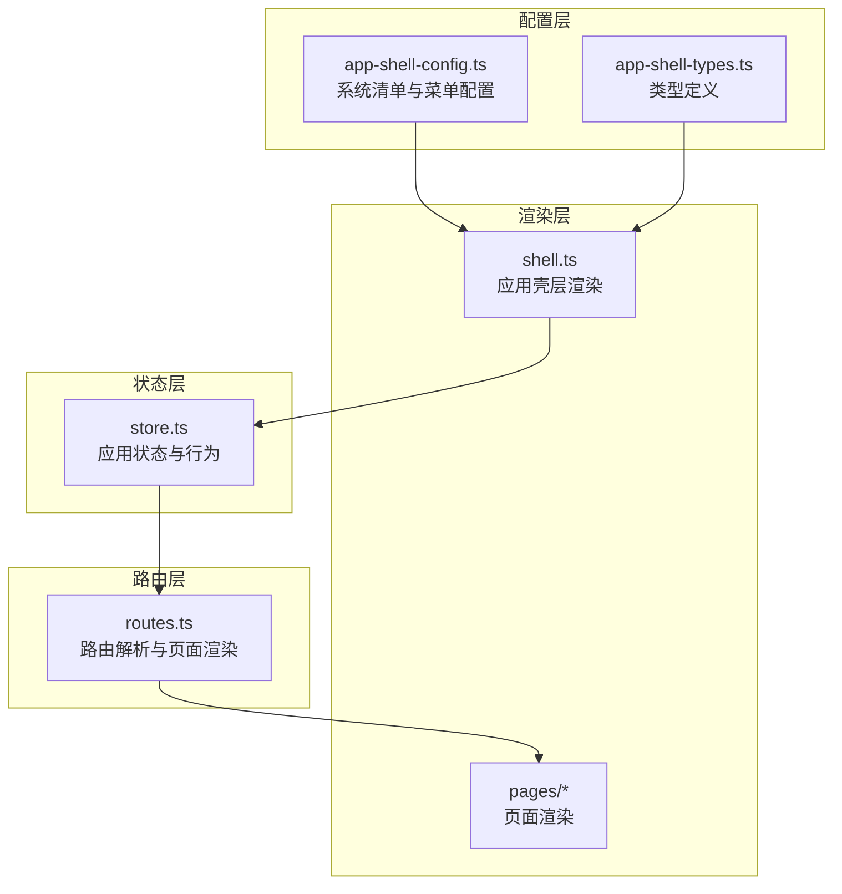
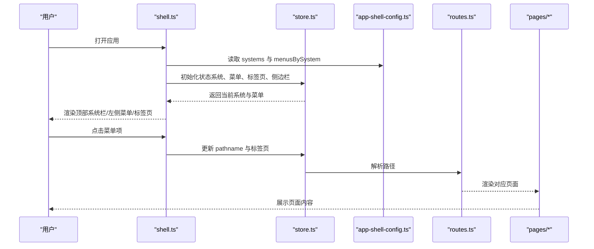
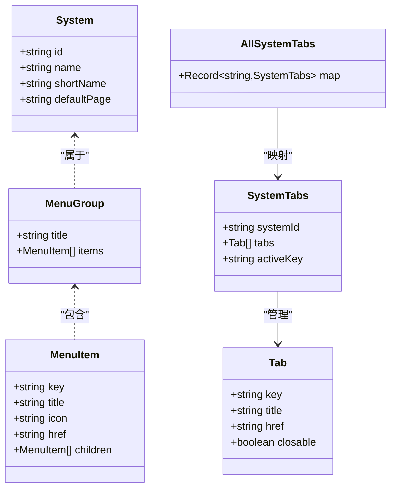
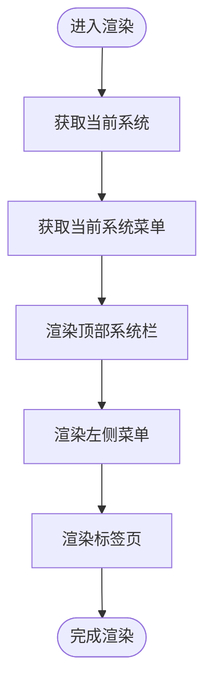
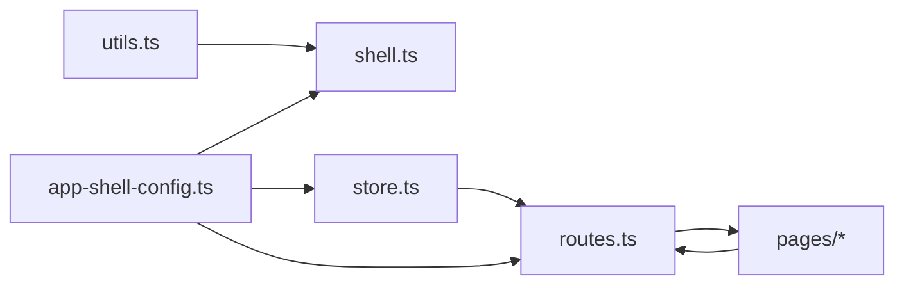

# 系统配置管理

<cite>
**本文档引用的文件**
- [app-shell-config.ts](file://src/data/app-shell-config.ts)
- [app-shell-types.ts](file://src/data/app-shell-types.ts)
- [shell.ts](file://src/components/shell.ts)
- [store.ts](file://src/state/store.ts)
- [routes.ts](file://src/router/routes.ts)
- [placeholder.ts](file://src/pages/placeholder.ts)
- [utils.ts](file://src/utils.ts)
</cite>

## 目录
1. [简介](#简介)
2. [项目结构](#项目结构)
3. [核心组件](#核心组件)
4. [架构总览](#架构总览)
5. [详细组件分析](#详细组件分析)
6. [依赖关系分析](#依赖关系分析)
7. [性能考虑](#性能考虑)
8. [故障排查指南](#故障排查指南)
9. [结论](#结论)
10. [附录](#附录)

## 简介
本文件面向系统配置管理，围绕 app-shell-config.ts 中的系统配置结构进行深入技术解析，涵盖系统定义、菜单组配置、菜单项映射的数据模型；解释如何通过配置文件动态生成菜单结构；阐述配置项的继承与覆盖机制；说明系统配置的扩展方式（新增系统、修改现有系统菜单结构、设置菜单权限规则）；并提供多种菜单项配置示例（普通链接、外链、分组菜单、带图标菜单等）。同时，文档解释配置与代码的解耦机制（配置验证、默认值处理、配置热更新）。

## 项目结构
系统配置管理采用“配置驱动 + 运行时渲染”的架构：
- 配置层：位于 src/data 下，包含系统清单与菜单配置，以及类型定义。
- 渲染层：位于 src/components 与 src/pages，负责将配置渲染为 UI，并与路由、状态管理联动。
- 状态层：位于 src/state，维护当前系统、菜单、标签页、侧边栏折叠等状态。
- 路由层：位于 src/router，负责路径解析与页面渲染。

图表来源
- [app-shell-config.ts:1-355](file://src/data/app-shell-config.ts#L1-L355)
- [app-shell-types.ts:1-46](file://src/data/app-shell-types.ts#L1-L46)
- [shell.ts:1-324](file://src/components/shell.ts#L1-L324)
- [store.ts:1-329](file://src/state/store.ts#L1-L329)
- [routes.ts:1-456](file://src/router/routes.ts#L1-L456)

章节来源
- [app-shell-config.ts:1-355](file://src/data/app-shell-config.ts#L1-L355)
- [app-shell-types.ts:1-46](file://src/data/app-shell-types.ts#L1-L46)
- [shell.ts:1-324](file://src/components/shell.ts#L1-L324)
- [store.ts:1-329](file://src/state/store.ts#L1-L329)
- [routes.ts:1-456](file://src/router/routes.ts#L1-L456)

## 核心组件
- 系统清单（systems）
  - 定义系统标识、名称、简称与默认页面。
  - 用于顶部系统切换按钮与默认页面跳转。
- 菜单配置（menusBySystem）
  - 按系统 ID 维度组织菜单分组与菜单项。
  - 支持多级子菜单（children）。
- 类型定义（System、MenuGroup、MenuItem、Tab、SystemTabs）
  - 规范配置数据结构，确保类型安全。
- 应用壳层渲染（shell.ts）
  - 将配置渲染为顶部系统栏、左侧菜单、标签页等 UI。
- 状态管理（store.ts）
  - 维护当前系统、菜单、标签页、侧边栏折叠状态。
  - 提供菜单查找、标签页增删改查、系统切换等逻辑。
- 路由解析（routes.ts）
  - 将路径映射到具体页面渲染器，支持精确路由与动态路由。
  - 与菜单配置联动，未接入路由的菜单项会渲染占位页面。

章节来源
- [app-shell-config.ts:8-18](file://src/data/app-shell-config.ts#L8-L18)
- [app-shell-config.ts:21-354](file://src/data/app-shell-config.ts#L21-L354)
- [app-shell-types.ts:6-46](file://src/data/app-shell-types.ts#L6-L46)
- [shell.ts:25-324](file://src/components/shell.ts#L25-L324)
- [store.ts:58-328](file://src/state/store.ts#L58-L328)
- [routes.ts:113-455](file://src/router/routes.ts#L113-L455)

## 架构总览
系统配置管理的运行时流程如下：
- 初始化：从配置中读取系统清单与菜单配置，结合本地存储恢复状态。
- 渲染：根据当前路径获取当前系统与菜单，渲染顶部系统栏、左侧菜单与标签页。
- 导航：点击菜单或系统切换触发状态更新，同步标签页与路由。
- 页面：路由解析器根据路径选择对应页面渲染器，未接入的路径渲染占位页面。

图表来源
- [shell.ts:292-324](file://src/components/shell.ts#L292-L324)
- [store.ts:89-178](file://src/state/store.ts#L89-L178)
- [app-shell-config.ts:8-354](file://src/data/app-shell-config.ts#L8-L354)
- [routes.ts:430-455](file://src/router/routes.ts#L430-L455)

## 详细组件分析

### 数据模型与配置结构
- 系统（System）
  - 字段：id、name、shortName、defaultPage
  - 作用：定义系统标识、显示名称、默认页面。
- 菜单分组（MenuGroup）
  - 字段：title、items
  - 作用：组织一组菜单项，支持标题与分组展开/折叠。
- 菜单项（MenuItem）
  - 字段：key、title、icon、href、children
  - 作用：定义菜单项的唯一标识、显示文本、图标、目标路径与子菜单。
- 标签页（Tab）
  - 字段：key、title、href、closable
  - 作用：记录每个系统内的标签页集合与当前激活标签。
- 系统标签页映射（AllSystemTabs）
  - 结构：Record<string, SystemTabs>
  - 作用：按系统 ID 维度管理标签页状态。

图表来源
- [app-shell-types.ts:6-46](file://src/data/app-shell-types.ts#L6-L46)

章节来源
- [app-shell-types.ts:6-46](file://src/data/app-shell-types.ts#L6-L46)

### 动态菜单生成与渲染
- 获取当前系统与菜单
  - getCurrentSystem：根据路径提取系统 ID，返回对应系统对象。
  - getCurrentMenus：根据当前系统 ID 返回菜单分组数组。
- 渲染逻辑
  - 顶部系统栏：遍历系统清单，渲染系统按钮，支持切换。
  - 左侧菜单：按分组渲染标题与菜单项，支持展开/折叠与子菜单渲染。
  - 标签页：根据当前路径自动创建标签页，支持激活、关闭与持久化。

图表来源
- [shell.ts:25-324](file://src/components/shell.ts#L25-L324)
- [store.ts:308-328](file://src/state/store.ts#L308-L328)

章节来源
- [shell.ts:25-324](file://src/components/shell.ts#L25-L324)
- [store.ts:308-328](file://src/state/store.ts#L308-L328)

### 配置项继承与覆盖机制
- 继承
  - 菜单配置通过 menusBySystem 按系统 ID 维度组织，每个系统拥有独立的菜单树。
  - 子菜单（children）继承父菜单的样式与交互行为（展开/折叠、图标、激活态）。
- 覆盖
  - 新增系统：在 systems 中添加新系统条目，并在 menusBySystem 中为其新增菜单分组与项。
  - 修改现有系统：直接在对应系统 ID 的菜单配置中调整 title、items、children。
  - 图标与链接：通过 icon 与 href 字段控制显示与导航行为。
- 默认值处理
  - 当前路径不在任何菜单项中时，系统默认跳转至该系统 defaultPage。
  - 侧边栏折叠状态与标签页状态通过本地存储恢复，默认值在初始化时设定。

章节来源
- [app-shell-config.ts:8-354](file://src/data/app-shell-config.ts#L8-L354)
- [store.ts:87-117](file://src/state/store.ts#L87-L117)
- [store.ts:83-85](file://src/state/store.ts#L83-L85)

### 配置扩展方式
- 添加新系统
  - 在 systems 中新增一条 System 记录（id、name、shortName、defaultPage）。
  - 在 menusBySystem 中为该系统新增菜单分组与项。
- 修改现有系统菜单结构
  - 在对应系统 ID 的菜单配置中调整 items 或 children。
  - 可增加/删除/重排菜单项，支持嵌套子菜单。
- 设置菜单权限规则
  - 当前配置未包含权限字段。若需权限控制，可在 MenuItem 上扩展权限字段（如 permissions），并在渲染层与状态层增加权限判断逻辑。
  - 示例扩展思路：在 MenuItem 中新增 permissions 数组，渲染时根据用户角色过滤不可见项；在 store 中维护权限状态并提供权限检查方法。

章节来源
- [app-shell-config.ts:8-354](file://src/data/app-shell-config.ts#L8-L354)
- [app-shell-types.ts:14-21](file://src/data/app-shell-types.ts#L14-L21)

### 菜单项配置示例
- 普通链接菜单
  - 使用 href 指向内部页面路径。
  - 示例参考：工作台概览、项目列表、工作项库等。
- 外链菜单
  - 当前配置未提供外链字段。若需外链，可在 MenuItem 中新增 external 字段（布尔值），在渲染层根据该字段决定是否使用外链渲染。
- 分组菜单
  - 通过 MenuGroup.title 区分不同功能分组，支持展开/折叠。
- 带图标菜单
  - 通过 icon 字段指定图标名称，渲染层会将其转换为图标组件。

章节来源
- [app-shell-config.ts:22-354](file://src/data/app-shell-config.ts#L22-L354)
- [shell.ts:20-23](file://src/components/shell.ts#L20-L23)

### 配置与代码的解耦机制
- 配置验证
  - 类型定义确保配置结构正确（System、MenuGroup、MenuItem、Tab）。
  - 渲染层对空值与非法路径进行容错处理（如找不到菜单项时跳转默认页面）。
- 默认值处理
  - 系统默认页面、侧边栏折叠状态、标签页持久化均提供默认值与回退逻辑。
- 配置热更新
  - 当前实现未提供运行时热更新机制。可通过以下方式增强：
    - 引入配置加载器：从远程或本地配置文件动态加载 menusBySystem 与 systems。
    - 增加配置变更监听：当配置变化时，触发状态重建与 UI 重新渲染。
    - 缓存与版本控制：为配置添加版本号，避免缓存不一致导致的渲染问题。

章节来源
- [app-shell-types.ts:6-46](file://src/data/app-shell-types.ts#L6-L46)
- [store.ts:87-117](file://src/state/store.ts#L87-L117)
- [store.ts:15-56](file://src/state/store.ts#L15-L56)

## 依赖关系分析
- 配置依赖
  - shell.ts 依赖 app-shell-config.ts 的 systems 与 menusBySystem。
  - store.ts 依赖 app-shell-config.ts 的 systems 与 menusBySystem。
  - routes.ts 依赖 app-shell-config.ts 的 menusBySystem。
- 渲染依赖
  - shell.ts 依赖 utils.ts 的工具函数（HTML 转义、类名拼接）。
  - routes.ts 依赖各页面渲染器。
- 状态依赖
  - store.ts 维护所有状态并与 shell.ts、routes.ts 协作。

图表来源
- [app-shell-config.ts:1-355](file://src/data/app-shell-config.ts#L1-L355)
- [shell.ts:1-12](file://src/components/shell.ts#L1-L12)
- [store.ts:1-11](file://src/state/store.ts#L1-L11)
- [routes.ts:1-105](file://src/router/routes.ts#L1-L105)
- [utils.ts:1-18](file://src/utils.ts#L1-L18)

章节来源
- [app-shell-config.ts:1-355](file://src/data/app-shell-config.ts#L1-L355)
- [shell.ts:1-12](file://src/components/shell.ts#L1-L12)
- [store.ts:1-11](file://src/state/store.ts#L1-L11)
- [routes.ts:1-105](file://src/router/routes.ts#L1-L105)
- [utils.ts:1-18](file://src/utils.ts#L1-L18)

## 性能考虑
- 渲染性能
  - 菜单渲染采用字符串拼接，避免频繁 DOM 操作；建议在大规模菜单场景下引入虚拟滚动或分页。
- 状态管理
  - 标签页与侧边栏状态持久化到本地存储，减少重复计算；注意存储大小限制与序列化开销。
- 路由解析
  - 精确路由与动态路由混合使用，避免重复匹配；建议对高频路径建立索引以提升查找效率。

## 故障排查指南
- 菜单不显示或空白
  - 检查当前路径是否属于某个系统（路径必须以系统 ID 开头）。
  - 检查 menusBySystem 是否包含该系统 ID 对应的菜单配置。
- 菜单项点击无效
  - 检查 MenuItem 的 href 是否正确且与路由表匹配。
  - 若为动态路由，确认正则表达式与路径格式一致。
- 标签页未创建或丢失
  - 检查路径是否在菜单中注册；未注册的路径会渲染占位页面而非创建标签页。
  - 检查本地存储是否被清理或损坏。
- 图标不显示
  - 检查 icon 名称是否与 lucide 图标库一致；渲染层会将驼峰命名转换为 kebab-case。

章节来源
- [store.ts:75-81](file://src/state/store.ts#L75-L81)
- [routes.ts:408-428](file://src/router/routes.ts#L408-L428)
- [placeholder.ts:3-23](file://src/pages/placeholder.ts#L3-L23)

## 结论
系统配置管理通过清晰的数据模型与配置驱动的方式，实现了菜单结构的灵活扩展与运行时渲染。当前实现具备良好的解耦性与可维护性，但仍可在权限控制、外链支持、配置热更新等方面进一步增强。通过本文档提供的扩展建议与最佳实践，可以安全地对系统配置进行演进，满足复杂业务场景的需求。

## 附录
- 关键实现路径
  - 系统清单与菜单配置：[app-shell-config.ts:8-354](file://src/data/app-shell-config.ts#L8-L354)
  - 类型定义：[app-shell-types.ts:6-46](file://src/data/app-shell-types.ts#L6-L46)
  - 应用壳层渲染：[shell.ts:25-324](file://src/components/shell.ts#L25-L324)
  - 状态管理：[store.ts:58-328](file://src/state/store.ts#L58-L328)
  - 路由解析：[routes.ts:113-455](file://src/router/routes.ts#L113-L455)
  - HTML 转义工具：[utils.ts:1-18](file://src/utils.ts#L1-L18)
  - 占位页面渲染：[placeholder.ts:3-23](file://src/pages/placeholder.ts#L3-L23)