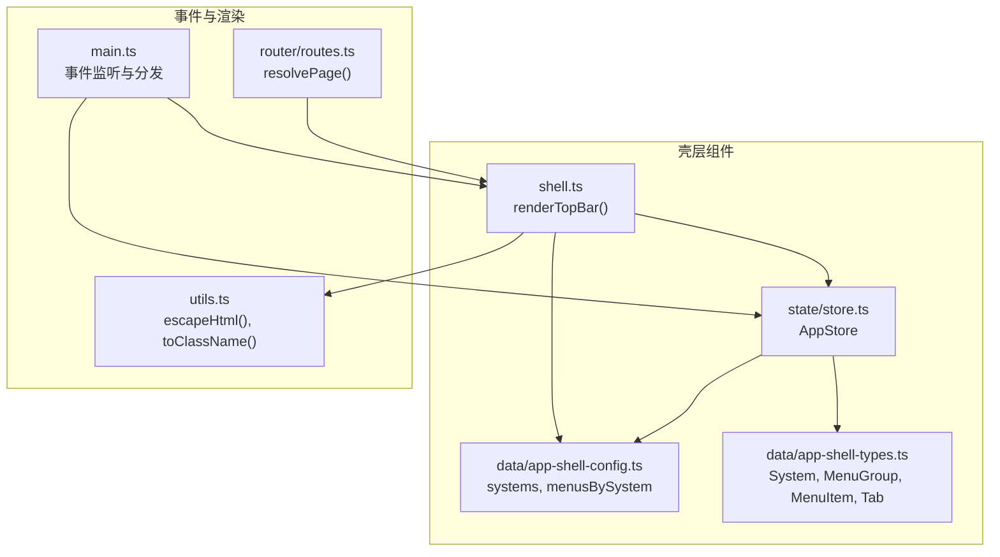
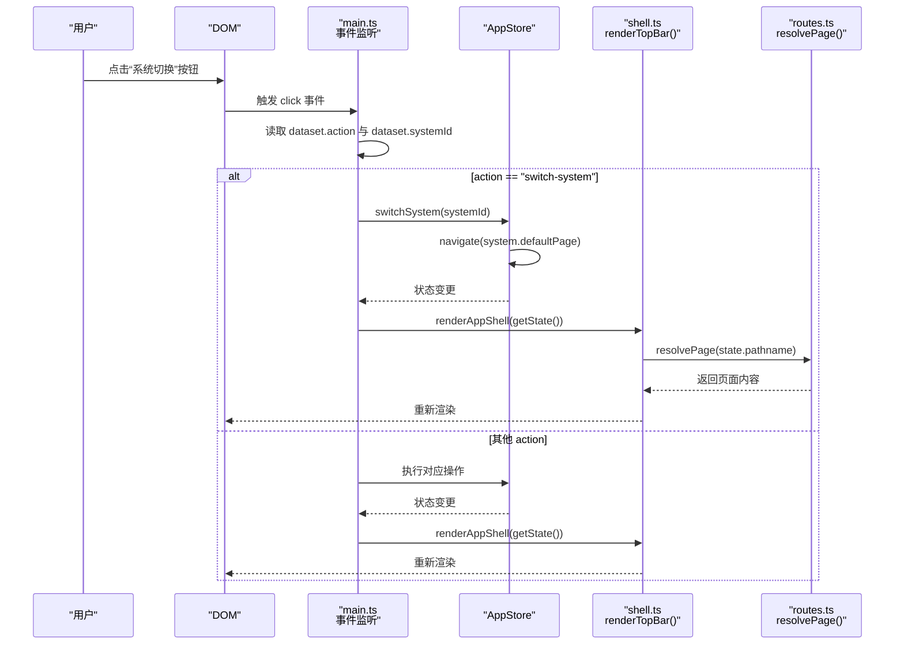
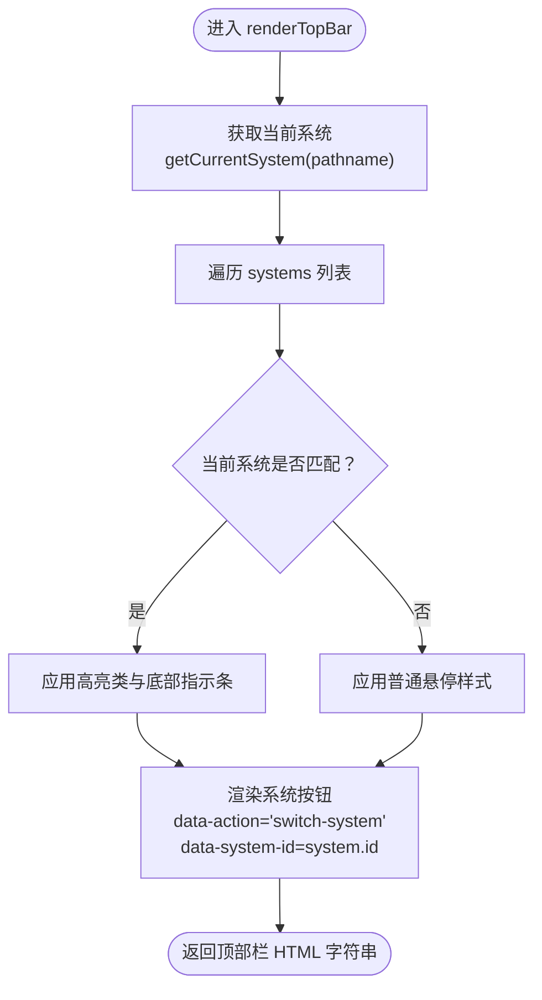
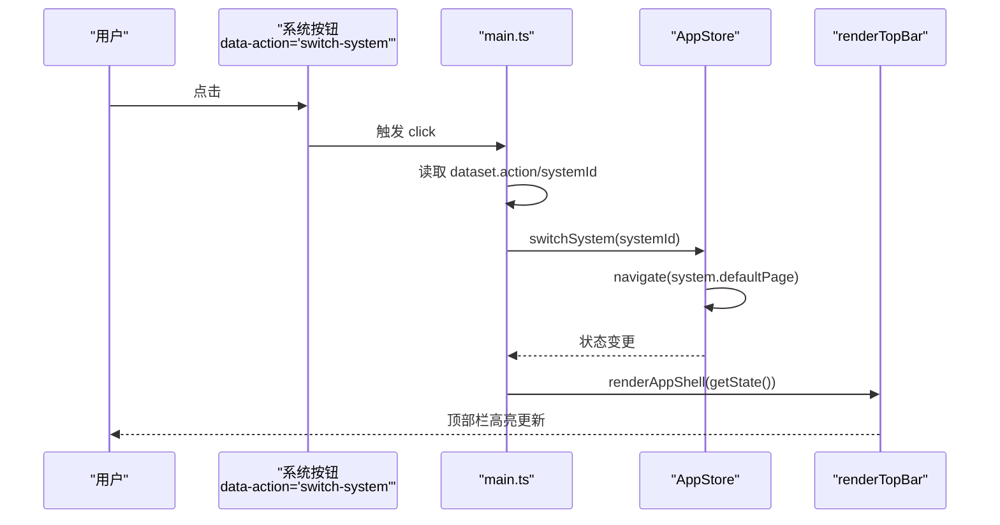
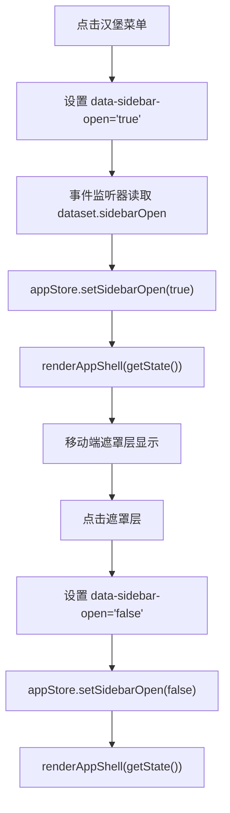
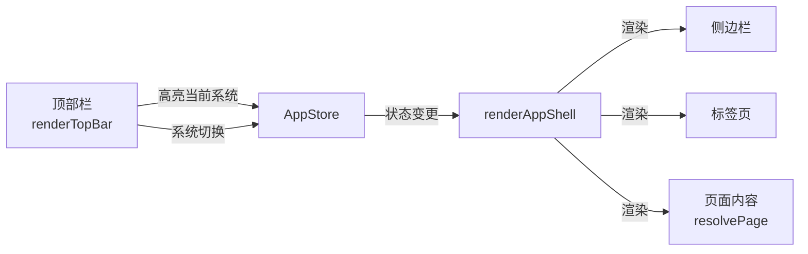
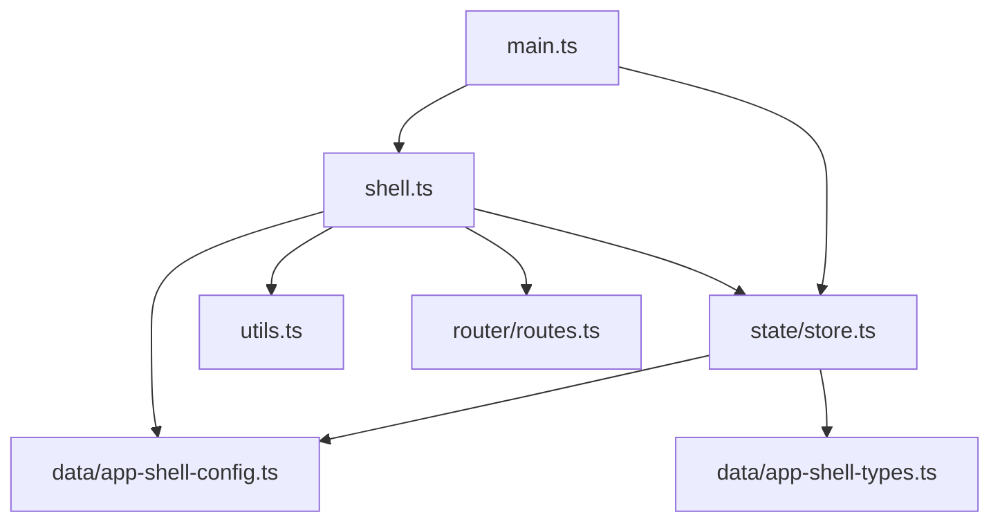

# 顶部栏功能

<cite>
**本文引用的文件**
- [src/components/shell.ts](file://src/components/shell.ts)
- [src/state/store.ts](file://src/state/store.ts)
- [src/data/app-shell-config.ts](file://src/data/app-shell-config.ts)
- [src/data/app-shell-types.ts](file://src/data/app-shell-types.ts)
- [src/main.ts](file://src/main.ts)
- [src/utils.ts](file://src/utils.ts)
- [src/router/routes.ts](file://src/router/routes.ts)
</cite>

## 目录
1. [简介](#简介)
2. [项目结构](#项目结构)
3. [核心组件](#核心组件)
4. [架构总览](#架构总览)
5. [详细组件分析](#详细组件分析)
6. [依赖分析](#依赖分析)
7. [性能考虑](#性能考虑)
8. [故障排查指南](#故障排查指南)
9. [结论](#结论)
10. [附录](#附录)

## 简介
本文件围绕顶部栏功能进行深入技术说明，重点解析 renderTopBar 的实现机制，涵盖以下方面：
- 系统切换按钮的渲染与交互逻辑
- 品牌标识的设计与可扩展性
- 用户信息区域的功能与样式
- 通过 dataset 属性实现系统切换的事件绑定与处理
- 当前系统高亮显示的判断逻辑
- 顶部栏的响应式设计与移动端汉堡菜单的显示隐藏规则
- 如何添加新系统选项与修改现有系统的显示样式
- 顶部栏与壳层组件（菜单、标签页、侧边栏）的协作关系及与状态管理的集成

## 项目结构
顶部栏位于应用壳层组件中，由 renderTopBar 负责渲染，配合状态管理器 appStore 实现系统切换、标签页与侧边栏状态的联动。

**图表来源**
- [src/components/shell.ts:25-79](file://src/components/shell.ts#L25-L79)
- [src/state/store.ts:1-329](file://src/state/store.ts#L1-L329)
- [src/data/app-shell-config.ts:1-355](file://src/data/app-shell-config.ts#L1-L355)
- [src/data/app-shell-types.ts:1-46](file://src/data/app-shell-types.ts#L1-L46)
- [src/main.ts:329-463](file://src/main.ts#L329-L463)
- [src/utils.ts:1-18](file://src/utils.ts#L1-L18)
- [src/router/routes.ts:428-453](file://src/router/routes.ts#L428-L453)

**章节来源**
- [src/components/shell.ts:25-79](file://src/components/shell.ts#L25-L79)
- [src/state/store.ts:1-329](file://src/state/store.ts#L1-L329)
- [src/data/app-shell-config.ts:1-355](file://src/data/app-shell-config.ts#L1-L355)
- [src/data/app-shell-types.ts:1-46](file://src/data/app-shell-types.ts#L1-L46)
- [src/main.ts:329-463](file://src/main.ts#L329-L463)
- [src/utils.ts:1-18](file://src/utils.ts#L1-L18)
- [src/router/routes.ts:428-453](file://src/router/routes.ts#L428-L453)

## 核心组件
- renderTopBar(state: AppState): 渲染顶部栏，包含移动端汉堡菜单、品牌标识、系统切换按钮集合、通知与用户信息区域。
- appStore：集中管理应用状态（当前路径、侧边栏开关/折叠、各系统标签页、菜单展开状态），提供切换系统、打开/激活/关闭标签页等方法。
- systems：系统配置数组，决定顶部栏系统切换按钮的渲染数量与默认跳转页。
- dataset 事件绑定：通过 data-action 与 data-system-id 等属性在 DOM 上声明行为，由全局点击事件监听器统一处理。

关键职责与交互：
- 渲染系统切换按钮：遍历 systems，依据 getCurrentSystem(state.pathname) 判断当前系统并高亮。
- 响应式布局：lg 断点控制侧边栏与系统切换条的显示；移动端汉堡菜单控制侧边栏开关。
- 事件处理：点击系统切换按钮触发 appStore.switchSystem，随后导航至对应系统的 defaultPage。

**章节来源**
- [src/components/shell.ts:25-79](file://src/components/shell.ts#L25-L79)
- [src/state/store.ts:180-184](file://src/state/store.ts#L180-L184)
- [src/data/app-shell-config.ts:9-18](file://src/data/app-shell-config.ts#L9-L18)
- [src/main.ts:404-411](file://src/main.ts#L404-L411)

## 架构总览
顶部栏与壳层组件的协作关系如下：

**图表来源**
- [src/main.ts:376-463](file://src/main.ts#L376-L463)
- [src/state/store.ts:180-184](file://src/state/store.ts#L180-L184)
- [src/components/shell.ts:292-311](file://src/components/shell.ts#L292-L311)
- [src/router/routes.ts:428-453](file://src/router/routes.ts#L428-L453)

## 详细组件分析

### renderTopBar 实现机制
- 结构组成
  - 移动端汉堡菜单：在 lg 以下断点显示，用于打开侧边栏。
  - 品牌标识：包含 HG 图标与“HiGood”文本，支持在小屏隐藏。
  - 系统切换条：横向滚动容器，内含多个系统按钮，每个按钮带有 data-action="switch-system" 与 data-system-id。
  - 用户信息区域：通知按钮与用户头像下拉按钮。
- 数据来源
  - 当前系统：getCurrentSystem(state.pathname) 从 pathname 推导当前系统。
  - 系统列表：systems 数组提供系统 id、名称、简称与默认页。
- 高亮逻辑
  - active = currentSystem.id === system.id，匹配时应用高亮类与底部指示条。
- 安全与样式
  - 使用 escapeHtml 对系统名与简称进行转义，防止 XSS。
  - 使用 toClassName 组合动态类名，保证样式一致性。

**图表来源**
- [src/components/shell.ts:25-79](file://src/components/shell.ts#L25-L79)
- [src/state/store.ts:308-311](file://src/state/store.ts#L308-L311)
- [src/data/app-shell-config.ts:9-18](file://src/data/app-shell-config.ts#L9-L18)
- [src/utils.ts:1-8](file://src/utils.ts#L1-L8)

**章节来源**
- [src/components/shell.ts:25-79](file://src/components/shell.ts#L25-L79)
- [src/state/store.ts:308-311](file://src/state/store.ts#L308-L311)
- [src/data/app-shell-config.ts:9-18](file://src/data/app-shell-config.ts#L9-L18)
- [src/utils.ts:1-8](file://src/utils.ts#L1-L8)

### 系统切换按钮的渲染与交互
- 渲染逻辑
  - 每个系统按钮包含 data-action="switch-system" 与 data-system-id="${system.id}"。
  - 文本包含系统名称与简称（短名），均经过 escapeHtml 处理。
- 事件处理
  - 全局 click 监听器捕获带 data-action 的元素。
  - 当 action 为 "switch-system" 时，读取 dataset.systemId 并调用 appStore.switchSystem。
  - switchSystem 内部导航到该系统的 defaultPage，随后触发状态订阅者重新渲染。
- 高亮判断
  - 当前系统按钮应用高亮类与底部指示条，其他系统保持普通样式。

**图表来源**
- [src/main.ts:396-411](file://src/main.ts#L396-L411)
- [src/state/store.ts:180-184](file://src/state/store.ts#L180-L184)
- [src/components/shell.ts:40-62](file://src/components/shell.ts#L40-L62)

**章节来源**
- [src/main.ts:396-411](file://src/main.ts#L396-L411)
- [src/state/store.ts:180-184](file://src/state/store.ts#L180-L184)
- [src/components/shell.ts:40-62](file://src/components/shell.ts#L40-L62)

### 品牌标识的设计
- 品牌图标：HG 字母徽标，背景蓝色圆角矩形，突出品牌识别。
- 文本品牌：在小屏隐藏，中等及以上屏幕显示“HiGood”，增强品牌露出。
- 可扩展性：如需更换品牌名或图标，可在相应位置调整静态 HTML 或引入变量。

**章节来源**
- [src/components/shell.ts:34-37](file://src/components/shell.ts#L34-L37)

### 用户信息区域
- 通知按钮：带红色小圆点徽标，提示有未读消息。
- 用户头像：圆形头像占位，右侧带下拉箭头，便于扩展用户菜单。
- 可扩展性：可增加下拉菜单、登出、个人设置等功能，通过 dataset 事件与状态管理集成。

**章节来源**
- [src/components/shell.ts:65-76](file://src/components/shell.ts#L65-L76)

### 响应式设计与移动端汉堡菜单
- 断点控制
  - 汉堡菜单在 lg 以下断点显示，lg 及以上断点隐藏。
  - 系统切换条在 lg 断点后显示，允许横向滚动。
- 移动端交互
  - 点击汉堡菜单按钮设置 data-sidebar-open="true"，触发侧边栏打开。
  - 关闭侧边栏时设置 data-sidebar-open="false"。
  - 点击遮罩层同样可关闭侧边栏。
- 与状态管理的集成
  - appStore.setSidebarOpen 控制侧边栏开关，状态变更后触发重新渲染。

**图表来源**
- [src/components/shell.ts:31-33](file://src/components/shell.ts#L31-L33)
- [src/main.ts:413-416](file://src/main.ts#L413-L416)
- [src/state/store.ts:271-273](file://src/state/store.ts#L271-L273)

**章节来源**
- [src/components/shell.ts:29-33](file://src/components/shell.ts#L29-L33)
- [src/main.ts:413-416](file://src/main.ts#L413-L416)
- [src/state/store.ts:271-273](file://src/state/store.ts#L271-L273)

### 添加新系统选项与修改显示样式
- 添加新系统
  - 在 systems 中新增一个 System 对象，包含 id、name、shortName、defaultPage。
  - 若需要菜单联动，还需在 menusBySystem 中为该系统补充菜单配置。
- 修改显示样式
  - 系统按钮的高亮与普通状态样式由类名组合决定，可通过调整 toClassName 的拼接逻辑或覆盖相关 CSS 类实现。
  - 品牌标识与用户信息区域的样式可直接通过 CSS 类进行定制。
- 注意事项
  - 确保 defaultPage 有效且存在路由映射，避免切换后无法正确渲染页面。
  - 新增系统后，建议同步更新路由与菜单配置，确保导航一致。

**章节来源**
- [src/data/app-shell-config.ts:9-18](file://src/data/app-shell-config.ts#L9-L18)
- [src/data/app-shell-config.ts:21-355](file://src/data/app-shell-config.ts#L21-L355)
- [src/components/shell.ts:40-62](file://src/components/shell.ts#L40-L62)
- [src/utils.ts:10-12](file://src/utils.ts#L10-L12)

### 顶部栏与其他壳层组件的协作关系
- 与菜单（Sidebar）
  - 顶部栏不直接渲染菜单，但会根据当前系统显示对应的菜单标题与分组。
  - 侧边栏的展开/折叠状态与顶部栏的汉堡菜单联动。
- 与标签页（TabsBar）
  - 顶部栏下方为 TabsBar，负责同一系统内的多页签切换。
  - appStore.openTab/activateTab/closeTab 与顶部栏的系统切换共同构成完整的页面导航体系。
- 与状态管理（AppStore）
  - appStore.getState 提供 pathname、sidebarOpen、allTabs 等状态，驱动顶部栏与整体壳层的渲染。
  - appStore.switchSystem 导航到新系统默认页，触发页面内容更新。
- 与路由（resolvePage）
  - resolvePage 根据 pathname 返回对应页面内容，顶部栏高亮与系统切换不影响页面解析逻辑。

**图表来源**
- [src/components/shell.ts:292-311](file://src/components/shell.ts#L292-L311)
- [src/state/store.ts:180-184](file://src/state/store.ts#L180-L184)
- [src/router/routes.ts:428-453](file://src/router/routes.ts#L428-L453)

**章节来源**
- [src/components/shell.ts:292-311](file://src/components/shell.ts#L292-L311)
- [src/state/store.ts:180-184](file://src/state/store.ts#L180-L184)
- [src/router/routes.ts:428-453](file://src/router/routes.ts#L428-L453)

## 依赖分析
- 组件耦合
  - renderTopBar 依赖：状态管理（getCurrentSystem）、系统配置（systems）、工具函数（escapeHtml、toClassName）。
  - 事件处理依赖：全局 click 监听器与 dataset 约定。
- 外部依赖
  - lucide 图标库：通过 hydrateIcons 初始化图标渲染。
- 潜在循环依赖
  - 顶部栏与状态管理之间为单向依赖（渲染依赖状态，事件处理更新状态），无循环依赖风险。

**图表来源**
- [src/components/shell.ts:1-11](file://src/components/shell.ts#L1-L11)
- [src/state/store.ts:1-11](file://src/state/store.ts#L1-L11)
- [src/data/app-shell-config.ts:1-10](file://src/data/app-shell-config.ts#L1-L10)
- [src/data/app-shell-types.ts:1-12](file://src/data/app-shell-types.ts#L1-L12)
- [src/main.ts:1-3](file://src/main.ts#L1-L3)
- [src/router/routes.ts:1-4](file://src/router/routes.ts#L1-L4)

**章节来源**
- [src/components/shell.ts:1-11](file://src/components/shell.ts#L1-L11)
- [src/state/store.ts:1-11](file://src/state/store.ts#L1-L11)
- [src/data/app-shell-config.ts:1-10](file://src/data/app-shell-config.ts#L1-L10)
- [src/data/app-shell-types.ts:1-12](file://src/data/app-shell-types.ts#L1-L12)
- [src/main.ts:1-3](file://src/main.ts#L1-L3)
- [src/router/routes.ts:1-4](file://src/router/routes.ts#L1-L4)

## 性能考虑
- 渲染粒度
  - renderTopBar 仅渲染顶部栏结构，渲染成本低；整体渲染由 renderAppShell 触发，建议避免不必要的全量重渲染。
- 事件处理
  - 全局 click 监听器统一处理所有 dataset 行为，减少重复绑定，降低内存占用。
- 图标初始化
  - hydrateIcons 仅在首次渲染时调用，避免重复初始化导致的性能损耗。
- 响应式布局
  - 使用 CSS 断点控制显示隐藏，避免 JavaScript 动态计算带来的额外开销。

## 故障排查指南
- 系统切换无效
  - 检查按钮是否包含 data-action="switch-system" 与 data-system-id。
  - 确认 appStore.switchSystem 是否被调用，以及系统 defaultPage 是否存在路由映射。
- 高亮不生效
  - 确认 getCurrentSystem 返回的 id 与系统 id 匹配。
  - 检查 CSS 类拼接逻辑与样式覆盖情况。
- 移动端汉堡菜单不显示
  - 检查 lg 断点相关 CSS 类是否正确加载。
  - 确认 data-sidebar-open 的值与状态管理一致。
- 图标不显示
  - 确认 hydrateIcons 已在首次渲染时调用。
  - 检查 lucide 图标名称大小写与驼峰转换逻辑。

**章节来源**
- [src/main.ts:396-411](file://src/main.ts#L396-L411)
- [src/state/store.ts:180-184](file://src/state/store.ts#L180-L184)
- [src/components/shell.ts:29-33](file://src/components/shell.ts#L29-L33)
- [src/components/shell.ts:313-323](file://src/components/shell.ts#L313-L323)

## 结论
顶部栏通过简洁的结构与明确的数据/事件约定，实现了系统切换、品牌标识与用户信息的统一呈现。其与状态管理、路由与壳层其他组件紧密协作，形成清晰的导航与交互闭环。通过 dataset 的统一事件模型与状态驱动的渲染机制，既保证了可维护性，也具备良好的扩展性。

## 附录
- 代码片段路径参考
  - [顶部栏渲染函数:25-79](file://src/components/shell.ts#L25-L79)
  - [系统配置数组:9-18](file://src/data/app-shell-config.ts#L9-L18)
  - [状态管理切换系统方法:180-184](file://src/state/store.ts#L180-L184)
  - [全局事件监听与系统切换处理:396-411](file://src/main.ts#L396-L411)
  - [页面内容解析:428-453](file://src/router/routes.ts#L428-L453)