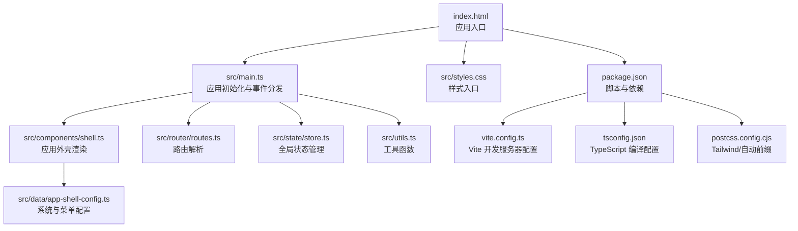
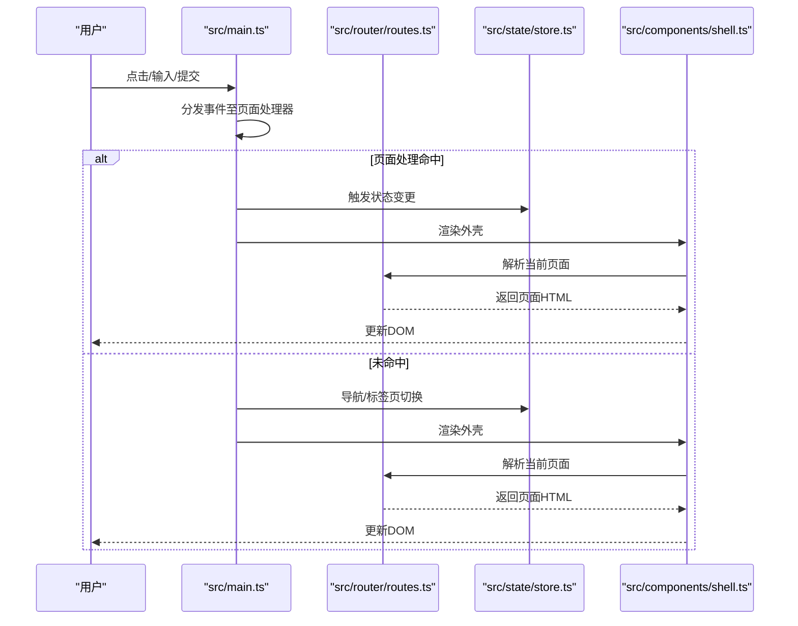
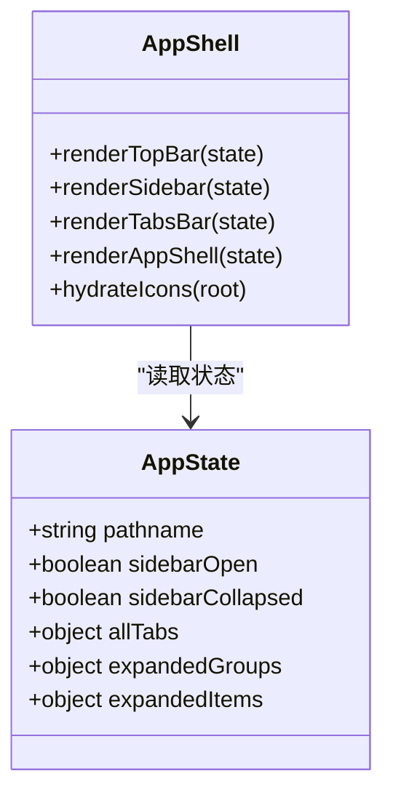
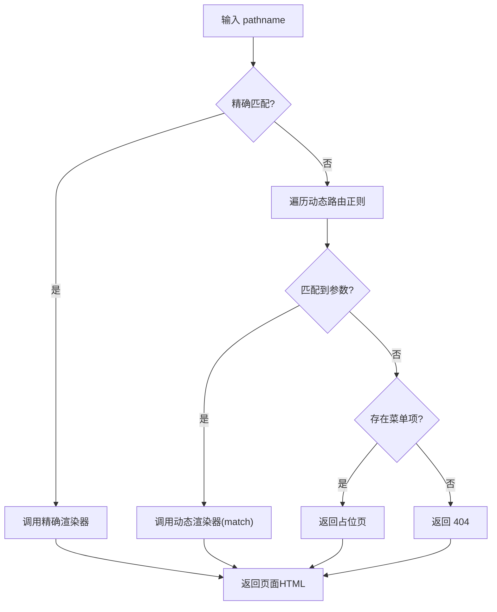
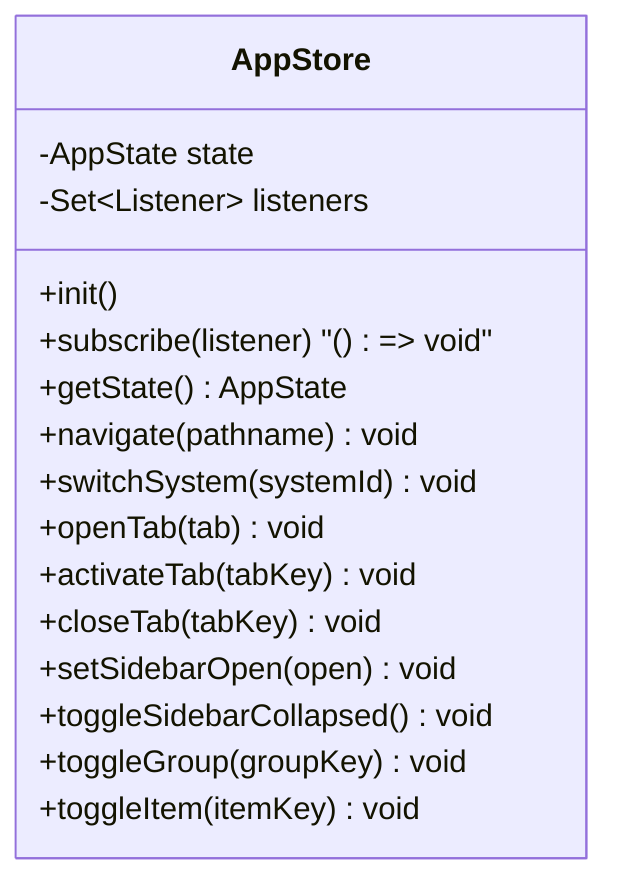
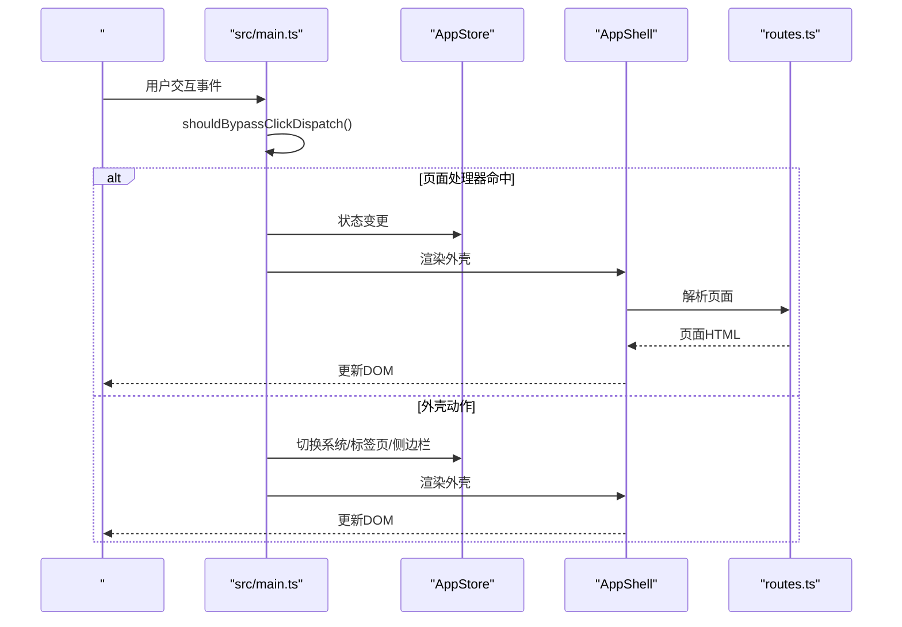
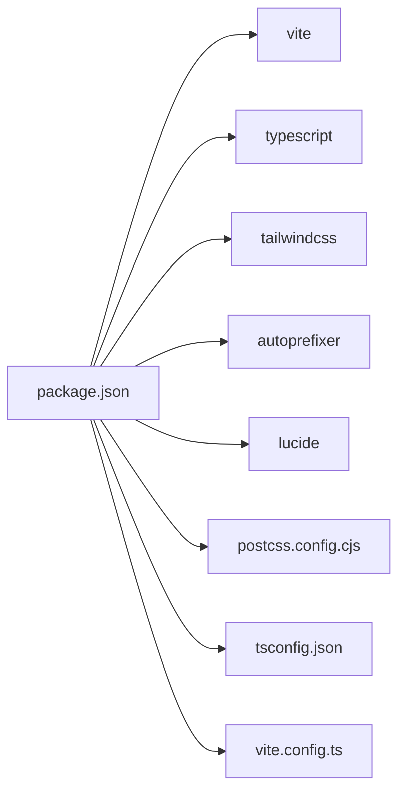

# 开发指南

<cite>
**本文档引用的文件**
- [package.json](file://package.json)
- [vite.config.ts](file://vite.config.ts)
- [tsconfig.json](file://tsconfig.json)
- [postcss.config.cjs](file://postcss.config.cjs)
- [index.html](file://index.html)
- [src/main.ts](file://src/main.ts)
- [src/state/store.ts](file://src/state/store.ts)
- [src/router/routes.ts](file://src/router/routes.ts)
- [src/components/shell.ts](file://src/components/shell.ts)
- [src/data/app-shell-config.ts](file://src/data/app-shell-config.ts)
- [src/utils.ts](file://src/utils.ts)
- [src/styles.css](file://src/styles.css)
- [AGENTS.md](file://AGENTS.md)
</cite>

## 目录
1. [简介](#简介)
2. [项目结构](#项目结构)
3. [核心组件](#核心组件)
4. [架构总览](#架构总览)
5. [详细组件分析](#详细组件分析)
6. [依赖分析](#依赖分析)
7. [性能考虑](#性能考虑)
8. [调试与工具](#调试与工具)
9. [开发流程指南](#开发流程指南)
10. [常见问题与故障排除](#常见问题与故障排除)
11. [结论](#结论)

## 简介
本指南面向 higoods 项目的前端开发团队，提供从环境搭建、工具配置、代码规范、调试技巧到完整开发流程的系统化说明。项目采用 Vite + TypeScript + Tailwind CSS 技术栈，以“产品原型”为目标，强调页面结构、信息结构与交互演示，避免过度工程化。

## 项目结构
项目采用“按功能域分层 + 轻量状态管理”的组织方式：
- 根目录提供构建与配置文件（Vite、TypeScript、PostCSS、包管理）
- src 目录为核心源代码，包含应用外壳、路由、状态、页面与数据模型
- index.html 作为应用入口，挂载 #app 容器并加载主入口脚本

**图表来源**
- [index.html](file://index.html)
- [src/main.ts](file://src/main.ts)
- [src/components/shell.ts](file://src/components/shell.ts)
- [src/router/routes.ts](file://src/router/routes.ts)
- [src/state/store.ts](file://src/state/store.ts)
- [src/data/app-shell-config.ts](file://src/data/app-shell-config.ts)
- [src/utils.ts](file://src/utils.ts)
- [src/styles.css](file://src/styles.css)
- [package.json](file://package.json)
- [vite.config.ts](file://vite.config.ts)
- [tsconfig.json](file://tsconfig.json)
- [postcss.config.cjs](file://postcss.config.cjs)

**章节来源**
- [index.html](file://index.html)
- [package.json](file://package.json)

## 核心组件
- 应用外壳与渲染
  - 应用外壳负责顶部栏、侧边菜单、标签页与主内容区域的拼装与渲染，并通过图标库进行统一的图标注入。
- 路由与页面解析
  - 路由系统支持精确路径与动态参数两类路由，将 pathname 解析为对应页面的 HTML 片段。
- 全局状态管理
  - 简化的 Store 实现，负责 pathname、侧边栏状态、标签页集合与菜单展开状态，并持久化部分状态。
- 主入口与事件分发
  - 主入口集中注册点击、输入、变更、提交等事件，将用户交互委派给具体页面处理器，触发重新渲染。

**章节来源**
- [src/components/shell.ts](file://src/components/shell.ts)
- [src/router/routes.ts](file://src/router/routes.ts)
- [src/state/store.ts](file://src/state/store.ts)
- [src/main.ts](file://src/main.ts)

## 架构总览
应用采用“事件驱动 + 轻状态”的前端架构：
- 用户交互通过主入口捕获，按需调用页面处理器或状态管理器
- 渲染通过外壳组件统一输出，确保 UI 结构一致性
- 路由解析决定页面内容，支持占位页与 404 回退

**图表来源**
- [src/main.ts](file://src/main.ts)
- [src/router/routes.ts](file://src/router/routes.ts)
- [src/state/store.ts](file://src/state/store.ts)
- [src/components/shell.ts](file://src/components/shell.ts)

## 详细组件分析

### 组件一：应用外壳（App Shell）
- 功能要点
  - 顶部栏：系统切换、通知、用户信息
  - 侧边栏：系统菜单分组与子项，支持折叠/展开
  - 标签页：多页签管理与切换
  - 图标：基于 lucide 注入，统一尺寸与描边
- 设计模式
  - 组合渲染：通过字符串模板拼装各模块
  - 状态驱动：根据 AppState 控制 UI 状态
- 性能与可维护性
  - 将菜单与系统配置解耦，便于扩展新系统
  - 使用工具函数进行安全转义与类名拼接

**图表来源**
- [src/components/shell.ts](file://src/components/shell.ts)
- [src/state/store.ts](file://src/state/store.ts)

**章节来源**
- [src/components/shell.ts](file://src/components/shell.ts)
- [src/data/app-shell-config.ts](file://src/data/app-shell-config.ts)
- [src/utils.ts](file://src/utils.ts)

### 组件二：路由与页面解析
- 功能要点
  - 精确路由：静态路径映射到页面渲染函数
  - 动态路由：正则匹配参数并渲染详情页
  - 回退策略：找不到菜单项时返回占位页，否则 404
- 扩展建议
  - 新增页面时，先在配置中注册菜单与路径，再在路由表中添加渲染映射

**图表来源**
- [src/router/routes.ts](file://src/router/routes.ts)

**章节来源**
- [src/router/routes.ts](file://src/router/routes.ts)

### 组件三：全局状态管理（AppStore）
- 功能要点
  - 订阅/发布：内部维护监听者集合，状态变更时广播
  - 路径与标签页：根据 pathname 同步菜单项与标签页集合
  - 侧边栏与展开状态：支持持久化与切换
- 设计要点
  - 使用 localStorage 存储标签页与侧边栏折叠状态
  - 提供系统切换、标签页打开/激活/关闭等操作

**图表来源**
- [src/state/store.ts](file://src/state/store.ts)

**章节来源**
- [src/state/store.ts](file://src/state/store.ts)

### 组件四：主入口与事件分发
- 功能要点
  - 事件捕获：click/input/change/submit
  - 事件分发：优先尝试页面处理器，再处理外壳动作
  - 渲染：每次事件后统一重新渲染外壳与内容
- 交互细节
  - 对表单控件与选择器等特殊元素进行“绕过”处理，避免重复渲染
  - ESC 键支持多处对话框关闭

**图表来源**
- [src/main.ts](file://src/main.ts)
- [src/state/store.ts](file://src/state/store.ts)
- [src/components/shell.ts](file://src/components/shell.ts)
- [src/router/routes.ts](file://src/router/routes.ts)

**章节来源**
- [src/main.ts](file://src/main.ts)

## 依赖分析
- 构建与运行
  - Vite：开发服务器、热重载、打包
  - TypeScript：类型检查与编译
  - Tailwind CSS：原子化样式与主题变量
  - PostCSS/Autoprefixer：样式后处理与兼容
- 运行时依赖
  - lucide：图标库，配合外壳进行图标注入

**图表来源**
- [package.json](file://package.json)
- [postcss.config.cjs](file://postcss.config.cjs)
- [tsconfig.json](file://tsconfig.json)
- [vite.config.ts](file://vite.config.ts)

**章节来源**
- [package.json](file://package.json)
- [postcss.config.cjs](file://postcss.config.cjs)
- [tsconfig.json](file://tsconfig.json)
- [vite.config.ts](file://vite.config.ts)

## 性能考虑
- 渲染优化
  - 事件分发后统一渲染，避免重复 DOM 操作
  - 对输入/选择器等控件进行“绕过”处理，减少不必要的重绘
- 样式与图标
  - Tailwind 原子类提升样式复用效率；图标通过一次性注入，避免逐个创建
- 构建与缓存
  - Vite 的模块热替换在开发阶段显著提升迭代速度
  - TypeScript 严格模式有助于早期发现潜在性能问题

[本节为通用指导，无需特定文件引用]

## 调试与工具
- 浏览器开发者工具
  - Elements：检查外壳结构与标签页容器
  - Console：观察状态变更与事件日志
  - Network：确认静态资源加载与缓存
  - Performance：分析渲染耗时与重排
- 调试技巧
  - 在主入口中临时打印事件目标与命中分支，辅助定位问题
  - 使用状态管理的订阅机制，在变更时输出日志
- 性能分析
  - 利用浏览器性能面板测量渲染时间与内存占用
  - 关注大规模列表渲染与图标注入对性能的影响

[本节为通用指导，无需特定文件引用]

## 开发流程指南
- 环境搭建
  - Node.js：使用当前 LTS 版本（建议 18.x 或 20.x），确保 npm/pnpm 可用
  - 包管理器：推荐 pnpm（与锁定文件一致）
  - 依赖安装：执行安装命令后，确认 node_modules 与锁定文件存在
- 开发服务器
  - 启动：运行开发脚本，访问默认端口
  - 热重载：修改任意源文件后，浏览器自动刷新
- 构建与预览
  - 构建：生成 dist 目录，包含打包后的静态资源
  - 预览：本地预览构建产物，验证生产环境行为
- 代码规范与最佳实践
  - 文件组织：按功能域分层，页面、数据、样式、工具分别存放
  - 命名约定：组件与页面使用帕斯卡命名，常量使用大写下划线，变量使用驼峰
  - 类型约束：充分利用 TypeScript 的类型系统，避免 any
  - 安全：对外部输入进行转义，防止 XSS
- 添加新页面组件
  - 在路由表中注册精确或动态路由
  - 在外壳配置中添加菜单项
  - 编写页面渲染函数，返回 HTML 片段
  - 在主入口中注册事件处理器与对话框状态
- 扩展数据模型
  - 在 data 目录下新增类型与 Mock 数据
  - 在页面中导入并使用，确保类型安全
- 集成新业务功能
  - 从外壳配置入手，逐步完善菜单与路由
  - 通过状态管理协调页面间的状态共享
  - 使用工具函数保证 UI 一致性与安全性

**章节来源**
- [AGENTS.md](file://AGENTS.md)
- [package.json](file://package.json)
- [vite.config.ts](file://vite.config.ts)
- [tsconfig.json](file://tsconfig.json)
- [postcss.config.cjs](file://postcss.config.cjs)
- [src/data/app-shell-config.ts](file://src/data/app-shell-config.ts)
- [src/router/routes.ts](file://src/router/routes.ts)
- [src/main.ts](file://src/main.ts)
- [src/state/store.ts](file://src/state/store.ts)
- [src/utils.ts](file://src/utils.ts)

## 常见问题与故障排除
- 开发服务器无法启动
  - 检查端口占用与 Vite 配置
  - 确认依赖安装完成且版本兼容
- 热重载无效
  - 确认修改的文件在 Vite 监听范围内
  - 清除浏览器缓存或启用禁用缓存模式
- 图标不显示
  - 确保外壳中的图标注入已执行
  - 检查图标名称大小写与 Lucide 版本
- 页面空白或路由异常
  - 检查路由表是否注册新路径
  - 确认外壳配置中的菜单项与路径一致
- 样式异常
  - 确认 Tailwind CSS 已正确引入
  - 检查 PostCSS 插件链与浏览器兼容性
- 状态不持久化
  - 检查 localStorage 是否可用
  - 确认状态变更后是否触发保存

**章节来源**
- [vite.config.ts](file://vite.config.ts)
- [postcss.config.cjs](file://postcss.config.cjs)
- [src/components/shell.ts](file://src/components/shell.ts)
- [src/router/routes.ts](file://src/router/routes.ts)
- [src/state/store.ts](file://src/state/store.ts)

## 结论
本指南围绕 higoods 的前端架构与开发实践提供了从环境搭建到调试部署的全流程说明。项目以“原型优先”的理念，强调页面表达与交互演示，同时通过轻量状态管理与事件分发维持良好的可维护性。遵循本文档的规范与流程，可高效推进页面原型的迭代与交付。