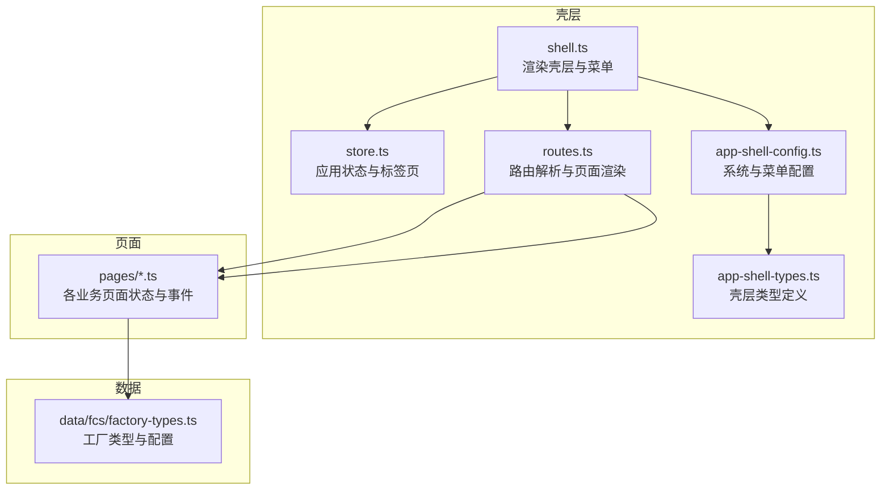
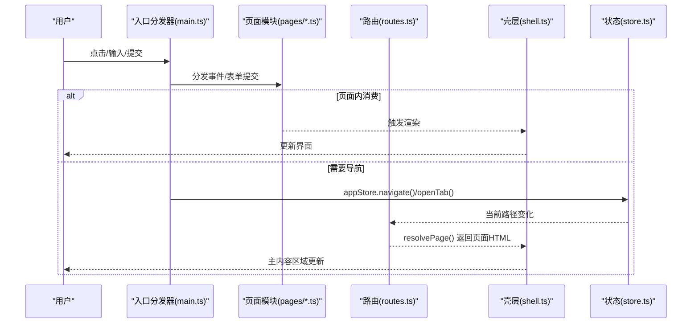
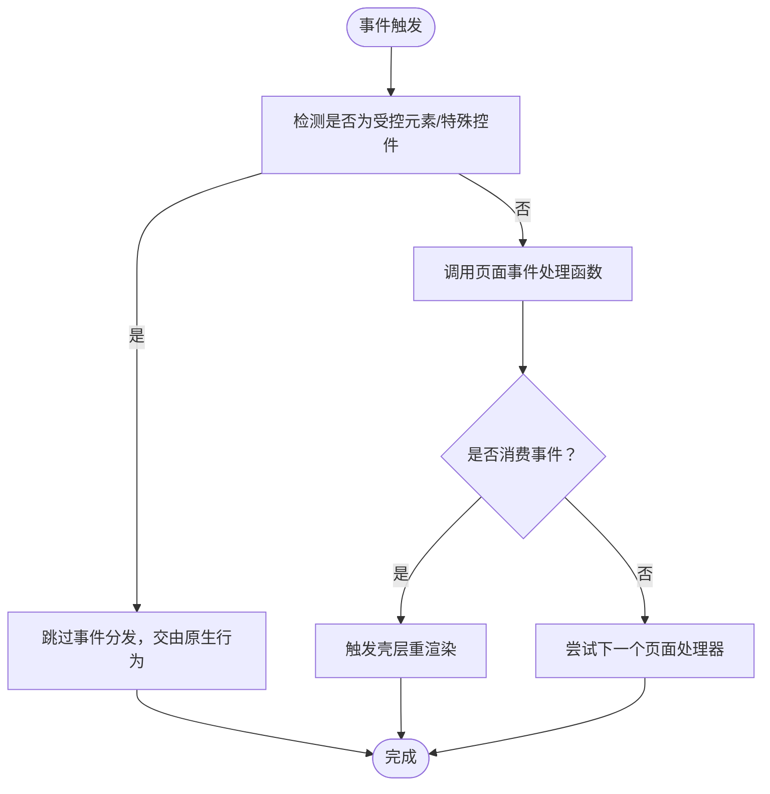
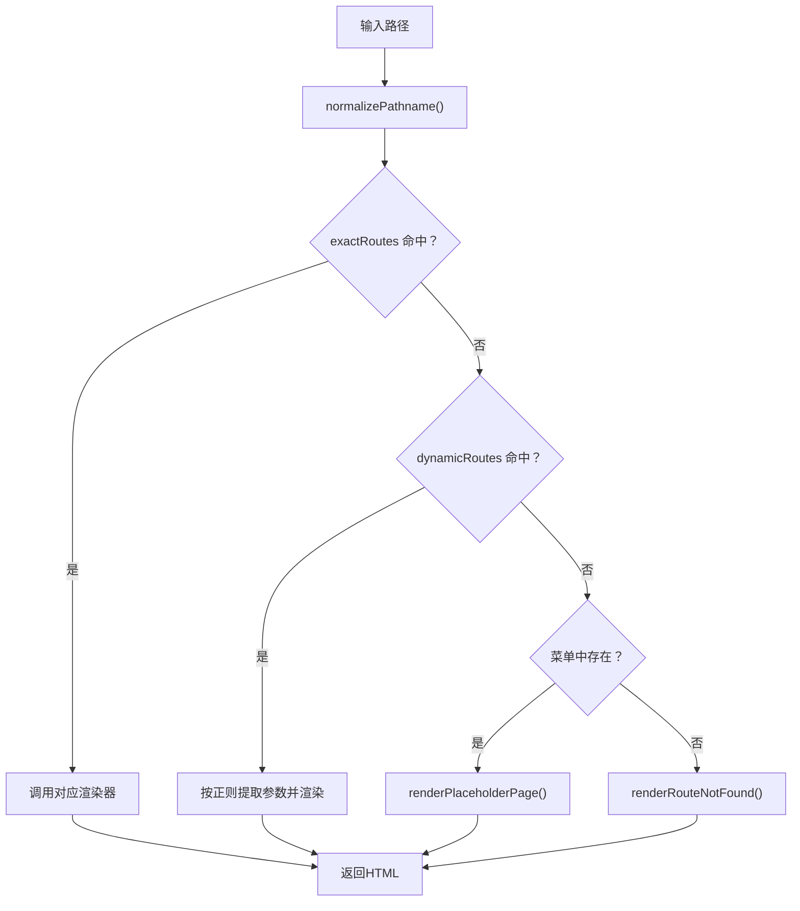
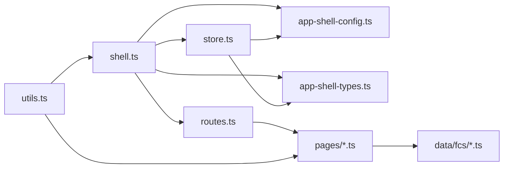

# 扩展开发

<cite>
**本文引用的文件**   
- [src/main.ts](file://src/main.ts)
- [src/router/routes.ts](file://src/router/routes.ts)
- [src/state/store.ts](file://src/state/store.ts)
- [src/components/shell.ts](file://src/components/shell.ts)
- [src/data/app-shell-config.ts](file://src/data/app-shell-config.ts)
- [src/data/app-shell-types.ts](file://src/data/app-shell-types.ts)
- [src/pages/placeholder.ts](file://src/pages/placeholder.ts)
- [src/data/fcs/factory-types.ts](file://src/data/fcs/factory-types.ts)
- [src/utils.ts](file://src/utils.ts)
- [package.json](file://package.json)
</cite>

## 目录
1. [简介](#简介)
2. [项目结构](#项目结构)
3. [核心组件](#核心组件)
4. [架构总览](#架构总览)
5. [详细组件分析](#详细组件分析)
6. [依赖分析](#依赖分析)
7. [性能考虑](#性能考虑)
8. [故障排查指南](#故障排查指南)
9. [结论](#结论)
10. [附录](#附录)

## 简介
本指南面向希望在 higoods 项目中进行扩展开发的工程师，系统讲解插件化架构与扩展点，涵盖事件处理器插件、页面组件插件与数据源插件的开发范式；详解如何通过配置文件注册新系统与功能模块（菜单、路由、页面组件），并通过 API 接口集成外部数据与服务；同时给出最佳实践、调试与测试策略，以及常见扩展场景的实现路径。

## 项目结构
higoods 采用“壳层 + 页面 + 数据”三层结构：
- 壳层（App Shell）：负责系统切换、菜单渲染、标签页与路由解析，位于 components/shell.ts、state/store.ts、router/routes.ts、data/app-shell-config.ts、data/app-shell-types.ts。
- 页面（Pages）：每个业务页面由独立模块管理状态与事件，如工厂档案、生产、进度、结算等，位于 pages/ 下。
- 数据（Data）：业务数据与类型定义，如工厂类型、能力标签等，位于 data/fcs/ 与 data/app-shell-config.ts。

**图表来源**
- [src/components/shell.ts:292-311](file://src/components/shell.ts#L292-L311)
- [src/state/store.ts:172-178](file://src/state/store.ts#L172-L178)
- [src/router/routes.ts:428-453](file://src/router/routes.ts#L428-L453)
- [src/data/app-shell-config.ts:21-355](file://src/data/app-shell-config.ts#L21-L355)
- [src/data/app-shell-types.ts:6-46](file://src/data/app-shell-types.ts#L6-L46)
- [src/data/fcs/factory-types.ts:48-92](file://src/data/fcs/factory-types.ts#L48-L92)

**章节来源**
- [src/components/shell.ts:292-311](file://src/components/shell.ts#L292-L311)
- [src/state/store.ts:172-178](file://src/state/store.ts#L172-L178)
- [src/router/routes.ts:428-453](file://src/router/routes.ts#L428-L453)
- [src/data/app-shell-config.ts:21-355](file://src/data/app-shell-config.ts#L21-L355)
- [src/data/app-shell-types.ts:6-46](file://src/data/app-shell-types.ts#L6-L46)

## 核心组件
- 应用壳层渲染器：负责顶部栏、侧边菜单、标签页与主内容区域的拼装与图标初始化。
- 应用状态存储：集中管理当前路径、侧边栏状态、标签页集合与展开状态，并提供导航与标签页操作。
- 路由解析器：根据路径匹配精确路由或动态路由，找不到时回退到占位页或 404。
- 配置与类型：系统列表、菜单树、菜单项与标签页类型定义，支撑壳层渲染与路由联动。
- 页面模块：每个页面维护自身状态、事件处理函数与表单提交处理，统一由入口分发器调用。

**章节来源**
- [src/components/shell.ts:292-311](file://src/components/shell.ts#L292-L311)
- [src/state/store.ts:89-304](file://src/state/store.ts#L89-L304)
- [src/router/routes.ts:108-453](file://src/router/routes.ts#L108-L453)
- [src/data/app-shell-config.ts:8-18](file://src/data/app-shell-config.ts#L8-L18)
- [src/data/app-shell-types.ts:6-46](file://src/data/app-shell-types.ts#L6-L46)

## 架构总览
higoods 的扩展架构以“壳层 + 页面 + 配置”为核心，事件通过入口分发器统一调度，页面内部再细分事件处理器与表单提交处理器，路由解析器负责页面渲染，状态存储负责跨页面共享与 UI 同步。

**图表来源**
- [src/main.ts:242-327](file://src/main.ts#L242-L327)
- [src/router/routes.ts:428-453](file://src/router/routes.ts#L428-L453)
- [src/components/shell.ts:292-311](file://src/components/shell.ts#L292-L311)
- [src/state/store.ts:172-178](file://src/state/store.ts#L172-L178)

## 详细组件分析

### 事件处理器插件（页面级）
- 设计要点
  - 每个页面导出一组事件处理函数（如 handleXxxEvent），用于响应页面内的 dataset 动作。
  - 表单提交由 handleXxxSubmit 统一处理，返回布尔值表示是否消费该事件。
  - 入口分发器按顺序尝试分发，命中即阻止默认行为并触发壳层重渲染。
- 开发步骤
  - 在页面模块中定义事件处理函数，更新本地状态。
  - 在入口分发器中注册该页面的事件处理函数。
  - 在页面模板中通过 data-* 属性绑定动作名与参数。
- 最佳实践
  - 使用 dataset 命名规范（如 data-action、data-field、data-item-key），避免与原生控件冲突。
  - 对输入/变更事件进行节流或防抖，减少不必要的重渲染。
  - 对复杂逻辑使用局部状态机，保持页面状态可预测。

**图表来源**
- [src/main.ts:376-491](file://src/main.ts#L376-L491)

**章节来源**
- [src/main.ts:242-327](file://src/main.ts#L242-L327)
- [src/main.ts:376-491](file://src/main.ts#L376-L491)

### 页面组件插件（路由与菜单）
- 设计要点
  - 路由解析器支持精确路由与动态路由，找不到时回退到占位页或 404。
  - 菜单配置与系统配置解耦，通过 menusBySystem 与系统 id 关联。
  - 标签页与当前菜单项联动，自动注入可关闭的标签页。
- 开发步骤
  - 在 routes.ts 中注册精确路由或动态路由。
  - 在 app-shell-config.ts 中添加菜单项与系统默认页。
  - 在页面模块中实现 renderXxxPage 函数，返回 HTML 字符串。
- 最佳实践
  - 路由路径与菜单 href 保持一致，确保标签页与菜单高亮联动。
  - 占位页用于未完成迁移的页面，提供清晰的提示与分类归属。

**图表来源**
- [src/router/routes.ts:108-453](file://src/router/routes.ts#L108-L453)

**章节来源**
- [src/router/routes.ts:112-453](file://src/router/routes.ts#L112-L453)
- [src/data/app-shell-config.ts:21-355](file://src/data/app-shell-config.ts#L21-L355)
- [src/pages/placeholder.ts:3-32](file://src/pages/placeholder.ts#L3-L32)

### 数据源插件（类型与配置）
- 设计要点
  - 类型定义集中在 app-shell-types.ts，页面类型在 data/fcs/* 下扩展。
  - 配置集中在 app-shell-config.ts，包含系统列表与菜单树。
  - 工具函数（如 escapeHtml、toClassName）统一安全与样式拼接。
- 开发步骤
  - 在 app-shell-types.ts 或业务类型文件中新增接口与常量。
  - 在 app-shell-config.ts 中补充系统与菜单项。
  - 在页面中引入类型与配置，渲染菜单与占位页。
- 最佳实践
  - 类型与配置分离，便于跨页面复用与维护。
  - 对外暴露只读配置，避免运行时修改导致状态不一致。

**章节来源**
- [src/data/app-shell-types.ts:6-46](file://src/data/app-shell-types.ts#L6-L46)
- [src/data/app-shell-config.ts:8-18](file://src/data/app-shell-config.ts#L8-L18)
- [src/data/fcs/factory-types.ts:48-92](file://src/data/fcs/factory-types.ts#L48-L92)
- [src/utils.ts:1-18](file://src/utils.ts#L1-L18)

### 系统与模块注册（菜单、路由、页面）
- 注册步骤
  - 在系统列表中添加新系统，设置默认页。
  - 在 menusBySystem 中为新系统添加菜单组与菜单项。
  - 在 routes.ts 中注册精确或动态路由。
  - 在页面模块中实现渲染函数。
- 验证方法
  - 切换系统按钮是否正确高亮当前系统。
  - 点击菜单项是否生成可关闭标签页并进入对应页面。
  - 访问未实现路由时是否显示占位页或 404。

**章节来源**
- [src/data/app-shell-config.ts:8-18](file://src/data/app-shell-config.ts#L8-L18)
- [src/data/app-shell-config.ts:21-355](file://src/data/app-shell-config.ts#L21-L355)
- [src/router/routes.ts:112-404](file://src/router/routes.ts#L112-L404)
- [src/components/shell.ts:25-79](file://src/components/shell.ts#L25-L79)

### API 集成（外部数据与服务）
- 集成方式
  - 页面模块通过 fetch 或自定义请求封装访问外部 API。
  - 将异步数据写入页面状态，触发事件处理与重渲染。
  - 对错误进行统一捕获与提示，避免阻断 UI。
- 最佳实践
  - 使用 AbortController 控制请求生命周期，防止竞态。
  - 对高频请求进行缓存与去重（如查询参数相同则复用上次结果）。
  - 对敏感数据进行脱敏与校验，避免 XSS 与注入。

[本节为通用指导，无需特定文件引用]

### 插件开发最佳实践
- 代码组织
  - 页面模块内按职责拆分：状态、渲染、事件、表单提交、工具函数。
  - 事件命名与数据属性保持一致，便于调试与协作。
- 错误处理
  - 对用户输入进行格式化与校验，失败时设置 formError 并阻止提交。
  - 对网络请求进行 try/catch，统一错误提示。
- 性能优化
  - 事件分发器中避免对受控元素重复处理，减少重渲染。
  - 使用虚拟滚动或分页加载大数据集。
  - 图标初始化仅在挂载时执行一次。

**章节来源**
- [src/main.ts:376-491](file://src/main.ts#L376-L491)
- [src/pages/factory-profile.ts:1837-1875](file://src/pages/factory-profile.ts#L1837-L1875)

### 调试与测试策略
- 调试方法
  - 在事件处理函数中打印关键状态变化，确认数据流向。
  - 使用浏览器开发者工具检查 dataset 是否正确绑定。
  - 在路由解析器中增加日志，验证路径匹配与回退逻辑。
- 测试策略
  - 单元测试：针对事件处理函数与状态转换编写断言。
  - 集成测试：模拟点击、输入、提交，验证页面渲染与标签页联动。
  - 回归测试：新增路由后验证菜单高亮与占位页行为。

**章节来源**
- [src/router/routes.ts:428-453](file://src/router/routes.ts#L428-L453)
- [src/components/shell.ts:253-290](file://src/components/shell.ts#L253-L290)

## 依赖分析
- 外部依赖
  - lucide：图标库，用于壳层与页面中的图标渲染。
  - TailwindCSS 及相关工具：提供样式基础与响应式布局。
- 内部依赖
  - shell.ts 依赖 routes.ts、store.ts、app-shell-config.ts、app-shell-types.ts。
  - routes.ts 依赖 app-shell-config.ts 与各页面渲染器。
  - store.ts 依赖 app-shell-config.ts 与 app-shell-types.ts。
  - 页面模块依赖数据类型与工具函数。

**图表来源**
- [src/components/shell.ts:1-12](file://src/components/shell.ts#L1-L12)
- [src/router/routes.ts:1-104](file://src/router/routes.ts#L1-L104)
- [src/state/store.ts:1-11](file://src/state/store.ts#L1-L11)
- [src/data/app-shell-config.ts:1-6](file://src/data/app-shell-config.ts#L1-L6)
- [src/data/app-shell-types.ts:1-4](file://src/data/app-shell-types.ts#L1-L4)
- [src/utils.ts:1-18](file://src/utils.ts#L1-L18)
- [package.json:11-21](file://package.json#L11-L21)

**章节来源**
- [package.json:11-21](file://package.json#L11-L21)

## 性能考虑
- 渲染层面
  - 事件分发器对受控元素进行短路判断，避免全量重渲染。
  - 壳层渲染仅在状态变化时触发，减少 DOM 操作。
- 数据层面
  - 页面内分页与排序在内存中完成，避免频繁请求。
  - 对高频筛选与搜索进行防抖，降低计算压力。
- 资源层面
  - 图标初始化一次性完成，避免重复扫描文档。

[本节为通用指导，无需特定文件引用]

## 故障排查指南
- 页面不更新
  - 检查事件处理函数是否返回 true 并触发重渲染。
  - 确认入口分发器中是否注册了对应页面的事件处理函数。
- 路由不生效
  - 核对 routes.ts 中的精确路由或动态路由正则是否匹配。
  - 确认菜单 href 与路由路径一致，否则占位页不会显示。
- 标签页不出现
  - 检查 app-shell-config.ts 中的菜单项是否配置了 href。
  - 确认 appStore.openTab() 是否被调用且传入正确的 key/title/href。

**章节来源**
- [src/main.ts:242-327](file://src/main.ts#L242-L327)
- [src/router/routes.ts:428-453](file://src/router/routes.ts#L428-L453)
- [src/state/store.ts:186-269](file://src/state/store.ts#L186-L269)

## 结论
higoods 的扩展开发围绕“壳层 + 页面 + 配置”的清晰边界展开：通过事件处理器插件实现页面内交互，通过页面组件插件实现路由与菜单联动，通过数据源插件实现类型与配置扩展。遵循本文的最佳实践与调试策略，可高效、稳定地扩展系统功能并集成外部数据服务。

## 附录
- 常见扩展场景
  - 新增系统：在系统列表与菜单配置中注册，路由中添加页面渲染器。
  - 新增页面：在 routes.ts 注册路由，在页面模块实现渲染与事件处理。
  - 新增菜单项：在 menusBySystem 中添加，确保 href 与路由一致。
  - 集成外部 API：在页面模块发起请求，更新状态并触发重渲染。

[本节为概念性总结，无需特定文件引用]