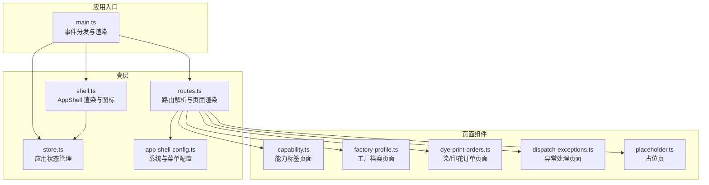
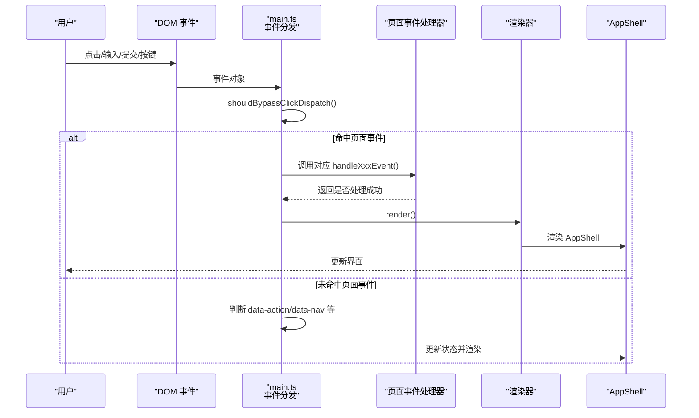
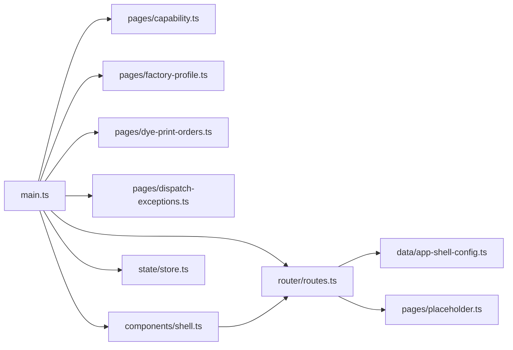
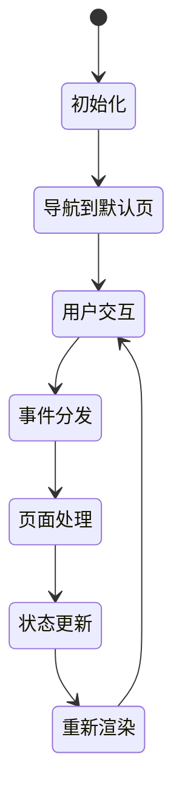
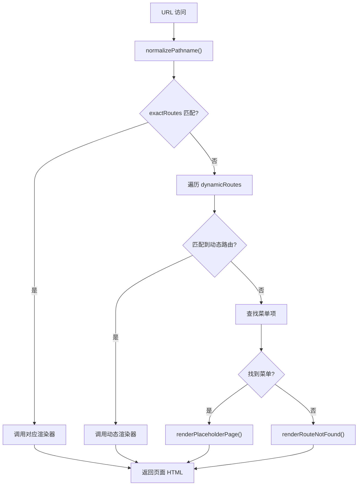

# 插件开发指南

<cite>
**本文档引用的文件**
- [src/main.ts](file://src/main.ts)
- [src/components/shell.ts](file://src/components/shell.ts)
- [src/state/store.ts](file://src/state/store.ts)
- [src/router/routes.ts](file://src/router/routes.ts)
- [src/data/app-shell-config.ts](file://src/data/app-shell-config.ts)
- [src/pages/capability.ts](file://src/pages/capability.ts)
- [src/pages/factory-profile.ts](file://src/pages/factory-profile.ts)
- [src/pages/placeholder.ts](file://src/pages/placeholder.ts)
- [src/pages/dye-print-orders.ts](file://src/pages/dye-print-orders.ts)
- [src/pages/dispatch-exceptions.ts](file://src/pages/dispatch-exceptions.ts)
</cite>

## 目录
1. [简介](#简介)
2. [项目结构](#项目结构)
3. [核心组件](#核心组件)
4. [架构总览](#架构总览)
5. [详细组件分析](#详细组件分析)
6. [依赖关系分析](#依赖关系分析)
7. [性能考虑](#性能考虑)
8. [故障排查指南](#故障排查指南)
9. [结论](#结论)
10. [附录](#附录)

## 简介
本指南面向 higoods 的插件开发者，重点讲解两类插件的开发方式：
- 事件处理器插件：通过页面组件内的 dataset 属性注册事件处理函数，统一由应用入口集中分发。
- 页面组件插件：为新页面创建独立的渲染器与事件处理器，并将其纳入路由与菜单体系。

文档将详细说明：
- 如何通过 dataset 属性注册新的事件处理器
- 如何在 main.ts 中添加新的事件处理函数
- 如何创建新的页面组件并将其集成到事件分发系统
- 插件注册机制、事件处理器的注册顺序、命名规范与冲突处理
- 具体的开发示例路径（以代码片段路径代替具体代码）
- 最佳实践（错误处理、性能优化、调试技巧）
- 测试方法与验证步骤

## 项目结构
higoods 采用“壳层 + 页面组件 + 路由 + 状态管理”的分层架构：
- 壳层（App Shell）：负责系统切换、菜单、标签页、图标等通用 UI。
- 页面组件：每个业务页面拥有独立的渲染器与事件处理器。
- 路由系统：将 URL 映射到页面渲染器，支持精确路由与动态路由。
- 状态管理：集中管理应用状态（如菜单展开、标签页、侧边栏等），并提供订阅机制。

**图表来源**
- [src/main.ts:242-318](file://src/main.ts#L242-L318)
- [src/components/shell.ts:292-324](file://src/components/shell.ts#L292-L324)
- [src/state/store.ts:89-304](file://src/state/store.ts#L89-L304)
- [src/router/routes.ts:428-453](file://src/router/routes.ts#L428-L453)
- [src/data/app-shell-config.ts:21-355](file://src/data/app-shell-config.ts#L21-L355)
- [src/pages/capability.ts:651-800](file://src/pages/capability.ts#L651-L800)
- [src/pages/factory-profile.ts:1-100](file://src/pages/factory-profile.ts#L1-L100)
- [src/pages/dye-print-orders.ts:1146-1207](file://src/pages/dye-print-orders.ts#L1146-L1207)
- [src/pages/dispatch-exceptions.ts:1030-1080](file://src/pages/dispatch-exceptions.ts#L1030-L1080)
- [src/pages/placeholder.ts:3-32](file://src/pages/placeholder.ts#L3-L32)

**章节来源**
- [src/main.ts:242-318](file://src/main.ts#L242-L318)
- [src/components/shell.ts:292-324](file://src/components/shell.ts#L292-L324)
- [src/state/store.ts:89-304](file://src/state/store.ts#L89-L304)
- [src/router/routes.ts:428-453](file://src/router/routes.ts#L428-L453)
- [src/data/app-shell-config.ts:21-355](file://src/data/app-shell-config.ts#L21-L355)

## 核心组件
- 应用入口与事件分发：在 main.ts 中集中监听 click/change/submit/keydown 等事件，按顺序尝试调用各页面的事件处理器；若命中则阻止默认行为并触发重新渲染。
- 壳层渲染：shell.ts 负责顶部栏、侧边栏、标签栏与主内容区域的拼装。
- 状态管理：store.ts 提供应用状态（路径、侧边栏、标签页、展开状态等）与订阅机制。
- 路由系统：routes.ts 将 URL 映射到页面渲染器，支持精确路由与动态路由，找不到时返回占位页或 404。
- 页面组件：每个页面包含独立的渲染器与事件处理器，遵循统一的 dataset 命名约定。

**章节来源**
- [src/main.ts:242-318](file://src/main.ts#L242-L318)
- [src/components/shell.ts:292-324](file://src/components/shell.ts#L292-L324)
- [src/state/store.ts:89-304](file://src/state/store.ts#L89-L304)
- [src/router/routes.ts:428-453](file://src/router/routes.ts#L428-L453)

## 架构总览
事件从 DOM 触发到页面渲染的完整流程如下：

**图表来源**
- [src/main.ts:376-463](file://src/main.ts#L376-L463)
- [src/main.ts:474-491](file://src/main.ts#L474-L491)
- [src/main.ts:493-526](file://src/main.ts#L493-L526)
- [src/components/shell.ts:292-324](file://src/components/shell.ts#L292-L324)

**章节来源**
- [src/main.ts:376-463](file://src/main.ts#L376-L463)
- [src/main.ts:474-491](file://src/main.ts#L474-L491)
- [src/main.ts:493-526](file://src/main.ts#L493-L526)
- [src/components/shell.ts:292-324](file://src/components/shell.ts#L292-L324)

## 详细组件分析

### 事件处理器插件开发

#### 1) 事件处理器注册与命名规范
- 页面组件内部通过导出的事件处理函数（如 handleXxxEvent、isXxxDialogOpen）与渲染器配合。
- 事件处理器通常遵循以下命名：
  - handle[页面名]Event：用于处理点击/输入/选择等交互事件
  - is[页面名]DialogOpen：用于判断对话框/抽屉等是否处于打开状态
- dataset 属性命名约定：
  - data-[prefix]-action：动作类事件（如 data-cap-action、data-dye-action）
  - data-[prefix]-field / data-[prefix]-filter：字段/过滤器类事件
  - data-nav / data-action：壳层系统级动作（如系统切换、菜单开关）

参考示例路径：
- [handleCapabilityEvent:651-800](file://src/pages/capability.ts#L651-L800)
- [handleDyePrintOrdersEvent:1146-1207](file://src/pages/dye-print-orders.ts#L1146-L1207)
- [isDispatchExceptionsDialogOpen:1078-1080](file://src/pages/dispatch-exceptions.ts#L1078-L1080)

**章节来源**
- [src/pages/capability.ts:651-800](file://src/pages/capability.ts#L651-L800)
- [src/pages/dye-print-orders.ts:1146-1207](file://src/pages/dye-print-orders.ts#L1146-L1207)
- [src/pages/dispatch-exceptions.ts:1078-1080](file://src/pages/dispatch-exceptions.ts#L1078-L1080)

#### 2) 在 main.ts 中添加新的事件处理函数
- 在 main.ts 的 dispatchPageEvent 中追加对新页面事件处理器的调用。
- 保持调用顺序与现有页面一致，确保事件分发的确定性与可维护性。
- 若涉及表单提交，同样在 dispatchPageSubmit 中追加对应处理器。

参考示例路径：
- [dispatchPageEvent:242-318](file://src/main.ts#L242-L318)
- [dispatchPageSubmit:320-327](file://src/main.ts#L320-L327)

**章节来源**
- [src/main.ts:242-318](file://src/main.ts#L242-L318)
- [src/main.ts:320-327](file://src/main.ts#L320-L327)

#### 3) 键盘事件与 ESC 关闭逻辑
- main.ts 对 document 的 keydown 监听中，针对已打开的对话框，会构造一个带有特定 dataset 的按钮元素并调用对应页面的事件处理器，从而实现 ESC 关闭。
- 开发新页面时，建议提供类似的 isXxxDialogOpen 检查函数与 ESC 关闭的 fake button 触发逻辑。

参考示例路径：
- [ESC 关闭逻辑:493-526](file://src/main.ts#L493-L526)

**章节来源**
- [src/main.ts:493-526](file://src/main.ts#L493-L526)

#### 4) 事件分发与渲染流程
- 事件命中后，main.ts 会阻止默认行为并调用 render()，重新渲染 AppShell 并注入图标。
- 壳层渲染由 shell.ts 完成，内部通过 routes.ts 的 resolvePage 获取页面内容。

参考示例路径：
- [render() 调用:329-332](file://src/main.ts#L329-L332)
- [renderAppShell:292-324](file://src/components/shell.ts#L292-L324)
- [resolvePage:428-453](file://src/router/routes.ts#L428-L453)

**章节来源**
- [src/main.ts:329-332](file://src/main.ts#L329-L332)
- [src/components/shell.ts:292-324](file://src/components/shell.ts#L292-L324)
- [src/router/routes.ts:428-453](file://src/router/routes.ts#L428-L453)

### 页面组件插件开发

#### 1) 创建新的页面组件
- 新增页面渲染器：在 pages 目录下创建新文件，导出 renderXxxPage() 函数。
- 新增页面事件处理器：导出 handleXxxEvent() 与 isXxxDialogOpen() 等。
- 在 routes.ts 中注册路由：将新页面的渲染器加入 exactRoutes 或动态路由数组。

参考示例路径：
- [renderCapabilityPage:473-634](file://src/pages/capability.ts#L473-L634)
- [renderFactoryProfilePage:1-100](file://src/pages/factory-profile.ts#L1-L100)
- [exactRoutes 注册:112-168](file://src/router/routes.ts#L112-L168)
- [dynamicRoutes 注册:327-404](file://src/router/routes.ts#L327-L404)

**章节来源**
- [src/pages/capability.ts:473-634](file://src/pages/capability.ts#L473-L634)
- [src/pages/factory-profile.ts:1-100](file://src/pages/factory-profile.ts#L1-L100)
- [src/router/routes.ts:112-168](file://src/router/routes.ts#L112-L168)
- [src/router/routes.ts:327-404](file://src/router/routes.ts#L327-L404)

#### 2) 集成到事件分发系统
- 在 main.ts 的 dispatchPageEvent 中添加对新页面事件处理器的调用。
- 若涉及表单提交，也在 dispatchPageSubmit 中添加对应处理器。
- 为 ESC 关闭提供 isXxxDialogOpen 与 fake button 触发逻辑。

参考示例路径：
- [dispatchPageEvent:242-318](file://src/main.ts#L242-L318)
- [dispatchPageSubmit:320-327](file://src/main.ts#L320-L327)
- [ESC 关闭逻辑:493-526](file://src/main.ts#L493-L526)

**章节来源**
- [src/main.ts:242-318](file://src/main.ts#L242-L318)
- [src/main.ts:320-327](file://src/main.ts#L320-L327)
- [src/main.ts:493-526](file://src/main.ts#L493-L526)

#### 3) 菜单与系统集成
- 在 app-shell-config.ts 中为新页面配置菜单项与系统归属。
- 确保路由与菜单 href 一致，以便路由解析与标签页联动正常工作。

参考示例路径：
- [menusBySystem 配置:21-355](file://src/data/app-shell-config.ts#L21-L355)
- [resolvePage 菜单查找:406-426](file://src/router/routes.ts#L406-L426)

**章节来源**
- [src/data/app-shell-config.ts:21-355](file://src/data/app-shell-config.ts#L21-L355)
- [src/router/routes.ts:406-426](file://src/router/routes.ts#L406-L426)

### 插件注册机制与命名规范

#### 1) 注册顺序
- main.ts 的 dispatchPageEvent 与 dispatchPageSubmit 采用“短路求值”顺序调用，顺序影响事件命中优先级。
- 建议将高频页面的处理器置于靠前位置，减少不必要的遍历。

参考示例路径：
- [dispatchPageEvent 顺序:242-318](file://src/main.ts#L242-L318)
- [dispatchPageSubmit 顺序:320-327](file://src/main.ts#L320-L327)

**章节来源**
- [src/main.ts:242-318](file://src/main.ts#L242-L318)
- [src/main.ts:320-327](file://src/main.ts#L320-L327)

#### 2) 命名规范
- 页面事件处理器：handle[页面名]Event
- 对话框状态检查：is[页面名]DialogOpen
- dataset 前缀：统一使用页面名小写（如 data-cap-, data-dye-）
- 动作与字段：-action/-field/-filter 后缀

参考示例路径：
- [handleCapabilityEvent:651-800](file://src/pages/capability.ts#L651-L800)
- [isDispatchExceptionsDialogOpen:1078-1080](file://src/pages/dispatch-exceptions.ts#L1078-L1080)

**章节来源**
- [src/pages/capability.ts:651-800](file://src/pages/capability.ts#L651-L800)
- [src/pages/dispatch-exceptions.ts:1078-1080](file://src/pages/dispatch-exceptions.ts#L1078-L1080)

#### 3) 冲突处理
- 当多个页面的 dataset 名称冲突时，应确保前缀唯一化，避免误触。
- 在 main.ts 中的 shouldBypassClickDispatch 会跳过原生控件与受控字段，减少误判。

参考示例路径：
- [shouldBypassClickDispatch:351-374](file://src/main.ts#L351-L374)

**章节来源**
- [src/main.ts:351-374](file://src/main.ts#L351-L374)

### 具体开发示例（以路径代替代码）

- 新建页面渲染器与事件处理器
  - [renderCapabilityPage:473-634](file://src/pages/capability.ts#L473-L634)
  - [handleCapabilityEvent:651-800](file://src/pages/capability.ts#L651-L800)
- 在 main.ts 中注册事件处理器
  - [dispatchPageEvent:242-318](file://src/main.ts#L242-L318)
  - [dispatchPageSubmit:320-327](file://src/main.ts#L320-L327)
- 集成路由与菜单
  - [exactRoutes 注册:112-168](file://src/router/routes.ts#L112-L168)
  - [menusBySystem 配置:21-355](file://src/data/app-shell-config.ts#L21-L355)
- ESC 关闭逻辑
  - [ESC 关闭逻辑:493-526](file://src/main.ts#L493-L526)

**章节来源**
- [src/pages/capability.ts:473-634](file://src/pages/capability.ts#L473-L634)
- [src/pages/capability.ts:651-800](file://src/pages/capability.ts#L651-L800)
- [src/main.ts:242-318](file://src/main.ts#L242-L318)
- [src/main.ts:320-327](file://src/main.ts#L320-L327)
- [src/router/routes.ts:112-168](file://src/router/routes.ts#L112-L168)
- [src/data/app-shell-config.ts:21-355](file://src/data/app-shell-config.ts#L21-L355)
- [src/main.ts:493-526](file://src/main.ts#L493-L526)

## 依赖关系分析

**图表来源**
- [src/main.ts:242-318](file://src/main.ts#L242-L318)
- [src/pages/capability.ts:651-800](file://src/pages/capability.ts#L651-L800)
- [src/pages/factory-profile.ts:1-100](file://src/pages/factory-profile.ts#L1-L100)
- [src/pages/dye-print-orders.ts:1146-1207](file://src/pages/dye-print-orders.ts#L1146-L1207)
- [src/pages/dispatch-exceptions.ts:1030-1080](file://src/pages/dispatch-exceptions.ts#L1030-L1080)
- [src/router/routes.ts:428-453](file://src/router/routes.ts#L428-L453)
- [src/data/app-shell-config.ts:21-355](file://src/data/app-shell-config.ts#L21-L355)
- [src/components/shell.ts:292-324](file://src/components/shell.ts#L292-L324)
- [src/state/store.ts:89-304](file://src/state/store.ts#L89-L304)
- [src/pages/placeholder.ts:3-32](file://src/pages/placeholder.ts#L3-L32)

**章节来源**
- [src/main.ts:242-318](file://src/main.ts#L242-L318)
- [src/router/routes.ts:428-453](file://src/router/routes.ts#L428-L453)
- [src/data/app-shell-config.ts:21-355](file://src/data/app-shell-config.ts#L21-L355)
- [src/components/shell.ts:292-324](file://src/components/shell.ts#L292-L324)
- [src/state/store.ts:89-304](file://src/state/store.ts#L89-L304)
- [src/pages/placeholder.ts:3-32](file://src/pages/placeholder.ts#L3-L32)

## 性能考虑
- 事件分发顺序：将高频页面处理器置于前面，减少不必要的调用链。
- 避免全量重渲染：利用 AppStore 的状态更新与订阅机制，尽量局部更新。
- 控制 DOM 事件冒泡：合理使用 shouldBypassClickDispatch，避免对原生控件行为的干扰。
- 图标初始化：hydrateIcons 只需在根节点初始化一次，避免重复扫描。

[本节为通用指导，不直接分析具体文件]

## 故障排查指南
- 事件未触发
  - 检查 dataset 前缀与命名是否符合约定
  - 确认 main.ts 中已注册对应事件处理器
  - 参考：[dispatchPageEvent:242-318](file://src/main.ts#L242-L318)
- 表单提交无效
  - 确认 dispatchPageSubmit 中已添加对应处理器
  - 参考：[dispatchPageSubmit:320-327](file://src/main.ts#L320-L327)
- ESC 无法关闭对话框
  - 检查 isXxxDialogOpen 与 fake button 的 dataset 是否正确
  - 参考：[ESC 关闭逻辑:493-526](file://src/main.ts#L493-L526)
- 页面空白或 404
  - 检查 routes.ts 中的路由注册与菜单 href 是否一致
  - 参考：[resolvePage:428-453](file://src/router/routes.ts#L428-L453)
- 图标不显示
  - 确认 hydrateIcons 在根节点初始化
  - 参考：[hydrateIcons:313-324](file://src/components/shell.ts#L313-L324)

**章节来源**
- [src/main.ts:242-318](file://src/main.ts#L242-L318)
- [src/main.ts:320-327](file://src/main.ts#L320-L327)
- [src/main.ts:493-526](file://src/main.ts#L493-L526)
- [src/router/routes.ts:428-453](file://src/router/routes.ts#L428-L453)
- [src/components/shell.ts:313-324](file://src/components/shell.ts#L313-L324)

## 结论
higoods 的插件开发围绕“统一事件分发 + 页面组件自治”的模式展开。通过规范的 dataset 命名、严格的注册顺序与完善的 ESC 关闭机制，开发者可以快速扩展新的页面与交互功能。建议在开发过程中遵循本文档的命名规范与最佳实践，确保插件的稳定性与可维护性。

[本节为总结，不直接分析具体文件]

## 附录

### A. 数据模型与状态流

**图表来源**
- [src/state/store.ts:101-117](file://src/state/store.ts#L101-L117)
- [src/main.ts:376-463](file://src/main.ts#L376-L463)
- [src/components/shell.ts:292-324](file://src/components/shell.ts#L292-L324)

**章节来源**
- [src/state/store.ts:101-117](file://src/state/store.ts#L101-L117)
- [src/main.ts:376-463](file://src/main.ts#L376-L463)
- [src/components/shell.ts:292-324](file://src/components/shell.ts#L292-L324)

### B. 页面渲染与路由解析流程

**图表来源**
- [src/router/routes.ts:108-110](file://src/router/routes.ts#L108-L110)
- [src/router/routes.ts:428-453](file://src/router/routes.ts#L428-L453)

**章节来源**
- [src/router/routes.ts:108-110](file://src/router/routes.ts#L108-L110)
- [src/router/routes.ts:428-453](file://src/router/routes.ts#L428-L453)