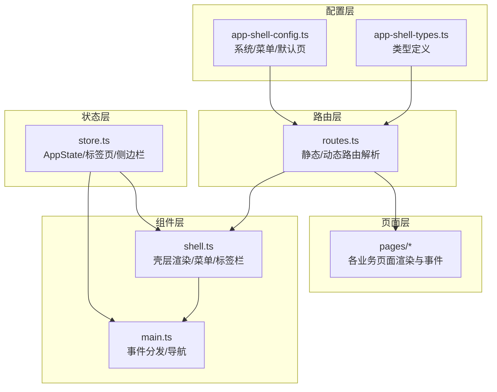
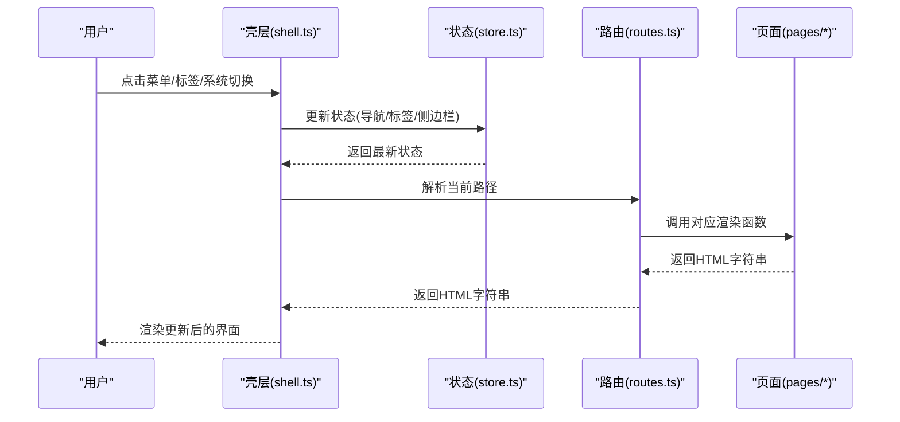
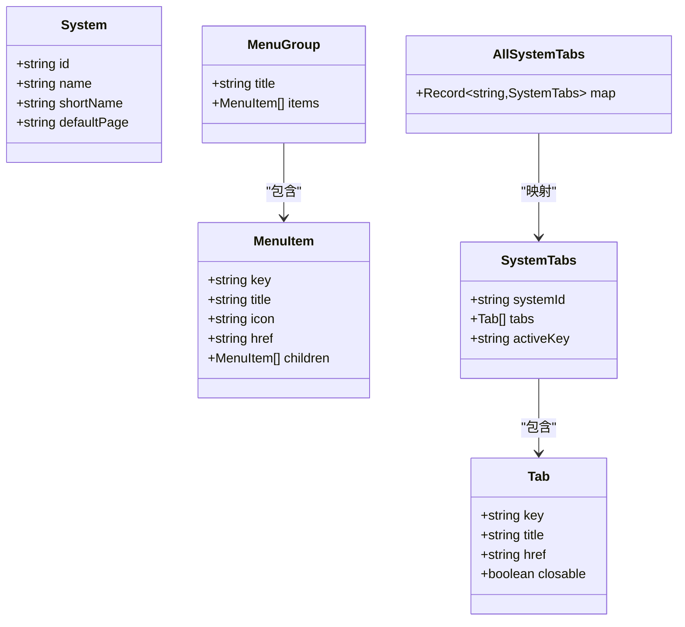
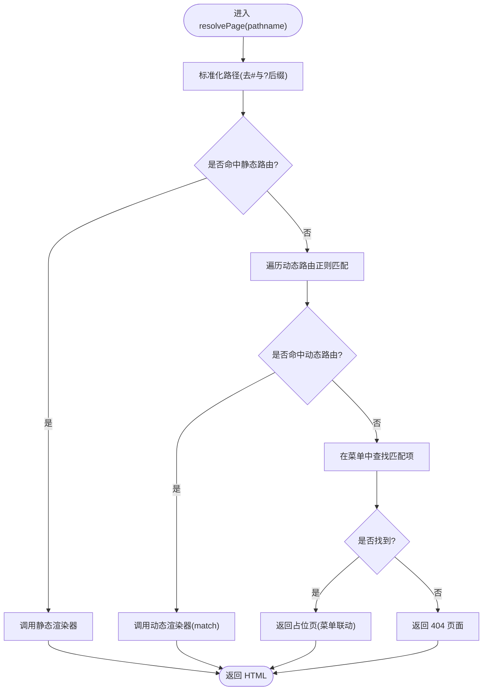
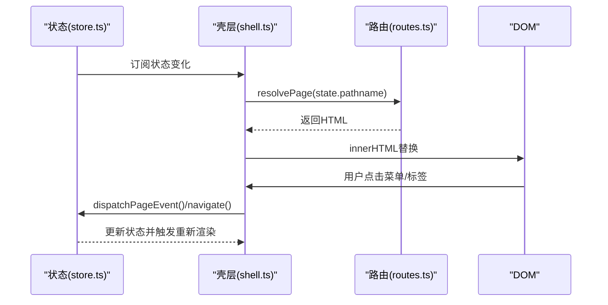
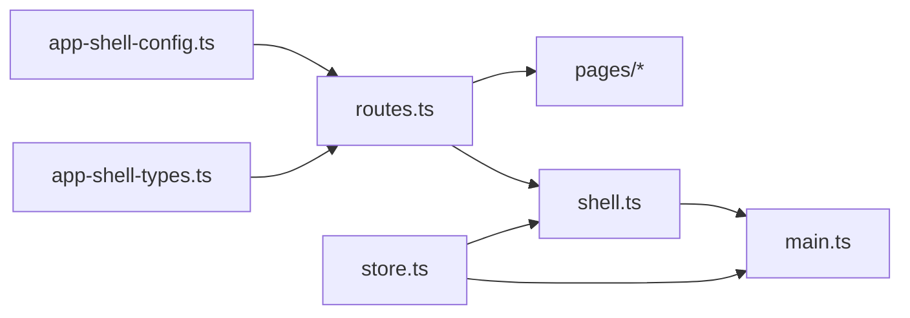

# 新功能集成

<cite>
**本文引用的文件**
- [app-shell-config.ts](file://src/data/app-shell-config.ts)
- [app-shell-types.ts](file://src/data/app-shell-types.ts)
- [routes.ts](file://src/router/routes.ts)
- [shell.ts](file://src/components/shell.ts)
- [store.ts](file://src/state/store.ts)
- [main.ts](file://src/main.ts)
- [utils.ts](file://src/utils.ts)
- [placeholder.ts](file://src/pages/placeholder.ts)
- [pcs-workspace-overview.ts](file://src/pages/pcs-workspace-overview.ts)
- [pcs-projects.ts](file://src/pages/pcs-projects.ts)
</cite>

## 目录
1. [简介](#简介)
2. [项目结构](#项目结构)
3. [核心组件](#核心组件)
4. [架构总览](#架构总览)
5. [详细组件分析](#详细组件分析)
6. [依赖关系分析](#依赖关系分析)
7. [性能考虑](#性能考虑)
8. [故障排查指南](#故障排查指南)
9. [结论](#结论)
10. [附录](#附录)

## 简介
本指南面向需要在 higoods 系统中新增功能模块的开发者，提供从配置到页面集成的完整流程说明。重点涵盖：
- 如何通过配置文件注册新的系统或功能模块（菜单、路由、页面组件）
- app-shell-config.ts 的配置结构与定义方法
- 路由系统的集成方式（静态路由与动态路由）
- 页面组件的注册与事件处理
- 系统集成的调试方法与测试策略

## 项目结构
higoods 采用“配置驱动 + 组件渲染”的前端架构：
- 配置层：集中定义系统、菜单、默认页等元数据
- 路由层：将路径映射到具体页面渲染器
- 组件层：负责 UI 渲染与交互
- 状态层：维护应用状态与标签页状态
- 页面层：每个业务页面的渲染函数与事件处理

图表来源
- [app-shell-config.ts:1-355](file://src/data/app-shell-config.ts#L1-L355)
- [app-shell-types.ts:1-46](file://src/data/app-shell-types.ts#L1-L46)
- [routes.ts:1-454](file://src/router/routes.ts#L1-L454)
- [shell.ts:1-324](file://src/components/shell.ts#L1-L324)
- [store.ts:1-329](file://src/state/store.ts#L1-L329)
- [main.ts:1-933](file://src/main.ts#L1-L933)

章节来源
- [app-shell-config.ts:1-355](file://src/data/app-shell-config.ts#L1-L355)
- [app-shell-types.ts:1-46](file://src/data/app-shell-types.ts#L1-L46)
- [routes.ts:1-454](file://src/router/routes.ts#L1-L454)
- [shell.ts:1-324](file://src/components/shell.ts#L1-L324)
- [store.ts:1-329](file://src/state/store.ts#L1-L329)
- [main.ts:1-933](file://src/main.ts#L1-L933)

## 核心组件
- 配置层：系统列表、菜单分组与菜单项、默认页
- 路由层：静态路由表与动态路由表，路径解析与菜单联动
- 组件层：壳层渲染（顶部栏、左侧菜单、标签栏）、图标初始化
- 状态层：应用状态、标签页集合、侧边栏折叠状态、菜单展开状态
- 页面层：各业务页面的渲染函数与事件处理

章节来源
- [app-shell-config.ts:1-355](file://src/data/app-shell-config.ts#L1-L355)
- [app-shell-types.ts:1-46](file://src/data/app-shell-types.ts#L1-L46)
- [routes.ts:1-454](file://src/router/routes.ts#L1-L454)
- [shell.ts:1-324](file://src/components/shell.ts#L1-L324)
- [store.ts:1-329](file://src/state/store.ts#L1-L329)
- [main.ts:1-933](file://src/main.ts#L1-L933)

## 架构总览
系统通过配置驱动菜单与路由，页面通过渲染函数返回 HTML 字符串，组件层负责事件绑定与导航，状态层持久化用户偏好与标签页状态。

图表来源
- [shell.ts:292-311](file://src/components/shell.ts#L292-L311)
- [store.ts:172-178](file://src/state/store.ts#L172-L178)
- [routes.ts:428-453](file://src/router/routes.ts#L428-L453)
- [pcs-workspace-overview.ts:577-610](file://src/pages/pcs-workspace-overview.ts#L577-L610)

## 详细组件分析

### 配置层：app-shell-config.ts 与 app-shell-types.ts
- 系统定义：包含系统 id、名称、简称、默认页
- 菜单分组：按系统组织菜单分组，每组包含标题与菜单项
- 菜单项：支持多级子菜单，包含键、标题、图标、链接
- 类型定义：System、MenuGroup、MenuItem、Tab、SystemTabs、AllSystemTabs

图表来源
- [app-shell-types.ts:6-46](file://src/data/app-shell-types.ts#L6-L46)
- [app-shell-config.ts:9-18](file://src/data/app-shell-config.ts#L9-L18)

章节来源
- [app-shell-config.ts:1-355](file://src/data/app-shell-config.ts#L1-L355)
- [app-shell-types.ts:1-46](file://src/data/app-shell-types.ts#L1-L46)

### 路由系统：静态路由与动态路由
- 静态路由：精确匹配路径到渲染函数
- 动态路由：正则匹配参数化路径到渲染函数
- 路径解析：先查静态路由，再查动态路由，最后回退到菜单联动占位页或 404

图表来源
- [routes.ts:428-453](file://src/router/routes.ts#L428-L453)

章节来源
- [routes.ts:1-454](file://src/router/routes.ts#L1-L454)

### 壳层渲染：菜单、标签栏与顶部栏
- 顶部栏：系统切换按钮，当前系统高亮
- 左侧菜单：按系统分组，支持展开/折叠与子菜单
- 标签栏：自动同步菜单项到标签页，支持激活/关闭
- 图标：使用 lucide 初始化图标

图表来源
- [shell.ts:292-311](file://src/components/shell.ts#L292-L311)
- [store.ts:130-139](file://src/state/store.ts#L130-L139)
- [main.ts:376-463](file://src/main.ts#L376-L463)

章节来源
- [shell.ts:1-324](file://src/components/shell.ts#L1-L324)
- [store.ts:1-329](file://src/state/store.ts#L1-L329)
- [main.ts:1-933](file://src/main.ts#L1-L933)

### 页面组件：渲染函数与事件处理
- 每个页面导出渲染函数与事件处理函数
- 事件处理通过 dataset 属性识别动作与字段
- 页面渲染采用字符串拼接，配合工具函数转义与格式化

章节来源
- [pcs-workspace-overview.ts:577-669](file://src/pages/pcs-workspace-overview.ts#L577-L669)
- [pcs-projects.ts:506-800](file://src/pages/pcs-projects.ts#L506-L800)
- [utils.ts:1-18](file://src/utils.ts#L1-L18)

## 依赖关系分析
- 配置层被路由层与壳层共同依赖
- 路由层依赖页面层的渲染函数
- 壳层依赖状态层与路由层
- 主入口监听事件并分发到页面层

图表来源
- [app-shell-config.ts:1-355](file://src/data/app-shell-config.ts#L1-L355)
- [app-shell-types.ts:1-46](file://src/data/app-shell-types.ts#L1-L46)
- [routes.ts:1-454](file://src/router/routes.ts#L1-L454)
- [shell.ts:1-324](file://src/components/shell.ts#L1-L324)
- [store.ts:1-329](file://src/state/store.ts#L1-L329)
- [main.ts:1-933](file://src/main.ts#L1-L933)

章节来源
- [app-shell-config.ts:1-355](file://src/data/app-shell-config.ts#L1-L355)
- [app-shell-types.ts:1-46](file://src/data/app-shell-types.ts#L1-L46)
- [routes.ts:1-454](file://src/router/routes.ts#L1-L454)
- [shell.ts:1-324](file://src/components/shell.ts#L1-L324)
- [store.ts:1-329](file://src/state/store.ts#L1-L329)
- [main.ts:1-933](file://src/main.ts#L1-L933)

## 性能考虑
- 路由解析顺序：静态路由优先，避免重复匹配
- 菜单联动：未实现页面采用占位页，减少空白屏
- 状态持久化：标签页与侧边栏状态本地存储，提升用户体验
- 事件委托：统一在根节点监听点击/输入/变更，减少事件绑定数量

## 故障排查指南
- 路由不生效
  - 检查路径是否在静态路由表或动态路由表中
  - 确认路径标准化逻辑（去除 hash 与查询参数）
  - 参考：[routes.ts:108-110](file://src/router/routes.ts#L108-L110)，[routes.ts:428-453](file://src/router/routes.ts#L428-L453)
- 菜单不显示或不联动
  - 确认系统 id 与菜单分组键一致
  - 确认 href 与路由路径一致
  - 参考：[app-shell-config.ts:21-355](file://src/data/app-shell-config.ts#L21-L355)，[routes.ts:406-426](file://src/router/routes.ts#L406-L426)
- 页面空白或报错
  - 检查页面渲染函数是否返回有效 HTML
  - 检查事件处理函数是否正确识别 dataset
  - 参考：[placeholder.ts:1-33](file://src/pages/placeholder.ts#L1-L33)，[pcs-workspace-overview.ts:577-610](file://src/pages/pcs-workspace-overview.ts#L577-L610)
- 标签页异常
  - 检查标签页集合与激活键是否同步
  - 参考：[store.ts:141-170](file://src/state/store.ts#L141-L170)，[store.ts:209-230](file://src/state/store.ts#L209-L230)
- 事件未响应
  - 检查根节点事件监听与 shouldBypassClickDispatch 逻辑
  - 参考：[main.ts:376-463](file://src/main.ts#L376-L463)，[main.ts:341-374](file://src/main.ts#L341-L374)

章节来源
- [routes.ts:108-110](file://src/router/routes.ts#L108-L110)
- [routes.ts:406-453](file://src/router/routes.ts#L406-L453)
- [app-shell-config.ts:21-355](file://src/data/app-shell-config.ts#L21-L355)
- [placeholder.ts:1-33](file://src/pages/placeholder.ts#L1-L33)
- [pcs-workspace-overview.ts:577-610](file://src/pages/pcs-workspace-overview.ts#L577-L610)
- [store.ts:141-170](file://src/state/store.ts#L141-L170)
- [store.ts:209-230](file://src/state/store.ts#L209-L230)
- [main.ts:341-374](file://src/main.ts#L341-L374)
- [main.ts:376-463](file://src/main.ts#L376-L463)

## 结论
通过配置驱动与组件渲染的架构，higoods 提供了清晰的功能扩展路径。新增功能模块的关键在于：
- 在配置层正确注册系统与菜单
- 在路由层注册静态或动态路由
- 在页面层实现渲染函数与事件处理
- 通过状态层与壳层完成导航与标签页联动

## 附录

### 新功能集成步骤清单
- 步骤 1：在配置层注册系统与菜单
  - 在系统列表中添加新系统
  - 在对应系统的菜单分组中添加菜单项与子菜单
  - 参考：[app-shell-config.ts:9-18](file://src/data/app-shell-config.ts#L9-L18)，[app-shell-config.ts:21-355](file://src/data/app-shell-config.ts#L21-L355)
- 步骤 2：在路由层注册页面
  - 在静态路由表中添加精确路径映射
  - 或在动态路由表中添加正则路径映射
  - 参考：[routes.ts:112-325](file://src/router/routes.ts#L112-L325)，[routes.ts:327-404](file://src/router/routes.ts#L327-L404)
- 步骤 3：实现页面组件
  - 编写渲染函数与事件处理函数
  - 使用工具函数进行安全转义与格式化
  - 参考：[pcs-workspace-overview.ts:577-669](file://src/pages/pcs-workspace-overview.ts#L577-L669)，[utils.ts:1-18](file://src/utils.ts#L1-L18)
- 步骤 4：在主入口注册事件处理
  - 将页面事件处理函数加入主入口的分发逻辑
  - 参考：[main.ts:1-933](file://src/main.ts#L1-L933)
- 步骤 5：验证与调试
  - 打开浏览器控制台，检查路由解析与事件分发
  - 使用占位页与 404 页面辅助定位问题
  - 参考：[placeholder.ts:1-33](file://src/pages/placeholder.ts#L1-L33)，[routes.ts:428-453](file://src/router/routes.ts#L428-L453)

### 示例：新增一个功能模块
- 在配置层添加系统与菜单
  - 在系统列表中添加新系统
  - 在对应系统下添加菜单分组与菜单项
  - 参考：[app-shell-config.ts:9-18](file://src/data/app-shell-config.ts#L9-L18)，[app-shell-config.ts:21-355](file://src/data/app-shell-config.ts#L21-L355)
- 在路由层注册页面
  - 在静态路由表中添加新路径映射
  - 参考：[routes.ts:112-325](file://src/router/routes.ts#L112-L325)
- 实现页面组件
  - 新建页面渲染函数与事件处理函数
  - 参考：[pcs-workspace-overview.ts:577-669](file://src/pages/pcs-workspace-overview.ts#L577-L669)
- 在主入口注册事件处理
  - 将新页面的事件处理函数加入主入口
  - 参考：[main.ts:1-933](file://src/main.ts#L1-L933)

### 系统集成与外部数据服务
- 当前代码库未包含 API 接口集成示例
- 建议在页面渲染函数中引入数据加载逻辑（如 fetch 或自定义请求封装）
- 将异步数据与页面状态结合，通过事件处理触发重新渲染
- 参考：页面渲染与事件处理模式可参考现有页面实现