# 系统集成模式

<cite>
**本文引用的文件**   
- [src/main.ts](file://src/main.ts)
- [src/state/store.ts](file://src/state/store.ts)
- [src/components/shell.ts](file://src/components/shell.ts)
- [src/router/routes.ts](file://src/router/routes.ts)
- [src/data/app-shell-config.ts](file://src/data/app-shell-config.ts)
- [src/data/app-shell-types.ts](file://src/data/app-shell-types.ts)
- [src/pages/factory-profile.ts](file://src/pages/factory-profile.ts)
- [src/pages/production.ts](file://src/pages/production.ts)
- [src/pages/settlement.ts](file://src/pages/settlement.ts)
- [src/data/fcs/factory-types.ts](file://src/data/fcs/factory-types.ts)
- [src/data/fcs/factory-mock-data.ts](file://src/data/fcs/factory-mock-data.ts)
- [src/data/fcs/production-orders.ts](file://src/data/fcs/production-orders.ts)
- [package.json](file://package.json)
</cite>

## 目录
1. [引言](#引言)
2. [项目结构](#项目结构)
3. [核心组件](#核心组件)
4. [架构总览](#架构总览)
5. [详细组件分析](#详细组件分析)
6. [依赖关系分析](#依赖关系分析)
7. [性能考量](#性能考量)
8. [故障排查指南](#故障排查指南)
9. [结论](#结论)
10. [附录](#附录)

## 引言
本指南面向 higoods 的系统集成场景，围绕“通过 API 接口集成外部数据与服务”的目标，系统阐述以下内容：
- 数据获取、状态更新与界面同步的实现路径
- 设计模式：单向数据流、事件驱动架构、配置驱动开发
- 异步数据处理、错误处理与重试机制的落地建议
- 状态管理在系统集成中的角色与组件通信方式
- 性能优化：缓存、批量处理与资源优化
- 监控与调试方法，保障集成稳定性与可靠性
- 常见集成场景的最佳实践

## 项目结构
higoods 采用“壳层 + 路由 + 页面 + 数据模型”的分层组织方式：
- 壳层渲染与事件分发：main.ts 负责根节点挂载、事件监听与状态驱动渲染；shell.ts 渲染顶部栏、侧边菜单、标签页与主内容区
- 状态管理：store.ts 提供全局状态与订阅机制，支持系统切换、标签页管理、侧边栏状态等
- 路由与页面：routes.ts 定义精确路由与动态路由，页面模块负责各自业务逻辑与 UI
- 配置驱动：app-shell-config.ts 与 app-shell-types.ts 定义系统、菜单、标签页等配置与类型
- 数据层：pages 下各业务页面引入 data/fcs 中的类型与模拟数据，形成“类型 + 配置 + 模拟数据”的集成基座

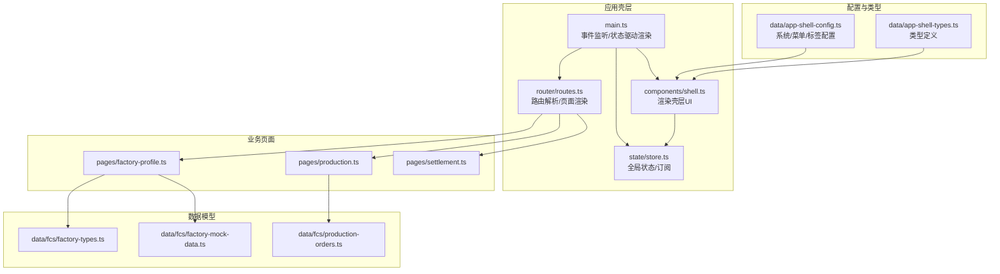

**图表来源**
- [src/main.ts:1-952](file://src/main.ts#L1-L952)
- [src/components/shell.ts:1-324](file://src/components/shell.ts#L1-L324)
- [src/state/store.ts:1-329](file://src/state/store.ts#L1-L329)
- [src/router/routes.ts:1-456](file://src/router/routes.ts#L1-L456)
- [src/data/app-shell-config.ts:1-355](file://src/data/app-shell-config.ts#L1-L355)
- [src/data/app-shell-types.ts:1-46](file://src/data/app-shell-types.ts#L1-L46)
- [src/pages/factory-profile.ts:1-200](file://src/pages/factory-profile.ts#L1-L200)
- [src/pages/production.ts:1-200](file://src/pages/production.ts#L1-L200)
- [src/pages/settlement.ts:1-200](file://src/pages/settlement.ts#L1-L200)
- [src/data/fcs/factory-types.ts:1-155](file://src/data/fcs/factory-types.ts#L1-L155)
- [src/data/fcs/factory-mock-data.ts:1-121](file://src/data/fcs/factory-mock-data.ts#L1-L121)
- [src/data/fcs/production-orders.ts:1-200](file://src/data/fcs/production-orders.ts#L1-L200)

**章节来源**
- [src/main.ts:1-952](file://src/main.ts#L1-L952)
- [src/state/store.ts:1-329](file://src/state/store.ts#L1-L329)
- [src/components/shell.ts:1-324](file://src/components/shell.ts#L1-L324)
- [src/router/routes.ts:1-456](file://src/router/routes.ts#L1-L456)
- [src/data/app-shell-config.ts:1-355](file://src/data/app-shell-config.ts#L1-L355)
- [src/data/app-shell-types.ts:1-46](file://src/data/app-shell-types.ts#L1-L46)

## 核心组件
- 应用壳层与事件总线
  - main.ts：集中注册点击、输入、变更、提交等事件监听器，按事件类型分发至对应页面处理器，并在必要时触发重新渲染
  - shell.ts：基于当前状态渲染顶部栏、系统切换、侧边菜单、标签页与主内容区
- 全局状态管理
  - store.ts：提供 AppState、订阅者集合、路径导航、标签页管理、侧边栏状态持久化等能力
- 路由与页面
  - routes.ts：精确路由与动态路由映射，解析 pathname 并返回对应页面渲染函数
- 配置与类型
  - app-shell-config.ts：系统列表、菜单树、默认页等配置
  - app-shell-types.ts：系统、菜单、标签页等类型定义

**章节来源**
- [src/main.ts:247-502](file://src/main.ts#L247-L502)
- [src/components/shell.ts:292-324](file://src/components/shell.ts#L292-L324)
- [src/state/store.ts:89-304](file://src/state/store.ts#L89-L304)
- [src/router/routes.ts:113-406](file://src/router/routes.ts#L113-L406)
- [src/data/app-shell-config.ts:8-18](file://src/data/app-shell-config.ts#L8-L18)
- [src/data/app-shell-types.ts:6-46](file://src/data/app-shell-types.ts#L6-L46)

## 架构总览
higoods 的系统集成遵循“配置驱动 + 事件驱动 + 单向数据流”：
- 配置驱动：通过 app-shell-config.ts 与 app-shell-types.ts 定义系统与菜单，shell.ts 依据当前系统与路径动态渲染 UI
- 事件驱动：main.ts 监听用户交互，调用页面处理器或 store 方法，随后触发渲染
- 单向数据流：store 作为唯一真相源，页面只读取状态并触发动作，动作最终通过 patch 更新状态并通知订阅者

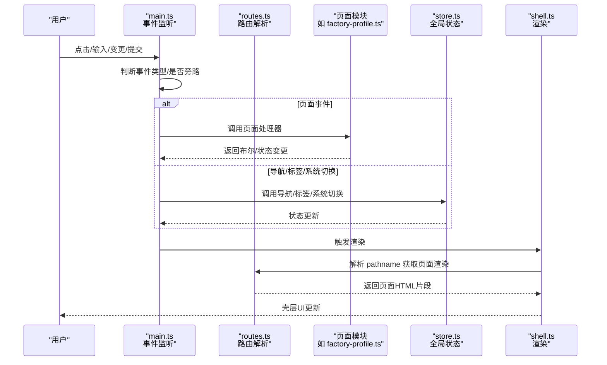

**图表来源**
- [src/main.ts:382-502](file://src/main.ts#L382-L502)
- [src/router/routes.ts:430-455](file://src/router/routes.ts#L430-L455)
- [src/components/shell.ts:292-311](file://src/components/shell.ts#L292-L311)
- [src/state/store.ts:172-209](file://src/state/store.ts#L172-L209)

## 详细组件分析

### 组件A：事件分发与页面渲染（main.ts）
- 事件旁路策略：对输入框、选择框、文本域等控件进行旁路判断，避免重复渲染与焦点丢失
- 事件分发：点击事件分发至各页面处理器；输入/变更事件用于同步字段；提交事件用于表单处理
- 渲染触发：每次事件处理后，根据需要调用渲染函数以刷新壳层 UI

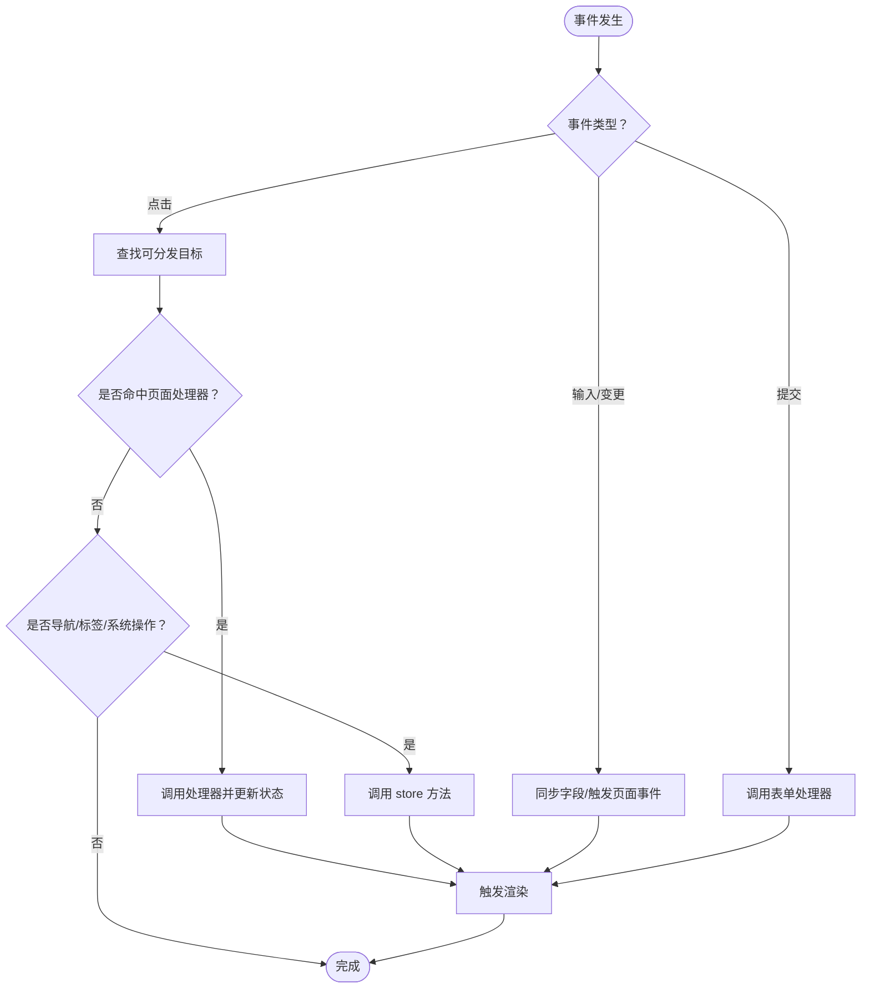

**图表来源**
- [src/main.ts:382-502](file://src/main.ts#L382-L502)
- [src/main.ts:347-380](file://src/main.ts#L347-L380)

**章节来源**
- [src/main.ts:347-502](file://src/main.ts#L347-L502)

### 组件B：全局状态管理（store.ts）
- 状态结构：包含 pathname、侧边栏状态、标签页集合、展开组与项等
- 订阅机制：subscribe 注册监听器，emit 通知所有监听者
- 路径同步：根据 pathname 自动同步标签页并持久化
- 标签页管理：打开、激活、关闭标签页，自动回退默认页
- 侧边栏折叠：本地存储持久化折叠状态

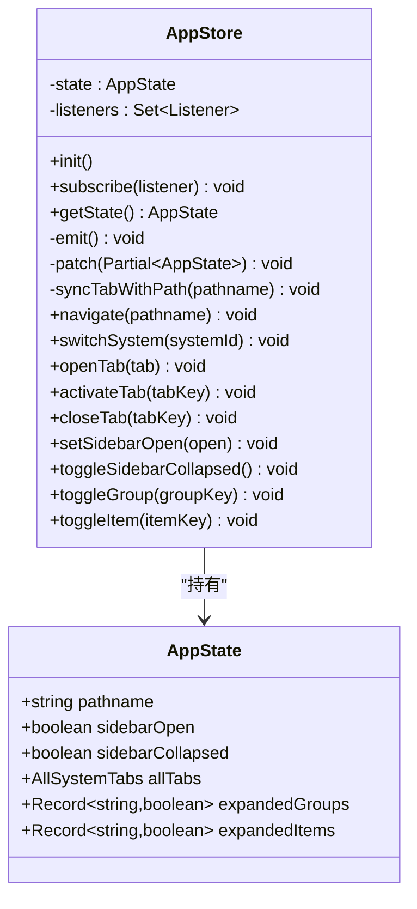

**图表来源**
- [src/state/store.ts:89-304](file://src/state/store.ts#L89-L304)

**章节来源**
- [src/state/store.ts:89-329](file://src/state/store.ts#L89-L329)

### 组件C：壳层渲染与系统切换（shell.ts）
- 顶部栏：系统切换按钮、通知、用户信息
- 侧边菜单：按系统展开/折叠，支持子菜单与高亮
- 标签页：多页签展示与关闭
- 主内容区：根据 pathname 解析页面渲染

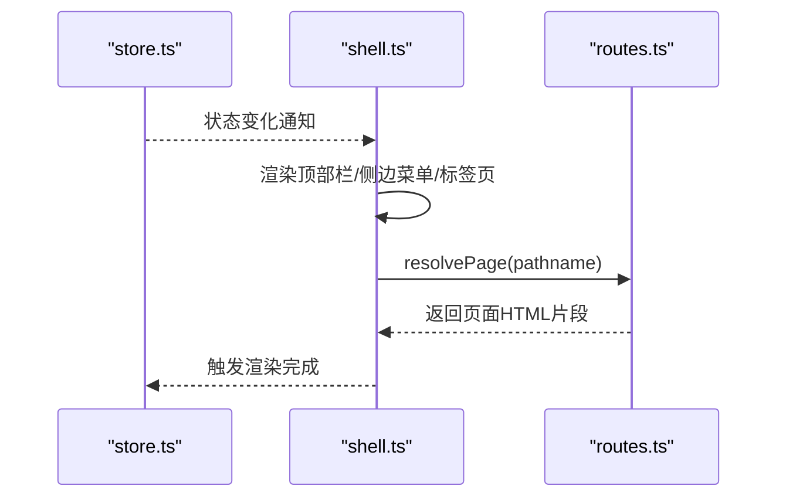

**图表来源**
- [src/components/shell.ts:292-311](file://src/components/shell.ts#L292-L311)
- [src/router/routes.ts:430-455](file://src/router/routes.ts#L430-L455)

**章节来源**
- [src/components/shell.ts:25-324](file://src/components/shell.ts#L25-L324)
- [src/router/routes.ts:430-455](file://src/router/routes.ts#L430-L455)

### 组件D：路由解析与页面渲染（routes.ts）
- 精确路由：固定路径直接映射到页面渲染函数
- 动态路由：正则匹配参数，传递给页面渲染函数
- 回退策略：找不到菜单项时返回占位页，否则返回 404

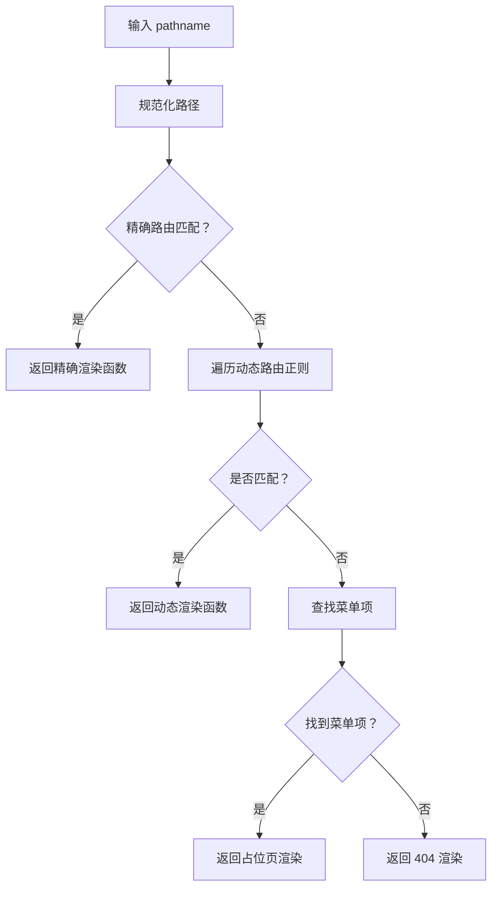

**图表来源**
- [src/router/routes.ts:109-455](file://src/router/routes.ts#L109-L455)

**章节来源**
- [src/router/routes.ts:113-406](file://src/router/routes.ts#L113-L406)

### 组件E：工厂档案页面（factory-profile.ts）
- 状态管理：包含工厂列表、筛选条件、排序、分页、对话框状态、表单草稿与错误信息
- 表单处理：创建/编辑/删除工厂，表单校验与错误提示
- PDA 配置：用户、角色、权限的初始化与分组

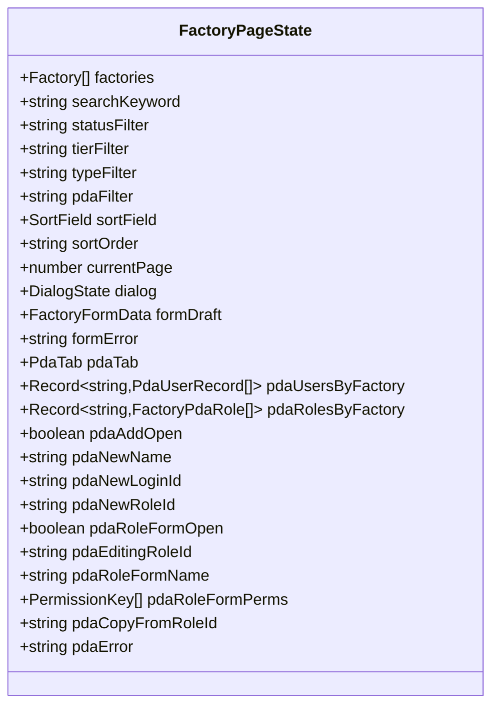

**图表来源**
- [src/pages/factory-profile.ts:50-175](file://src/pages/factory-profile.ts#L50-L175)

**章节来源**
- [src/pages/factory-profile.ts:1-200](file://src/pages/factory-profile.ts#L1-L200)

### 组件F：生产单页面（production.ts）
- 状态管理：需求、订单、变更、计划、交付、变更审批、状态更新、详情页标签等
- 业务流程：需求接收、订单生成、计划管理、交付配置、变更管理、状态推进
- 集成点：依赖 tech-pack、工厂快照、质量种子、进度异常、结算草稿等数据种子

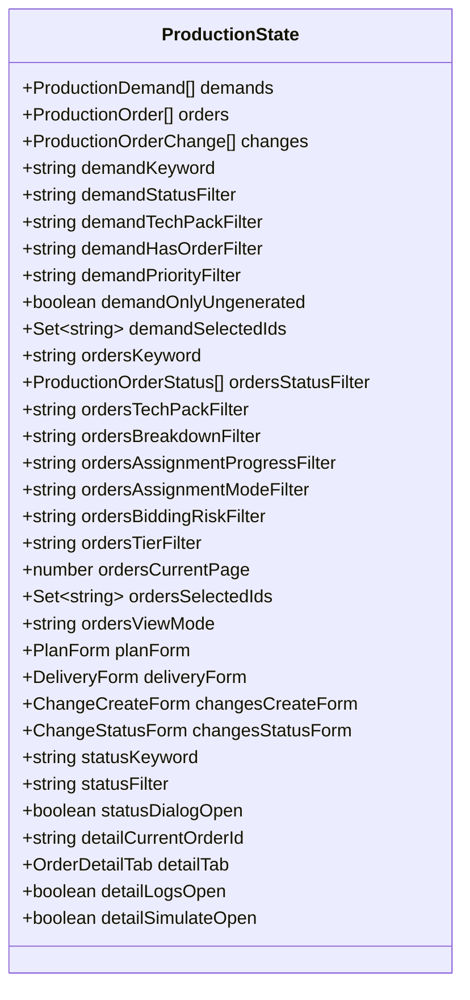

**图表来源**
- [src/pages/production.ts:98-175](file://src/pages/production.ts#L98-L175)

**章节来源**
- [src/pages/production.ts:1-200](file://src/pages/production.ts#L1-L200)

### 组件G：结算页面（settlement.ts）
- 状态管理：汇总、档案、账户、规则、详情页标签、对话框状态、表单与校验
- 业务流程：周期类型、定价模式、币种、生效日期、账户默认化、规则启用/禁用、历史查看

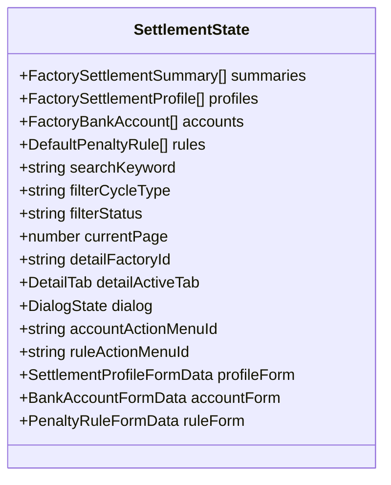

**图表来源**
- [src/pages/settlement.ts:41-120](file://src/pages/settlement.ts#L41-L120)

**章节来源**
- [src/pages/settlement.ts:1-200](file://src/pages/settlement.ts#L1-L200)

### 组件H：数据模型与类型（factory-types.ts、factory-mock-data.ts、production-orders.ts）
- 工厂类型：状态、合作模式、层级、类型、能力标签、PDA 配置、流程准入
- 工厂模拟数据：从印尼工厂数据映射为工厂实体，生成工厂编号，注入 PDA 与准入条件
- 生产单模型：状态机、技术档快照、需求快照、分配摘要/进度、风险标签、审计日志、生命周期状态

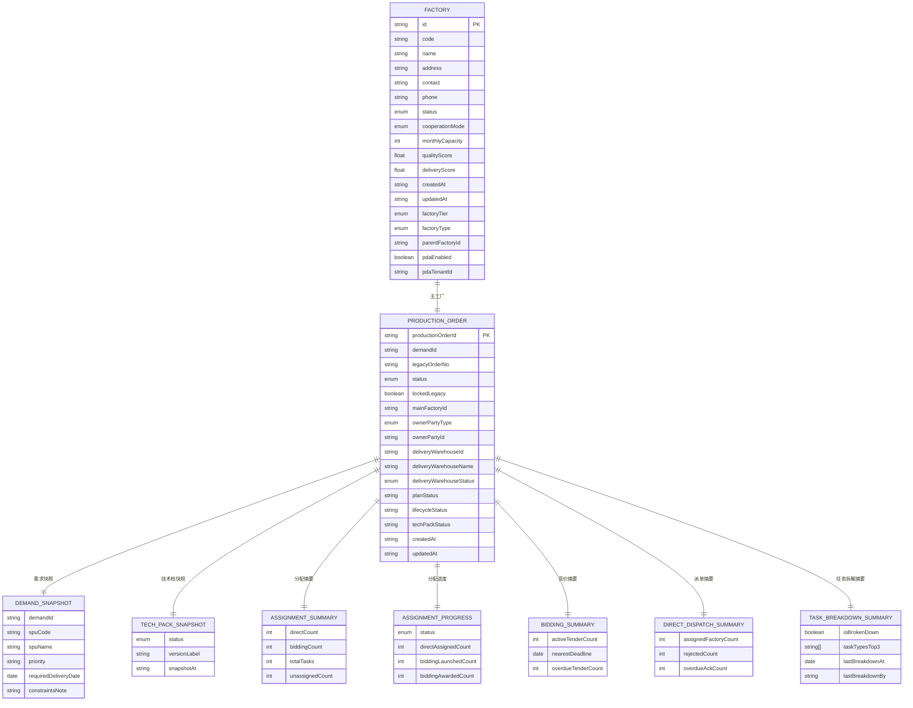

**图表来源**
- [src/data/fcs/factory-types.ts:48-92](file://src/data/fcs/factory-types.ts#L48-L92)
- [src/data/fcs/factory-mock-data.ts:90-117](file://src/data/fcs/factory-mock-data.ts#L90-L117)
- [src/data/fcs/production-orders.ts:115-161](file://src/data/fcs/production-orders.ts#L115-L161)

**章节来源**
- [src/data/fcs/factory-types.ts:1-155](file://src/data/fcs/factory-types.ts#L1-L155)
- [src/data/fcs/factory-mock-data.ts:1-121](file://src/data/fcs/factory-mock-data.ts#L1-L121)
- [src/data/fcs/production-orders.ts:1-200](file://src/data/fcs/production-orders.ts#L1-L200)

## 依赖关系分析
- main.ts 依赖 store.ts 与 shell.ts，同时按需导入各页面模块以进行事件分发
- shell.ts 依赖 store.ts 与 app-shell-config.ts/app-shell-types.ts，用于渲染系统、菜单与标签页
- routes.ts 依赖 app-shell-config.ts 与各页面模块，实现页面渲染
- 页面模块依赖 data/fcs 类型与模拟数据，形成“类型 + 配置 + 模拟数据”的集成基座

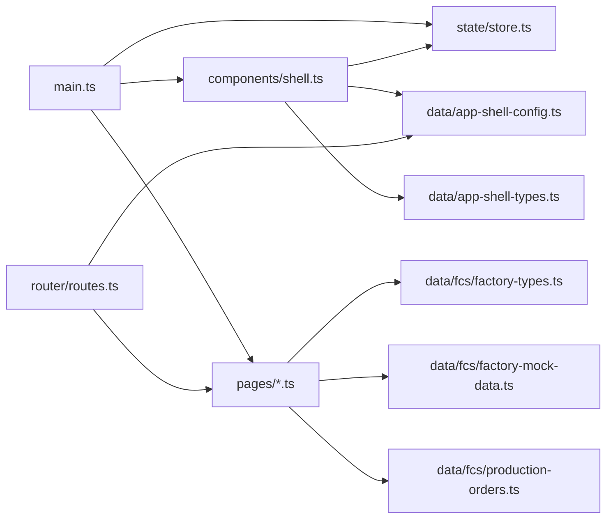

**图表来源**
- [src/main.ts:1-113](file://src/main.ts#L1-L113)
- [src/components/shell.ts:1-12](file://src/components/shell.ts#L1-L12)
- [src/router/routes.ts:1-105](file://src/router/routes.ts#L1-L105)
- [src/data/app-shell-config.ts:1-18](file://src/data/app-shell-config.ts#L1-L18)
- [src/data/app-shell-types.ts:1-46](file://src/data/app-shell-types.ts#L1-L46)
- [src/pages/factory-profile.ts:1-25](file://src/pages/factory-profile.ts#L1-L25)
- [src/pages/production.ts:1-26](file://src/pages/production.ts#L1-L26)
- [src/pages/settlement.ts:1-26](file://src/pages/settlement.ts#L1-L26)
- [src/data/fcs/factory-types.ts:1-155](file://src/data/fcs/factory-types.ts#L1-L155)
- [src/data/fcs/factory-mock-data.ts:1-121](file://src/data/fcs/factory-mock-data.ts#L1-L121)
- [src/data/fcs/production-orders.ts:1-200](file://src/data/fcs/production-orders.ts#L1-L200)

**章节来源**
- [src/main.ts:1-113](file://src/main.ts#L1-L113)
- [src/components/shell.ts:1-12](file://src/components/shell.ts#L1-L12)
- [src/router/routes.ts:1-105](file://src/router/routes.ts#L1-L105)

## 性能考量
- 单向数据流与事件旁路
  - 通过 shouldBypassClickDispatch 避免对输入类控件的重复渲染，减少闪烁与焦点丢失
- 状态持久化
  - store.ts 使用 localStorage 存储标签页与侧边栏折叠状态，降低页面刷新后的状态重建成本
- 路由与渲染
  - routes.ts 的精确路由与动态路由分离，减少不必要的解析开销
- 批量与分页
  - 页面状态中普遍采用分页常量（如 PAGE_SIZE），便于控制一次性渲染的数据规模
- 资源优化
  - package.json 依赖 lucide 图标库，建议在构建阶段进行 Tree Shaking 与按需加载

**章节来源**
- [src/main.ts:347-380](file://src/main.ts#L347-L380)
- [src/state/store.ts:15-56](file://src/state/store.ts#L15-L56)
- [src/router/routes.ts:113-406](file://src/router/routes.ts#L113-L406)
- [src/pages/production.ts:50](file://src/pages/production.ts#L50)
- [package.json:11-22](file://package.json#L11-L22)

## 故障排查指南
- 事件未触发或渲染异常
  - 检查 main.ts 中事件旁路逻辑与分发分支，确认目标元素是否命中页面处理器
  - 确认 store.subscribe 是否正确注册监听器，emit 是否被调用
- 路由不生效或页面空白
  - 检查 routes.ts 的精确/动态路由匹配，确认 pathname 规范化与菜单项存在性
- 标签页与侧边栏状态异常
  - 检查 localStorage 写入/读取逻辑，确认键名与序列化格式
- 页面数据不一致
  - 核查页面状态初始化与表单草稿克隆逻辑，避免浅拷贝导致的状态污染

**章节来源**
- [src/main.ts:382-502](file://src/main.ts#L382-L502)
- [src/state/store.ts:101-117](file://src/state/store.ts#L101-L117)
- [src/router/routes.ts:430-455](file://src/router/routes.ts#L430-L455)

## 结论
higoods 的系统集成以“配置驱动 + 事件驱动 + 单向数据流”为核心，结合 store.ts 的状态持久化与 shell.ts 的统一渲染，形成了清晰、可扩展的集成架构。通过页面模块化的数据模型与模拟数据，系统具备良好的可测试性与可演进性。建议在实际对接真实 API 时，延续现有模式：以 store 为单一真相源，页面只读取状态并触发动作，动作通过异步处理与错误处理完善后回写状态，从而保持界面与数据的同步。

## 附录
- 常见集成场景与最佳实践
  - 外部数据拉取：在页面处理器中发起异步请求，成功后更新页面状态，失败时记录错误并提示
  - 状态回滚：对表单草稿进行深拷贝，失败时恢复草稿，避免污染全局状态
  - 重试机制：对外部接口调用增加指数退避与最大重试次数，避免雪崩效应
  - 监控与调试：在 store.subscribe 中输出状态变化日志，或在页面处理器中记录关键事件与耗时
  - 性能优化：对高频渲染区域进行节流/防抖，对大数据集采用虚拟滚动与分页加载