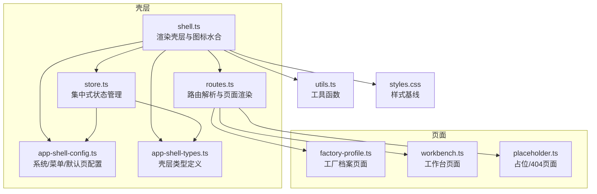
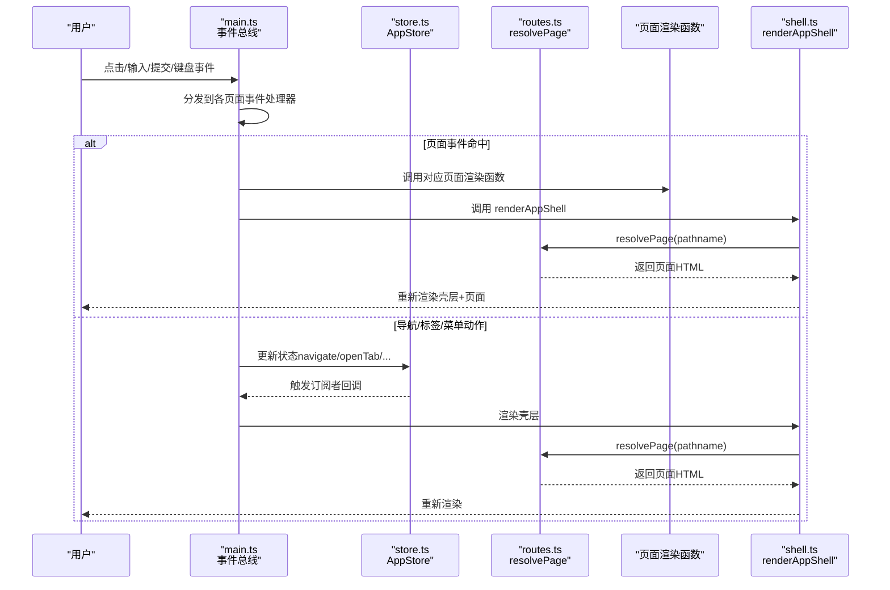
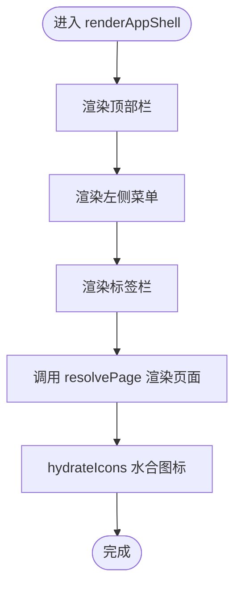
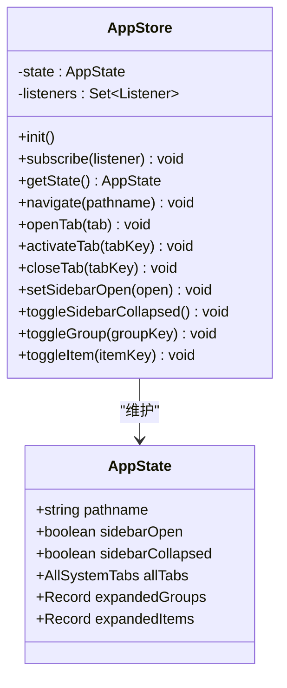
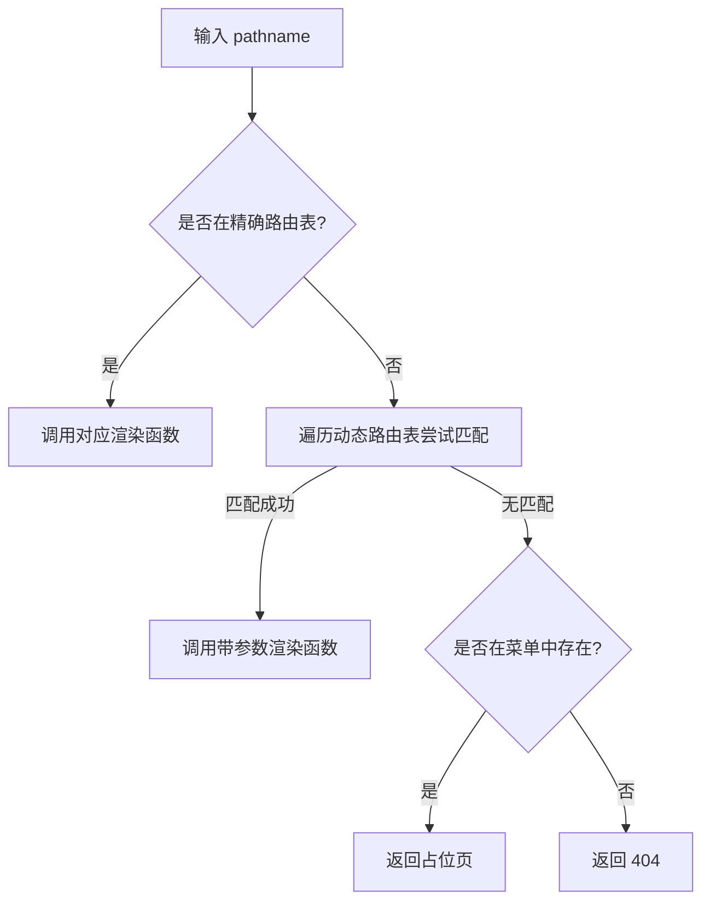
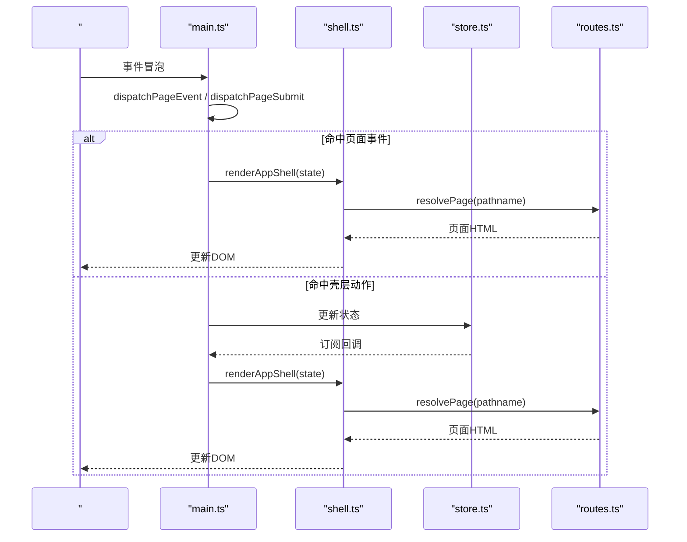
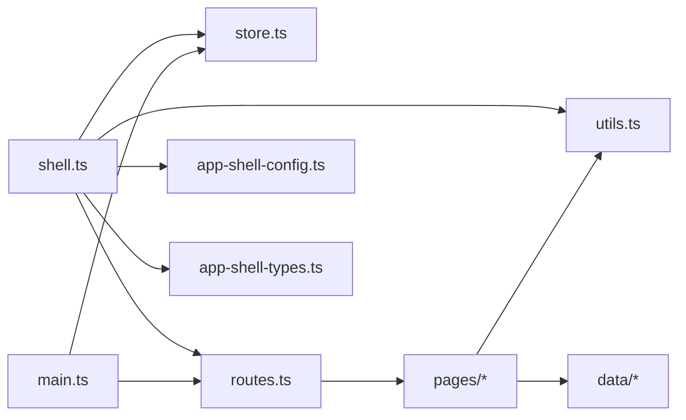

# 自定义组件开发

<cite>
**本文引用的文件**   
- [src/components/shell.ts](file://src/components/shell.ts)
- [src/main.ts](file://src/main.ts)
- [src/state/store.ts](file://src/state/store.ts)
- [src/router/routes.ts](file://src/router/routes.ts)
- [src/data/app-shell-config.ts](file://src/data/app-shell-config.ts)
- [src/data/app-shell-types.ts](file://src/data/app-shell-types.ts)
- [src/pages/placeholder.ts](file://src/pages/placeholder.ts)
- [src/pages/workbench.ts](file://src/pages/workbench.ts)
- [src/pages/factory-profile.ts](file://src/pages/factory-profile.ts)
- [src/utils.ts](file://src/utils.ts)
- [src/styles.css](file://src/styles.css)
- [package.json](file://package.json)
- [vite.config.ts](file://vite.config.ts)
</cite>

## 目录
1. [简介](#简介)
2. [项目结构](#项目结构)
3. [核心组件](#核心组件)
4. [架构总览](#架构总览)
5. [详细组件分析](#详细组件分析)
6. [依赖分析](#依赖分析)
7. [性能考虑](#性能考虑)
8. [故障排查指南](#故障排查指南)
9. [结论](#结论)
10. [附录](#附录)

## 简介
本指南面向在 higoods 项目中开发“自定义页面组件”的工程师，目标是帮助你以符合项目架构的方式创建新页面组件，涵盖组件结构设计、事件处理机制、状态管理方法、最佳实践（代码组织、样式规范、可复用性）、与壳层系统（shell.ts）的集成方式、常见问题与解决方案（性能、内存、错误处理）、测试与调试流程。文档中的所有实现细节均基于仓库现有源码进行归纳总结。

## 项目结构
higoods 采用“壳层 + 页面 + 数据/类型 + 状态/路由”的分层组织方式：
- 壳层组件：负责系统导航、菜单、标签页、主内容区渲染与图标水合
- 页面组件：按功能域划分（如 FCS、PCS），每个页面导出渲染函数
- 状态与路由：集中式状态管理与路由解析，驱动壳层与页面切换
- 数据与类型：壳层配置与类型定义，页面数据种子与业务类型
- 工具与样式：通用工具函数与 Tailwind 样式基线

图表来源
- [src/components/shell.ts:292-324](file://src/components/shell.ts#L292-L324)
- [src/state/store.ts:89-304](file://src/state/store.ts#L89-L304)
- [src/router/routes.ts:430-456](file://src/router/routes.ts#L430-L456)
- [src/data/app-shell-config.ts:1-355](file://src/data/app-shell-config.ts#L1-L355)
- [src/data/app-shell-types.ts:1-46](file://src/data/app-shell-types.ts#L1-L46)
- [src/pages/factory-profile.ts:1-200](file://src/pages/factory-profile.ts#L1-L200)
- [src/pages/workbench.ts:1-200](file://src/pages/workbench.ts#L1-L200)
- [src/pages/placeholder.ts:1-33](file://src/pages/placeholder.ts#L1-L33)
- [src/utils.ts:1-18](file://src/utils.ts#L1-L18)
- [src/styles.css:1-103](file://src/styles.css#L1-L103)

章节来源
- [src/components/shell.ts:1-324](file://src/components/shell.ts#L1-L324)
- [src/state/store.ts:1-329](file://src/state/store.ts#L1-L329)
- [src/router/routes.ts:1-456](file://src/router/routes.ts#L1-L456)
- [src/data/app-shell-config.ts:1-355](file://src/data/app-shell-config.ts#L1-L355)
- [src/data/app-shell-types.ts:1-46](file://src/data/app-shell-types.ts#L1-L46)
- [src/pages/placeholder.ts:1-33](file://src/pages/placeholder.ts#L1-L33)
- [src/utils.ts:1-18](file://src/utils.ts#L1-L18)
- [src/styles.css:1-103](file://src/styles.css#L1-L103)

## 核心组件
- 壳层渲染器（shell.ts）
  - 渲染顶部栏、左侧菜单、标签栏与主内容区
  - 使用 lucide 图标库进行图标水合
  - 通过 resolvePage 将当前路径渲染为具体页面
- 集中式状态（store.ts）
  - 维护 pathname、侧边栏状态、标签页集合、展开状态等
  - 提供 navigate/openTab/activateTab/closeTab 等动作
- 路由解析（routes.ts）
  - 定义精确路由与动态路由，解析当前页面并返回渲染结果
  - 未匹配时返回占位或 404
- 壳层配置与类型（app-shell-config.ts、app-shell-types.ts）
  - 系统列表、菜单树、默认页
  - 壳层类型定义（System、MenuItem、MenuGroup、Tab、AllSystemTabs）

章节来源
- [src/components/shell.ts:25-324](file://src/components/shell.ts#L25-L324)
- [src/state/store.ts:4-329](file://src/state/store.ts#L4-L329)
- [src/router/routes.ts:107-456](file://src/router/routes.ts#L107-L456)
- [src/data/app-shell-config.ts:1-355](file://src/data/app-shell-config.ts#L1-L355)
- [src/data/app-shell-types.ts:1-46](file://src/data/app-shell-types.ts#L1-L46)

## 架构总览
下图展示了从用户交互到页面渲染的端到端流程，以及与壳层系统的协作关系。

图表来源
- [src/main.ts:247-502](file://src/main.ts#L247-L502)
- [src/state/store.ts:119-304](file://src/state/store.ts#L119-L304)
- [src/router/routes.ts:430-456](file://src/router/routes.ts#L430-L456)
- [src/components/shell.ts:292-324](file://src/components/shell.ts#L292-L324)

## 详细组件分析

### 壳层组件（shell.ts）设计要点
- 结构化渲染
  - 顶部栏：系统切换、通知、用户信息
  - 左侧菜单：支持折叠、分组展开、子菜单
  - 标签栏：多页签管理，支持激活与关闭
  - 主内容区：调用 resolvePage 渲染当前页面
- 事件绑定约定
  - 通过 data-action、data-nav、data-field、data-filter 等 dataset 传递行为
  - 通过全局 click/input/change/submit/keydown 事件总线分发
- 图标水合
  - 使用 lucide.createIcons 按需水合，提升首屏性能

图表来源
- [src/components/shell.ts:292-324](file://src/components/shell.ts#L292-L324)
- [src/router/routes.ts:430-456](file://src/router/routes.ts#L430-L456)

章节来源
- [src/components/shell.ts:25-324](file://src/components/shell.ts#L25-L324)

### 集中式状态（store.ts）设计要点
- 状态模型
  - pathname：当前路径
  - sidebarOpen/sidebarCollapsed：侧边栏显示/折叠
  - allTabs：按系统分组的标签页集合，含 activeKey
  - expandedGroups/expandedItems：菜单分组与条目的展开状态
- 动作与副作用
  - navigate：更新路径并同步标签页
  - openTab/activateTab/closeTab：标签页增删改查
  - toggleGroup/toggleItem：菜单展开状态切换
  - 订阅机制：通过 subscribe 注册监听器，触发 re-render
- 本地存储
  - 标签页与侧边栏折叠状态持久化

图表来源
- [src/state/store.ts:89-304](file://src/state/store.ts#L89-L304)

章节来源
- [src/state/store.ts:1-329](file://src/state/store.ts#L1-L329)

### 路由解析（routes.ts）设计要点
- 精确路由表：直接映射到页面渲染函数
- 动态路由表：正则匹配参数并传入渲染函数
- 回退策略：未匹配菜单项返回占位页；未匹配路径返回 404
- 菜单联动：根据 pathname 查找菜单项，用于标签页同步

图表来源
- [src/router/routes.ts:430-456](file://src/router/routes.ts#L430-L456)

章节来源
- [src/router/routes.ts:1-456](file://src/router/routes.ts#L1-L456)

### 页面组件开发范式
- 页面职责
  - 仅负责自身页面的渲染逻辑与局部状态
  - 不直接操作壳层状态，通过事件分发与 store 协同
- 典型页面结构
  - 导出 renderXxxPage 函数，返回字符串 HTML
  - 使用 utils.escapeHtml、toClassName 等工具函数
  - 可引入数据种子（mock）进行演示
- 示例参考
  - 工作台页面：构建统计卡片、表格、待办/风险列表
  - 工厂档案页面：复杂表单、对话框、PDA 用户/角色管理

章节来源
- [src/pages/workbench.ts:92-123](file://src/pages/workbench.ts#L92-L123)
- [src/pages/factory-profile.ts:137-163](file://src/pages/factory-profile.ts#L137-L163)
- [src/pages/placeholder.ts:1-33](file://src/pages/placeholder.ts#L1-L33)
- [src/utils.ts:1-18](file://src/utils.ts#L1-L18)

### 与壳层系统集成（shell.ts 与 main.ts）
- 事件总线
  - main.ts 统一监听 click/input/change/submit/keydown
  - 优先分发给页面事件处理器；若命中壳层动作（data-action），则更新 store 并 re-render
- 导航与标签
  - 通过 data-nav 进行 SPA 导航，自动同步标签页
  - 通过 data-action=open-tab 打开新标签
- 图标与样式
  - shell.ts 调用 hydrateIcons 水合图标
  - styles.css 提供基础样式与动画

图表来源
- [src/main.ts:247-502](file://src/main.ts#L247-L502)
- [src/components/shell.ts:292-324](file://src/components/shell.ts#L292-L324)
- [src/state/store.ts:119-304](file://src/state/store.ts#L119-L304)
- [src/router/routes.ts:430-456](file://src/router/routes.ts#L430-L456)

章节来源
- [src/main.ts:247-502](file://src/main.ts#L247-L502)
- [src/components/shell.ts:292-324](file://src/components/shell.ts#L292-L324)

## 依赖分析
- 外部依赖
  - lucide：图标库
  - tailwindcss：原子化样式框架
- 内部依赖
  - shell.ts 依赖 store、routes、utils、app-shell-config、app-shell-types
  - main.ts 依赖 store、routes、各页面渲染函数
  - routes.ts 依赖 app-shell-config、各页面渲染函数
  - pages/* 依赖 utils、data/* 种子数据

图表来源
- [src/components/shell.ts:1-12](file://src/components/shell.ts#L1-L12)
- [src/main.ts:1-27](file://src/main.ts#L1-L27)
- [src/router/routes.ts:1-105](file://src/router/routes.ts#L1-L105)

章节来源
- [src/components/shell.ts:1-12](file://src/components/shell.ts#L1-L12)
- [src/main.ts:1-27](file://src/main.ts#L1-L27)
- [src/router/routes.ts:1-105](file://src/router/routes.ts#L1-L105)
- [package.json:11-21](file://package.json#L11-L21)

## 性能考虑
- 图标水合
  - 使用 createIcons 按需水合，避免全量引入导致体积膨胀
- DOM 更新策略
  - 通过集中式状态与最小化 re-render，减少不必要的重绘
  - 对于高频输入/选择控件，避免触发整页重渲染（已在 main.ts 中规避）
- 路由与页面
  - 精确路由命中时直接返回页面 HTML，减少分支判断
  - 占位页与 404 作为兜底，避免空渲染
- 样式
  - Tailwind 原子类减少样式体积，配合动画片段降低运行时开销

章节来源
- [src/components/shell.ts:313-324](file://src/components/shell.ts#L313-L324)
- [src/main.ts:371-380](file://src/main.ts#L371-L380)
- [src/router/routes.ts:430-456](file://src/router/routes.ts#L430-L456)
- [src/styles.css:84-102](file://src/styles.css#L84-L102)

## 故障排查指南
- 页面不更新或点击无效
  - 检查事件是否被 main.ts 的 shouldBypassClickDispatch 拦截
  - 确认 data-action/data-nav/data-field/data-filter 是否正确
- 标签页不出现或无法切换
  - 确认 pathname 是否在菜单中存在，否则不会自动创建标签
  - 检查 open-tab/activate-tab/close-tab 的 key 是否一致
- 图标不显示
  - 确保 hydrateIcons 在 renderAppShell 后调用
  - 检查 lucide 版本与 createIcons 参数
- 404 或占位页
  - 检查 routes.ts 中是否注册了该路径
  - 确认 app-shell-config.ts 中该路径是否配置在菜单中
- 样式异常
  - 检查 styles.css 中的动画与可见性控制
  - 确认 Tailwind 配置与构建脚本正常

章节来源
- [src/main.ts:371-380](file://src/main.ts#L371-L380)
- [src/state/store.ts:186-269](file://src/state/store.ts#L186-L269)
- [src/components/shell.ts:313-324](file://src/components/shell.ts#L313-L324)
- [src/router/routes.ts:430-456](file://src/router/routes.ts#L430-L456)
- [src/styles.css:67-74](file://src/styles.css#L67-L74)

## 结论
higoods 的自定义组件开发遵循“壳层 + 页面 + 状态 + 路由”的清晰分层。开发者应：
- 将页面渲染逻辑集中在 renderXxxPage 函数中，避免直接操作壳层状态
- 通过 dataset 约定与 main.ts 事件总线协作，保证交互一致性
- 利用 store 的标签页与菜单联动，提升用户体验
- 遵循样式与工具函数规范，确保可维护性与可复用性

## 附录

### 最佳实践清单
- 代码组织
  - 页面组件独立存放，按功能域命名
  - 事件处理函数与渲染函数分离
- 样式规范
  - 优先使用 Tailwind 原子类
  - 控制可见性与动画使用，避免过度动画
- 可复用性设计
  - 抽象通用渲染片段（如表格、卡片）
  - 使用工具函数（escapeHtml、toClassName）统一处理
- 与壳层集成
  - 通过 data-action/data-nav/data-field/data-filter 与壳层解耦
  - 保持 pathname 与菜单一致，确保标签页联动

章节来源
- [src/pages/workbench.ts:92-123](file://src/pages/workbench.ts#L92-L123)
- [src/utils.ts:1-18](file://src/utils.ts#L1-L18)
- [src/styles.css:67-74](file://src/styles.css#L67-L74)

### 开发与测试流程建议
- 开发流程
  - 新建页面：在 pages 下新增文件，导出 renderXxxPage
  - 注册路由：在 routes.ts 的精确/动态路由表中添加映射
  - 配置菜单：在 app-shell-config.ts 的 menusBySystem 中添加菜单项
  - 事件处理：在 main.ts 中注册对应的事件分发逻辑
- 测试建议
  - 单元测试：针对页面渲染函数与工具函数编写断言
  - 集成测试：模拟事件总线，验证从点击到 re-render 的完整链路
  - 端到端测试：在浏览器中验证图标水合、标签页切换、导航跳转
- 调试技巧
  - 使用浏览器开发者工具检查 dataset 与事件冒泡
  - 在 main.ts 中打印 pathname 与 state，确认状态流转
  - 逐步注释 shell.ts 的 hydrateIcons，定位图标问题

章节来源
- [src/router/routes.ts:113-406](file://src/router/routes.ts#L113-L406)
- [src/data/app-shell-config.ts:21-355](file://src/data/app-shell-config.ts#L21-L355)
- [src/main.ts:247-502](file://src/main.ts#L247-L502)
- [src/components/shell.ts:313-324](file://src/components/shell.ts#L313-L324)