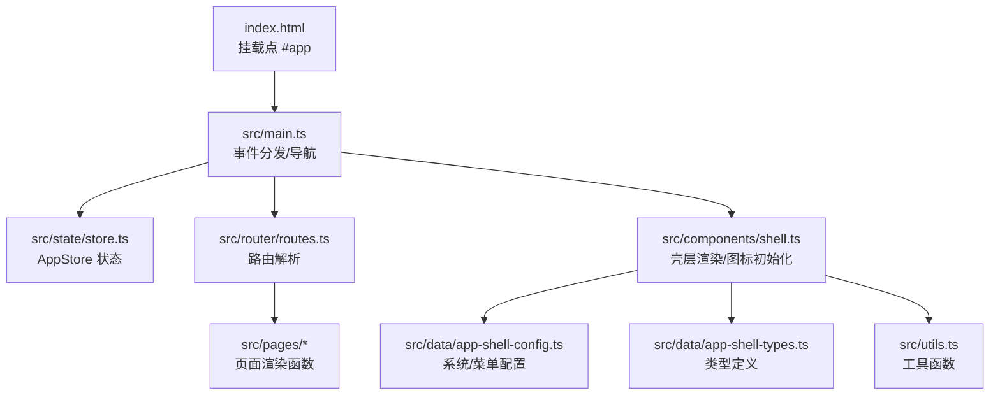
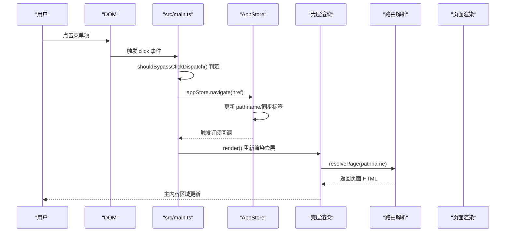
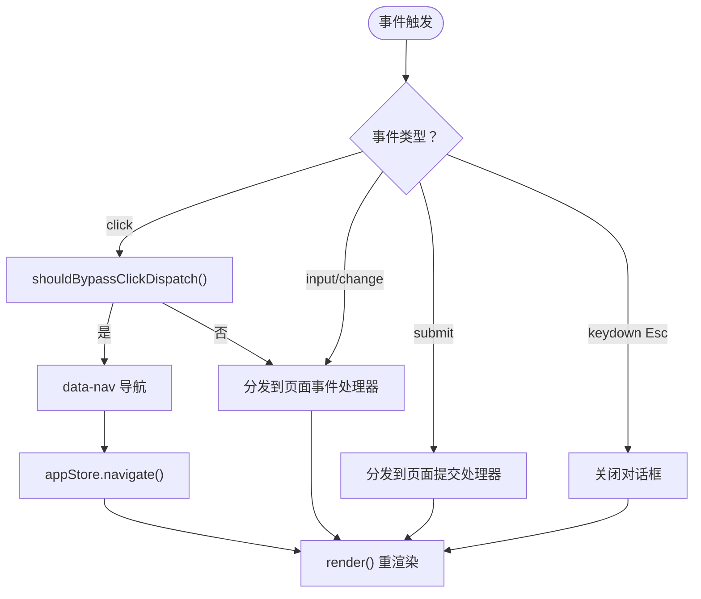
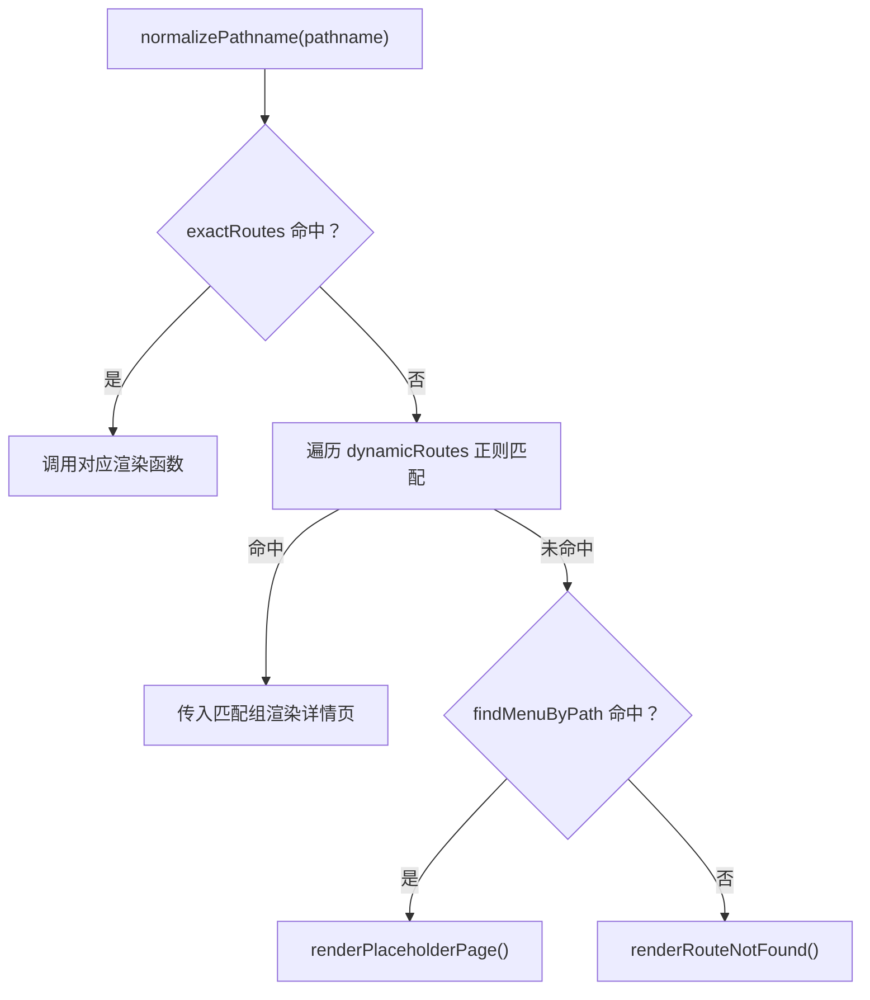
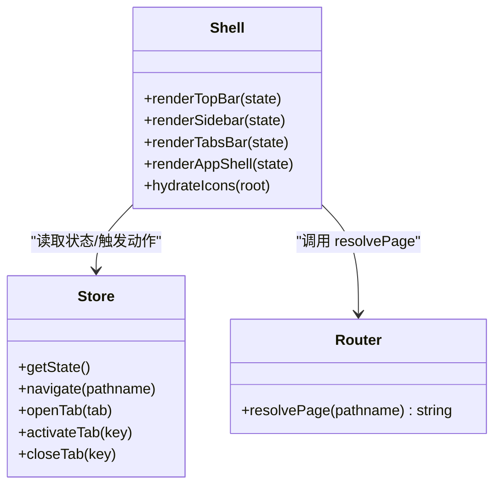
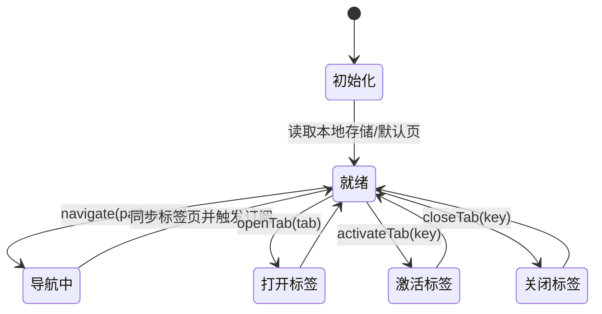
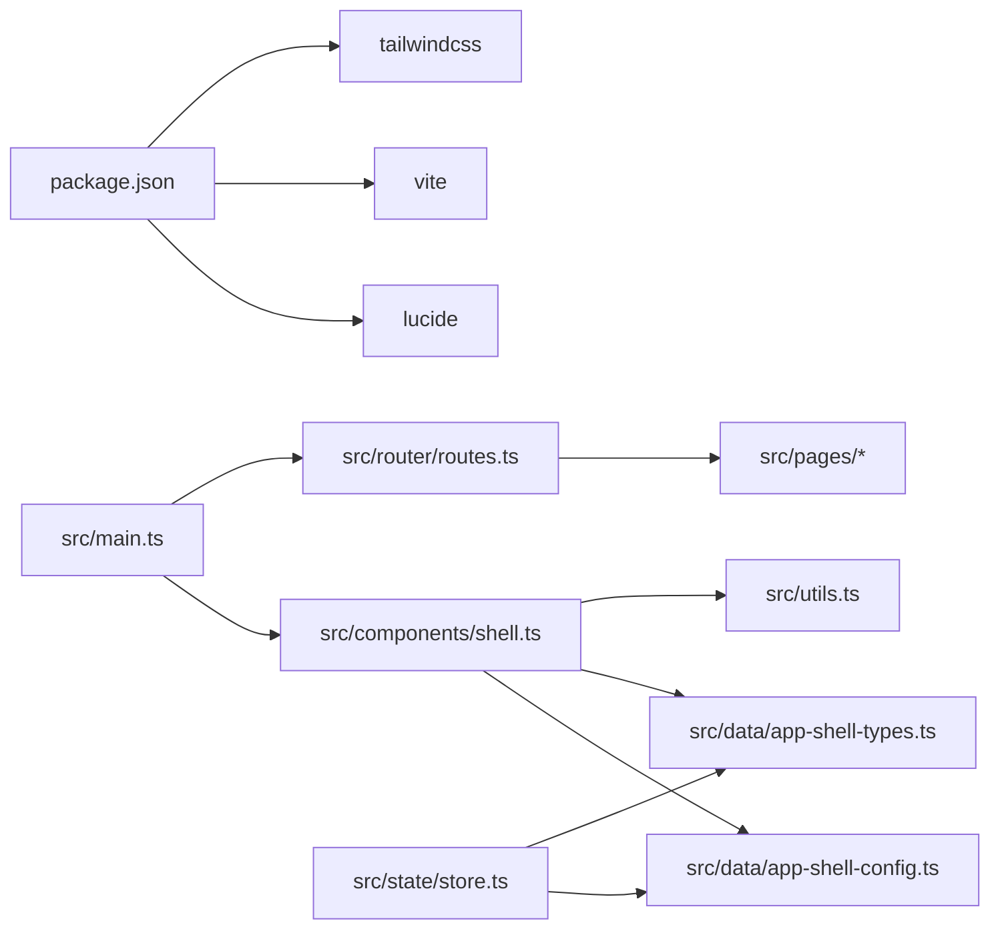

# 故障排除

<cite>
**本文引用的文件**   
- [src/main.ts](file://src/main.ts)
- [src/router/routes.ts](file://src/router/routes.ts)
- [src/state/store.ts](file://src/state/store.ts)
- [src/components/shell.ts](file://src/components/shell.ts)
- [src/data/app-shell-config.ts](file://src/data/app-shell-config.ts)
- [src/data/app-shell-types.ts](file://src/data/app-shell-types.ts)
- [src/pages/placeholder.ts](file://src/pages/placeholder.ts)
- [src/utils.ts](file://src/utils.ts)
- [index.html](file://index.html)
- [package.json](file://package.json)
</cite>

## 目录
1. [简介](#简介)
2. [项目结构](#项目结构)
3. [核心组件](#核心组件)
4. [架构总览](#架构总览)
5. [详细组件分析](#详细组件分析)
6. [依赖关系分析](#依赖关系分析)
7. [性能考量](#性能考量)
8. [故障排除指南](#故障排除指南)
9. [结论](#结论)
10. [附录](#附录)

## 简介
本指南面向 higoods 的前端运行时与 SPA 导航体系，提供系统化的故障排除方法，覆盖以下主题：
- 页面无法加载、空白页、白屏
- 事件不响应（点击、输入、表单提交）
- 路由不生效、页面跳转异常、面包屑/菜单高亮不同步
- 状态不同步（标签页、侧边栏、系统切换）
- 性能问题（加载慢、卡顿、内存增长）
- 错误日志分析与调试技巧
- 预防性维护与最佳实践

## 项目结构
该应用采用“壳层 + 路由 + 页面渲染”的轻量 SPA 架构：
- 入口与事件分发：在入口脚本中注册根节点、初始化状态、绑定全局事件监听器，并通过统一的事件分发函数将 DOM 事件路由到各页面处理器。
- 路由解析：根据 pathname 匹配精确路由或动态路由，返回对应页面 HTML 片段。
- 壳层渲染：壳层组件负责顶部栏、侧边栏、标签页与主内容区域的拼装与图标初始化。
- 状态管理：集中式 AppStore 提供导航、标签页、侧边栏折叠等状态的读写与订阅。

图表来源
- [index.html](file://index.html)
- [src/main.ts](file://src/main.ts)
- [src/state/store.ts](file://src/state/store.ts)
- [src/router/routes.ts](file://src/router/routes.ts)
- [src/components/shell.ts](file://src/components/shell.ts)
- [src/data/app-shell-config.ts](file://src/data/app-shell-config.ts)
- [src/data/app-shell-types.ts](file://src/data/app-shell-types.ts)
- [src/utils.ts](file://src/utils.ts)

章节来源
- [index.html](file://index.html)
- [src/main.ts](file://src/main.ts)
- [src/state/store.ts](file://src/state/store.ts)
- [src/router/routes.ts](file://src/router/routes.ts)
- [src/components/shell.ts](file://src/components/shell.ts)
- [src/data/app-shell-config.ts](file://src/data/app-shell-config.ts)
- [src/data/app-shell-types.ts](file://src/data/app-shell-types.ts)
- [src/utils.ts](file://src/utils.ts)

## 核心组件
- 入口与事件分发：负责挂载根节点、初始化状态、绑定 click/input/change/submit/keydown 等事件，按优先级分发到页面处理器或 AppStore 动作。
- 路由解析：将 pathname 归一化后，先匹配精确路由，再遍历动态路由，最后回退到菜单占位页或“未找到”页。
- 壳层渲染：根据当前系统与菜单配置渲染顶部栏、侧边栏、标签页与主内容；调用图标初始化。
- 状态管理：AppStore 维护 pathname、侧边栏、标签页、展开组/项等状态，支持订阅与持久化（localStorage）。

章节来源
- [src/main.ts](file://src/main.ts)
- [src/router/routes.ts](file://src/router/routes.ts)
- [src/state/store.ts](file://src/state/store.ts)
- [src/components/shell.ts](file://src/components/shell.ts)

## 架构总览
下面以序列图展示一次典型用户交互的端到端流程：点击菜单项 → 触发事件 → 分发到 AppStore 导航 → 触发状态变更 → 重新渲染壳层与页面。

图表来源
- [src/main.ts](file://src/main.ts)
- [src/state/store.ts](file://src/state/store.ts)
- [src/components/shell.ts](file://src/components/shell.ts)
- [src/router/routes.ts](file://src/router/routes.ts)

## 详细组件分析

### 事件分发与导航（src/main.ts）
- 根节点校验与初始化：确保 #app 存在，初始化 AppStore。
- 事件分发优先级：
  - 点击：先判定是否应绕过（如原生 select/textarea/input 等），再尝试分发到页面事件处理器；若未命中则进入导航逻辑（data-nav）。
  - 输入/变更：优先分发到页面事件处理器，必要时触发重渲染。
  - 表单提交：分发到页面提交处理器，阻止默认提交并重渲染。
  - 键盘：Esc 关闭各类对话框。
- 动作指令：
  - 切换系统、侧边栏开关/折叠、展开/折叠菜单项/组、打开/激活/关闭标签页等。

图表来源
- [src/main.ts](file://src/main.ts)

章节来源
- [src/main.ts](file://src/main.ts)

### 路由解析（src/router/routes.ts）
- 归一化路径：去除 hash 与查询参数。
- 精确路由：直接映射到页面渲染函数。
- 动态路由：正则匹配带参数的路径，提取参数并渲染详情页。
- 菜单占位：若命中菜单但尚未实现 UI，则返回占位页提示。
- 未匹配：返回“未找到”页。

图表来源
- [src/router/routes.ts](file://src/router/routes.ts)
- [src/pages/placeholder.ts](file://src/pages/placeholder.ts)

章节来源
- [src/router/routes.ts](file://src/router/routes.ts)
- [src/pages/placeholder.ts](file://src/pages/placeholder.ts)

### 壳层渲染（src/components/shell.ts）
- 顶部栏：系统切换按钮、通知、用户信息。
- 侧边栏：系统菜单分组与子项，支持折叠/展开、高亮当前项。
- 标签栏：根据 pathname 自动同步菜单项为标签，支持激活与关闭。
- 内容区：调用 resolvePage 渲染页面 HTML。

图表来源
- [src/components/shell.ts](file://src/components/shell.ts)
- [src/state/store.ts](file://src/state/store.ts)
- [src/router/routes.ts](file://src/router/routes.ts)

章节来源
- [src/components/shell.ts](file://src/components/shell.ts)
- [src/state/store.ts](file://src/state/store.ts)
- [src/router/routes.ts](file://src/router/routes.ts)

### 状态管理（src/state/store.ts）
- 状态字段：当前路径、侧边栏开关/折叠、所有系统标签页、展开的菜单组/项。
- 初始化：从 localStorage 恢复标签页与侧边栏折叠状态，校验并回退默认页。
- 导航：更新 pathname 并同步标签页。
- 标签页：打开、激活、关闭，自动持久化。
- 订阅：内部维护监听集合，状态变化时广播给订阅者。

图表来源
- [src/state/store.ts](file://src/state/store.ts)

章节来源
- [src/state/store.ts](file://src/state/store.ts)

## 依赖关系分析
- 运行时依赖：Lucide 图标库用于壳层图标渲染。
- 构建与样式：Vite、TailwindCSS、PostCSS。
- 代码组织：入口依赖壳层与路由；壳层依赖配置与类型；路由依赖页面渲染函数；状态依赖配置与类型。

图表来源
- [package.json](file://package.json)
- [src/main.ts](file://src/main.ts)
- [src/components/shell.ts](file://src/components/shell.ts)
- [src/router/routes.ts](file://src/router/routes.ts)
- [src/state/store.ts](file://src/state/store.ts)
- [src/data/app-shell-config.ts](file://src/data/app-shell-config.ts)
- [src/data/app-shell-types.ts](file://src/data/app-shell-types.ts)
- [src/utils.ts](file://src/utils.ts)

章节来源
- [package.json](file://package.json)
- [src/main.ts](file://src/main.ts)
- [src/components/shell.ts](file://src/components/shell.ts)
- [src/router/routes.ts](file://src/router/routes.ts)
- [src/state/store.ts](file://src/state/store.ts)
- [src/data/app-shell-config.ts](file://src/data/app-shell-config.ts)
- [src/data/app-shell-types.ts](file://src/data/app-shell-types.ts)
- [src/utils.ts](file://src/utils.ts)

## 性能考量
- 渲染范围控制：事件分发中对输入/选择类控件进行绕过判断，避免不必要的全量重渲染，减少闪烁与焦点丢失。
- 图标初始化：一次性初始化，避免重复扫描文档。
- 标签页持久化：减少刷新后状态丢失带来的二次渲染成本。
- 建议：
  - 大表格/长列表采用虚拟滚动或分页。
  - 减少不必要的全局订阅与频繁 setState。
  - 使用浏览器性能面板监控主线程占用与内存增长。

章节来源
- [src/main.ts](file://src/main.ts)
- [src/components/shell.ts](file://src/components/shell.ts)
- [src/state/store.ts](file://src/state/store.ts)

## 故障排除指南

### 页面无法加载/白屏
- 症状
  - 打开页面后空白或仅显示骨架。
- 排查步骤
  - 检查入口挂载点是否存在：确认 index.html 中存在 #app。
  - 查看控制台是否有运行时错误（如模块导入失败、类型错误）。
  - 确认入口脚本已正确加载（浏览器 Network 面板）。
  - 若路由返回“未找到”，检查 pathname 是否在精确/动态路由中注册。
- 参考
  - [index.html](file://index.html)
  - [src/main.ts](file://src/main.ts)
  - [src/router/routes.ts](file://src/router/routes.ts)

章节来源
- [index.html](file://index.html)
- [src/main.ts](file://src/main.ts)
- [src/router/routes.ts](file://src/router/routes.ts)

### 事件不响应（点击/输入/表单）
- 症状
  - 点击无反应、输入/选择不更新、表单提交后页面未更新。
- 排查步骤
  - 检查事件是否被绕过：某些原生控件与带 data-field/data-filter 的元素会被绕过点击分发，避免与全局监听冲突。
  - 确认事件分发函数是否命中页面处理器：若未命中，会尝试导航或执行 AppStore 动作。
  - 表单提交：确保页面提交处理器返回 true 以阻止默认提交并触发重渲染。
  - 键盘 Esc：确认是否意外关闭了对话框导致状态不同步。
- 参考
  - [src/main.ts](file://src/main.ts)

章节来源
- [src/main.ts](file://src/main.ts)

### 路由不生效/页面跳转异常
- 症状
  - 点击菜单无变化、URL 改变但内容未更新、面包屑/菜单高亮不同步。
- 排查步骤
  - 归一化路径：确认 pathname 已去除 hash 与查询参数。
  - 精确路由：检查 routes.ts 中 exactRoutes 是否包含目标路径。
  - 动态路由：确认正则表达式与参数捕获是否正确。
  - 菜单占位：若命中菜单但未实现 UI，将返回占位页，需完善页面渲染。
  - 标签同步：检查 AppStore 是否成功将菜单项同步为标签并激活。
- 参考
  - [src/router/routes.ts](file://src/router/routes.ts)
  - [src/state/store.ts](file://src/state/store.ts)
  - [src/components/shell.ts](file://src/components/shell.ts)
  - [src/data/app-shell-config.ts](file://src/data/app-shell-config.ts)

章节来源
- [src/router/routes.ts](file://src/router/routes.ts)
- [src/state/store.ts](file://src/state/store.ts)
- [src/components/shell.ts](file://src/components/shell.ts)
- [src/data/app-shell-config.ts](file://src/data/app-shell-config.ts)

### 状态不同步（标签页/侧边栏/系统切换）
- 症状
  - 点击菜单后标签未更新、侧边栏未折叠、系统切换无效。
- 排查步骤
  - 导航动作：确认 data-nav 与 data-action 值是否正确，AppStore 的 navigate/switchSystem/openTab/activateTab/closeTab 是否被调用。
  - 状态持久化：检查 localStorage 是否可用，侧边栏折叠与标签页存储键是否正确。
  - 初始化：确认 AppStore.init 是否恢复了本地状态并设置了默认页。
- 参考
  - [src/main.ts](file://src/main.ts)
  - [src/state/store.ts](file://src/state/store.ts)

章节来源
- [src/main.ts](file://src/main.ts)
- [src/state/store.ts](file://src/state/store.ts)

### 性能问题（加载慢/卡顿/内存增长）
- 症状
  - 页面切换卡顿、长时间无响应、内存持续上涨。
- 排查步骤
  - 控制台性能面板：录制主线程占用、垃圾回收、内存增长。
  - 渲染范围：确认是否因频繁全量重渲染导致卡顿。
  - 图标初始化：确保只初始化一次，避免重复扫描。
  - 大数据：对长列表/大表格考虑虚拟化或分页。
- 参考
  - [src/main.ts](file://src/main.ts)
  - [src/components/shell.ts](file://src/components/shell.ts)
  - [src/state/store.ts](file://src/state/store.ts)

章节来源
- [src/main.ts](file://src/main.ts)
- [src/components/shell.ts](file://src/components/shell.ts)
- [src/state/store.ts](file://src/state/store.ts)

### 错误日志分析与调试技巧
- 浏览器控制台
  - 查看入口脚本加载与运行时错误。
  - 检查路由解析与页面渲染抛出的异常。
- 开发者工具
  - Network：确认静态资源与脚本加载正常。
  - Elements：验证壳层与页面 HTML 结构是否正确。
  - Console：结合业务日志与断点定位问题。
- 本地存储
  - 检查标签页与侧边栏折叠的 localStorage 键值是否异常。
- 参考
  - [src/main.ts](file://src/main.ts)
  - [src/state/store.ts](file://src/state/store.ts)

章节来源
- [src/main.ts](file://src/main.ts)
- [src/state/store.ts](file://src/state/store.ts)

### 预防性维护与最佳实践
- 路由与菜单
  - 新增页面时同步添加到精确/动态路由与菜单配置。
  - 对占位页提供清晰的描述，避免长期留空。
- 事件与渲染
  - 保持事件分发的最小化，避免不必要的重渲染。
  - 对输入类控件使用合理的绕过策略，减少全局监听干扰。
- 状态与持久化
  - 对 localStorage 的读写进行容错处理，避免异常导致初始化失败。
  - 定期清理过期键值，避免存储膨胀。
- 性能
  - 大列表/复杂组件采用懒加载与虚拟化。
  - 使用浏览器性能面板定期巡检，及时发现异常峰值。
- 参考
  - [src/router/routes.ts](file://src/router/routes.ts)
  - [src/data/app-shell-config.ts](file://src/data/app-shell-config.ts)
  - [src/state/store.ts](file://src/state/store.ts)
  - [src/main.ts](file://src/main.ts)

章节来源
- [src/router/routes.ts](file://src/router/routes.ts)
- [src/data/app-shell-config.ts](file://src/data/app-shell-config.ts)
- [src/state/store.ts](file://src/state/store.ts)
- [src/main.ts](file://src/main.ts)

## 结论
本指南围绕 higoods 的 SPA 运行时与壳层导航体系，提供了从入口事件分发、路由解析、壳层渲染到状态管理的全链路故障排除方法。通过对照本文的排查步骤与参考文件，可快速定位并解决页面无法加载、事件不响应、路由不生效、状态不同步、性能问题与错误日志分析等常见问题，并建立预防性维护机制以提升稳定性与可维护性。

## 附录
- 快速检查清单
  - #app 存在且可访问
  - 入口脚本加载成功
  - 路由命中精确/动态/占位/未找到
  - AppStore 初始化与持久化正常
  - 事件分发绕过策略符合预期
  - 控制台无运行时错误
  - 性能面板无异常峰值