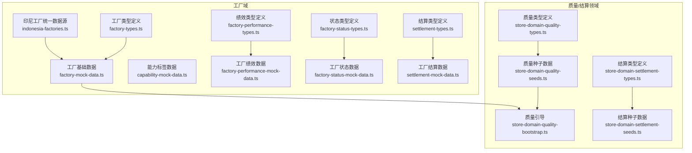
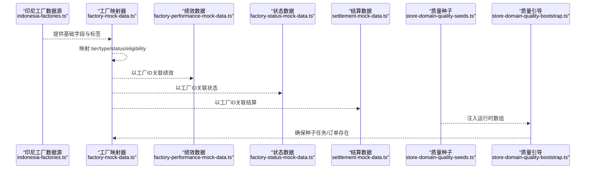
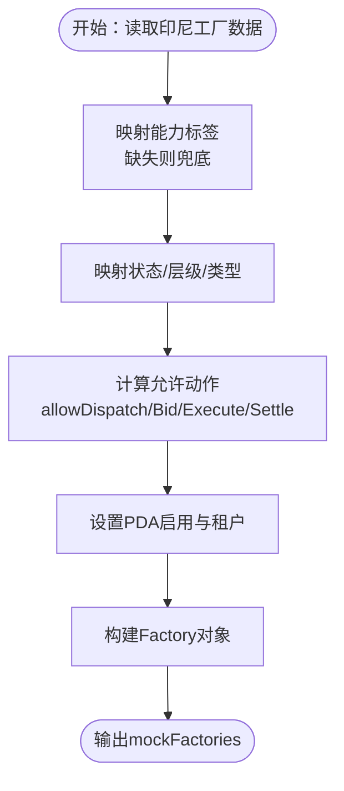
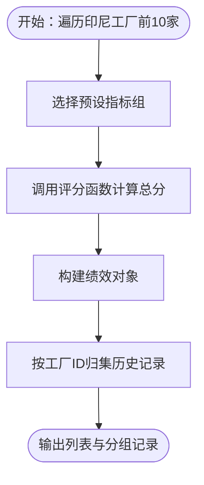
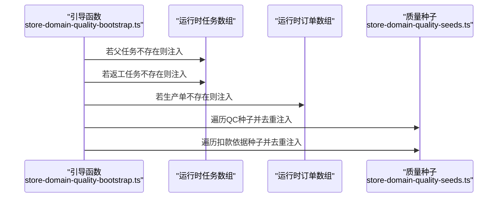
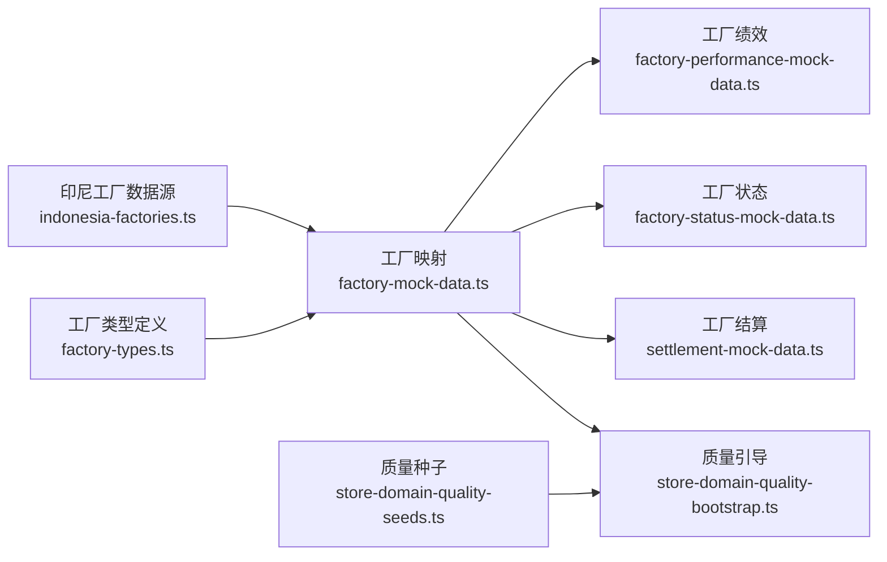

# Mock 数据管理

<cite>
**本文引用的文件**
- [factory-mock-data.ts](file://src/data/fcs/factory-mock-data.ts)
- [capability-mock-data.ts](file://src/data/fcs/capability-mock-data.ts)
- [factory-performance-mock-data.ts](file://src/data/fcs/factory-performance-mock-data.ts)
- [factory-status-mock-data.ts](file://src/data/fcs/factory-status-mock-data.ts)
- [settlement-mock-data.ts](file://src/data/fcs/settlement-mock-data.ts)
- [store-domain-quality-seeds.ts](file://src/data/fcs/store-domain-quality-seeds.ts)
- [store-domain-quality-bootstrap.ts](file://src/data/fcs/store-domain-quality-bootstrap.ts)
- [store-domain-settlement-seeds.ts](file://src/data/fcs/store-domain-settlement-seeds.ts)
- [indonesia-factories.ts](file://src/data/fcs/indonesia-factories.ts)
- [factory-types.ts](file://src/data/fcs/factory-types.ts)
- [factory-performance-types.ts](file://src/data/fcs/factory-performance-types.ts)
- [factory-status-types.ts](file://src/data/fcs/factory-status-types.ts)
- [settlement-types.ts](file://src/data/fcs/settlement-types.ts)
- [store-domain-quality-types.ts](file://src/data/fcs/store-domain-quality-types.ts)
- [store-domain-settlement-types.ts](file://src/data/fcs/store-domain-settlement-types.ts)
</cite>

## 目录
1. [简介](#简介)
2. [项目结构](#项目结构)
3. [核心组件](#核心组件)
4. [架构总览](#架构总览)
5. [详细组件分析](#详细组件分析)
6. [依赖分析](#依赖分析)
7. [性能考虑](#性能考虑)
8. [故障排查指南](#故障排查指南)
9. [结论](#结论)
10. [附录](#附录)

## 简介
本文件系统性梳理了项目中的 Mock 数据管理体系，覆盖工厂、能力标签、绩效、状态、结算以及质量/结算领域种子数据与引导数据。文档重点阐述：
- Mock 数据的组织结构与管理策略
- 生成规则、更新机制与生命周期管理
- 种子数据（seeds）与引导数据（bootstrap）的区别与应用
- 与真实数据的映射关系与转换逻辑
- 数据一致性保障与冲突处理策略
- 调试工具与测试辅助功能
- 数据迁移与版本演进指导

## 项目结构
Mock 数据主要位于 src/data/fcs 目录下，按业务域划分文件，每个文件聚焦一类 Mock 数据或其类型定义。核心结构如下：
- 工厂域：工厂基础数据、能力标签、绩效、状态、结算
- 质量/结算领域：质量种子数据、质量引导、结算种子数据
- 类型定义：各域的数据模型与枚举，确保 Mock 与真实数据一致

图表来源
- [factory-mock-data.ts:1-121](file://src/data/fcs/factory-mock-data.ts#L1-L121)
- [capability-mock-data.ts:1-195](file://src/data/fcs/capability-mock-data.ts#L1-L195)
- [factory-performance-mock-data.ts:1-140](file://src/data/fcs/factory-performance-mock-data.ts#L1-L140)
- [factory-status-mock-data.ts:1-95](file://src/data/fcs/factory-status-mock-data.ts#L1-L95)
- [settlement-mock-data.ts:1-199](file://src/data/fcs/settlement-mock-data.ts#L1-L199)
- [store-domain-quality-seeds.ts:1-269](file://src/data/fcs/store-domain-quality-seeds.ts#L1-L269)
- [store-domain-quality-bootstrap.ts:1-37](file://src/data/fcs/store-domain-quality-bootstrap.ts#L1-L37)
- [store-domain-settlement-seeds.ts:1-57](file://src/data/fcs/store-domain-settlement-seeds.ts#L1-L57)
- [indonesia-factories.ts:1-951](file://src/data/fcs/indonesia-factories.ts#L1-L951)
- [factory-types.ts:1-155](file://src/data/fcs/factory-types.ts#L1-L155)
- [factory-performance-types.ts:1-59](file://src/data/fcs/factory-performance-types.ts#L1-L59)
- [factory-status-types.ts:1-45](file://src/data/fcs/factory-status-types.ts#L1-L45)
- [settlement-types.ts:1-122](file://src/data/fcs/settlement-types.ts#L1-L122)
- [store-domain-quality-types.ts:1-304](file://src/data/fcs/store-domain-quality-types.ts#L1-L304)
- [store-domain-settlement-types.ts:1-103](file://src/data/fcs/store-domain-settlement-types.ts#L1-L103)

章节来源
- [factory-mock-data.ts:1-121](file://src/data/fcs/factory-mock-data.ts#L1-L121)
- [capability-mock-data.ts:1-195](file://src/data/fcs/capability-mock-data.ts#L1-L195)
- [factory-performance-mock-data.ts:1-140](file://src/data/fcs/factory-performance-mock-data.ts#L1-L140)
- [factory-status-mock-data.ts:1-95](file://src/data/fcs/factory-status-mock-data.ts#L1-L95)
- [settlement-mock-data.ts:1-199](file://src/data/fcs/settlement-mock-data.ts#L1-L199)
- [store-domain-quality-seeds.ts:1-269](file://src/data/fcs/store-domain-quality-seeds.ts#L1-L269)
- [store-domain-quality-bootstrap.ts:1-37](file://src/data/fcs/store-domain-quality-bootstrap.ts#L1-L37)
- [store-domain-settlement-seeds.ts:1-57](file://src/data/fcs/store-domain-settlement-seeds.ts#L1-L57)
- [indonesia-factories.ts:1-951](file://src/data/fcs/indonesia-factories.ts#L1-L951)
- [factory-types.ts:1-155](file://src/data/fcs/factory-types.ts#L1-L155)
- [factory-performance-types.ts:1-59](file://src/data/fcs/factory-performance-types.ts#L1-L59)
- [factory-status-types.ts:1-45](file://src/data/fcs/factory-status-types.ts#L1-L45)
- [settlement-types.ts:1-122](file://src/data/fcs/settlement-types.ts#L1-L122)
- [store-domain-quality-types.ts:1-304](file://src/data/fcs/store-domain-quality-types.ts#L1-L304)
- [store-domain-settlement-types.ts:1-103](file://src/data/fcs/store-domain-settlement-types.ts#L1-L103)

## 核心组件
- 印尼工厂统一数据源：提供工厂基础信息、层级、类型、KPI 模板、能力标签、城市/省份/银行等基础数据，作为所有 Mock 工厂数据的“真实数据源”。
- 工厂 Mock 数据：基于印尼工厂数据进行映射与扩展，生成 Factory、Eligibility、合作模式、PDA 配置等。
- 能力标签 Mock 数据：提供标签分类与标签集合，支持前端筛选与展示。
- 工厂绩效 Mock 数据：提供工厂绩效指标与历史记录，包含评分计算规则。
- 工厂状态 Mock 数据：提供工厂状态列表与状态变更历史。
- 工厂结算 Mock 数据：提供结算配置、收款账户、默认扣款规则与结算摘要。
- 质量/结算领域种子与引导：提供质量检验、扣款依据、染印加工单等种子数据，以及引导函数将种子注入运行时数组。

章节来源
- [indonesia-factories.ts:67-94](file://src/data/fcs/indonesia-factories.ts#L67-L94)
- [factory-mock-data.ts:89-117](file://src/data/fcs/factory-mock-data.ts#L89-L117)
- [capability-mock-data.ts:3-194](file://src/data/fcs/capability-mock-data.ts#L3-L194)
- [factory-performance-mock-data.ts:5-33](file://src/data/fcs/factory-performance-mock-data.ts#L5-L33)
- [factory-status-mock-data.ts:4-15](file://src/data/fcs/factory-status-mock-data.ts#L4-L15)
- [settlement-mock-data.ts:9-198](file://src/data/fcs/settlement-mock-data.ts#L9-L198)
- [store-domain-quality-seeds.ts:24-268](file://src/data/fcs/store-domain-quality-seeds.ts#L24-L268)
- [store-domain-quality-bootstrap.ts:13-36](file://src/data/fcs/store-domain-quality-bootstrap.ts#L13-L36)

## 架构总览
Mock 数据的生成与使用遵循“统一数据源 → 映射/扩展 → 导出/注入”的路径，确保与真实数据结构一致且便于维护。

图表来源
- [indonesia-factories.ts:135-396](file://src/data/fcs/indonesia-factories.ts#L135-L396)
- [factory-mock-data.ts:89-117](file://src/data/fcs/factory-mock-data.ts#L89-L117)
- [factory-performance-mock-data.ts:19-33](file://src/data/fcs/factory-performance-mock-data.ts#L19-L33)
- [factory-status-mock-data.ts:5-15](file://src/data/fcs/factory-status-mock-data.ts#L5-L15)
- [settlement-mock-data.ts:189-198](file://src/data/fcs/settlement-mock-data.ts#L189-L198)
- [store-domain-quality-seeds.ts:84-187](file://src/data/fcs/store-domain-quality-seeds.ts#L84-L187)
- [store-domain-quality-bootstrap.ts:13-36](file://src/data/fcs/store-domain-quality-bootstrap.ts#L13-L36)

## 详细组件分析

### 工厂 Mock 数据（factory-mock-data.ts）
- 组织结构与职责
  - 能力标签映射：将字符串标签映射为 CapabilityTag，缺失时自动兜底。
  - 状态与层级映射：将印尼工厂状态映射为内部状态；根据 tier 推导 factoryTier 与 factoryType。
  - Eligibility 与 PDA 配置：基于状态与字段推导允许执行的动作与租户配置。
  - 生成规则：以印尼工厂数据为基准，逐条映射生成 Factory 列表。
- 生命周期管理
  - 生成一次，全局共享；如需更新，建议通过引导函数或替换数据源。
- 与真实数据映射
  - 字段一一对应，新增字段（如 eligibility、pdaEnabled）来自映射与默认值。
- 冲突处理
  - 标签不存在时自动兜底，避免因外部标签变化导致构建失败。

图表来源
- [factory-mock-data.ts:33-117](file://src/data/fcs/factory-mock-data.ts#L33-L117)
- [indonesia-factories.ts:67-94](file://src/data/fcs/indonesia-factories.ts#L67-L94)

章节来源
- [factory-mock-data.ts:1-121](file://src/data/fcs/factory-mock-data.ts#L1-L121)
- [factory-types.ts:41-73](file://src/data/fcs/factory-types.ts#L41-L73)

### 能力标签 Mock 数据（capability-mock-data.ts）
- 组织结构与职责
  - 提供标签分类与标签集合，支持前端按分类筛选与展示。
- 生成规则
  - 预置分类与标签，标注系统标签、使用次数、状态等。
- 与真实数据映射
  - 与工厂能力标签结构一致，便于工厂数据的标签化展示。

章节来源
- [capability-mock-data.ts:1-195](file://src/data/fcs/capability-mock-data.ts#L1-L195)
- [factory-types.ts:41-46](file://src/data/fcs/factory-types.ts#L41-L46)

### 工厂绩效 Mock 数据（factory-performance-mock-data.ts）
- 组织结构与职责
  - 提供工厂绩效列表与按工厂分组的历史记录。
  - 包含评分计算函数，用于从指标计算综合得分。
- 生成规则
  - 以印尼工厂为基准，按索引循环填充预设指标。
- 与真实数据映射
  - 指标字段与类型定义一致，便于前端展示与排序。

图表来源
- [factory-performance-mock-data.ts:19-33](file://src/data/fcs/factory-performance-mock-data.ts#L19-L33)
- [factory-performance-types.ts:50-58](file://src/data/fcs/factory-performance-types.ts#L50-L58)

章节来源
- [factory-performance-mock-data.ts:1-140](file://src/data/fcs/factory-performance-mock-data.ts#L1-L140)
- [factory-performance-types.ts:1-59](file://src/data/fcs/factory-performance-types.ts#L1-L59)

### 工厂状态 Mock 数据（factory-status-mock-data.ts）
- 组织结构与职责
  - 提供工厂状态列表与状态变更历史。
- 生成规则
  - 以印尼工厂状态为依据，生成状态与变更原因。
- 与真实数据映射
  - 状态类型与历史结构与类型定义一致。

章节来源
- [factory-status-mock-data.ts:1-95](file://src/data/fcs/factory-status-mock-data.ts#L1-L95)
- [factory-status-types.ts:1-45](file://src/data/fcs/factory-status-types.ts#L1-L45)

### 工厂结算 Mock 数据（settlement-mock-data.ts）
- 组织结构与职责
  - 提供结算配置、收款账户、默认扣款规则与结算摘要。
- 生成规则
  - 使用印尼工厂与银行列表生成配置与账户；摘要从工厂派生。
- 与真实数据映射
  - 类型与枚举与结算类型定义一致。

章节来源
- [settlement-mock-data.ts:1-199](file://src/data/fcs/settlement-mock-data.ts#L1-L199)
- [settlement-types.ts:1-122](file://src/data/fcs/settlement-types.ts#L1-L122)

### 质量/结算领域种子与引导（store-domain-quality-seeds.ts, store-domain-quality-bootstrap.ts, store-domain-settlement-seeds.ts）
- 组织结构与职责
  - 质量种子：包含初始 QC、扣款依据、任务/订单、染印加工单等种子数据。
  - 质量引导：在运行时将种子注入现有数组，避免重复插入。
  - 结算种子：包含变更单等种子数据，支撑结算流程原型。
- 生成规则
  - 种子数据为静态常量，引导函数负责幂等注入。
- 与真实数据映射
  - 类型与质量/结算类型定义一致，确保字段与状态机正确。

图表来源
- [store-domain-quality-bootstrap.ts:13-36](file://src/data/fcs/store-domain-quality-bootstrap.ts#L13-L36)
- [store-domain-quality-seeds.ts:24-187](file://src/data/fcs/store-domain-quality-seeds.ts#L24-L187)

章节来源
- [store-domain-quality-seeds.ts:1-269](file://src/data/fcs/store-domain-quality-seeds.ts#L1-L269)
- [store-domain-quality-bootstrap.ts:1-37](file://src/data/fcs/store-domain-quality-bootstrap.ts#L1-L37)
- [store-domain-settlement-seeds.ts:1-57](file://src/data/fcs/store-domain-settlement-seeds.ts#L1-L57)
- [store-domain-quality-types.ts:1-304](file://src/data/fcs/store-domain-quality-types.ts#L1-L304)
- [store-domain-settlement-types.ts:1-103](file://src/data/fcs/store-domain-settlement-types.ts#L1-L103)

## 依赖分析
- 组件耦合
  - 工厂 Mock 数据依赖印尼工厂统一数据源与类型定义。
  - 绩效/状态/结算 Mock 数据依赖工厂 Mock 数据的 ID 关联。
  - 质量引导依赖运行时数组与种子数据，保持幂等。
- 外部依赖
  - 银行列表来自印尼工厂数据源，用于结算账户生成。
- 循环依赖
  - 未发现循环依赖；引导函数仅注入，不反向依赖。

图表来源
- [indonesia-factories.ts:135-396](file://src/data/fcs/indonesia-factories.ts#L135-L396)
- [factory-mock-data.ts:89-117](file://src/data/fcs/factory-mock-data.ts#L89-L117)
- [factory-performance-mock-data.ts:19-33](file://src/data/fcs/factory-performance-mock-data.ts#L19-L33)
- [factory-status-mock-data.ts:5-15](file://src/data/fcs/factory-status-mock-data.ts#L5-L15)
- [settlement-mock-data.ts:189-198](file://src/data/fcs/settlement-mock-data.ts#L189-L198)
- [store-domain-quality-bootstrap.ts:13-36](file://src/data/fcs/store-domain-quality-bootstrap.ts#L13-L36)
- [store-domain-quality-seeds.ts:24-187](file://src/data/fcs/store-domain-quality-seeds.ts#L24-L187)
- [factory-types.ts:1-155](file://src/data/fcs/factory-types.ts#L1-L155)

章节来源
- [factory-mock-data.ts:1-121](file://src/data/fcs/factory-mock-data.ts#L1-L121)
- [factory-performance-mock-data.ts:1-140](file://src/data/fcs/factory-performance-mock-data.ts#L1-L140)
- [factory-status-mock-data.ts:1-95](file://src/data/fcs/factory-status-mock-data.ts#L1-L95)
- [settlement-mock-data.ts:1-199](file://src/data/fcs/settlement-mock-data.ts#L1-L199)
- [store-domain-quality-bootstrap.ts:1-37](file://src/data/fcs/store-domain-quality-bootstrap.ts#L1-L37)
- [store-domain-quality-seeds.ts:1-269](file://src/data/fcs/store-domain-quality-seeds.ts#L1-L269)

## 性能考虑
- 数据规模
  - 印尼工厂数据约 30 家，Mock 数据规模较小，适合本地开发与测试。
- 计算复杂度
  - 映射与构造为 O(n)，其中 n 为工厂数量；引导函数为 O(m+k)，m 为种子数量，k 为运行时数组长度。
- 内存占用
  - Mock 数据为只读常量，内存占用低；引导函数仅在初始化阶段执行。
- 建议
  - 在大规模场景下，可考虑懒加载或按需注入；当前原型阶段无需优化。

## 故障排查指南
- 标签缺失导致构建失败
  - 现象：工厂映射时报错或标签为空。
  - 处理：检查标签映射表与印尼工厂标签是否匹配；利用兜底逻辑确保不中断。
- 状态/类型映射异常
  - 现象：工厂状态或类型不符合预期。
  - 处理：核对映射函数与印尼工厂字段；必要时扩展映射规则。
- 引导重复注入
  - 现象：运行时数组出现重复项。
  - 处理：使用引导函数的幂等判断；确保唯一键（如 taskId、qcId、productionOrderId）正确。
- 评分计算异常
  - 现象：绩效总分不在合理范围。
  - 处理：检查指标值与评分公式；确保输入合法。

章节来源
- [factory-mock-data.ts:33-117](file://src/data/fcs/factory-mock-data.ts#L33-L117)
- [store-domain-quality-bootstrap.ts:13-36](file://src/data/fcs/store-domain-quality-bootstrap.ts#L13-L36)
- [factory-performance-types.ts:50-58](file://src/data/fcs/factory-performance-types.ts#L50-L58)

## 结论
本 Mock 数据体系以印尼工厂统一数据源为核心，通过清晰的映射与扩展规则，生成工厂、能力标签、绩效、状态、结算及质量/结算领域的种子与引导数据。该体系具备良好的一致性、可维护性与可扩展性，能够满足开发与测试需求。后续可在保持类型一致性的前提下，逐步引入动态生成与版本化管理策略。

## 附录

### 种子数据与引导数据的区别与应用
- 种子数据（seeds）
  - 定义：静态的、完整的数据样本，用于快速搭建业务原型。
  - 应用：提供初始 QC、扣款依据、任务/订单、染印加工单等。
- 引导数据（bootstrap）
  - 定义：运行时注入逻辑，确保种子被安全地加入现有数组。
  - 应用：避免重复注入，保证系统启动时的数据完整性。

章节来源
- [store-domain-quality-seeds.ts:24-187](file://src/data/fcs/store-domain-quality-seeds.ts#L24-L187)
- [store-domain-quality-bootstrap.ts:13-36](file://src/data/fcs/store-domain-quality-bootstrap.ts#L13-L36)

### 数据一致性与冲突处理策略
- 一致性
  - 通过类型定义与统一数据源确保字段与结构一致。
  - 引导函数采用幂等判断，避免重复注入。
- 冲突处理
  - 标签缺失兜底；状态/类型映射扩展；评分边界保护。

章节来源
- [factory-types.ts:1-155](file://src/data/fcs/factory-types.ts#L1-L155)
- [store-domain-quality-types.ts:1-304](file://src/data/fcs/store-domain-quality-types.ts#L1-L304)
- [factory-performance-types.ts:50-58](file://src/data/fcs/factory-performance-types.ts#L50-L58)

### 调试工具与测试辅助功能
- 调试建议
  - 在引导函数前后打印数组长度与关键键值，验证幂等性。
  - 使用类型定义作为契约，确保 Mock 与真实数据结构一致。
- 测试辅助
  - 以种子数据为基础编写端到端测试，覆盖关键流程节点。

章节来源
- [store-domain-quality-bootstrap.ts:13-36](file://src/data/fcs/store-domain-quality-bootstrap.ts#L13-L36)
- [store-domain-quality-seeds.ts:24-187](file://src/data/fcs/store-domain-quality-seeds.ts#L24-L187)

### 数据迁移与版本演进指导
- 迁移策略
  - 保持类型定义稳定，逐步替换或扩展 Mock 数据。
  - 通过引导函数实现平滑注入，避免破坏现有数据。
- 版本演进
  - 以印尼工厂数据源为基准，同步更新映射规则与默认值。
  - 对评分与规则进行版本化注释，便于回溯与审计。

章节来源
- [indonesia-factories.ts:135-396](file://src/data/fcs/indonesia-factories.ts#L135-L396)
- [factory-performance-types.ts:50-58](file://src/data/fcs/factory-performance-types.ts#L50-L58)
- [settlement-types.ts:1-122](file://src/data/fcs/settlement-types.ts#L1-L122)