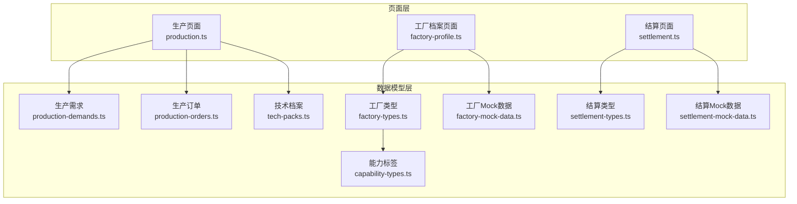
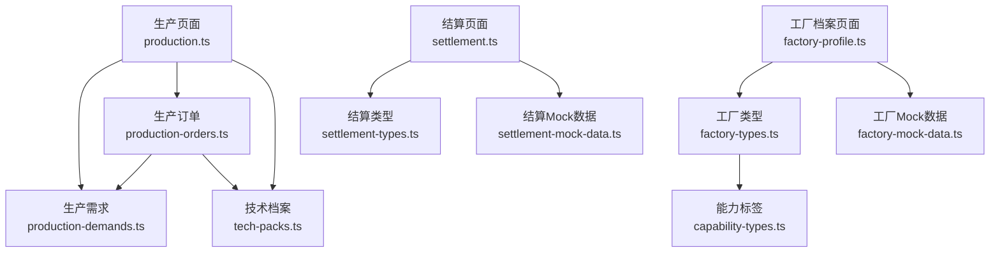
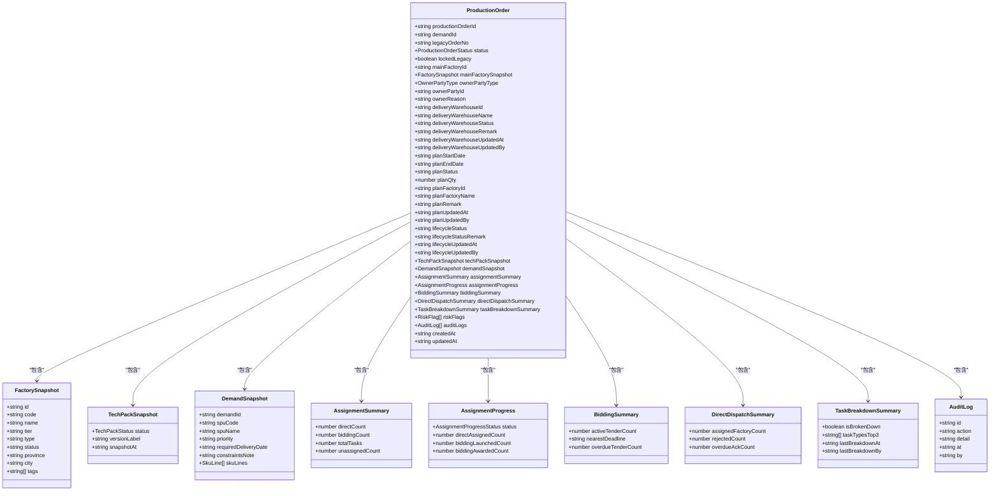
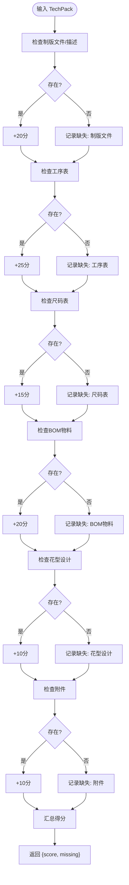
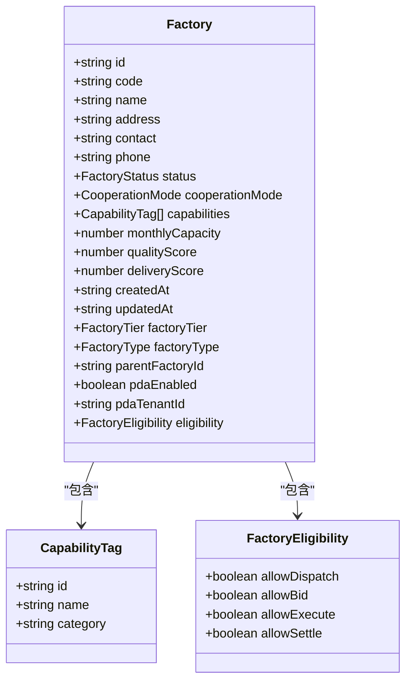
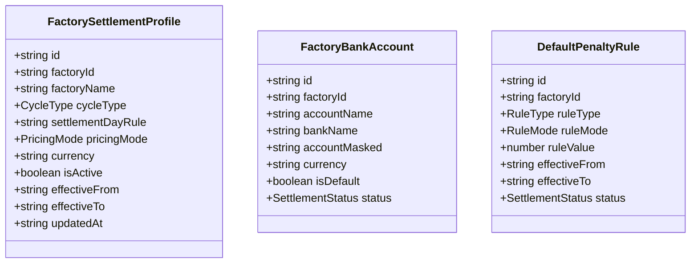
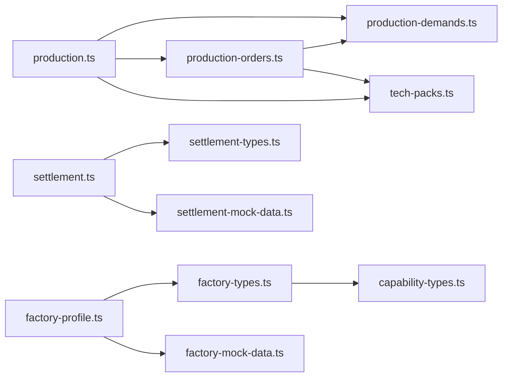
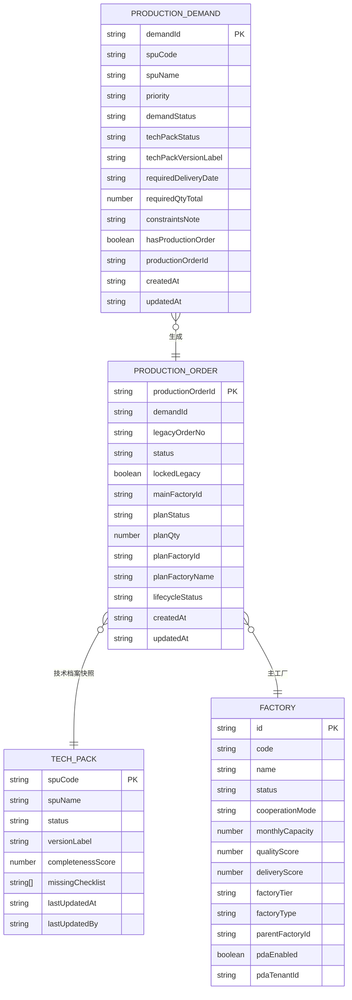

# 业务数据模型

<cite>
**本文档引用的文件**
- [production-orders.ts](file://src/data/fcs/production-orders.ts)
- [production-demands.ts](file://src/data/fcs/production-demands.ts)
- [tech-packs.ts](file://src/data/fcs/tech-packs.ts)
- [factory-types.ts](file://src/data/fcs/factory-types.ts)
- [settlement-types.ts](file://src/data/fcs/settlement-types.ts)
- [capability-types.ts](file://src/data/fcs/capability-types.ts)
- [factory-mock-data.ts](file://src/data/fcs/factory-mock-data.ts)
- [settlement-mock-data.ts](file://src/data/fcs/settlement-mock-data.ts)
- [production.ts](file://src/pages/production.ts)
- [factory-profile.ts](file://src/pages/factory-profile.ts)
- [settlement.ts](file://src/pages/settlement.ts)
</cite>

## 目录
1. [引言](#引言)
2. [项目结构](#项目结构)
3. [核心组件](#核心组件)
4. [架构总览](#架构总览)
5. [详细组件分析](#详细组件分析)
6. [依赖分析](#依赖分析)
7. [性能考虑](#性能考虑)
8. [故障排除指南](#故障排除指南)
9. [结论](#结论)
10. [附录](#附录)

## 引言
本文件面向业务数据建模，系统梳理生产制造领域的核心数据模型，包括生产订单、生产需求、技术档案、工厂类型、结算类型等，并阐明它们之间的关系、约束与业务规则。同时提供扩展与演进的最佳实践，帮助开发者在不破坏现有结构的前提下进行模型扩展与版本管理。

## 项目结构
本项目采用按领域分层的数据组织方式，核心业务模型集中在 `src/data/fcs/` 下，页面层通过导入这些模型实现业务功能。关键目录与文件如下：
- 数据模型层：生产需求、生产订单、技术档案、工厂类型、结算类型及其能力标签
- 页面层：生产、工厂档案、结算等页面对模型进行消费与渲染
- Mock 数据：为各模型提供示例数据，便于前端演示与测试

图表来源
- [production-demands.ts:1-528](file://src/data/fcs/production-demands.ts#L1-L528)
- [production-orders.ts:1-855](file://src/data/fcs/production-orders.ts#L1-L855)
- [tech-packs.ts:1-341](file://src/data/fcs/tech-packs.ts#L1-L341)
- [factory-types.ts:1-155](file://src/data/fcs/factory-types.ts#L1-L155)
- [settlement-types.ts:1-122](file://src/data/fcs/settlement-types.ts#L1-L122)
- [capability-types.ts:1-47](file://src/data/fcs/capability-types.ts#L1-L47)
- [factory-mock-data.ts:1-121](file://src/data/fcs/factory-mock-data.ts#L1-L121)
- [settlement-mock-data.ts:1-199](file://src/data/fcs/settlement-mock-data.ts#L1-L199)
- [production.ts:1-800](file://src/pages/production.ts#L1-L800)
- [factory-profile.ts:1-800](file://src/pages/factory-profile.ts#L1-L800)
- [settlement.ts:1-800](file://src/pages/settlement.ts#L1-L800)

章节来源
- [production.ts:1-800](file://src/pages/production.ts#L1-L800)
- [factory-profile.ts:1-800](file://src/pages/factory-profile.ts#L1-L800)
- [settlement.ts:1-800](file://src/pages/settlement.ts#L1-L800)

## 核心组件
本节概述关键数据模型的职责与边界：
- 生产需求：描述来自上游系统的订单需求，包含SPU/SKU明细、优先级、交期、技术包状态等
- 生产订单：基于需求生成的执行单元，承载状态机、分配进度、风险标记、审计日志等
- 技术档案：以SPU为维度的技术资料集合，包含工艺流程、尺码表、BOM、附件等
- 工厂类型：工厂的层级、类型、能力标签、PDA配置与执行资格
- 结算类型：工厂结算配置、收款账户、默认扣款规则及状态

章节来源
- [production-demands.ts:16-38](file://src/data/fcs/production-demands.ts#L16-L38)
- [production-orders.ts:115-161](file://src/data/fcs/production-orders.ts#L115-L161)
- [tech-packs.ts:56-73](file://src/data/fcs/tech-packs.ts#L56-L73)
- [factory-types.ts:48-73](file://src/data/fcs/factory-types.ts#L48-L73)
- [settlement-types.ts:16-65](file://src/data/fcs/settlement-types.ts#L16-L65)

## 架构总览
下图展示了页面与数据模型之间的交互关系，以及模型间的依赖：

图表来源
- [production.ts:1-800](file://src/pages/production.ts#L1-L800)
- [production-demands.ts:1-528](file://src/data/fcs/production-demands.ts#L1-L528)
- [production-orders.ts:1-855](file://src/data/fcs/production-orders.ts#L1-L855)
- [tech-packs.ts:1-341](file://src/data/fcs/tech-packs.ts#L1-L341)
- [factory-profile.ts:1-800](file://src/pages/factory-profile.ts#L1-L800)
- [factory-types.ts:1-155](file://src/data/fcs/factory-types.ts#L1-L155)
- [factory-mock-data.ts:1-121](file://src/data/fcs/factory-mock-data.ts#L1-L121)
- [settlement.ts:1-800](file://src/pages/settlement.ts#L1-L800)
- [settlement-types.ts:1-122](file://src/data/fcs/settlement-types.ts#L1-L122)
- [settlement-mock-data.ts:1-199](file://src/data/fcs/settlement-mock-data.ts#L1-L199)
- [capability-types.ts:1-47](file://src/data/fcs/capability-types.ts#L1-L47)

## 详细组件分析

### 生产需求（ProductionDemand）
- 字段与类型
  - 主键：demandId
  - 来源与来源系统：legacyType、sourceSystem
  - SPU/SKU：spuCode、spuName、imageUrl、category、marketScopes
  - 优先级与状态：priority、demandStatus、techPackStatus、techPackVersionLabel
  - 交期与总量：requiredDeliveryDate、requiredQtyTotal
  - 约束与明细：constraintsNote、skuLines（含skuCode、size、color、qty）
  - 关联与生命周期：hasProductionOrder、productionOrderId
  - 时间戳：createdAt、updatedAt
- 业务规则
  - techPackStatus与techPackVersionLabel需与技术档案保持一致
  - demandStatus与是否生成生产订单相互约束
- 示例路径
  - [生产需求接口定义:16-38](file://src/data/fcs/production-demands.ts#L16-L38)
  - [示例数据片段:41-506](file://src/data/fcs/production-demands.ts#L41-L506)

章节来源
- [production-demands.ts:16-38](file://src/data/fcs/production-demands.ts#L16-L38)
- [production-demands.ts:41-506](file://src/data/fcs/production-demands.ts#L41-L506)

### 生产订单（ProductionOrder）
- 字段与类型
  - 主键：productionOrderId
  - 关联：demandId、legacyOrderNo
  - 状态机：status（含DRAFT、WAIT_TECH_PACK_RELEASE、READY_FOR_BREAKDOWN、WAIT_ASSIGNMENT、ASSIGNING、EXECUTING、COMPLETED、CANCELLED、ON_HOLD）
  - 主工厂与快照：mainFactoryId、mainFactorySnapshot（含id、code、name、tier、type、status、province、city、tags）
  - 货权主体：ownerPartyType（FACTORY/LEGAL_ENTITY）、ownerPartyId、ownerReason
  - 交货仓：deliveryWarehouseId、deliveryWarehouseName、deliveryWarehouseStatus（UNSET/SET）、remark、updatedBy/At
  - 计划管理：planStatus（UNPLANNED/PLANNED/RELEASED）、planQty、planFactoryId/Name、planRemark、planUpdatedBy/At
  - 生命周期：lifecycleStatus（DRAFT/PLANNED/RELEASED/IN_PRODUCTION/QC_PENDING/COMPLETED/CLOSED）、remark、updatedBy/At
  - 技术档案快照：techPackSnapshot（status、versionLabel、snapshotAt）
  - 需求快照：demandSnapshot（demandId、spuCode、spuName、priority、requiredDeliveryDate、constraintsNote、skuLines）
  - 分配与进度：assignmentSummary、assignmentProgress、biddingSummary、directDispatchSummary、taskBreakdownSummary
  - 风险标记：riskFlags（TECH_PACK_NOT_RELEASED、TECH_PACK_MISSING、MAIN_FACTORY_BLACKLISTED、MAIN_FACTORY_SUSPENDED、TENDER_OVERDUE、TENDER_NEAR_DEADLINE、DISPATCH_REJECTED、DISPATCH_ACK_OVERDUE、OWNER_ADJUSTED、DELIVERY_DATE_NEAR、HANDOVER_DIFF、HANDOVER_PENDING）
  - 审计日志：auditLogs（id、action、detail、at、by）
  - 时间戳：createdAt、updatedAt
- 业务规则
  - status与lockedLegacy联动：当状态为EXECUTING/COMPLETED/CANCELLED时，lockedLegacy为true
  - lifecycleStatus由status推导，反映生产生命周期阶段
  - riskFlags与分配/竞价/交期/手工业务风险相关
- 示例路径
  - [生产订单接口定义:115-161](file://src/data/fcs/production-orders.ts#L115-L161)
  - [工厂快照构造函数:163-176](file://src/data/fcs/production-orders.ts#L163-L176)
  - [示例数据片段（多状态覆盖）:178-800](file://src/data/fcs/production-orders.ts#L178-L800)

图表来源
- [production-orders.ts:44-161](file://src/data/fcs/production-orders.ts#L44-L161)

章节来源
- [production-orders.ts:115-161](file://src/data/fcs/production-orders.ts#L115-L161)
- [production-orders.ts:163-176](file://src/data/fcs/production-orders.ts#L163-L176)
- [production-orders.ts:178-800](file://src/data/fcs/production-orders.ts#L178-L800)

### 技术档案（TechPack）
- 字段与类型
  - 主键：spuCode、spuName
  - 状态与版本：status（MISSING/BETA/RELEASED）、versionLabel、completenessScore、missingChecklist
  - 更新记录：lastUpdatedAt、lastUpdatedBy
  - 详细数据：patternFiles、patternDesc、processes、sizeTable、bomItems、patternDesigns、attachments
- 业务规则
  - completenessScore由各子项完整性加权计算
  - status与missingChecklist同步变化
- 示例路径
  - [技术档案接口定义:56-73](file://src/data/fcs/tech-packs.ts#L56-L73)
  - [完整性计算函数:75-118](file://src/data/fcs/tech-packs.ts#L75-L118)
  - [示例数据片段:120-294](file://src/data/fcs/tech-packs.ts#L120-L294)

图表来源
- [tech-packs.ts:75-118](file://src/data/fcs/tech-packs.ts#L75-L118)

章节来源
- [tech-packs.ts:56-73](file://src/data/fcs/tech-packs.ts#L56-L73)
- [tech-packs.ts:75-118](file://src/data/fcs/tech-packs.ts#L75-L118)
- [tech-packs.ts:120-294](file://src/data/fcs/tech-packs.ts#L120-L294)

### 工厂类型（Factory）
- 字段与类型
  - 基本信息：id、code、name、address、contact、phone
  - 状态与合作模式：status（active/paused/blacklist/inactive）、cooperationMode（exclusive/preferred/general）
  - 能力标签：capabilities（id、name、category）
  - 生产指标：monthlyCapacity、qualityScore、deliveryScore
  - 组织层级与类型：factoryTier（CENTRAL/SATELLITE/THIRD_PARTY）、factoryType（多种细分）
  - 上级工厂：parentFactoryId
  - PDA配置：pdaEnabled、pdaTenantId
  - 执行资格：eligibility（allowDispatch、allowBid、allowExecute、allowSettle）
  - 时间戳：createdAt、updatedAt
- 业务规则
  - factoryType受factoryTier限制
  - eligibility根据status动态决定
- 示例路径
  - [工厂接口定义:48-73](file://src/data/fcs/factory-types.ts#L48-L73)
  - [能力标签定义:41-46](file://src/data/fcs/factory-types.ts#L41-L46)
  - [Mock数据转换与映射:89-117](file://src/data/fcs/factory-mock-data.ts#L89-L117)

图表来源
- [factory-types.ts:48-73](file://src/data/fcs/factory-types.ts#L48-L73)
- [factory-types.ts:41-46](file://src/data/fcs/factory-types.ts#L41-L46)
- [factory-types.ts:33-39](file://src/data/fcs/factory-types.ts#L33-L39)

章节来源
- [factory-types.ts:48-73](file://src/data/fcs/factory-types.ts#L48-L73)
- [factory-types.ts:41-46](file://src/data/fcs/factory-types.ts#L41-L46)
- [factory-types.ts:33-39](file://src/data/fcs/factory-types.ts#L33-L39)
- [factory-mock-data.ts:89-117](file://src/data/fcs/factory-mock-data.ts#L89-L117)

### 结算类型（FactorySettlementProfile / BankAccount / DefaultPenaltyRule）
- 结算配置（FactorySettlementProfile）
  - 主键：id、factoryId、factoryName
  - 结算周期与计价：cycleType（WEEKLY/BIWEEKLY/MONTHLY/PER_BATCH）、settlementDayRule、pricingMode（BY_PIECE/BY_PROCESS/BY_ORDER）、currency
  - 生效区间：effectiveFrom、effectiveTo
  - 状态与更新：isActive、updatedAt
- 收款账户（FactoryBankAccount）
  - 主键：id、factoryId
  - 账户信息：accountName、bankName、accountMasked、currency
  - 默认与状态：isDefault、status（ACTIVE/INACTIVE）
- 默认扣款规则（DefaultPenaltyRule）
  - 主键：id、factoryId
  - 规则类型与模式：ruleType（QUALITY_DEFECT/DELAY_DELIVERY/MATERIAL_LOSS）、ruleMode（FIXED_AMOUNT/PERCENTAGE）、ruleValue
  - 生效区间：effectiveFrom、effectiveTo
  - 状态：status（ACTIVE/INACTIVE）
- 业务规则
  - 多版本结算配置，新版本创建时旧版本失效
  - 默认账户在同一币种下互斥
- 示例路径
  - [结算配置接口定义:16-29](file://src/data/fcs/settlement-types.ts#L16-L29)
  - [收款账户接口定义:31-41](file://src/data/fcs/settlement-types.ts#L31-L41)
  - [默认扣款规则接口定义:43-53](file://src/data/fcs/settlement-types.ts#L43-L53)
  - [Mock数据示例:9-199](file://src/data/fcs/settlement-mock-data.ts#L9-L199)

图表来源
- [settlement-types.ts:16-53](file://src/data/fcs/settlement-types.ts#L16-L53)

章节来源
- [settlement-types.ts:16-53](file://src/data/fcs/settlement-types.ts#L16-L53)
- [settlement-mock-data.ts:9-199](file://src/data/fcs/settlement-mock-data.ts#L9-L199)

### 能力标签（CapabilityTag）
- 字段与类型
  - 标签基础：id、name、categoryId、categoryName、description、status（active/inactive）、usageCount、isSystemTag、createdAt、updatedAt
  - 分类：id、name、status、sortOrder
- 业务规则
  - 标签状态与启用/禁用
  - 分类排序与状态控制
- 示例路径
  - [能力标签接口定义:12-24](file://src/data/fcs/capability-types.ts#L12-L24)
  - [分类接口定义:4-10](file://src/data/fcs/capability-types.ts#L4-L10)

章节来源
- [capability-types.ts:12-24](file://src/data/fcs/capability-types.ts#L12-L24)
- [capability-types.ts:4-10](file://src/data/fcs/capability-types.ts#L4-L10)

## 依赖分析
- 页面与模型的依赖
  - 生产页面依赖生产需求、生产订单、技术档案，用于筛选、生成、计划、交货与变更管理
  - 工厂档案页面依赖工厂类型与Mock数据，用于工厂信息维护与PDA配置
  - 结算页面依赖结算类型与Mock数据，用于结算配置、账户与规则管理
- 模型间依赖
  - 生产订单依赖生产需求与技术档案（快照），并通过工厂快照关联工厂
  - 工厂类型与能力标签共同构成工厂能力画像
  - 结算类型与工厂类型形成结算关系

图表来源
- [production.ts:1-800](file://src/pages/production.ts#L1-L800)
- [production-demands.ts:1-528](file://src/data/fcs/production-demands.ts#L1-L528)
- [production-orders.ts:1-855](file://src/data/fcs/production-orders.ts#L1-L855)
- [tech-packs.ts:1-341](file://src/data/fcs/tech-packs.ts#L1-L341)
- [factory-profile.ts:1-800](file://src/pages/factory-profile.ts#L1-L800)
- [factory-types.ts:1-155](file://src/data/fcs/factory-types.ts#L1-L155)
- [factory-mock-data.ts:1-121](file://src/data/fcs/factory-mock-data.ts#L1-L121)
- [settlement.ts:1-800](file://src/pages/settlement.ts#L1-L800)
- [settlement-types.ts:1-122](file://src/data/fcs/settlement-types.ts#L1-L122)
- [settlement-mock-data.ts:1-199](file://src/data/fcs/settlement-mock-data.ts#L1-L199)
- [capability-types.ts:1-47](file://src/data/fcs/capability-types.ts#L1-L47)

章节来源
- [production.ts:1-800](file://src/pages/production.ts#L1-L800)
- [factory-profile.ts:1-800](file://src/pages/factory-profile.ts#L1-L800)
- [settlement.ts:1-800](file://src/pages/settlement.ts#L1-L800)

## 性能考虑
- 数据规模与分页
  - 页面层普遍采用分页（PAGE_SIZE=10），避免一次性加载大量数据
- 查询与过滤
  - 使用关键词与多维过滤减少渲染量，提升交互响应
- 快照与缓存
  - 生产订单包含技术档案与需求快照，避免频繁跨表查询
- 计算复杂度
  - 完整度计算为O(n)扫描，建议在服务端或离线批处理中预计算并缓存

## 故障排除指南
- 技术档案缺失导致状态异常
  - 现象：生产订单techPackSnapshot.status为MISSING，但需求techPackStatus为RELEASED
  - 处理：调用技术档案接口获取最新状态，或创建beta版本
  - 参考路径：[技术档案接口与工具函数:296-341](file://src/data/fcs/tech-packs.ts#L296-L341)
- 工厂资格不符导致分配失败
  - 现象：工厂eligibility.allowDispatch/allowBid/allowExecute为false
  - 处理：检查工厂状态与合作模式，必要时调整工厂档案
  - 参考路径：[工厂档案与eligibility映射:109-117](file://src/data/fcs/factory-mock-data.ts#L109-L117)
- 结算账户冲突
  - 现象：同一币种下多个默认账户
  - 处理：禁用旧默认账户，设置新默认账户
  - 参考路径：[结算账户接口定义:31-41](file://src/data/fcs/settlement-types.ts#L31-L41)

章节来源
- [tech-packs.ts:296-341](file://src/data/fcs/tech-packs.ts#L296-L341)
- [factory-mock-data.ts:109-117](file://src/data/fcs/factory-mock-data.ts#L109-L117)
- [settlement-types.ts:31-41](file://src/data/fcs/settlement-types.ts#L31-L41)

## 结论
本项目通过清晰的数据模型划分与严格的字段约束，构建了从需求到执行再到结算的完整业务闭环。页面层通过导入模型实现强类型的数据消费，配合Mock数据与分页策略，保证了良好的用户体验与可维护性。建议在扩展新模型时遵循统一的命名规范、字段约束与状态机设计，确保与既有模型的兼容性与一致性。

## 附录

### 数据模型关系图（概念性）

[本图为概念性关系示意，不对应具体源码文件]