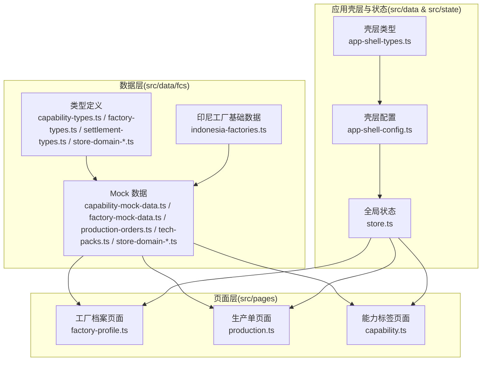
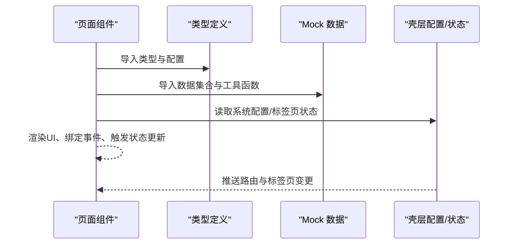
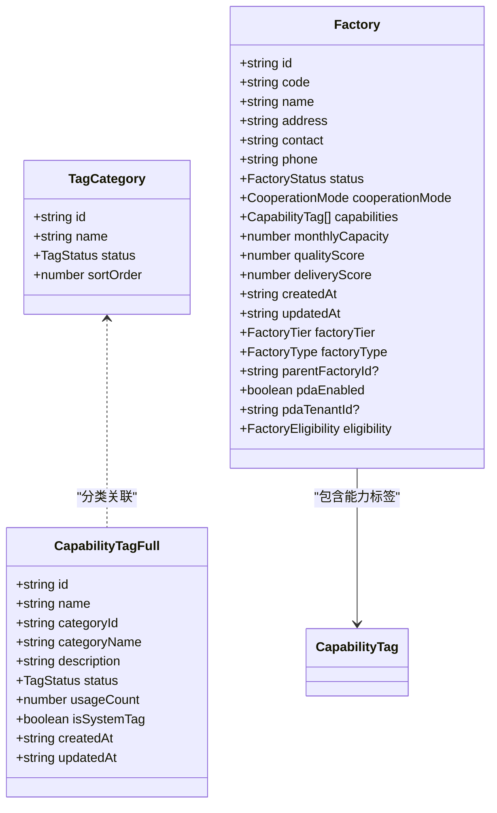
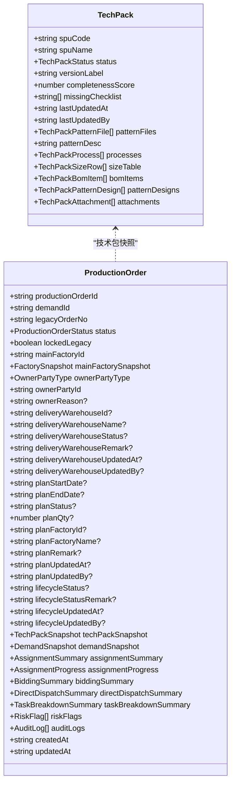
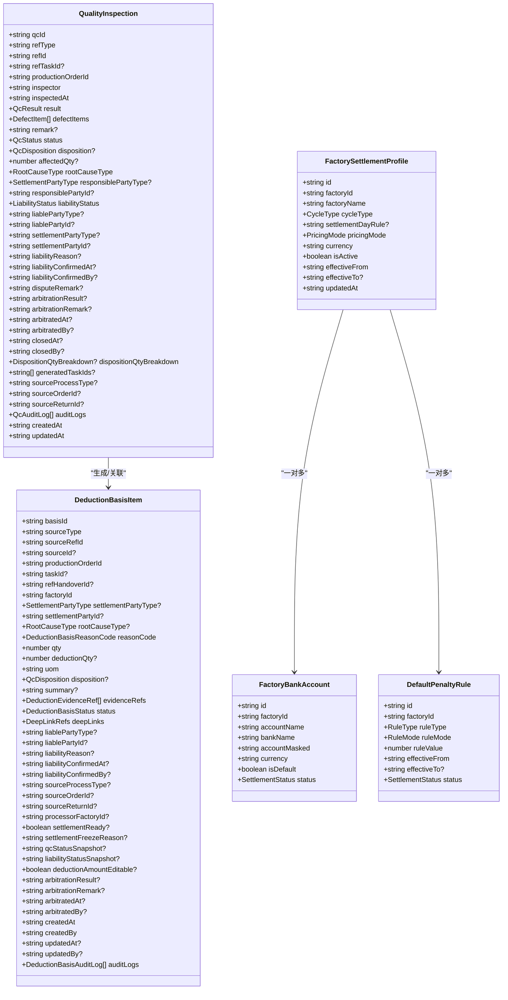
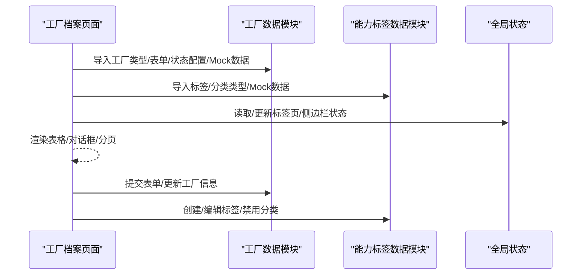
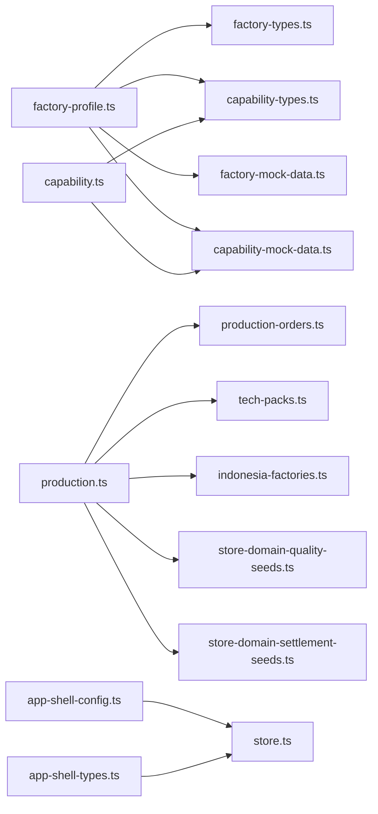

# 数据层系统

<cite>
**本文档引用的文件**
- [capability-mock-data.ts](file://src/data/fcs/capability-mock-data.ts)
- [capability-types.ts](file://src/data/fcs/capability-types.ts)
- [factory-types.ts](file://src/data/fcs/factory-types.ts)
- [factory-mock-data.ts](file://src/data/fcs/factory-mock-data.ts)
- [production-orders.ts](file://src/data/fcs/production-orders.ts)
- [tech-packs.ts](file://src/data/fcs/tech-packs.ts)
- [indonesia-factories.ts](file://src/data/fcs/indonesia-factories.ts)
- [settlement-types.ts](file://src/data/fcs/settlement-types.ts)
- [store-domain-quality-types.ts](file://src/data/fcs/store-domain-quality-types.ts)
- [store-domain-quality-seeds.ts](file://src/data/fcs/store-domain-quality-seeds.ts)
- [store-domain-settlement-seeds.ts](file://src/data/fcs/store-domain-settlement-seeds.ts)
- [app-shell-types.ts](file://src/data/app-shell-types.ts)
- [app-shell-config.ts](file://src/data/app-shell-config.ts)
- [store.ts](file://src/state/store.ts)
- [utils.ts](file://src/utils.ts)
- [factory-profile.ts](file://src/pages/factory-profile.ts)
- [production.ts](file://src/pages/production.ts)
- [capability.ts](file://src/pages/capability.ts)
</cite>

## 目录
1. [引言](#引言)
2. [项目结构](#项目结构)
3. [核心组件](#核心组件)
4. [架构总览](#架构总览)
5. [详细组件分析](#详细组件分析)
6. [依赖关系分析](#依赖关系分析)
7. [性能考虑](#性能考虑)
8. [故障排查指南](#故障排查指南)
9. [结论](#结论)
10. [附录](#附录)

## 引言
本文件面向数据层系统，系统化梳理数据架构设计、Mock 数据结构、业务类型定义与数据持久化策略，覆盖工厂档案、生产订单、技术档案、能力标签、质量与结算等核心业务数据模型。文档同时阐明数据层与页面组件的交互方式（数据获取、更新与同步）、扩展新业务数据类型的实践路径、数据验证与业务规则、数据访问模式与缓存策略、数据迁移与版本管理建议，以及调试与测试工具与方法。

## 项目结构
数据层位于 src/data/fcs 下，采用“按领域分层”的组织方式，每个子域（如工厂、生产、质量、结算等）拥有独立的类型定义与 Mock 数据文件；页面层位于 src/pages，通过直接导入数据层模块实现数据驱动渲染与交互。

图表来源
- [capability-mock-data.ts](file://src/data/fcs/capability-mock-data.ts)
- [factory-mock-data.ts](file://src/data/fcs/factory-mock-data.ts)
- [production-orders.ts](file://src/data/fcs/production-orders.ts)
- [tech-packs.ts](file://src/data/fcs/tech-packs.ts)
- [indonesia-factories.ts](file://src/data/fcs/indonesia-factories.ts)
- [factory-profile.ts](file://src/pages/factory-profile.ts)
- [production.ts](file://src/pages/production.ts)
- [capability.ts](file://src/pages/capability.ts)
- [app-shell-types.ts](file://src/data/app-shell-types.ts)
- [app-shell-config.ts](file://src/data/app-shell-config.ts)
- [store.ts](file://src/state/store.ts)

章节来源
- [capability-mock-data.ts](file://src/data/fcs/capability-mock-data.ts)
- [factory-mock-data.ts](file://src/data/fcs/factory-mock-data.ts)
- [production-orders.ts](file://src/data/fcs/production-orders.ts)
- [tech-packs.ts](file://src/data/fcs/tech-packs.ts)
- [indonesia-factories.ts](file://src/data/fcs/indonesia-factories.ts)
- [factory-profile.ts](file://src/pages/factory-profile.ts)
- [production.ts](file://src/pages/production.ts)
- [capability.ts](file://src/pages/capability.ts)
- [app-shell-types.ts](file://src/data/app-shell-types.ts)
- [app-shell-config.ts](file://src/data/app-shell-config.ts)
- [store.ts](file://src/state/store.ts)

## 核心组件
- 类型与配置层：集中定义各业务领域的数据结构、状态枚举、配置映射与校验规则，确保跨模块一致性和强类型约束。
- Mock 数据层：提供真实业务场景下的示例数据，支撑前端页面开发与联调。
- 页面交互层：通过直接导入数据层模块，实现数据筛选、排序、分页、表单校验与状态切换等交互逻辑。
- 应用壳层与状态：提供系统菜单、标签页、侧边栏等壳层配置与全局状态管理，保障跨页面的一致体验。

章节来源
- [capability-types.ts](file://src/data/fcs/capability-types.ts)
- [factory-types.ts](file://src/data/fcs/factory-types.ts)
- [settlement-types.ts](file://src/data/fcs/settlement-types.ts)
- [store-domain-quality-types.ts](file://src/data/fcs/store-domain-quality-types.ts)
- [app-shell-types.ts](file://src/data/app-shell-types.ts)
- [app-shell-config.ts](file://src/data/app-shell-config.ts)
- [store.ts](file://src/state/store.ts)

## 架构总览
数据层采用“类型定义 + Mock 数据 + 页面导入”的轻量架构，页面通过直接 import 使用数据层模块，避免引入复杂的状态管理框架，简化开发与调试。

图表来源
- [factory-profile.ts](file://src/pages/factory-profile.ts)
- [production.ts](file://src/pages/production.ts)
- [capability.ts](file://src/pages/capability.ts)
- [app-shell-config.ts](file://src/data/app-shell-config.ts)
- [store.ts](file://src/state/store.ts)

## 详细组件分析

### 能力标签与工厂档案
- 能力标签：定义标签分类、标签实体、表单数据结构与状态配置，提供 Mock 数据与分类管理能力。
- 工厂档案：定义工厂类型、状态、能力标签、PDA 配置、生产流程开始条件等，提供 Mock 数据与转换逻辑（从印尼工厂数据映射）。

图表来源
- [capability-types.ts](file://src/data/fcs/capability-types.ts)
- [capability-mock-data.ts](file://src/data/fcs/capability-mock-data.ts)
- [factory-types.ts](file://src/data/fcs/factory-types.ts)
- [factory-mock-data.ts](file://src/data/fcs/factory-mock-data.ts)

章节来源
- [capability-types.ts](file://src/data/fcs/capability-types.ts)
- [capability-mock-data.ts](file://src/data/fcs/capability-mock-data.ts)
- [factory-types.ts](file://src/data/fcs/factory-types.ts)
- [factory-mock-data.ts](file://src/data/fcs/factory-mock-data.ts)

### 生产订单与技术档案
- 生产订单：定义状态机、分配摘要与进度、竞价与派单摘要、任务拆解摘要、风险标志、审计日志等，提供丰富的 Mock 数据覆盖多状态组合。
- 技术档案：定义技术包状态、工序、尺码表、BOM、附件等结构，提供完整性计算与 Mock 数据。

图表来源
- [production-orders.ts](file://src/data/fcs/production-orders.ts)
- [tech-packs.ts](file://src/data/fcs/tech-packs.ts)

章节来源
- [production-orders.ts](file://src/data/fcs/production-orders.ts)
- [tech-packs.ts](file://src/data/fcs/tech-packs.ts)

### 质量域与结算域
- 质量域：定义 QC 状态、处置、责任归属、扣款候选与依据、染印加工单、回货批次、分配快照与事件等，提供种子数据与注入逻辑。
- 结算域：定义结算周期、计价方式、扣款规则、账户与规则表单等，提供 Mock 数据与配置映射。

图表来源
- [store-domain-quality-types.ts](file://src/data/fcs/store-domain-quality-types.ts)
- [store-domain-quality-seeds.ts](file://src/data/fcs/store-domain-quality-seeds.ts)
- [settlement-types.ts](file://src/data/fcs/settlement-types.ts)

章节来源
- [store-domain-quality-types.ts](file://src/data/fcs/store-domain-quality-types.ts)
- [store-domain-quality-seeds.ts](file://src/data/fcs/store-domain-quality-seeds.ts)
- [settlement-types.ts](file://src/data/fcs/settlement-types.ts)

### 页面与数据层交互
- 工厂档案页面：导入工厂类型与 Mock 数据，实现搜索、过滤、排序、分页、表单校验与 PDA 用户/角色管理。
- 生产单页面：导入需求与订单、技术包、印尼工厂、质量与结算种子数据，实现需求生成、订单筛选、计划与交付仓配置、变更管理与生命周期状态推进。
- 能力标签页面：导入标签与分类类型与 Mock 数据，实现标签与分类的增删改查、禁用确认与分页展示。

图表来源
- [factory-profile.ts](file://src/pages/factory-profile.ts)
- [capability.ts](file://src/pages/capability.ts)
- [factory-types.ts](file://src/data/fcs/factory-types.ts)
- [capability-types.ts](file://src/data/fcs/capability-types.ts)
- [store.ts](file://src/state/store.ts)

章节来源
- [factory-profile.ts](file://src/pages/factory-profile.ts)
- [production.ts](file://src/pages/production.ts)
- [capability.ts](file://src/pages/capability.ts)
- [factory-types.ts](file://src/data/fcs/factory-types.ts)
- [capability-types.ts](file://src/data/fcs/capability-types.ts)
- [store.ts](file://src/state/store.ts)

## 依赖关系分析
- 页面到数据层：页面直接 import 数据层模块，形成单向依赖，降低耦合度。
- 数据层内部：类型定义与 Mock 数据松耦合，通过接口契约保持一致性。
- 壳层与状态：壳层配置与全局状态为页面提供导航与标签页管理能力，与数据层解耦。

图表来源
- [factory-profile.ts](file://src/pages/factory-profile.ts)
- [production.ts](file://src/pages/production.ts)
- [capability.ts](file://src/pages/capability.ts)
- [factory-types.ts](file://src/data/fcs/factory-types.ts)
- [capability-types.ts](file://src/data/fcs/capability-types.ts)
- [factory-mock-data.ts](file://src/data/fcs/factory-mock-data.ts)
- [capability-mock-data.ts](file://src/data/fcs/capability-mock-data.ts)
- [production-orders.ts](file://src/data/fcs/production-orders.ts)
- [tech-packs.ts](file://src/data/fcs/tech-packs.ts)
- [indonesia-factories.ts](file://src/data/fcs/indonesia-factories.ts)
- [store-domain-quality-seeds.ts](file://src/data/fcs/store-domain-quality-seeds.ts)
- [store-domain-settlement-seeds.ts](file://src/data/fcs/store-domain-settlement-seeds.ts)
- [app-shell-config.ts](file://src/data/app-shell-config.ts)
- [app-shell-types.ts](file://src/data/app-shell-types.ts)
- [store.ts](file://src/state/store.ts)

章节来源
- [factory-profile.ts](file://src/pages/factory-profile.ts)
- [production.ts](file://src/pages/production.ts)
- [capability.ts](file://src/pages/capability.ts)
- [app-shell-config.ts](file://src/data/app-shell-config.ts)
- [store.ts](file://src/state/store.ts)

## 性能考虑
- 数据访问模式
  - 页面直接导入数据层模块，减少中间层抽象，提升开发效率与调试便利性。
  - 对于大规模列表（如工厂、生产单），采用分页与本地筛选/排序，避免一次性渲染过多节点。
- 缓存策略
  - 页面内维护本地状态（如搜索词、过滤器、当前页码），结合浏览器本地存储（如标签页与侧边栏状态）减少重复计算与网络请求。
  - 技术包完整性计算与种子数据注入在初始化阶段完成，后续通过引用共享，避免重复计算。
- 优化建议
  - 对于频繁变动的数据（如订单状态、质量记录），可考虑在页面层增加轻量缓存与去抖策略。
  - 大型 Mock 数据集可按需懒加载或分块加载，以降低首屏压力。

[本节为通用指导，不直接分析具体文件]

## 故障排查指南
- HTML 转义与安全
  - 使用工具函数进行 HTML 转义，防止 XSS 注入与渲染异常。
- 页面状态与事件
  - 页面通过事件委托与状态机推进（如生产单生命周期、能力标签状态），若出现状态不一致，检查事件处理器与状态更新逻辑。
- 数据一致性
  - 工厂与技术包、质量与结算数据之间存在引用关系，更新时需同步更新相关快照与种子数据，避免引用丢失。
- 调试工具
  - 利用浏览器开发者工具检查网络请求与 DOM 结构，核对 Mock 数据是否正确导入与渲染。
  - 在页面中添加临时日志或 Toast 提示，定位状态变更与事件触发点。

章节来源
- [utils.ts](file://src/utils.ts)
- [production.ts](file://src/pages/production.ts)
- [factory-profile.ts](file://src/pages/factory-profile.ts)
- [capability.ts](file://src/pages/capability.ts)

## 结论
数据层系统通过清晰的类型定义、完备的 Mock 数据与简洁的页面交互模式，实现了工厂、生产、质量与结算等核心业务域的快速开发与联调。其“类型 + Mock + 直接导入”的架构降低了耦合度与学习成本，便于扩展新业务数据类型与 Mock 数据。配合本地状态与壳层配置，系统在功能与体验上达到良好平衡。

[本节为总结性内容，不直接分析具体文件]

## 附录

### 扩展新业务数据类型的实践路径
- 定义类型与配置
  - 在对应领域目录新增类型定义文件，明确数据结构、枚举与配置映射。
  - 示例参考：[capability-types.ts](file://src/data/fcs/capability-types.ts)、[factory-types.ts](file://src/data/fcs/factory-types.ts)、[settlement-types.ts](file://src/data/fcs/settlement-types.ts)、[store-domain-quality-types.ts](file://src/data/fcs/store-domain-quality-types.ts)
- 提供 Mock 数据
  - 在对应领域目录新增 Mock 数据文件，提供示例数据与工具函数。
  - 示例参考：[capability-mock-data.ts](file://src/data/fcs/capability-mock-data.ts)、[factory-mock-data.ts](file://src/data/fcs/factory-mock-data.ts)、[production-orders.ts](file://src/data/fcs/production-orders.ts)、[tech-packs.ts](file://src/data/fcs/tech-packs.ts)、[store-domain-quality-seeds.ts](file://src/data/fcs/store-domain-quality-seeds.ts)、[store-domain-settlement-seeds.ts](file://src/data/fcs/store-domain-settlement-seeds.ts)
- 页面集成
  - 在页面中导入类型与数据模块，实现筛选、排序、分页与表单校验。
  - 示例参考：[factory-profile.ts](file://src/pages/factory-profile.ts)、[production.ts](file://src/pages/production.ts)、[capability.ts](file://src/pages/capability.ts)

### 数据验证与业务规则
- 类型层面：通过 TypeScript 枚举与接口约束字段合法性。
- 页面层面：表单校验与状态机推进，确保业务流程合规。
- 示例参考：[capability-types.ts](file://src/data/fcs/capability-types.ts)、[factory-types.ts](file://src/data/fcs/factory-types.ts)、[production-orders.ts](file://src/data/fcs/production-orders.ts)

### 数据访问模式与缓存策略
- 访问模式：页面直接导入数据层模块，按需使用工具函数与快照。
- 缓存策略：页面本地状态 + 浏览器本地存储，减少重复计算与网络请求。
- 示例参考：[store.ts](file://src/state/store.ts)、[production.ts](file://src/pages/production.ts)

### 数据迁移与版本管理
- 版本演进：通过枚举与配置映射控制状态与配置的向前兼容。
- 迁移建议：新增字段时保留默认值，逐步替换旧字段；对状态机扩展时保持历史状态可识别。
- 示例参考：[production-orders.ts](file://src/data/fcs/production-orders.ts)、[tech-packs.ts](file://src/data/fcs/tech-packs.ts)

### 调试与测试工具
- HTML 转义：统一使用工具函数，避免 XSS 风险。
- 页面事件：通过事件委托与状态机推进，便于定位问题。
- Mock 数据：在初始化阶段注入种子数据，确保演示与联调稳定。
- 示例参考：[utils.ts](file://src/utils.ts)、[store-domain-quality-seeds.ts](file://src/data/fcs/store-domain-quality-seeds.ts)、[store-domain-settlement-seeds.ts](file://src/data/fcs/store-domain-settlement-seeds.ts)