# 流程数据结构

<cite>
**本文档引用的文件**
- [process-tasks.ts](file://src/data/fcs/process-tasks.ts)
- [process-mappings.ts](file://src/data/fcs/process-mappings.ts)
- [process-types.ts](file://src/data/fcs/process-types.ts)
- [routing-templates.ts](file://src/data/fcs/routing-templates.ts)
- [production-orders.ts](file://src/data/fcs/production-orders.ts)
- [production-demands.ts](file://src/data/fcs/production-demands.ts)
- [store-domain-progress.ts](file://src/data/fcs/store-domain-progress.ts)
- [store-domain-quality-types.ts](file://src/data/fcs/store-domain-quality-types.ts)
- [store-domain-settlement-types.ts](file://src/data/fcs/store-domain-settlement-types.ts)
</cite>

## 目录
1. [引言](#引言)
2. [项目结构](#项目结构)
3. [核心组件](#核心组件)
4. [架构概览](#架构概览)
5. [详细组件分析](#详细组件分析)
6. [依赖分析](#依赖分析)
7. [性能考虑](#性能考虑)
8. [故障排除指南](#故障排除指南)
9. [结论](#结论)
10. [附录](#附录)

## 引言

本文件为流程数据结构的详细技术文档，深入解释生产流程相关的数据结构定义，包括工序任务、流程映射、流程类型、路由模板等核心概念。文档详细说明任务编排的数据模型，包括任务依赖关系、执行顺序和状态流转；阐述流程映射的配置方式，如何定义不同工序之间的转换规则和约束条件；解释路由模板的设计原理和使用场景，包括动态路由生成和流程定制化；说明调度过程的数据结构和算法实现，包括任务分配和资源优化策略；并提供流程数据的可视化表示和调试工具，帮助开发者理解和优化复杂的业务流程。

## 项目结构

该代码库采用按领域划分的组织方式，核心的流程数据结构主要位于 `src/data/fcs/` 目录下，涵盖生产需求、生产订单、工序任务、工艺类型、流程映射和路由模板等模块。

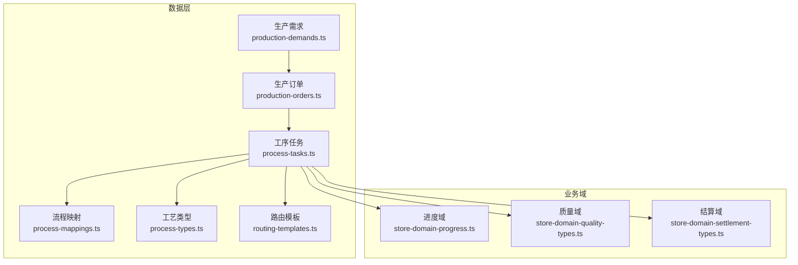

**图表来源**
- [production-demands.ts:1-528](file://src/data/fcs/production-demands.ts#L1-L528)
- [production-orders.ts:1-855](file://src/data/fcs/production-orders.ts#L1-L855)
- [process-tasks.ts:1-2033](file://src/data/fcs/process-tasks.ts#L1-L2033)
- [process-mappings.ts:1-157](file://src/data/fcs/process-mappings.ts#L1-L157)
- [process-types.ts:1-446](file://src/data/fcs/process-types.ts#L1-L446)
- [routing-templates.ts:1-422](file://src/data/fcs/routing-templates.ts#L1-L422)

**章节来源**
- [production-demands.ts:1-528](file://src/data/fcs/production-demands.ts#L1-L528)
- [production-orders.ts:1-855](file://src/data/fcs/production-orders.ts#L1-L855)

## 核心组件

### 工序任务(ProcessTask)

工序任务是生产流程中的最小执行单元，包含完整的任务生命周期信息：

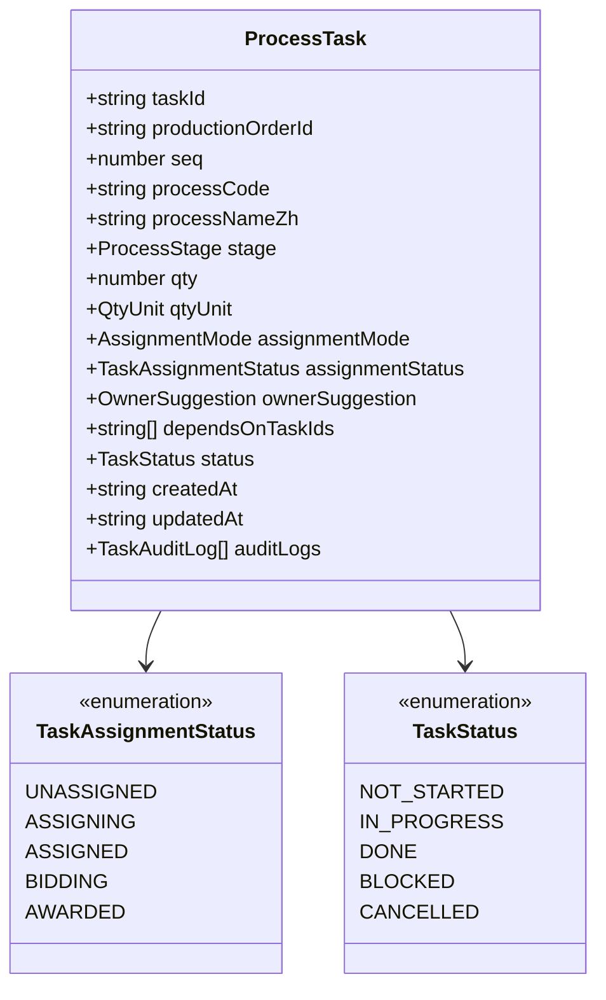

**图表来源**
- [process-tasks.ts:26-84](file://src/data/fcs/process-tasks.ts#L26-L84)

### 流程映射(ProcessMapping)

流程映射负责将旧系统的工艺名称映射到新的工艺代码：

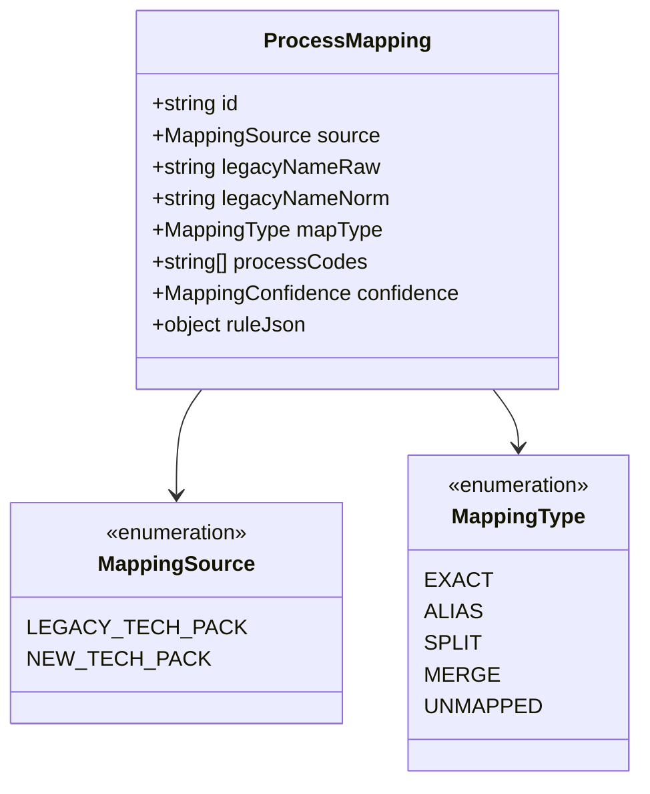

**图表来源**
- [process-mappings.ts:8-19](file://src/data/fcs/process-mappings.ts#L8-L19)

### 工艺类型(ProcessType)

工艺类型定义了标准的工艺字典和推荐配置：

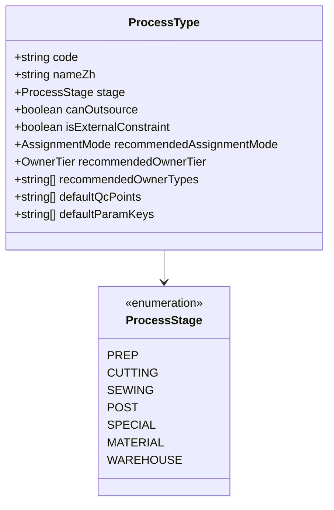

**图表来源**
- [process-types.ts:8-19](file://src/data/fcs/process-types.ts#L8-L19)

### 路由模板(RoutingTemplate)

路由模板定义了完整的生产流程路径和分配策略：

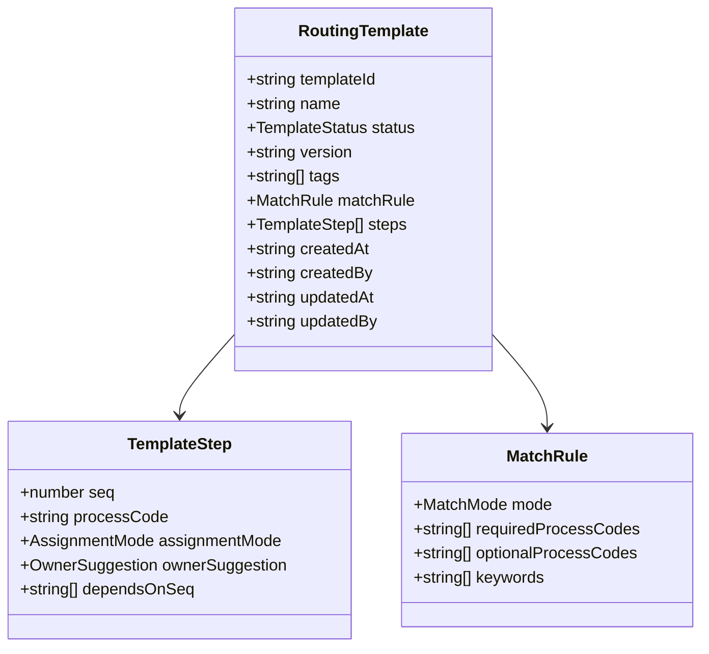

**图表来源**
- [routing-templates.ts:31-45](file://src/data/fcs/routing-templates.ts#L31-L45)

**章节来源**
- [process-tasks.ts:1-2033](file://src/data/fcs/process-tasks.ts#L1-L2033)
- [process-mappings.ts:1-157](file://src/data/fcs/process-mappings.ts#L1-L157)
- [process-types.ts:1-446](file://src/data/fcs/process-types.ts#L1-L446)
- [routing-templates.ts:1-422](file://src/data/fcs/routing-templates.ts#L1-L422)

## 架构概览

整个流程数据结构体系遵循"需求驱动-订单拆解-任务编排-模板匹配-执行监控"的完整闭环：

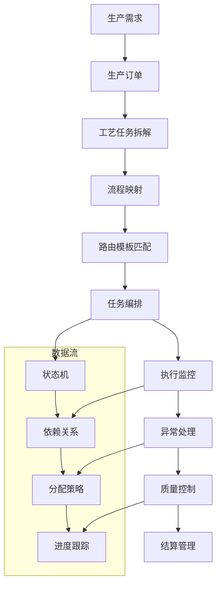

**图表来源**
- [production-demands.ts:16-38](file://src/data/fcs/production-demands.ts#L16-L38)
- [production-orders.ts:115-161](file://src/data/fcs/production-orders.ts#L115-L161)
- [process-tasks.ts:26-84](file://src/data/fcs/process-tasks.ts#L26-L84)
- [routing-templates.ts:386-421](file://src/data/fcs/routing-templates.ts#L386-L421)

## 详细组件分析

### 任务编排数据模型

任务编排是整个流程的核心，涉及复杂的依赖关系和状态管理：

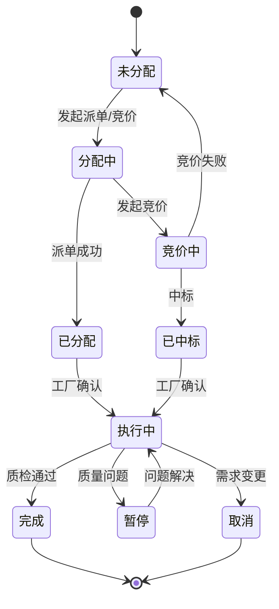

**图表来源**
- [process-tasks.ts:6-11](file://src/data/fcs/process-tasks.ts#L6-L11)
- [production-orders.ts:5-16](file://src/data/fcs/production-orders.ts#L5-L16)

#### 任务依赖关系

任务间的依赖关系通过 `dependsOnTaskIds` 和 `dependsOnSeq` 字段实现：

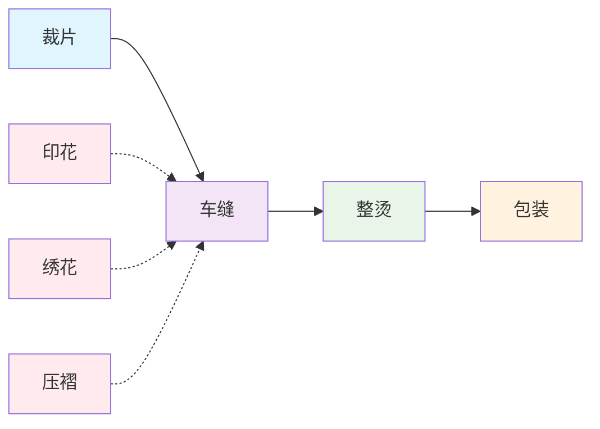

**图表来源**
- [routing-templates.ts:15-22](file://src/data/fcs/routing-templates.ts#L15-L22)

### 流程映射配置

流程映射提供了灵活的工艺名称标准化机制：

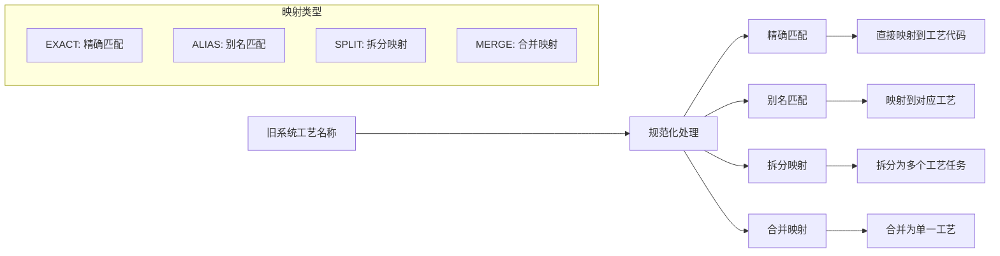

**图表来源**
- [process-mappings.ts:22-30](file://src/data/fcs/process-mappings.ts#L22-L30)
- [process-mappings.ts:33-127](file://src/data/fcs/process-mappings.ts#L33-L127)

### 路由模板设计

路由模板支持动态生成和智能匹配：

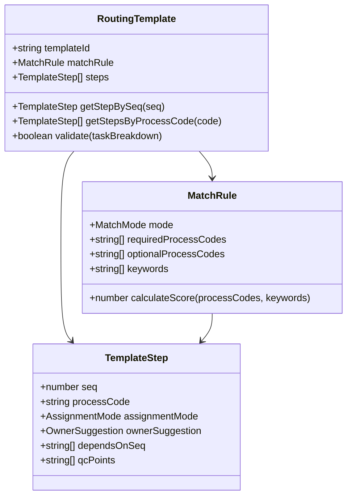

**图表来源**
- [routing-templates.ts:24-45](file://src/data/fcs/routing-templates.ts#L24-L45)
- [routing-templates.ts:386-421](file://src/data/fcs/routing-templates.ts#L386-L421)

### 调度过程算法

调度过程实现了智能的任务分配和资源优化：

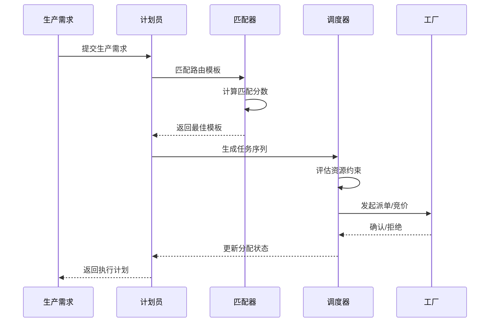

**图表来源**
- [routing-templates.ts:386-421](file://src/data/fcs/routing-templates.ts#L386-L421)
- [process-tasks.ts:35-38](file://src/data/fcs/process-tasks.ts#L35-L38)

**章节来源**
- [process-tasks.ts:1-2033](file://src/data/fcs/process-tasks.ts#L1-L2033)
- [process-mappings.ts:1-157](file://src/data/fcs/process-mappings.ts#L1-L157)
- [routing-templates.ts:1-422](file://src/data/fcs/routing-templates.ts#L1-L422)

## 依赖分析

### 组件耦合关系

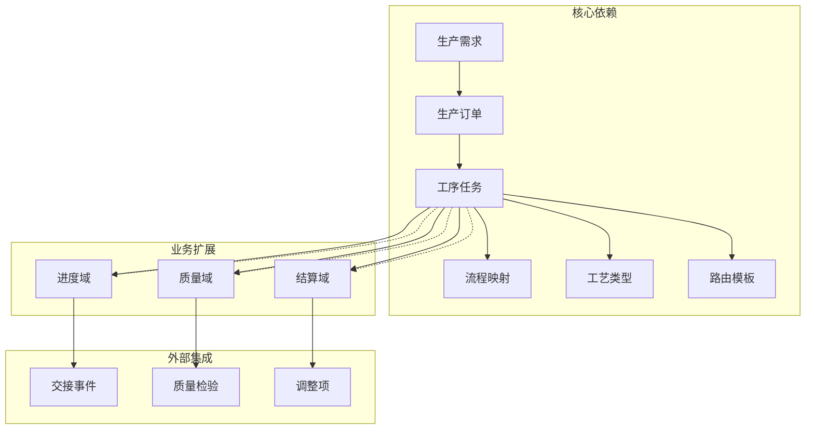

**图表来源**
- [production-demands.ts:16-38](file://src/data/fcs/production-demands.ts#L16-L38)
- [production-orders.ts:115-161](file://src/data/fcs/production-orders.ts#L115-L161)
- [process-tasks.ts:26-84](file://src/data/fcs/process-tasks.ts#L26-L84)

### 数据流向分析

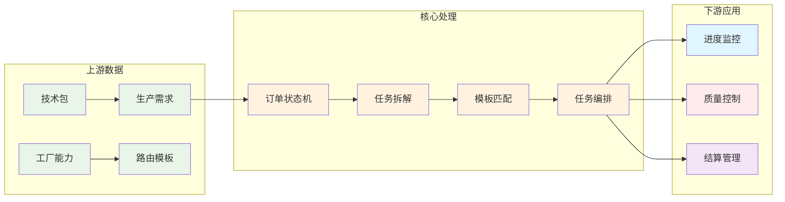

**图表来源**
- [production-orders.ts:1-855](file://src/data/fcs/production-orders.ts#L1-L855)
- [routing-templates.ts:1-422](file://src/data/fcs/routing-templates.ts#L1-L422)

**章节来源**
- [production-orders.ts:1-855](file://src/data/fcs/production-orders.ts#L1-L855)
- [routing-templates.ts:1-422](file://src/data/fcs/routing-templates.ts#L1-L422)

## 性能考虑

### 数据结构优化

1. **索引设计**：为常用查询字段建立索引，如 `taskId`、`productionOrderId`、`processCode`
2. **缓存策略**：对频繁访问的模板和映射进行内存缓存
3. **分页加载**：大量数据采用分页或懒加载策略
4. **增量更新**：支持局部数据更新而非全量刷新

### 查询性能

```typescript
// 优化的查询模式示例
const optimizedQueries = {
  // 使用索引字段进行查询
  findByOrderId: (orderId: string) => tasks.filter(t => t.productionOrderId === orderId),
  
  // 批量操作
  batchUpdate: (taskIds: string[], updates: Partial<ProcessTask>) => {
    tasks.forEach(task => {
      if (taskIds.includes(task.taskId)) {
        Object.assign(task, updates);
      }
    });
  },
  
  // 预计算依赖关系
  computeDependencies: () => {
    return tasks.reduce((deps, task) => {
      if (task.dependsOnTaskIds) {
        deps[task.taskId] = task.dependsOnTaskIds;
      }
      return deps;
    }, {} as Record<string, string[]>);
  }
};
```

### 内存管理

- 实现对象池模式减少垃圾回收压力
- 使用弱引用避免循环引用
- 定期清理历史数据和审计日志

## 故障排除指南

### 常见问题诊断

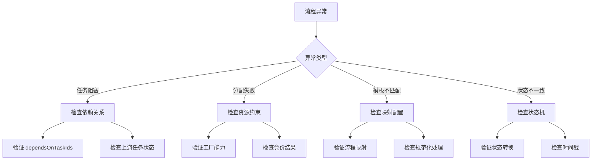

**图表来源**
- [store-domain-progress.ts:41-64](file://src/data/fcs/store-domain-progress.ts#L41-L64)
- [process-tasks.ts:67-84](file://src/data/fcs/process-tasks.ts#L67-L84)

### 调试工具

1. **状态监控面板**：实时显示各阶段任务数量和状态分布
2. **依赖关系图**：可视化展示任务间的依赖关系
3. **性能分析器**：监控关键操作的执行时间和资源消耗
4. **审计日志追踪**：完整记录每个任务的状态变更历史

**章节来源**
- [store-domain-progress.ts:1-1141](file://src/data/fcs/store-domain-progress.ts#L1-L1141)

## 结论

本流程数据结构体系通过标准化的工艺类型、灵活的路由模板和智能化的任务编排，构建了一个完整的生产流程管理体系。核心优势包括：

1. **高度模块化**：各组件职责明确，便于维护和扩展
2. **强类型安全**：完整的 TypeScript 类型定义确保数据一致性
3. **灵活配置**：支持动态模板和个性化定制
4. **完整监控**：从需求到结算的全流程跟踪

该体系为复杂的生产管理提供了坚实的数据基础，支持大规模生产和多工厂协同作业的需求。

## 附录

### 代码示例路径

#### 定义新的流程类型
[process-types.ts:32-430](file://src/data/fcs/process-types.ts#L32-L430)

#### 扩展现有流程
[routing-templates.ts:56-328](file://src/data/fcs/routing-templates.ts#L56-L328)

#### 创建自定义路由模板
[routing-templates.ts:386-421](file://src/data/fcs/routing-templates.ts#L386-L421)

#### 实现任务依赖关系
[process-tasks.ts:71-78](file://src/data/fcs/process-tasks.ts#L71-L78)

#### 配置流程映射
[process-mappings.ts:33-157](file://src/data/fcs/process-mappings.ts#L33-L157)

### 数据模型关系图

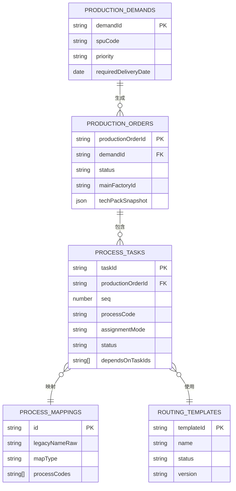

**图表来源**
- [production-demands.ts:16-38](file://src/data/fcs/production-demands.ts#L16-L38)
- [production-orders.ts:115-161](file://src/data/fcs/production-orders.ts#L115-L161)
- [process-tasks.ts:26-84](file://src/data/fcs/process-tasks.ts#L26-L84)
- [routing-templates.ts:31-45](file://src/data/fcs/routing-templates.ts#L31-L45)
- [process-mappings.ts:8-19](file://src/data/fcs/process-mappings.ts#L8-L19)