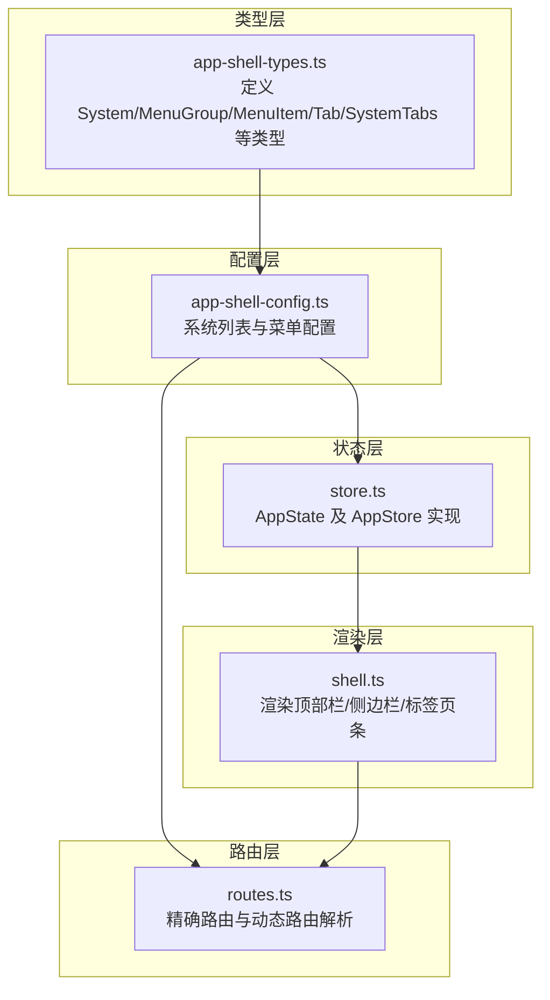
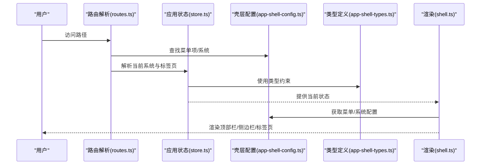
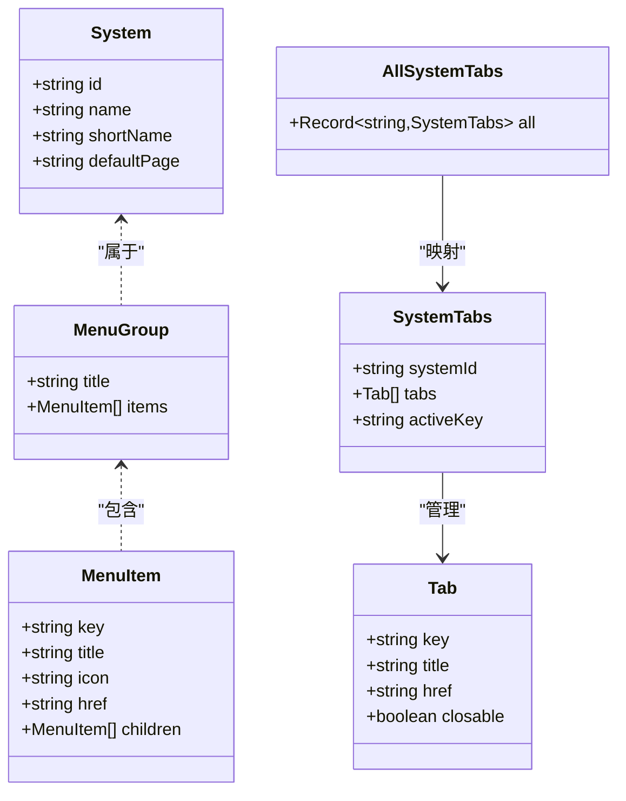
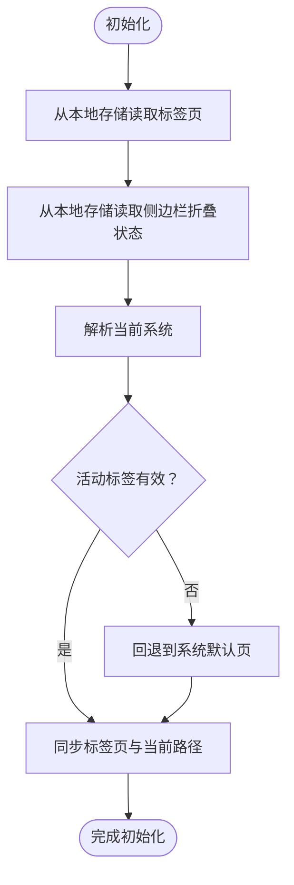
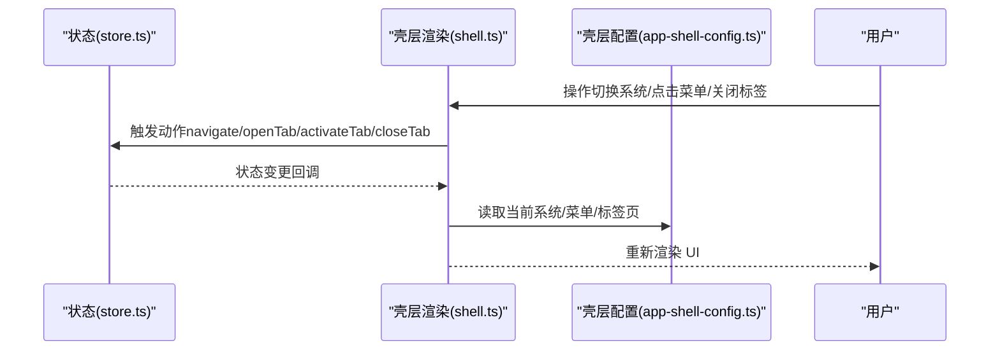
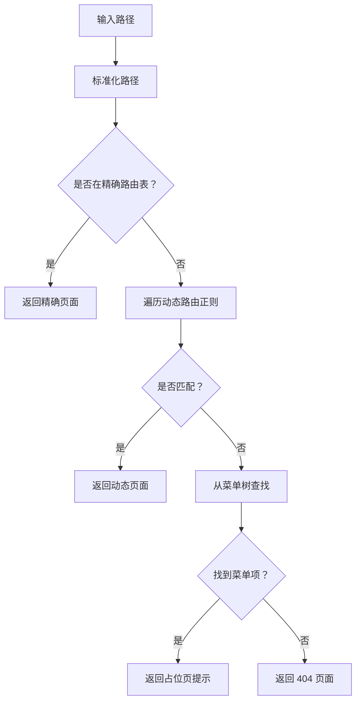

# 配置数据

<cite>
**本文引用的文件**
- [src/data/app-shell-config.ts](file://src/data/app-shell-config.ts)
- [src/data/app-shell-types.ts](file://src/data/app-shell-types.ts)
- [src/state/store.ts](file://src/state/store.ts)
- [src/components/shell.ts](file://src/components/shell.ts)
- [src/router/routes.ts](file://src/router/routes.ts)
- [src/utils.ts](file://src/utils.ts)
</cite>

## 目录
1. [引言](#引言)
2. [项目结构](#项目结构)
3. [核心组件](#核心组件)
4. [架构总览](#架构总览)
5. [详细组件分析](#详细组件分析)
6. [依赖分析](#依赖分析)
7. [性能考量](#性能考量)
8. [故障排查指南](#故障排查指南)
9. [结论](#结论)
10. [附录](#附录)

## 引言
本技术文档围绕“配置数据”主题，系统梳理应用壳层配置与系统配置在本仓库中的实现方式，重点覆盖以下方面：
- 数据结构与类型定义：系统、菜单、标签页等壳层配置的核心字段与层级关系
- 层次结构与继承关系：全局配置与局部配置的优先级与合并策略
- 动态加载与热更新机制：运行时配置变更的实时生效路径
- 验证规则与默认值处理：必填校验、类型约束与回退策略
- 版本管理与迁移策略：配置演进的向后兼容思路
- 调试工具与监控：定位配置问题的方法与建议
- 最佳实践与安全考虑：可维护性、稳定性与安全性

## 项目结构
本项目的配置数据主要集中在壳层配置与状态管理中，采用“类型定义 + 静态配置 + 运行时状态”的分层设计：
- 类型层：定义系统、菜单、标签页等壳层数据结构
- 配置层：提供系统列表与各系统菜单的静态配置
- 状态层：负责当前系统、菜单、标签页、侧边栏折叠状态等运行时状态
- 渲染层：基于状态渲染顶部栏、侧边栏、标签页条
- 路由层：将菜单项与页面渲染解耦，支持精确路由与占位页

**图表来源**
- [src/data/app-shell-types.ts:1-46](file://src/data/app-shell-types.ts#L1-L46)
- [src/data/app-shell-config.ts:1-355](file://src/data/app-shell-config.ts#L1-L355)
- [src/state/store.ts:1-329](file://src/state/store.ts#L1-L329)
- [src/components/shell.ts:1-324](file://src/components/shell.ts#L1-L324)
- [src/router/routes.ts:1-456](file://src/router/routes.ts#L1-L456)

**章节来源**
- [src/data/app-shell-types.ts:1-46](file://src/data/app-shell-types.ts#L1-L46)
- [src/data/app-shell-config.ts:1-355](file://src/data/app-shell-config.ts#L1-L355)
- [src/state/store.ts:1-329](file://src/state/store.ts#L1-L329)
- [src/components/shell.ts:1-324](file://src/components/shell.ts#L1-L324)
- [src/router/routes.ts:1-456](file://src/router/routes.ts#L1-L456)

## 核心组件
- 类型定义：提供系统、菜单、标签页等壳层配置的强类型约束，确保配置结构一致且可推断
- 静态配置：集中维护系统列表与各系统菜单树，便于统一管理与扩展
- 应用状态：封装当前路径、侧边栏状态、标签页集合、展开状态等，提供订阅与变更能力
- 渲染组件：根据状态渲染 UI，同时负责图标初始化与 HTML 转义
- 路由解析：将 URL 与菜单项、页面渲染解耦，支持精确路由与动态路由

**章节来源**
- [src/data/app-shell-types.ts:6-46](file://src/data/app-shell-types.ts#L6-L46)
- [src/data/app-shell-config.ts:8-355](file://src/data/app-shell-config.ts#L8-L355)
- [src/state/store.ts:4-128](file://src/state/store.ts#L4-L128)
- [src/components/shell.ts:25-324](file://src/components/shell.ts#L25-L324)
- [src/router/routes.ts:109-456](file://src/router/routes.ts#L109-L456)

## 架构总览
下图展示了从配置到渲染的关键流程：类型定义 → 静态配置 → 状态管理 → 渲染组件 → 路由解析。

**图表来源**
- [src/router/routes.ts:430-456](file://src/router/routes.ts#L430-L456)
- [src/state/store.ts:308-329](file://src/state/store.ts#L308-L329)
- [src/data/app-shell-config.ts:8-355](file://src/data/app-shell-config.ts#L8-L355)
- [src/data/app-shell-types.ts:6-46](file://src/data/app-shell-types.ts#L6-L46)
- [src/components/shell.ts:292-324](file://src/components/shell.ts#L292-L324)

## 详细组件分析

### 组件A：壳层配置与类型（系统、菜单、标签页）
- 系统配置：包含系统标识、名称、简称与默认页面，用于顶部栏切换与默认跳转
- 菜单配置：按系统分组，支持多级菜单，每个菜单项包含键、标题、图标、链接与子项
- 标签页配置：按系统维护标签页集合与活动键，支持打开、激活、关闭与持久化

**图表来源**
- [src/data/app-shell-types.ts:6-46](file://src/data/app-shell-types.ts#L6-L46)

**章节来源**
- [src/data/app-shell-types.ts:6-46](file://src/data/app-shell-types.ts#L6-L46)
- [src/data/app-shell-config.ts:8-355](file://src/data/app-shell-config.ts#L8-L355)

### 组件B：应用状态与标签页持久化（AppStore）
- 状态结构：包含当前路径、侧边栏开关与折叠状态、所有系统标签页、分组与菜单项展开状态
- 初始化：从本地存储恢复标签页与侧边栏折叠状态；若活动标签无效则回退到系统默认页
- 标签页管理：打开、激活、关闭标签页，自动同步当前路径；变更后持久化
- 导航与系统切换：支持系统间切换与默认页回退

**图表来源**
- [src/state/store.ts:101-117](file://src/state/store.ts#L101-L117)

**章节来源**
- [src/state/store.ts:4-128](file://src/state/store.ts#L4-L128)
- [src/state/store.ts:101-178](file://src/state/store.ts#L101-L178)
- [src/state/store.ts:179-304](file://src/state/store.ts#L179-L304)

### 组件C：渲染层（顶部栏、侧边栏、标签页条）
- 顶部栏：显示系统列表，支持切换系统；当前系统高亮
- 侧边栏：按系统渲染菜单分组与菜单项，支持展开/折叠、移动端抽屉
- 标签页条：按系统显示标签页，支持关闭、激活与高亮
- 安全渲染：对文本进行 HTML 转义，避免 XSS；图标通过 lucide 初始化

**图表来源**
- [src/components/shell.ts:292-324](file://src/components/shell.ts#L292-L324)
- [src/state/store.ts:172-269](file://src/state/store.ts#L172-L269)
- [src/data/app-shell-config.ts:8-355](file://src/data/app-shell-config.ts#L8-L355)

**章节来源**
- [src/components/shell.ts:25-324](file://src/components/shell.ts#L25-L324)
- [src/utils.ts:1-18](file://src/utils.ts#L1-L18)

### 组件D：路由解析与菜单联动
- 精确路由：直接映射到具体页面渲染函数
- 动态路由：正则匹配参数化路径，解析后调用对应渲染函数
- 菜单查找：未命中路由时尝试从菜单树中查找，若存在则返回占位页提示

**图表来源**
- [src/router/routes.ts:430-456](file://src/router/routes.ts#L430-L456)

**章节来源**
- [src/router/routes.ts:109-456](file://src/router/routes.ts#L109-L456)

## 依赖分析
- 类型依赖：配置层依赖类型层提供的接口定义
- 配置依赖：状态层依赖配置层提供的系统与菜单数据
- 渲染依赖：渲染层依赖状态层提供的当前系统、菜单与标签页
- 路由依赖：路由层依赖配置层提供的菜单数据以进行菜单-页面联动

**图表来源**
- [src/data/app-shell-types.ts:1-46](file://src/data/app-shell-types.ts#L1-L46)
- [src/data/app-shell-config.ts:1-355](file://src/data/app-shell-config.ts#L1-L355)
- [src/state/store.ts:1-329](file://src/state/store.ts#L1-L329)
- [src/components/shell.ts:1-324](file://src/components/shell.ts#L1-L324)
- [src/router/routes.ts:1-456](file://src/router/routes.ts#L1-L456)

**章节来源**
- [src/data/app-shell-types.ts:1-46](file://src/data/app-shell-types.ts#L1-L46)
- [src/data/app-shell-config.ts:1-355](file://src/data/app-shell-config.ts#L1-L355)
- [src/state/store.ts:1-329](file://src/state/store.ts#L1-L329)
- [src/components/shell.ts:1-324](file://src/components/shell.ts#L1-L324)
- [src/router/routes.ts:1-456](file://src/router/routes.ts#L1-L456)

## 性能考量
- 渲染性能：菜单树扁平化与状态缓存（展开状态、分组状态）减少重复计算
- 存储性能：标签页与侧边栏状态本地持久化，避免每次刷新重建
- 路由解析：精确路由优先，动态路由正则匹配作为兜底，降低匹配成本
- 图标性能：统一初始化 lucide 图标，避免重复扫描 DOM

[本节为通用指导，无需特定文件来源]

## 故障排查指南
- 菜单不显示或高亮异常
  - 检查当前路径是否与菜单项 href 匹配（标准化路径会去除锚点与查询参数）
  - 确认系统 ID 是否正确，否则会回退到默认系统
- 标签页无法关闭或激活异常
  - 确认标签页键值唯一且存在于当前系统标签页集合
  - 检查本地存储是否被清理或损坏
- 侧边栏折叠状态丢失
  - 检查本地存储键值是否被意外修改
- XSS 风险
  - 所有文本渲染前均进行 HTML 转义，确保安全

**章节来源**
- [src/state/store.ts:71-81](file://src/state/store.ts#L71-L81)
- [src/state/store.ts:101-117](file://src/state/store.ts#L101-L117)
- [src/state/store.ts:172-269](file://src/state/store.ts#L172-L269)
- [src/utils.ts:1-18](file://src/utils.ts#L1-L18)

## 结论
本项目通过“类型定义 + 静态配置 + 运行时状态 + 渲染 + 路由”的清晰分层，实现了壳层配置的可维护性与可扩展性。全局配置（系统、菜单）与局部配置（标签页、展开状态）通过状态层统一管理，并具备本地持久化与回退机制。建议在新增配置项时遵循现有类型与配置结构，确保一致性与可演进性。

[本节为总结，无需特定文件来源]

## 附录

### 如何添加新的系统配置
- 在系统列表中新增一项，包含标识、名称、简称与默认页面
- 在菜单配置中为该系统新增菜单分组与菜单项
- 若需要 PDA 或其他子系统，可在同一系统下继续细分

参考路径
- [src/data/app-shell-config.ts:8-18](file://src/data/app-shell-config.ts#L8-L18)
- [src/data/app-shell-config.ts:21-355](file://src/data/app-shell-config.ts#L21-L355)

**章节来源**
- [src/data/app-shell-config.ts:8-355](file://src/data/app-shell-config.ts#L8-L355)

### 如何添加新的菜单项
- 在目标系统对应的菜单分组中新增菜单项，填写键、标题、图标与链接
- 如需子菜单，在菜单项中添加 children 数组
- 确保 href 与路由精确/动态路由匹配，以便正确渲染页面

参考路径
- [src/data/app-shell-config.ts:21-355](file://src/data/app-shell-config.ts#L21-L355)
- [src/router/routes.ts:109-406](file://src/router/routes.ts#L109-L406)

**章节来源**
- [src/data/app-shell-config.ts:21-355](file://src/data/app-shell-config.ts#L21-L355)
- [src/router/routes.ts:109-406](file://src/router/routes.ts#L109-L406)

### 如何扩展标签页行为
- 使用打开/激活/关闭标签页的动作方法，自动同步当前路径并持久化
- 自定义标签页属性（如是否可关闭），影响 UI 行为

参考路径
- [src/state/store.ts:186-269](file://src/state/store.ts#L186-L269)

**章节来源**
- [src/state/store.ts:186-269](file://src/state/store.ts#L186-L269)

### 验证规则与默认值处理
- 必填检查：系统默认页缺失时回退到固定默认路径
- 类型验证：类型层严格约束字段类型与可选性
- 回退策略：当活动标签无效或本地存储损坏时，回退到系统默认页

参考路径
- [src/state/store.ts:107-114](file://src/state/store.ts#L107-L114)
- [src/data/app-shell-types.ts:6-46](file://src/data/app-shell-types.ts#L6-L46)

**章节来源**
- [src/state/store.ts:107-114](file://src/state/store.ts#L107-L114)
- [src/data/app-shell-types.ts:6-46](file://src/data/app-shell-types.ts#L6-L46)

### 动态加载与热更新机制
- 配置加载：系统启动时从本地存储恢复标签页与侧边栏状态
- 热更新：状态变更通过订阅者模式实时通知渲染层，UI 即时更新
- 路由联动：菜单项与页面渲染解耦，新增菜单项无需改动渲染逻辑

参考路径
- [src/state/store.ts:101-117](file://src/state/store.ts#L101-L117)
- [src/state/store.ts:130-139](file://src/state/store.ts#L130-L139)
- [src/router/routes.ts:430-456](file://src/router/routes.ts#L430-L456)

**章节来源**
- [src/state/store.ts:101-117](file://src/state/store.ts#L101-L117)
- [src/state/store.ts:130-139](file://src/state/store.ts#L130-L139)
- [src/router/routes.ts:430-456](file://src/router/routes.ts#L430-L456)

### 版本管理与迁移策略
- 向后兼容：新增系统或菜单项时，保持现有键值不变，避免破坏既有标签页与路由
- 渐进迁移：通过默认页回退与占位页提示，逐步替换旧页面
- 配置演进：在类型层增加可选字段，旧配置可省略，新功能按需启用

参考路径
- [src/data/app-shell-config.ts:8-355](file://src/data/app-shell-config.ts#L8-L355)
- [src/data/app-shell-types.ts:6-46](file://src/data/app-shell-types.ts#L6-L46)

**章节来源**
- [src/data/app-shell-config.ts:8-355](file://src/data/app-shell-config.ts#L8-L355)
- [src/data/app-shell-types.ts:6-46](file://src/data/app-shell-types.ts#L6-L46)

### 调试工具与监控
- 控制台日志：在状态变更处打印关键信息，辅助定位问题
- 本地存储检查：确认标签页与侧边栏状态键值是否存在且格式正确
- 路由调试：通过精确/动态路由表核对路径映射是否正确

参考路径
- [src/state/store.ts:50-56](file://src/state/store.ts#L50-L56)
- [src/router/routes.ts:109-406](file://src/router/routes.ts#L109-L406)

**章节来源**
- [src/state/store.ts:50-56](file://src/state/store.ts#L50-L56)
- [src/router/routes.ts:109-406](file://src/router/routes.ts#L109-L406)

### 最佳实践与安全考虑
- 最小暴露面：仅在壳层配置中暴露必要的系统与菜单信息
- 输入净化：所有用户可见文本均进行 HTML 转义
- 状态最小化：将可恢复的状态（标签页、侧边栏）持久化，减少初始化成本
- 健壮性：对本地存储异常进行捕获与降级处理

参考路径
- [src/utils.ts:1-18](file://src/utils.ts#L1-L18)
- [src/state/store.ts:50-56](file://src/state/store.ts#L50-L56)
- [src/state/store.ts:277-282](file://src/state/store.ts#L277-L282)

**章节来源**
- [src/utils.ts:1-18](file://src/utils.ts#L1-L18)
- [src/state/store.ts:50-56](file://src/state/store.ts#L50-L56)
- [src/state/store.ts:277-282](file://src/state/store.ts#L277-L282)