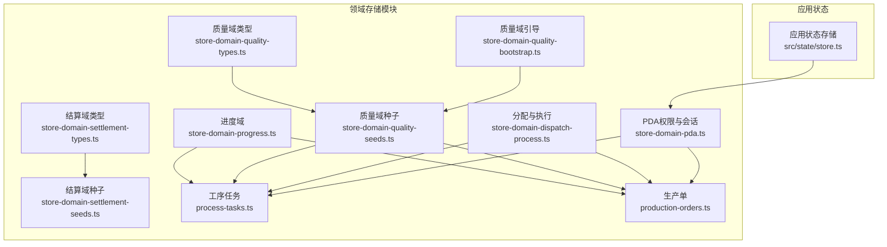
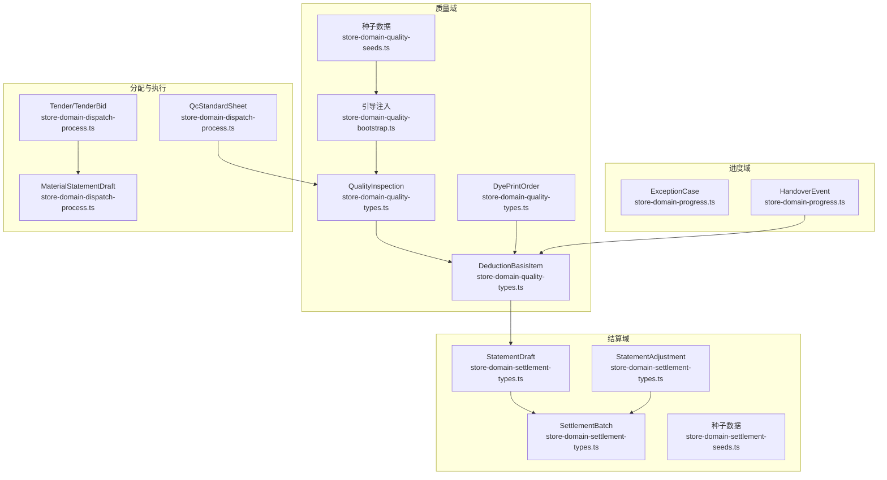
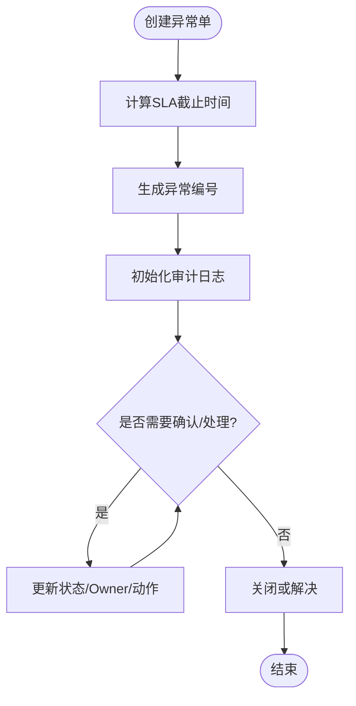
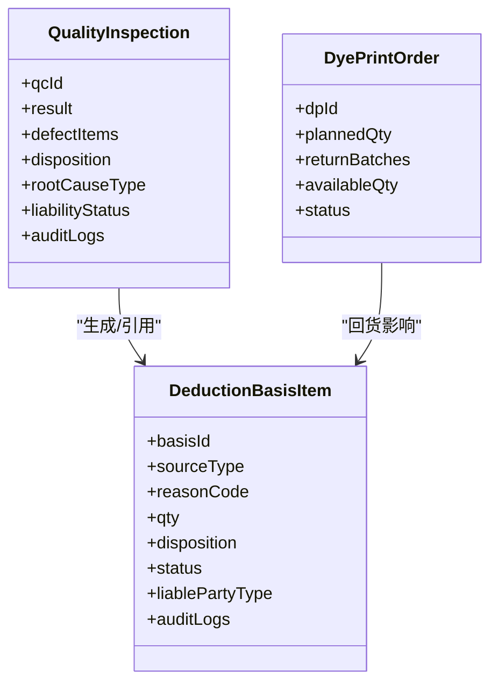
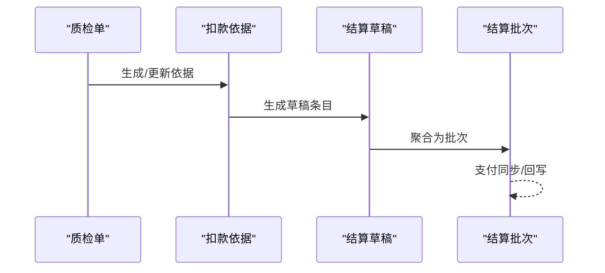
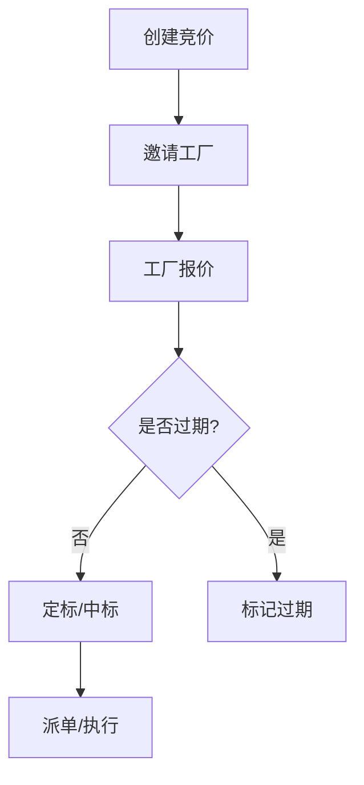
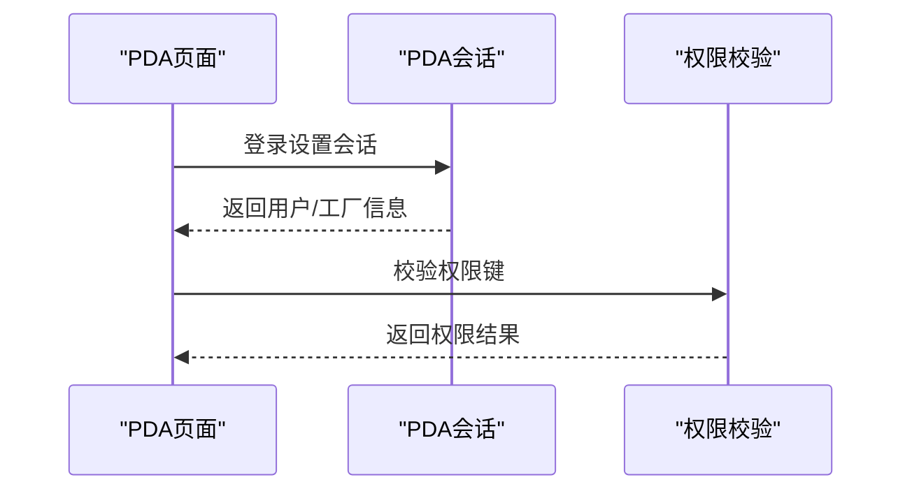
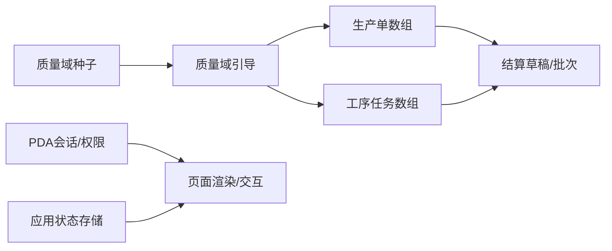

# 领域存储模块

<cite>
**本文档引用的文件**
- [store-domain-progress.ts](file://src/data/fcs/store-domain-progress.ts)
- [store-domain-quality-types.ts](file://src/data/fcs/store-domain-quality-types.ts)
- [store-domain-quality-seeds.ts](file://src/data/fcs/store-domain-quality-seeds.ts)
- [store-domain-quality-bootstrap.ts](file://src/data/fcs/store-domain-quality-bootstrap.ts)
- [store-domain-settlement-types.ts](file://src/data/fcs/store-domain-settlement-types.ts)
- [store-domain-settlement-seeds.ts](file://src/data/fcs/store-domain-settlement-seeds.ts)
- [store-domain-dispatch-process.ts](file://src/data/fcs/store-domain-dispatch-process.ts)
- [store-domain-pda.ts](file://src/data/fcs/store-domain-pda.ts)
- [process-tasks.ts](file://src/data/fcs/process-tasks.ts)
- [production-orders.ts](file://src/data/fcs/production-orders.ts)
- [store.ts](file://src/state/store.ts)
</cite>

## 目录
1. [引言](#引言)
2. [项目结构](#项目结构)
3. [核心组件](#核心组件)
4. [架构总览](#架构总览)
5. [详细组件分析](#详细组件分析)
6. [依赖关系分析](#依赖关系分析)
7. [性能考虑](#性能考虑)
8. [故障排除指南](#故障排除指南)
9. [结论](#结论)
10. [附录](#附录)

## 引言
本技术文档聚焦于领域存储模块的设计与实现，覆盖进度跟踪、质量管理和结算处理三大核心业务域。文档从数据结构、状态管理、业务逻辑、模块协作与数据共享策略等方面进行深入剖析，并提供扩展新存储模块的方法、初始化与依赖注入机制、数据持久化与缓存策略、单元与集成测试方法、性能优化建议与监控指标，帮助开发者高效理解与维护该存储层。

## 项目结构
领域存储模块位于 src/data/fcs 目录下，按业务域划分文件，采用“类型定义 + 种子数据 + Bootstrap 初始化”的组织方式：
- 进度域：store-domain-progress.ts 定义异常与交接事件类型与种子数据
- 质量域：store-domain-quality-types.ts 类型定义；store-domain-quality-seeds.ts 种子数据；store-domain-quality-bootstrap.ts 提供初始化引导
- 结算域：store-domain-settlement-types.ts 类型定义；store-domain-settlement-seeds.ts 种子数据
- 分配与执行：store-domain-dispatch-process.ts 类型与种子；process-tasks.ts 工序任务集合；production-orders.ts 生产单集合
- PDA 权限与会话：store-domain-pda.ts 权限与会话管理
- 应用状态：src/state/store.ts 提供应用级状态持久化与导航

图表来源
- [store-domain-progress.ts:1-1141](file://src/data/fcs/store-domain-progress.ts#L1-L1141)
- [store-domain-quality-types.ts:1-304](file://src/data/fcs/store-domain-quality-types.ts#L1-L304)
- [store-domain-quality-seeds.ts:1-269](file://src/data/fcs/store-domain-quality-seeds.ts#L1-L269)
- [store-domain-quality-bootstrap.ts:1-37](file://src/data/fcs/store-domain-quality-bootstrap.ts#L1-L37)
- [store-domain-settlement-types.ts:1-103](file://src/data/fcs/store-domain-settlement-types.ts#L1-L103)
- [store-domain-settlement-seeds.ts:1-57](file://src/data/fcs/store-domain-settlement-seeds.ts#L1-L57)
- [store-domain-dispatch-process.ts:1-245](file://src/data/fcs/store-domain-dispatch-process.ts#L1-L245)
- [process-tasks.ts:1-2033](file://src/data/fcs/process-tasks.ts#L1-L2033)
- [production-orders.ts:1-855](file://src/data/fcs/production-orders.ts#L1-L855)
- [store.ts:1-329](file://src/state/store.ts#L1-L329)

章节来源
- [store-domain-progress.ts:1-1141](file://src/data/fcs/store-domain-progress.ts#L1-L1141)
- [store-domain-quality-types.ts:1-304](file://src/data/fcs/store-domain-quality-types.ts#L1-L304)
- [store-domain-quality-seeds.ts:1-269](file://src/data/fcs/store-domain-quality-seeds.ts#L1-L269)
- [store-domain-quality-bootstrap.ts:1-37](file://src/data/fcs/store-domain-quality-bootstrap.ts#L1-L37)
- [store-domain-settlement-types.ts:1-103](file://src/data/fcs/store-domain-settlement-types.ts#L1-L103)
- [store-domain-settlement-seeds.ts:1-57](file://src/data/fcs/store-domain-settlement-seeds.ts#L1-L57)
- [store-domain-dispatch-process.ts:1-245](file://src/data/fcs/store-domain-dispatch-process.ts#L1-L245)
- [process-tasks.ts:1-2033](file://src/data/fcs/process-tasks.ts#L1-L2033)
- [production-orders.ts:1-855](file://src/data/fcs/production-orders.ts#L1-L855)
- [store.ts:1-329](file://src/state/store.ts#L1-L329)

## 核心组件
- 进度域组件
  - 异常单（ExceptionCase）：包含状态、严重级别、类别、原因码、来源、Owner、SLA 截止时间计算、审计日志与动作记录
  - 交接事件（HandoverEvent）：包含事件类型、双方主体、数量差异、差异原因、证据与审计日志
- 质量域组件
  - 质检单（QualityInspection）：结果、缺陷项、处置（返工/重做/让步接收/报废）、责任归属、仲裁与关闭状态
  - 扣款依据（DeductionBasisItem）：来源类型（质量/交接）、原因码、数量、处置、摘要、证据、责任方与仲裁状态
  - 染印加工单（DyePrintOrder）：计划数量、回货批次、可用数量、状态与结算关系推导
- 结算域组件
  - 结算批次（SettlementBatch）：批次状态、明细项、支付同步状态与回写
  - 结算草稿（StatementDraft）：条目清单、数量与金额汇总、状态
  - 调整项（StatementAdjustment）：补扣/补偿/冲销类型、状态
  - 生产变更（ProductionOrderChange）：数量/日期/工厂/款式变更与状态
- 分配与执行组件
  - 竞价（Tender/TenderBid）：邀请工厂、报价、规则、状态与审计日志
  - 领料对账单（MaterialStatementDraft）：请求/发放数量、状态
  - 质检标准单（QcStandardSheet）：验收标准、采样方案与状态
- PDA 权限与会话
  - 权限键与角色模板、工厂用户与 PDA 用户主数据、会话持久化（localStorage）

章节来源
- [store-domain-progress.ts:1-1141](file://src/data/fcs/store-domain-progress.ts#L1-L1141)
- [store-domain-quality-types.ts:1-304](file://src/data/fcs/store-domain-quality-types.ts#L1-L304)
- [store-domain-settlement-types.ts:1-103](file://src/data/fcs/store-domain-settlement-types.ts#L1-L103)
- [store-domain-dispatch-process.ts:1-245](file://src/data/fcs/store-domain-dispatch-process.ts#L1-L245)
- [store-domain-pda.ts:1-277](file://src/data/fcs/store-domain-pda.ts#L1-L277)

## 架构总览
领域存储模块采用“纯数据 + 种子 + 引导”的架构，避免与 UI 层耦合，便于在不同运行环境（SSR/CSR）稳定工作。模块间通过共享的数组与类型进行协作，质量域通过 Bootstrap 将种子注入到共享数组，进度与质量数据在交接事件中产生关联，结算域以质量/交接依据为输入生成草稿与批次。

图表来源
- [store-domain-quality-types.ts:1-304](file://src/data/fcs/store-domain-quality-types.ts#L1-L304)
- [store-domain-quality-seeds.ts:1-269](file://src/data/fcs/store-domain-quality-seeds.ts#L1-L269)
- [store-domain-quality-bootstrap.ts:1-37](file://src/data/fcs/store-domain-quality-bootstrap.ts#L1-L37)
- [store-domain-progress.ts:1-1141](file://src/data/fcs/store-domain-progress.ts#L1-L1141)
- [store-domain-settlement-types.ts:1-103](file://src/data/fcs/store-domain-settlement-types.ts#L1-L103)
- [store-domain-settlement-seeds.ts:1-57](file://src/data/fcs/store-domain-settlement-seeds.ts#L1-L57)
- [store-domain-dispatch-process.ts:1-245](file://src/data/fcs/store-domain-dispatch-process.ts#L1-L245)

## 详细组件分析

### 进度域：异常与交接
- 数据结构
  - 异常单：状态机（OPEN/IN_PROGRESS/WAITING_EXTERNAL/RESOLVED/CLOSED）、严重级别（S1/S2/S3）、类别与原因码、来源类型与ID、Owner、SLA 截止时间、动作与审计日志
  - 交接事件：事件类型（裁片/成衣/辅料）、双方主体、期望/实际/差异数量、差异原因、状态（待确认/已确认/争议/作废）、证据与审计日志
- 业务逻辑
  - SLA 截止时间基于创建时间与时长配置计算
  - 交接事件支持差异类型（短缺/超发/破损/混批/未知），并可标记争议
- 关联处理
  - 质量域的缺陷与处置可触发进度域异常单生成与流转
  - 交接差异可作为质量域扣款依据的来源之一

图表来源
- [store-domain-progress.ts:67-81](file://src/data/fcs/store-domain-progress.ts#L67-L81)
- [store-domain-progress.ts:92-597](file://src/data/fcs/store-domain-progress.ts#L92-L597)

章节来源
- [store-domain-progress.ts:1-1141](file://src/data/fcs/store-domain-progress.ts#L1-L1141)

### 质量域：质检、扣款与染印加工
- 数据结构
  - 质检单：结果（通过/不通过）、缺陷项、处置（返工/重做/让步接收/报废/接受）、根因类型、责任方、仲裁与关闭状态
  - 扣款依据：来源类型（质量/让步/交接）、原因码、数量、处置、摘要、证据、责任方与仲裁状态
  - 染印加工单：计划数量、回货批次（通过/不通过）、可用数量、状态与结算关系推导
- 业务逻辑
  - 默认责任归属根据根因类型推导（工厂/供应商/加工商/其他）
  - 结算关系根据加工方与结算方关系推导（内部/外部/特殊）
  - 失败质检可生成返工任务并暂不能继续上游任务
- 关联处理
  - 质检单与交接事件均可成为扣款依据来源
  - 扣款依据驱动结算草稿与批次生成

图表来源
- [store-domain-quality-types.ts:142-203](file://src/data/fcs/store-domain-quality-types.ts#L142-L203)
- [store-domain-quality-types.ts:259-303](file://src/data/fcs/store-domain-quality-types.ts#L259-L303)
- [store-domain-quality-types.ts:95-118](file://src/data/fcs/store-domain-quality-types.ts#L95-L118)

章节来源
- [store-domain-quality-types.ts:1-304](file://src/data/fcs/store-domain-quality-types.ts#L1-L304)

### 结算域：草稿、批次与调整
- 数据结构
  - 结算草稿：条目清单（依据ID、扣减数量/金额）、数量与金额汇总、状态
  - 结算批次：批次状态、明细项（结算方、金额）、支付同步状态与回写
  - 调整项：类型（补扣/补偿/冲销）、状态、备注与关联依据
  - 生产变更：数量/日期/工厂/款式变更与状态
- 业务逻辑
  - 批次聚合多个草稿，支持支付同步状态追踪
  - 调整项用于对草稿进行补充或冲销
- 关联处理
  - 质量/交接依据作为草稿条目来源
  - 草稿经确认后进入批次处理

图表来源
- [store-domain-quality-types.ts:259-303](file://src/data/fcs/store-domain-quality-types.ts#L259-L303)
- [store-domain-settlement-types.ts:86-102](file://src/data/fcs/store-domain-settlement-types.ts#L86-L102)
- [store-domain-settlement-types.ts:52-72](file://src/data/fcs/store-domain-settlement-types.ts#L52-L72)

章节来源
- [store-domain-settlement-types.ts:1-103](file://src/data/fcs/store-domain-settlement-types.ts#L1-L103)

### 分配与执行：竞价、领料与质检标准
- 数据结构
  - 竞价：任务集合、邀请工厂、报价、规则、状态与审计日志
  - 领料对账单：请求/发放数量、状态
  - 质检标准单：验收标准、采样方案与状态
- 业务逻辑
  - 竞价支持最低价/综合评分规则，状态随截止与中标变化
  - 领料对账单支持草稿/已发放等状态
  - 质检标准单支持发布版本与采样策略

图表来源
- [store-domain-dispatch-process.ts:108-123](file://src/data/fcs/store-domain-dispatch-process.ts#L108-L123)
- [store-domain-dispatch-process.ts:134-215](file://src/data/fcs/store-domain-dispatch-process.ts#L134-L215)

章节来源
- [store-domain-dispatch-process.ts:1-245](file://src/data/fcs/store-domain-dispatch-process.ts#L1-L245)

### PDA 权限与会话
- 数据结构
  - 权限键与角色模板、工厂用户与 PDA 用户主数据
  - 会话持久化（localStorage）：用户ID与工厂ID
- 业务逻辑
  - 通过会话判断用户角色与权限
  - 生成默认工厂用户与角色模板

图表来源
- [store-domain-pda.ts:48-67](file://src/data/fcs/store-domain-pda.ts#L48-L67)
- [store-domain-pda.ts:116-147](file://src/data/fcs/store-domain-pda.ts#L116-L147)
- [store-domain-pda.ts:181-189](file://src/data/fcs/store-domain-pda.ts#L181-L189)

章节来源
- [store-domain-pda.ts:1-277](file://src/data/fcs/store-domain-pda.ts#L1-L277)

## 依赖关系分析
- 质量域与进度域的耦合
  - 质检单与交接事件共同构成扣款依据来源，推动结算草稿生成
- 质量域与分配执行的耦合
  - 质检标准单与领料对账单支撑生产执行的质量与物料准备
- 共享数组与引导注入
  - 质量域种子通过引导注入共享数组，保证模块初始化一致性
- 应用状态与 PDA 的集成
  - 应用状态存储负责导航与标签页持久化，PDA 会话与权限影响页面渲染与交互

图表来源
- [store-domain-quality-bootstrap.ts:13-37](file://src/data/fcs/store-domain-quality-bootstrap.ts#L13-L37)
- [store-domain-quality-seeds.ts:82-187](file://src/data/fcs/store-domain-quality-seeds.ts#L82-L187)
- [process-tasks.ts:87-800](file://src/data/fcs/process-tasks.ts#L87-L800)
- [production-orders.ts:179-855](file://src/data/fcs/production-orders.ts#L179-L855)
- [store-domain-pda.ts:48-67](file://src/data/fcs/store-domain-pda.ts#L48-L67)
- [store.ts:1-329](file://src/state/store.ts#L1-L329)

章节来源
- [store-domain-quality-bootstrap.ts:1-37](file://src/data/fcs/store-domain-quality-bootstrap.ts#L1-L37)
- [store-domain-quality-seeds.ts:1-269](file://src/data/fcs/store-domain-quality-seeds.ts#L1-L269)
- [process-tasks.ts:1-2033](file://src/data/fcs/process-tasks.ts#L1-L2033)
- [production-orders.ts:1-855](file://src/data/fcs/production-orders.ts#L1-L855)
- [store-domain-pda.ts:1-277](file://src/data/fcs/store-domain-pda.ts#L1-L277)
- [store.ts:1-329](file://src/state/store.ts#L1-L329)

## 性能考虑
- 数据规模与查询
  - 共享数组（如工序任务、生产单、质量/结算种子）在内存中集中管理，适合小中规模数据；大规模场景建议分页加载与懒初始化
- 初始化与引导
  - 质量域引导仅在首次注入时检查并插入，避免重复注入带来的性能损耗
- 会话与存储
  - PDA 会话与应用状态存储使用 localStorage，注意序列化/反序列化的开销与异常处理
- 状态订阅与渲染
  - 应用状态采用订阅模式，避免不必要的重渲染；建议在页面层按需订阅

## 故障排除指南
- 异常单状态异常
  - 检查 SLA 截止时间计算与创建时间格式一致性
  - 核对动作与审计日志是否正确更新
- 质检单责任归属
  - 确认根因类型与默认责任归属函数调用是否正确
  - 核对仲裁与关闭状态的流转逻辑
- 结算草稿与批次
  - 检查扣款依据的状态与数量是否正确映射到草稿条目
  - 核对批次支付同步状态与回写字段
- PDA 会话
  - 确保会话键存在且 JSON 可解析
  - 在 SSR 环境下避免直接访问 window 对象

章节来源
- [store-domain-progress.ts:67-81](file://src/data/fcs/store-domain-progress.ts#L67-L81)
- [store-domain-quality-types.ts:123-137](file://src/data/fcs/store-domain-quality-types.ts#L123-L137)
- [store-domain-settlement-types.ts:52-72](file://src/data/fcs/store-domain-settlement-types.ts#L52-L72)
- [store-domain-pda.ts:48-67](file://src/data/fcs/store-domain-pda.ts#L48-L67)

## 结论
领域存储模块通过清晰的类型定义、稳定的种子数据与引导注入机制，实现了进度、质量与结算三大业务域的协同。模块间通过共享数组与类型建立松耦合关系，既保证了数据一致性，又便于扩展与维护。结合会话与应用状态存储，模块在不同运行环境下具备良好的稳定性与可移植性。

## 附录

### 扩展新存储模块的方法
- 定义类型与种子
  - 在对应目录新增类型定义文件与种子数据文件
  - 示例路径参考：[store-domain-quality-types.ts:1-304](file://src/data/fcs/store-domain-quality-types.ts#L1-L304)、[store-domain-quality-seeds.ts:1-269](file://src/data/fcs/store-domain-quality-seeds.ts#L1-L269)
- 引导注入
  - 在引导文件中添加注入逻辑，确保仅在不存在时插入
  - 示例路径参考：[store-domain-quality-bootstrap.ts:13-37](file://src/data/fcs/store-domain-quality-bootstrap.ts#L13-L37)
- 与现有模块协作
  - 通过共享数组或类型接口与进度/质量/结算模块协作
  - 示例路径参考：[process-tasks.ts:87-800](file://src/data/fcs/process-tasks.ts#L87-L800)、[production-orders.ts:179-855](file://src/data/fcs/production-orders.ts#L179-L855)

章节来源
- [store-domain-quality-types.ts:1-304](file://src/data/fcs/store-domain-quality-types.ts#L1-L304)
- [store-domain-quality-seeds.ts:1-269](file://src/data/fcs/store-domain-quality-seeds.ts#L1-L269)
- [store-domain-quality-bootstrap.ts:1-37](file://src/data/fcs/store-domain-quality-bootstrap.ts#L1-L37)
- [process-tasks.ts:1-2033](file://src/data/fcs/process-tasks.ts#L1-L2033)
- [production-orders.ts:1-855](file://src/data/fcs/production-orders.ts#L1-L855)

### 初始化流程与依赖注入机制
- 质量域引导注入流程
  - 检查共享数组中是否存在种子项，不存在则插入
  - 适用于工序任务、生产单与质量/结算种子
- 应用状态初始化
  - 从本地存储恢复标签页与侧边栏状态
  - 示例路径参考：[store.ts:101-117](file://src/state/store.ts#L101-L117)

章节来源
- [store-domain-quality-bootstrap.ts:13-37](file://src/data/fcs/store-domain-quality-bootstrap.ts#L13-L37)
- [store.ts:101-117](file://src/state/store.ts#L101-L117)

### 数据持久化策略与缓存机制
- 本地存储
  - PDA 会话：localStorage 存储用户与工厂ID
  - 应用状态：localStorage 存储标签页与侧边栏折叠状态
- 会话存储
  - 仅在浏览器端可用，SSR 环境需做保护
- 缓存策略
  - 共享数组作为内存缓存，避免重复查询
  - 种子数据在模块初始化阶段注入，减少运行时计算

章节来源
- [store-domain-pda.ts:48-67](file://src/data/fcs/store-domain-pda.ts#L48-L67)
- [store.ts:15-56](file://src/state/store.ts#L15-L56)

### 单元与集成测试方法
- 单元测试
  - 质检单责任归属函数：验证根因类型与默认责任方映射
  - 结算关系推导函数：验证加工方与结算方关系推导
  - SLA 截止时间计算：验证时间加法与格式化输出
- 集成测试
  - 质检单 → 扣款依据 → 结算草稿/批次 的端到端流程
  - 竞价 → 派单/中标 → 生产执行 的流程联动
- 断言建议
  - 使用断言检查状态机转换、数量与金额汇总、审计日志完整性

章节来源
- [store-domain-quality-types.ts:72-81](file://src/data/fcs/store-domain-quality-types.ts#L72-L81)
- [store-domain-quality-types.ts:123-137](file://src/data/fcs/store-domain-quality-types.ts#L123-L137)
- [store-domain-progress.ts:67-74](file://src/data/fcs/store-domain-progress.ts#L67-L74)
- [store-domain-dispatch-process.ts:134-215](file://src/data/fcs/store-domain-dispatch-process.ts#L134-L215)

### 性能优化建议与监控指标
- 性能优化
  - 分页加载与懒初始化：对大规模共享数组进行分页与按需加载
  - 避免重复注入：引导注入仅在不存在时插入
  - 本地存储异常处理：捕获序列化/反序列化异常，降级处理
- 监控指标
  - 初始化耗时：引导注入与应用状态恢复耗时
  - 内存占用：共享数组大小与对象数量
  - 存储命中率：本地存储读取/写入次数与异常率
  - 流程成功率：质检单到结算草稿/批次的成功率与失败原因统计