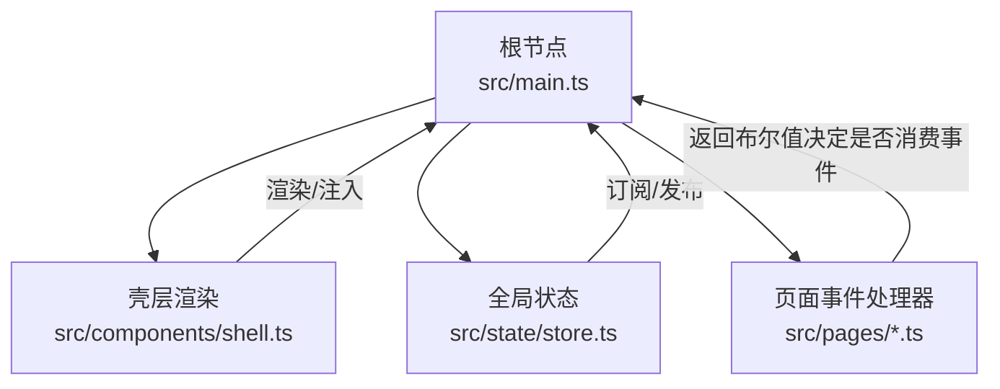
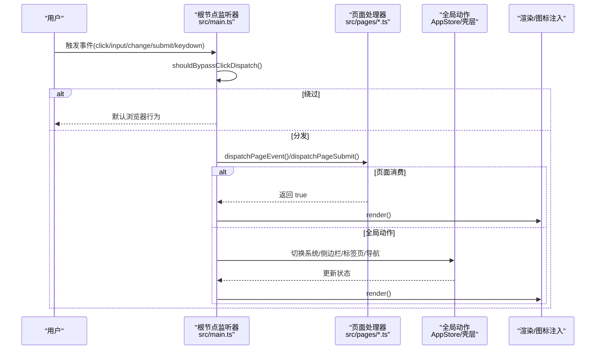
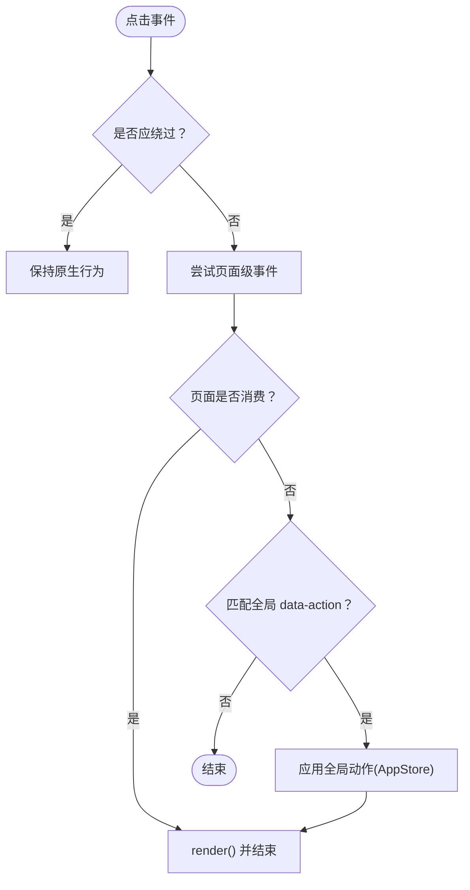
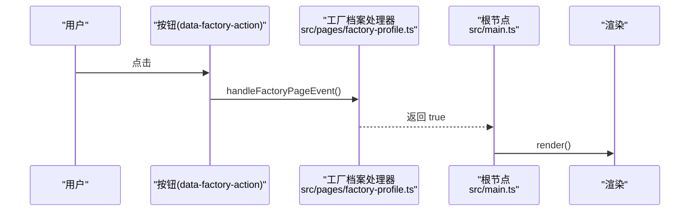
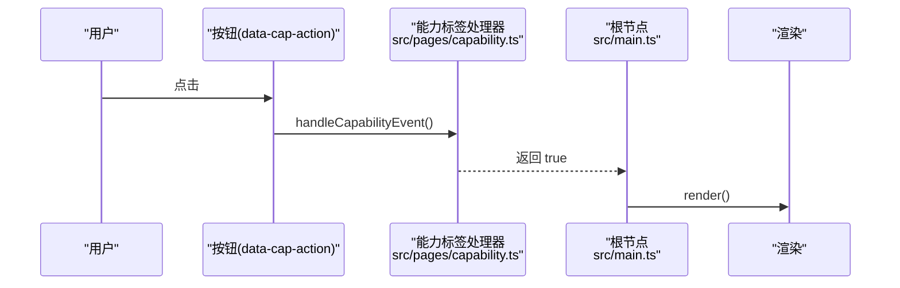
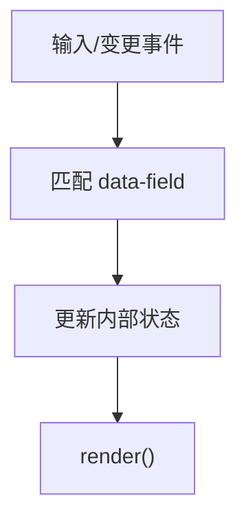
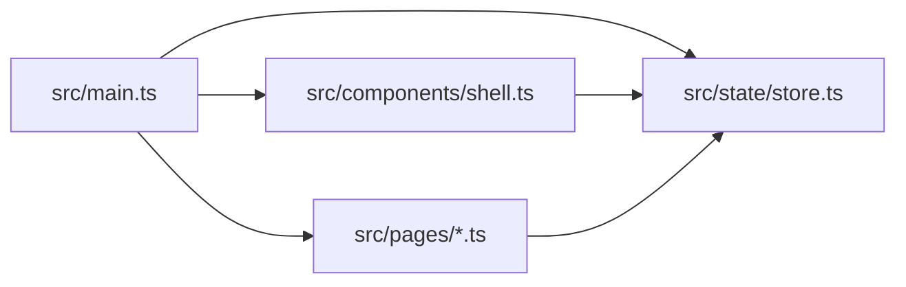

# 事件驱动机制

<cite>
**本文引用的文件**
- [src/main.ts](file://src/main.ts)
- [src/components/shell.ts](file://src/components/shell.ts)
- [src/state/store.ts](file://src/state/store.ts)
- [src/pages/factory-profile.ts](file://src/pages/factory-profile.ts)
- [src/pages/capability.ts](file://src/pages/capability.ts)
- [src/pages/pcs-sample-ledger.ts](file://src/pages/pcs-sample-ledger.ts)
- [src/data/app-shell-config.ts](file://src/data/app-shell-config.ts)
</cite>

## 目录
1. [简介](#简介)
2. [项目结构](#项目结构)
3. [核心组件](#核心组件)
4. [架构总览](#架构总览)
5. [详细组件分析](#详细组件分析)
6. [依赖关系分析](#依赖关系分析)
7. [性能考量](#性能考量)
8. [故障排查指南](#故障排查指南)
9. [结论](#结论)

## 简介
本文件系统性阐述 higoods 基于 dataset 的事件驱动机制，重点覆盖以下方面：
- 如何通过 data-* 属性在 DOM 上声明事件信息与参数
- 事件委托模式：根节点如何监听并分发到各页面处理器
- 页面级事件处理器与全局事件处理器的协作
- 不同类型事件（点击、输入、变更、表单提交、键盘）的处理流程
- 事件冒泡与阻止传播的控制策略
- 复杂事件处理场景的流程图与代码路径指引

## 项目结构
higoods 采用“壳层渲染 + 页面模块化 + 全局状态”的组织方式：
- 根节点监听器集中于入口文件，负责事件委托与全局行为
- 壳层组件负责系统切换、侧边栏、标签页等全局 UI 行为
- 页面模块各自维护自身状态与事件处理器，按需响应 dataset 声明的事件

图表来源
- [src/main.ts:335-502](file://src/main.ts#L335-L502)
- [src/components/shell.ts:292-311](file://src/components/shell.ts#L292-L311)
- [src/state/store.ts:89-200](file://src/state/store.ts#L89-L200)

章节来源
- [src/main.ts:335-502](file://src/main.ts#L335-L502)
- [src/components/shell.ts:292-311](file://src/components/shell.ts#L292-L311)
- [src/state/store.ts:89-200](file://src/state/store.ts#L89-L200)

## 核心组件
- 根节点事件监听器：统一捕获 click/input/change/submit/keydown，执行事件分发与渲染
- 页面事件处理器：按页面职责实现 handleXxxEvent/handleXxxSubmit/isXxxDialogOpen 等
- 壳层组件：通过 data-action 渲染系统切换、菜单展开/折叠、标签页开关等
- 全局状态：AppStore 提供导航、侧边栏、标签页等跨页面状态

章节来源
- [src/main.ts:247-324](file://src/main.ts#L247-L324)
- [src/main.ts:382-470](file://src/main.ts#L382-L470)
- [src/main.ts:471-502](file://src/main.ts#L471-L502)
- [src/main.ts:504-800](file://src/main.ts#L504-L800)
- [src/components/shell.ts:292-311](file://src/components/shell.ts#L292-L311)
- [src/state/store.ts:89-200](file://src/state/store.ts#L89-L200)

## 架构总览
事件从根节点进入，经过“是否应绕过”判断、页面级事件分发、全局动作处理、最终触发渲染与状态更新。

图表来源
- [src/main.ts:357-380](file://src/main.ts#L357-L380)
- [src/main.ts:247-324](file://src/main.ts#L247-L324)
- [src/main.ts:382-470](file://src/main.ts#L382-L470)
- [src/main.ts:471-502](file://src/main.ts#L471-L502)
- [src/main.ts:504-800](file://src/main.ts#L504-L800)
- [src/components/shell.ts:292-311](file://src/components/shell.ts#L292-L311)
- [src/state/store.ts:172-200](file://src/state/store.ts#L172-L200)

## 详细组件分析

### 事件委托与根节点分发
- 根节点监听 click/input/change/submit/keydown，统一入口避免在大量子元素上重复绑定
- shouldBypassClickDispatch 用于避免对原生控件（如 select、非 click-driven input）与字段类控件（data-field/data-filter）产生不必要的全量重渲染
- dispatchPageEvent 对多个页面处理器进行短路求值，任一返回 true 即视为“已消费”
- dispatchPageSubmit 专门处理表单提交，避免默认刷新

章节来源
- [src/main.ts:357-380](file://src/main.ts#L357-L380)
- [src/main.ts:247-324](file://src/main.ts#L247-L324)
- [src/main.ts:326-333](file://src/main.ts#L326-L333)
- [src/main.ts:382-470](file://src/main.ts#L382-L470)
- [src/main.ts:471-502](file://src/main.ts#L471-L502)

### 数据集属性约定与参数传递
- data-action：全局动作键，配合 data-* 参数（如 systemId、sidebarOpen、groupKey、itemKey、tabHref/tabKey/tabTitle 等）
- data-nav：导航目标路径
- data-field/data-filter 及其变体：字段/过滤器同步，由全局 input/change 监听器处理
- 页面内自定义命名空间：如 data-factory-action、data-cap-action、data-pcs-* 等，处理器通过 closest 匹配并解析 dataset

章节来源
- [src/main.ts:394-470](file://src/main.ts#L394-L470)
- [src/main.ts:471-492](file://src/main.ts#L471-L492)
- [src/pages/factory-profile.ts:1636-1652](file://src/pages/factory-profile.ts#L1636-L1652)
- [src/pages/capability.ts:650-666](file://src/pages/capability.ts#L650-L666)
- [src/pages/pcs-sample-ledger.ts:1353-1370](file://src/pages/pcs-sample-ledger.ts#L1353-L1370)

### 页面级事件处理器注册与调用
- 注册：入口文件导入各页面的 handleXxxEvent/handleXxxSubmit/isXxxDialogOpen，并在 dispatchPageEvent/dispatchPageSubmit 中依次尝试
- 调用：处理器通过 target.closest 匹配带特定 data-* 的元素，读取 action 或 field，更新内部状态，返回布尔值表示是否消费该事件
- 协作：页面处理器可与全局状态（AppStore）交互，最终统一触发 render

章节来源
- [src/main.ts:4-236](file://src/main.ts#L4-L236)
- [src/main.ts:247-324](file://src/main.ts#L247-L324)
- [src/pages/factory-profile.ts:1472-1479](file://src/pages/factory-profile.ts#L1472-L1479)
- [src/pages/capability.ts:651-666](file://src/pages/capability.ts#L651-L666)

### 全局事件处理器与壳层协调
- 壳层组件通过 data-action 渲染，根节点监听后直接调用 AppStore 方法（切换系统、展开/折叠侧边栏、打开/激活/关闭标签页），无需页面级处理器参与
- AppStore 提供 subscribe/emit，确保状态变化后触发渲染

章节来源
- [src/components/shell.ts:31-78](file://src/components/shell.ts#L31-L78)
- [src/components/shell.ts:81-148](file://src/components/shell.ts#L81-L148)
- [src/components/shell.ts:150-183](file://src/components/shell.ts#L150-L183)
- [src/components/shell.ts:185-251](file://src/components/shell.ts#L185-L251)
- [src/components/shell.ts:253-290](file://src/components/shell.ts#L253-L290)
- [src/components/shell.ts:292-311](file://src/components/shell.ts#L292-L311)
- [src/state/store.ts:89-200](file://src/state/store.ts#L89-L200)

### 不同类型事件处理流程

#### 点击事件（click）
- 绕过策略：对原生 select/option、非 click-driven input、以及带 data-field/data-filter 的控件绕过，避免干扰原生行为与双写
- 分发顺序：先尝试页面级事件，再匹配全局 data-action；若未命中则不处理
- 典型行为：系统切换、侧边栏开关、菜单展开/折叠、标签页操作、导航跳转

图表来源
- [src/main.ts:357-380](file://src/main.ts#L357-L380)
- [src/main.ts:382-470](file://src/main.ts#L382-L470)

章节来源
- [src/main.ts:357-380](file://src/main.ts#L357-L380)
- [src/main.ts:382-470](file://src/main.ts#L382-L470)

#### 输入事件（input）与变更事件（change）
- 输入事件：优先尝试页面级输入处理器（如样衣台账），否则走页面级通用事件；变更事件主要走页面级通用事件
- 字段/过滤器控件：由全局 input/change 监听器根据 data-field/data-filter 同步状态，避免与 click 全量重渲染冲突

章节来源
- [src/main.ts:471-492](file://src/main.ts#L471-L492)
- [src/pages/pcs-sample-ledger.ts:1353-1370](file://src/pages/pcs-sample-ledger.ts#L1353-L1370)

#### 表单提交事件（submit）
- 仅在表单元素上触发，依次尝试工厂档案、能力标签、结算、生产等页面的提交处理器
- 成功消费后阻止默认提交并触发渲染

章节来源
- [src/main.ts:326-333](file://src/main.ts#L326-L333)
- [src/main.ts:494-502](file://src/main.ts#L494-L502)
- [src/pages/factory-profile.ts:1837-1875](file://src/pages/factory-profile.ts#L1837-L1875)

#### 键盘事件（keydown）
- Escape 键：根据当前打开的对话框，构造“假按钮”并触发对应页面的关闭动作，统一走页面事件处理器

章节来源
- [src/main.ts:504-800](file://src/main.ts#L504-L800)

### 事件冒泡与阻止传播控制
- 根节点监听器在消费事件后调用 preventDefault，避免默认行为（如链接跳转、表单刷新）
- 对原生控件与字段类控件采用“绕过”策略，保留原生行为，同时通过全局 input/change 同步状态，减少重渲染
- 页面处理器返回布尔值决定是否消费事件，影响后续渲染与状态更新

章节来源
- [src/main.ts:388-392](file://src/main.ts#L388-L392)
- [src/main.ts:498-501](file://src/main.ts#L498-L501)
- [src/main.ts:357-380](file://src/main.ts#L357-L380)

### 复杂事件处理场景示意

#### 场景一：工厂档案对话框操作
- 用户在工厂档案页面点击“编辑/删除/确认删除”等按钮，按钮带有 data-factory-action
- 页面处理器解析 action 并更新内部状态，返回 true 表示已消费
- 根节点调用 render，壳层重新渲染

图表来源
- [src/pages/factory-profile.ts:1654-1677](file://src/pages/factory-profile.ts#L1654-L1677)
- [src/main.ts:388-392](file://src/main.ts#L388-L392)

章节来源
- [src/pages/factory-profile.ts:1654-1677](file://src/pages/factory-profile.ts#L1654-L1677)
- [src/main.ts:388-392](file://src/main.ts#L388-L392)

#### 场景二：能力标签管理
- 用户在能力标签页面对标签或分类进行增删改查，按钮带有 data-cap-action
- 处理器根据 action 执行相应逻辑，返回 true 消费事件
- 根节点触发渲染，壳层更新

图表来源
- [src/pages/capability.ts:680-750](file://src/pages/capability.ts#L680-L750)
- [src/main.ts:388-392](file://src/main.ts#L388-L392)

章节来源
- [src/pages/capability.ts:680-750](file://src/pages/capability.ts#L680-L750)
- [src/main.ts:388-392](file://src/main.ts#L388-L392)

#### 场景三：样衣台账输入联动
- 用户在样衣台账页面输入搜索关键字或选择站点/时间范围
- input/change 监听器匹配 data-field，更新内部状态，触发渲染

图表来源
- [src/main.ts:471-492](file://src/main.ts#L471-L492)
- [src/pages/pcs-sample-ledger.ts:1353-1370](file://src/pages/pcs-sample-ledger.ts#L1353-L1370)

章节来源
- [src/main.ts:471-492](file://src/main.ts#L471-L492)
- [src/pages/pcs-sample-ledger.ts:1353-1370](file://src/pages/pcs-sample-ledger.ts#L1353-L1370)

## 依赖关系分析
- 入口文件依赖：页面处理器（导入）、壳层渲染函数、全局状态
- 页面处理器依赖：自身状态对象、工具函数、数据类型
- 壳层组件依赖：全局状态、路由解析、图标库初始化
- 全局状态：提供导航、侧边栏、标签页等跨页面状态

图表来源
- [src/main.ts:1-20](file://src/main.ts#L1-L20)
- [src/components/shell.ts:1-12](file://src/components/shell.ts#L1-L12)
- [src/state/store.ts:1-11](file://src/state/store.ts#L1-L11)

章节来源
- [src/main.ts:1-20](file://src/main.ts#L1-L20)
- [src/components/shell.ts:1-12](file://src/components/shell.ts#L1-L12)
- [src/state/store.ts:1-11](file://src/state/store.ts#L1-L11)

## 性能考量
- 事件委托与“绕过”策略：减少重复绑定与不必要的全量重渲染，提升交互流畅度
- 状态更新最小化：页面处理器仅更新必要状态，根节点统一渲染，避免细粒度多次 DOM 操作
- 图标注入：在渲染完成后批量注入，避免阻塞首屏

## 故障排查指南
- 现象：点击无效或出现闪烁
  - 排查：是否被 shouldBypassClickDispatch 绕过；检查 data-action 与 data-* 参数是否正确
  - 参考：[src/main.ts:357-380](file://src/main.ts#L357-L380)，[src/main.ts:394-470](file://src/main.ts#L394-L470)
- 现象：输入/筛选无响应
  - 排查：确认元素是否带有 data-field 或 data-filter；检查全局 input/change 监听器是否匹配
  - 参考：[src/main.ts:471-492](file://src/main.ts#L471-L492)，[src/pages/pcs-sample-ledger.ts:1353-1370](file://src/pages/pcs-sample-ledger.ts#L1353-L1370)
- 现象：Esc 无法关闭弹窗
  - 排查：确认 isXxxDialogOpen 返回值与页面处理器中对应的 fake button 是否存在
  - 参考：[src/main.ts:504-800](file://src/main.ts#L504-L800)
- 现象：系统切换/侧边栏/标签页异常
  - 排查：检查壳层组件的 data-action 与 AppStore 方法调用
  - 参考：[src/components/shell.ts:31-78](file://src/components/shell.ts#L31-L78)，[src/state/store.ts:172-200](file://src/state/store.ts#L172-L200)

章节来源
- [src/main.ts:357-380](file://src/main.ts#L357-L380)
- [src/main.ts:394-470](file://src/main.ts#L394-L470)
- [src/main.ts:471-492](file://src/main.ts#L471-L492)
- [src/main.ts:504-800](file://src/main.ts#L504-L800)
- [src/components/shell.ts:31-78](file://src/components/shell.ts#L31-L78)
- [src/state/store.ts:172-200](file://src/state/store.ts#L172-L200)

## 结论
higoods 的事件驱动机制以“根节点事件委托 + 页面处理器 + 壳层全局动作 + 全局状态”为核心，通过 dataset 约定清晰地将事件信息与参数传递给处理器。该设计在保证交互一致性的同时，兼顾了性能与可扩展性。开发者遵循 data-* 命名规范与处理器返回布尔值的消费语义，即可快速接入新的页面事件与全局动作。