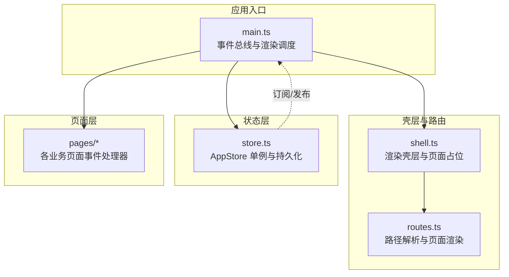
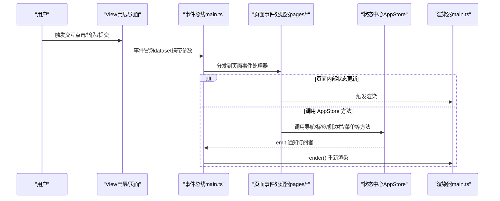
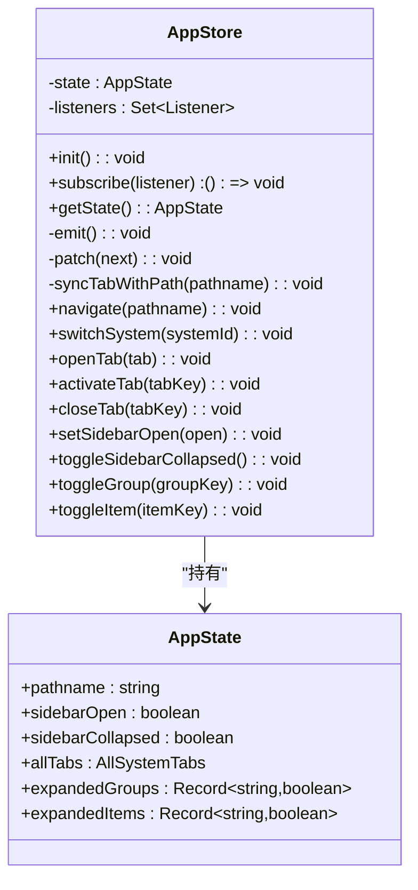
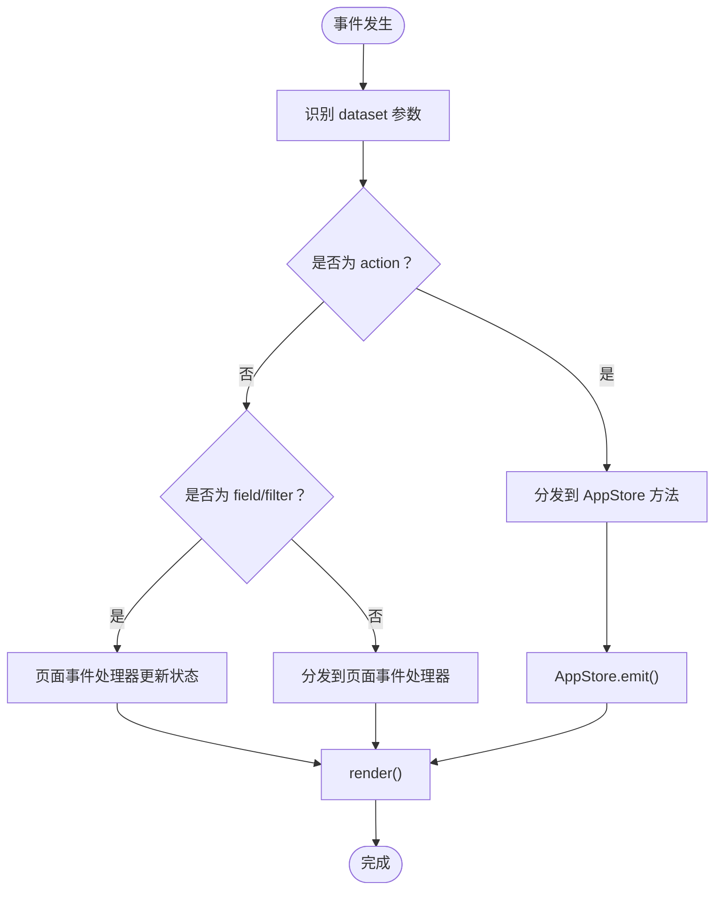
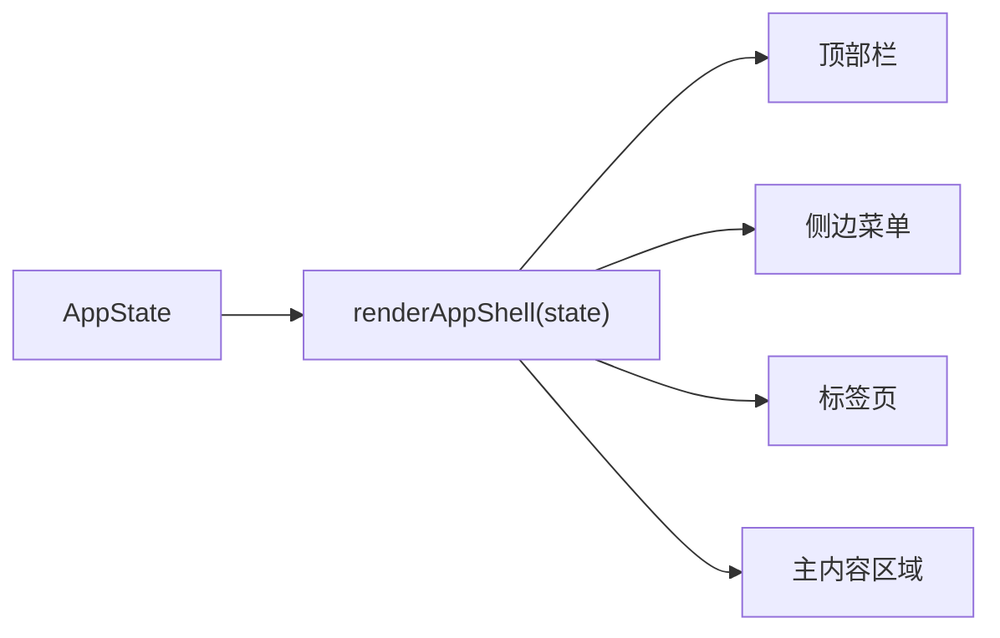
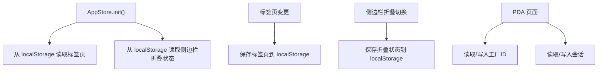
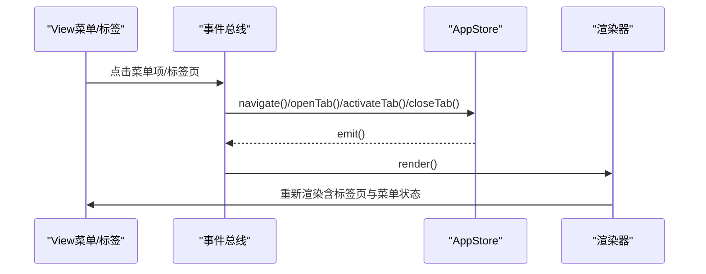
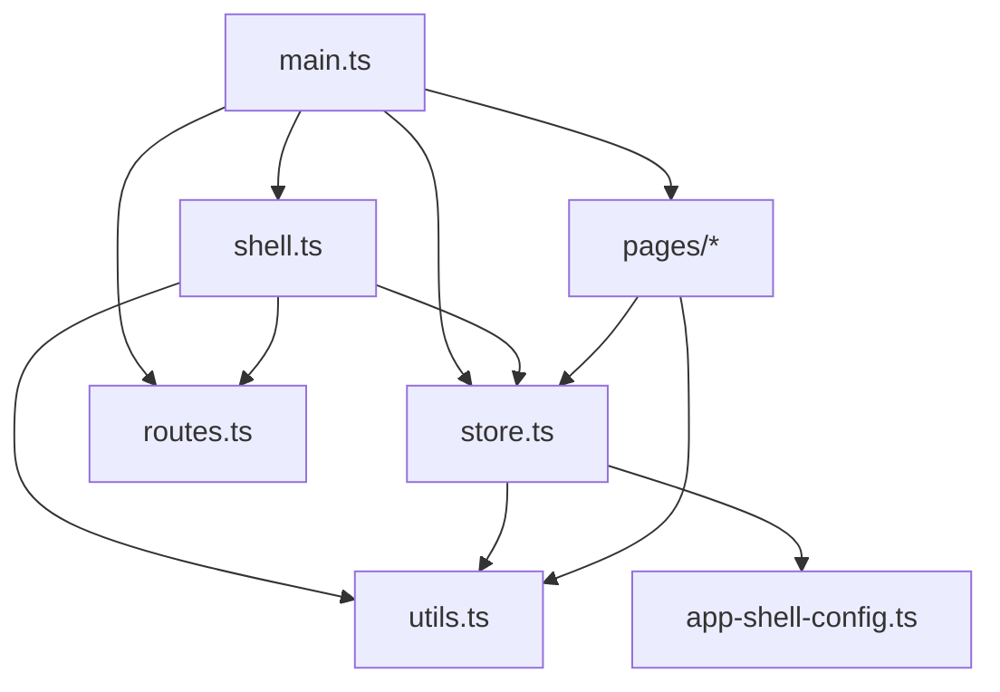

# 数据流设计

<cite>
**本文引用的文件**
- [store.ts](file://src/state/store.ts)
- [main.ts](file://src/main.ts)
- [shell.ts](file://src/components/shell.ts)
- [routes.ts](file://src/router/routes.ts)
- [utils.ts](file://src/utils.ts)
- [app-shell-config.ts](file://src/data/app-shell-config.ts)
- [factory-profile.ts](file://src/pages/factory-profile.ts)
- [factory-status.ts](file://src/pages/factory-status.ts)
- [pda-exec.ts](file://src/pages/pda-exec.ts)
- [pda-task-receive.ts](file://src/pages/pda-task-receive.ts)
- [store-domain-pda.ts](file://src/data/fcs/store-domain-pda.ts)
</cite>

## 目录
1. [简介](#简介)
2. [项目结构](#项目结构)
3. [核心组件](#核心组件)
4. [架构总览](#架构总览)
5. [详细组件分析](#详细组件分析)
6. [依赖关系分析](#依赖关系分析)
7. [性能考量](#性能考量)
8. [故障排查指南](#故障排查指南)
9. [结论](#结论)
10. [附录](#附录)

## 简介
本文件面向 higoods 的前端数据流设计，系统性阐述单向数据流模式在应用中的落地方式，覆盖从 Store → View → Action → Store 的完整闭环；解释状态管理机制（状态更新、订阅者模式、响应式渲染）、数据持久化策略（本地存储）、事件处理中 dataset 参数承载与传递、以及复杂业务场景下的数据流向与状态变化。同时提供性能优化建议与最佳实践，帮助开发者在不破坏单向数据流的前提下扩展功能与提升体验。

## 项目结构
higoods 采用“壳层 + 路由 + 页面 + 状态”的分层组织：
- 壳层（AppShell）负责顶部栏、侧边菜单、标签页与主内容区域渲染
- 路由（Routes）解析路径并渲染对应页面
- 页面（Pages）承载具体业务逻辑与 UI 交互
- 状态（Store）集中管理应用级状态与持久化

**图表来源**
- [main.ts:1-939](file://src/main.ts#L1-L939)
- [shell.ts:1-324](file://src/components/shell.ts#L1-L324)
- [routes.ts:1-456](file://src/router/routes.ts#L1-L456)
- [store.ts:1-329](file://src/state/store.ts#L1-L329)

**章节来源**
- [main.ts:1-939](file://src/main.ts#L1-L939)
- [shell.ts:1-324](file://src/components/shell.ts#L1-L324)
- [routes.ts:1-456](file://src/router/routes.ts#L1-L456)
- [store.ts:1-329](file://src/state/store.ts#L1-L329)

## 核心组件
- AppStore（状态中心）
  - 维护 AppState，提供初始化、订阅、状态读取、派生状态查询、导航与标签页操作、侧边栏控制、菜单展开折叠等方法
  - 通过私有 emit 通知订阅者，触发响应式渲染
  - 通过 localStorage 实现标签页与侧边栏折叠状态的持久化
- 事件总线（main.ts）
  - 全局 click/input/change/submit/keydown 事件监听器
  - 识别 dataset 中的 action 与 field/filter，分发到页面事件处理器或直接调用 AppStore 方法
  - 渲染器基于 AppStore.getState() 重新渲染壳层与页面
- 壳层渲染（shell.ts）
  - 将 AppState 渲染为顶部栏、侧边菜单、标签页与主内容区域
  - 通过 data-action/data-field 等 dataset 属性承载事件参数
- 路由解析（routes.ts）
  - 将 pathname 解析为具体页面渲染函数，支持精确路由与动态路由
- 工具与配置（utils.ts、app-shell-config.ts）
  - 提供字符串转义、类名拼接、时间格式化等工具
  - 定义系统、菜单、默认页等壳层配置

**章节来源**
- [store.ts:1-329](file://src/state/store.ts#L1-L329)
- [main.ts:1-939](file://src/main.ts#L1-L939)
- [shell.ts:1-324](file://src/components/shell.ts#L1-L324)
- [routes.ts:1-456](file://src/router/routes.ts#L1-L456)
- [utils.ts:1-18](file://src/utils.ts#L1-L18)
- [app-shell-config.ts:1-200](file://src/data/app-shell-config.ts#L1-L200)

## 架构总览
higoods 的数据流遵循“单向数据流”范式：
- View（壳层与页面）渲染时读取 Store 的当前状态
- 用户交互通过 dataset 承载参数，交由事件总线分发
- 事件处理器根据业务需要更新页面局部状态或调用 AppStore 方法
- AppStore 更新内部状态并通过 emit 通知订阅者
- 订阅者（main.ts 渲染器）基于最新状态重新渲染

**图表来源**
- [main.ts:382-497](file://src/main.ts#L382-L497)
- [store.ts:119-139](file://src/state/store.ts#L119-L139)

**章节来源**
- [main.ts:382-497](file://src/main.ts#L382-L497)
- [store.ts:119-139](file://src/state/store.ts#L119-L139)

## 详细组件分析

### AppStore：状态中心与持久化
- 状态模型（AppState）
  - 包含 pathname、侧边栏开关与折叠状态、所有系统标签页集合、菜单展开/折叠映射
- 初始化与恢复
  - 从 localStorage 恢复标签页与侧边栏折叠状态
  - 根据 pathname 推导当前系统与默认页，同步标签页
- 订阅与通知
  - subscribe 返回取消订阅函数；emit 遍历监听者集合触发回调
- 状态更新与派生
  - patch 合并部分状态并 emit
  - 导航、切换系统、打开/激活/关闭标签、切换侧边栏、切换菜单组/项等均通过 patch 触发响应式更新
- 持久化策略
  - 标签页：以 JSON 字符串存入 localStorage，键名固定
  - 侧边栏折叠：布尔值字符串存入 localStorage，键名固定
- 查询辅助
  - getCurrentSystem/getCurrentMenus/getCurrentTabs 用于壳层渲染时按当前 pathname 获取上下文

**图表来源**
- [store.ts:4-11](file://src/state/store.ts#L4-L11)
- [store.ts:89-304](file://src/state/store.ts#L89-L304)

**章节来源**
- [store.ts:1-329](file://src/state/store.ts#L1-L329)

### 事件总线：数据传递与分发
- 事件识别
  - hasDatasetAction/hasDatasetFieldLike 判断节点是否绑定 action 或 field/filter
  - shouldBypassClickDispatch 避免对原生控件与受控字段的重复触发
- 事件分发
  - dispatchPageEvent：优先尝试页面事件处理器，再回退到 AppStore 动作
  - dispatchPageSubmit：表单提交分发
- 动作映射
  - data-action 与 data-*Action 统一映射到 AppStore 的导航、标签、侧边栏、菜单等方法
  - data-field/data-filter 与 data-*Field/data-*Filter 用于页面内字段同步与过滤
- 渲染与响应
  - 事件处理后统一调用 render，基于最新状态重新渲染壳层与页面

**图表来源**
- [main.ts:347-497](file://src/main.ts#L347-L497)

**章节来源**
- [main.ts:347-497](file://src/main.ts#L347-L497)

### 壳层渲染：响应式视图
- 顶部栏、系统切换、侧边菜单、标签页与主内容区域均由 shell.ts 根据 AppState 渲染
- 菜单项与子项通过 data-action/data-item-key/data-tab-* 等 dataset 与 AppStore 动作耦合
- 标签页 bar 通过 data-action="activate-tab"/"close-tab" 控制当前标签页与关闭行为
- 图标通过 lucide 渲染，hydrateIcons 在渲染后初始化

**图表来源**
- [shell.ts:292-311](file://src/components/shell.ts#L292-L311)

**章节来源**
- [shell.ts:1-324](file://src/components/shell.ts#L1-L324)

### 路由解析：页面占位与动态匹配
- 精确路由与动态路由结合，支持带参数的详情页
- 未接入 UI 的菜单项返回占位页面，便于后续迁移
- resolvePage 根据 pathname 返回对应页面渲染结果

**章节来源**
- [routes.ts:1-456](file://src/router/routes.ts#L1-L456)

### 页面事件处理器：业务状态与数据传递
- 页面内部维护局部状态（如工厂档案、工厂状态、PDA 任务等），通过 dataset 的 data-*Action 与 data-*Field 承载参数
- 处理器根据 action 更新局部状态或调用 AppStore（如打开标签页）
- 示例：工厂状态页通过 data-action='toggle-select'/'open-single-change' 等更新选中与对话框状态

**章节来源**
- [factory-status.ts:840-975](file://src/pages/factory-status.ts#L840-L975)
- [factory-profile.ts:1-200](file://src/pages/factory-profile.ts#L1-L200)

### 数据持久化：本地存储与会话
- 应用级持久化
  - 标签页：localStorage 存储 AllSystemTabs，键名为固定常量
  - 侧边栏折叠：localStorage 存储布尔值字符串，键名为固定常量
- 页面级持久化
  - PDA 场景下，工厂选择与会话信息通过 localStorage 读写，确保跨页面一致性
  - store-domain-pda.ts 提供会话读取/设置/清理接口

**图表来源**
- [store.ts:30-56](file://src/state/store.ts#L30-L56)
- [store.ts:83-85](file://src/state/store.ts#L83-L85)
- [store.ts:275-283](file://src/state/store.ts#L275-L283)
- [pda-exec.ts:80-101](file://src/pages/pda-exec.ts#L80-L101)
- [pda-task-receive.ts:185-210](file://src/pages/pda-task-receive.ts#L185-L210)
- [store-domain-pda.ts:48-67](file://src/data/fcs/store-domain-pda.ts#L48-L67)

**章节来源**
- [store.ts:30-56](file://src/state/store.ts#L30-L56)
- [store.ts:83-85](file://src/state/store.ts#L83-L85)
- [store.ts:275-283](file://src/state/store.ts#L275-L283)
- [pda-exec.ts:80-101](file://src/pages/pda-exec.ts#L80-L101)
- [pda-task-receive.ts:185-210](file://src/pages/pda-task-receive.ts#L185-L210)
- [store-domain-pda.ts:48-67](file://src/data/fcs/store-domain-pda.ts#L48-L67)

### 复杂业务场景：标签页与导航
- 标签页同步
  - 当 pathname 变更时，AppStore 通过 syncTabWithPath 将菜单项映射为标签页条目，并更新 activeKey
- 导航与系统切换
  - data-nav 与 data-action="switch-system" 直接驱动 AppStore.navigate/switchSystem
- 侧边栏与菜单
  - data-action="set-sidebar-open"/"toggle-sidebar-collapsed"/"toggle-menu-group"/"toggle-menu-item" 控制 UI 状态

**图表来源**
- [main.ts:394-469](file://src/main.ts#L394-L469)
- [store.ts:141-170](file://src/state/store.ts#L141-L170)
- [store.ts:186-230](file://src/state/store.ts#L186-L230)

**章节来源**
- [main.ts:394-469](file://src/main.ts#L394-L469)
- [store.ts:141-170](file://src/state/store.ts#L141-L170)
- [store.ts:186-230](file://src/state/store.ts#L186-L230)

## 依赖关系分析
- main.ts 依赖 store.ts（订阅/通知）、shell.ts（渲染）、routes.ts（页面解析）、pages/*（事件处理器）
- shell.ts 依赖 store.ts（查询当前系统/菜单/标签）、routes.ts（页面解析）、utils.ts（工具函数）
- store.ts 依赖 app-shell-config.ts（系统与菜单配置）、utils.ts（工具函数）
- 页面事件处理器依赖 store.ts（必要时打开标签页）、utils.ts（工具函数）

**图表来源**
- [main.ts:1-939](file://src/main.ts#L1-L939)
- [shell.ts:1-324](file://src/components/shell.ts#L1-L324)
- [routes.ts:1-456](file://src/router/routes.ts#L1-L456)
- [store.ts:1-329](file://src/state/store.ts#L1-L329)
- [utils.ts:1-18](file://src/utils.ts#L1-L18)
- [app-shell-config.ts:1-200](file://src/data/app-shell-config.ts#L1-L200)

**章节来源**
- [main.ts:1-939](file://src/main.ts#L1-L939)
- [shell.ts:1-324](file://src/components/shell.ts#L1-L324)
- [routes.ts:1-456](file://src/router/routes.ts#L1-L456)
- [store.ts:1-329](file://src/state/store.ts#L1-L329)
- [utils.ts:1-18](file://src/utils.ts#L1-L18)
- [app-shell-config.ts:1-200](file://src/data/app-shell-config.ts#L1-L200)

## 性能考量
- 事件去抖与防抖
  - 对高频输入/滚动事件可引入节流/防抖，减少渲染次数
- 渲染粒度
  - 将大组件拆分为更小的可复用单元，避免不必要的整树重渲染
- 订阅粒度
  - 仅在需要的页面或组件订阅 AppStore，避免全局广播导致的过度渲染
- 数据持久化
  - localStorage 写入应批量合并，避免频繁 IO；错误捕获与降级处理
- 路由与页面
  - 使用动态导入与懒加载，减少首屏体积
- 工具函数
  - 字符串转义与日期格式化等纯函数尽量缓存或复用

[本节为通用指导，无需特定文件引用]

## 故障排查指南
- 事件未生效
  - 检查元素是否带有正确的 dataset（如 data-action、data-field）
  - 确认 shouldBypassClickDispatch 是否误判了原生控件
- 标签页不同步
  - 确认 pathname 是否正确，菜单项 href 是否存在且匹配
  - 检查 localStorage 是否被清空或损坏
- 侧边栏状态异常
  - 检查 localStorage 键值是否为期望的布尔字符串
- 页面状态未更新
  - 确认页面事件处理器是否正确更新局部状态或调用 AppStore
- 渲染闪烁
  - 检查是否对受控字段触发了全量渲染；可通过 shouldBypassClickDispatch 优化

**章节来源**
- [main.ts:357-380](file://src/main.ts#L357-L380)
- [main.ts:382-497](file://src/main.ts#L382-L497)
- [store.ts:141-170](file://src/state/store.ts#L141-L170)
- [store.ts:30-56](file://src/state/store.ts#L30-L56)

## 结论
higoods 的数据流设计以 AppStore 为核心，配合事件总线与壳层渲染，实现了清晰的单向数据流闭环。通过 dataset 的参数承载与持久化策略，系统在保证一致性的同时具备良好的扩展性。建议在后续开发中继续坚持单向数据流原则，合理拆分订阅粒度，优化事件处理与渲染性能，并在复杂业务场景下明确页面局部状态与全局状态的边界。

[本节为总结，无需特定文件引用]

## 附录
- 最佳实践
  - 优先使用 AppStore 管理全局状态，页面内部仅保留必要局部状态
  - 通过 data-action/data-field 统一承载参数，保持事件处理一致性
  - 对高频交互进行节流/防抖，减少渲染压力
  - 对 localStorage 操作进行错误捕获与降级处理
  - 严格区分精确路由与动态路由，确保路径与菜单一致

[本节为通用指导，无需特定文件引用]