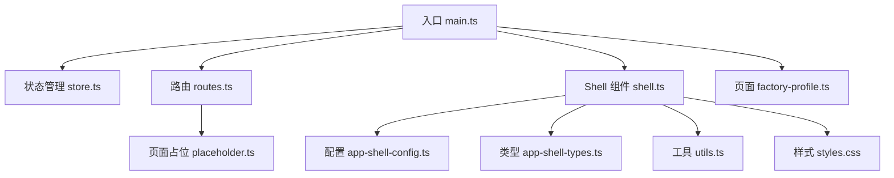
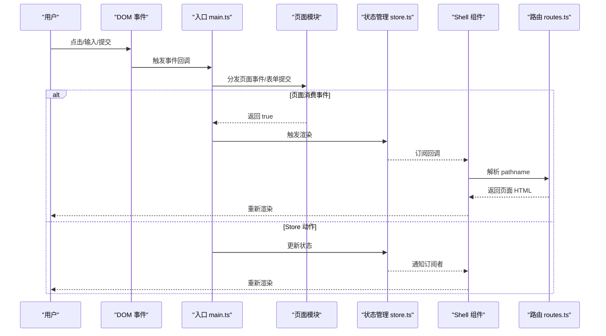
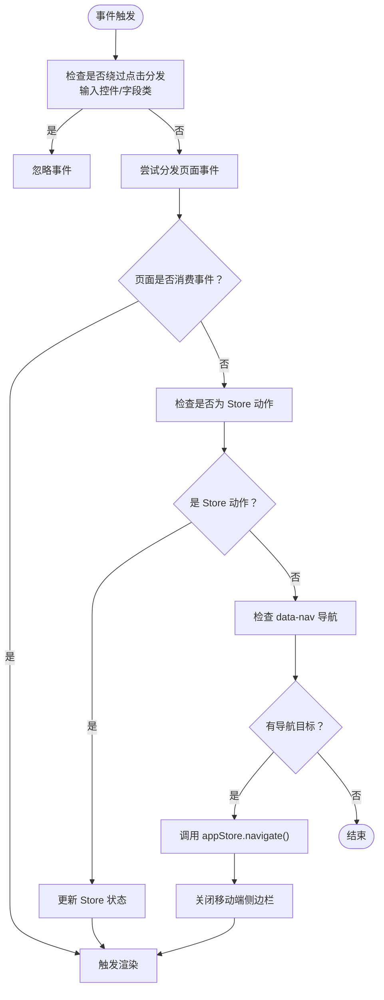
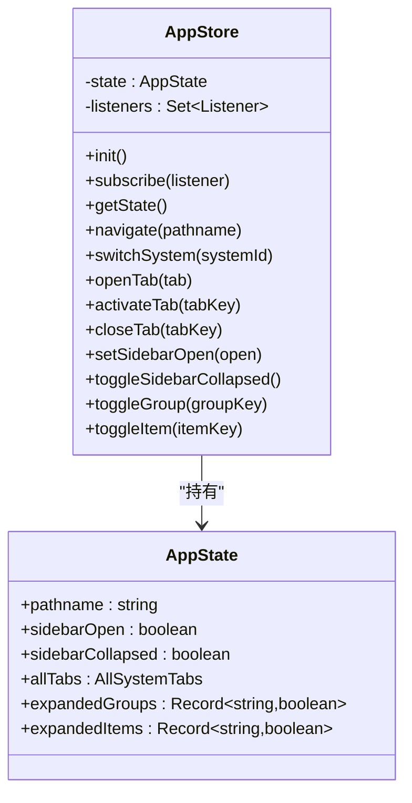
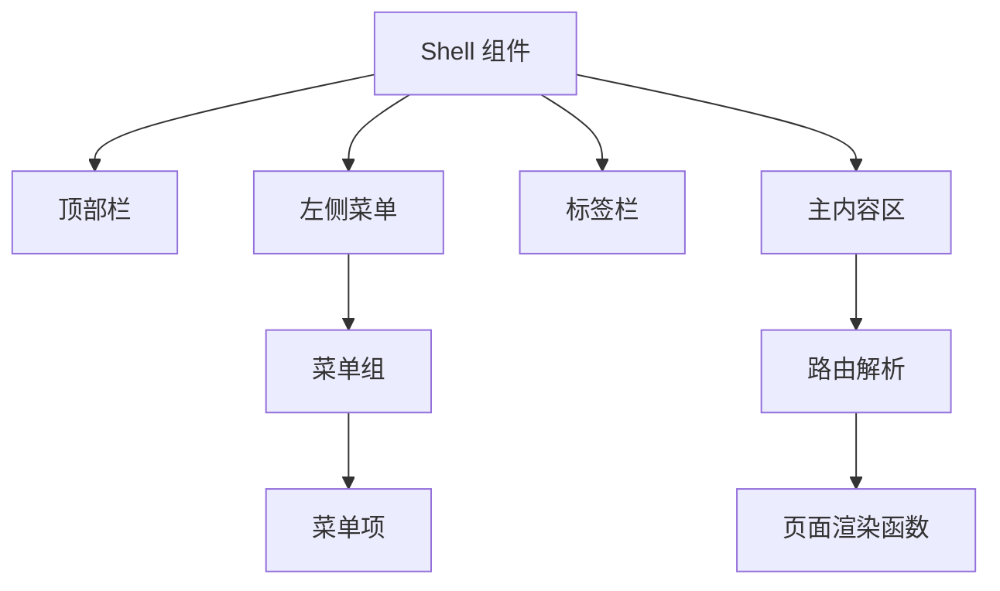
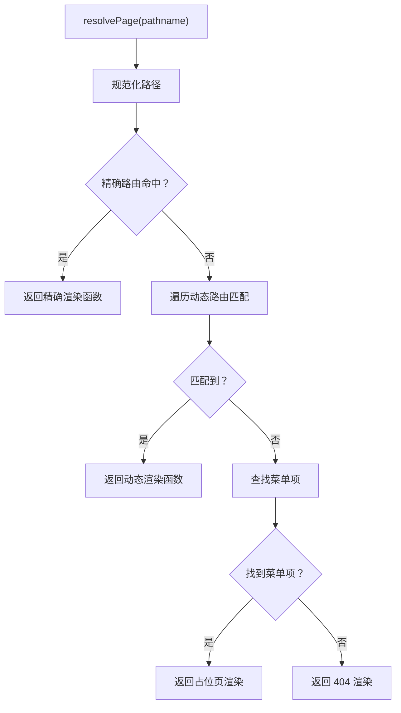
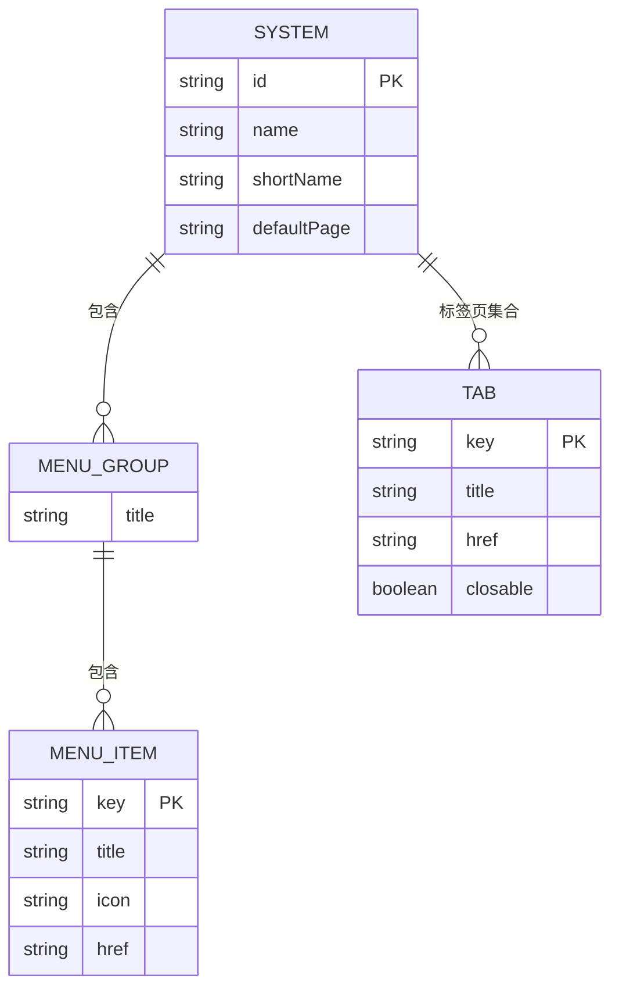
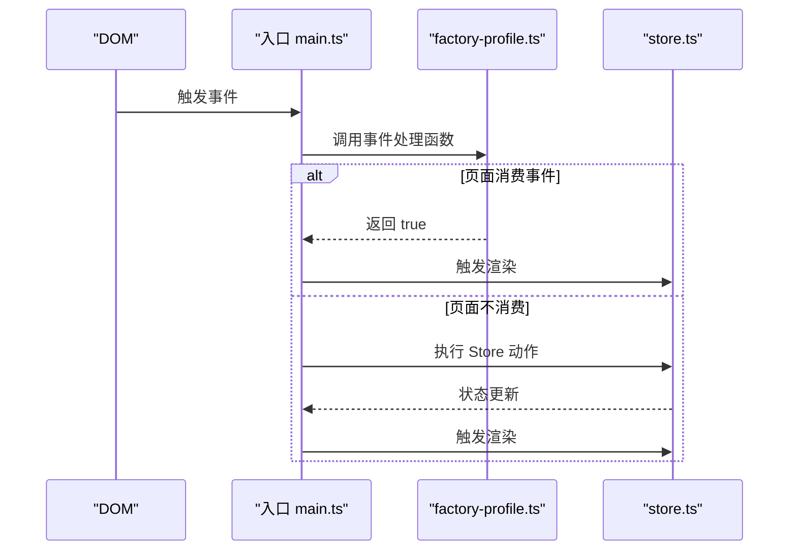
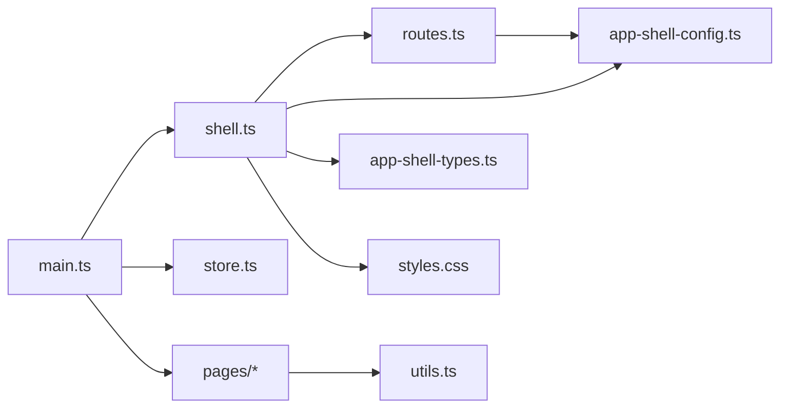

# 整体架构模式

<cite>
**本文引用的文件**
- [main.ts](file://src/main.ts)
- [store.ts](file://src/state/store.ts)
- [routes.ts](file://src/router/routes.ts)
- [shell.ts](file://src/components/shell.ts)
- [app-shell-config.ts](file://src/data/app-shell-config.ts)
- [app-shell-types.ts](file://src/data/app-shell-types.ts)
- [factory-profile.ts](file://src/pages/factory-profile.ts)
- [placeholder.ts](file://src/pages/placeholder.ts)
- [utils.ts](file://src/utils.ts)
- [styles.css](file://src/styles.css)
</cite>

## 目录
1. [引言](#引言)
2. [项目结构](#项目结构)
3. [核心组件](#核心组件)
4. [架构总览](#架构总览)
5. [详细组件分析](#详细组件分析)
6. [依赖分析](#依赖分析)
7. [性能考虑](#性能考虑)
8. [故障排查指南](#故障排查指南)
9. [结论](#结论)
10. [附录](#附录)

## 引言
本文件面向 higoods 的整体架构模式，系统性阐述其 MVVM 变体实现（Model-ViewModel-View），以及事件驱动架构、配置驱动开发、单向数据流等关键设计思想。文档以“数据层（Model）-状态管理（ViewModel）-页面渲染（View）”为主线，结合 dataset 驱动的事件处理、路由与菜单配置、Store → View → Action → Store 的单向数据流闭环，帮助开发者快速理解并做出技术决策。

## 项目结构
higoods 采用“前端单页应用 + 自研 Shell + 配置驱动”的组织方式：
- 核心入口负责事件监听与路由分发，连接 Shell 渲染与各页面逻辑。
- Shell 负责系统切换、菜单渲染、标签页管理与页面主体渲染。
- 路由模块负责路径解析与页面渲染函数映射。
- 配置层集中管理系统、菜单、默认页等元数据。
- 页面模块封装各自业务逻辑与事件处理，遵循统一的事件分发与提交流程。

**图表来源**
- [main.ts:1-933](file://src/main.ts#L1-L933)
- [store.ts:1-329](file://src/state/store.ts#L1-L329)
- [routes.ts:1-454](file://src/router/routes.ts#L1-L454)
- [shell.ts:1-324](file://src/components/shell.ts#L1-L324)
- [app-shell-config.ts:1-355](file://src/data/app-shell-config.ts#L1-L355)
- [app-shell-types.ts:1-46](file://src/data/app-shell-types.ts#L1-L46)
- [placeholder.ts:1-33](file://src/pages/placeholder.ts#L1-L33)
- [factory-profile.ts:1-1880](file://src/pages/factory-profile.ts#L1-L1880)
- [utils.ts:1-18](file://src/utils.ts#L1-L18)
- [styles.css:1-103](file://src/styles.css#L1-L103)

**章节来源**
- [main.ts:1-933](file://src/main.ts#L1-L933)
- [store.ts:1-329](file://src/state/store.ts#L1-L329)
- [routes.ts:1-454](file://src/router/routes.ts#L1-L454)
- [shell.ts:1-324](file://src/components/shell.ts#L1-L324)
- [app-shell-config.ts:1-355](file://src/data/app-shell-config.ts#L1-L355)
- [app-shell-types.ts:1-46](file://src/data/app-shell-types.ts#L1-L46)
- [placeholder.ts:1-33](file://src/pages/placeholder.ts#L1-L33)
- [factory-profile.ts:1-1880](file://src/pages/factory-profile.ts#L1-L1880)
- [utils.ts:1-18](file://src/utils.ts#L1-L18)
- [styles.css:1-103](file://src/styles.css#L1-L103)

## 核心组件
- 入口与事件中枢：负责 DOM 事件监听、dataset 动作解析、路由导航与 Store 更新，统一触发 Shell 重新渲染。
- 状态管理（Store）：集中维护路由、侧边栏、标签页、菜单展开状态等应用状态，提供订阅与派生状态查询。
- Shell 组件：渲染顶部栏、左侧菜单、标签栏与主内容区域，桥接 Store 与路由渲染。
- 路由模块：将 pathname 解析为具体页面渲染函数，支持精确路由与动态路由。
- 配置层：系统、菜单、默认页等元数据，支撑 Shell 渲染与路由解析。
- 页面模块：封装业务状态与事件处理，遵循统一的事件分发与表单提交流程。

**章节来源**
- [main.ts:240-491](file://src/main.ts#L240-L491)
- [store.ts:89-304](file://src/state/store.ts#L89-L304)
- [shell.ts:292-311](file://src/components/shell.ts#L292-L311)
- [routes.ts:428-453](file://src/router/routes.ts#L428-L453)
- [app-shell-config.ts:8-18](file://src/data/app-shell-config.ts#L8-L18)
- [app-shell-types.ts:6-46](file://src/data/app-shell-types.ts#L6-L46)

## 架构总览
higoods 采用“配置驱动 + 事件驱动 + 单向数据流”的混合架构：
- 配置驱动：系统、菜单、默认页等通过配置文件集中管理，Shell 与路由均依赖配置进行渲染与解析。
- 事件驱动：DOM 事件通过 dataset 动作分发到页面模块或 Store，页面模块内部再决定是否消费该事件。
- 单向数据流：Store 作为唯一真相源，View 仅读取状态并触发 Action；Action 更新 Store，随后触发 View 重新渲染。

**图表来源**
- [main.ts:376-491](file://src/main.ts#L376-L491)
- [store.ts:119-139](file://src/state/store.ts#L119-L139)
- [shell.ts:292-311](file://src/components/shell.ts#L292-L311)
- [routes.ts:428-453](file://src/router/routes.ts#L428-L453)

## 详细组件分析

### 入口与事件中枢（main.ts）
- 事件监听：统一注册 click/input/change/submit/keydown 事件，避免重复绑定与内存泄漏。
- dataset 动作解析：识别 data-action、data-field、data-filter 等属性，区分交互行为与表单字段同步。
- 页面事件分发：按顺序尝试分发至各页面模块的事件处理器，若返回 true 则阻止默认行为并触发渲染。
- 表单提交分发：将表单提交交由页面模块处理，成功后触发渲染。
- Store 动作：当命中 Store 动作（如切换系统、开关侧边栏、标签页操作）时，直接更新 Store 并触发渲染。

**图表来源**
- [main.ts:341-463](file://src/main.ts#L341-L463)
- [main.ts:465-491](file://src/main.ts#L465-L491)

**章节来源**
- [main.ts:240-491](file://src/main.ts#L240-L491)

### 状态管理（store.ts）
- 状态模型：包含当前路径、侧边栏状态、标签页集合、菜单展开状态等。
- 订阅机制：提供 subscribe 接口，供 Shell 订阅状态变化以触发重新渲染。
- 路由同步：根据 pathname 同步菜单项到标签页，确保标签与菜单联动一致。
- 系统切换：根据系统 id 切换默认页，保证跨系统导航一致性。
- 标签页管理：支持打开、激活、关闭标签页，持久化到本地存储。

**图表来源**
- [store.ts:89-304](file://src/state/store.ts#L89-L304)

**章节来源**
- [store.ts:89-329](file://src/state/store.ts#L89-L329)

### Shell 组件（shell.ts）
- 顶部栏：系统切换按钮、通知与用户信息。
- 左侧菜单：根据当前系统与展开状态渲染菜单组与子项，支持折叠与展开。
- 标签栏：根据当前系统标签页集合渲染可关闭的标签页，支持激活与关闭。
- 主内容区：调用路由解析函数渲染具体页面内容。
- 图标初始化：统一初始化 lucide 图标库。

**图表来源**
- [shell.ts:292-311](file://src/components/shell.ts#L292-L311)
- [routes.ts:428-453](file://src/router/routes.ts#L428-L453)

**章节来源**
- [shell.ts:25-311](file://src/components/shell.ts#L25-L311)

### 路由模块（routes.ts）
- 精确路由：将固定路径映射到具体页面渲染函数。
- 动态路由：使用正则表达式匹配动态参数，传递给对应渲染函数。
- 路由解析：先查精确路由，再查动态路由，最后根据菜单回退到占位页或 404。

**图表来源**
- [routes.ts:428-453](file://src/router/routes.ts#L428-L453)

**章节来源**
- [routes.ts:108-453](file://src/router/routes.ts#L108-L453)

### 配置层（app-shell-config.ts 与 app-shell-types.ts）
- 系统列表：定义系统 id、名称、短名与默认页。
- 菜单树：按系统组织菜单组与菜单项，支持多级子菜单。
- 类型定义：System、MenuGroup、MenuItem、Tab、SystemTabs、AllSystemTabs 等类型。

**图表来源**
- [app-shell-config.ts:8-355](file://src/data/app-shell-config.ts#L8-L355)
- [app-shell-types.ts:6-46](file://src/data/app-shell-types.ts#L6-L46)

**章节来源**
- [app-shell-config.ts:1-355](file://src/data/app-shell-config.ts#L1-L355)
- [app-shell-types.ts:1-46](file://src/data/app-shell-types.ts#L1-L46)

### 页面模块（以 factory-profile.ts 为例）
- 业务状态：集中管理页面数据、筛选器、排序、分页、对话框状态等。
- 事件处理：统一的事件分发函数，根据 dataset 动作更新状态并返回布尔值表示是否消费事件。
- 表单提交：统一的表单提交处理，校验并更新业务数据，关闭对话框。
- 对话框控制：提供 isOpen 状态查询，配合入口中的 ESC 键盘事件统一关闭。

**图表来源**
- [main.ts:242-318](file://src/main.ts#L242-L318)
- [factory-profile.ts:1780-1880](file://src/pages/factory-profile.ts#L1780-L1880)

**章节来源**
- [factory-profile.ts:1-1880](file://src/pages/factory-profile.ts#L1-L1880)

### 占位页与工具（placeholder.ts 与 utils.ts）
- 占位页：用于尚未完成的页面占位，统一风格与提示信息。
- 工具函数：HTML 转义、类名拼接、时间格式化等通用能力。

**章节来源**
- [placeholder.ts:1-33](file://src/pages/placeholder.ts#L1-L33)
- [utils.ts:1-18](file://src/utils.ts#L1-L18)

## 依赖分析
- 入口依赖：Shell、Store、各页面模块的事件处理函数。
- Shell 依赖：路由解析、Store 查询接口、配置与类型。
- 路由依赖：配置中的菜单映射与系统默认页。
- 页面依赖：数据类型、工具函数与自身业务状态。

**图表来源**
- [main.ts:1-933](file://src/main.ts#L1-L933)
- [shell.ts:1-324](file://src/components/shell.ts#L1-L324)
- [routes.ts:1-454](file://src/router/routes.ts#L1-L454)
- [app-shell-config.ts:1-355](file://src/data/app-shell-config.ts#L1-L355)
- [app-shell-types.ts:1-46](file://src/data/app-shell-types.ts#L1-L46)
- [utils.ts:1-18](file://src/utils.ts#L1-L18)
- [styles.css:1-103](file://src/styles.css#L1-L103)

**章节来源**
- [main.ts:1-933](file://src/main.ts#L1-L933)
- [shell.ts:1-324](file://src/components/shell.ts#L1-L324)
- [routes.ts:1-454](file://src/router/routes.ts#L1-L454)
- [app-shell-config.ts:1-355](file://src/data/app-shell-config.ts#L1-L355)
- [app-shell-types.ts:1-46](file://src/data/app-shell-types.ts#L1-L46)
- [utils.ts:1-18](file://src/utils.ts#L1-L18)
- [styles.css:1-103](file://src/styles.css#L1-L103)

## 性能考虑
- 事件去抖与绕过：对输入控件、字段类元素与原生选择器等场景绕过全量点击分发，减少不必要的渲染。
- 本地存储：标签页与侧边栏折叠状态持久化，降低重复初始化成本。
- 路由解析缓存：精确路由命中后无需正则匹配，提升解析效率。
- 渲染最小化：仅在状态变化时触发渲染，避免全量重绘。

[本节为通用指导，无需特定文件引用]

## 故障排查指南
- 页面不响应点击：检查事件是否被 shouldBypassClickDispatch 绕过，确认 dataset 动作键是否正确。
- 标签页不显示：确认 pathname 是否匹配菜单项，Store 是否正确同步标签页。
- 系统切换无效：确认系统 id 是否存在于配置，Store 的 switchSystem 是否被调用。
- 占位页未替换：确认路由解析是否命中精确或动态路由，菜单是否存在对应项。
- ESC 关闭对话框失败：确认页面模块是否暴露 isOpen 查询函数，入口是否正确构造 fake button 并调用事件处理。

**章节来源**
- [main.ts:351-517](file://src/main.ts#L351-L517)
- [store.ts:172-269](file://src/state/store.ts#L172-L269)
- [routes.ts:428-453](file://src/router/routes.ts#L428-L453)
- [factory-profile.ts:1877-1880](file://src/pages/factory-profile.ts#L1877-L1880)

## 结论
higoods 的架构以“配置驱动 + 事件驱动 + 单向数据流”为核心，通过 Shell 组件统一渲染壳层，Store 作为状态中心，入口负责事件分发与路由导航，页面模块专注业务逻辑。该模式具备以下优势：
- 松耦合：Shell 与页面通过 Store 解耦，事件通过 dataset 动作解耦。
- 可扩展：新增系统与菜单只需修改配置，路由与 Shell 无侵入适配。
- 可维护：单向数据流使状态变更可追踪，事件分发集中便于调试。

建议在新功能开发中：
- 严格遵循 dataset 动作命名规范，避免与原生控件冲突。
- 使用 Store 管理跨页面共享状态，页面内仅维护局部状态。
- 通过配置扩展菜单与路由，减少硬编码。

[本节为总结性内容，无需特定文件引用]

## 附录
- 样式与主题：通过 TailwindCSS 与 CSS 变量定义主题色与动画，Shell 标签关闭按钮可见性通过 CSS 控制。
- 数据类型：工厂类型、菜单项、系统等类型定义集中在类型文件，确保配置与业务模块的一致性。

**章节来源**
- [styles.css:1-103](file://src/styles.css#L1-L103)
- [app-shell-types.ts:6-46](file://src/data/app-shell-types.ts#L6-L46)