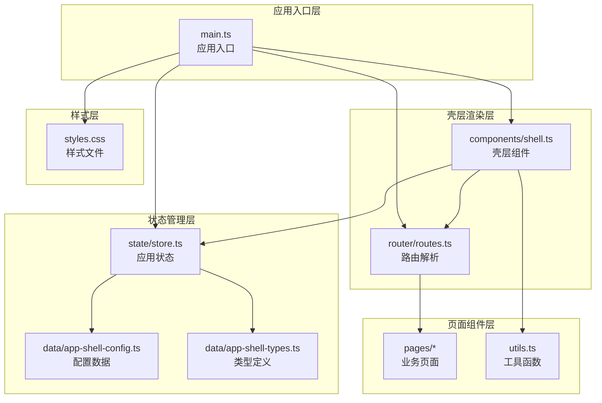
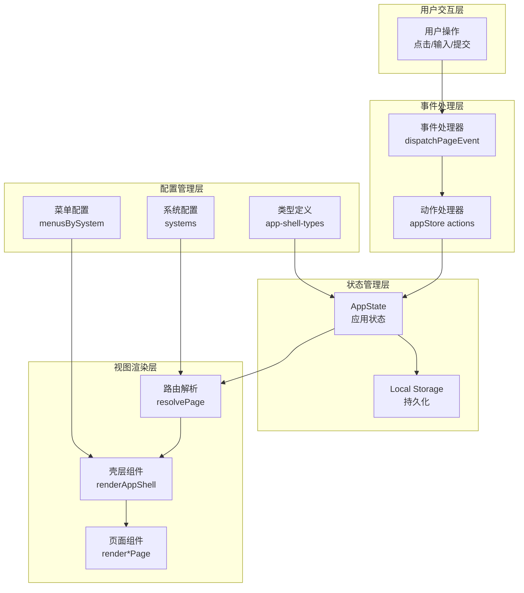
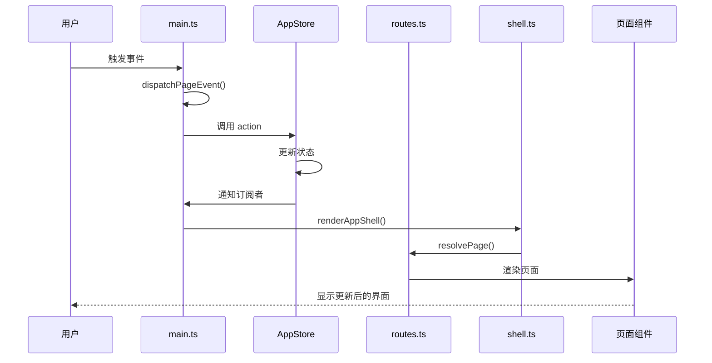
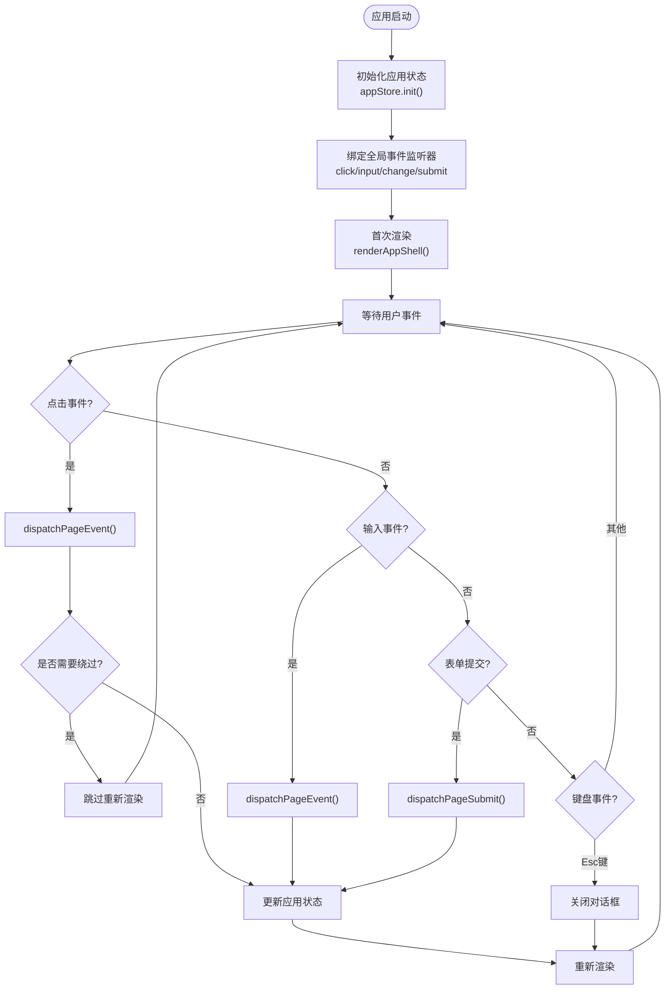
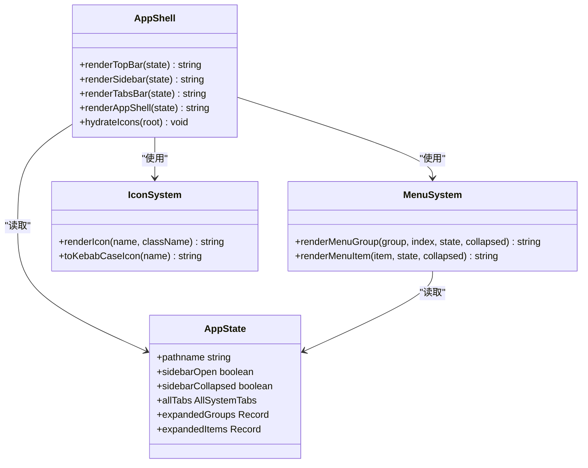
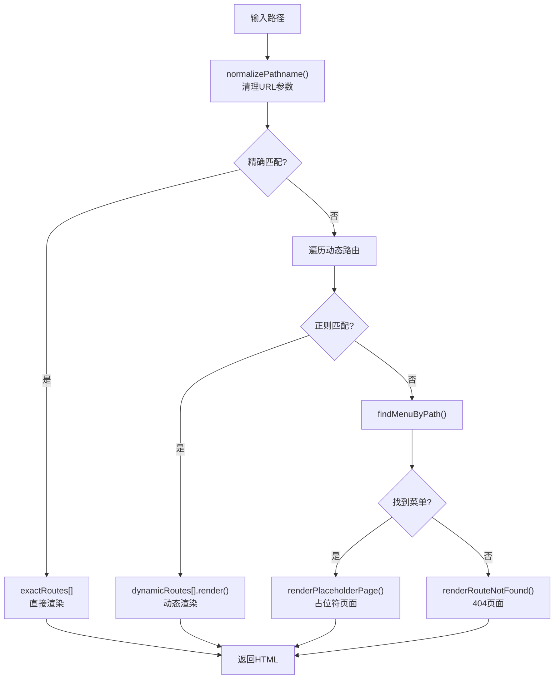
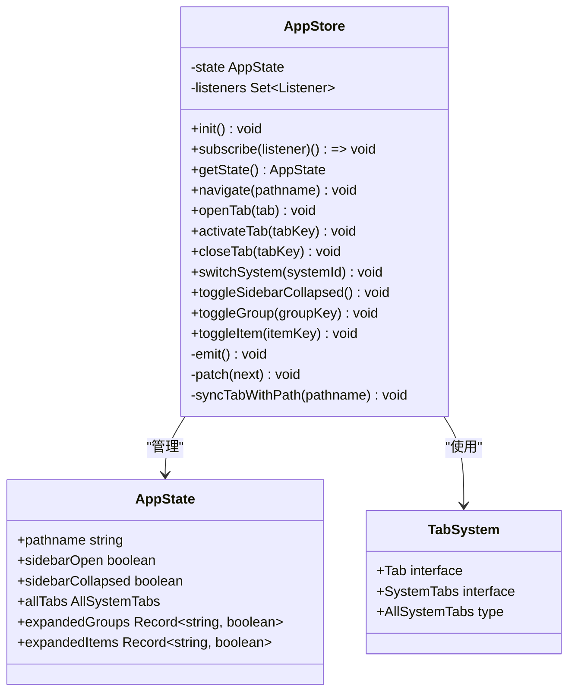
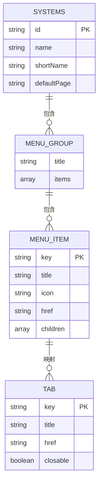
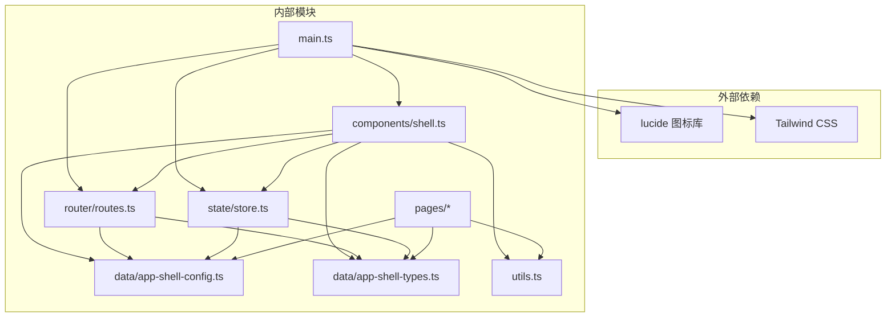

# 架构设计

<cite>
**本文档引用的文件**
- [main.ts](file://src/main.ts)
- [shell.ts](file://src/components/shell.ts)
- [routes.ts](file://src/router/routes.ts)
- [store.ts](file://src/state/store.ts)
- [app-shell-config.ts](file://src/data/app-shell-config.ts)
- [app-shell-types.ts](file://src/data/app-shell-types.ts)
- [factory-profile.ts](file://src/pages/factory-profile.ts)
- [placeholder.ts](file://src/pages/placeholder.ts)
- [utils.ts](file://src/utils.ts)
- [package.json](file://package.json)
</cite>

## 目录
1. [简介](#简介)
2. [项目结构](#项目结构)
3. [核心组件](#核心组件)
4. [架构概览](#架构概览)
5. [详细组件分析](#详细组件分析)
6. [依赖关系分析](#依赖关系分析)
7. [性能考虑](#性能考虑)
8. [故障排除指南](#故障排除指南)
9. [结论](#结论)

## 简介

higoods 是一个基于原生 JavaScript 和 TypeScript 的企业级应用，采用现代前端架构模式构建。该项目实现了 MVVM 模式的变体实现、事件驱动架构和配置驱动开发的设计理念，通过清晰的组件化架构实现了高度可维护性和可扩展性。

该应用主要服务于工厂生产协同系统，提供了完整的业务功能模块，包括工厂管理、生产调度、质量控制、结算管理等多个子系统。整个架构设计强调了数据流的单向性、组件的独立性和配置的灵活性。

## 项目结构

higoods 采用了清晰的分层架构设计，将不同职责的功能模块进行分离：

**图表来源**
- [main.ts:1-50](file://src/main.ts#L1-L50)
- [shell.ts:1-30](file://src/components/shell.ts#L1-L30)
- [routes.ts:1-30](file://src/router/routes.ts#L1-L30)
- [store.ts:1-30](file://src/state/store.ts#L1-L30)

**章节来源**
- [main.ts:1-933](file://src/main.ts#L1-L933)
- [shell.ts:1-324](file://src/components/shell.ts#L1-L324)
- [routes.ts:1-454](file://src/router/routes.ts#L1-L454)
- [store.ts:1-329](file://src/state/store.ts#L1-L329)

## 核心组件

### 应用入口组件 (main.ts)

应用入口是整个系统的启动点，负责初始化应用状态、绑定事件监听器和协调各个组件的交互。

**核心职责：**
- 初始化应用状态存储
- 绑定全局事件处理器
- 协调页面事件分发
- 管理应用生命周期

**关键特性：**
- 采用事件委托模式处理用户交互
- 支持多种页面组件的事件处理
- 实现响应式渲染机制
- 提供键盘快捷键支持

### 壳层渲染组件 (shell.ts)

壳层组件负责应用的整体布局和导航结构，实现了高度可定制的界面框架。

**核心职责：**
- 渲染顶部导航栏
- 生成侧边菜单系统
- 管理标签页切换
- 处理图标渲染

**关键特性：**
- 支持系统切换功能
- 实现响应式布局
- 提供菜单折叠功能
- 集成图标系统

### 路由解析组件 (routes.ts)

路由组件实现了灵活的路由解析机制，支持静态路由和动态路由的混合模式。

**核心职责：**
- 解析 URL 路径
- 匹配路由规则
- 渲染对应页面
- 处理路由错误

**关键特性：**
- 静态路由映射表
- 正则表达式动态路由
- 菜单路径查找
- 路由降级处理

### 状态管理组件 (store.ts)

状态管理组件实现了类似 Redux 的单向数据流架构，提供了完整的状态管理解决方案。

**核心职责：**
- 管理应用全局状态
- 提供状态订阅机制
- 实现状态变更通知
- 处理本地存储

**关键特性：**
- 不可变状态设计
- 订阅者模式
- 本地存储持久化
- 状态同步机制

**章节来源**
- [main.ts:232-491](file://src/main.ts#L232-L491)
- [shell.ts:292-324](file://src/components/shell.ts#L292-L324)
- [routes.ts:428-454](file://src/router/routes.ts#L428-L454)
- [store.ts:89-304](file://src/state/store.ts#L89-L304)

## 架构概览

higoods 采用了 MVVM（Model-View-ViewModel）模式的变体实现，结合事件驱动架构和配置驱动开发的理念：

**图表来源**
- [main.ts:242-463](file://src/main.ts#L242-L463)
- [store.ts:126-178](file://src/state/store.ts#L126-L178)
- [routes.ts:428-454](file://src/router/routes.ts#L428-L454)
- [shell.ts:292-311](file://src/components/shell.ts#L292-L311)

### 单向数据流机制

系统实现了严格的单向数据流模式，确保数据的一致性和可预测性：

**图表来源**
- [main.ts:329-332](file://src/main.ts#L329-L332)
- [store.ts:130-139](file://src/state/store.ts#L130-L139)
- [routes.ts:428-454](file://src/router/routes.ts#L428-L454)
- [shell.ts:292-311](file://src/components/shell.ts#L292-L311)

### MVVM 模式变体实现

虽然项目没有使用传统的 MVVM 框架，但实现了 MVVM 的核心思想：

**Model 层：** `store.ts` 中的 AppState 和各种数据模型
**View 层：** `shell.ts` 和各页面组件的 HTML 渲染
**ViewModel 层：** `main.ts` 中的事件处理器和状态协调逻辑

### 事件驱动架构

系统采用事件驱动的方式处理用户交互：

- **全局事件监听：** 在根节点上绑定 click、input、change、submit 事件
- **事件委托：** 使用 `dispatchPageEvent()` 函数处理所有页面特定事件
- **动作分发：** 将用户操作转换为具体的应用状态变更

### 配置驱动开发

系统大量使用配置来驱动功能实现：

- **系统配置：** 定义多个业务系统的导航结构
- **菜单配置：** 描述完整的菜单层次结构
- **类型定义：** 提供强类型的配置接口

**章节来源**
- [main.ts:376-491](file://src/main.ts#L376-L491)
- [store.ts:119-124](file://src/state/store.ts#L119-L124)
- [routes.ts:108-110](file://src/router/routes.ts#L108-L110)

## 详细组件分析

### 应用入口组件深度分析

应用入口组件是整个系统的协调中心，实现了复杂的事件处理和状态管理逻辑：

**图表来源**
- [main.ts:240-491](file://src/main.ts#L240-L491)

#### 关键方法分析

**dispatchPageEvent() 方法：**
- 接受 DOM 元素作为参数
- 依次尝试调用各个页面的事件处理器
- 返回布尔值表示是否处理成功
- 实现了事件冒泡的短路机制

**shouldBypassClickDispatch() 方法：**
- 智能判断哪些元素不需要触发全量重渲染
- 避免不必要的性能损耗
- 保持表单控件的原生行为

**章节来源**
- [main.ts:242-318](file://src/main.ts#L242-L318)
- [main.ts:341-374](file://src/main.ts#L341-L374)

### 壳层组件深度分析

壳层组件实现了复杂的状态管理和渲染逻辑：

**图表来源**
- [shell.ts:25-324](file://src/components/shell.ts#L25-L324)
- [store.ts:4-11](file://src/state/store.ts#L4-L11)

#### 菜单系统设计

壳层组件实现了多层次的菜单系统：

**菜单分组：**
- 支持标题和图标显示
- 可展开/折叠的菜单组
- 活跃状态高亮显示

**菜单项：**
- 支持子菜单嵌套
- 动态图标渲染
- 标签页集成

**标签页管理：**
- 多系统标签页隔离
- 自动同步菜单路径
- 本地存储持久化

**章节来源**
- [shell.ts:81-148](file://src/components/shell.ts#L81-L148)
- [shell.ts:150-183](file://src/components/shell.ts#L150-L183)
- [shell.ts:253-290](file://src/components/shell.ts#L253-L290)

### 路由系统深度分析

路由系统实现了灵活的路由解析机制：

**图表来源**
- [routes.ts:428-454](file://src/router/routes.ts#L428-L454)

#### 路由配置分析

**精确路由映射：**
- 定义了所有静态页面的路由
- 支持系统前缀区分
- 提供默认页面回退

**动态路由规则：**
- 支持参数提取和传递
- 实现灵活的页面渲染
- 处理复杂业务场景

**菜单集成：**
- 路由与菜单双向关联
- 自动激活状态同步
- 未实现页面占位符机制

**章节来源**
- [routes.ts:112-325](file://src/router/routes.ts#L112-L325)
- [routes.ts:327-404](file://src/router/routes.ts#L327-L404)
- [routes.ts:406-426](file://src/router/routes.ts#L406-L426)

### 状态管理系统深度分析

状态管理系统实现了完整的状态管理模式：

**图表来源**
- [store.ts:89-304](file://src/state/store.ts#L89-L304)
- [store.ts:4-11](file://src/state/store.ts#L4-L11)

#### 状态同步机制

状态管理系统实现了多维度的状态同步：

**路径同步：**
- 自动将菜单路径同步到标签页
- 支持系统间路径切换
- 维护活跃标签状态

**本地存储：**
- 标签页状态持久化
- 侧边栏折叠状态保存
- 用户偏好设置存储

**订阅模式：**
- 发布-订阅模式实现
- 组件自动更新机制
- 性能优化的订阅管理

**章节来源**
- [store.ts:101-117](file://src/state/store.ts#L101-L117)
- [store.ts:141-170](file://src/state/store.ts#L141-L170)
- [store.ts:19-28](file://src/state/store.ts#L19-L28)

### 配置系统深度分析

配置系统是整个应用的"大脑"，提供了强大的配置驱动能力：

**图表来源**
- [app-shell-config.ts:9-18](file://src/data/app-shell-config.ts#L9-L18)
- [app-shell-config.ts:21-104](file://src/data/app-shell-config.ts#L21-L104)
- [app-shell-types.ts:6-46](file://src/data/app-shell-types.ts#L6-L46)

#### 系统配置结构

**多系统支持：**
- 支持 8 个不同的业务系统
- 每个系统有独立的默认页面
- 系统间完全隔离

**菜单层次结构：**
- 三层菜单结构设计
- 支持无限层级嵌套
- 图标和权限控制

**标签页管理：**
- 按系统隔离的标签页
- 自动化的标签页生命周期
- 用户自定义标签页

**章节来源**
- [app-shell-config.ts:21-355](file://src/data/app-shell-config.ts#L21-L355)
- [app-shell-types.ts:6-46](file://src/data/app-shell-types.ts#L6-L46)

## 依赖关系分析

系统采用了清晰的依赖关系设计，避免了循环依赖并提高了模块化程度：

**图表来源**
- [main.ts:1-5](file://src/main.ts#L1-L5)
- [package.json:11-21](file://package.json#L11-L21)

### 模块耦合度分析

**低耦合设计：**
- 所有模块都依赖于配置层而非具体实现
- 类型定义层提供强类型约束
- 工具函数层提供通用功能

**依赖方向：**
- 上层组件依赖下层组件
- 配置层不依赖业务层
- 工具层不依赖业务层

**潜在问题：**
- 页面组件数量众多，需要更好的组织方式
- 配置数据可能过于分散
- 缺少统一的错误处理机制

**章节来源**
- [main.ts:1-933](file://src/main.ts#L1-L933)
- [shell.ts:1-324](file://src/components/shell.ts#L1-L324)
- [routes.ts:1-454](file://src/router/routes.ts#L1-L454)
- [store.ts:1-329](file://src/state/store.ts#L1-L329)

## 性能考虑

### 渲染优化

**事件委托优化：**
- 使用单一事件监听器处理所有用户交互
- 避免重复绑定事件监听器
- 减少内存占用和提升性能

**条件渲染优化：**
- `shouldBypassClickDispatch()` 方法避免不必要的重渲染
- 智能判断表单控件的原生行为
- 保持用户体验的同时提升性能

**图标系统优化：**
- 使用 lucide 图标库，按需加载
- 预渲染图标，减少运行时开销

### 状态管理优化

**不可变状态设计：**
- 使用 `patch()` 方法局部更新状态
- 避免全量状态替换
- 提升状态更新性能

**订阅者优化：**
- 使用 Set 数据结构管理订阅者
- 避免重复订阅
- 提供高效的取消订阅机制

### 存储优化

**本地存储策略：**
- 分离不同类型的存储数据
- 异步存储避免阻塞主线程
- 错误处理确保应用稳定性

## 故障排除指南

### 常见问题及解决方案

**页面无法渲染问题：**
1. 检查路由配置是否正确
2. 确认页面组件导出的渲染函数
3. 验证路径参数是否正确传递

**状态更新不生效问题：**
1. 确认状态变更是否通过 action 方法
2. 检查订阅者是否正确注册
3. 验证状态更新是否触发重新渲染

**菜单显示异常问题：**
1. 检查配置数据格式是否正确
2. 确认菜单项的 href 属性
3. 验证系统切换逻辑

**章节来源**
- [main.ts:234-236](file://src/main.ts#L234-L236)
- [store.ts:130-139](file://src/state/store.ts#L130-L139)
- [routes.ts:443-453](file://src/router/routes.ts#L443-L453)

### 调试技巧

**状态监控：**
- 使用浏览器开发者工具观察状态变化
- 利用订阅者模式调试状态更新
- 检查本地存储中的状态持久化

**事件追踪：**
- 在事件处理器中添加日志输出
- 使用断点调试事件处理流程
- 验证事件冒泡和捕获阶段

**性能分析：**
- 使用性能面板分析渲染时间
- 监控内存使用情况
- 识别性能瓶颈和优化机会

## 结论

higoods 项目展现了现代前端架构的最佳实践，通过 MVVM 模式的变体实现、事件驱动架构和配置驱动开发的有机结合，构建了一个高度可维护和可扩展的企业级应用。

### 主要优势

**架构清晰：** 分层设计明确，职责分离彻底
**可维护性强：** 配置驱动开发，便于功能扩展
**性能优秀：** 事件委托和条件渲染优化
**用户体验佳：** 响应式设计和流畅的交互体验

### 技术决策说明

**MVVM 变体实现：** 通过状态管理和事件处理实现 MVVM 核心思想
**事件驱动架构：** 使用事件委托和发布-订阅模式处理用户交互
**配置驱动开发：** 大量使用配置数据驱动功能实现
**单向数据流：** 严格的数据流向确保应用一致性

### 约束条件

**技术栈限制：** 基于原生 JavaScript 和 TypeScript
**浏览器兼容性：** 需要现代浏览器支持
**性能要求：** 大量页面组件需要优化渲染性能
**维护成本：** 页面组件数量众多，需要完善的开发规范

### 改进建议

1. **模块化重构：** 将页面组件按功能模块进行组织
2. **状态管理增强：** 考虑引入更完善的状态管理方案
3. **测试覆盖：** 建立完整的单元测试和集成测试体系
4. **文档完善：** 补充详细的开发文档和 API 文档