# 组件关系设计

<cite>
**本文档引用的文件**
- [main.ts](file://src/main.ts)
- [shell.ts](file://src/components/shell.ts)
- [routes.ts](file://src/router/routes.ts)
- [store.ts](file://src/state/store.ts)
- [factory-profile.ts](file://src/pages/factory-profile.ts)
- [capability.ts](file://src/pages/capability.ts)
- [app-shell-config.ts](file://src/data/app-shell-config.ts)
- [app-shell-types.ts](file://src/data/app-shell-types.ts)
- [placeholder.ts](file://src/pages/placeholder.ts)
- [utils.ts](file://src/utils.ts)
</cite>

## 目录
1. [简介](#简介)
2. [项目结构](#项目结构)
3. [核心组件](#核心组件)
4. [架构总览](#架构总览)
5. [详细组件分析](#详细组件分析)
6. [依赖关系分析](#依赖关系分析)
7. [性能考虑](#性能考虑)
8. [故障排除指南](#故障排除指南)
9. [结论](#结论)

## 简介

higoods 是一个基于现代前端技术栈构建的企业级应用，采用组件化架构设计。该应用通过清晰的层次分离实现了高内聚、低耦合的组件关系，支持多系统导航、动态路由、状态管理和事件驱动的用户交互。

本项目的核心设计理念是：
- **组件化架构**：每个页面都是独立的组件，具有明确的职责边界
- **事件驱动**：通过事件分发机制实现组件间通信
- **状态集中管理**：使用单一数据源管理应用状态
- **路由解耦**：路由解析与页面渲染完全分离

## 项目结构

higoods 项目采用功能模块化的组织方式，主要目录结构如下：

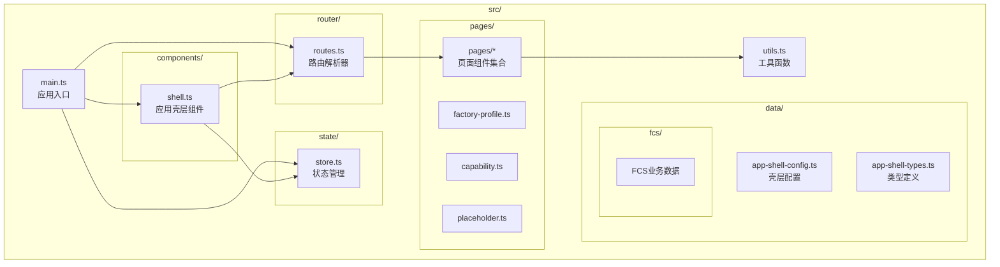

**图表来源**
- [main.ts:1-50](file://src/main.ts#L1-L50)
- [shell.ts:1-30](file://src/components/shell.ts#L1-L30)
- [routes.ts:1-30](file://src/router/routes.ts#L1-L30)
- [store.ts:1-30](file://src/state/store.ts#L1-L30)

**章节来源**
- [main.ts:1-50](file://src/main.ts#L1-L50)
- [shell.ts:1-30](file://src/components/shell.ts#L1-L30)
- [routes.ts:1-30](file://src/router/routes.ts#L1-L30)
- [store.ts:1-30](file://src/state/store.ts#L1-L30)

## 核心组件

### 应用入口组件 (main.ts)

应用入口负责协调整个应用的启动流程和事件分发机制。其核心职责包括：

- **事件监听**：注册全局点击、输入、变更和提交事件处理器
- **事件分发**：将用户交互事件分发给相应的页面处理器
- **页面渲染**：根据应用状态重新渲染应用壳层
- **快捷键处理**：处理ESC键等全局快捷键

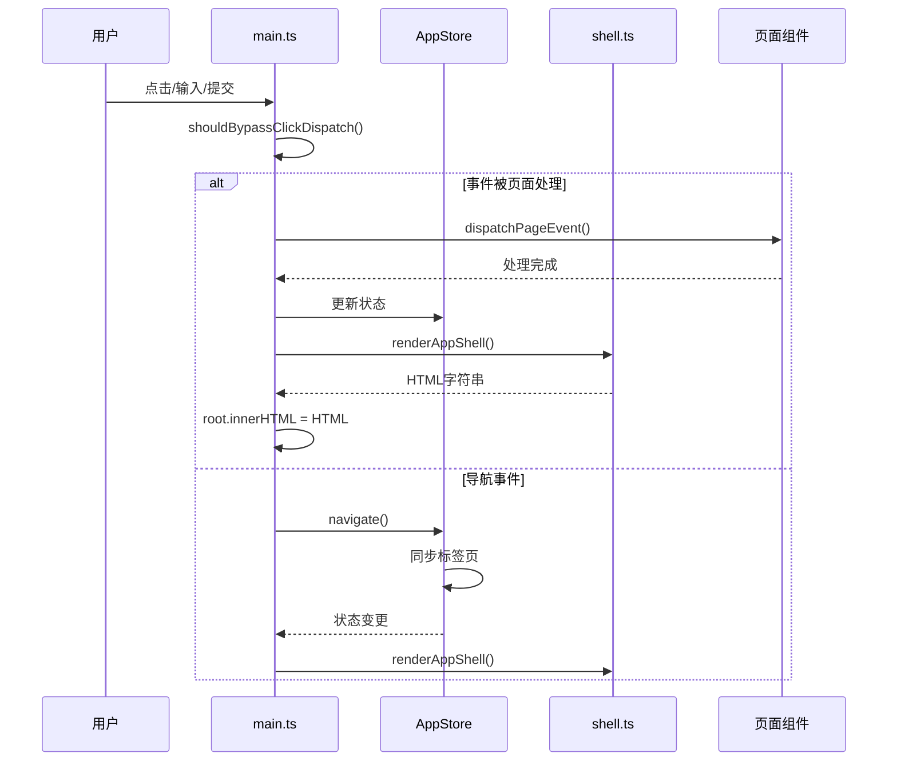

**图表来源**
- [main.ts:376-463](file://src/main.ts#L376-L463)
- [store.ts:172-178](file://src/state/store.ts#L172-L178)
- [shell.ts:292-311](file://src/components/shell.ts#L292-L311)

### 应用壳层组件 (shell.ts)

应用壳层负责渲染应用的整体界面结构，包括顶部栏、侧边栏、标签页和主内容区域。

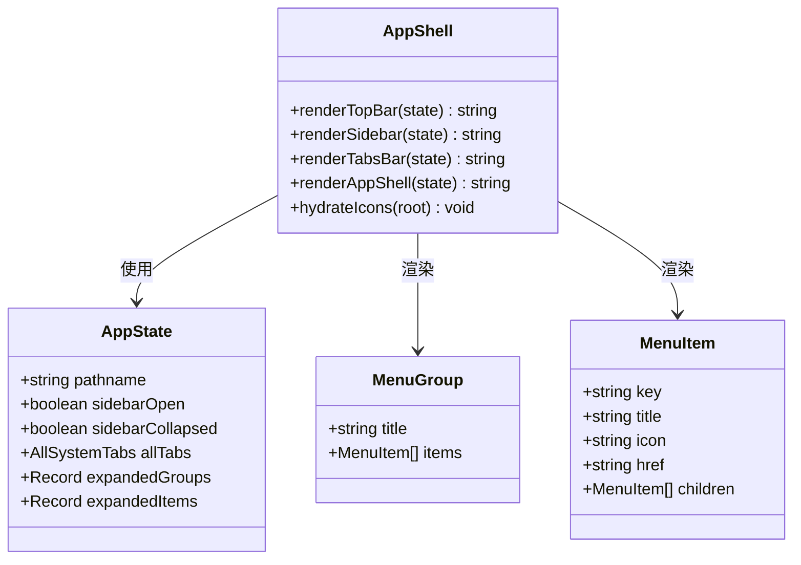

**图表来源**
- [shell.ts:25-311](file://src/components/shell.ts#L25-L311)
- [store.ts:4-11](file://src/state/store.ts#L4-L11)
- [app-shell-types.ts:14-27](file://src/data/app-shell-types.ts#L14-L27)

### 路由解析组件 (routes.ts)

路由解析器负责将URL路径映射到对应的页面渲染函数，支持精确路由和动态路由两种模式。

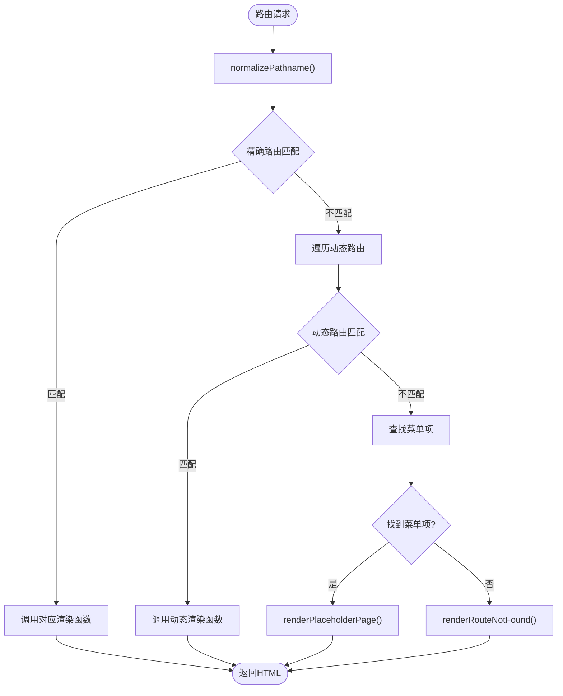

**图表来源**
- [routes.ts:428-453](file://src/router/routes.ts#L428-L453)
- [placeholder.ts:3-23](file://src/pages/placeholder.ts#L3-L23)

### 状态管理组件 (store.ts)

应用状态管理器采用单一数据源模式，集中管理应用的所有状态变化。

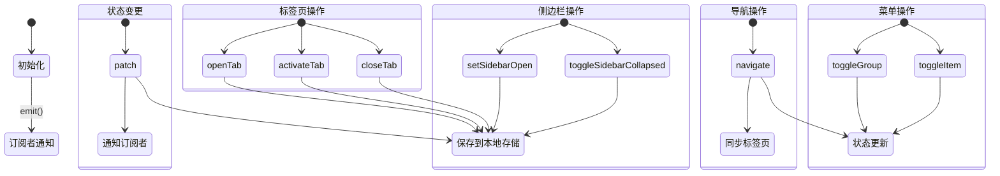

**图表来源**
- [store.ts:89-304](file://src/state/store.ts#L89-L304)

**章节来源**
- [main.ts:240-332](file://src/main.ts#L240-L332)
- [shell.ts:292-324](file://src/components/shell.ts#L292-L324)
- [routes.ts:428-453](file://src/router/routes.ts#L428-L453)
- [store.ts:89-304](file://src/state/store.ts#L89-L304)

## 架构总览

higoods 采用了典型的三层架构模式，实现了清晰的关注点分离：

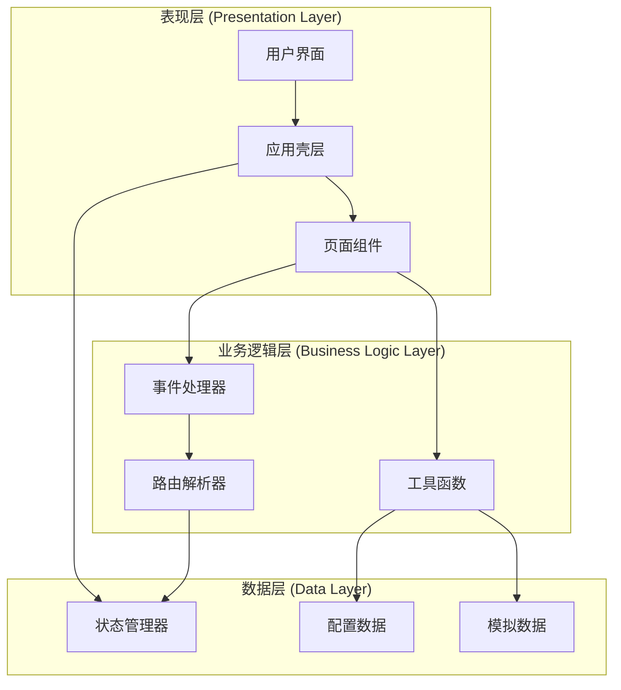

**图表来源**
- [main.ts:1-50](file://src/main.ts#L1-L50)
- [shell.ts:1-30](file://src/components/shell.ts#L1-L30)
- [routes.ts:1-30](file://src/router/routes.ts#L1-L30)
- [store.ts:1-30](file://src/state/store.ts#L1-L30)

### 组件间通信机制

应用采用多种通信机制确保组件间的松耦合：

1. **事件驱动通信**：通过DOM事件和自定义事件实现组件间通信
2. **状态共享**：通过AppStore集中管理状态，所有组件共享同一数据源
3. **回调函数**：页面组件通过回调函数向应用入口报告状态变化
4. **数据属性**：通过data-*属性传递组件标识和操作参数

**章节来源**
- [main.ts:242-318](file://src/main.ts#L242-L318)
- [store.ts:119-134](file://src/state/store.ts#L119-L134)

## 详细组件分析

### 工厂档案页面组件 (factory-profile.ts)

工厂档案页面是一个复杂的状态管理组件，展示了完整的CRUD操作流程：

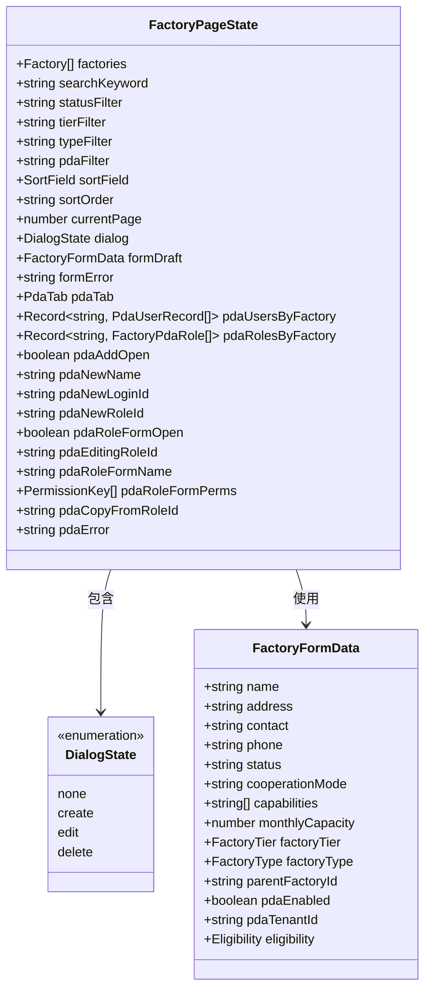

**图表来源**
- [factory-profile.ts:50-163](file://src/pages/factory-profile.ts#L50-L163)

### 能力标签页面组件 (capability.ts)

能力标签页面展示了简洁的数据展示和表单处理模式：

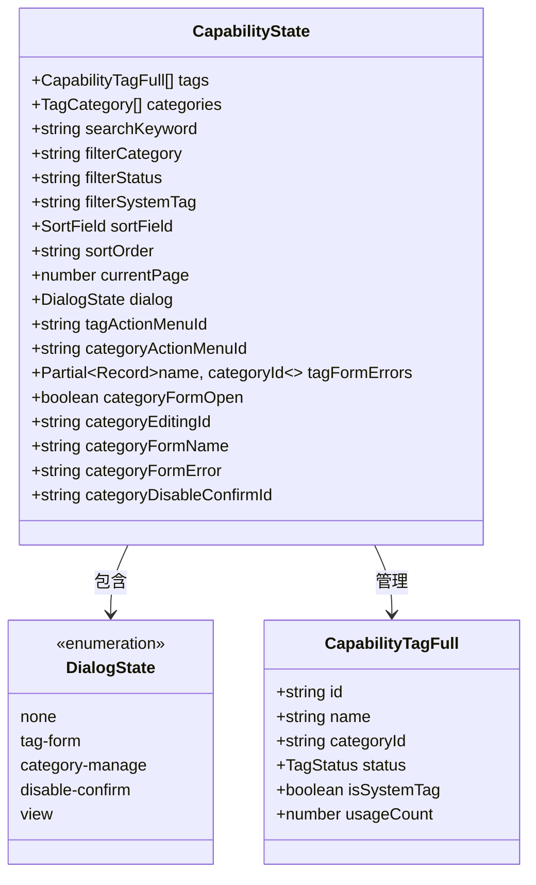

**图表来源**
- [capability.ts:24-76](file://src/pages/capability.ts#L24-L76)

### 壳层配置组件 (app-shell-config.ts)

壳层配置定义了应用的导航结构和菜单布局：

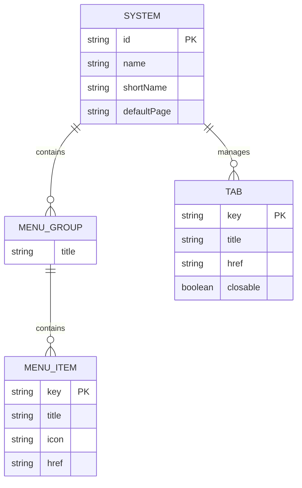

**图表来源**
- [app-shell-config.ts:8-18](file://src/data/app-shell-config.ts#L8-L18)
- [app-shell-types.ts:6-46](file://src/data/app-shell-types.ts#L6-L46)

**章节来源**
- [factory-profile.ts:1-200](file://src/pages/factory-profile.ts#L1-L200)
- [capability.ts:1-200](file://src/pages/capability.ts#L1-L200)
- [app-shell-config.ts:1-355](file://src/data/app-shell-config.ts#L1-L355)

## 依赖关系分析

### 模块依赖图

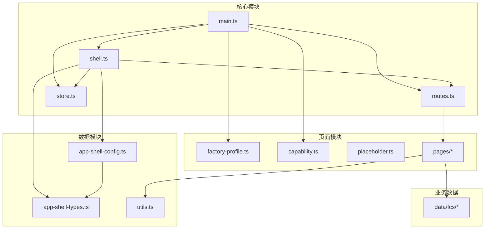

**图表来源**
- [main.ts:1-50](file://src/main.ts#L1-L50)
- [shell.ts:1-12](file://src/components/shell.ts#L1-L12)
- [routes.ts:1-10](file://src/router/routes.ts#L1-L10)
- [store.ts:1-3](file://src/state/store.ts#L1-L3)

### 组件生命周期管理

应用采用渐进式渲染和事件驱动的生命周期管理模式：

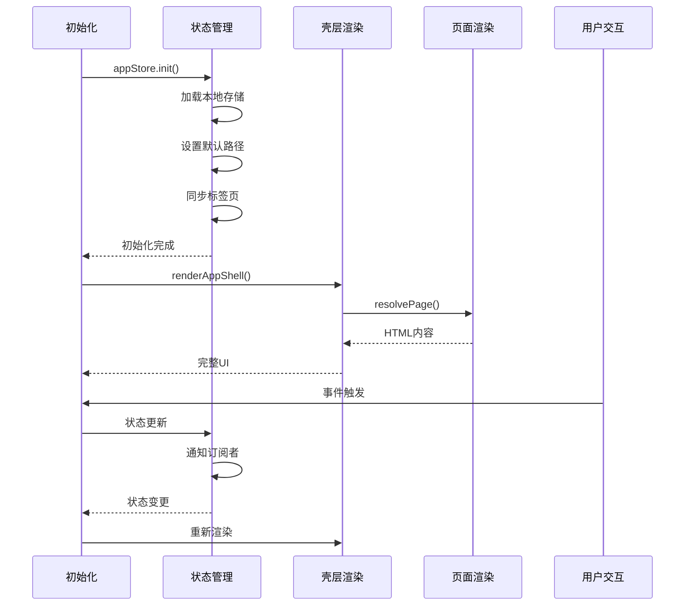

**图表来源**
- [store.ts:101-117](file://src/state/store.ts#L101-L117)
- [shell.ts:292-311](file://src/components/shell.ts#L292-L311)
- [main.ts:329-332](file://src/main.ts#L329-L332)

**章节来源**
- [main.ts:1-933](file://src/main.ts#L1-L933)
- [store.ts:1-329](file://src/state/store.ts#L1-L329)

## 性能考虑

### 渲染优化策略

1. **条件渲染**：通过 `shouldBypassClickDispatch` 函数避免不必要的全量重渲染
2. **增量更新**：只在事件被页面处理时触发局部更新
3. **懒加载**：路由解析器按需加载页面组件
4. **缓存机制**：状态管理器使用localStorage缓存用户偏好设置

### 内存管理

- **事件监听器清理**：应用采用一次性事件绑定，避免内存泄漏
- **状态清理**：通过状态管理器统一管理组件状态生命周期
- **DOM节点复用**：通过innerHTML替换实现高效的DOM更新

## 故障排除指南

### 常见问题及解决方案

1. **页面无法渲染**
   - 检查路由配置是否正确
   - 确认页面渲染函数是否存在
   - 验证路径规范化处理

2. **事件无响应**
   - 检查事件监听器是否正确绑定
   - 确认 `shouldBypassClickDispatch` 返回值
   - 验证data-*属性是否正确设置

3. **状态不同步**
   - 检查状态管理器的订阅机制
   - 确认状态更新是否通过统一接口
   - 验证本地存储的读写权限

**章节来源**
- [main.ts:341-374](file://src/main.ts#L341-L374)
- [store.ts:119-134](file://src/state/store.ts#L119-L134)

## 结论

higoods 的组件关系设计体现了现代前端架构的最佳实践：

### 设计优势

1. **清晰的层次分离**：表现层、业务逻辑层和数据层职责明确
2. **组件化架构**：每个页面都是独立组件，便于维护和测试
3. **事件驱动通信**：通过事件机制实现松耦合的组件交互
4. **状态集中管理**：单一数据源确保状态一致性
5. **路由解耦设计**：路由解析与页面渲染完全分离

### 架构特点

- **可扩展性**：新增页面只需实现渲染函数和事件处理器
- **可维护性**：清晰的模块边界和依赖关系
- **可测试性**：独立的组件便于单元测试
- **可移植性**：配置驱动的壳层设计支持多系统切换

这种设计模式为大型企业应用提供了稳定可靠的技术基础，能够有效支撑复杂的业务场景和持续的功能迭代。