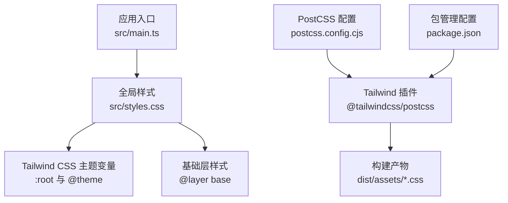
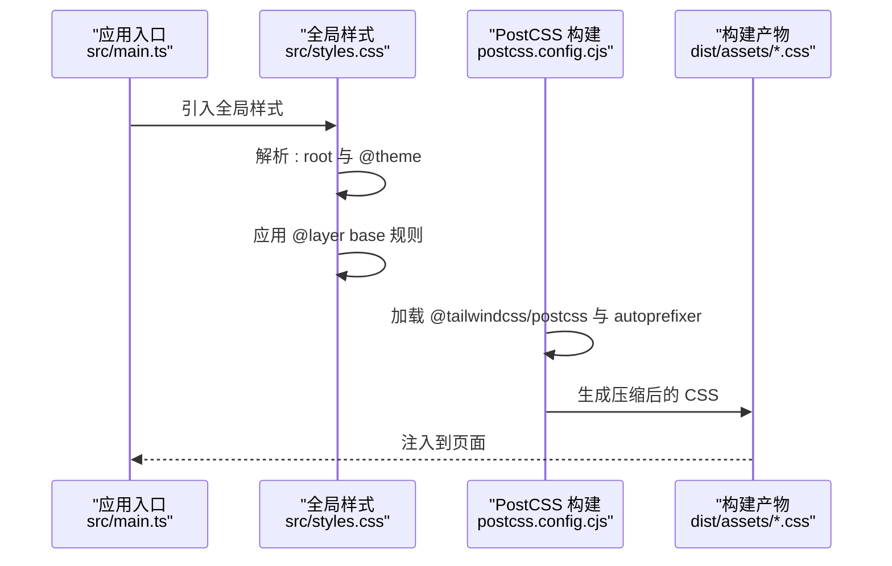
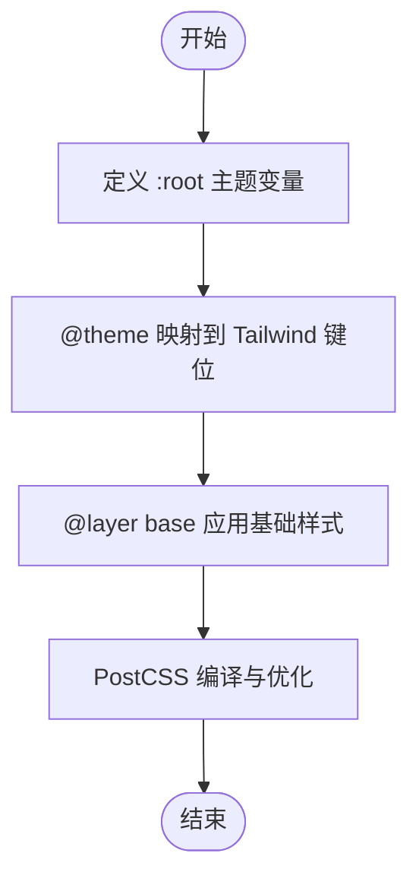
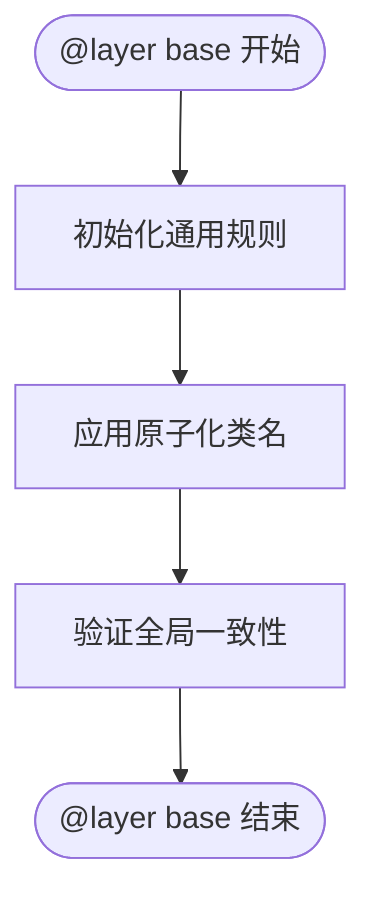
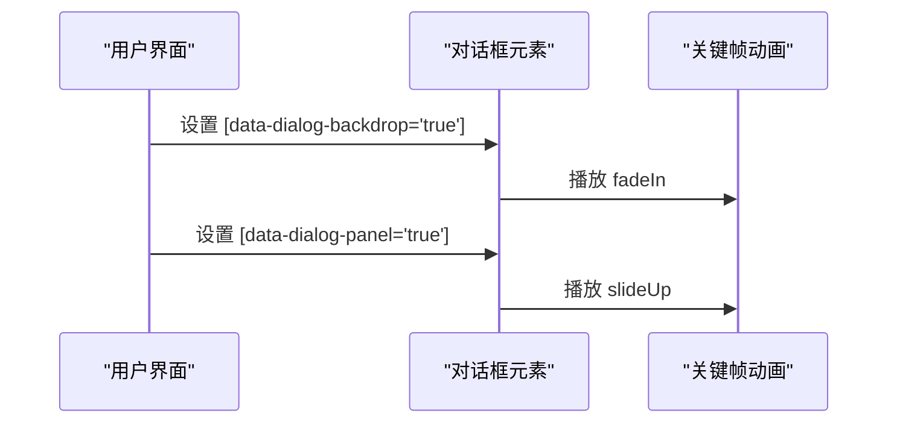
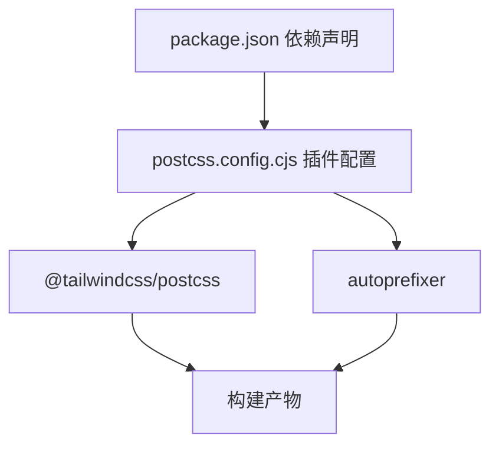
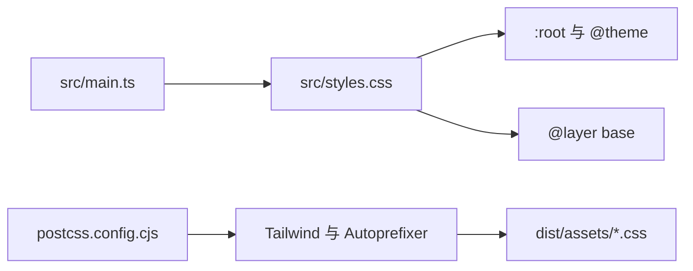

# 样式系统

<cite>
**本文引用的文件**
- [src/styles.css](file://src/styles.css)
- [postcss.config.cjs](file://postcss.config.cjs)
- [package.json](file://package.json)
- [src/main.ts](file://src/main.ts)
</cite>

## 目录
1. [引言](#引言)
2. [项目结构](#项目结构)
3. [核心组件](#核心组件)
4. [架构总览](#架构总览)
5. [详细组件分析](#详细组件分析)
6. [依赖关系分析](#依赖关系分析)
7. [性能考量](#性能考量)
8. [故障排查指南](#故障排查指南)
9. [结论](#结论)
10. [附录](#附录)

## 引言
本文件面向样式系统的技术文档，聚焦于 CSS 架构与 Tailwind CSS 的使用方式，涵盖原子化样式类的应用原则与命名规范、全局样式的组织结构（基础样式、组件样式、响应式设计）、主题系统的配置与定制（CSS 变量与主题切换）、新增与扩展现有样式的实践路径、响应式设计策略（断点与移动端适配）、样式性能优化最佳实践以及调试与维护工具方法。内容以仓库中实际文件为依据，避免臆造信息，并提供可追溯的来源标注。

## 项目结构
本项目采用“原生前端 + Vite + Tailwind CSS”的轻量样式架构：
- 入口样式文件集中定义主题变量与基础层规则，作为全局样式源。
- PostCSS 配置启用 Tailwind CSS 插件与自动前缀，构建时生成最终 CSS。
- 应用入口在启动时引入全局样式，确保页面加载即具备统一风格与主题。

图表来源
- [src/main.ts:1-2](file://src/main.ts#L1-L2)
- [src/styles.css:1-103](file://src/styles.css#L1-L103)
- [postcss.config.cjs:1-7](file://postcss.config.cjs#L1-L7)
- [package.json:14-21](file://package.json#L14-L21)

章节来源
- [src/main.ts:1-2](file://src/main.ts#L1-L2)
- [src/styles.css:1-103](file://src/styles.css#L1-L103)
- [postcss.config.cjs:1-7](file://postcss.config.cjs#L1-L7)
- [package.json:14-21](file://package.json#L14-L21)

## 核心组件
- 全局样式与主题变量
  - 在根作用域定义主题变量，覆盖背景、前景、卡片、弹出层、主/次级、强调、破坏性、边框、输入、环形高亮等色值，以及圆角半径。
  - 使用 @theme 将 CSS 变量映射到 Tailwind 可消费的主题键位，使原子类与主题变量解耦。
- 基础层样式
  - 在 @layer base 中统一设置全局边框与轮廓、滚动条与可见性、容器溢出控制、以及基础 html/body 的默认行为。
  - 通过原子化类名在基础层中应用颜色与边框，保证一致性。
- 动画与交互
  - 定义对话框打开时的淡入与滑上动画，配合数据属性选择器实现开合过渡。
- 构建链路
  - PostCSS 启用 Tailwind 插件与 autoprefixer，生成最终 CSS 并输出至 dist 资产目录。

章节来源
- [src/styles.css:3-24](file://src/styles.css#L3-L24)
- [src/styles.css:26-50](file://src/styles.css#L26-L50)
- [src/styles.css:52-65](file://src/styles.css#L52-L65)
- [src/styles.css:76-102](file://src/styles.css#L76-L102)
- [postcss.config.cjs:1-7](file://postcss.config.cjs#L1-L7)
- [package.json:14-21](file://package.json#L14-L21)

## 架构总览
样式系统围绕“主题变量 → Tailwind 主题 → 原子类 → 基础层样式”的路径工作。应用启动时引入全局样式，确保所有页面共享同一主题与基础样式；Tailwind 提供原子化能力，结合 @layer base 实现全局一致性；PostCSS 负责编译与优化。

图表来源
- [src/main.ts:1-2](file://src/main.ts#L1-L2)
- [src/styles.css:1-103](file://src/styles.css#L1-L103)
- [postcss.config.cjs:1-7](file://postcss.config.cjs#L1-L7)

## 详细组件分析

### 组件一：主题系统与 CSS 变量
- 设计要点
  - 使用 oklch 表达色值，便于在不同设备与显示环境下保持一致的感知亮度与色相。
  - 通过 :root 定义主题变量，再由 @theme 映射到 Tailwind 主题键位，实现“变量驱动的原子类”。
  - 圆角半径通过变量派生出多级尺寸，满足不同组件的圆角需求。
- 使用建议
  - 新增或修改颜色时，优先调整 :root 中的变量，以确保全局一致性。
  - 通过 @theme 的映射，确保自定义组件也能复用主题变量，避免硬编码颜色。

图表来源
- [src/styles.css:3-24](file://src/styles.css#L3-L24)
- [src/styles.css:26-50](file://src/styles.css#L26-L50)
- [src/styles.css:52-65](file://src/styles.css#L52-L65)
- [postcss.config.cjs:1-7](file://postcss.config.cjs#L1-L7)

章节来源
- [src/styles.css:3-24](file://src/styles.css#L3-L24)
- [src/styles.css:26-50](file://src/styles.css#L26-L50)
- [src/styles.css:52-65](file://src/styles.css#L52-L65)

### 组件二：基础层样式与全局一致性
- 设计要点
  - 在 @layer base 中对 *、html、body 进行统一初始化，确保边框、轮廓、滚动与可见性的一致性。
  - 使用原子化类名快速应用主题色，减少重复声明。
- 扩展建议
  - 新增全局样式时，优先放入 @layer base，避免与组件局部样式冲突。
  - 对于需要覆盖默认样式的元素，使用明确的选择器与原子类组合，保持可读性与可维护性。

图表来源
- [src/styles.css:52-65](file://src/styles.css#L52-L65)

章节来源
- [src/styles.css:52-65](file://src/styles.css#L52-L65)

### 组件三：动画与交互（对话框）
- 设计要点
  - 通过数据属性选择器与关键帧动画，实现对话框打开时的淡入与滑上效果。
  - 动画触发与关闭逻辑与组件状态联动，保证交互体验流畅。
- 扩展建议
  - 新增交互组件时，遵循相同的数据属性约定与动画模式，确保一致性。
  - 控制动画时长与缓动函数，避免影响页面整体性能。

图表来源
- [src/styles.css:76-102](file://src/styles.css#L76-L102)

章节来源
- [src/styles.css:76-102](file://src/styles.css#L76-L102)

### 组件四：构建与插件链路
- 设计要点
  - PostCSS 配置启用 Tailwind 插件与 autoprefixer，确保类名解析与浏览器兼容。
  - package.json 中声明 tailwindcss、@tailwindcss/postcss、postcss、autoprefixer 等依赖。
- 维护建议
  - 升级 Tailwind 版本时，同步更新插件与配置，避免构建失败。
  - 如需引入新插件，先在本地验证兼容性，再合并到 CI 流程。

图表来源
- [package.json:14-21](file://package.json#L14-L21)
- [postcss.config.cjs:1-7](file://postcss.config.cjs#L1-L7)

章节来源
- [package.json:14-21](file://package.json#L14-L21)
- [postcss.config.cjs:1-7](file://postcss.config.cjs#L1-L7)

## 依赖关系分析
- 应用入口依赖全局样式文件，确保主题与基础样式在首屏生效。
- 全局样式依赖 Tailwind 的主题变量与 @layer base 能力。
- 构建阶段依赖 PostCSS 插件链路，生成最终 CSS。

图表来源
- [src/main.ts:1-2](file://src/main.ts#L1-L2)
- [src/styles.css:1-103](file://src/styles.css#L1-L103)
- [postcss.config.cjs:1-7](file://postcss.config.cjs#L1-L7)

章节来源
- [src/main.ts:1-2](file://src/main.ts#L1-L2)
- [src/styles.css:1-103](file://src/styles.css#L1-L103)
- [postcss.config.cjs:1-7](file://postcss.config.cjs#L1-L7)

## 性能考量
- 减少重绘与回流
  - 优先使用 transform 与 opacity 等 GPU 友好属性触发动画，避免频繁修改布局属性。
  - 合理拆分动画与交互，避免在同一元素上叠加过多复杂动画。
- 类名与体积
  - 利用 Tailwind 原子类减少重复样式，降低 CSS 体积。
  - 在开发环境开启 Tree Shaking 与按需构建，生产环境启用压缩与去重。
- 渲染效率
  - 将动画与过渡集中在少量关键元素上，避免大面积强制重排。
  - 使用 CSS 变量进行主题切换，避免全量替换样式导致的抖动。

## 故障排查指南
- 构建失败
  - 检查 PostCSS 插件是否正确安装与配置，确认版本兼容性。
  - 若出现类名未识别问题，检查 Tailwind 配置与扫描路径，确保候选类被正确收集。
- 主题不生效
  - 确认 :root 与 @theme 中的变量键位一致，且未被局部样式覆盖。
  - 检查 @layer base 是否在最终构建产物中存在。
- 动画异常
  - 核对数据属性选择器与动画触发条件，确保状态切换与选择器匹配。
  - 检查关键帧名称与调用是否一致，避免拼写错误导致动画不播放。

## 结论
本样式系统以 Tailwind CSS 为核心，结合 CSS 变量与 @layer base，实现了主题驱动、原子化与可扩展的样式架构。通过统一的构建链路与清晰的组件职责划分，既保证了开发效率，也兼顾了运行时性能与可维护性。后续扩展应遵循现有模式：优先使用主题变量与原子类，将全局一致性置于首位，并在需要时通过 @layer base 与关键帧动画增强交互体验。

## 附录
- 新增样式组件的实践路径
  - 在组件内部使用原子化类名组合，避免内联样式与重复定义。
  - 若组件需要主题色或圆角等通用变量，优先通过 CSS 变量或 Tailwind 主题键位引用。
  - 对于复杂的交互效果，参考对话框动画模式，使用数据属性选择器与关键帧实现一致的过渡体验。
- 响应式设计策略
  - 使用 Tailwind 断点前缀（如 sm、md、lg、xl）在不同屏幕尺寸下调整布局与间距。
  - 针对移动端，优先考虑触摸目标尺寸、字体大小与行高，确保可读性与可点击性。
  - 在基础层中统一处理滚动与可见性，避免在组件中重复声明。