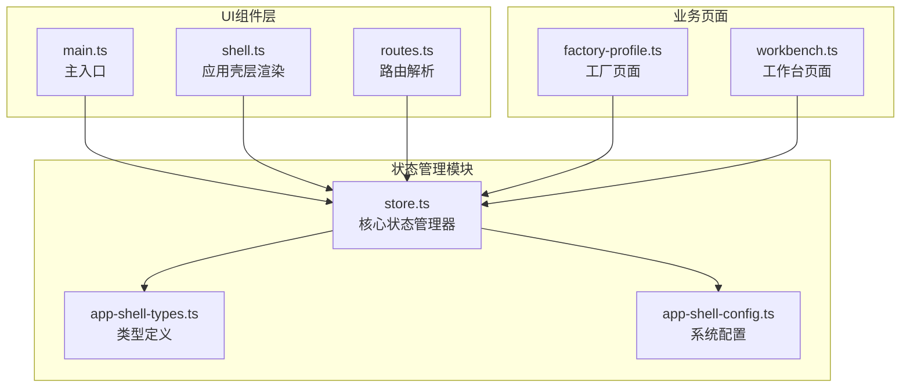
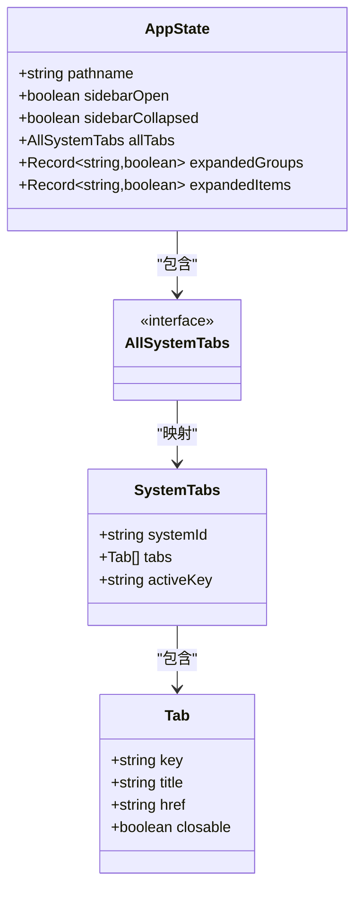
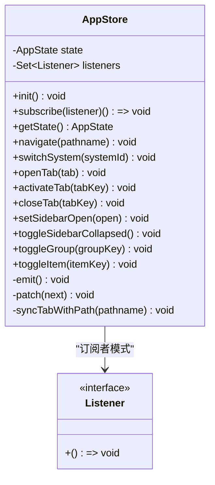
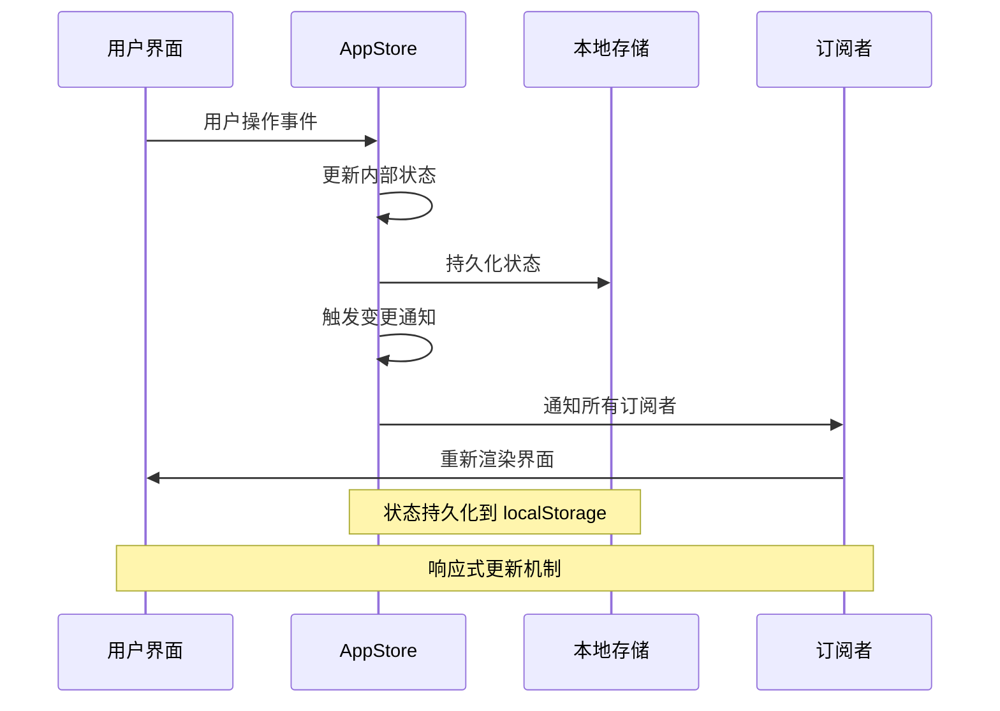
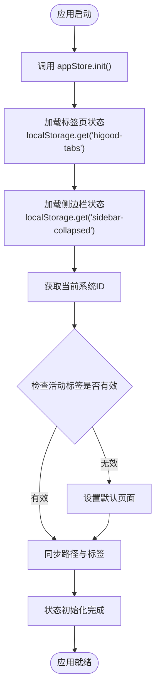
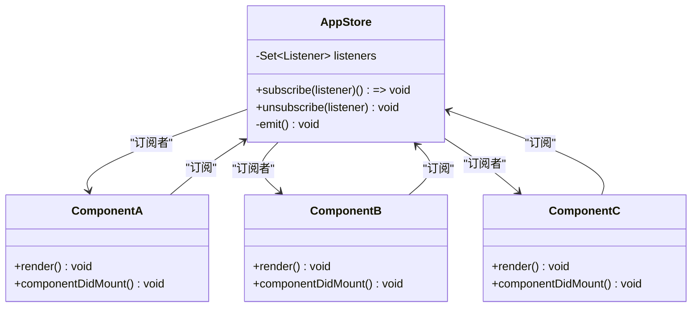
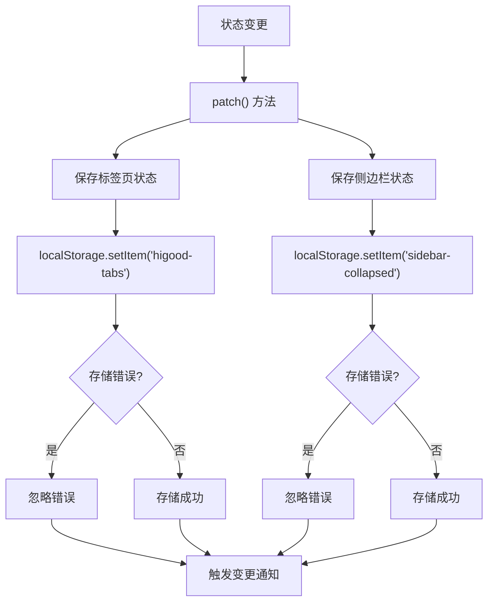
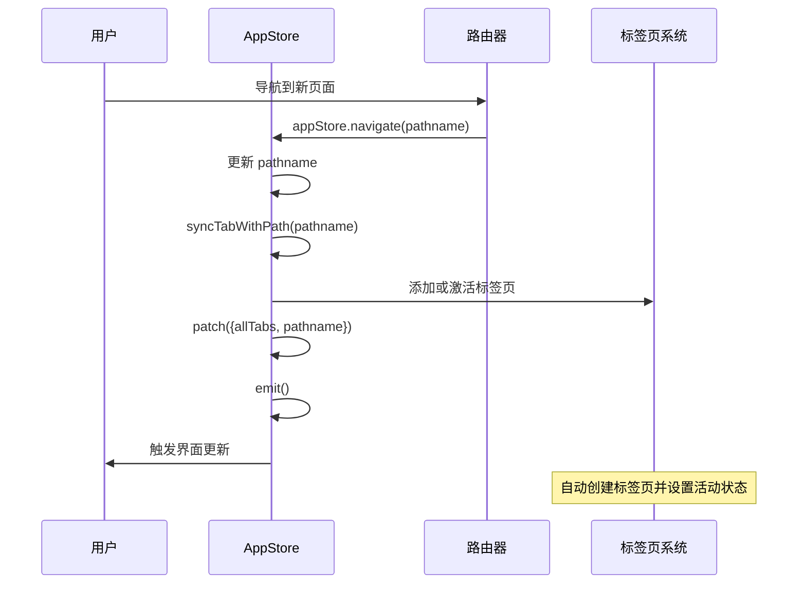
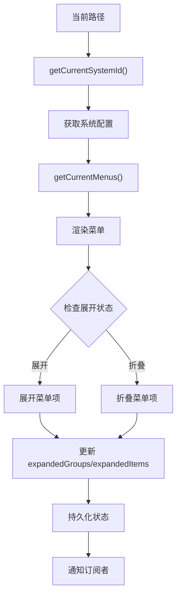
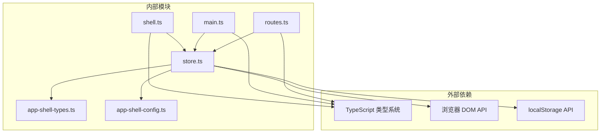

# 状态管理系统

<cite>
**本文档引用的文件**
- [store.ts](file://src/state/store.ts)
- [app-shell-types.ts](file://src/data/app-shell-types.ts)
- [app-shell-config.ts](file://src/data/app-shell-config.ts)
- [shell.ts](file://src/components/shell.ts)
- [main.ts](file://src/main.ts)
- [routes.ts](file://src/router/routes.ts)
- [factory-profile.ts](file://src/pages/factory-profile.ts)
</cite>

## 目录
1. [简介](#简介)
2. [项目结构](#项目结构)
3. [核心组件](#核心组件)
4. [架构概览](#架构概览)
5. [详细组件分析](#详细组件分析)
6. [依赖关系分析](#依赖关系分析)
7. [性能考虑](#性能考虑)
8. [故障排除指南](#故障排除指南)
9. [结论](#结论)

## 简介

状态管理系统是 HiGoods 应用的核心基础设施，负责管理整个应用的全局状态。该系统采用轻量级的 Flux 架构模式，实现了完整的状态管理、本地存储持久化和响应式更新机制。系统主要管理应用壳层（App Shell）的状态，包括路由导航、侧边栏状态、标签页管理和菜单展开状态等。

## 项目结构

状态管理系统位于 `src/state/` 目录下，核心文件为 `store.ts`，配合类型定义和配置文件共同构成完整的状态管理解决方案。



**图表来源**
- [store.ts:1-329](file://src/state/store.ts#L1-L329)
- [app-shell-types.ts:1-46](file://src/data/app-shell-types.ts#L1-L46)
- [app-shell-config.ts:1-355](file://src/data/app-shell-config.ts#L1-L355)

**章节来源**
- [store.ts:1-329](file://src/state/store.ts#L1-L329)
- [app-shell-types.ts:1-46](file://src/data/app-shell-types.ts#L1-L46)
- [app-shell-config.ts:1-355](file://src/data/app-shell-config.ts#L1-L355)

## 核心组件

### AppState 数据结构

AppState 是状态管理系统的根状态对象，定义了应用的所有可观察状态：



**图表来源**
- [store.ts:4-11](file://src/state/store.ts#L4-L11)
- [app-shell-types.ts:37-45](file://src/data/app-shell-types.ts#L37-L45)

### AppStore 类架构

AppStore 是状态管理的核心类，实现了完整的状态管理功能：



**图表来源**
- [store.ts:89-304](file://src/state/store.ts#L89-L304)

**章节来源**
- [store.ts:4-304](file://src/state/store.ts#L4-L304)
- [app-shell-types.ts:37-45](file://src/data/app-shell-types.ts#L37-L45)

## 架构概览

状态管理系统采用 Flux 架构模式，实现了单向数据流和响应式更新机制：



**图表来源**
- [store.ts:119-139](file://src/state/store.ts#L119-L139)
- [store.ts:50-56](file://src/state/store.ts#L50-L56)

## 详细组件分析

### 状态初始化流程

状态管理器在应用启动时进行初始化，确保用户界面与持久化状态保持一致：



**图表来源**
- [store.ts:101-117](file://src/state/store.ts#L101-L117)

### 订阅者模式实现

系统采用发布-订阅模式实现响应式更新：



**图表来源**
- [store.ts:119-124](file://src/state/store.ts#L119-L124)
- [main.ts:931-932](file://src/main.ts#L931-L932)

### 本地存储持久化机制

系统实现了完整的本地存储持久化功能：



**图表来源**
- [store.ts:50-56](file://src/state/store.ts#L50-L56)
- [store.ts:275-283](file://src/state/store.ts#L275-L283)

**章节来源**
- [store.ts:101-117](file://src/state/store.ts#L101-L117)
- [store.ts:119-139](file://src/state/store.ts#L119-L139)
- [store.ts:50-56](file://src/state/store.ts#L50-L56)
- [store.ts:275-283](file://src/state/store.ts#L275-L283)

### 标签页管理系统

标签页系统支持多系统标签页管理，实现了智能的标签页生命周期管理：



**图表来源**
- [store.ts:172-178](file://src/state/store.ts#L172-L178)
- [store.ts:141-170](file://src/state/store.ts#L141-L170)

**章节来源**
- [store.ts:172-269](file://src/state/store.ts#L172-L269)

### 菜单系统集成

系统与菜单系统深度集成，实现了智能的菜单状态管理：



**图表来源**
- [store.ts:58-81](file://src/state/store.ts#L58-L81)
- [store.ts:285-303](file://src/state/store.ts#L285-L303)

**章节来源**
- [store.ts:58-81](file://src/state/store.ts#L58-L81)
- [store.ts:285-303](file://src/state/store.ts#L285-L303)

## 依赖关系分析

状态管理系统与其他模块的依赖关系如下：



**图表来源**
- [store.ts:1-3](file://src/state/store.ts#L1-L3)
- [app-shell-types.ts:1-46](file://src/data/app-shell-types.ts#L1-L46)
- [app-shell-config.ts:1-18](file://src/data/app-shell-config.ts#L1-L18)

**章节来源**
- [store.ts:1-3](file://src/state/store.ts#L1-L3)
- [app-shell-types.ts:1-46](file://src/data/app-shell-types.ts#L1-L46)
- [app-shell-config.ts:1-18](file://src/data/app-shell-config.ts#L1-L18)

## 性能考虑

### 内存优化策略

1. **状态对象冻结**: 使用不可变更新模式，避免不必要的状态复制
2. **订阅者去重**: 使用 Set 数据结构存储订阅者，确保唯一性
3. **懒加载机制**: 系统配置按需加载，减少初始内存占用

### 渲染优化

1. **最小化重渲染**: 只有状态真正改变时才触发重新渲染
2. **批量更新**: 批量处理多个状态变更，减少渲染次数
3. **事件委托**: 在主入口使用事件委托，减少事件监听器数量

### 存储优化

1. **增量持久化**: 只保存必要的状态数据
2. **错误容错**: 存储失败不影响应用正常运行
3. **数据压缩**: 对复杂数据结构进行适当的序列化优化

## 故障排除指南

### 常见问题及解决方案

#### 状态不同步问题

**症状**: 页面刷新后状态丢失或显示异常

**诊断步骤**:
1. 检查 localStorage 是否可用
2. 验证状态初始化流程
3. 确认订阅者是否正确注册

**解决方案**:
```typescript
// 检查 localStorage 可用性
function checkLocalStorage(): boolean {
  try {
    const test = 'test';
    localStorage.setItem(test, test);
    localStorage.removeItem(test);
    return true;
  } catch (e) {
    return false;
  }
}

// 备份状态到 sessionStorage
if (!checkLocalStorage()) {
  // 使用 sessionStorage 作为后备方案
}
```

#### 性能问题

**症状**: 应用响应缓慢或频繁重渲染

**诊断工具**:
1. 使用浏览器开发者工具监控状态变更频率
2. 检查订阅者数量是否过多
3. 分析状态更新路径

**优化建议**:
1. 减少不必要的状态订阅
2. 实现状态分片管理
3. 使用防抖和节流机制

#### 订阅者泄漏

**症状**: 组件卸载后仍接收状态更新

**预防措施**:
```typescript
// 正确的订阅模式
const unsubscribe = appStore.subscribe(() => {
  // 组件逻辑
});

// 组件卸载时取消订阅
componentWillUnmount() {
  unsubscribe();
}
```

**章节来源**
- [store.ts:119-124](file://src/state/store.ts#L119-L124)
- [store.ts:50-56](file://src/state/store.ts#L50-L56)

## 结论

HiGoods 的状态管理系统是一个设计精良的轻量级状态管理解决方案。它通过以下关键特性实现了高效的状态管理：

1. **简洁的架构**: 基于 Flux 模式的简单实现，易于理解和维护
2. **完整的持久化**: 支持标签页和侧边栏状态的本地存储
3. **响应式更新**: 采用发布-订阅模式实现高效的 UI 更新
4. **类型安全**: 完整的 TypeScript 类型定义确保类型安全
5. **扩展性**: 模块化设计便于功能扩展和维护

该系统为 HiGoods 应用提供了稳定可靠的状态管理基础，支持复杂的多系统导航和标签页管理需求。通过合理的性能优化和错误处理机制，确保了应用在各种使用场景下的稳定性和用户体验。