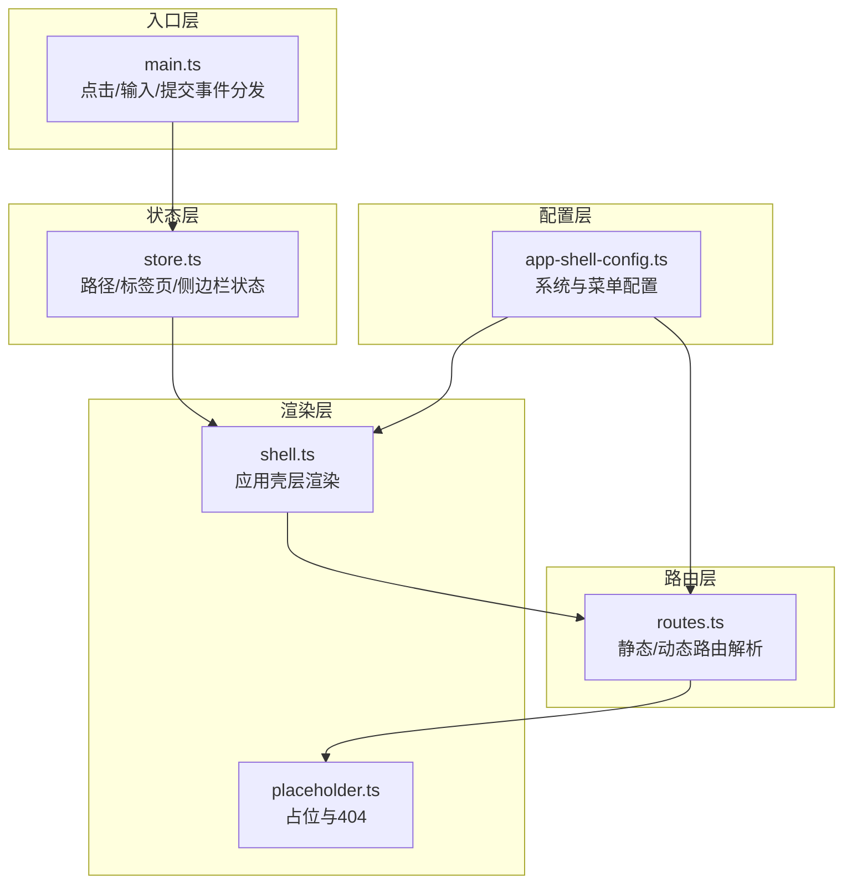
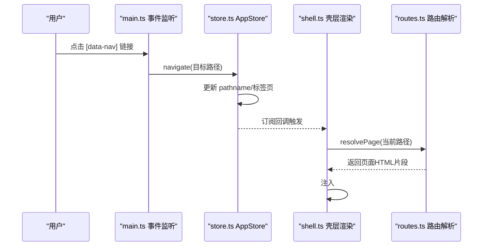
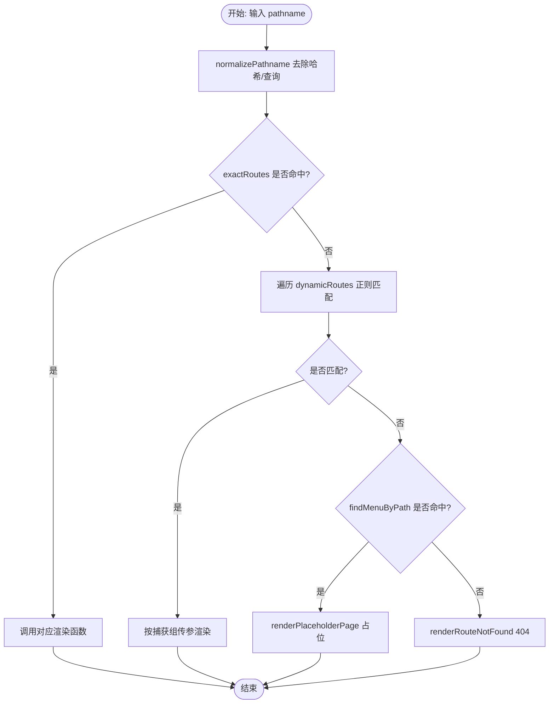
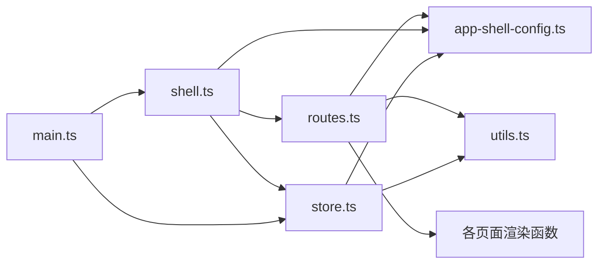

# 路由系统

<cite>
**本文引用的文件**
- [routes.ts](file://src/router/routes.ts)
- [app-shell-config.ts](file://src/data/app-shell-config.ts)
- [shell.ts](file://src/components/shell.ts)
- [store.ts](file://src/state/store.ts)
- [main.ts](file://src/main.ts)
- [placeholder.ts](file://src/pages/placeholder.ts)
- [utils.ts](file://src/utils.ts)
- [factory-profile.ts](file://src/pages/factory-profile.ts)
- [pcs-workspace-overview.ts](file://src/pages/pcs-workspace-overview.ts)
</cite>

## 目录
1. [引言](#引言)
2. [项目结构](#项目结构)
3. [核心组件](#核心组件)
4. [架构总览](#架构总览)
5. [详细组件分析](#详细组件分析)
6. [依赖关系分析](#依赖关系分析)
7. [性能考量](#性能考量)
8. [故障排查指南](#故障排查指南)
9. [结论](#结论)
10. [附录](#附录)

## 引言
本文件面向“路由系统”的技术文档，围绕 src/router/routes.ts 展开，系统性阐述静态路由配置与动态路由处理的实现机制、URL 解析到页面组件的映射过程、路由变化时的页面渲染与状态同步、最佳实践与调试方法。文档同时结合菜单配置、应用壳层渲染与状态管理，帮助开发者快速理解并扩展路由体系。

## 项目结构
路由系统位于 src/router/routes.ts，配合菜单配置 src/data/app-shell-config.ts、应用壳层渲染 src/components/shell.ts、状态管理 src/state/store.ts 以及入口事件分发 src/main.ts 共同构成完整的 SPA 导航与渲染闭环。

图表来源
- [routes.ts:108-453](file://src/router/routes.ts#L108-L453)
- [app-shell-config.ts:1-355](file://src/data/app-shell-config.ts#L1-L355)
- [shell.ts:1-200](file://src/components/shell.ts#L1-L200)
- [store.ts:1-200](file://src/state/store.ts#L1-L200)
- [main.ts:376-491](file://src/main.ts#L376-L491)

章节来源
- [routes.ts:108-453](file://src/router/routes.ts#L108-L453)
- [app-shell-config.ts:1-355](file://src/data/app-shell-config.ts#L1-L355)
- [shell.ts:1-200](file://src/components/shell.ts#L1-L200)
- [store.ts:1-200](file://src/state/store.ts#L1-L200)
- [main.ts:376-491](file://src/main.ts#L376-L491)

## 核心组件
- 路由解析器 resolvePage：负责将 URL 映射到具体页面渲染函数，按“精确匹配 → 动态匹配 → 菜单占位 → 404”顺序决策。
- 静态路由表 exactRoutes：键为精确路径，值为渲染函数，覆盖常用页面。
- 动态路由表 dynamicRoutes：基于正则表达式匹配参数化路径，支持多段参数与嵌套路径。
- 菜单联动 findMenuByPath：当 URL 未命中静态/动态路由但存在于菜单配置时，返回占位页。
- 占位与404：renderPlaceholderPage 与 renderRouteNotFound 提供一致的错误反馈体验。
- 状态与导航：appStore.navigate 触发路径变更与标签页同步；main.ts 捕获 [data-nav] 事件驱动导航。

章节来源
- [routes.ts:112-325](file://src/router/routes.ts#L112-L325)
- [routes.ts:327-404](file://src/router/routes.ts#L327-L404)
- [routes.ts:406-453](file://src/router/routes.ts#L406-L453)
- [placeholder.ts:1-33](file://src/pages/placeholder.ts#L1-L33)
- [store.ts:172-178](file://src/state/store.ts#L172-L178)
- [main.ts:388-394](file://src/main.ts#L388-L394)

## 架构总览
路由系统采用“配置驱动 + 渲染函数”的轻量 SPA 架构：
- URL 变更通过 appStore.navigate 推动状态更新；
- 应用壳层 shell.ts 基于当前路径与系统配置渲染菜单、标签页与主体内容；
- 路由解析器 routes.ts 将路径映射到页面渲染函数；
- 页面渲染函数返回字符串片段，由壳层注入 DOM；
- 未匹配路径进入菜单占位或 404 流程，确保一致性体验。

图表来源
- [main.ts:388-394](file://src/main.ts#L388-L394)
- [store.ts:172-178](file://src/state/store.ts#L172-L178)
- [shell.ts:1-200](file://src/components/shell.ts#L1-L200)
- [routes.ts:428-453](file://src/router/routes.ts#L428-L453)

## 详细组件分析

### 路由解析器与映射机制
- normalizePathname：剥离哈希与查询参数，保证匹配一致性。
- exactRoutes：精确路径映射，适合固定页面与工作台入口。
- dynamicRoutes：正则参数化路由，支持多段参数与嵌套层级。
- findMenuByPath：在菜单配置中查找匹配项，用于“已接入菜单但未迁移UI”的占位。
- resolvePage：串联上述逻辑，形成“精确 → 动态 → 占位 → 404”的决策流。

图表来源
- [routes.ts:108-110](file://src/router/routes.ts#L108-L110)
- [routes.ts:428-453](file://src/router/routes.ts#L428-L453)

章节来源
- [routes.ts:108-110](file://src/router/routes.ts#L108-L110)
- [routes.ts:112-325](file://src/router/routes.ts#L112-L325)
- [routes.ts:327-404](file://src/router/routes.ts#L327-L404)
- [routes.ts:406-453](file://src/router/routes.ts#L406-L453)

### 静态路由映射
- 结构：exactRoutes 为 Record<string, RouteRenderer>，键为标准化后的路径，值为无参渲染函数。
- 特点：O(1) 查找，适合高频访问的固定页面。
- 维护：新增页面只需在 routes.ts 中注册路径与渲染函数，并在 app-shell-config.ts 中补充菜单项以获得导航与占位能力。

章节来源
- [routes.ts:112-325](file://src/router/routes.ts#L112-L325)
- [app-shell-config.ts:21-355](file://src/data/app-shell-config.ts#L21-L355)

### 动态路由匹配
- 结构：dynamicRoutes 为数组，元素含 pattern 与 render。
- 匹配：逐个执行 pattern.exec，命中后按捕获组传参给渲染函数。
- 参数传递：match[1], match[2] 等按正则分组顺序传入，支持多段参数与嵌套路径。
- 示例场景：详情页、编辑页、带工厂ID/订单ID/任务ID等参数的页面。

章节来源
- [routes.ts:327-404](file://src/router/routes.ts#L327-L404)

### 菜单联动与占位页
- findMenuByPath：在 menusBySystem 中查找匹配项，支持子菜单匹配。
- 占位页：当 URL 存在于菜单但尚未迁移完整 UI 时，返回统一占位结构，提示“待迁移完整 UI 与交互”。

章节来源
- [routes.ts:406-426](file://src/router/routes.ts#L406-L426)
- [app-shell-config.ts:21-355](file://src/data/app-shell-config.ts#L21-L355)
- [placeholder.ts:1-33](file://src/pages/placeholder.ts#L1-L33)

### 页面渲染与生命周期
- 渲染入口：resolvePage 返回的 HTML 字符串由 shell.ts 注入 #app。
- 生命周期：页面组件内部维护自身状态与事件处理器，通过 main.ts 的事件分发与 store.ts 的状态更新实现交互。
- 状态同步：appStore.navigate 会同步标签页状态，确保菜单高亮与标签页激活一致。

章节来源
- [shell.ts:1-200](file://src/components/shell.ts#L1-L200)
- [store.ts:141-170](file://src/state/store.ts#L141-L170)
- [main.ts:376-491](file://src/main.ts#L376-L491)

### 导航事件与参数化页面
- 导航触发：main.ts 监听点击事件，识别 [data-nav] 属性并调用 appStore.navigate。
- 参数化页面：动态路由通过正则捕获参数，渲染函数接收参数并渲染对应详情/编辑界面。
- 示例：PDA 通知详情、任务详情、结算单详情等均通过动态路由实现参数传递。

章节来源
- [main.ts:388-394](file://src/main.ts#L388-L394)
- [routes.ts:388-403](file://src/router/routes.ts#L388-L403)
- [pcs-workspace-overview.ts:450-649](file://src/pages/pcs-workspace-overview.ts#L450-L649)

## 依赖关系分析
- routes.ts 依赖：
  - app-shell-config.ts：menusBySystem 用于菜单占位与路径查找。
  - 各页面渲染函数：如 renderPcsOverviewPage、renderFactoryProfilePage 等。
  - utils.ts：escapeHtml 用于安全输出。
- shell.ts 依赖：
  - routes.ts：resolvePage 生成页面内容。
  - app-shell-config.ts 与 store.ts：获取当前系统与菜单、标签页状态。
- store.ts 依赖：
  - app-shell-config.ts：系统与菜单数据。
  - utils.ts：路径规范化。
- main.ts 依赖：
  - store.ts：导航与状态管理。
  - 各页面事件处理器：统一事件分发。

图表来源
- [routes.ts:1-104](file://src/router/routes.ts#L1-L104)
- [shell.ts:1-12](file://src/components/shell.ts#L1-L12)
- [store.ts:1-11](file://src/state/store.ts#L1-L11)
- [main.ts:1-231](file://src/main.ts#L1-L231)
- [utils.ts:1-18](file://src/utils.ts#L1-L18)

章节来源
- [routes.ts:1-104](file://src/router/routes.ts#L1-L104)
- [shell.ts:1-12](file://src/components/shell.ts#L1-L12)
- [store.ts:1-11](file://src/state/store.ts#L1-L11)
- [main.ts:1-231](file://src/main.ts#L1-L231)
- [utils.ts:1-18](file://src/utils.ts#L1-L18)

## 性能考量
- 静态路由 O(1) 查找，建议将高频页面放入 exactRoutes。
- 动态路由按序匹配，建议将常见模式前置，减少整体匹配次数。
- 正则表达式避免过度复杂，确保可读性与性能平衡。
- 占位页与404采用统一模板，降低重复逻辑与渲染成本。
- 标签页状态持久化至本地存储，减少初始化开销。

## 故障排查指南
- 路由未命中：
  - 检查 URL 是否包含哈希或查询参数，normalizePathname 已剥离，但需确认是否符合预期。
  - 在 menusBySystem 中是否存在该路径，若存在则会走占位流程。
  - 使用 renderRouteNotFound 输出的原始路径定位问题。
- 动态路由参数为空：
  - 确认正则捕获组数量与渲染函数参数数量一致。
  - 检查 URL 结构是否与 pattern 完全匹配。
- 导航无效：
  - 确认元素是否带有 [data-nav] 属性且值为有效路径。
  - 检查 appStore.navigate 是否被正确调用。
- 标签页不同步：
  - 检查 syncTabWithPath 是否被触发，以及 findMenuItemByPath 是否能解析到菜单项。

章节来源
- [routes.ts:108-110](file://src/router/routes.ts#L108-L110)
- [routes.ts:406-453](file://src/router/routes.ts#L406-L453)
- [store.ts:141-170](file://src/state/store.ts#L141-L170)
- [main.ts:388-394](file://src/main.ts#L388-L394)

## 结论
本路由系统以“配置驱动 + 渲染函数”为核心，通过精确与动态路由组合，实现从 URL 到页面组件的高效映射；结合菜单联动与占位页，确保新接入页面的一致体验；配合状态管理与壳层渲染，完成导航、标签页与内容的同步更新。遵循本文最佳实践与调试指南，可快速扩展复杂路由结构并保持系统稳定性。

## 附录

### 新增路由规则与页面组件步骤
- 在 routes.ts 中：
  - 若为固定页面，添加到 exactRoutes；若为参数化页面，添加到 dynamicRoutes。
  - 确保渲染函数已导入并在 routes.ts 中可用。
- 在 app-shell-config.ts 中：
  - 在对应系统菜单组中添加菜单项，确保 href 与路由一致。
- 在页面组件中：
  - 实现 renderXxxPage 并返回 HTML 字符串；必要时实现事件处理器与状态管理。
- 在 main.ts 中：
  - 如需在页面内响应导航，确保 [data-nav] 元素正确绑定。

章节来源
- [routes.ts:1-104](file://src/router/routes.ts#L1-L104)
- [app-shell-config.ts:21-355](file://src/data/app-shell-config.ts#L21-L355)
- [main.ts:388-394](file://src/main.ts#L388-L394)