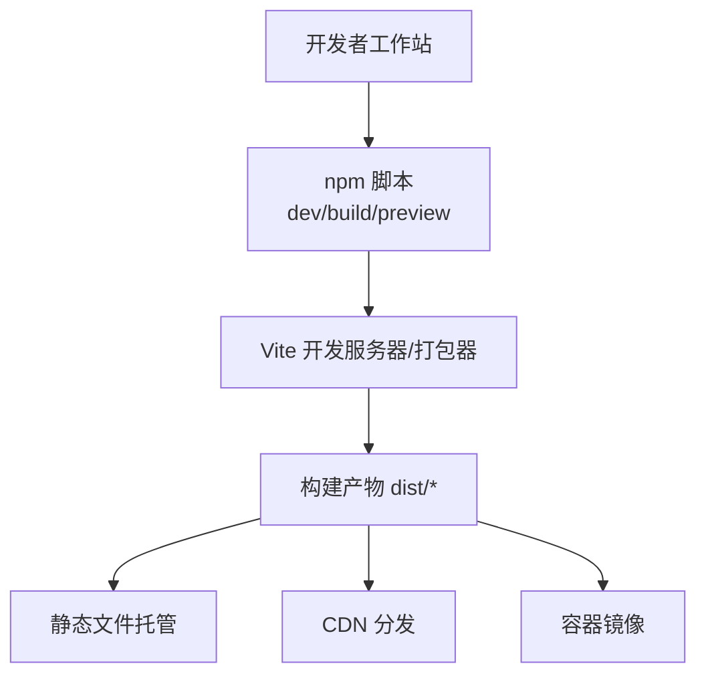
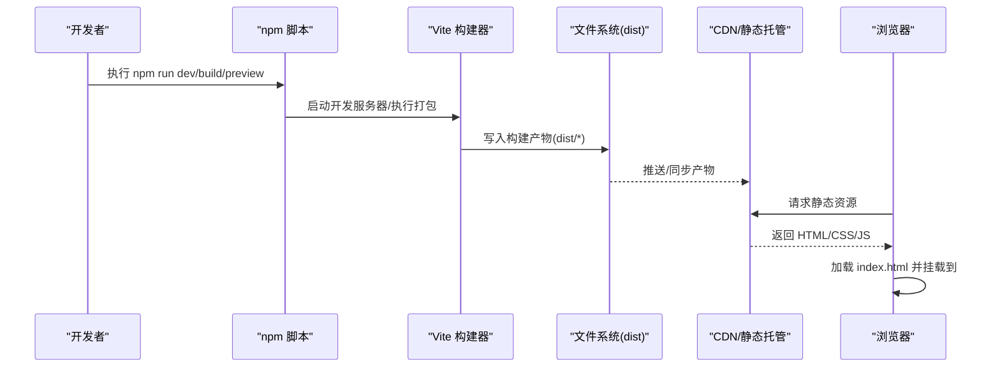
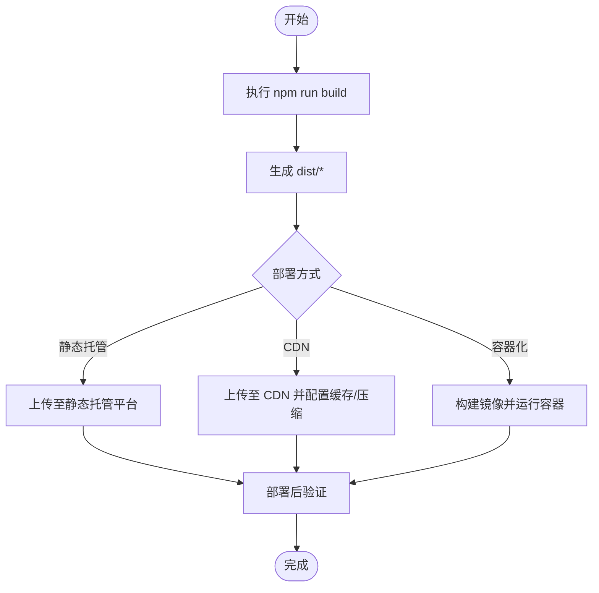
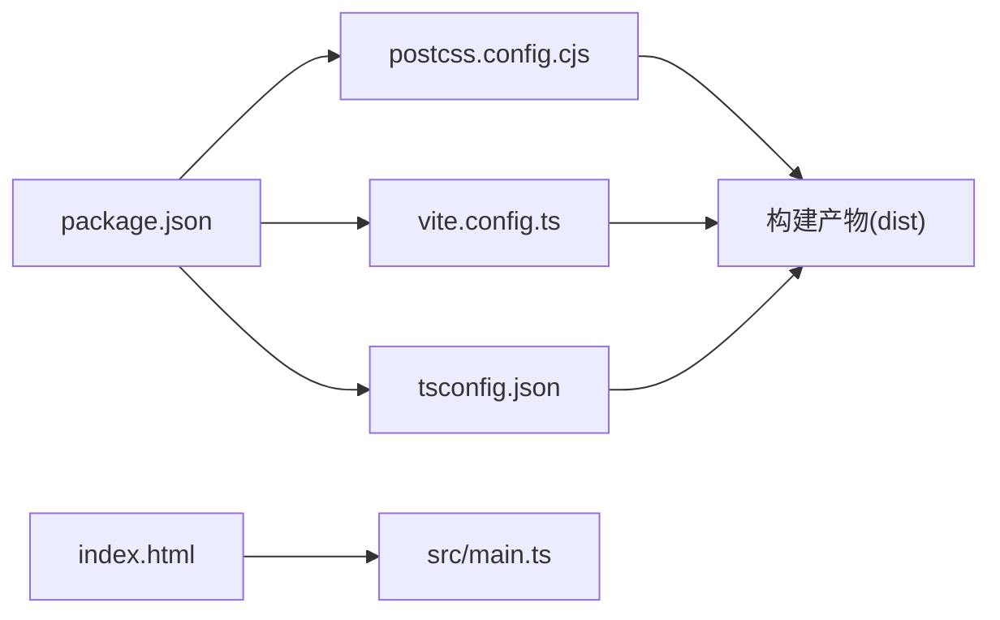

# 部署指南

<cite>
**本文引用的文件**
- [vite.config.ts](file://vite.config.ts)
- [package.json](file://package.json)
- [index.html](file://index.html)
- [postcss.config.cjs](file://postcss.config.cjs)
- [tsconfig.json](file://tsconfig.json)
- [src/main.ts](file://src/main.ts)
</cite>

## 目录
1. [简介](#简介)
2. [项目结构](#项目结构)
3. [核心组件](#核心组件)
4. [架构总览](#架构总览)
5. [详细组件分析](#详细组件分析)
6. [依赖分析](#依赖分析)
7. [性能考虑](#性能考虑)
8. [故障排查指南](#故障排查指南)
9. [结论](#结论)
10. [附录](#附录)

## 简介
本指南面向 higoods 项目的部署与上线，覆盖从本地开发到生产环境的全流程：构建配置、资源压缩与代码分割策略、多环境配置差异、多种部署方式（静态托管、CDN、容器化）、环境变量管理、域名与 HTTPS 设置、部署后验证与监控，以及常见问题排查。文档严格基于仓库现有配置文件进行分析与说明。

## 项目结构
higoods 是一个基于 Vite 的前端项目，采用原生 TypeScript 与模块化组织页面与状态逻辑。关键目录与文件如下：
- 构建与脚本：通过 Vite 进行开发与打包，使用 npm 脚本统一入口
- 样式工具链：PostCSS + TailwindCSS 插件链
- 入口与页面：HTML 入口挂载点与 TypeScript 应用入口负责渲染与事件分发
- 类型与编译：TypeScript 编译配置约束模块解析与目标环境

图表来源
- [package.json:6-10](file://package.json#L6-L10)
- [vite.config.ts:1-8](file://vite.config.ts#L1-L8)
- [postcss.config.cjs:1-7](file://postcss.config.cjs#L1-L7)

章节来源
- [package.json:1-23](file://package.json#L1-L23)
- [vite.config.ts:1-8](file://vite.config.ts#L1-L8)
- [postcss.config.cjs:1-7](file://postcss.config.cjs#L1-L7)
- [tsconfig.json:1-18](file://tsconfig.json#L1-L18)

## 核心组件
- 构建与打包
  - 使用 Vite 作为构建与预览工具，提供开发服务器与生产打包能力
  - npm 脚本统一入口：dev、build、preview
- 样式处理
  - PostCSS 配置启用 TailwindCSS 插件与自动前缀器，确保跨浏览器兼容与原子化样式输出
- 应用入口
  - HTML 提供根节点挂载点，TS 入口负责初始化状态、渲染壳层、注册事件监听与表单提交处理
- 类型与模块解析
  - TypeScript 配置采用 Bundler 模块解析，目标 ES2022，启用严格模式与隔离模块，提升构建稳定性

章节来源
- [package.json:6-10](file://package.json#L6-L10)
- [postcss.config.cjs:1-7](file://postcss.config.cjs#L1-L7)
- [index.html:1-13](file://index.html#L1-L13)
- [src/main.ts:1-10](file://src/main.ts#L1-L10)
- [tsconfig.json:1-18](file://tsconfig.json#L1-L18)

## 架构总览
下图展示从源码到生产部署的关键路径：开发调试、构建打包、产物分发与运行时加载。

图表来源
- [package.json:6-10](file://package.json#L6-L10)
- [vite.config.ts:1-8](file://vite.config.ts#L1-L8)
- [index.html:1-13](file://index.html#L1-L13)

## 详细组件分析

### 构建配置与优化
- Vite 基础配置
  - 开发服务器端口默认 5173，便于本地联调
  - 可扩展：如需自定义代理、输出目录、资源路径等，可在现有配置中追加字段
- 构建脚本
  - dev：启动开发服务器
  - build：生成生产构建产物
  - preview：本地预览生产包
- 样式链路
  - PostCSS 插件链启用 TailwindCSS 与 autoprefixer，确保产物体积可控且兼容目标浏览器
- TypeScript 目标与模块解析
  - ES2022 目标与 Bundler 解析，有助于 Tree-Shaking 与按需打包

建议的优化方向（基于现有配置可扩展）：
- 代码分割：利用 Vite 的动态导入与路由级懒加载，减少首屏体积
- 资源压缩：开启最小化与压缩（如 terser 或 esbuild），并配置资源内联阈值
- 输出目录与公共路径：根据部署路径调整 base 与 outDir，避免运行时资源 404
- 预加载与预取：对关键路由与资源使用 <link rel="prefetch/preload">

章节来源
- [vite.config.ts:1-8](file://vite.config.ts#L1-L8)
- [package.json:6-10](file://package.json#L6-L10)
- [postcss.config.cjs:1-7](file://postcss.config.cjs#L1-L7)
- [tsconfig.json:1-18](file://tsconfig.json#L1-L18)

### 部署流程（从构建到生产）
- 本地构建
  - 执行 npm run build，生成 dist 目录
- 静态托管
  - 将 dist 目录内容上传至任意静态托管平台（如 GitHub Pages、Vercel、Netlify、对象存储直传）
  - 确保根路径正确，HTML 重写规则按需配置
- CDN 分发
  - 将 dist 上传至 CDN，配置缓存头与压缩策略；确保 index.html 与资源路径一致
- 容器化部署
  - 使用 Nginx/Alpine 镜像作为静态服务容器，挂载 dist 目录并暴露 80 端口
  - 在容器编排中配置健康检查与副本数

图表来源
- [package.json:6-10](file://package.json#L6-L10)

章节来源
- [package.json:6-10](file://package.json#L6-L10)

### 多环境配置差异（开发/测试/生产）
- 开发环境
  - 使用 Vite 开发服务器，端口 5173；热更新与源码映射便于调试
- 测试环境
  - 以 npm run build 产出测试包，部署至独立域名或子路径，便于端到端测试
- 生产环境
  - 产物经 CDN/静态托管分发，配置强缓存与压缩；确保 HTTPS 与安全响应头

注意：当前仓库未提供环境变量文件或环境区分脚本，建议在 CI 中注入环境变量并在构建前注入到 HTML 或 JS 中（例如通过 Vite 环境变量机制）。

章节来源
- [vite.config.ts:1-8](file://vite.config.ts#L1-L8)
- [package.json:6-10](file://package.json#L6-L10)

### 环境变量与敏感信息管理
- 注入方式
  - 通过 Vite 环境变量机制在构建期注入（如 VITE_ 前缀），避免硬编码到客户端
- 安全实践
  - 不在客户端暴露任何后端密钥；仅注入前端可见的只读配置
  - 在 CI 中使用受保护变量，避免日志泄露
- 运行时访问
  - 在应用中通过 import.meta.env 访问对应键值

章节来源
- [vite.config.ts:1-8](file://vite.config.ts#L1-L8)
- [package.json:6-10](file://package.json#L6-L10)

### 域名与 HTTPS 设置
- 域名与路径
  - 若部署于子路径，需在构建配置中设置 base 与 outDir，并保证 index.html 引用的资源路径正确
- HTTPS
  - 静态托管平台通常默认启用 HTTPS；若自建容器/Nginx，请配置 TLS 证书与强制跳转
- 资源路径
  - 确保 index.html 中的 script 与静态资源路径与部署路径一致，避免 404

章节来源
- [index.html:1-13](file://index.html#L1-L13)
- [vite.config.ts:1-8](file://vite.config.ts#L1-L8)

### 部署后验证与监控
- 功能验证
  - 打开首页，确认 #app 节点已渲染；交互事件是否正常触发
- 性能验证
  - 使用浏览器性能面板查看首屏时间、资源大小与请求数
- 可用性验证
  - 在不同网络与设备上验证加载与交互
- 监控建议
  - 静态托管平台自带访问日志；结合 CDN 的错误率与回源统计
  - 如需前端埋点，可在应用入口处接入轻量监控 SDK

章节来源
- [index.html:1-13](file://index.html#L1-L13)
- [src/main.ts:232-332](file://src/main.ts#L232-L332)

## 依赖分析
- 构建链路
  - npm 脚本 → Vite → PostCSS/TailwindCSS → 浏览器
- 关键耦合点
  - index.html 与 src/main.ts 的挂载关系决定运行时入口
  - tsconfig.json 的模块解析影响打包器的 Tree-Shaking 效果

图表来源
- [package.json:1-23](file://package.json#L1-L23)
- [vite.config.ts:1-8](file://vite.config.ts#L1-L8)
- [postcss.config.cjs:1-7](file://postcss.config.cjs#L1-L7)
- [tsconfig.json:1-18](file://tsconfig.json#L1-L18)
- [index.html:1-13](file://index.html#L1-L13)
- [src/main.ts:1-10](file://src/main.ts#L1-L10)

章节来源
- [package.json:1-23](file://package.json#L1-L23)
- [vite.config.ts:1-8](file://vite.config.ts#L1-L8)
- [postcss.config.cjs:1-7](file://postcss.config.cjs#L1-L7)
- [tsconfig.json:1-18](file://tsconfig.json#L1-L18)
- [index.html:1-13](file://index.html#L1-L13)
- [src/main.ts:1-10](file://src/main.ts#L1-L10)

## 性能考虑
- 代码分割
  - 对大型页面与路由采用动态导入，降低首屏 JS 体积
- 资源压缩
  - 启用最小化与压缩（如 esbuild/terser），并合理设置图片/字体压缩策略
- 缓存策略
  - 对静态资源设置长缓存，对 index.html 设置短缓存或不缓存
- 预加载与预取
  - 对关键路由与资源使用 <link rel="prefetch/preload">，缩短首屏等待
- 样式体积
  - 保持 TailwindCSS 的按需特性，避免引入未使用的类名

## 故障排查指南
- 构建失败
  - 检查 Node 版本是否满足 Vite peerDependencies 要求
  - 清理 node_modules 与锁文件后重装依赖
- 预览或运行异常
  - 确认 index.html 中的 script 路径与实际产物一致
  - 检查 src/main.ts 是否成功挂载到 #app 节点
- 静态托管 404
  - 确认部署根路径与资源相对路径匹配；必要时配置 HTML 重写规则
- HTTPS 与混合内容
  - 确保所有资源均通过 HTTPS 加载，避免混合内容警告
- 环境变量未生效
  - 确认变量名以 VITE_ 前缀命名，并在构建前注入

章节来源
- [package.json:19-21](file://package.json#L19-L21)
- [index.html:1-13](file://index.html#L1-L13)
- [src/main.ts:232-332](file://src/main.ts#L232-L332)

## 结论
higoods 当前以 Vite 为核心构建工具，配合 PostCSS/TailwindCSS 实现样式管线，具备良好的可扩展性。按照本指南的构建配置、多环境差异、部署方式与安全设置，可稳定地将应用交付到生产环境。建议在 CI 中完善环境变量注入与自动化验证流程，持续保障发布质量。

## 附录
- 快速命令参考
  - 开发：npm run dev
  - 构建：npm run build
  - 预览：npm run preview
- 建议的后续增强
  - 在 vite.config.ts 中增加 base/outDir 与插件扩展
  - 在 CI 中集成 Lighthouse 或类似工具进行性能回归检测
  - 在容器中加入健康检查与日志采集