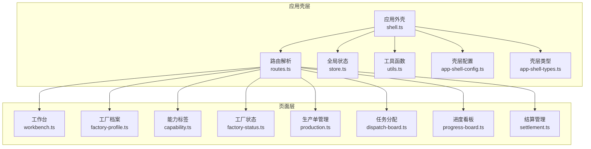
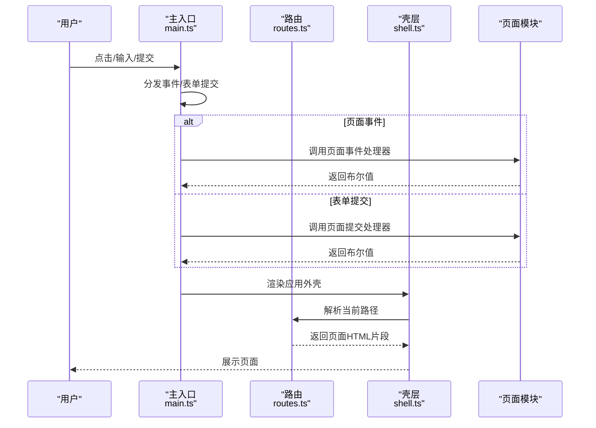
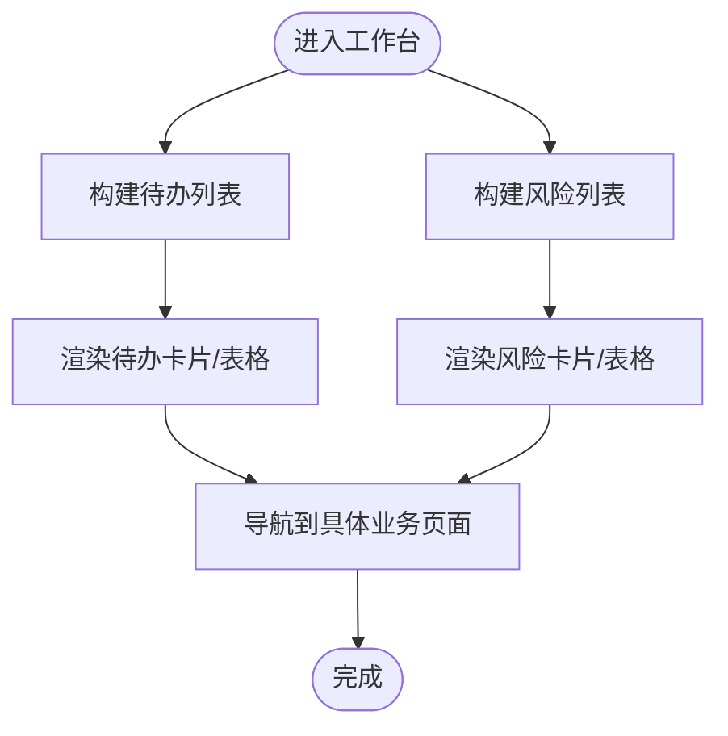
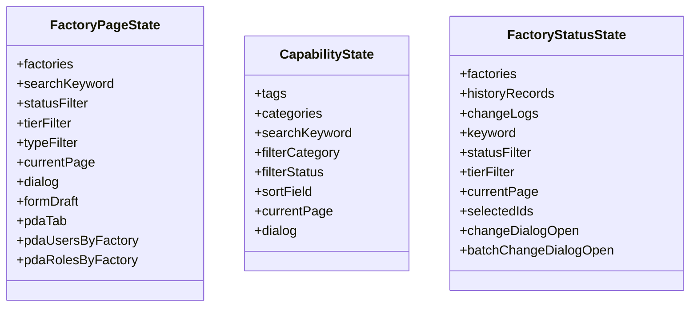
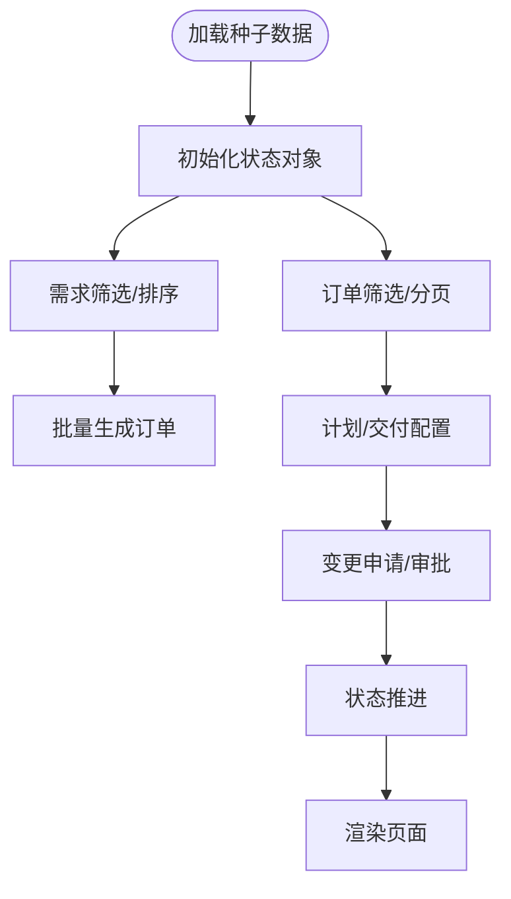
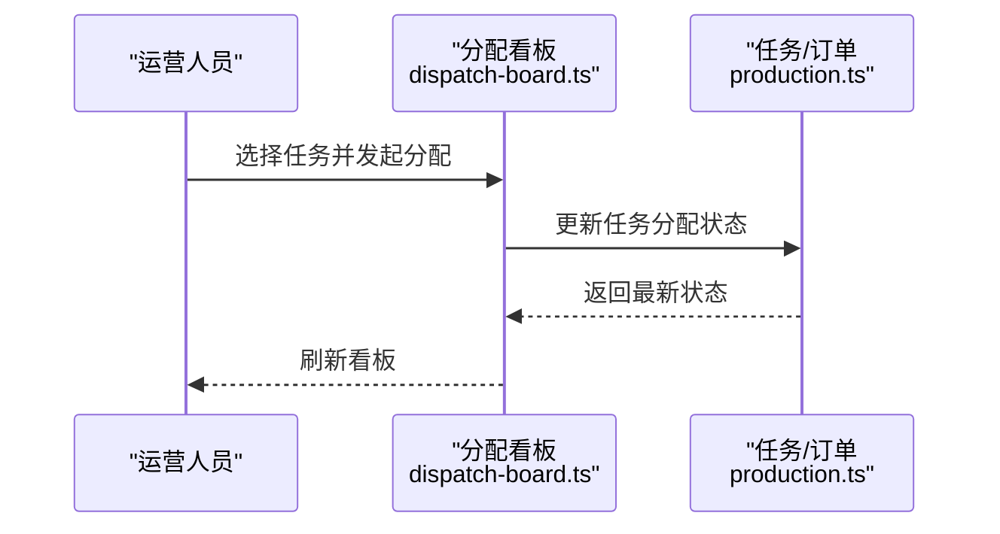
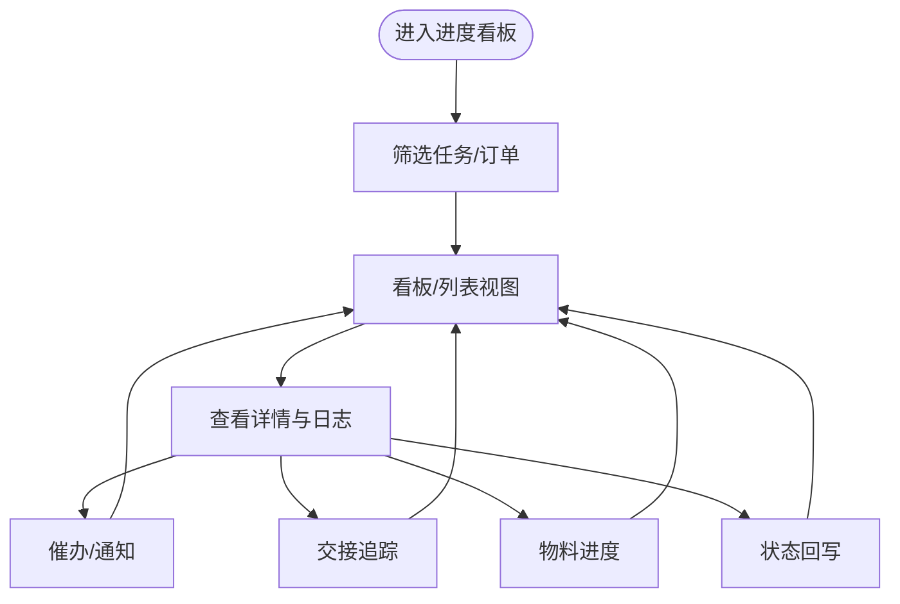
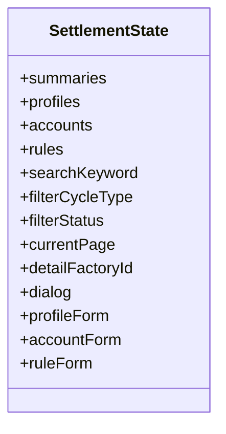
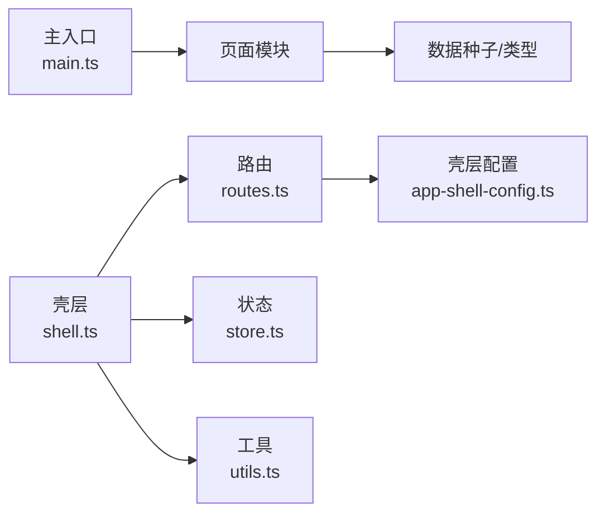

# FCS 工厂生产协同系统

<cite>
**本文档引用的文件**
- [src/main.ts](file://src/main.ts)
- [src/router/routes.ts](file://src/router/routes.ts)
- [src/state/store.ts](file://src/state/store.ts)
- [src/components/shell.ts](file://src/components/shell.ts)
- [src/utils.ts](file://src/utils.ts)
- [src/data/app-shell-config.ts](file://src/data/app-shell-config.ts)
- [src/data/app-shell-types.ts](file://src/data/app-shell-types.ts)
- [src/pages/workbench.ts](file://src/pages/workbench.ts)
- [src/pages/production.ts](file://src/pages/production.ts)
- [src/pages/settlement.ts](file://src/pages/settlement.ts)
- [src/pages/progress-board.ts](file://src/pages/progress-board.ts)
- [src/pages/dispatch-board.ts](file://src/pages/dispatch-board.ts)
- [src/pages/factory-profile.ts](file://src/pages/factory-profile.ts)
- [src/pages/capability.ts](file://src/pages/capability.ts)
- [src/pages/factory-status.ts](file://src/pages/factory-status.ts)
</cite>

## 目录
1. [引言](#引言)
2. [项目结构](#项目结构)
3. [核心组件](#核心组件)
4. [架构总览](#架构总览)
5. [详细组件分析](#详细组件分析)
6. [依赖分析](#依赖分析)
7. [性能考虑](#性能考虑)
8. [故障排除指南](#故障排除指南)
9. [结论](#结论)
10. [附录](#附录)

## 引言
本文件为 FCS 工厂生产协同系统的技术文档，面向开发与运维人员，系统性阐述整体架构、核心功能模块（工作台系统、工厂管理、生产单管理、任务编排、调度分配、进度跟踪、质量管理、结算管理等）、数据流与组件协作关系，并提供关键页面组件的实现模式与最佳实践。同时覆盖系统配置、权限控制与安全注意事项、故障排除与性能优化建议。

## 项目结构
FCS 基于轻量前端架构，采用“壳层 + 页面 + 数据”的分层组织：
- 应用壳层：应用外壳、路由、状态管理与通用工具
- 页面层：各业务模块页面（工作台、工厂、生产、调度、进度、质量、结算等）
- 数据层：业务数据与类型定义（工厂、生产单、任务、结算等）

图表来源
- [src/components/shell.ts:292-311](file://src/components/shell.ts#L292-L311)
- [src/router/routes.ts:112-325](file://src/router/routes.ts#L112-L325)
- [src/state/store.ts:89-304](file://src/state/store.ts#L89-L304)
- [src/data/app-shell-config.ts:21-355](file://src/data/app-shell-config.ts#L21-L355)
- [src/data/app-shell-types.ts:6-46](file://src/data/app-shell-types.ts#L6-L46)

章节来源
- [src/main.ts:1-933](file://src/main.ts#L1-L933)
- [src/router/routes.ts:1-454](file://src/router/routes.ts#L1-L454)
- [src/state/store.ts:1-329](file://src/state/store.ts#L1-L329)
- [src/components/shell.ts:1-324](file://src/components/shell.ts#L1-L324)
- [src/utils.ts:1-18](file://src/utils.ts#L1-L18)
- [src/data/app-shell-config.ts:1-355](file://src/data/app-shell-config.ts#L1-L355)
- [src/data/app-shell-types.ts:1-46](file://src/data/app-shell-types.ts#L1-L46)

## 核心组件
- 应用外壳与路由
  - 应用外壳负责顶部栏、侧边菜单、标签页与主内容区域渲染；路由解析根据路径返回对应页面 HTML 片段。
  - 路由支持精确匹配与动态参数，涵盖 FCS 主业务域与部分预留域。
- 全局状态管理
  - 维护当前路径、侧边栏状态、标签页集合、系统切换与菜单展开状态；提供订阅与变更通知。
- 页面事件分发与表单提交
  - 主入口监听点击、输入、变更与提交事件，按目标页面模块分发处理，触发重新渲染。
- 工具与配置
  - 提供 HTML 转义、类名拼接、日期格式化等工具；壳层配置集中定义系统与菜单结构。

章节来源
- [src/main.ts:242-491](file://src/main.ts#L242-L491)
- [src/router/routes.ts:428-454](file://src/router/routes.ts#L428-L454)
- [src/state/store.ts:89-329](file://src/state/store.ts#L89-L329)
- [src/components/shell.ts:292-324](file://src/components/shell.ts#L292-L324)
- [src/utils.ts:1-18](file://src/utils.ts#L1-L18)
- [src/data/app-shell-config.ts:21-355](file://src/data/app-shell-config.ts#L21-L355)

## 架构总览
FCS 采用“前端单页应用 + 本地数据模拟”的架构：页面通过路由解析生成内容，状态通过全局 store 管理，事件通过主入口统一分发。页面内部通过状态对象维护视图状态，配合工具函数与数据种子完成渲染与交互。

图表来源
- [src/main.ts:242-491](file://src/main.ts#L242-L491)
- [src/router/routes.ts:428-454](file://src/router/routes.ts#L428-L454)
- [src/components/shell.ts:292-311](file://src/components/shell.ts#L292-L311)

## 详细组件分析

### 工作台系统（概览、待办、风险）
- 功能要点
  - 概览看板：统计生产任务、质检、争议、结算等核心指标，展示近期质检与结算事项。
  - 我的待办：按类型聚合待处理事项（判责、结案、仲裁、对账单生成、门禁阻断等）。
  - 风险提醒：识别门禁阻断、争议冻结、质检超期、返工未完成、对账单滞留等风险。
- 实现模式
  - 使用种子数据构建统计与列表，通过状态对象维护筛选与排序，渲染卡片与表格。
  - 通过导航按钮跳转到具体业务页面，保持统一的壳层与标签页体验。
- 关键路径
  - [工作台概览:316-447](file://src/pages/workbench.ts#L316-L447)
  - [我的待办:449-507](file://src/pages/workbench.ts#L449-L507)
  - [风险提醒:509-567](file://src/pages/workbench.ts#L509-L567)

图表来源
- [src/pages/workbench.ts:125-314](file://src/pages/workbench.ts#L125-L314)

章节来源
- [src/pages/workbench.ts:1-582](file://src/pages/workbench.ts#L1-L582)

### 工厂管理（档案、能力标签、状态、绩效、结算）
- 工厂档案
  - 支持搜索、筛选、分页、创建/编辑/删除对话框；集成 PDA 用户与角色管理。
  - 关键路径：[工厂档案页面:137-163](file://src/pages/factory-profile.ts#L137-L163)
- 能力标签
  - 标签与分类管理，支持启用/禁用、排序与分页；提供表单校验与错误提示。
  - 关键路径：[能力标签页面:51-76](file://src/pages/capability.ts#L51-L76)
- 工厂状态
  - 工厂状态变更、批量变更、历史记录与操作日志；支持原因与备注。
  - 关键路径：[工厂状态页面:127-154](file://src/pages/factory-status.ts#L127-L154)

图表来源
- [src/pages/factory-profile.ts:50-163](file://src/pages/factory-profile.ts#L50-L163)
- [src/pages/capability.ts:24-76](file://src/pages/capability.ts#L24-L76)
- [src/pages/factory-status.ts:50-154](file://src/pages/factory-status.ts#L50-L154)

章节来源
- [src/pages/factory-profile.ts:1-1880](file://src/pages/factory-profile.ts#L1-L1880)
- [src/pages/capability.ts:1-988](file://src/pages/capability.ts#L1-L988)
- [src/pages/factory-status.ts:1-986](file://src/pages/factory-status.ts#L1-L986)

### 生产单管理（需求、订单、计划、交付仓、变更、状态、字典）
- 功能要点
  - 生产需求接收：关键词、状态、技术档状态、优先级、工厂筛选与批量生成。
  - 订单管理：订单列表、技术档状态、拆解状态、派单进度、竞价风险、工厂等级筛选。
  - 计划与交付：周计划范围、工厂选择、交货仓库配置。
  - 变更管理：变更类型、状态流转、影响范围与原因说明。
  - 状态管理：生命周期状态推进与备注。
- 实现模式
  - 使用状态对象维护多维筛选与分页；通过克隆种子数据保证初始一致性；提供 Toast 提示与导航跳转。
- 关键路径
  - [生产单管理页面:759-800](file://src/pages/production.ts#L759-L800)
  - [需求过滤与生成:584-632](file://src/pages/production.ts#L584-L632)
  - [订单过滤与分页:634-709](file://src/pages/production.ts#L634-L709)

图表来源
- [src/pages/production.ts:759-800](file://src/pages/production.ts#L759-L800)

章节来源
- [src/pages/production.ts:1-5456](file://src/pages/production.ts#L1-L5456)

### 任务编排与执行准备（任务清单、染印需求、加工单、依赖、质检标准）
- 功能要点
  - 任务清单：按工序与阶段分解任务，支持风险标记与状态管理。
  - 染印需求与加工单：需求单与加工单的创建、状态与回货批次追踪。
  - 依赖配置：任务间依赖关系配置与可视化。
  - 质检标准：标准下发与记录管理。
- 实现模式
  - 页面内维护任务与订单状态，结合进度与异常数据驱动视图更新。

章节来源
- [src/pages/production.ts:1-5456](file://src/pages/production.ts#L1-L5456)

### 任务分配（看板、招标、异常处理）
- 功能要点
  - 分配看板：按直接派单、竞价、异常等状态列组织任务，支持批量操作。
  - 招标流程：工厂池、报价、中标与定标流程。
  - 异常处理：异常分类、处理建议与跟踪。
- 实现模式
  - 通过状态对象维护分配路径与结果，渲染看板列与任务卡片。

图表来源
- [src/pages/dispatch-board.ts:1-2520](file://src/pages/dispatch-board.ts#L1-L2520)
- [src/pages/production.ts:1-5456](file://src/pages/production.ts#L1-L5456)

章节来源
- [src/pages/dispatch-board.ts:1-2520](file://src/pages/dispatch-board.ts#L1-L2520)

### 进度与异常（看板、异常定位、催办、交接、物料进度、状态回写）
- 功能要点
  - 进度看板：按任务或订单维度查看执行进度、风险与下一步动作。
  - 异常定位：异常分类、严重程度与处理流程。
  - 催办与通知：生成催办记录与通知消息。
  - 交接链路：交接节点与追踪。
  - 物料进度：领料进度跟踪。
  - 状态同步：状态回写与审计日志。
- 实现模式
  - 页面状态维护筛选器、选中项与详情面板，结合种子数据渲染。

图表来源
- [src/pages/progress-board.ts:1-2725](file://src/pages/progress-board.ts#L1-L2725)

章节来源
- [src/pages/progress-board.ts:1-2725](file://src/pages/progress-board.ts#L1-L2725)

### 质量与扣款（质检记录、返工/重做、扣款计算、仲裁、扣款输出）
- 功能要点
  - 质检记录：结果、判责状态、争议与结案流程。
  - 返工/重做：任务状态与跟踪。
  - 扣款计算：依据规则与事实生成扣款依据。
  - 仲裁：争议处理与裁决。
  - 扣款输出：结果导出与归档。
- 实现模式
  - 页面状态维护筛选、详情与对话框，结合种子数据与配置渲染。

章节来源
- [src/pages/workbench.ts:1-582](file://src/pages/workbench.ts#L1-L582)

### 对账与结算（对账单、调整、批次、材料对账、打款同步、历史）
- 功能要点
  - 对账单生成：按周期与规则生成对账单草稿。
  - 调整与补差：对账差异处理。
  - 结算批次：批次进度与状态。
  - 材料对账：领料对账单生成。
  - 打款同步：打款结果更新。
  - 历史归档：历史对账与核算。
- 实现模式
  - 页面状态维护搜索、筛选、分页与对话框，渲染抽屉与表格。

图表来源
- [src/pages/settlement.ts:41-120](file://src/pages/settlement.ts#L41-L120)

章节来源
- [src/pages/settlement.ts:1-1507](file://src/pages/settlement.ts#L1-L1507)

## 依赖分析
- 组件耦合
  - 主入口依赖所有页面模块事件处理器，形成“事件分发中心”；页面内部自洽，减少跨页面耦合。
  - 壳层依赖路由与状态，路由依赖菜单配置，形成“配置驱动”的导航体系。
- 外部依赖
  - 图标库（lucide）用于渲染图标；本地存储用于持久化标签页与侧边栏状态。
- 数据依赖
  - 页面通过数据种子与配置构建视图，避免运行时复杂依赖。

图表来源
- [src/main.ts:1-933](file://src/main.ts#L1-L933)
- [src/components/shell.ts:1-324](file://src/components/shell.ts#L1-L324)
- [src/router/routes.ts:1-454](file://src/router/routes.ts#L1-L454)
- [src/data/app-shell-config.ts:1-355](file://src/data/app-shell-config.ts#L1-L355)
- [src/state/store.ts:1-329](file://src/state/store.ts#L1-L329)
- [src/utils.ts:1-18](file://src/utils.ts#L1-L18)

章节来源
- [src/main.ts:1-933](file://src/main.ts#L1-L933)
- [src/components/shell.ts:1-324](file://src/components/shell.ts#L1-L324)
- [src/router/routes.ts:1-454](file://src/router/routes.ts#L1-L454)
- [src/data/app-shell-config.ts:1-355](file://src/data/app-shell-config.ts#L1-L355)
- [src/state/store.ts:1-329](file://src/state/store.ts#L1-L329)
- [src/utils.ts:1-18](file://src/utils.ts#L1-L18)

## 性能考虑
- 渲染优化
  - 事件分发时仅在必要时触发全量渲染，避免不必要的重绘。
  - 使用分页与筛选减少一次性渲染的数据量。
- 状态管理
  - 将页面内部状态收敛在模块内，避免全局状态爆炸；通过状态订阅最小化渲染范围。
- 数据访问
  - 使用浅拷贝与克隆策略避免共享引用导致的意外状态变化。
- 存储与缓存
  - 标签页与侧边栏状态本地持久化，减少重复初始化成本。

## 故障排除指南
- 页面不更新或点击无效
  - 检查事件分发是否命中页面处理器；确认点击目标元素是否被输入控件“屏蔽”。
  - 参考：[事件分发与屏蔽逻辑:351-374](file://src/main.ts#L351-L374)
- 导航异常
  - 检查路由解析与菜单项 href 是否一致；确认系统默认页与当前系统匹配。
  - 参考：[路由解析:428-454](file://src/router/routes.ts#L428-L454)、[壳层配置:21-355](file://src/data/app-shell-config.ts#L21-L355)
- 状态不同步
  - 确认状态订阅与 patch 调用；检查 localStorage 写入是否抛错。
  - 参考：[状态管理:130-139](file://src/state/store.ts#L130-L139)
- 页面空白或报错
  - 检查页面 HTML 片段是否正确返回；确认模板字符串中的转义与占位符。
  - 参考：[壳层渲染:292-311](file://src/components/shell.ts#L292-L311)

章节来源
- [src/main.ts:351-374](file://src/main.ts#L351-L374)
- [src/router/routes.ts:428-454](file://src/router/routes.ts#L428-L454)
- [src/data/app-shell-config.ts:21-355](file://src/data/app-shell-config.ts#L21-L355)
- [src/state/store.ts:130-139](file://src/state/store.ts#L130-L139)
- [src/components/shell.ts:292-311](file://src/components/shell.ts#L292-L311)

## 结论
FCS 工厂生产协同系统以清晰的壳层与路由为核心，围绕工作台、工厂、生产、调度、进度、质量、结算等模块构建了完整的业务闭环。通过状态管理与事件分发实现低耦合、可扩展的页面交互；通过数据种子与配置驱动确保视图一致性与可维护性。建议在后续演进中逐步引入真实后端接口与鉴权体系，强化权限控制与审计日志，持续优化性能与用户体验。

## 附录
- 系统与菜单配置
  - 参考：[壳层配置:21-355](file://src/data/app-shell-config.ts#L21-L355)、[壳层类型:6-46](file://src/data/app-shell-types.ts#L6-L46)
- 工具函数
  - 参考：[工具函数:1-18](file://src/utils.ts#L1-L18)
- 页面事件与提交
  - 参考：[主入口事件分发:242-491](file://src/main.ts#L242-L491)