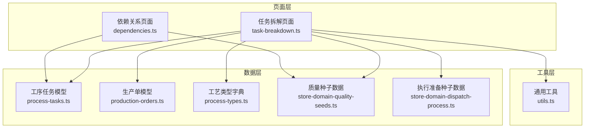
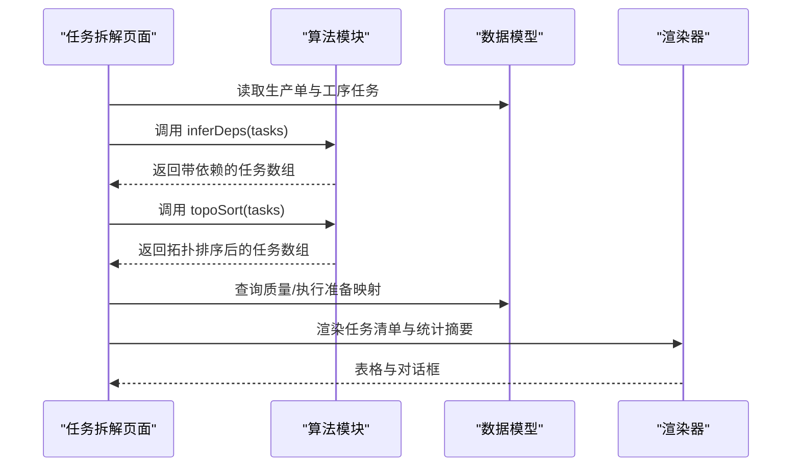
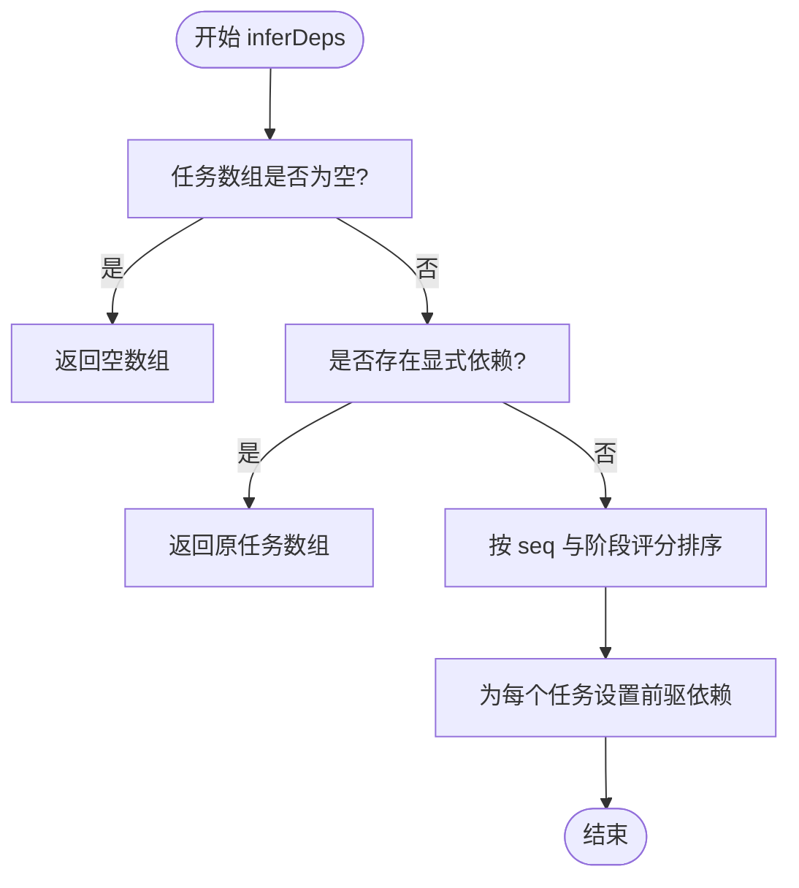
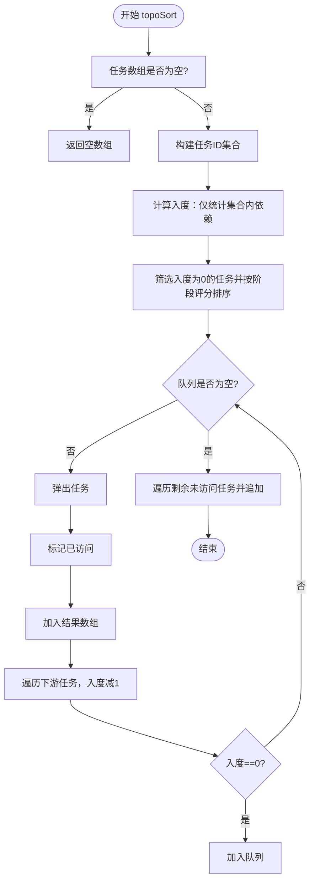
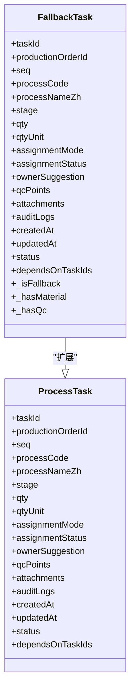
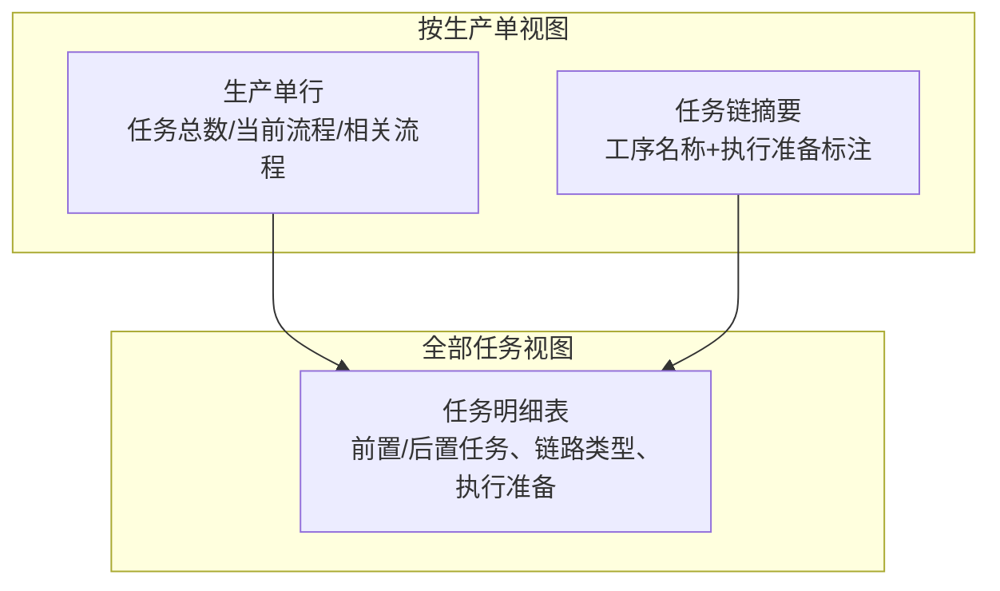
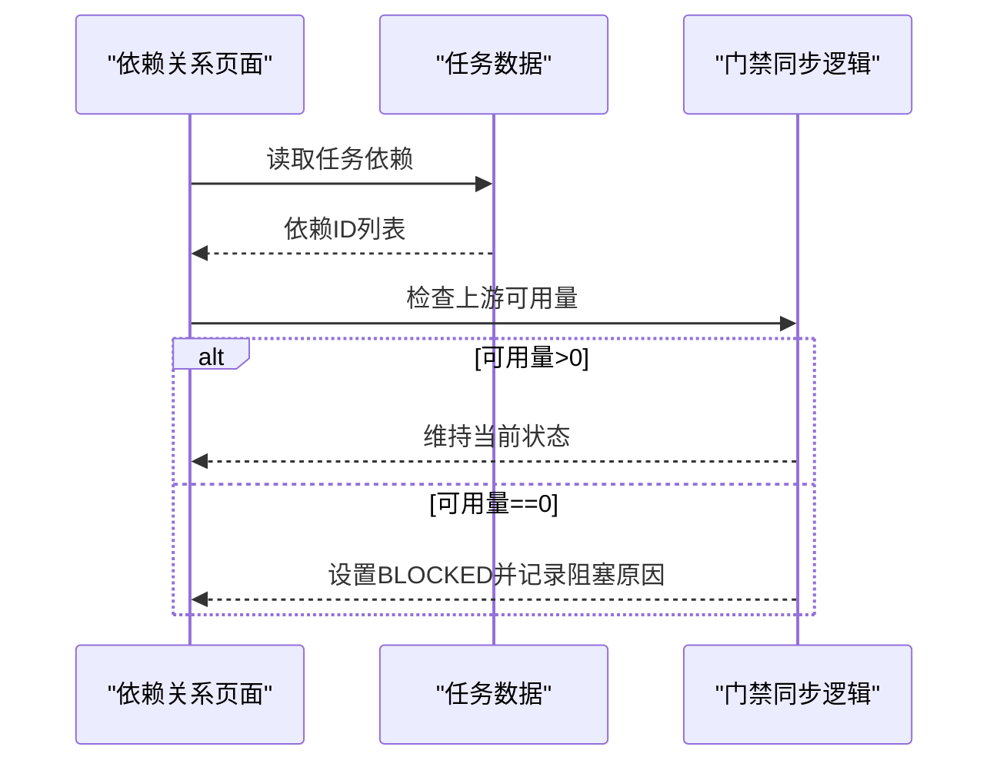
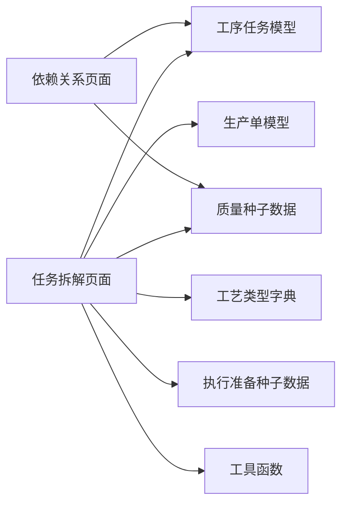

# 任务拆解管理

<cite>
**本文档引用的文件**
- [task-breakdown.ts](file://src/pages/task-breakdown.ts)
- [process-tasks.ts](file://src/data/fcs/process-tasks.ts)
- [process-types.ts](file://src/data/fcs/process-types.ts)
- [production-orders.ts](file://src/data/fcs/production-orders.ts)
- [store-domain-quality-seeds.ts](file://src/data/fcs/store-domain-quality-seeds.ts)
- [store-domain-dispatch-process.ts](file://src/data/fcs/store-domain-dispatch-process.ts)
- [dependencies.ts](file://src/pages/dependencies.ts)
- [utils.ts](file://src/utils.ts)
</cite>

## 目录
1. [简介](#简介)
2. [项目结构](#项目结构)
3. [核心组件](#核心组件)
4. [架构总览](#架构总览)
5. [详细组件分析](#详细组件分析)
6. [依赖分析](#依赖分析)
7. [性能考虑](#性能考虑)
8. [故障排除指南](#故障排除指南)
9. [结论](#结论)

## 简介
本技术文档面向任务拆解管理系统，聚焦于任务树构建、层次关系建立、任务排序与依赖推断等核心能力。文档深入解析以下关键算法与机制：
- inferDeps：基于工序顺序与阶段评分的智能依赖推断
- topoSort：拓扑排序与入度计算、队列管理与环路检测
- fallback 任务生成：为缺少任务数据的生产单生成示例任务结构
- 任务链可视化与统计：按生产单与全局视图展示任务链摘要与执行准备需求

该系统以数据驱动为核心，结合 Mock 数据与静态类型定义，提供任务拆解、依赖关系分析与排序的完整解决方案。

## 项目结构
任务拆解管理位于前端页面层与数据层之间，采用“页面逻辑 + 数据模型”的分层设计：
- 页面层：任务拆解页面负责渲染、交互与事件处理
- 数据层：包含生产单、工序任务、工艺类型、质量与执行准备种子数据等
- 工具层：通用工具函数（HTML 转义、类名拼接、日期格式化）

图表来源
- [task-breakdown.ts:1-829](file://src/pages/task-breakdown.ts#L1-L829)
- [process-tasks.ts:1-2033](file://src/data/fcs/process-tasks.ts#L1-L2033)
- [production-orders.ts:1-855](file://src/data/fcs/production-orders.ts#L1-L855)
- [process-types.ts:1-446](file://src/data/fcs/process-types.ts#L1-L446)
- [store-domain-quality-seeds.ts:1-269](file://src/data/fcs/store-domain-quality-seeds.ts#L1-L269)
- [store-domain-dispatch-process.ts:1-245](file://src/data/fcs/store-domain-dispatch-process.ts#L1-L245)
- [dependencies.ts:1-80](file://src/pages/dependencies.ts#L1-L80)
- [utils.ts:1-18](file://src/utils.ts#L1-L18)

章节来源
- [task-breakdown.ts:1-829](file://src/pages/task-breakdown.ts#L1-L829)
- [process-tasks.ts:1-2033](file://src/data/fcs/process-tasks.ts#L1-L2033)
- [production-orders.ts:1-855](file://src/data/fcs/production-orders.ts#L1-L855)
- [process-types.ts:1-446](file://src/data/fcs/process-types.ts#L1-L446)
- [store-domain-quality-seeds.ts:1-269](file://src/data/fcs/store-domain-quality-seeds.ts#L1-L269)
- [store-domain-dispatch-process.ts:1-245](file://src/data/fcs/store-domain-dispatch-process.ts#L1-L245)
- [dependencies.ts:1-80](file://src/pages/dependencies.ts#L1-L80)
- [utils.ts:1-18](file://src/utils.ts#L1-L18)

## 核心组件
本节概述任务拆解系统的关键组件及其职责：
- 任务拆解页面：负责渲染任务清单、统计与交互事件处理
- 工序任务模型：定义任务结构、状态、依赖与审计日志
- 工艺类型字典：提供工序阶段、推荐分配方式与质量要点
- 质量与执行准备种子：提供质检标准、领料需求与染印承接等映射
- 依赖关系页面：展示任务依赖关系与分配门禁状态同步

章节来源
- [task-breakdown.ts:1-829](file://src/pages/task-breakdown.ts#L1-L829)
- [process-tasks.ts:1-84](file://src/data/fcs/process-tasks.ts#L1-L84)
- [process-types.ts:1-446](file://src/data/fcs/process-types.ts#L1-L446)
- [store-domain-quality-seeds.ts:1-269](file://src/data/fcs/store-domain-quality-seeds.ts#L1-L269)
- [store-domain-dispatch-process.ts:1-245](file://src/data/fcs/store-domain-dispatch-process.ts#L1-L245)
- [dependencies.ts:1-80](file://src/pages/dependencies.ts#L1-L80)

## 架构总览
任务拆解系统采用“数据驱动 + 算法编排”的架构：
- 数据输入：生产单、工序任务、工艺类型、质量与执行准备种子
- 核心算法：依赖推断、拓扑排序、fallback 任务生成
- 输出：任务链结构、依赖关系、统计摘要与可视化表格

图表来源
- [task-breakdown.ts:58-181](file://src/pages/task-breakdown.ts#L58-L181)
- [process-tasks.ts:1-84](file://src/data/fcs/process-tasks.ts#L1-L84)
- [store-domain-quality-seeds.ts:239-268](file://src/data/fcs/store-domain-quality-seeds.ts#L239-L268)
- [store-domain-dispatch-process.ts:224-244](file://src/data/fcs/store-domain-dispatch-process.ts#L224-L244)

## 详细组件分析

### inferDeps 智能依赖推断算法
该函数在任务已存在依赖的情况下直接返回，否则根据工序顺序(seq)与阶段评分(stageScore)进行排序，并为每个任务设置其前驱依赖（除首个任务外）。阶段评分通过关键词匹配确定工序阶段优先级，确保任务链符合生产流程的自然顺序。

图表来源
- [task-breakdown.ts:58-72](file://src/pages/task-breakdown.ts#L58-L72)

章节来源
- [task-breakdown.ts:58-72](file://src/pages/task-breakdown.ts#L58-L72)

### topoSort 拓扑排序实现
该函数实现基于入度的拓扑排序，支持阶段评分排序与环路检测：
- 入度计算：统计每个任务的直接依赖数量（仅计入同集合内的依赖）
- 队列初始化：选择入度为0的任务并按阶段评分排序
- 排序过程：循环弹出任务，更新下游任务入度，将入度降为0的任务加入队列
- 环路处理：遍历结束后，将未访问的任务追加到结果末尾（视为自环或孤立节点）

图表来源
- [task-breakdown.ts:142-181](file://src/pages/task-breakdown.ts#L142-L181)

章节来源
- [task-breakdown.ts:142-181](file://src/pages/task-breakdown.ts#L142-L181)

### fallback 任务生成机制
当某生产单没有现有任务数据时，系统会生成示例任务结构，覆盖不同生产场景：
- 变体0：裁剪 → 车缝（带领料） → 后整 → 包装（带质检）
- 变体1：裁剪 → 染印（车缝阶段） → 车缝 → 后整 → 包装（带质检）
- 变体2：裁剪 → 车缝（带领料） → 包装 → （无质检）

生成的示例任务具备统一字段（如任务ID、生产单ID、工序代码、阶段、数量单位、派单/竞价模式、状态、依赖ID等），并通过额外标记（如_hasMaterial、_hasQc、_isFallback）标识执行准备需求与来源。

图表来源
- [task-breakdown.ts:21-25](file://src/pages/task-breakdown.ts#L21-L25)
- [task-breakdown.ts:74-106](file://src/pages/task-breakdown.ts#L74-L106)
- [task-breakdown.ts:108-140](file://src/pages/task-breakdown.ts#L108-L140)

章节来源
- [task-breakdown.ts:21-25](file://src/pages/task-breakdown.ts#L21-L25)
- [task-breakdown.ts:74-106](file://src/pages/task-breakdown.ts#L74-L106)
- [task-breakdown.ts:108-140](file://src/pages/task-breakdown.ts#L108-L140)

### 任务链可视化与统计
任务拆解页面提供两种视图：
- 按生产单查看：汇总每个生产单的任务数量、当前流程与相关流程任务数，以及染印、领料、质检需求的统计摘要
- 全部任务查看：展示所有任务的明细，包括前置/后置任务、链路类型（当前流程/相关流程）、执行准备需求与导航按钮

图表来源
- [task-breakdown.ts:390-429](file://src/pages/task-breakdown.ts#L390-L429)
- [task-breakdown.ts:538-624](file://src/pages/task-breakdown.ts#L538-L624)

章节来源
- [task-breakdown.ts:390-429](file://src/pages/task-breakdown.ts#L390-L429)
- [task-breakdown.ts:538-624](file://src/pages/task-breakdown.ts#L538-L624)

### 依赖关系分析与分配门禁同步
依赖关系页面展示了任务依赖关系的兼容性处理与分配门禁状态同步逻辑：
- 依赖关系兼容：支持 dependsOnTaskIds、dependencyTaskIds、predecessorTaskIds 三种字段形态
- 分配门禁同步：当上游任务的可用量为0时，将当前任务标记为“BLOCKED”，并记录阻塞原因与备注

图表来源
- [dependencies.ts:26-36](file://src/pages/dependencies.ts#L26-L36)
- [dependencies.ts:46-80](file://src/pages/dependencies.ts#L46-L80)

章节来源
- [dependencies.ts:26-36](file://src/pages/dependencies.ts#L26-L36)
- [dependencies.ts:46-80](file://src/pages/dependencies.ts#L46-L80)

## 依赖分析
任务拆解系统的关键依赖关系如下：
- 页面依赖数据模型：任务拆解页面依赖工序任务、生产单、工艺类型与质量/执行准备种子
- 算法依赖数据结构：依赖推断与拓扑排序依赖任务的 seq、stage 与 dependsOnTaskIds 字段
- 工具函数：HTML 转义与类名拼接用于安全渲染与样式控制

图表来源
- [task-breakdown.ts:1-11](file://src/pages/task-breakdown.ts#L1-L11)
- [dependencies.ts:1-6](file://src/pages/dependencies.ts#L1-L6)
- [utils.ts:1-18](file://src/utils.ts#L1-L18)

章节来源
- [task-breakdown.ts:1-11](file://src/pages/task-breakdown.ts#L1-L11)
- [dependencies.ts:1-6](file://src/pages/dependencies.ts#L1-L6)
- [utils.ts:1-18](file://src/utils.ts#L1-L18)

## 性能考虑
- 依赖推断与拓扑排序的时间复杂度
  - inferDeps：排序 O(n log n)，依赖赋值 O(n)，总体 O(n log n)
  - topoSort：入度计算 O(n)，队列操作摊销 O(n)，总体 O(n + m)，其中 m 为依赖边数
- 内存使用
  - 使用 Set/Map 存储任务ID与入度，避免重复计算
  - 通过浅拷贝排序与映射，减少深拷贝成本
- 渲染优化
  - 使用工具函数 escapeHtml 防止 XSS，toClassName 动态拼接样式，减少模板字符串拼接

## 故障排除指南
- 依赖关系异常
  - 症状：任务无法推进或出现环路
  - 处理：检查 dependsOnTaskIds 是否指向集合内任务；使用 topoSort 的环路检测逻辑确认结果
- 分配门禁阻塞
  - 症状：任务状态变为 BLOCKED，阻塞原因显示“等待上一步完成”
  - 处理：检查上游任务的可用量与状态；确认依赖关系正确
- fallback 任务未生效
  - 症状：某些生产单仍为空任务
  - 处理：确认生产单在数据集中存在且未被过滤；检查 makeFallbackTasks 的变体选择逻辑

章节来源
- [task-breakdown.ts:142-181](file://src/pages/task-breakdown.ts#L142-L181)
- [dependencies.ts:46-80](file://src/pages/dependencies.ts#L46-L80)
- [task-breakdown.ts:108-140](file://src/pages/task-breakdown.ts#L108-L140)

## 结论
任务拆解管理系统通过“智能依赖推断 + 拓扑排序 + fallback 任务生成”的组合，实现了对生产单任务链的自动化构建与可视化呈现。系统以数据模型为中心，配合依赖关系分析与分配门禁同步，为后续的派单与执行提供了可靠基础。未来可在以下方面持续优化：
- 支持更复杂的依赖表达与冲突检测
- 引入增量更新与缓存策略提升渲染性能
- 增强 fallback 任务的动态配置与规则引擎