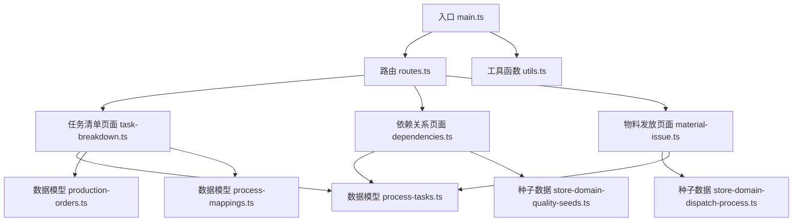
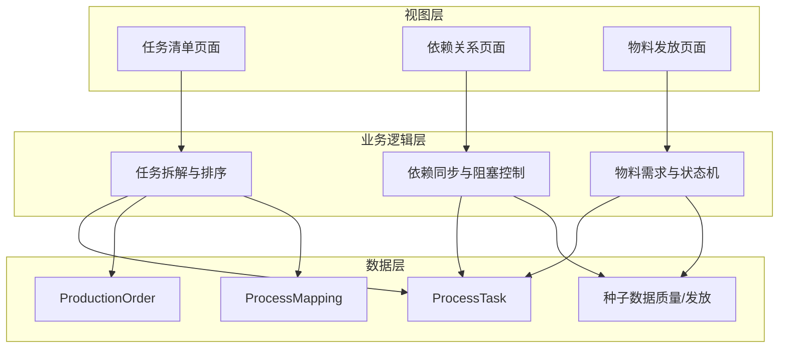
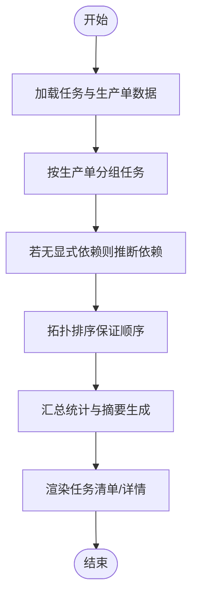
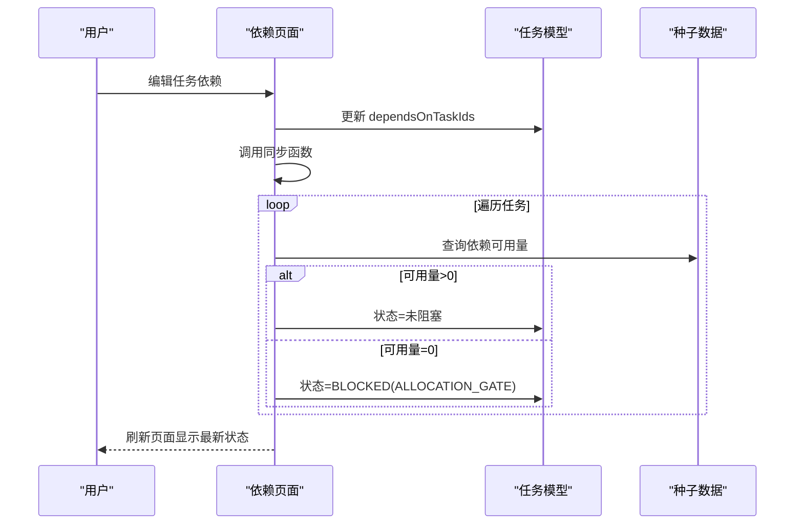
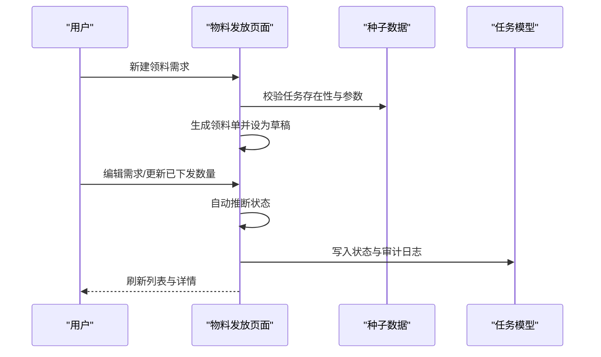
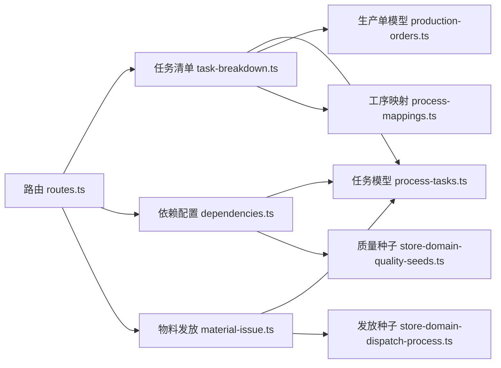

# 任务编排

<cite>
**本文引用的文件**
- [src/main.ts](file://src/main.ts)
- [src/router/routes.ts](file://src/router/routes.ts)
- [src/pages/task-breakdown.ts](file://src/pages/task-breakdown.ts)
- [src/pages/dependencies.ts](file://src/pages/dependencies.ts)
- [src/pages/material-issue.ts](file://src/pages/material-issue.ts)
- [src/data/fcs/process-tasks.ts](file://src/data/fcs/process-tasks.ts)
- [src/data/fcs/production-orders.ts](file://src/data/fcs/production-orders.ts)
- [src/data/fcs/process-mappings.ts](file://src/data/fcs/process-mappings.ts)
- [src/data/fcs/store-domain-dispatch-process.ts](file://src/data/fcs/store-domain-dispatch-process.ts)
- [src/data/fcs/store-domain-quality-seeds.ts](file://src/data/fcs/store-domain-quality-seeds.ts)
- [src/utils.ts](file://src/utils.ts)
</cite>

## 目录
1. [引言](#引言)
2. [项目结构](#项目结构)
3. [核心组件](#核心组件)
4. [架构总览](#架构总览)
5. [详细组件分析](#详细组件分析)
6. [依赖分析](#依赖分析)
7. [性能考虑](#性能考虑)
8. [故障排查指南](#故障排查指南)
9. [结论](#结论)
10. [附录](#附录)

## 引言
本技术文档围绕任务编排系统展开，聚焦于生产任务的拆解、依赖建模、资源分配与执行调度等关键环节。系统通过“任务清单”“依赖关系配置”“用料清单下发”三大页面，串联起从技术包到任务链、从任务链到执行准备与资源下发的完整闭环。文档将深入解释任务拆解机制、依赖关系建模与解析算法、染色/印花需求单管理逻辑、物料发放系统实现，并提供可复用的代码示例路径与可视化图示。

## 项目结构
系统采用前端单页应用架构，入口在 main.ts 中初始化应用壳层与事件分发；路由在 routes.ts 中集中定义，按模块划分任务清单、依赖配置、物料发放等页面；核心业务逻辑分布在 pages 目录下的各页面模块中，数据模型位于 data/fcs 目录，工具函数位于 utils.ts。

图表来源
- [src/main.ts:1-999](file://src/main.ts#L1-L999)
- [src/router/routes.ts:1-462](file://src/router/routes.ts#L1-L462)
- [src/pages/task-breakdown.ts:1-829](file://src/pages/task-breakdown.ts#L1-L829)
- [src/pages/dependencies.ts:1-406](file://src/pages/dependencies.ts#L1-L406)
- [src/pages/material-issue.ts:1-825](file://src/pages/material-issue.ts#L1-L825)
- [src/data/fcs/process-tasks.ts:1-2033](file://src/data/fcs/process-tasks.ts#L1-L2033)
- [src/data/fcs/production-orders.ts:1-855](file://src/data/fcs/production-orders.ts#L1-L855)
- [src/data/fcs/process-mappings.ts:1-157](file://src/data/fcs/process-mappings.ts#L1-L157)
- [src/data/fcs/store-domain-dispatch-process.ts](file://src/data/fcs/store-domain-dispatch-process.ts)
- [src/data/fcs/store-domain-quality-seeds.ts](file://src/data/fcs/store-domain-quality-seeds.ts)
- [src/utils.ts](file://src/utils.ts)

章节来源
- [src/main.ts:1-999](file://src/main.ts#L1-L999)
- [src/router/routes.ts:1-462](file://src/router/routes.ts#L1-L462)

## 核心组件
- 任务清单（Task Breakdown）
  - 功能：展示生产单的任务链、排序与执行准备（染印、领料、质检）提示；支持按生产单或全部任务查看。
  - 关键算法：依赖推断（若未显式设置依赖则按阶段与序号推导）、拓扑排序（保证串行依赖与阶段顺序）。
  - 示例路径：[getAllProcessTasks:183-208](file://src/pages/task-breakdown.ts#L183-L208)、[topoSort:142-181](file://src/pages/task-breakdown.ts#L142-L181)、[renderTaskBreakdownPage:626-784](file://src/pages/task-breakdown.ts#L626-L784)

- 依赖关系配置（Dependencies）
  - 功能：配置任务的“上一步依赖”，并基于可用量自动阻塞/放行，形成“资源门禁”机制。
  - 关键算法：依赖同步（遍历任务，检查依赖可用量，更新状态与审计日志）。
  - 示例路径：[syncAllocationGates:46-101](file://src/pages/dependencies.ts#L46-L101)、[updateTaskDependencies:103-137](file://src/pages/dependencies.ts#L103-L137)

- 物料发放（Material Issue）
  - 功能：创建/编辑/状态变更用料需求单，记录需求数量、已下发数量与状态流转。
  - 关键算法：状态机（草稿→待下发→部分下发→已下发），自动状态推断（依据已下发数量）。
  - 示例路径：[createMaterialIssueSheet:149-187](file://src/pages/material-issue.ts#L149-L187)、[updateMaterialIssueSheet:189-235](file://src/pages/material-issue.ts#L189-L235)、[updateMaterialIssueStatus:237-256](file://src/pages/material-issue.ts#L237-L256)

- 数据模型
  - 任务模型（ProcessTask）：包含任务ID、生产单ID、序列、工序编码/名称、阶段、数量与单位、派单/竞价模式、状态、阻塞原因、依赖ID等。
  - 生产单模型（ProductionOrder）：包含状态机、主工厂快照、技术包快照、需求快照、分配摘要与进度、风险标记等。
  - 工序映射（ProcessMapping）：将旧系统/技术包中的工序名称映射到标准化的工序代码，支持精确、别名、拆分、合并等映射类型。
  - 种子数据：质量与发放过程的初始数据集，驱动页面渲染与业务逻辑。

章节来源
- [src/pages/task-breakdown.ts:1-829](file://src/pages/task-breakdown.ts#L1-L829)
- [src/pages/dependencies.ts:1-406](file://src/pages/dependencies.ts#L1-L406)
- [src/pages/material-issue.ts:1-825](file://src/pages/material-issue.ts#L1-L825)
- [src/data/fcs/process-tasks.ts:1-2033](file://src/data/fcs/process-tasks.ts#L1-L2033)
- [src/data/fcs/production-orders.ts:1-855](file://src/data/fcs/production-orders.ts#L1-L855)
- [src/data/fcs/process-mappings.ts:1-157](file://src/data/fcs/process-mappings.ts#L1-L157)
- [src/data/fcs/store-domain-dispatch-process.ts](file://src/data/fcs/store-domain-dispatch-process.ts)
- [src/data/fcs/store-domain-quality-seeds.ts](file://src/data/fcs/store-domain-quality-seeds.ts)

## 架构总览
系统采用“页面模块 + 数据模型 + 种子数据”的分层设计。页面模块负责UI与交互事件，数据模型承载业务状态，种子数据提供初始状态与参考值。路由集中管理导航，入口负责事件分发与渲染。

图表来源
- [src/pages/task-breakdown.ts:1-829](file://src/pages/task-breakdown.ts#L1-L829)
- [src/pages/dependencies.ts:1-406](file://src/pages/dependencies.ts#L1-L406)
- [src/pages/material-issue.ts:1-825](file://src/pages/material-issue.ts#L1-L825)
- [src/data/fcs/process-tasks.ts:1-2033](file://src/data/fcs/process-tasks.ts#L1-L2033)
- [src/data/fcs/production-orders.ts:1-855](file://src/data/fcs/production-orders.ts#L1-L855)
- [src/data/fcs/process-mappings.ts:1-157](file://src/data/fcs/process-mappings.ts#L1-L157)
- [src/data/fcs/store-domain-dispatch-process.ts](file://src/data/fcs/store-domain-dispatch-process.ts)
- [src/data/fcs/store-domain-quality-seeds.ts](file://src/data/fcs/store-domain-quality-seeds.ts)

## 详细组件分析

### 任务拆解与任务链构建
- 任务拆解机制
  - 若任务未显式设置依赖，则按阶段优先级与序号进行推断，形成默认串行链路。
  - 对于缺失任务，系统会注入“示例结构”以保证最小可执行链路。
- 任务链构建算法
  - 依赖推断：[inferDeps:58-72](file://src/pages/task-breakdown.ts#L58-L72)
  - 拓扑排序：[topoSort:142-181](file://src/pages/task-breakdown.ts#L142-L181)
  - 任务聚合与摘要：[getAllProcessTasks:183-208](file://src/pages/task-breakdown.ts#L183-L208)、[chainSummaryText:276-303](file://src/pages/task-breakdown.ts#L276-L303)
- 任务链详情对话框
  - 展示每个任务的前置/后置任务、链路类型（当前流程/相关流程）、染印承接、领料需求、质检标准等。
  - 示例路径：[renderChainDetailDialog:312-388](file://src/pages/task-breakdown.ts#L312-L388)

图表来源
- [src/pages/task-breakdown.ts:183-208](file://src/pages/task-breakdown.ts#L183-L208)
- [src/pages/task-breakdown.ts:142-181](file://src/pages/task-breakdown.ts#L142-L181)
- [src/pages/task-breakdown.ts:58-72](file://src/pages/task-breakdown.ts#L58-L72)

章节来源
- [src/pages/task-breakdown.ts:1-829](file://src/pages/task-breakdown.ts#L1-L829)

### 依赖关系建模与解析
- 依赖建模
  - 任务模型包含 dependsOnTaskIds 字段，表示“上一步依赖”。
  - 支持多选依赖，系统通过“资源门禁”机制自动阻塞/放行。
- 解析与同步算法
  - 遍历所有任务，检查依赖的可用量（来自种子数据），若为0则阻塞，否则放行。
  - 更新任务状态、阻塞原因、备注与审计日志。
  - 示例路径：[syncAllocationGates:46-101](file://src/pages/dependencies.ts#L46-L101)、[updateTaskDependencies:103-137](file://src/pages/dependencies.ts#L103-L137)

图表来源
- [src/pages/dependencies.ts:46-101](file://src/pages/dependencies.ts#L46-L101)
- [src/pages/dependencies.ts:103-137](file://src/pages/dependencies.ts#L103-L137)
- [src/data/fcs/process-tasks.ts:1-84](file://src/data/fcs/process-tasks.ts#L1-L84)
- [src/data/fcs/store-domain-quality-seeds.ts](file://src/data/fcs/store-domain-quality-seeds.ts)

章节来源
- [src/pages/dependencies.ts:1-406](file://src/pages/dependencies.ts#L1-L406)

### 染色需求单与印花需求单管理
- 需求分析与配方确定
  - 通过任务链识别“相关流程”（染印类任务），并在任务清单中标识“染印承接”。
  - 示例路径：[isDyeTask:49-51](file://src/pages/task-breakdown.ts#L49-L51)、[chainTypeZh:252-254](file://src/pages/task-breakdown.ts#L252-L254)
- 原料准备与生产安排
  - 将“需领料任务”与“需质检标准任务”在任务清单中高亮提示，便于后续物料发放与质量控制。
  - 示例路径：[getTaskMaterialSet:210-221](file://src/pages/task-breakdown.ts#L210-L221)、[getTaskQcSet:223-234](file://src/pages/task-breakdown.ts#L223-L234)

章节来源
- [src/pages/task-breakdown.ts:1-829](file://src/pages/task-breakdown.ts#L1-L829)

### 物料发放系统实现
- 原料需求计算
  - 以任务为粒度创建“用料需求单”，记录任务ID、用料摘要、需求数量、备注等。
  - 示例路径：[createMaterialIssueSheet:149-187](file://src/pages/material-issue.ts#L149-L187)
- 库存检查与状态机
  - 通过“已下发数量”自动推断状态：0→草稿，0<已下发<需求数→部分下发，已下发≥需求数→已下发。
  - 示例路径：[updateMaterialIssueSheet:189-235](file://src/pages/material-issue.ts#L189-L235)
- 领料单生成与发放跟踪
  - 支持编辑需求、变更状态、查看历史与导航到生产单/任务。
  - 示例路径：[renderMaterialIssuePage:447-584](file://src/pages/material-issue.ts#L447-L584)、[updateMaterialIssueStatus:237-256](file://src/pages/material-issue.ts#L237-L256)

图表来源
- [src/pages/material-issue.ts:149-187](file://src/pages/material-issue.ts#L149-L187)
- [src/pages/material-issue.ts:189-235](file://src/pages/material-issue.ts#L189-L235)
- [src/pages/material-issue.ts:237-256](file://src/pages/material-issue.ts#L237-L256)
- [src/data/fcs/store-domain-dispatch-process.ts](file://src/data/fcs/store-domain-dispatch-process.ts)
- [src/data/fcs/process-tasks.ts:1-84](file://src/data/fcs/process-tasks.ts#L1-L84)

章节来源
- [src/pages/material-issue.ts:1-825](file://src/pages/material-issue.ts#L1-L825)

### 任务树构建与资源冲突解决
- 任务树构建
  - 以生产单为根，按阶段与序号构建任务树，支持“当前流程/相关流程”双视角。
  - 示例路径：[topoSort:142-181](file://src/pages/task-breakdown.ts#L142-L181)、[renderByOrderTable:431-536](file://src/pages/task-breakdown.ts#L431-L536)
- 资源冲突解决
  - 通过“资源门禁”阻塞不可开始的任务，待上游完成后自动放行。
  - 示例路径：[syncAllocationGates:46-101](file://src/pages/dependencies.ts#L46-L101)

章节来源
- [src/pages/task-breakdown.ts:1-829](file://src/pages/task-breakdown.ts#L1-L829)
- [src/pages/dependencies.ts:1-406](file://src/pages/dependencies.ts#L1-L406)

## 依赖分析
- 页面与数据耦合
  - 任务清单依赖任务模型与生产单模型，同时使用工序映射进行名称规范化。
  - 依赖页面依赖任务模型与质量种子数据。
  - 物料发放页面依赖任务模型与发放种子数据。
- 外部依赖与集成点
  - 路由集中管理页面导航，入口负责事件分发与渲染。
  - 工具函数提供通用的HTML转义与类名拼接等辅助能力。

图表来源
- [src/router/routes.ts:1-462](file://src/router/routes.ts#L1-L462)
- [src/pages/task-breakdown.ts:1-829](file://src/pages/task-breakdown.ts#L1-L829)
- [src/pages/dependencies.ts:1-406](file://src/pages/dependencies.ts#L1-L406)
- [src/pages/material-issue.ts:1-825](file://src/pages/material-issue.ts#L1-L825)
- [src/data/fcs/process-tasks.ts:1-2033](file://src/data/fcs/process-tasks.ts#L1-L2033)
- [src/data/fcs/production-orders.ts:1-855](file://src/data/fcs/production-orders.ts#L1-L855)
- [src/data/fcs/process-mappings.ts:1-157](file://src/data/fcs/process-mappings.ts#L1-L157)
- [src/data/fcs/store-domain-dispatch-process.ts](file://src/data/fcs/store-domain-dispatch-process.ts)
- [src/data/fcs/store-domain-quality-seeds.ts](file://src/data/fcs/store-domain-quality-seeds.ts)

章节来源
- [src/router/routes.ts:1-462](file://src/router/routes.ts#L1-L462)
- [src/main.ts:1-999](file://src/main.ts#L1-L999)

## 性能考虑
- 任务排序与依赖解析
  - 拓扑排序的时间复杂度为 O(V+E)，在任务规模可控范围内可保证实时响应。
  - 依赖同步遍历所有任务，建议在大规模数据场景下增加节流与增量刷新策略。
- 页面渲染
  - 使用虚拟滚动与分页可降低大数据量表格的渲染压力。
  - 事件委托与最小化重渲染有助于提升交互流畅度。

## 故障排查指南
- 依赖无法放行
  - 检查上游任务的可用量是否为0，确认依赖配置是否正确。
  - 参考：[syncAllocationGates:46-101](file://src/pages/dependencies.ts#L46-L101)
- 领料需求单状态异常
  - 检查“已下发数量”与“需求数量”的关系，确认状态机推断逻辑。
  - 参考：[updateMaterialIssueSheet:189-235](file://src/pages/material-issue.ts#L189-L235)
- 任务链顺序异常
  - 检查任务的 seq 与 dependsOnTaskIds 是否合理，必要时重新推断依赖。
  - 参考：[inferDeps:58-72](file://src/pages/task-breakdown.ts#L58-L72)、[topoSort:142-181](file://src/pages/task-breakdown.ts#L142-L181)

章节来源
- [src/pages/dependencies.ts:1-406](file://src/pages/dependencies.ts#L1-L406)
- [src/pages/material-issue.ts:1-825](file://src/pages/material-issue.ts#L1-L825)
- [src/pages/task-breakdown.ts:1-829](file://src/pages/task-breakdown.ts#L1-L829)

## 结论
本任务编排系统通过“任务清单、依赖配置、物料发放”三驾马车，实现了从技术包到任务链再到执行准备与资源下发的闭环。其核心在于：
- 任务拆解与拓扑排序确保串行依赖与阶段顺序；
- 依赖同步与资源门禁保障执行条件；
- 物料需求单的状态机驱动发放与跟踪。

该体系具备良好的扩展性与可维护性，适合在多工厂、多工序、多资源约束的复杂生产环境中持续演进。

## 附录
- 代码示例路径（仅列出路径，不展示具体代码内容）
  - 任务拆解与排序：[getAllProcessTasks:183-208](file://src/pages/task-breakdown.ts#L183-L208)、[topoSort:142-181](file://src/pages/task-breakdown.ts#L142-L181)
  - 依赖同步与阻塞控制：[syncAllocationGates:46-101](file://src/pages/dependencies.ts#L46-L101)
  - 物料需求单创建与状态机：[createMaterialIssueSheet:149-187](file://src/pages/material-issue.ts#L149-L187)、[updateMaterialIssueSheet:189-235](file://src/pages/material-issue.ts#L189-L235)、[updateMaterialIssueStatus:237-256](file://src/pages/material-issue.ts#L237-L256)
  - 数据模型与映射：[ProcessTask:1-84](file://src/data/fcs/process-tasks.ts#L1-L84)、[ProductionOrder:1-161](file://src/data/fcs/production-orders.ts#L1-L161)、[ProcessMapping:1-157](file://src/data/fcs/process-mappings.ts#L1-L157)