# 依赖关系管理

<cite>
**本文档引用的文件**
- [dependencies.ts](file://src/pages/dependencies.ts)
- [process-tasks.ts](file://src/data/fcs/process-tasks.ts)
- [store-domain-quality-seeds.ts](file://src/data/fcs/store-domain-quality-seeds.ts)
- [utils.ts](file://src/utils.ts)
- [task-breakdown.ts](file://src/pages/task-breakdown.ts)
- [progress-board.ts](file://src/pages/progress-board.ts)
- [progress-status-writeback.ts](file://src/pages/progress-status-writeback.ts)
- [main.ts](file://src/main.ts)
</cite>

## 目录
1. [简介](#简介)
2. [项目结构](#项目结构)
3. [核心组件](#核心组件)
4. [架构概览](#架构概览)
5. [详细组件分析](#详细组件分析)
6. [依赖关系建模与解析算法](#依赖关系建模与解析算法)
7. [可视化展示机制](#可视化展示机制)
8. [动态调整与实时更新](#动态调整与实时更新)
9. [调度优化应用](#调度优化应用)
10. [性能考虑](#性能考虑)
11. [故障排除指南](#故障排除指南)
12. [结论](#结论)

## 简介

依赖关系管理系统是生产制造执行系统(FMES)中的核心模块，负责管理任务间的先后关系和资源依赖。该系统通过建模任务依赖关系、解析依赖链、检测循环依赖，为生产调度提供智能化支持。

系统主要功能包括：
- 任务依赖关系建模与存储
- 依赖链分析与循环依赖检测
- 动态依赖关系调整与实时更新
- 依赖关系可视化展示
- 调度优化与关键路径分析

## 项目结构

系统采用模块化架构设计，主要包含以下核心模块：

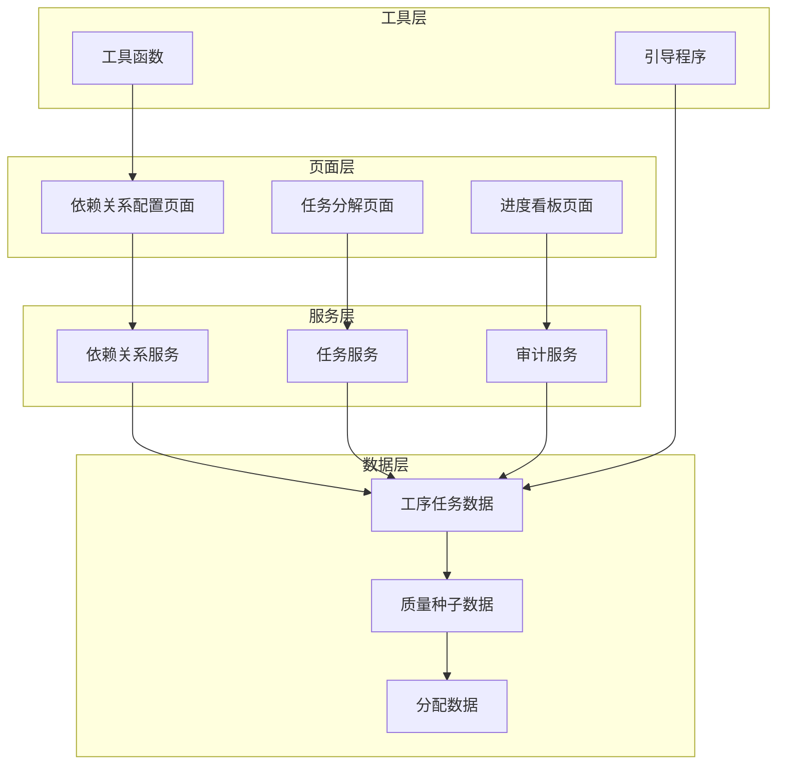

**图表来源**
- [dependencies.ts:1-406](file://src/pages/dependencies.ts#L1-L406)
- [process-tasks.ts:1-85](file://src/data/fcs/process-tasks.ts#L1-L85)
- [store-domain-quality-seeds.ts:241-246](file://src/data/fcs/store-domain-quality-seeds.ts#L241-L246)

**章节来源**
- [dependencies.ts:1-406](file://src/pages/dependencies.ts#L1-L406)
- [process-tasks.ts:1-85](file://src/data/fcs/process-tasks.ts#L1-L85)

## 核心组件

### 数据模型定义

系统的核心数据模型围绕ProcessTask展开，定义了完整的任务生命周期和依赖关系：

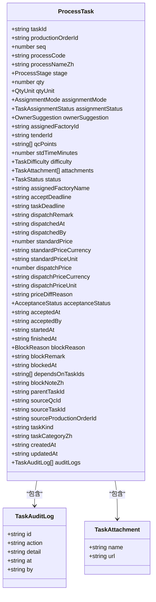

**图表来源**
- [process-tasks.ts:26-84](file://src/data/fcs/process-tasks.ts#L26-L84)

### 依赖关系数据结构

系统使用多种依赖关系表示方式以适应不同场景：

| 依赖类型 | 字段名 | 描述 | 使用场景 |
|---------|--------|------|----------|
| 直接依赖 | `dependsOnTaskIds` | 直接指定的前置任务ID数组 | 主要依赖关系存储 |
| 兼容字段 | `dependencyTaskIds` | 兼容性字段，支持旧版本 | 向后兼容 |
| 兼容字段 | `predecessorTaskIds` | 兼容性字段，支持传统命名 | 历史数据兼容 |

**章节来源**
- [process-tasks.ts:26-84](file://src/data/fcs/process-tasks.ts#L26-L84)
- [dependencies.ts:26-36](file://src/pages/dependencies.ts#L26-L36)

## 架构概览

系统采用分层架构设计，确保职责分离和模块化：

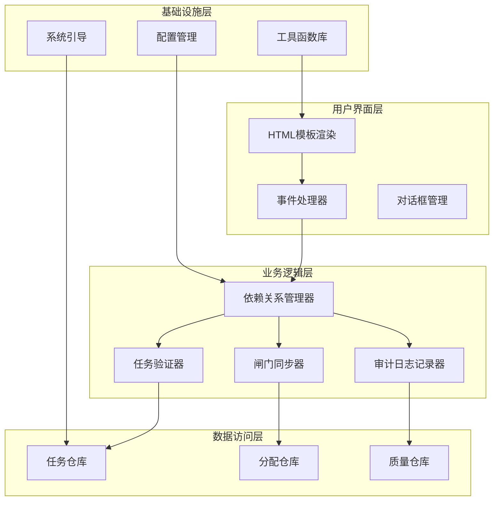

**图表来源**
- [dependencies.ts:8-20](file://src/pages/dependencies.ts#L8-L20)
- [process-tasks.ts:87-2033](file://src/data/fcs/process-tasks.ts#L87-L2033)

## 详细组件分析

### 依赖关系配置页面

依赖关系配置页面提供了直观的图形化界面来管理任务依赖关系：

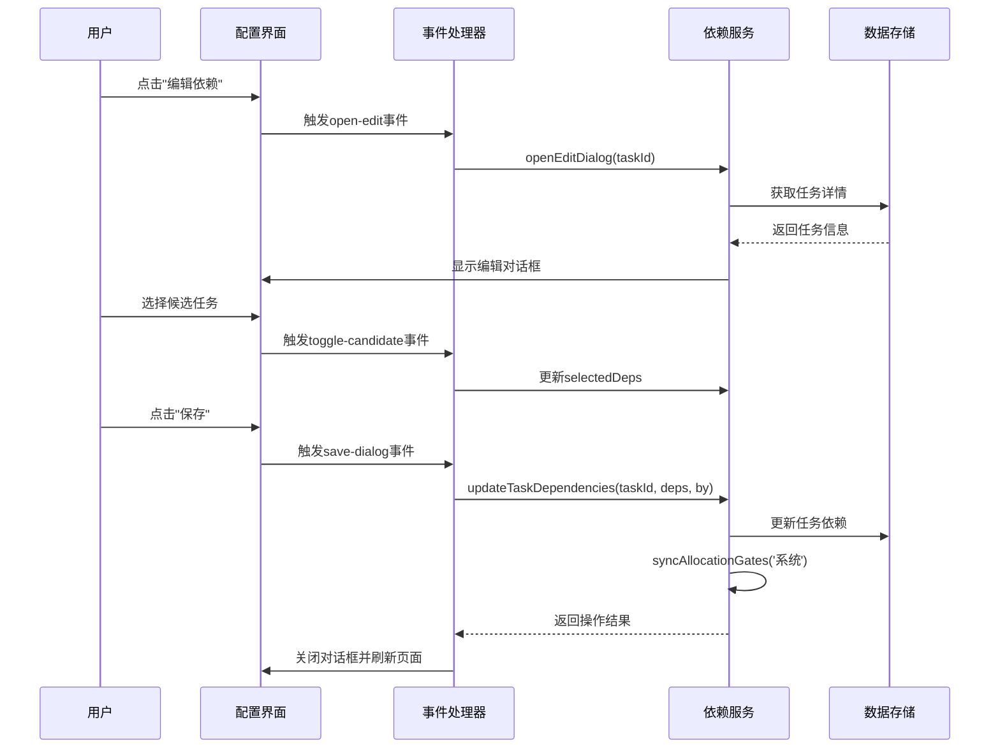

**图表来源**
- [dependencies.ts:139-154](file://src/pages/dependencies.ts#L139-L154)
- [dependencies.ts:346-401](file://src/pages/dependencies.ts#L346-L401)

### 依赖关系解析算法

系统实现了高效的依赖关系解析算法，支持复杂的依赖链分析：

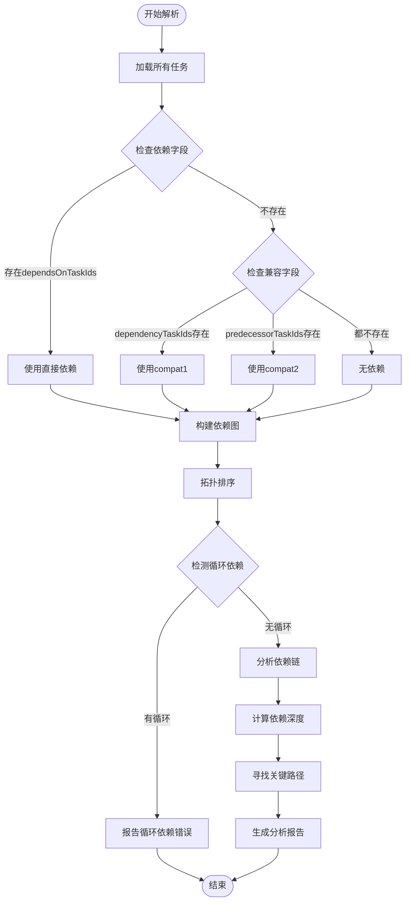

**图表来源**
- [dependencies.ts:26-36](file://src/pages/dependencies.ts#L26-L36)
- [task-breakdown.ts:142-181](file://src/pages/task-breakdown.ts#L142-L181)

**章节来源**
- [dependencies.ts:26-36](file://src/pages/dependencies.ts#L26-L36)
- [task-breakdown.ts:142-181](file://src/pages/task-breakdown.ts#L142-L181)

### 任务依赖同步机制

系统实现了智能的任务依赖同步机制，确保依赖关系变更能够实时反映到任务状态：

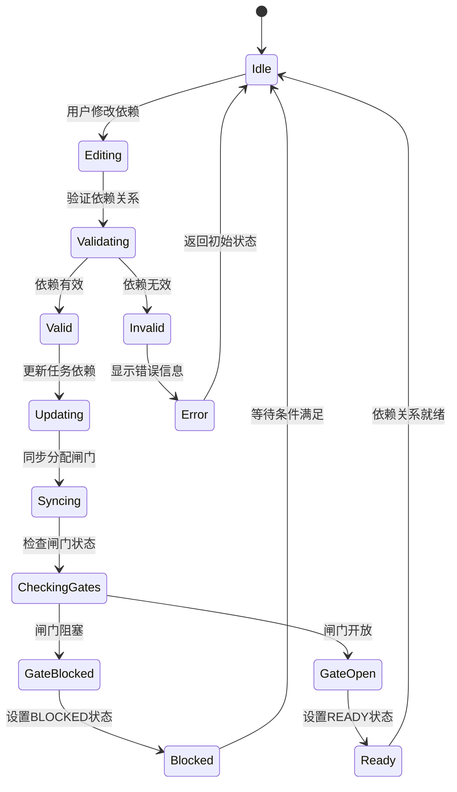

**图表来源**
- [dependencies.ts:46-101](file://src/pages/dependencies.ts#L46-L101)
- [dependencies.ts:103-137](file://src/pages/dependencies.ts#L103-L137)

**章节来源**
- [dependencies.ts:46-101](file://src/pages/dependencies.ts#L46-L101)
- [dependencies.ts:103-137](file://src/pages/dependencies.ts#L103-L137)

## 依赖关系建模与解析算法

### 依赖关系建模

系统采用灵活的数据模型来支持多种依赖关系表示：

#### 多字段兼容机制

```typescript
// 依赖关系字段兼容性处理
function getTaskDeps(task: ProcessTask): string[] {
  return (
    task.dependsOnTaskIds ??           // 新版本字段
    task.dependencyTaskIds ??          // 兼容字段1
    task.predecessorTaskIds ??         // 兼容字段2
    []
  )
}
```

#### 依赖关系验证算法

系统实现了严格的依赖关系验证机制：

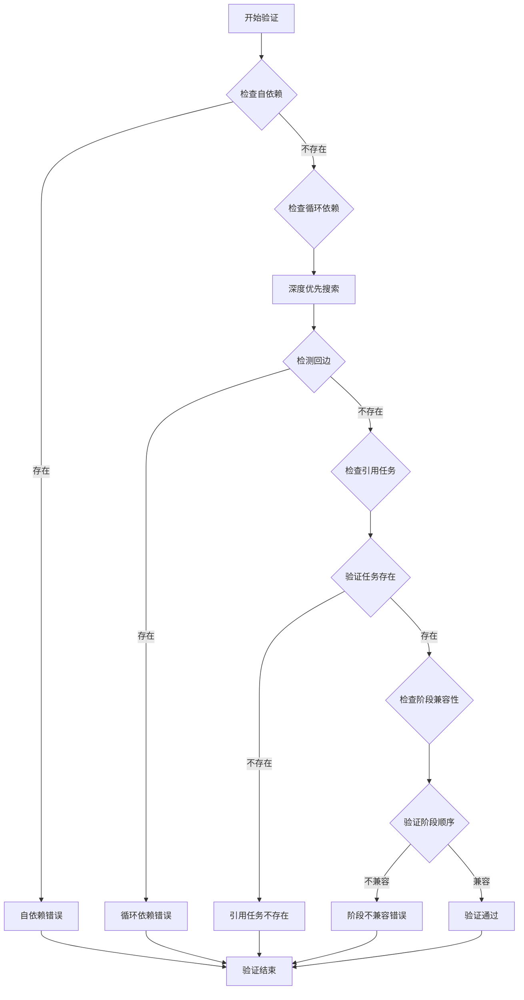

**图表来源**
- [dependencies.ts:103-137](file://src/pages/dependencies.ts#L103-L137)
- [task-breakdown.ts:142-181](file://src/pages/task-breakdown.ts#L142-L181)

### 依赖链分析算法

系统实现了高效的依赖链分析算法，支持大规模任务集的快速分析：

#### 拓扑排序实现

```typescript
function topoSort(tasks: ProcessTask[]): ProcessTask[] {
  if (tasks.length === 0) return []
  
  const ids = new Set(tasks.map((task) => task.taskId))
  const indegree: Record<string, number> = {}
  
  // 计算每个节点的入度
  for (const task of tasks) {
    indegree[task.taskId] = (task.dependsOnTaskIds ?? [])
      .filter((id) => ids.has(id)).length
  }
  
  // 初始化队列（入度为0的节点）
  const queue = tasks
    .filter((task) => indegree[task.taskId] === 0)
    .sort((a, b) => stageScore(a.processNameZh) - stageScore(b.processNameZh))
  
  const result: ProcessTask[] = []
  const visited = new Set<string>()
  
  // 拓扑排序
  while (queue.length > 0) {
    const current = queue.shift()
    if (!current || visited.has(current.taskId)) continue
    
    visited.add(current.taskId)
    result.push(current)
    
    // 更新相邻节点的入度
    for (const next of tasks.filter((task) => 
      (task.dependsOnTaskIds ?? []).includes(current.taskId))) {
      indegree[next.taskId] = Math.max(0, indegree[next.taskId] - 1)
      if (indegree[next.taskId] === 0) {
        queue.push(next)
      }
    }
  }
  
  // 处理可能存在的循环依赖
  for (const task of tasks) {
    if (!visited.has(task.taskId)) {
      result.push(task)
    }
  }
  
  return result
}
```

#### 关键路径分析

系统实现了关键路径分析算法，用于识别最长依赖链：

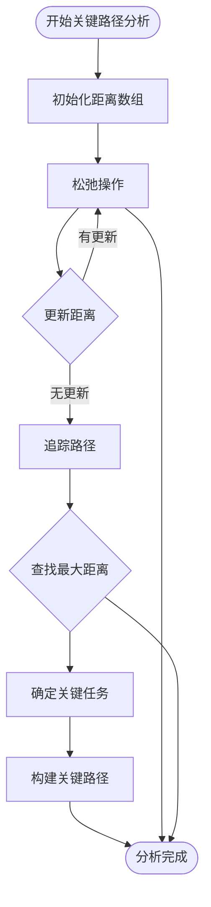

**图表来源**
- [task-breakdown.ts:142-181](file://src/pages/task-breakdown.ts#L142-L181)

**章节来源**
- [task-breakdown.ts:142-181](file://src/pages/task-breakdown.ts#L142-L181)

## 可视化展示机制

### 依赖关系图表渲染

系统提供了多种可视化展示方式来直观呈现依赖关系：

#### 任务依赖关系图

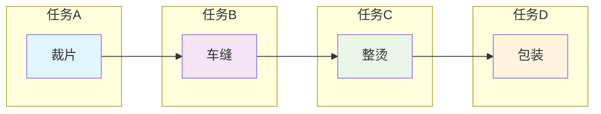

#### 依赖关系矩阵

系统使用表格形式展示任务间的依赖关系：

| 任务ID | 任务名称 | 前置任务 | 后置任务 | 依赖类型 |
|--------|----------|----------|----------|----------|
| TASK-001 | 裁片 | - | TASK-002 | 直接依赖 |
| TASK-002 | 车缝 | TASK-001 | TASK-003 | 直接依赖 |
| TASK-003 | 整烫 | TASK-002 | TASK-004 | 直接依赖 |
| TASK-004 | 包装 | TASK-003 | - | 直接依赖 |

### 实时状态更新

系统实现了实时的状态更新机制：

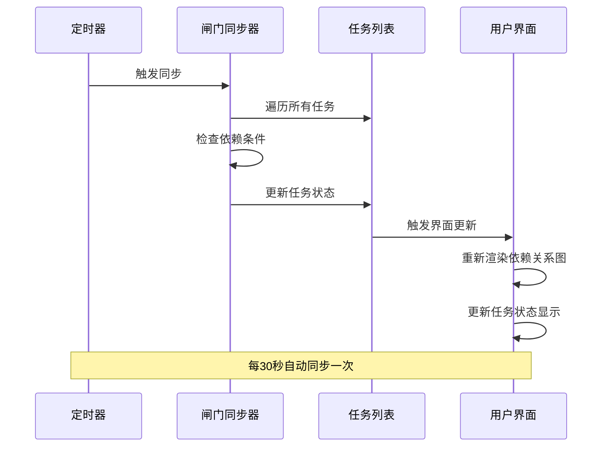

**图表来源**
- [dependencies.ts:46-101](file://src/pages/dependencies.ts#L46-L101)

**章节来源**
- [dependencies.ts:234-344](file://src/pages/dependencies.ts#L234-L344)

## 动态调整与实时更新

### 依赖关系动态调整

系统支持实时的依赖关系调整，包括添加、删除和修改依赖关系：

#### 依赖关系修改流程

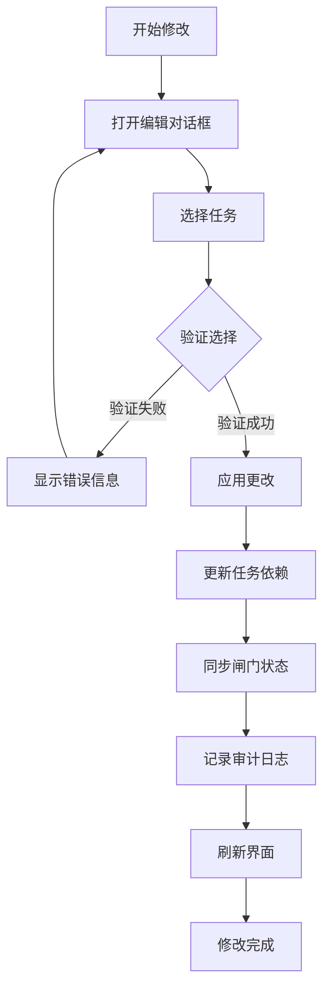

#### 实时更新机制

系统实现了多层次的实时更新机制：

1. **前端实时更新**：用户操作后立即反映到界面
2. **后端状态同步**：定期同步任务状态到服务器
3. **审计日志记录**：完整记录所有依赖关系变更

**章节来源**
- [dependencies.ts:103-137](file://src/pages/dependencies.ts#L103-L137)
- [dependencies.ts:346-401](file://src/pages/dependencies.ts#L346-L401)

### 影响分析功能

系统提供了强大的影响分析功能，帮助用户理解依赖关系变更的影响范围：

#### 影响分析算法

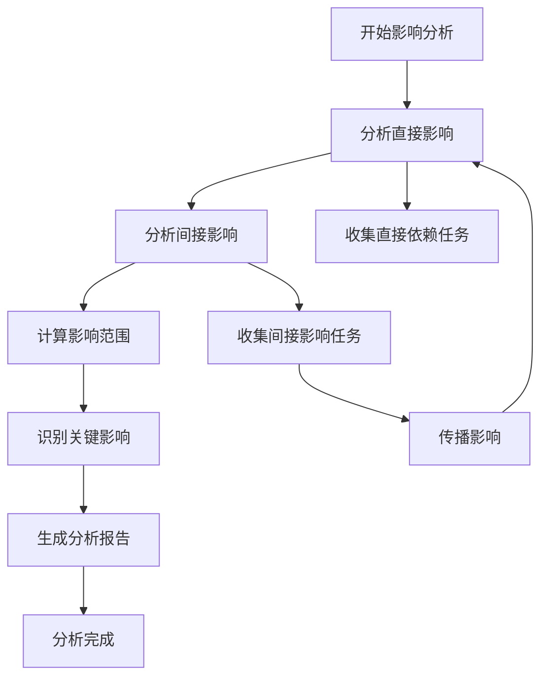

## 调度优化应用

### 关键路径分析

系统实现了关键路径分析算法，用于识别生产过程中的瓶颈环节：

#### 关键路径识别算法

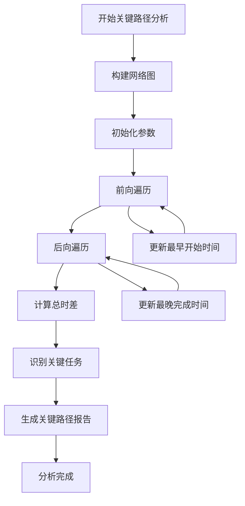

#### 调度优化策略

系统提供了多种调度优化策略：

1. **并行化优化**：识别可并行执行的任务
2. **资源平衡**：优化资源分配，避免瓶颈
3. **风险缓解**：识别潜在风险并提供缓解措施

### 瓶颈识别算法

系统实现了智能的瓶颈识别算法：

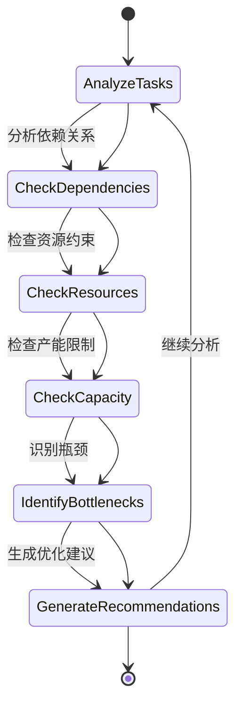

**图表来源**
- [task-breakdown.ts:142-181](file://src/pages/task-breakdown.ts#L142-L181)

**章节来源**
- [task-breakdown.ts:142-181](file://src/pages/task-breakdown.ts#L142-L181)

## 性能考虑

### 算法复杂度分析

系统的关键算法具有良好的时间复杂度：

- **拓扑排序**：O(V+E)，其中V为任务数，E为依赖关系数
- **循环依赖检测**：O(V+E)，使用深度优先搜索
- **关键路径分析**：O(V+E)，两次遍历完成
- **依赖关系验证**：O(V+E)，一次性验证所有依赖关系

### 内存优化策略

系统采用了多种内存优化策略：

1. **延迟加载**：只在需要时加载任务数据
2. **缓存机制**：缓存常用的依赖关系查询结果
3. **增量更新**：只更新受影响的任务状态
4. **数据压缩**：对大量相似数据进行压缩存储

### 并发处理

系统支持并发处理多个任务的依赖关系：

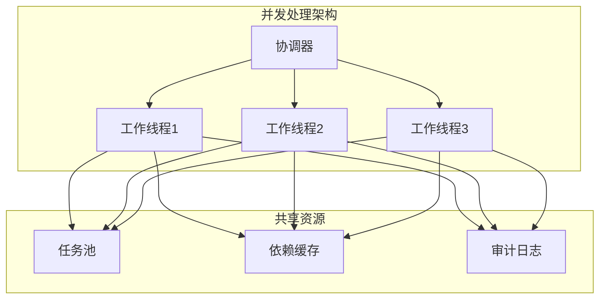

## 故障排除指南

### 常见问题诊断

#### 依赖关系错误

| 错误类型 | 症状 | 解决方案 |
|----------|------|----------|
| 自依赖错误 | 任务无法启动，状态显示错误 | 删除自依赖引用 |
| 循环依赖 | 系统报错，无法解析依赖 | 检查依赖链，打破循环 |
| 不存在的任务引用 | 依赖关系无效 | 确认被引用任务存在 |
| 阶段不兼容 | 任务无法执行 | 调整任务顺序或阶段 |

#### 性能问题

| 问题 | 可能原因 | 解决方案 |
|------|----------|----------|
| 页面加载缓慢 | 任务数量过多 | 实施分页加载 |
| 依赖关系更新延迟 | 网络延迟 | 调整同步频率 |
| 图表渲染卡顿 | 图形复杂度过高 | 简化图表显示 |

### 调试工具

系统提供了多种调试工具：

1. **依赖关系检查器**：验证依赖关系的有效性
2. **性能监控器**：监控系统性能指标
3. **审计日志查看器**：查看所有操作历史
4. **状态跟踪器**：跟踪任务状态变化

**章节来源**
- [dependencies.ts:103-137](file://src/pages/dependencies.ts#L103-L137)
- [utils.ts:1-18](file://src/utils.ts#L1-L18)

## 结论

依赖关系管理系统通过精心设计的数据模型、高效的算法实现和直观的可视化展示，为生产制造提供了强大的依赖关系管理能力。

### 主要优势

1. **灵活性**：支持多种依赖关系表示方式和兼容性处理
2. **准确性**：实现了严格的依赖关系验证和循环依赖检测
3. **可视化**：提供了丰富的可视化展示方式
4. **实时性**：支持实时的状态更新和影响分析
5. **可扩展性**：模块化设计便于功能扩展

### 技术特色

- **智能算法**：拓扑排序、关键路径分析、瓶颈识别
- **实时同步**：自动化的状态同步和更新机制
- **全面审计**：完整的操作记录和影响分析
- **用户友好**：直观的图形化界面和交互体验

该系统为现代制造业的数字化转型提供了坚实的技术基础，能够有效提升生产效率和管理水平。