# 印花需求管理

<cite>
**本文档引用的文件**
- [process-print-requirements.ts](file://src/pages/process-print-requirements.ts)
- [process-print-orders.ts](file://src/pages/process-print-orders.ts)
- [dye-print-orders.ts](file://src/pages/dye-print-orders.ts)
- [qc-records.ts](file://src/pages/qc-records.ts)
- [qc-standards.ts](file://src/pages/qc-standards.ts)
- [store-domain-quality-types.ts](file://src/data/fcs/store-domain-quality-types.ts)
- [store-domain-quality-seeds.ts](file://src/data/fcs/store-domain-quality-seeds.ts)
- [store-domain-quality-bootstrap.ts](file://src/data/fcs/store-domain-quality-bootstrap.ts)
- [process-order-create-bridge.ts](file://src/pages/process-order-create-bridge.ts)
- [utils.ts](file://src/utils.ts)
</cite>

## 目录
1. [项目概述](#项目概述)
2. [系统架构](#系统架构)
3. [核心组件分析](#核心组件分析)
4. [印花需求生命周期管理](#印花需求生命周期管理)
5. [技术规格管理](#技术规格管理)
6. [与生产计划集成](#与生产计划集成)
7. [质量标准与检验流程](#质量标准与检验流程)
8. [数据模型与状态管理](#数据模型与状态管理)
9. [性能考虑](#性能考虑)
10. [故障排除指南](#故障排除指南)
11. [总结](#总结)

## 项目概述

印花需求管理系统是一个基于前端技术栈构建的综合性管理系统，专门用于管理印花需求的全生命周期。该系统涵盖了从需求申请、设计确认、花型制作到质量检验的完整业务流程，实现了与生产计划的深度集成。

系统采用模块化设计，包含多个核心功能模块：印花需求管理、印花加工订单管理、染印加工单管理、质量检验管理等。所有模块都基于统一的数据模型和状态管理机制，确保了系统的整体性和一致性。

## 系统架构

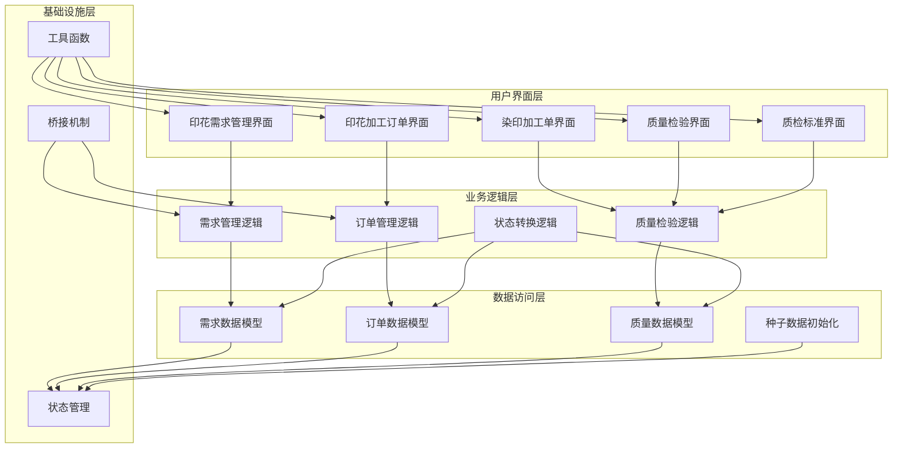

**图表来源**
- [process-print-requirements.ts:1-996](file://src/pages/process-print-requirements.ts#L1-L996)
- [process-print-orders.ts:1-1159](file://src/pages/process-print-orders.ts#L1-L1159)
- [dye-print-orders.ts:1-1326](file://src/pages/dye-print-orders.ts#L1-L1326)

## 核心组件分析

### 印花需求管理组件

印花需求管理组件是整个系统的核心，负责管理印花需求的全生命周期。该组件包含了完整的数据模型定义、业务逻辑处理和用户界面交互。

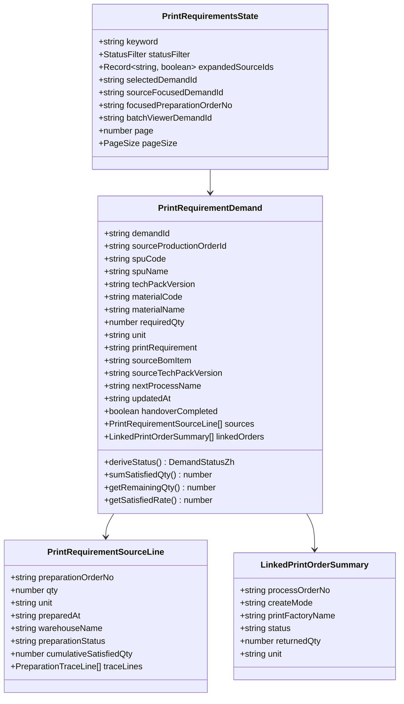

**图表来源**
- [process-print-requirements.ts:40-58](file://src/pages/process-print-requirements.ts#L40-L58)
- [process-print-requirements.ts:11-29](file://src/pages/process-print-requirements.ts#L11-L29)
- [process-print-requirements.ts:31-38](file://src/pages/process-print-requirements.ts#L31-L38)

### 印花加工订单管理组件

印花加工订单管理组件负责管理印花加工订单的创建、执行和监控。该组件实现了复杂的业务逻辑，包括订单状态管理、回货跟踪和批次关联等功能。

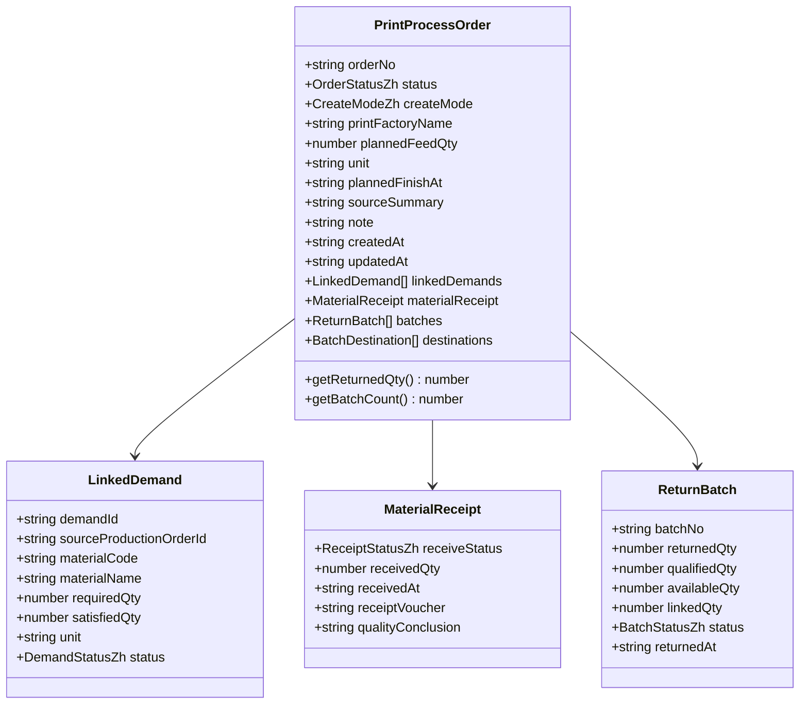

**图表来源**
- [process-print-orders.ts:48-64](file://src/pages/process-print-orders.ts#L48-L64)
- [process-print-orders.ts:12-21](file://src/pages/process-print-orders.ts#L12-L21)
- [process-print-orders.ts:23-29](file://src/pages/process-print-orders.ts#L23-L29)

### 质量检验管理组件

质量检验管理组件提供了完整的质量控制功能，包括质检记录管理、扣款依据管理和处置流程控制。

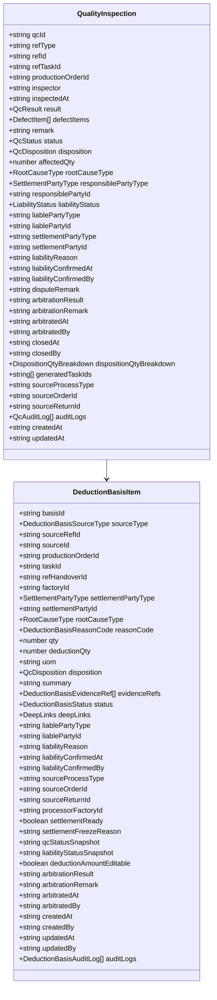

**图表来源**
- [store-domain-quality-types.ts:157-203](file://src/data/fcs/store-domain-quality-types.ts#L157-L203)
- [store-domain-quality-types.ts:259-303](file://src/data/fcs/store-domain-quality-types.ts#L259-L303)

**章节来源**
- [process-print-requirements.ts:1-996](file://src/pages/process-print-requirements.ts#L1-L996)
- [process-print-orders.ts:1-1159](file://src/pages/process-print-orders.ts#L1-L1159)
- [dye-print-orders.ts:1-1326](file://src/pages/dye-print-orders.ts#L1-L1326)
- [store-domain-quality-types.ts:1-304](file://src/data/fcs/store-domain-quality-types.ts#L1-L304)

## 印花需求生命周期管理

印花需求的生命周期管理涵盖了从需求创建到最终完成的完整过程。系统通过状态管理和业务逻辑确保每个环节的准确执行。

### 需求状态流转

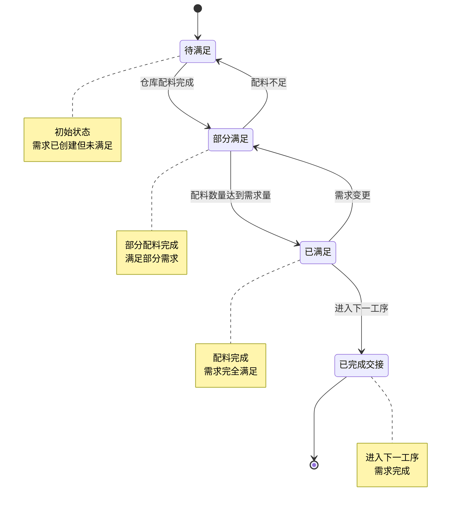

**图表来源**
- [process-print-requirements.ts:412-418](file://src/pages/process-print-requirements.ts#L412-L418)

### 配料满足追踪

系统实现了多层次的配料满足追踪机制，确保能够准确追踪每个需求的满足来源和满足进度。

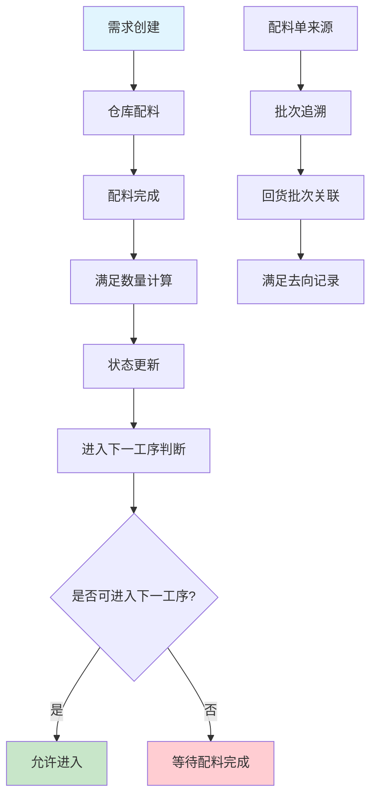

**图表来源**
- [process-print-requirements.ts:399-422](file://src/pages/process-print-requirements.ts#L399-L422)
- [process-print-orders.ts:397-403](file://src/pages/process-print-orders.ts#L397-L403)

**章节来源**
- [process-print-requirements.ts:412-422](file://src/pages/process-print-requirements.ts#L412-L422)
- [process-print-orders.ts:397-403](file://src/pages/process-print-orders.ts#L397-L403)

## 技术规格管理

技术规格管理是印花需求管理系统的重要组成部分，涵盖了图案设计、色彩配置、印花工艺参数设置等功能。

### 图案设计规格

系统支持多种印花图案的设计规格管理，包括图案位置、尺寸精度、颜色配置等关键参数。

### 色彩配置管理

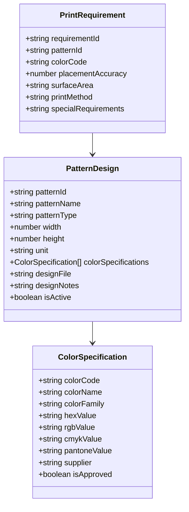

**图表来源**
- [process-print-requirements.ts:96-97](file://src/pages/process-print-requirements.ts#L96-L97)
- [process-print-requirements.ts:115-116](file://src/pages/process-print-requirements.ts#L115-L116)

### 印花工艺参数

系统支持多种印花工艺的参数配置，包括数码印花、胶浆印花、热转印等不同工艺的技术参数设置。

**章节来源**
- [process-print-requirements.ts:96-116](file://src/pages/process-print-requirements.ts#L96-L116)

## 与生产计划集成

印花需求管理系统与生产计划的集成实现了从需求到执行的无缝衔接，确保生产计划的准确性和可执行性。

### 生产单驱动机制

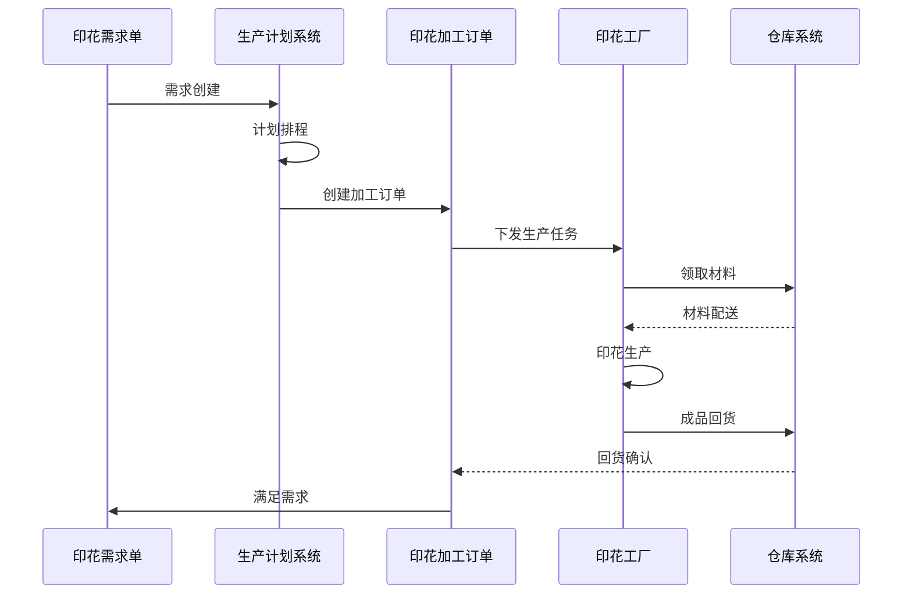

**图表来源**
- [process-print-requirements.ts:85-83](file://src/pages/process-print-requirements.ts#L85-L83)
- [process-print-orders.ts:113-111](file://src/pages/process-print-orders.ts#L113-L111)

### 需求到订单的转换

系统实现了从印花需求到加工订单的自动化转换机制，支持按需求创建和按备货创建两种模式。

**章节来源**
- [process-print-requirements.ts:85-83](file://src/pages/process-print-requirements.ts#L85-L83)
- [process-print-orders.ts:113-111](file://src/pages/process-print-orders.ts#L113-L111)

## 质量标准与检验流程

质量标准与检验流程是印花需求管理系统的核心功能之一，提供了完整的质量控制和管理能力。

### 质检标准体系

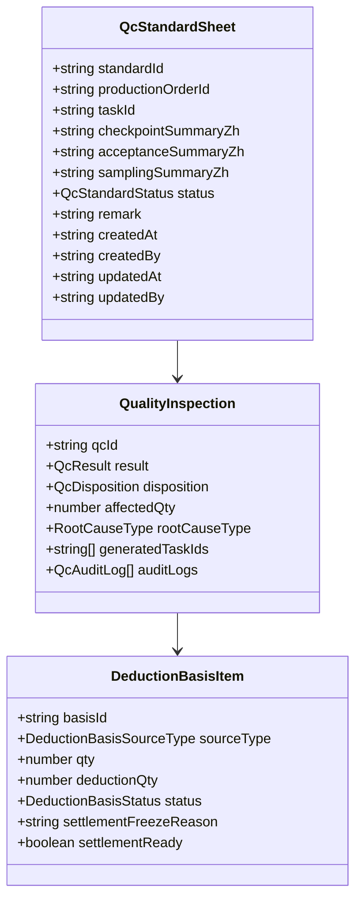

**图表来源**
- [qc-standards.ts:14-27](file://src/pages/qc-standards.ts#L14-L27)
- [store-domain-quality-types.ts:157-203](file://src/data/fcs/store-domain-quality-types.ts#L157-L203)

### 质检流程管理

系统实现了完整的质检流程管理，包括质检点设置、验收标准制定、检验执行和处置流程控制。

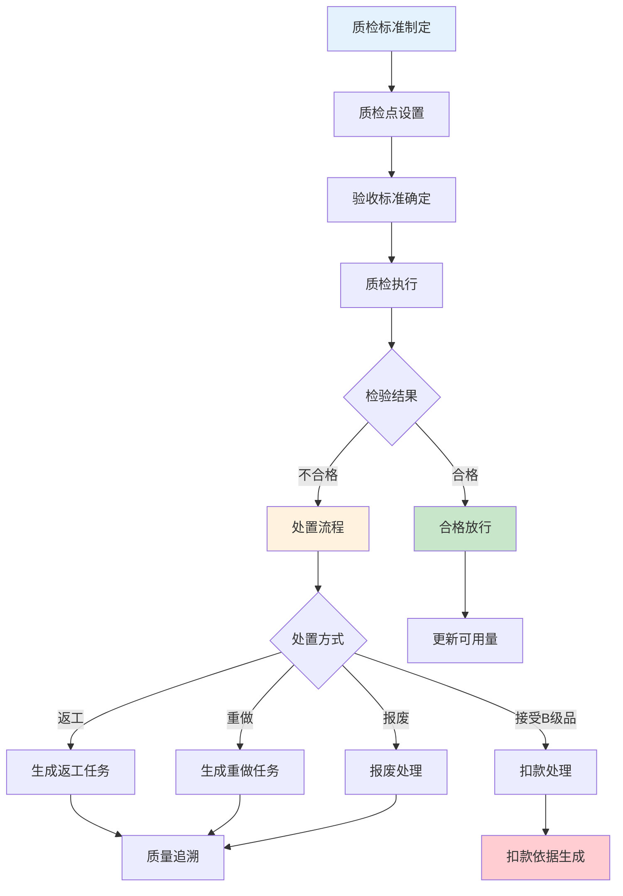

**图表来源**
- [qc-records.ts:561-635](file://src/pages/qc-records.ts#L561-L635)
- [dye-print-orders.ts:360-555](file://src/pages/dye-print-orders.ts#L360-L555)

**章节来源**
- [qc-standards.ts:14-27](file://src/pages/qc-standards.ts#L14-L27)
- [qc-records.ts:561-635](file://src/pages/qc-records.ts#L561-L635)
- [dye-print-orders.ts:360-555](file://src/pages/dye-print-orders.ts#L360-L555)

## 数据模型与状态管理

数据模型与状态管理是印花需求管理系统的基础架构，提供了统一的数据结构和状态转换机制。

### 核心数据模型

```mermaid
erDiagram
PRINT_REQUIREMENT_DEMAND {
string demandId PK
string sourceProductionOrderId
string spuCode
string spuName
string techPackVersion
string materialCode
string materialName
number requiredQty
string unit
string printRequirement
string sourceBomItem
string sourceTechPackVersion
string nextProcessName
string updatedAt
boolean handoverCompleted
}
PRINT_PROCESS_ORDER {
string orderNo PK
string status
string createMode
string printFactoryName
number plannedFeedQty
string unit
string plannedFinishAt
string sourceSummary
string note
string createdAt
string updatedAt
}
QUALITY_INSPECTION {
string qcId PK
string refType
string refId
string productionOrderId
string inspector
string inspectedAt
string result
string status
string disposition
number affectedQty
string rootCauseType
string responsiblePartyType
string responsiblePartyId
string liabilityStatus
}
DEDUCTION_BASIS_ITEM {
string basisId PK
string sourceType
string sourceRefId
string productionOrderId
string taskId
string factoryId
string settlementPartyType
string settlementPartyId
string reasonCode
number qty
number deductionQty
string status
string settlementFreezeReason
boolean settlementReady
}
PRINT_REQUIREMENT_DEMAND ||--o{ PRINT_PROCESS_ORDER : "关联"
PRINT_PROCESS_ORDER ||--o{ QUALITY_INSPECTION : "产生"
QUALITY_INSPECTION ||--o{ DEDUCTION_BASIS_ITEM : "生成"
```

**图表来源**
- [store-domain-quality-types.ts:95-118](file://src/data/fcs/store-domain-quality-types.ts#L95-L118)
- [store-domain-quality-types.ts:157-203](file://src/data/fcs/store-domain-quality-types.ts#L157-L203)
- [store-domain-quality-types.ts:259-303](file://src/data/fcs/store-domain-quality-types.ts#L259-L303)

### 状态管理机制

系统采用了集中式的状态管理机制，通过统一的状态枚举和转换规则确保数据的一致性和完整性。

**章节来源**
- [store-domain-quality-types.ts:95-118](file://src/data/fcs/store-domain-quality-types.ts#L95-L118)
- [store-domain-quality-types.ts:157-203](file://src/data/fcs/store-domain-quality-types.ts#L157-L203)
- [store-domain-quality-types.ts:259-303](file://src/data/fcs/store-domain-quality-types.ts#L259-L303)

## 性能考虑

系统在设计时充分考虑了性能优化，采用了多种策略来确保在大数据量情况下的响应速度和稳定性。

### 数据分页与虚拟滚动

系统实现了智能的数据分页和虚拟滚动机制，有效减少了DOM节点数量，提升了页面渲染性能。

### 缓存策略

系统采用了多层缓存策略，包括内存缓存、本地存储缓存等，减少重复计算和网络请求。

### 异步加载

关键数据采用异步加载机制，避免阻塞主线程，提升用户体验。

## 故障排除指南

### 常见问题诊断

1. **数据加载失败**：检查网络连接和API端点可用性
2. **状态更新异常**：验证状态转换规则和权限控制
3. **报表生成错误**：检查数据源和查询条件
4. **性能问题**：分析内存使用和渲染性能

### 调试工具

系统提供了完善的调试工具和日志记录机制，便于快速定位和解决问题。

**章节来源**
- [utils.ts:1-18](file://src/utils.ts#L1-L18)

## 总结

印花需求管理系统是一个功能完整、架构清晰的综合性管理系统。系统通过模块化的组件设计、完善的数据模型和严格的状态管理，实现了印花需求全生命周期的有效管理。

系统的主要优势包括：

1. **完整的业务覆盖**：从需求申请到质量检验的全流程管理
2. **灵活的集成能力**：与生产计划和质量控制系统的深度集成
3. **强大的数据管理**：统一的数据模型和状态管理机制
4. **优秀的用户体验**：直观的界面设计和高效的交互体验
5. **可靠的性能表现**：经过优化的架构设计确保系统稳定运行

该系统为印花行业提供了标准化的解决方案，有助于提高生产效率、保证产品质量和降低运营成本。