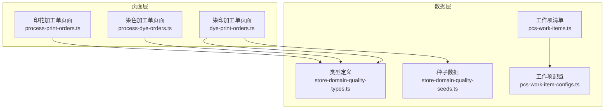
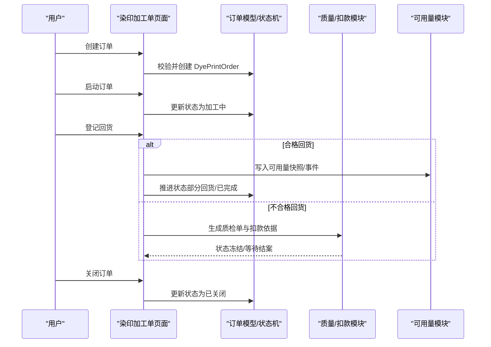
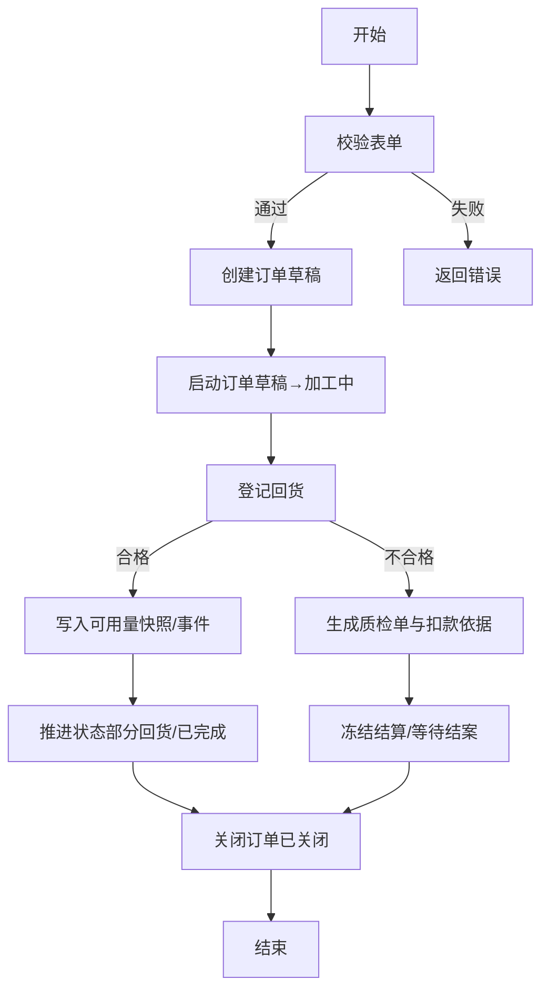
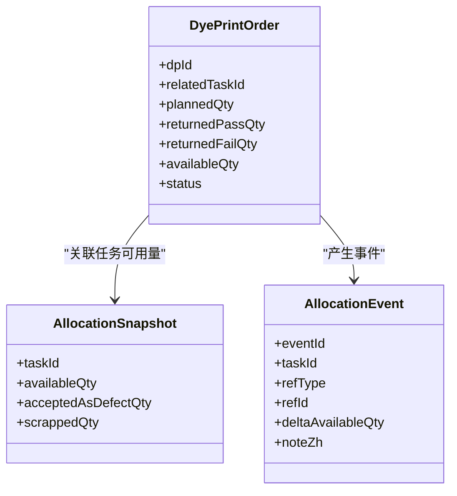
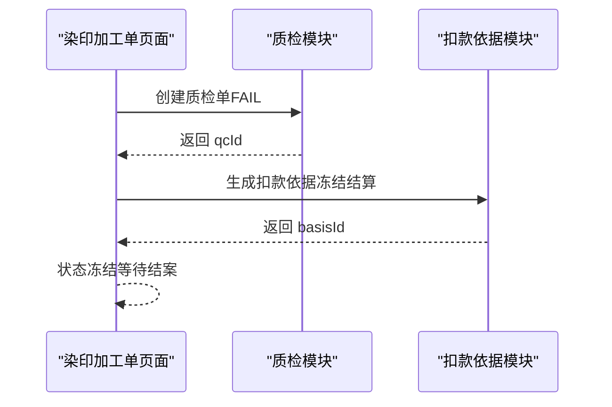
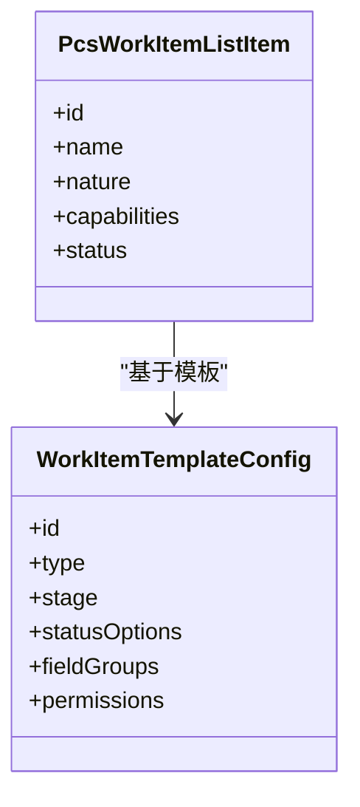
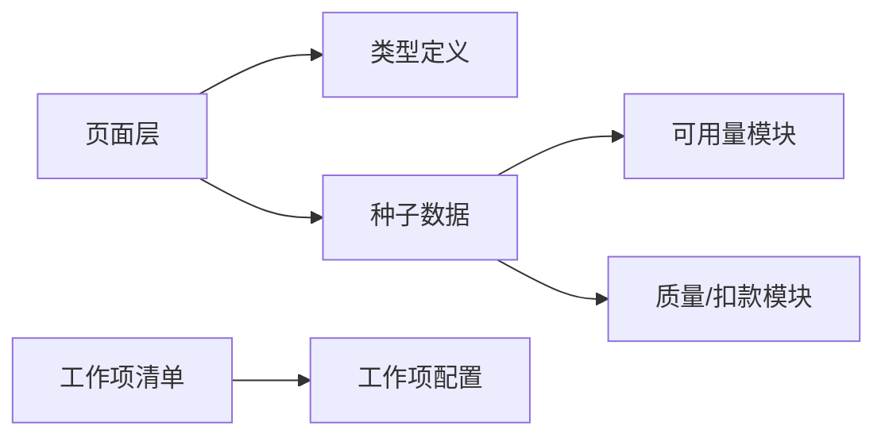

# 工序订单管理

<cite>
**本文档引用的文件**
- [dye-print-orders.ts](file://src/pages/dye-print-orders.ts)
- [store-domain-quality-types.ts](file://src/data/fcs/store-domain-quality-types.ts)
- [store-domain-quality-seeds.ts](file://src/data/fcs/store-domain-quality-seeds.ts)
- [process-dye-orders.ts](file://src/pages/process-dye-orders.ts)
- [process-print-orders.ts](file://src/pages/process-print-orders.ts)
- [pcs-work-items.ts](file://src/data/pcs-work-items.ts)
- [pcs-work-item-configs.ts](file://src/data/pcs-work-item-configs.ts)
</cite>

## 目录
1. [简介](#简介)
2. [项目结构](#项目结构)
3. [核心组件](#核心组件)
4. [架构总览](#架构总览)
5. [详细组件分析](#详细组件分析)
6. [依赖分析](#依赖分析)
7. [性能考虑](#性能考虑)
8. [故障排查指南](#故障排查指南)
9. [结论](#结论)
10. [附录](#附录)

## 简介
本技术文档围绕“工序订单管理系统”中的“染色订单”与“印花订单”的统一管理机制展开，覆盖从订单创建、分配、执行到完成的全流程控制，深入解释订单状态管理（未开始、进行中、已完成、异常等）的转换规则与触发条件，阐述订单与任务的绑定关系以及可用量写回机制，描述优先级与调度策略（紧急订单处理、批量合并、资源冲突解决）的设计思路，并提供关键流程的代码路径指引。

## 项目结构
本系统采用前端页面与数据种子/类型定义分离的组织方式：
- 页面层：负责交互与业务流程编排（如染印加工单创建、回货登记、状态推进等）
- 数据层：包含类型定义、种子数据与工作项配置，支撑状态机、扣款与可用量等业务规则
- 进程侧：提供染色/印花加工单的执行视图与回货追踪

**图表来源**
- [dye-print-orders.ts:1-800](file://src/pages/dye-print-orders.ts#L1-L800)
- [process-dye-orders.ts:1-800](file://src/pages/process-dye-orders.ts#L1-L800)
- [process-print-orders.ts:1-800](file://src/pages/process-print-orders.ts#L1-L800)
- [store-domain-quality-types.ts:1-304](file://src/data/fcs/store-domain-quality-types.ts#L1-L304)
- [store-domain-quality-seeds.ts:1-269](file://src/data/fcs/store-domain-quality-seeds.ts#L1-L269)
- [pcs-work-items.ts:1-267](file://src/data/pcs-work-items.ts#L1-L267)
- [pcs-work-item-configs.ts:1-800](file://src/data/pcs-work-item-configs.ts#L1-L800)

**章节来源**
- [dye-print-orders.ts:1-800](file://src/pages/dye-print-orders.ts#L1-L800)
- [store-domain-quality-types.ts:1-304](file://src/data/fcs/store-domain-quality-types.ts#L1-L304)
- [store-domain-quality-seeds.ts:1-269](file://src/data/fcs/store-domain-quality-seeds.ts#L1-L269)
- [process-dye-orders.ts:1-800](file://src/pages/process-dye-orders.ts#L1-L800)
- [process-print-orders.ts:1-800](file://src/pages/process-print-orders.ts#L1-L800)
- [pcs-work-items.ts:1-267](file://src/data/pcs-work-items.ts#L1-L267)
- [pcs-work-item-configs.ts:1-800](file://src/data/pcs-work-item-configs.ts#L1-L800)

## 核心组件
- 订单模型与状态机
  - 染印加工单（DyePrintOrder）：包含计划量、回货统计、可用量、状态、结算关系等字段
  - 状态枚举：草稿、加工中、部分回货、已完成、已关闭
  - 关键方法：创建、启动、关闭、登记回货、状态推进
- 质量与扣款体系
  - 质检单（QualityInspection）、扣款依据（DeductionBasisItem）、可用量快照与事件（AllocationSnapshot/AllocationEvent）
- 任务与工作项
  - 工作项清单与配置：用于承载执行类/决策类任务的生命周期与状态流

**章节来源**
- [store-domain-quality-types.ts:65-118](file://src/data/fcs/store-domain-quality-types.ts#L65-L118)
- [store-domain-quality-seeds.ts:258-268](file://src/data/fcs/store-domain-quality-seeds.ts#L258-L268)
- [dye-print-orders.ts:288-358](file://src/pages/dye-print-orders.ts#L288-L358)
- [pcs-work-items.ts:10-20](file://src/data/pcs-work-items.ts#L10-L20)
- [pcs-work-item-configs.ts:95-158](file://src/data/pcs-work-item-configs.ts#L95-L158)

## 架构总览
系统围绕“订单—任务—可用量—质量/扣款”闭环构建：
- 订单创建：填写生产工单号、关联任务、承接主体、工艺类型、计划量
- 订单启动：状态从草稿切换为加工中
- 回货登记：合格回货直接写入任务可用量；不合格回货生成质检单与扣款依据
- 状态推进：根据累计回货量推进到“部分回货/已完成”，或由人工关闭
- 可用量写回：通过快照与事件记录，确保流程可用量实时更新

**图表来源**
- [dye-print-orders.ts:288-555](file://src/pages/dye-print-orders.ts#L288-L555)
- [store-domain-quality-types.ts:19-41](file://src/data/fcs/store-domain-quality-types.ts#L19-L41)
- [store-domain-quality-seeds.ts:239-251](file://src/data/fcs/store-domain-quality-seeds.ts#L239-L251)

## 详细组件分析

### 组件A：染印加工单（DyePrintOrder）与状态机
- 订单字段与职责
  - 关联任务（relatedTaskId）：用于合格回货的可用量写回
  - 计划量与回货统计：plannedQty、returnedPassQty、returnedFailQty、availableQty
  - 结算关系：processorFactoryId、settlementPartyType、settlementRelation
  - 状态推进：草稿→加工中→部分回货→已完成→已关闭
- 关键流程
  - 创建：生成唯一 dpId，初始状态为草稿
  - 启动：仅草稿可启动，状态变更为加工中
  - 回货登记：校验数量、处置方式；合格写入可用量；不合格生成质检单与扣款依据
  - 关闭：已关闭不可重复关闭

**图表来源**
- [dye-print-orders.ts:264-358](file://src/pages/dye-print-orders.ts#L264-L358)
- [dye-print-orders.ts:360-555](file://src/pages/dye-print-orders.ts#L360-L555)

**章节来源**
- [dye-print-orders.ts:288-358](file://src/pages/dye-print-orders.ts#L288-L358)
- [dye-print-orders.ts:360-555](file://src/pages/dye-print-orders.ts#L360-L555)
- [store-domain-quality-types.ts:65-118](file://src/data/fcs/store-domain-quality-types.ts#L65-L118)

### 组件B：可用量写回与任务绑定
- 任务可用量快照
  - 以 taskId 为键，维护 availableQty、acceptedAsDefectQty、scrappedQty
  - 每次合格回货产生 AllocationEvent，记录 delta 与备注
- 绑定关系
  - 订单必须关联 relatedTaskId，否则无法同步可用量
  - 合格回货数量累加到对应任务的可用量

**图表来源**
- [store-domain-quality-types.ts:21-41](file://src/data/fcs/store-domain-quality-types.ts#L21-L41)
- [store-domain-quality-seeds.ts:239-251](file://src/data/fcs/store-domain-quality-seeds.ts#L239-L251)
- [dye-print-orders.ts:518-552](file://src/pages/dye-print-orders.ts#L518-L552)

**章节来源**
- [store-domain-quality-types.ts:21-41](file://src/data/fcs/store-domain-quality-types.ts#L21-L41)
- [store-domain-quality-seeds.ts:239-251](file://src/data/fcs/store-domain-quality-seeds.ts#L239-L251)
- [dye-print-orders.ts:518-552](file://src/pages/dye-print-orders.ts#L518-L552)

### 组件C：质量与扣款（FAIL 回货）
- 不合格回货触发流程
  - 生成 QualityInspection（状态 SUBMITTED）
  - 自动生成 DeductionBasisItem（状态 DRAFT），冻结结算
  - 生成后续仲裁/结案流程（由质量域驱动）
- 处置方式
  - 返工、重做、接受B级品、报废、接受无扣款
  - 影响可用量写回时机：需结案后才可写入

**图表来源**
- [dye-print-orders.ts:386-483](file://src/pages/dye-print-orders.ts#L386-L483)
- [store-domain-quality-types.ts:157-203](file://src/data/fcs/store-domain-quality-types.ts#L157-L203)
- [store-domain-quality-types.ts:259-303](file://src/data/fcs/store-domain-quality-types.ts#L259-L303)

**章节来源**
- [dye-print-orders.ts:386-483](file://src/pages/dye-print-orders.ts#L386-L483)
- [store-domain-quality-types.ts:157-203](file://src/data/fcs/store-domain-quality-types.ts#L157-L203)
- [store-domain-quality-types.ts:259-303](file://src/data/fcs/store-domain-quality-types.ts#L259-L303)

### 组件D：工作项与任务（PCS）
- 工作项清单与配置
  - 支持执行类/决策类任务，具备能力标记（可复用、可多实例、可并行、可回退）
  - 通过模板配置定义状态流、权限、字段组等
- 与订单/任务的关系
  - 工作项可作为任务的载体，驱动订单执行与状态流转
  - 与可用量写回解耦，但可通过任务状态影响订单可用量的释放

**图表来源**
- [pcs-work-items.ts:10-20](file://src/data/pcs-work-items.ts#L10-L20)
- [pcs-work-item-configs.ts:95-158](file://src/data/pcs-work-item-configs.ts#L95-L158)

**章节来源**
- [pcs-work-items.ts:135-170](file://src/data/pcs-work-items.ts#L135-L170)
- [pcs-work-item-configs.ts:95-158](file://src/data/pcs-work-item-configs.ts#L95-L158)

### 组件E：进程侧加工单（染色/印花）
- 染色/印花加工单页面提供执行视图，包含来料接收、回货批次、满足去向等字段
- 与染印加工单的区别在于：它们是“进程侧”的执行对象，而染印加工单是“质量域”的回货与可用量写回入口
- 两者通过“需求单/生产单”在更高层进行对齐

**章节来源**
- [process-dye-orders.ts:113-303](file://src/pages/process-dye-orders.ts#L113-L303)
- [process-print-orders.ts:113-303](file://src/pages/process-print-orders.ts#L113-L303)

## 依赖分析
- 模块耦合
  - 页面层依赖类型定义与种子数据，保证运行期一致性
  - 可用量模块与质量/扣款模块相互独立，通过订单状态与事件解耦
- 外部依赖
  - 无 React 依赖的类型定义便于跨模块共享
  - 工作项配置通过模板化降低硬编码，提升扩展性

**图表来源**
- [store-domain-quality-types.ts:1-304](file://src/data/fcs/store-domain-quality-types.ts#L1-L304)
- [store-domain-quality-seeds.ts:1-269](file://src/data/fcs/store-domain-quality-seeds.ts#L1-L269)
- [pcs-work-items.ts:1-267](file://src/data/pcs-work-items.ts#L1-L267)
- [pcs-work-item-configs.ts:1-800](file://src/data/pcs-work-item-configs.ts#L1-L800)

**章节来源**
- [store-domain-quality-types.ts:1-304](file://src/data/fcs/store-domain-quality-types.ts#L1-L304)
- [store-domain-quality-seeds.ts:1-269](file://src/data/fcs/store-domain-quality-seeds.ts#L1-L269)
- [pcs-work-items.ts:1-267](file://src/data/pcs-work-items.ts#L1-L267)
- [pcs-work-item-configs.ts:1-800](file://src/data/pcs-work-item-configs.ts#L1-L800)

## 性能考虑
- 状态推进与可用量写回均为内存态操作，复杂度主要受订单/任务数量影响
- 通过快照与事件分离，避免频繁全量重算
- 建议在大规模场景下：
  - 对订单列表进行分页与筛选缓存
  - 将可用量写回与质检/扣款流程异步化
  - 对状态机推进增加幂等校验，避免重复写回

## 故障排查指南
- 常见问题
  - 订单状态不可推进：检查是否处于草稿/加工中/部分回货等允许状态
  - 回货登记失败：检查数量是否为正整数、相关任务是否已关联、不合格是否选择了处置方式
  - 可用量未更新：确认订单已关联任务，且回货为合格
- 定位方法
  - 查看订单 returnBatches 与 availableQty 是否变化
  - 检查 AllocationSnapshot 与 AllocationEvent 是否生成
  - 若为不合格回货，确认 QC 与 DeductionBasisItem 是否创建且状态冻结

**章节来源**
- [dye-print-orders.ts:360-383](file://src/pages/dye-print-orders.ts#L360-L383)
- [dye-print-orders.ts:518-552](file://src/pages/dye-print-orders.ts#L518-L552)
- [store-domain-quality-seeds.ts:239-251](file://src/data/fcs/store-domain-quality-seeds.ts#L239-L251)

## 结论
本系统通过“染印加工单”统一承载染色与印花的回货登记与可用量写回，结合“质量/扣款”与“可用量快照/事件”机制，实现了从创建、启动、回货登记到状态推进与关闭的完整闭环。工作项配置进一步为任务执行提供了可扩展的状态流与能力标记。建议在实际部署中强化异步化与幂等校验，以应对更大规模的并发与复杂业务场景。

## 附录
- 代码路径示例（仅提供路径，不展示具体代码内容）
  - 订单创建流程：[创建函数:288-328](file://src/pages/dye-print-orders.ts#L288-L328)
  - 订单启动流程：[启动函数:330-343](file://src/pages/dye-print-orders.ts#L330-L343)
  - 回货登记流程：[登记函数:360-555](file://src/pages/dye-print-orders.ts#L360-L555)
  - 可用量写回：[写回逻辑:518-552](file://src/pages/dye-print-orders.ts#L518-L552)
  - 类型定义：[订单与状态:65-118](file://src/data/fcs/store-domain-quality-types.ts#L65-L118)
  - 种子数据：[订单示例:258-268](file://src/data/fcs/store-domain-quality-seeds.ts#L258-L268)
  - 工作项配置：[模板配置:95-158](file://src/data/pcs-work-item-configs.ts#L95-L158)