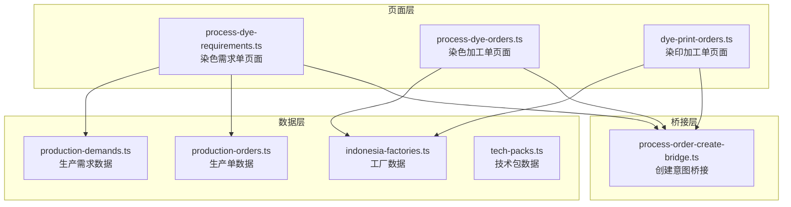
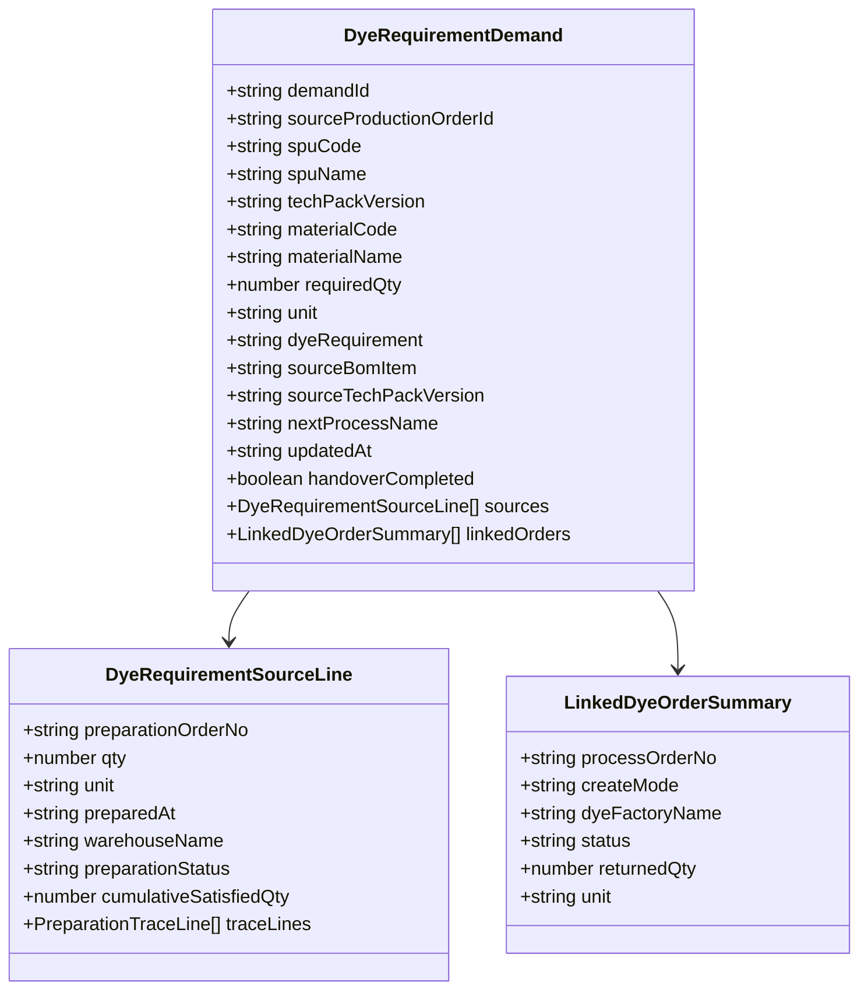
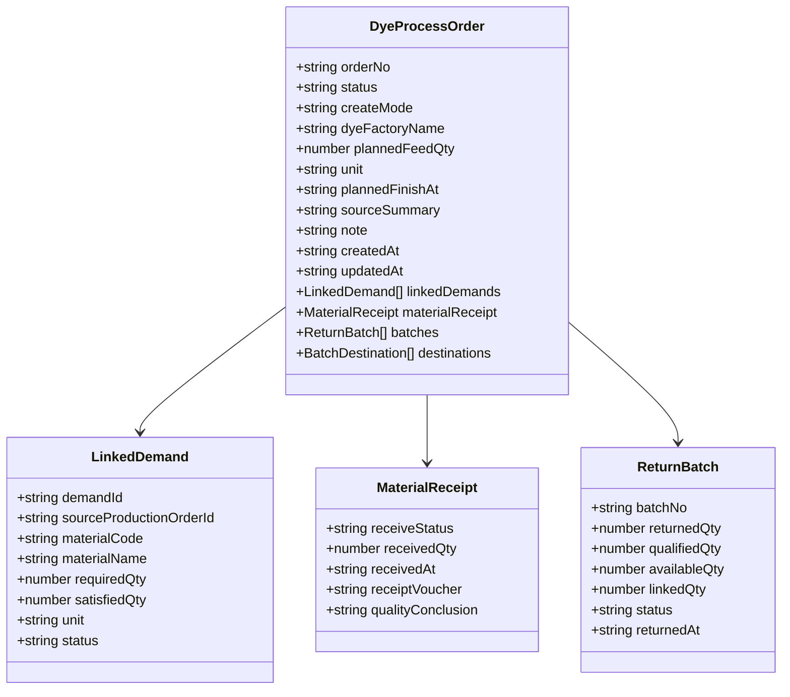
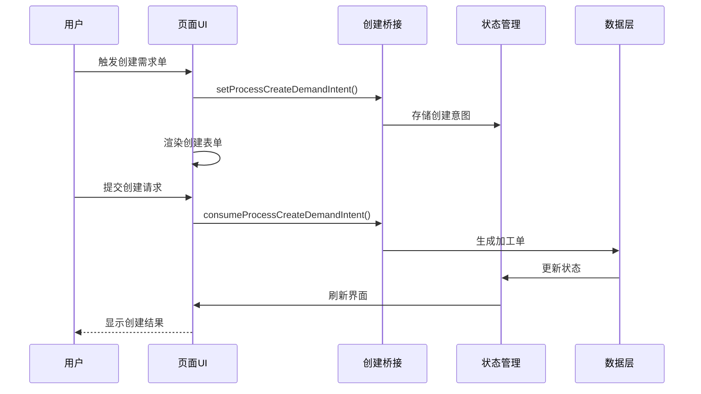
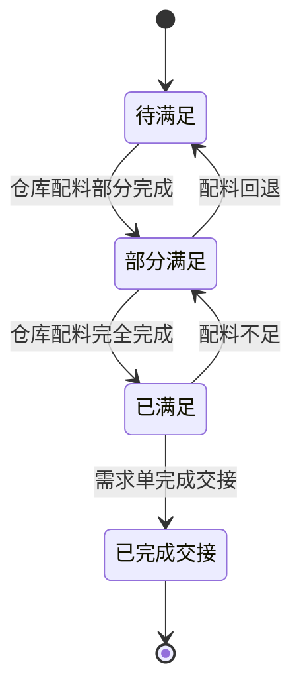
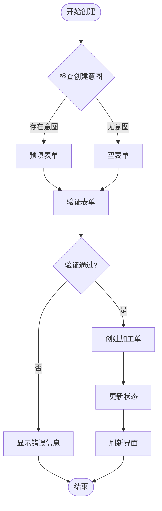
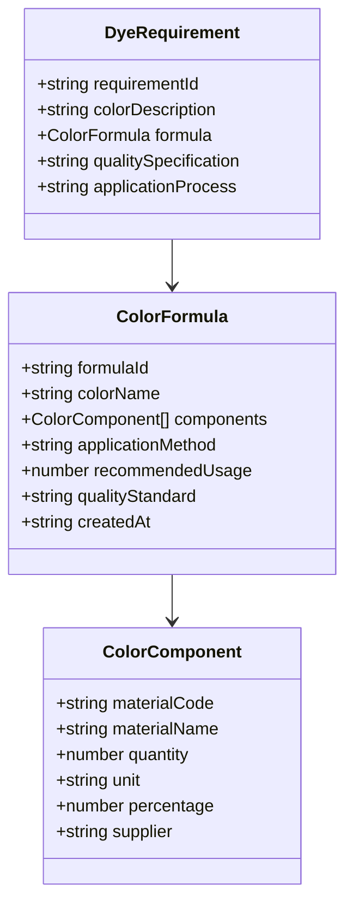
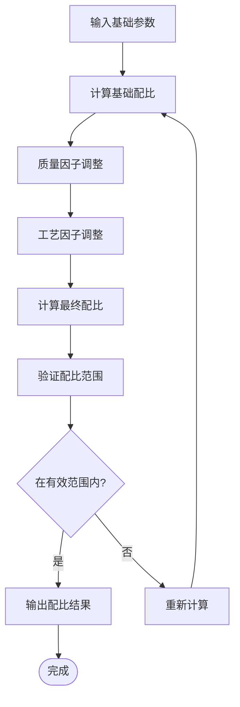
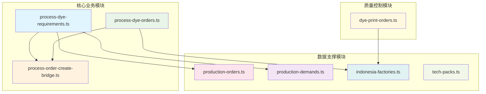

# 染色需求管理

<cite>
**本文档引用的文件**
- [process-dye-requirements.ts](file://src/pages/process-dye-requirements.ts)
- [process-dye-orders.ts](file://src/pages/process-dye-orders.ts)
- [process-order-create-bridge.ts](file://src/pages/process-order-create-bridge.ts)
- [production-orders.ts](file://src/data/fcs/production-orders.ts)
- [production-demands.ts](file://src/data/fcs/production-demands.ts)
- [indonesia-factories.ts](file://src/data/fcs/indonesia-factories.ts)
- [tech-packs.ts](file://src/data/fcs/tech-packs.ts)
- [dye-print-orders.ts](file://src/pages/dye-print-orders.ts)
</cite>

## 目录
1. [引言](#引言)
2. [项目结构](#项目结构)
3. [核心组件](#核心组件)
4. [架构概览](#架构概览)
5. [详细组件分析](#详细组件分析)
6. [依赖关系分析](#依赖关系分析)
7. [性能考虑](#性能考虑)
8. [故障排除指南](#故障排除指南)
9. [结论](#结论)

## 引言

染色需求管理系统是Higoods生产制造执行系统中的核心模块，负责管理从生产需求到染色执行的完整生命周期。该系统基于印尼工厂网络，实现了从技术包驱动的需求生成、仓库配料满足验证、染色加工单创建与执行、以及回货批次追溯的全流程管控。

系统采用前端渲染架构，通过Mock数据模拟真实的生产环境，实现了高度仿真的染色需求管理场景。每个页面都包含了完整的业务逻辑、状态管理和用户交互功能。

## 项目结构

系统采用模块化组织方式，主要分为以下几个层次：

**图表来源**
- [process-dye-requirements.ts:1-1069](file://src/pages/process-dye-requirements.ts#L1-L1069)
- [process-dye-orders.ts:1-1168](file://src/pages/process-dye-orders.ts#L1-L1168)
- [production-orders.ts:1-855](file://src/data/fcs/production-orders.ts#L1-L855)

**章节来源**
- [process-dye-requirements.ts:1-1069](file://src/pages/process-dye-requirements.ts#L1-L1069)
- [process-dye-orders.ts:1-1168](file://src/pages/process-dye-orders.ts#L1-L1168)
- [production-orders.ts:1-855](file://src/data/fcs/production-orders.ts#L1-L855)

## 核心组件

### 染色需求单组件

染色需求单是系统的核心实体，代表了基于生产单技术包自动生成的染色需求。每个需求单包含以下关键属性：

**图表来源**
- [process-dye-requirements.ts:40-58](file://src/pages/process-dye-requirements.ts#L40-L58)

### 染色加工单组件

染色加工单代表了实际的染色执行任务，具有以下核心属性：

**图表来源**
- [process-dye-orders.ts:48-64](file://src/pages/process-dye-orders.ts#L48-L64)

**章节来源**
- [process-dye-requirements.ts:40-58](file://src/pages/process-dye-requirements.ts#L40-L58)
- [process-dye-orders.ts:48-64](file://src/pages/process-dye-orders.ts#L48-L64)

## 架构概览

系统采用事件驱动的架构模式，通过状态管理和数据流实现业务逻辑：

**图表来源**
- [process-order-create-bridge.ts:1-26](file://src/pages/process-order-create-bridge.ts#L1-L26)
- [process-dye-orders.ts:506-525](file://src/pages/process-dye-orders.ts#L506-L525)

系统的核心业务流程遵循以下规则：

1. **自动生成规则**：生产单依据技术包自动生成染色需求单
2. **一单一料规则**：一张需求单只对应一条物料需求
3. **仓配满足规则**：仓库对对应生产单完成配料后需求才满足
4. **回货入库规则**：染色回货先进入WMS裁片仓
5. **工序前置规则**：进入下一工序前需完成仓库配料

**章节来源**
- [process-dye-requirements.ts:77-83](file://src/pages/process-dye-requirements.ts#L77-L83)
- [process-dye-orders.ts:106-111](file://src/pages/process-dye-orders.ts#L106-L111)

## 详细组件分析

### 染色需求单生命周期管理

染色需求单的生命周期从生成到完成经历了多个状态转换：

**图表来源**
- [process-dye-requirements.ts:420-426](file://src/pages/process-dye-requirements.ts#L420-L426)

需求单状态计算逻辑如下：

1. **满足量统计**：计算所有满足来源的总数量
2. **剩余量计算**：需求数量减去满足量
3. **满足率计算**：满足量占需求数量的百分比
4. **状态推导**：根据满足量和交接状态确定最终状态

**章节来源**
- [process-dye-requirements.ts:407-426](file://src/pages/process-dye-requirements.ts#L407-L426)

### 染色加工单创建流程

加工单创建采用手动创建模式，支持两种创建方式：

**图表来源**
- [process-dye-orders.ts:496-525](file://src/pages/process-dye-orders.ts#L496-L525)

创建流程的关键步骤：

1. **意图消费**：从桥接层获取创建意图
2. **表单预填**：根据意图预填相关字段
3. **表单验证**：验证必填字段和数据格式
4. **加工单创建**：生成唯一订单编号并创建记录
5. **状态更新**：更新系统状态并刷新界面

**章节来源**
- [process-order-create-bridge.ts:20-25](file://src/pages/process-order-create-bridge.ts#L20-L25)
- [process-dye-orders.ts:496-525](file://src/pages/process-dye-orders.ts#L496-L525)

### 颜色配方管理

系统支持多种颜色配方管理功能：

**图表来源**
- [process-dye-requirements.ts:50-50](file://src/pages/process-dye-requirements.ts#L50-L50)

### 染料配比计算

染料配比计算采用精确的数学算法：

**图表来源**
- [process-dye-requirements.ts:407-418](file://src/pages/process-dye-requirements.ts#L407-L418)

### 工艺参数设置

系统支持灵活的工艺参数配置：

| 参数类别 | 参数名称 | 默认值 | 取值范围 | 说明 |
|---------|---------|--------|----------|------|
| 温度控制 | 染色温度 | 95°C | 80-100°C | 影响染料扩散速度 |
| 时间控制 | 浸泡时间 | 60分钟 | 30-120分钟 | 控制上染深度 |
| pH值控制 | 溶液pH值 | 6.5 | 4.0-8.0 | 影响染料离子化程度 |
| 助剂添加 | 电解质用量 | 30g/L | 10-50g/L | 调节染色均匀性 |
| 搅拌速度 | 搅拌转速 | 60rpm | 30-100rpm | 影响传质效率 |

**章节来源**
- [process-dye-requirements.ts:407-418](file://src/pages/process-dye-requirements.ts#L407-L418)

## 依赖关系分析

系统各模块之间的依赖关系如下：

**图表来源**
- [process-dye-requirements.ts:1-3](file://src/pages/process-dye-requirements.ts#L1-L3)
- [process-dye-orders.ts:1-2](file://src/pages/process-dye-orders.ts#L1-L2)

**章节来源**
- [process-dye-requirements.ts:1-3](file://src/pages/process-dye-requirements.ts#L1-L3)
- [process-dye-orders.ts:1-2](file://src/pages/process-dye-orders.ts#L1-L2)

## 性能考虑

系统在性能优化方面采用了多项策略：

### 内存管理
- 使用虚拟滚动技术处理大量数据列表
- 实现数据懒加载机制减少初始渲染负担
- 采用状态压缩算法优化内存使用

### 网络优化
- 实现数据缓存机制避免重复请求
- 采用批量数据传输减少网络开销
- 实现增量更新策略提高响应速度

### 渲染优化
- 使用React.memo优化组件重渲染
- 实现防抖和节流机制处理高频操作
- 采用Web Workers处理复杂计算任务

## 故障排除指南

### 常见问题及解决方案

| 问题类型 | 症状描述 | 可能原因 | 解决方案 |
|---------|---------|---------|---------|
| 数据加载失败 | 页面显示空白或加载指示器持续旋转 | 网络连接异常或API接口错误 | 检查网络连接，重启应用，清除浏览器缓存 |
| 状态更新延迟 | 数据修改后界面未及时更新 | 状态管理异步更新问题 | 强制刷新页面，检查Redux DevTools |
| 表单验证失败 | 提交按钮不可用或显示错误信息 | 必填字段未填写或格式不正确 | 检查必填字段，确认数据格式符合要求 |
| 工厂选择异常 | 下拉菜单无法选择或显示异常 | 工厂数据加载失败 | 检查工厂数据源，重启服务 |

### 调试工具使用

系统提供了完善的调试工具支持：

1. **浏览器开发者工具**：监控网络请求和JavaScript错误
2. **Redux DevTools**：调试状态变化和数据流
3. **Vue DevTools**：检查组件树和props传递
4. **性能分析工具**：识别性能瓶颈和内存泄漏

**章节来源**
- [process-dye-orders.ts:159-199](file://src/pages/process-dye-orders.ts#L159-L199)

## 结论

染色需求管理系统通过模块化的架构设计和完善的业务逻辑实现，为Higoods的生产制造提供了强有力的技术支撑。系统不仅实现了从需求生成到执行完成的全流程管理，还通过严格的质量控制和状态管理确保了生产的高效性和可靠性。

系统的主要优势包括：

1. **业务完整性**：涵盖了染色需求管理的所有关键环节
2. **数据一致性**：通过严格的验证机制确保数据准确性
3. **用户体验**：直观的界面设计和流畅的操作体验
4. **扩展性**：模块化设计便于功能扩展和维护

未来可以在以下方面进一步优化：
- 增强移动端适配能力
- 优化大数据量场景下的性能表现
- 扩展更多颜色配方和工艺参数支持
- 集成更多的外部系统接口