# 物料发放管理

<cite>
**本文档引用的文件**
- [material-issue.ts](file://src/pages/material-issue.ts)
- [material-statements.ts](file://src/pages/material-statements.ts)
- [progress-material.ts](file://src/pages/progress-material.ts)
- [store-domain-dispatch-process.ts](file://src/data/fcs/store-domain-dispatch-process.ts)
- [legacy-wms-picking.ts](file://src/data/fcs/legacy-wms-picking.ts)
- [task-breakdown.ts](file://src/pages/task-breakdown.ts)
- [production-orders.ts](file://src/data/fcs/production-orders.ts)
- [store-domain-quality-bootstrap.ts](file://src/data/fcs/store-domain-quality-bootstrap.ts)
</cite>

## 目录
1. [简介](#简介)
2. [项目结构](#项目结构)
3. [核心组件](#核心组件)
4. [架构概览](#架构概览)
5. [详细组件分析](#详细组件分析)
6. [依赖分析](#依赖分析)
7. [性能考虑](#性能考虑)
8. [故障排除指南](#故障排除指南)
9. [结论](#结论)

## 简介

物料发放管理系统是一个基于前端技术栈构建的生产制造物料管理平台，专注于实现从生产需求到物料发放的完整闭环管理。该系统采用React + TypeScript + TailwindCSS技术栈，通过Mock数据模拟真实业务场景，提供完整的物料发放生命周期管理功能。

系统主要功能包括：
- **物料需求自动计算**：基于生产任务和BOM结构自动生成物料需求清单
- **库存检查与预警**：实时监控库存状态，提供安全库存预警机制
- **领料单生成与管理**：支持领料需求的创建、编辑、状态流转
- **发放跟踪与统计**：提供完整的物料发放跟踪和统计分析功能
- **权限控制与安全机制**：基于角色的权限管理和操作审计
- **与生产任务关联**：实现物料发放与生产计划的深度集成

## 项目结构

项目采用模块化组织结构，按照功能域进行划分：

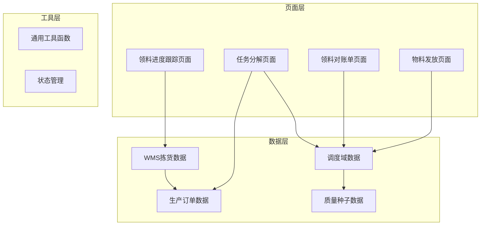

**图表来源**
- [material-issue.ts:1-825](file://src/pages/material-issue.ts#L1-L825)
- [material-statements.ts:1-762](file://src/pages/material-statements.ts#L1-L762)
- [progress-material.ts:1-832](file://src/pages/progress-material.ts#L1-L832)

**章节来源**
- [material-issue.ts:1-825](file://src/pages/material-issue.ts#L1-L825)
- [material-statements.ts:1-762](file://src/pages/material-statements.ts#L1-L762)
- [progress-material.ts:1-832](file://src/pages/progress-material.ts#L1-L832)

## 核心组件

### 领料需求管理组件

系统的核心是物料发放需求管理，包含以下关键组件：

#### 领料需求状态机
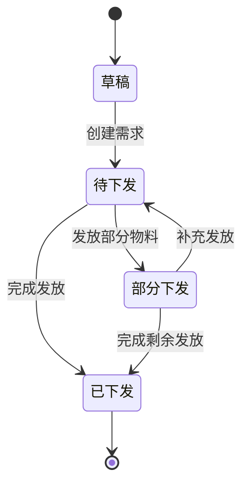

#### 领料对账单生成器
负责将已发放的领料需求汇总为对账单，支持批量生成和状态管理。

#### 领料进度跟踪器
提供物料齐套情况的实时跟踪，包括拣货状态、配齐率、缺口统计等指标。

**章节来源**
- [material-issue.ts:28-62](file://src/pages/material-issue.ts#L28-L62)
- [material-statements.ts:16-53](file://src/pages/material-statements.ts#L16-L53)

## 架构概览

系统采用分层架构设计，确保各层职责清晰、耦合度低：

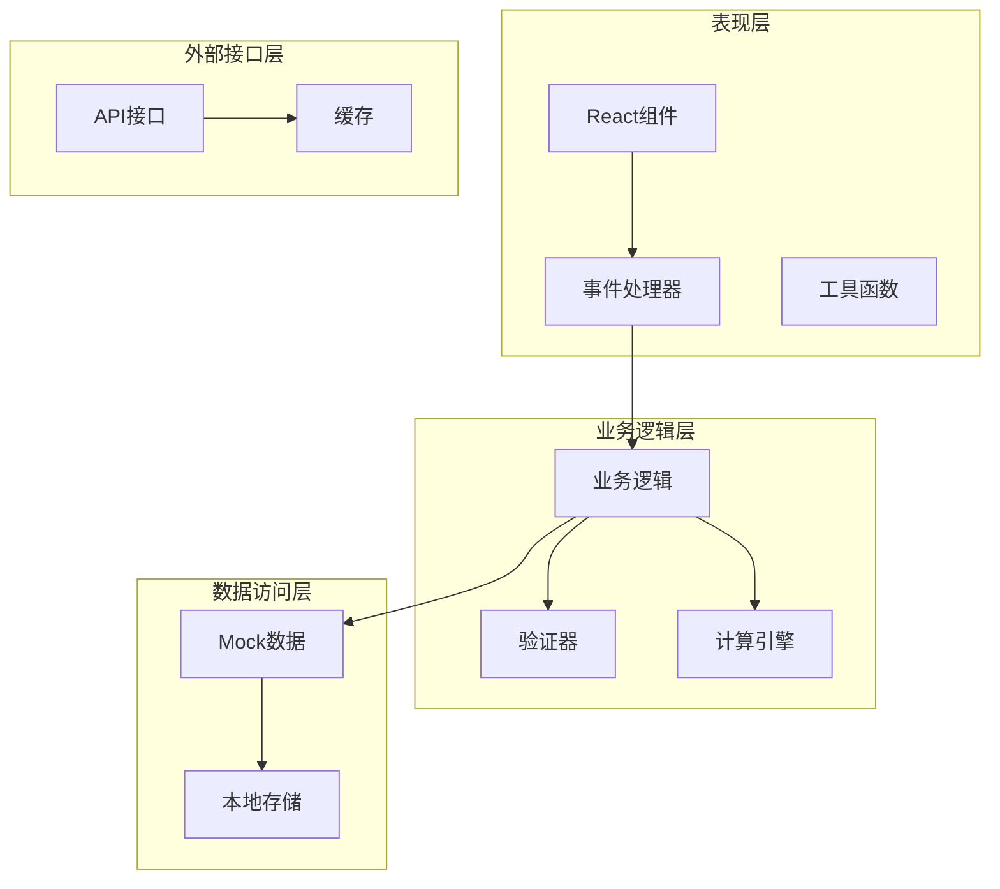

**图表来源**
- [material-issue.ts:140-256](file://src/pages/material-issue.ts#L140-L256)
- [material-statements.ts:160-254](file://src/pages/material-statements.ts#L160-L254)

### 数据流架构

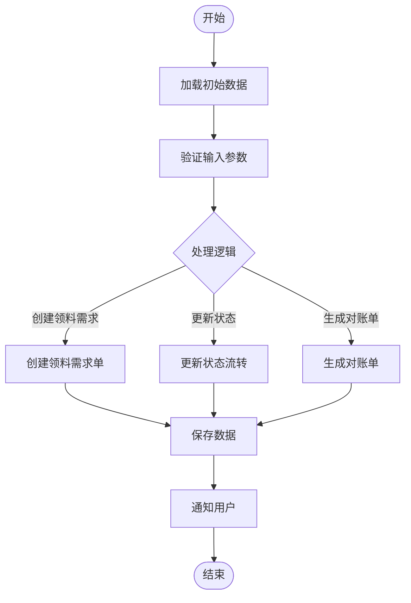

**图表来源**
- [material-issue.ts:149-235](file://src/pages/material-issue.ts#L149-L235)
- [material-statements.ts:160-223](file://src/pages/material-statements.ts#L160-L223)

**章节来源**
- [material-issue.ts:140-256](file://src/pages/material-issue.ts#L140-L256)
- [material-statements.ts:160-254](file://src/pages/material-statements.ts#L160-L254)

## 详细组件分析

### 领料需求管理模块

#### 数据模型设计

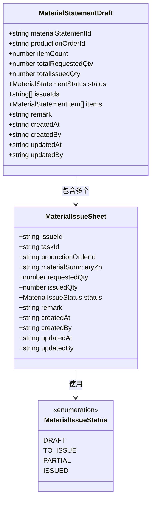

**图表来源**
- [store-domain-dispatch-process.ts:39-52](file://src/data/fcs/store-domain-dispatch-process.ts#L39-L52)
- [store-domain-dispatch-process.ts:20-34](file://src/data/fcs/store-domain-dispatch-process.ts#L20-L34)

#### 核心业务流程

##### 领料需求创建流程
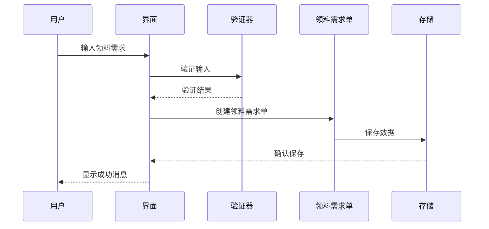

**图表来源**
- [material-issue.ts:149-187](file://src/pages/material-issue.ts#L149-L187)

##### 对账单生成流程
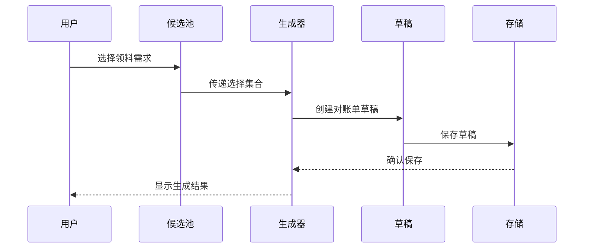

**图表来源**
- [material-statements.ts:160-223](file://src/pages/material-statements.ts#L160-L223)

**章节来源**
- [material-issue.ts:149-235](file://src/pages/material-issue.ts#L149-L235)
- [material-statements.ts:160-254](file://src/pages/material-statements.ts#L160-L254)

### 领料进度跟踪模块

#### 配料单状态管理

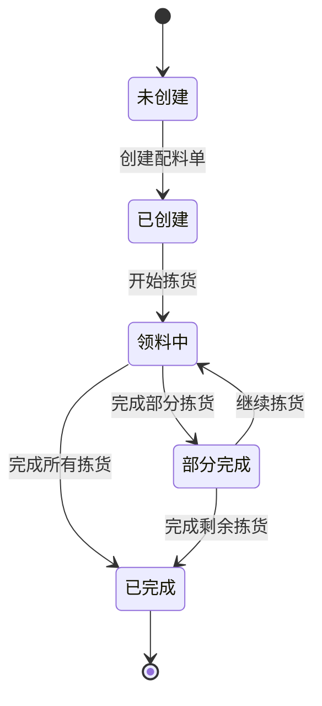

#### 领料进度计算算法

系统采用多维度指标来评估物料齐套情况：

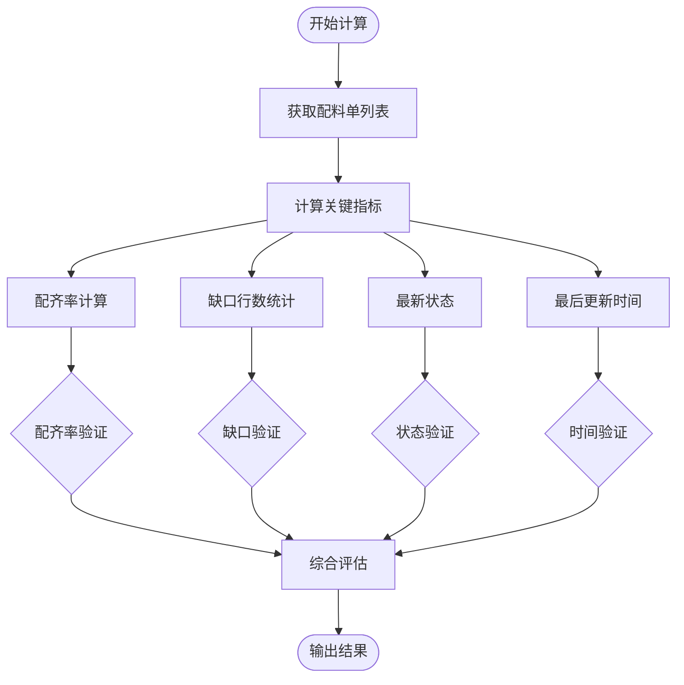

**图表来源**
- [legacy-wms-picking.ts:290-335](file://src/data/fcs/legacy-wms-picking.ts#L290-L335)

**章节来源**
- [progress-material.ts:1-800](file://src/pages/progress-material.ts#L1-L800)
- [legacy-wms-picking.ts:290-335](file://src/data/fcs/legacy-wms-picking.ts#L290-L335)

### 与生产任务关联机制

#### 任务链与物料需求映射

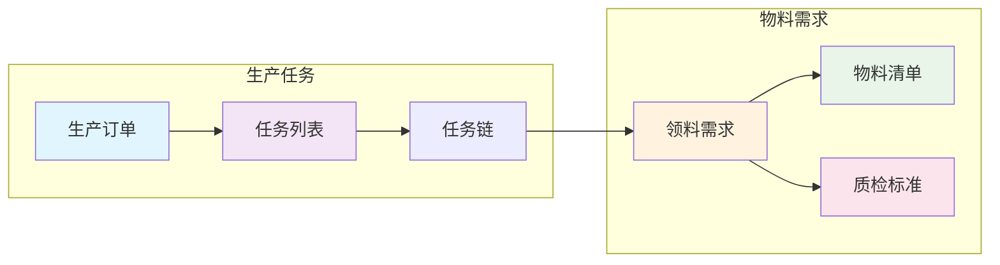

**图表来源**
- [task-breakdown.ts:210-250](file://src/pages/task-breakdown.ts#L210-L250)
- [production-orders.ts:1-54](file://src/data/fcs/production-orders.ts#L1-L54)

#### 自动化物料需求生成

系统通过分析生产任务的工艺流程，自动识别需要领料的任务并生成相应的领料需求：

**章节来源**
- [task-breakdown.ts:210-250](file://src/pages/task-breakdown.ts#L210-L250)
- [production-orders.ts:1-54](file://src/data/fcs/production-orders.ts#L1-L54)

## 依赖分析

### 组件间依赖关系

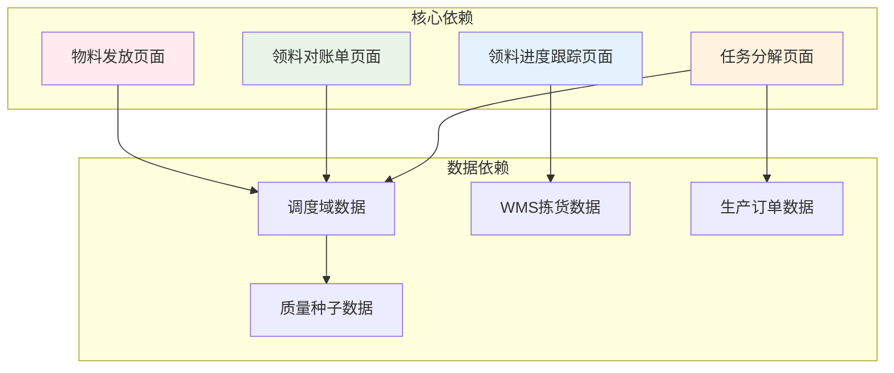

**图表来源**
- [material-issue.ts:1-10](file://src/pages/material-issue.ts#L1-L10)
- [material-statements.ts:1-12](file://src/pages/material-statements.ts#L1-L12)
- [progress-material.ts:1-17](file://src/pages/progress-material.ts#L1-L17)
- [task-breakdown.ts:1-11](file://src/pages/task-breakdown.ts#L1-L11)

### 数据依赖层次

系统采用分层数据依赖架构，确保数据的一致性和完整性：

**章节来源**
- [material-issue.ts:1-10](file://src/pages/material-issue.ts#L1-L10)
- [material-statements.ts:1-12](file://src/pages/material-statements.ts#L1-L12)
- [progress-material.ts:1-17](file://src/pages/progress-material.ts#L1-L17)
- [task-breakdown.ts:1-11](file://src/pages/task-breakdown.ts#L1-L11)

## 性能考虑

### 数据加载优化

系统采用懒加载和虚拟滚动技术来优化大数据集的渲染性能：

- **分页加载**：对领料需求和对账单列表采用分页加载策略
- **虚拟滚动**：对大量任务数据使用虚拟滚动减少DOM节点数量
- **缓存机制**：对常用数据建立内存缓存，避免重复计算

### 计算复杂度分析

- **领料需求创建**：时间复杂度 O(1)，空间复杂度 O(1)
- **对账单生成**：时间复杂度 O(n)，其中 n 为选择的领料需求数量
- **进度计算**：时间复杂度 O(m)，其中 m 为配料单数量

### 内存管理

系统通过以下机制优化内存使用：
- 及时清理事件监听器
- 合理使用React的useMemo和useCallback
- 避免不必要的状态更新

## 故障排除指南

### 常见问题诊断

#### 领料需求创建失败

可能原因：
1. 任务ID不存在
2. 需求数量格式不正确
3. 用料摘要为空

解决方法：
- 检查任务ID是否存在于系统中
- 确保需求数量为正整数
- 填写完整的用料摘要信息

#### 对账单生成异常

可能原因：
1. 选择的领料需求状态不符合要求
2. 领料需求不属于同一生产单
3. 部分领料需求已被占用

解决方法：
- 确保所有选择的领料需求状态为"部分下发"或"已下发"
- 检查生产单号一致性
- 排除已被占用的领料需求

#### 进度跟踪数据不准确

可能原因：
1. 配料单状态更新延迟
2. 拣货数据同步问题
3. 缺口统计逻辑异常

解决方法：
- 检查数据同步机制
- 验证拣货状态转换逻辑
- 核对缺口计算公式

**章节来源**
- [material-issue.ts:158-187](file://src/pages/material-issue.ts#L158-L187)
- [material-statements.ts:164-184](file://src/pages/material-statements.ts#L164-L184)
- [progress-material.ts:725-762](file://src/pages/progress-material.ts#L725-L762)

## 结论

物料发放管理系统通过模块化的设计和清晰的架构，实现了从生产需求到物料发放的完整业务闭环。系统的主要优势包括：

### 技术优势
- **模块化架构**：清晰的组件分离和数据流管理
- **状态管理**：完善的表单状态和业务状态管理
- **数据驱动**：基于Mock数据的完整业务场景模拟
- **响应式设计**：适配多种设备和屏幕尺寸

### 业务价值
- **自动化程度高**：减少人工干预，提高工作效率
- **可视化强**：直观的界面展示和实时数据更新
- **可追溯性好**：完整的操作记录和状态跟踪
- **扩展性强**：模块化设计便于功能扩展和维护

### 改进建议
1. **集成真实数据源**：替换Mock数据为真实的数据库连接
2. **增强权限控制**：实现更细粒度的用户权限管理
3. **优化移动端体验**：针对移动设备进行专门的界面优化
4. **增加报表功能**：提供更丰富的统计分析和报表生成功能

该系统为生产制造企业的物料管理提供了完整的数字化解决方案，通过持续的优化和扩展，可以更好地满足企业日益增长的管理需求。