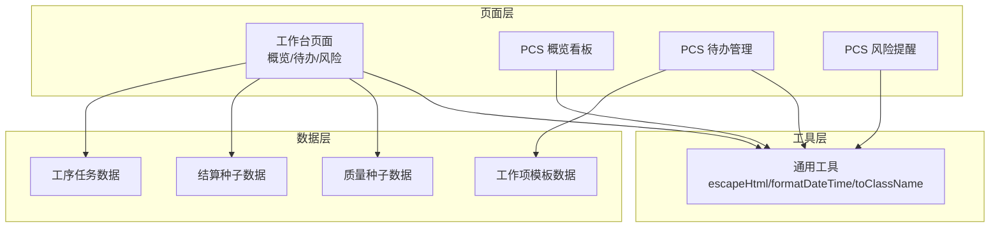
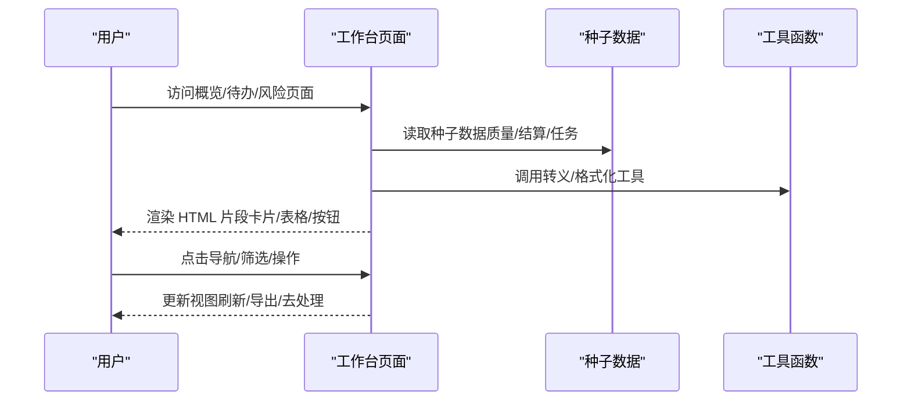
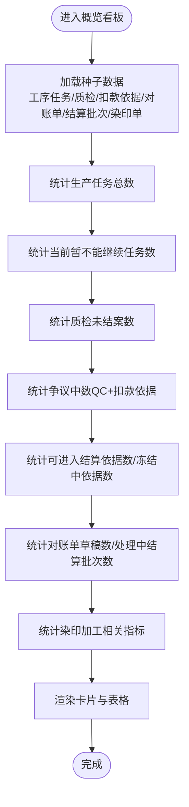
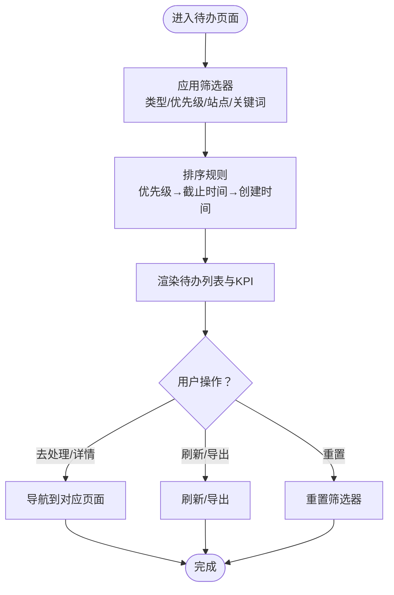
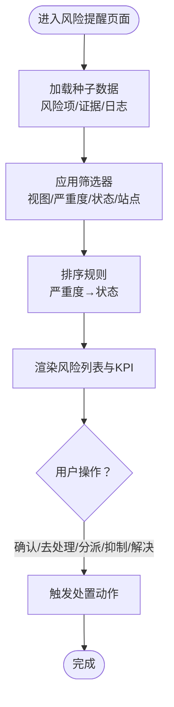
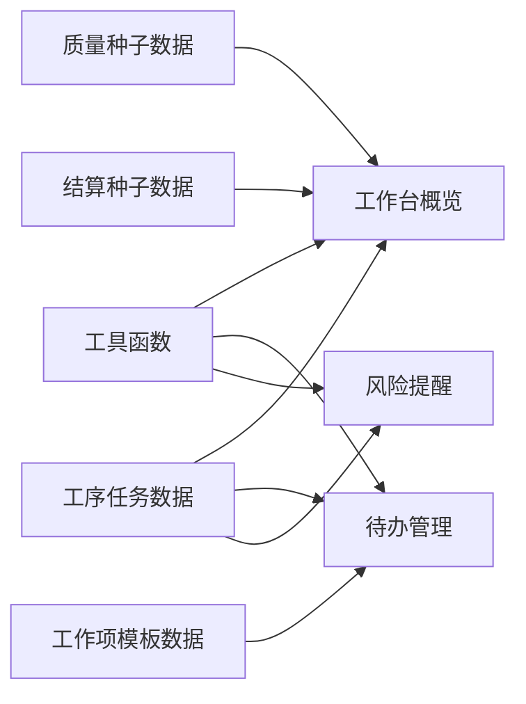

# 工作台系统

<cite>
**本文档引用的文件**
- [workbench.ts](file://src/pages/workbench.ts)
- [pcs-workspace-overview.ts](file://src/pages/pcs-workspace-overview.ts)
- [pcs-workspace-todos.ts](file://src/pages/pcs-workspace-todos.ts)
- [pcs-workspace-alerts.ts](file://src/pages/pcs-workspace-alerts.ts)
- [utils.ts](file://src/utils.ts)
- [store-domain-quality-seeds.ts](file://src/data/fcs/store-domain-quality-seeds.ts)
- [store-domain-settlement-seeds.ts](file://src/data/fcs/store-domain-settlement-seeds.ts)
- [process-tasks.ts](file://src/data/fcs/process-tasks.ts)
- [pcs-work-items.ts](file://src/data/pcs-work-items.ts)
</cite>

## 目录
1. [简介](#简介)
2. [项目结构](#项目结构)
3. [核心组件](#核心组件)
4. [架构总览](#架构总览)
5. [详细组件分析](#详细组件分析)
6. [依赖关系分析](#依赖关系分析)
7. [性能考虑](#性能考虑)
8. [故障排查指南](#故障排查指南)
9. [结论](#结论)
10. [附录](#附录)

## 简介
本技术文档面向“工作台系统”，围绕概览看板、待办管理、风险提醒三大核心功能，系统性阐述其架构设计、数据统计逻辑、页面渲染与交互实现，并给出实时更新机制与性能优化策略。文档同时提供可视化图示与代码路径引用，帮助开发者快速定位实现细节。

## 项目结构
工作台系统主要由以下模块构成：
- 页面层：概览看板、待办管理、风险提醒
- 数据层：质量/结算种子数据、工序任务数据、工作项模板数据
- 工具层：HTML 转义、时间格式化、类名拼接等通用工具
- 状态层：全局状态（用于 PCS 工作台）

**图表来源**
- [workbench.ts:1-582](file://src/pages/workbench.ts#L1-L582)
- [pcs-workspace-overview.ts:1-669](file://src/pages/pcs-workspace-overview.ts#L1-L669)
- [pcs-workspace-todos.ts:1-800](file://src/pages/pcs-workspace-todos.ts#L1-L800)
- [pcs-workspace-alerts.ts:1-800](file://src/pages/pcs-workspace-alerts.ts#L1-L800)
- [utils.ts:1-18](file://src/utils.ts#L1-L18)
- [store-domain-quality-seeds.ts:1-269](file://src/data/fcs/store-domain-quality-seeds.ts#L1-L269)
- [store-domain-settlement-seeds.ts:1-57](file://src/data/fcs/store-domain-settlement-seeds.ts#L1-L57)
- [process-tasks.ts:1-800](file://src/data/fcs/process-tasks.ts#L1-L800)
- [pcs-work-items.ts:1-267](file://src/data/pcs-work-items.ts#L1-L267)

**章节来源**
- [workbench.ts:1-582](file://src/pages/workbench.ts#L1-L582)
- [pcs-workspace-overview.ts:1-669](file://src/pages/pcs-workspace-overview.ts#L1-L669)
- [pcs-workspace-todos.ts:1-800](file://src/pages/pcs-workspace-todos.ts#L1-L800)
- [pcs-workspace-alerts.ts:1-800](file://src/pages/pcs-workspace-alerts.ts#L1-L800)
- [utils.ts:1-18](file://src/utils.ts#L1-L18)
- [store-domain-quality-seeds.ts:1-269](file://src/data/fcs/store-domain-quality-seeds.ts#L1-L269)
- [store-domain-settlement-seeds.ts:1-57](file://src/data/fcs/store-domain-settlement-seeds.ts#L1-L57)
- [process-tasks.ts:1-800](file://src/data/fcs/process-tasks.ts#L1-L800)
- [pcs-work-items.ts:1-267](file://src/data/pcs-work-items.ts#L1-L267)

## 核心组件
- 概览看板：聚合核心运营指标、近期质检与结算动态，支持卡片式统计与表格展示。
- 待办管理：按角色/队列/类型/优先级筛选，支持搜索、排序与批量操作。
- 风险提醒：跨域风险识别与处置流程聚合，支持严重度/状态/站点筛选与处置动作。

**章节来源**
- [workbench.ts:316-447](file://src/pages/workbench.ts#L316-L447)
- [pcs-workspace-todos.ts:536-583](file://src/pages/pcs-workspace-todos.ts#L536-L583)
- [pcs-workspace-alerts.ts:374-399](file://src/pages/pcs-workspace-alerts.ts#L374-L399)

## 架构总览
工作台系统采用“页面渲染 + 种子数据 + 工具函数”的轻量架构。页面通过函数式渲染生成 HTML 片段，数据来源于本地种子数组与全局状态，工具函数负责安全转义与格式化。

**图表来源**
- [workbench.ts:316-582](file://src/pages/workbench.ts#L316-L582)
- [pcs-workspace-todos.ts:536-800](file://src/pages/pcs-workspace-todos.ts#L536-L800)
- [pcs-workspace-alerts.ts:374-800](file://src/pages/pcs-workspace-alerts.ts#L374-L800)
- [utils.ts:1-18](file://src/utils.ts#L1-L18)

## 详细组件分析

### 概览看板（工作台）
- 数据统计逻辑
  - 生产任务总数：直接统计工序任务数组长度。
  - 当前暂不能继续任务数：筛选 status='BLOCKED' 且 blockReason='ALLOCATION_GATE' 的任务。
  - 质检未结案数：筛选 status!='CLOSED' 的质检记录。
  - 争议中数：基于 QC 与扣款依据的 ID 并集去重统计。
  - 可进入结算依据数/冻结中依据数：基于扣款依据 ready/frozen 状态统计。
  - 对账单草稿数/处理中结算批次数：基于草稿与处理中状态统计。
  - 染印加工：统计染印加工单总数、可继续工单数、不合格处理中数、回货批次数。
- 展示方式
  - 使用卡片组件展示关键指标，根据阈值设置警示色。
  - 最近质检与最近结算以表格形式展示，支持跳转到详情页。

**图表来源**
- [workbench.ts:316-447](file://src/pages/workbench.ts#L316-L447)
- [store-domain-quality-seeds.ts:1-269](file://src/data/fcs/store-domain-quality-seeds.ts#L1-L269)
- [store-domain-settlement-seeds.ts:1-57](file://src/data/fcs/store-domain-settlement-seeds.ts#L1-L57)
- [process-tasks.ts:1-800](file://src/data/fcs/process-tasks.ts#L1-L800)

**章节来源**
- [workbench.ts:316-447](file://src/pages/workbench.ts#L316-L447)

### 待办管理（工作台）
- 分类与筛选
  - 类型：工作项、审核、样衣、上架、店铺授权、映射、入账。
  - 优先级：P0/P1/P2/P3。
  - 角色队列：按角色（项目负责人/测款/版房/渠道/仓管/管理层）提供专属队列。
  - 筛选维度：搜索关键词、类型、优先级、站点。
- 排序与优先级
  - 优先级顺序：P0<P1<P2<P3。
  - 截止时间：有截止时间的任务优先；无截止时间者按创建时间倒序。
- 用户交互
  - 导航到处理页、查看详情、批量选择、重置筛选、刷新。

**图表来源**
- [pcs-workspace-todos.ts:536-800](file://src/pages/pcs-workspace-todos.ts#L536-L800)

**章节来源**
- [pcs-workspace-todos.ts:503-583](file://src/pages/pcs-workspace-todos.ts#L503-L583)

### 风险提醒（工作台）
- 风险识别算法
  - 当前暂不能继续风险：基于工序任务 status='BLOCKED' 且 blockReason='ALLOCATION_GATE'。
  - 争议冻结风险：基于扣款依据 status='DISPUTED' 或 settlementFreezeReason 包含“争议”。
  - 质检超期风险：基于 QC 提交时间超过阈值（如 3 天）。
  - 返工未完成风险：基于返工/重做任务 status 不为 DONE。
  - 对账单滞留风险：基于对账单草稿创建时间超过阈值。
- 预警机制
  - 严重度分级：P0/P1/P2/P3。
  - 状态管理：待处理/已确认/处理中/已解决/已抑制。
  - 处置流程：确认、去处理、分派、抑制、标记已解决。

**图表来源**
- [pcs-workspace-alerts.ts:374-800](file://src/pages/pcs-workspace-alerts.ts#L374-L800)

**章节来源**
- [pcs-workspace-alerts.ts:374-408](file://src/pages/pcs-workspace-alerts.ts#L374-L408)

### 页面渲染逻辑与用户交互
- HTML 安全渲染
  - 所有文本输出均通过工具函数进行 HTML 转义，防止 XSS。
  - 时间字段统一格式化为“YYYY-MM-DD HH:mm”。
- 导航与事件
  - 统一使用 data-* 属性承载交互行为与参数，便于事件委托与路由跳转。
  - 刷新/导出/去处理/确认/抑制等动作均有明确的 UI 反馈。

**章节来源**
- [workbench.ts:92-123](file://src/pages/workbench.ts#L92-L123)
- [utils.ts:1-18](file://src/utils.ts#L1-L18)
- [pcs-workspace-todos.ts:613-623](file://src/pages/pcs-workspace-todos.ts#L613-L623)
- [pcs-workspace-alerts.ts:410-420](file://src/pages/pcs-workspace-alerts.ts#L410-L420)

## 依赖关系分析
- 组件耦合
  - 工作台概览依赖质量/结算/任务种子数据，耦合度适中，便于扩展新指标。
  - 待办与风险页面依赖通用工具函数，降低重复逻辑。
- 外部依赖
  - 无外部网络请求，所有数据来自本地种子数组，便于离线演示与性能优化。
- 潜在循环依赖
  - 页面与数据文件之间为单向依赖，无循环导入风险。

**图表来源**
- [utils.ts:1-18](file://src/utils.ts#L1-L18)
- [workbench.ts:1-11](file://src/pages/workbench.ts#L1-L11)
- [pcs-workspace-todos.ts:1-3](file://src/pages/pcs-workspace-todos.ts#L1-L3)
- [pcs-workspace-alerts.ts:1-3](file://src/pages/pcs-workspace-alerts.ts#L1-L3)
- [store-domain-quality-seeds.ts:1-12](file://src/data/fcs/store-domain-quality-seeds.ts#L1-L12)
- [store-domain-settlement-seeds.ts:1-8](file://src/data/fcs/store-domain-settlement-seeds.ts#L1-L8)
- [process-tasks.ts:1-11](file://src/data/fcs/process-tasks.ts#L1-L11)
- [pcs-work-items.ts:1-6](file://src/data/pcs-work-items.ts#L1-L6)

**章节来源**
- [workbench.ts:1-11](file://src/pages/workbench.ts#L1-L11)
- [pcs-workspace-todos.ts:1-3](file://src/pages/pcs-workspace-todos.ts#L1-L3)
- [pcs-workspace-alerts.ts:1-3](file://src/pages/pcs-workspace-alerts.ts#L1-L3)
- [utils.ts:1-18](file://src/utils.ts#L1-L18)

## 性能考虑
- 渲染性能
  - 采用函数式渲染与字符串拼接，避免虚拟 DOM 开销，适合静态/半静态数据场景。
  - 表格渲染仅对可见行进行处理，减少 DOM 节点数量。
- 数据访问
  - 使用一次性过滤与排序，避免频繁重复计算；必要时可引入缓存键。
- 交互响应
  - 事件委托减少监听器数量；批量操作时合并重绘。
- 实时更新机制
  - 当前为演示态，可通过定时器或轮询触发刷新；建议结合 WebSocket 或服务端推送实现增量更新。
- 优化建议
  - 对高频筛选/排序逻辑进行防抖；
  - 对长列表使用虚拟滚动；
  - 将静态种子数据按模块懒加载；
  - 对日期/数字格式化统一走工具函数，减少重复正则。

[本节为通用指导，不涉及具体文件分析]

## 故障排查指南
- 常见问题
  - 导航无效：检查 data-nav 属性是否正确绑定事件处理器。
  - 文本显示异常：确认是否使用了 escapeHtml 转义。
  - 排序/筛选异常：核对筛选器状态与排序键值。
- 调试要点
  - 在事件处理器中打印 state 与筛选条件，验证数据流。
  - 使用浏览器开发者工具检查事件冒泡与阻止默认行为是否生效。

**章节来源**
- [pcs-workspace-todos.ts:613-623](file://src/pages/pcs-workspace-todos.ts#L613-L623)
- [pcs-workspace-alerts.ts:410-420](file://src/pages/pcs-workspace-alerts.ts#L410-L420)
- [utils.ts:1-18](file://src/utils.ts#L1-L18)

## 结论
工作台系统以简洁的页面渲染与本地种子数据为核心，实现了概览看板、待办管理与风险提醒的完整闭环。通过清晰的分类、筛选与优先级排序，以及统一的安全渲染与事件处理机制，系统具备良好的可维护性与扩展性。建议在真实环境中引入实时更新与性能优化策略，进一步提升用户体验。

[本节为总结性内容，不涉及具体文件分析]

## 附录
- 关键实现路径参考
  - 概览看板统计与渲染：[renderOverviewPage:316-447](file://src/pages/workbench.ts#L316-L447)
  - 待办列表与队列：[getFilteredTodos/renderQueuePanel:536-791](file://src/pages/pcs-workspace-todos.ts#L536-L791)
  - 风险列表与处置：[getFilteredRisks/renderRiskTable:374-648](file://src/pages/pcs-workspace-alerts.ts#L374-L648)
  - HTML 转义与格式化：[escapeHtml/formatDateTime:1-18](file://src/utils.ts#L1-L18)
  - 质量/结算/任务种子数据：[store-domain-quality-seeds.ts:1-269](file://src/data/fcs/store-domain-quality-seeds.ts#L1-L269)、[store-domain-settlement-seeds.ts:1-57](file://src/data/fcs/store-domain-settlement-seeds.ts#L1-L57)、[process-tasks.ts:1-800](file://src/data/fcs/process-tasks.ts#L1-L800)
  - 工作项模板数据：[pcs-work-items.ts:1-267](file://src/data/pcs-work-items.ts#L1-L267)

[本节为索引性内容，不涉及具体文件分析]