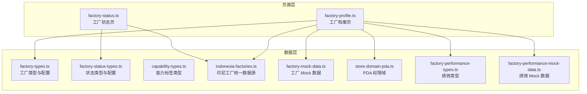
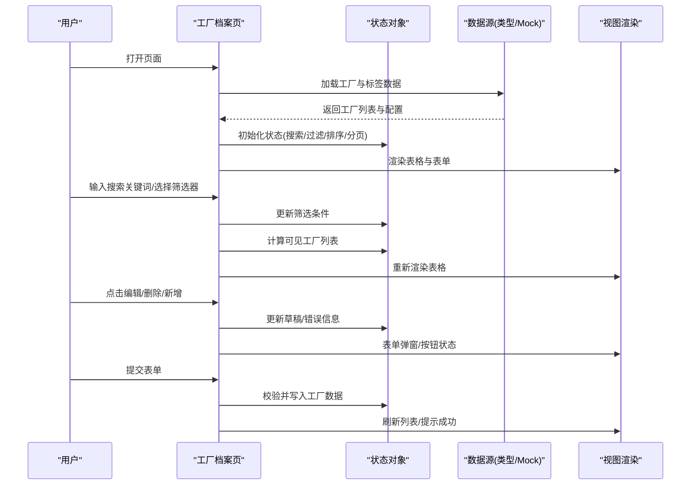
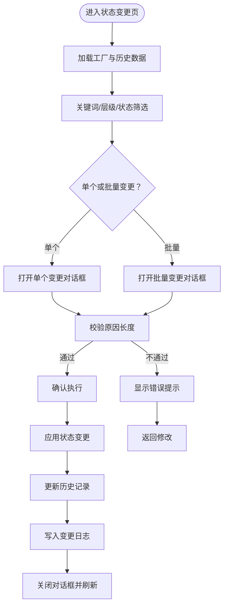
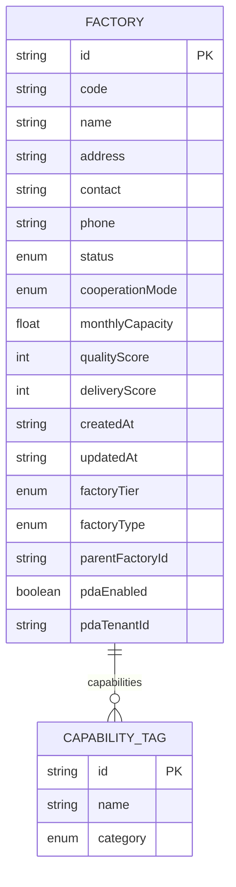
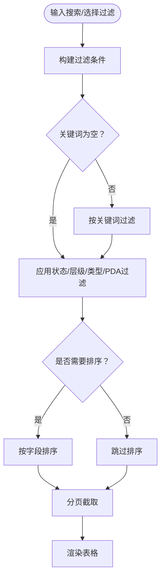
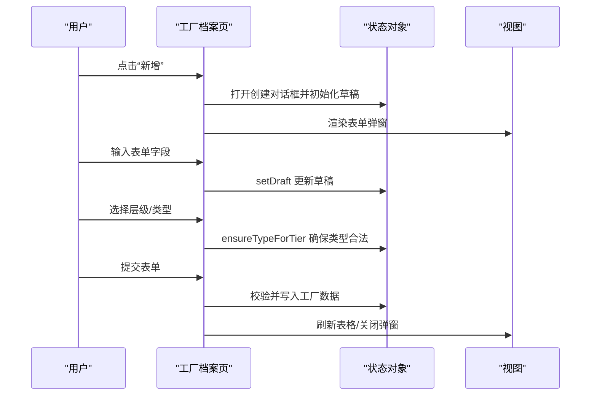
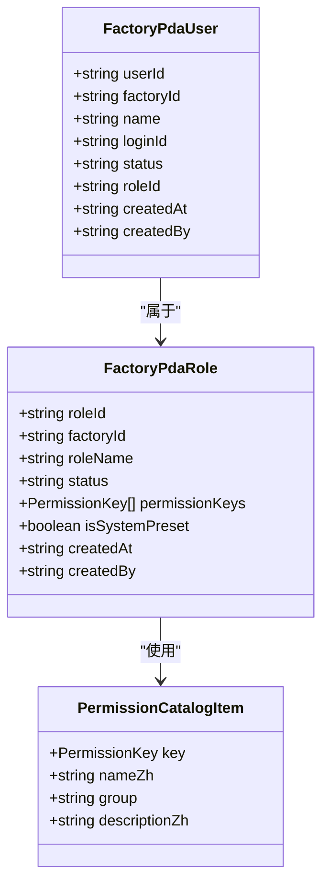
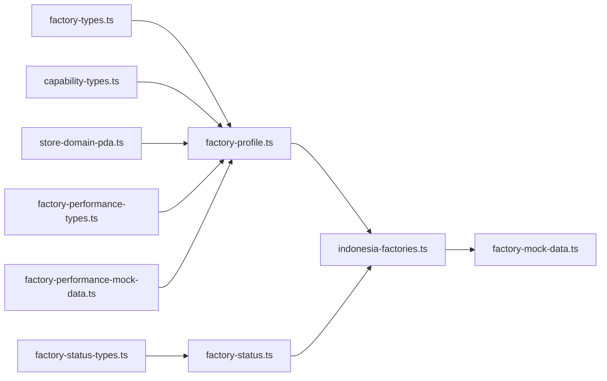

# 工厂档案管理

<cite>
**本文档引用的文件**
- [factory-types.ts](file://src/data/fcs/factory-types.ts)
- [factory-status-types.ts](file://src/data/fcs/factory-status-types.ts)
- [capability-types.ts](file://src/data/fcs/capability-types.ts)
- [factory-mock-data.ts](file://src/data/fcs/factory-mock-data.ts)
- [indonesia-factories.ts](file://src/data/fcs/indonesia-factories.ts)
- [store-domain-pda.ts](file://src/data/fcs/store-domain-pda.ts)
- [factory-profile.ts](file://src/pages/factory-profile.ts)
- [factory-status.ts](file://src/pages/factory-status.ts)
- [factory-performance-types.ts](file://src/data/fcs/factory-performance-types.ts)
- [factory-performance-mock-data.ts](file://src/data/fcs/factory-performance-mock-data.ts)
</cite>

## 目录
1. [简介](#简介)
2. [项目结构](#项目结构)
3. [核心组件](#核心组件)
4. [架构总览](#架构总览)
5. [详细组件分析](#详细组件分析)
6. [依赖关系分析](#依赖关系分析)
7. [性能考量](#性能考量)
8. [故障排查指南](#故障排查指南)
9. [结论](#结论)
10. [附录](#附录)

## 简介
本文件为“工厂档案管理系统”的技术文档，聚焦于工厂数据模型设计、状态管理机制、协作模式配置、能力标签关联、表单验证与持久化策略、以及搜索过滤功能的实现细节。文档同时提供增删改查、表单数据绑定与状态同步的流程图与序列图，帮助开发者快速理解与扩展系统。

## 项目结构
本系统围绕“数据层-页面层”组织，数据层提供类型定义、Mock 数据与领域模型；页面层负责渲染与交互逻辑。

图表来源
- [factory-types.ts:1-155](file://src/data/fcs/factory-types.ts#L1-L155)
- [factory-status-types.ts:1-45](file://src/data/fcs/factory-status-types.ts#L1-L45)
- [capability-types.ts:1-47](file://src/data/fcs/capability-types.ts#L1-L47)
- [indonesia-factories.ts:1-951](file://src/data/fcs/indonesia-factories.ts#L1-L951)
- [factory-mock-data.ts:1-121](file://src/data/fcs/factory-mock-data.ts#L1-L121)
- [store-domain-pda.ts:1-277](file://src/data/fcs/store-domain-pda.ts#L1-L277)
- [factory-profile.ts:1-800](file://src/pages/factory-profile.ts#L1-L800)
- [factory-status.ts:1-800](file://src/pages/factory-status.ts#L1-L800)
- [factory-performance-types.ts:1-59](file://src/data/fcs/factory-performance-types.ts#L1-L59)
- [factory-performance-mock-data.ts:1-140](file://src/data/fcs/factory-performance-mock-data.ts#L1-L140)

章节来源
- [factory-types.ts:1-155](file://src/data/fcs/factory-types.ts#L1-L155)
- [factory-profile.ts:1-800](file://src/pages/factory-profile.ts#L1-L800)

## 核心组件
- 工厂数据模型与配置
  - 工厂状态、协作模式、组织层级、工厂类型、能力标签、PDA 配置、流程开始条件等字段定义与配置映射。
- 状态管理
  - 工厂状态类型与标签、状态变更历史与批量变更日志。
- 能力标签系统
  - 标签分类、标签表单数据、标签状态配置。
- 页面与交互
  - 工厂档案页：表单数据绑定、搜索过滤、分页、排序、PDA 用户与角色管理。
  - 工厂状态页：状态筛选、单批变更、原因校验、历史与日志展示。
- 绩效与 Mock 数据
  - 绩效指标与评分计算、按工厂的记录集合。

章节来源
- [factory-types.ts:1-155](file://src/data/fcs/factory-types.ts#L1-L155)
- [factory-status-types.ts:1-45](file://src/data/fcs/factory-status-types.ts#L1-L45)
- [capability-types.ts:1-47](file://src/data/fcs/capability-types.ts#L1-L47)
- [factory-profile.ts:1-800](file://src/pages/factory-profile.ts#L1-L800)
- [factory-status.ts:1-800](file://src/pages/factory-status.ts#L1-L800)
- [factory-performance-types.ts:1-59](file://src/data/fcs/factory-performance-types.ts#L1-L59)
- [factory-performance-mock-data.ts:1-140](file://src/data/fcs/factory-performance-mock-data.ts#L1-L140)

## 架构总览
系统采用“类型驱动 + Mock 数据 + 页面逻辑”的轻量架构。页面通过状态对象维护视图状态，结合工具函数实现数据过滤、排序与分页；状态变更通过事件处理器更新状态并触发重新渲染。

图表来源
- [factory-profile.ts:500-565](file://src/pages/factory-profile.ts#L500-L565)
- [factory-types.ts:75-92](file://src/data/fcs/factory-types.ts#L75-L92)
- [factory-mock-data.ts:89-117](file://src/data/fcs/factory-mock-data.ts#L89-L117)

## 详细组件分析

### 数据模型与字段定义
- 工厂状态
  - 字段：active、paused、blacklist、inactive
  - 配置：标签与颜色映射，用于界面展示
- 协作模式
  - 字段：exclusive、preferred、general
  - 配置：标签文本
- 组织层级
  - 字段：CENTRAL、SATELLITE、THIRD_PARTY
  - 配置：标签与颜色
- 工厂类型
  - 字段：涵盖中央/卫星/三方工厂的多种类型
  - 配置：类型到标签的映射
- 能力标签
  - 字段：id、name、category
  - 分类：production、process、material
- 流程开始条件
  - 字段：allowDispatch、allowBid、allowExecute、allowSettle
- PDA 配置
  - 字段：pdaEnabled、pdaTenantId
- 其他业务字段
  - monthlyCapacity、qualityScore、deliveryScore、createdAt、updatedAt

章节来源
- [factory-types.ts:1-155](file://src/data/fcs/factory-types.ts#L1-L155)

### 状态管理机制
- 工厂状态类型与标签
  - 类型：ACTIVE、SUSPENDED、BLACKLISTED、INACTIVE
  - 标签与颜色映射，用于界面徽章展示
- 状态变更历史
  - 记录：oldStatus、newStatus、reason、changedAt、changedBy
  - 日志：批量变更与单次变更记录
- 状态变更流程
  - 表单校验：原因必填、黑名单/暂停需详细说明
  - 立即生效：变更后即时更新工厂状态与历史记录
  - 日志记录：记录操作者、目标、原因与时间

图表来源
- [factory-status-types.ts:19-44](file://src/data/fcs/factory-status-types.ts#L19-L44)
- [factory-status.ts:228-244](file://src/pages/factory-status.ts#L228-L244)
- [factory-status.ts:246-330](file://src/pages/factory-status.ts#L246-L330)

章节来源
- [factory-status-types.ts:1-45](file://src/data/fcs/factory-status-types.ts#L1-L45)
- [factory-status.ts:1-800](file://src/pages/factory-status.ts#L1-L800)

### 协作模式配置与应用场景
- exclusive（独家合作）
  - 场景：关键资源/核心能力优先分配给特定工厂
- preferred（优先合作）
  - 场景：优质工厂在常规派单中享有优先权
- general（普通合作）
  - 场景：常规供应商，按规则参与竞标/派单

章节来源
- [factory-types.ts:102-107](file://src/data/fcs/factory-types.ts#L102-L107)

### 能力标签关联机制
- 标签分类
  - production：生产类别（如大货、小单快反、车缝等）
  - process：工艺能力（如印花、染色、水洗、后整等）
  - material：材料加工（如棉、涤纶、真丝等）
- 标签表单数据
  - name、categoryId、description、status、isSystemTag
- 标签状态
  - active、inactive，对应启用/禁用
- 关联方式
  - 工厂 capabilities 字段存储标签 id/name/category
  - 页面通过标签名称映射到标签对象，支持多标签选择与展示

图表来源
- [factory-types.ts:41-73](file://src/data/fcs/factory-types.ts#L41-L73)
- [capability-types.ts:12-24](file://src/data/fcs/capability-types.ts#L12-L24)

章节来源
- [capability-types.ts:1-47](file://src/data/fcs/capability-types.ts#L1-L47)
- [factory-types.ts:149-155](file://src/data/fcs/factory-types.ts#L149-L155)

### 表单验证规则与数据持久化策略
- 表单验证
  - 工厂档案页：表单草稿 clone 与深拷贝，确保数组与对象字段不共享引用
  - 状态变更页：原因必填，黑名单/暂停状态原因至少 5 字
- 数据持久化
  - 页面内状态：通过状态对象维护草稿、错误信息、分页与筛选
  - PDA 数据：用户与角色按工厂维度分组，支持新增、锁定/解锁、角色权限勾选
  - Mock 数据：统一来源于印尼工厂数据，映射为新类型与字段

章节来源
- [factory-profile.ts:165-171](file://src/pages/factory-profile.ts#L165-L171)
- [factory-profile.ts:228-232](file://src/pages/factory-profile.ts#L228-L232)
- [factory-status.ts:228-244](file://src/pages/factory-status.ts#L228-L244)
- [factory-mock-data.ts:89-117](file://src/data/fcs/factory-mock-data.ts#L89-L117)

### 搜索过滤与排序实现
- 搜索关键词
  - 支持按名称、编号、联系人、电话模糊匹配
- 过滤器
  - 状态、层级、类型、PDA 启用状态（启用/未启用）
- 排序
  - 支持 code、name、status、tier 多字段升/降序
- 分页
  - 固定每页条数，计算页码区间并渲染分页控件

图表来源
- [factory-profile.ts:500-565](file://src/pages/factory-profile.ts#L500-L565)

章节来源
- [factory-profile.ts:500-565](file://src/pages/factory-profile.ts#L500-L565)

### 增删改查与表单数据绑定
- 新增/编辑
  - 打开对话框，克隆默认表单草稿或从现有工厂复制数据
  - 级联字段：层级变化时自动调整类型选项
- 删除
  - 删除确认对话框，确认后移除工厂并刷新列表
- 查询
  - 渲染表格行，包含状态徽章、层级标签、类型标签、父工厂名、PDA 启用状态与流程资格标志
- 表单数据绑定
  - 使用草稿对象绑定输入，实时更新错误信息
  - PDA 用户/角色表单：新增用户、切换锁定状态、设置角色、权限勾选与复制

图表来源
- [factory-profile.ts:208-226](file://src/pages/factory-profile.ts#L208-L226)
- [factory-profile.ts:228-232](file://src/pages/factory-profile.ts#L228-L232)
- [factory-profile.ts:583-655](file://src/pages/factory-profile.ts#L583-L655)

章节来源
- [factory-profile.ts:208-232](file://src/pages/factory-profile.ts#L208-L232)
- [factory-profile.ts:583-655](file://src/pages/factory-profile.ts#L583-L655)

### PDA 账号与角色权限管理
- 角色模板
  - 系统预设角色：管理员、调度员、生产员、交接员、质检员、财务、只读
- 权限字典
  - 任务接收、生产执行、交接、质量、结算五大类权限
- 工厂维度
  - 按工厂分组管理用户与角色，支持新增用户、锁定/解锁、设置角色、权限勾选与复制
- 会话管理
  - 本地存储 PDA 会话信息，支持清理

图表来源
- [store-domain-pda.ts:151-172](file://src/data/fcs/store-domain-pda.ts#L151-L172)
- [store-domain-pda.ts:230-242](file://src/data/fcs/store-domain-pda.ts#L230-L242)
- [store-domain-pda.ts:194-217](file://src/data/fcs/store-domain-pda.ts#L194-L217)

章节来源
- [store-domain-pda.ts:1-277](file://src/data/fcs/store-domain-pda.ts#L1-L277)
- [factory-profile.ts:251-280](file://src/pages/factory-profile.ts#L251-L280)

### 绩效指标与评分计算
- 指标
  - 准时交付率、残次率、拒单率、争议率
- 评分
  - 基于加权公式计算得分，保留一位小数并限制范围
- 记录
  - 按工厂维护多期记录，支持查看与导出

章节来源
- [factory-performance-types.ts:10-59](file://src/data/fcs/factory-performance-types.ts#L10-L59)
- [factory-performance-mock-data.ts:1-140](file://src/data/fcs/factory-performance-mock-data.ts#L1-L140)

## 依赖关系分析
- 数据层依赖
  - 工厂类型与配置依赖印尼工厂统一数据源，通过映射函数转换为新类型与字段
  - 能力标签与标签表单数据独立于工厂，但被工厂 capabilities 引用
  - PDA 权限域与角色模板独立，但与工厂档案页联动
- 页面层依赖
  - 工厂档案页依赖类型、Mock 数据与 PDA 权限域
  - 工厂状态页依赖状态类型与印尼工厂数据

图表来源
- [factory-mock-data.ts:89-117](file://src/data/fcs/factory-mock-data.ts#L89-L117)
- [factory-types.ts:1-155](file://src/data/fcs/factory-types.ts#L1-L155)
- [factory-status-types.ts:1-45](file://src/data/fcs/factory-status-types.ts#L1-L45)
- [capability-types.ts:1-47](file://src/data/fcs/capability-types.ts#L1-L47)
- [store-domain-pda.ts:1-277](file://src/data/fcs/store-domain-pda.ts#L1-L277)
- [factory-performance-types.ts:1-59](file://src/data/fcs/factory-performance-types.ts#L1-L59)
- [factory-performance-mock-data.ts:1-140](file://src/data/fcs/factory-performance-mock-data.ts#L1-L140)
- [factory-profile.ts:1-800](file://src/pages/factory-profile.ts#L1-L800)
- [factory-status.ts:1-800](file://src/pages/factory-status.ts#L1-L800)

章节来源
- [factory-mock-data.ts:89-117](file://src/data/fcs/factory-mock-data.ts#L89-L117)
- [factory-profile.ts:1-800](file://src/pages/factory-profile.ts#L1-L800)
- [factory-status.ts:1-800](file://src/pages/factory-status.ts#L1-L800)

## 性能考量
- 渲染优化
  - 使用草稿对象避免频繁重渲染；仅在必要时更新状态并触发渲染
- 过滤与排序
  - 在内存中一次性过滤与排序，建议在数据量较大时考虑服务端分页与筛选
- 分页
  - 固定页大小，减少 DOM 节点数量，提升滚动性能
- PDA 数据
  - 用户与角色按工厂分组缓存，避免跨工厂重复计算

## 故障排查指南
- 表单校验失败
  - 状态变更页：检查原因字段是否为空或长度不足
  - 工厂档案页：检查必填字段与层级/类型一致性
- PDA 功能不可用
  - 确认工厂是否启用 PDA；检查角色是否启用且存在有效权限
- 状态变更无效
  - 检查当前用户角色是否具备修改权限；确认状态变更历史是否正确写入

章节来源
- [factory-status.ts:228-244](file://src/pages/factory-status.ts#L228-L244)
- [factory-profile.ts:348-391](file://src/pages/factory-profile.ts#L348-L391)

## 结论
本系统以清晰的数据模型与页面逻辑实现了工厂档案的全生命周期管理，覆盖状态管理、协作模式、能力标签、PDA 权限与绩效指标。通过严格的表单校验与状态同步机制，保障了数据一致性与用户体验。后续可在大数据量场景下引入服务端分页与缓存策略，进一步提升性能与可扩展性。

## 附录
- 示例路径（用于定位具体实现）
  - 工厂状态类型与配置：[factory-status-types.ts:1-45](file://src/data/fcs/factory-status-types.ts#L1-L45)
  - 工厂类型与配置：[factory-types.ts:1-155](file://src/data/fcs/factory-types.ts#L1-L155)
  - 能力标签类型：[capability-types.ts:1-47](file://src/data/fcs/capability-types.ts#L1-L47)
  - 印尼工厂统一数据源：[indonesia-factories.ts:1-951](file://src/data/fcs/indonesia-factories.ts#L1-L951)
  - 工厂 Mock 数据：[factory-mock-data.ts:1-121](file://src/data/fcs/factory-mock-data.ts#L1-L121)
  - PDA 权限域：[store-domain-pda.ts:1-277](file://src/data/fcs/store-domain-pda.ts#L1-L277)
  - 工厂档案页：[factory-profile.ts:1-800](file://src/pages/factory-profile.ts#L1-L800)
  - 工厂状态页：[factory-status.ts:1-800](file://src/pages/factory-status.ts#L1-L800)
  - 绩效类型与评分：[factory-performance-types.ts:1-59](file://src/data/fcs/factory-performance-types.ts#L1-L59)
  - 绩效 Mock 数据：[factory-performance-mock-data.ts:1-140](file://src/data/fcs/factory-performance-mock-data.ts#L1-L140)