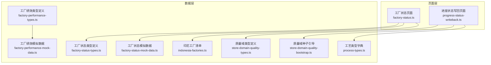
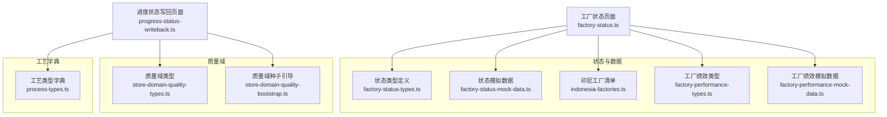
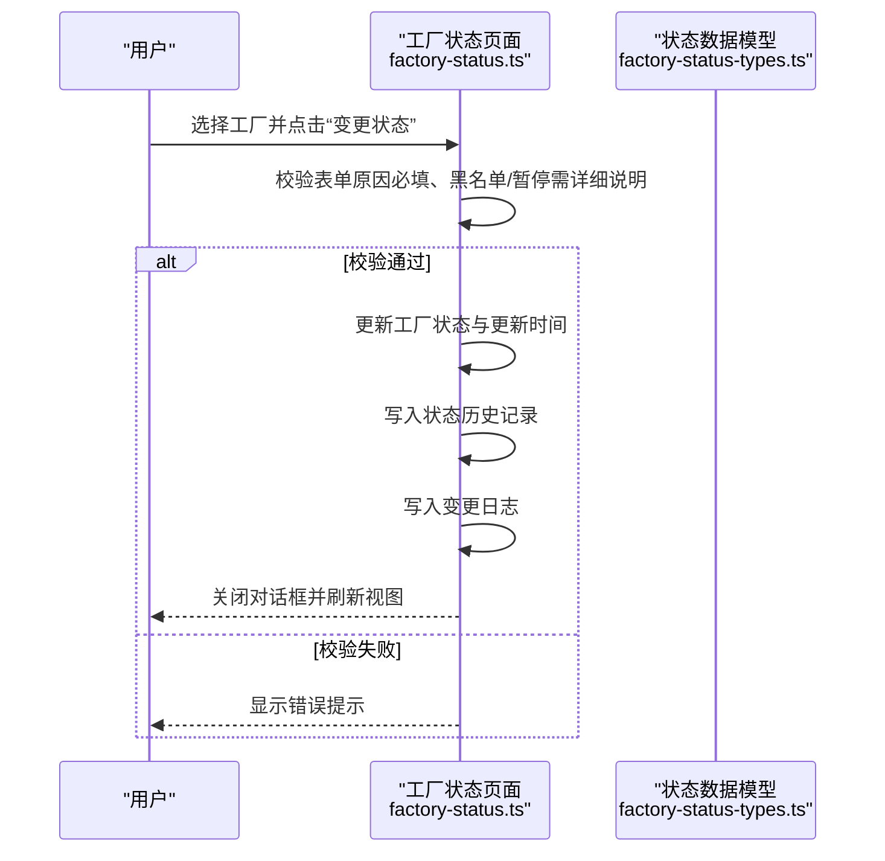
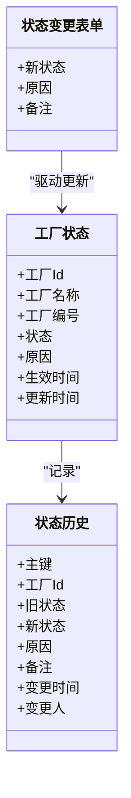
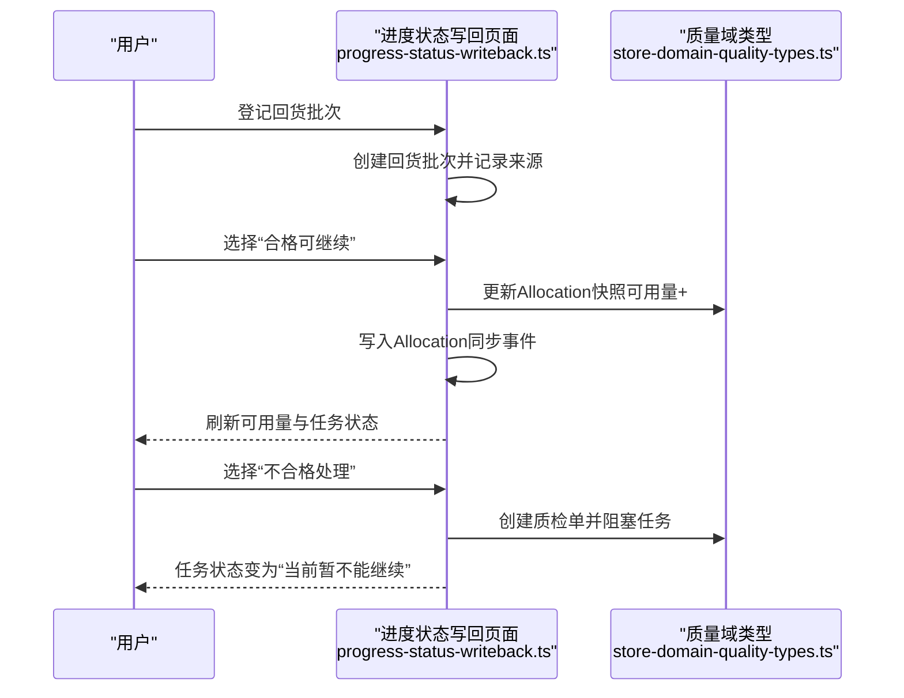
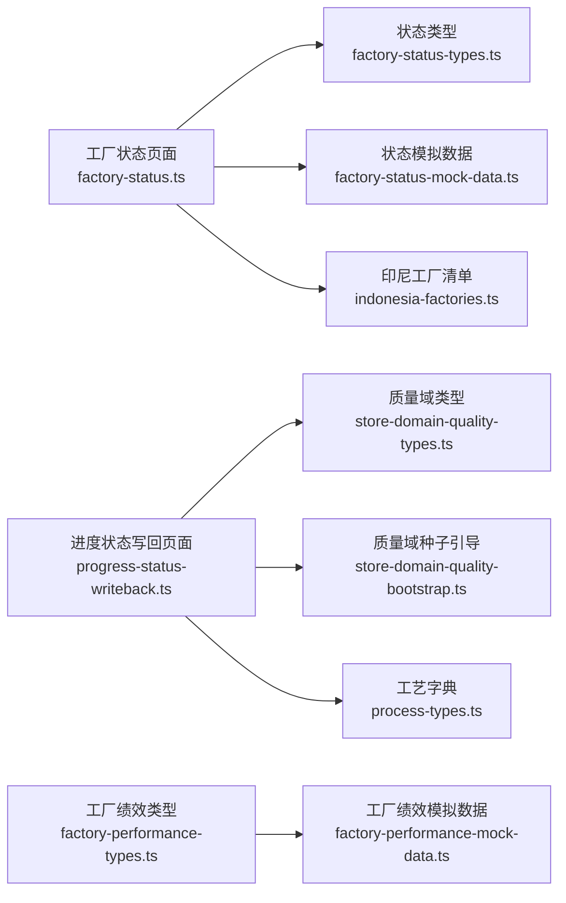

# 工厂状态管理

<cite>
**本文引用的文件**
- [factory-status.ts](file://src/pages/factory-status.ts)
- [factory-status-types.ts](file://src/data/fcs/factory-status-types.ts)
- [factory-status-mock-data.ts](file://src/data/fcs/factory-status-mock-data.ts)
- [indonesia-factories.ts](file://src/data/fcs/indonesia-factories.ts)
- [factory-performance-types.ts](file://src/data/fcs/factory-performance-types.ts)
- [factory-performance-mock-data.ts](file://src/data/fcs/factory-performance-mock-data.ts)
- [progress-status-writeback.ts](file://src/pages/progress-status-writeback.ts)
- [store-domain-quality-types.ts](file://src/data/fcs/store-domain-quality-types.ts)
- [store-domain-quality-bootstrap.ts](file://src/data/fcs/store-domain-quality-bootstrap.ts)
- [process-types.ts](file://src/data/fcs/process-types.ts)
</cite>

## 目录
1. [简介](#简介)
2. [项目结构](#项目结构)
3. [核心组件](#核心组件)
4. [架构总览](#架构总览)
5. [详细组件分析](#详细组件分析)
6. [依赖关系分析](#依赖关系分析)
7. [性能考量](#性能考量)
8. [故障排查指南](#故障排查指南)
9. [结论](#结论)
10. [附录](#附录)

## 简介
本技术文档围绕“工厂状态管理”主题，系统化梳理并解释工厂状态的实时监控机制与实现方式，涵盖在线状态、生产状态、设备状态、质量状态等维度的定义与含义；明确状态更新的触发条件与更新频率；阐述状态数据的采集、传输与存储路径；给出状态可视化展示方案（状态指示器、历史记录、趋势分析）；说明异常检测与告警机制（阈值与规则引擎思路）；并提供状态数据模型设计（类型定义、值映射、转换规则）。文末附带关键代码示例的路径指引，帮助读者快速定位实现位置。

## 项目结构
本项目采用前端单页应用结构，工厂状态管理相关模块主要分布在以下目录：
- 页面层：工厂状态页面负责用户交互与视图渲染
- 数据层：工厂状态类型、模拟数据、印尼工厂清单等
- 进度与质量：进度状态写回、质量域类型与种子数据，支撑生产状态与质量状态联动

**图表来源**
- [factory-status.ts:1-986](file://src/pages/factory-status.ts#L1-L986)
- [factory-status-types.ts:1-45](file://src/data/fcs/factory-status-types.ts#L1-L45)
- [factory-status-mock-data.ts:1-95](file://src/data/fcs/factory-status-mock-data.ts#L1-L95)
- [indonesia-factories.ts:1-951](file://src/data/fcs/indonesia-factories.ts#L1-L951)
- [factory-performance-types.ts:1-59](file://src/data/fcs/factory-performance-types.ts#L1-L59)
- [factory-performance-mock-data.ts:1-140](file://src/data/fcs/factory-performance-mock-data.ts#L1-L140)
- [progress-status-writeback.ts:1-725](file://src/pages/progress-status-writeback.ts#L1-L725)
- [store-domain-quality-types.ts:1-304](file://src/data/fcs/store-domain-quality-types.ts#L1-L304)
- [store-domain-quality-bootstrap.ts:1-37](file://src/data/fcs/store-domain-quality-bootstrap.ts#L1-L37)
- [process-types.ts:1-446](file://src/data/fcs/process-types.ts#L1-L446)

**章节来源**
- [factory-status.ts:1-986](file://src/pages/factory-status.ts#L1-L986)
- [factory-status-types.ts:1-45](file://src/data/fcs/factory-status-types.ts#L1-L45)
- [factory-status-mock-data.ts:1-95](file://src/data/fcs/factory-status-mock-data.ts#L1-L95)
- [indonesia-factories.ts:1-951](file://src/data/fcs/indonesia-factories.ts#L1-L951)
- [factory-performance-types.ts:1-59](file://src/data/fcs/factory-performance-types.ts#L1-L59)
- [factory-performance-mock-data.ts:1-140](file://src/data/fcs/factory-performance-mock-data.ts#L1-L140)
- [progress-status-writeback.ts:1-725](file://src/pages/progress-status-writeback.ts#L1-L725)
- [store-domain-quality-types.ts:1-304](file://src/data/fcs/store-domain-quality-types.ts#L1-L304)
- [store-domain-quality-bootstrap.ts:1-37](file://src/data/fcs/store-domain-quality-bootstrap.ts#L1-L37)
- [process-types.ts:1-446](file://src/data/fcs/process-types.ts#L1-L446)

## 核心组件
- 工厂状态页面（工厂状态管理界面）
  - 负责状态筛选、分页、批量变更、单工厂变更、历史查看与变更日志查看
  - 关键实现：状态过滤与分页、对话框渲染、变更校验与提交、历史记录与日志记录
- 工厂状态数据模型
  - 工厂状态类型、颜色与标签映射、状态变更记录与表单数据结构
- 印尼工厂清单
  - 提供工厂基础属性（层级、类型、状态、评分、容量等），作为状态展示与筛选的数据源
- 工厂绩效数据模型
  - 绩效指标（准时交付率、残次率、拒单率、争议率）与得分计算，用于生产状态与质量状态的综合评估
- 进度状态写回页面
  - 支持回货批次登记、合格/不合格判定、Allocation 同步与任务阻塞/解阻逻辑，体现生产状态与质量状态的联动
- 质量域类型与种子
  - 定义回货批次、质检单、扣款依据等质量域实体，支撑质量状态的闭环管理

**章节来源**
- [factory-status.ts:1-986](file://src/pages/factory-status.ts#L1-L986)
- [factory-status-types.ts:1-45](file://src/data/fcs/factory-status-types.ts#L1-L45)
- [indonesia-factories.ts:67-94](file://src/data/fcs/indonesia-factories.ts#L67-L94)
- [factory-performance-types.ts:10-59](file://src/data/fcs/factory-performance-types.ts#L10-L59)
- [progress-status-writeback.ts:1-725](file://src/pages/progress-status-writeback.ts#L1-L725)
- [store-domain-quality-types.ts:1-304](file://src/data/fcs/store-domain-quality-types.ts#L1-L304)

## 架构总览
工厂状态管理采用“页面-数据-类型-种子”的分层架构：
- 页面层：工厂状态页面与进度状态写回页面负责交互与渲染
- 数据层：状态类型、模拟数据、印尼工厂清单、绩效类型与模拟数据
- 质量域：回货批次、质检单、扣款依据等，支持质量状态闭环
- 工艺字典：为生产状态与质量状态联动提供工艺阶段与约束

**图表来源**
- [factory-status.ts:1-986](file://src/pages/factory-status.ts#L1-L986)
- [factory-status-types.ts:1-45](file://src/data/fcs/factory-status-types.ts#L1-L45)
- [factory-status-mock-data.ts:1-95](file://src/data/fcs/factory-status-mock-data.ts#L1-L95)
- [indonesia-factories.ts:1-951](file://src/data/fcs/indonesia-factories.ts#L1-L951)
- [factory-performance-types.ts:1-59](file://src/data/fcs/factory-performance-types.ts#L1-L59)
- [factory-performance-mock-data.ts:1-140](file://src/data/fcs/factory-performance-mock-data.ts#L1-L140)
- [progress-status-writeback.ts:1-725](file://src/pages/progress-status-writeback.ts#L1-L725)
- [store-domain-quality-types.ts:1-304](file://src/data/fcs/store-domain-quality-types.ts#L1-L304)
- [store-domain-quality-bootstrap.ts:1-37](file://src/data/fcs/store-domain-quality-bootstrap.ts#L1-L37)
- [process-types.ts:1-446](file://src/data/fcs/process-types.ts#L1-L446)

## 详细组件分析

### 工厂状态页面（工厂状态管理）
- 功能职责
  - 工厂状态筛选（关键词、层级、状态）、分页展示
  - 单工厂状态变更与批量状态变更
  - 历史记录查看与变更日志查看
  - 表单校验（变更原因必填、黑名单/暂停需详细说明）
- 关键实现点
  - 状态过滤与排序：基于关键词、层级、状态三要素组合过滤，并按编号排序
  - 分页逻辑：每页固定条目，计算总页数并截取当前页数据
  - 变更流程：单工厂变更与批量变更分别生成历史记录与变更日志
  - 视图渲染：状态徽章、操作菜单、历史弹窗、日志弹窗
- 代码示例路径
  - 状态过滤与分页：[getFilteredFactories/getPagedFactories:156-180](file://src/pages/factory-status.ts#L156-L180)
  - 表单校验：[validateForm:228-244](file://src/pages/factory-status.ts#L228-L244)
  - 单工厂变更执行：[executeSingleChange:246-287](file://src/pages/factory-status.ts#L246-L287)
  - 批量变更执行：[executeBatchChange:289-330](file://src/pages/factory-status.ts#L289-L330)
  - 历史记录与日志渲染：[renderHistoryDialog/renderLogDialog:486-600](file://src/pages/factory-status.ts#L486-L600)
  - 页面渲染与事件处理入口：[renderFactoryStatusPage/handleFactoryStatusEvent:622-800](file://src/pages/factory-status.ts#L622-L800)

**图表来源**
- [factory-status.ts:228-330](file://src/pages/factory-status.ts#L228-L330)
- [factory-status-types.ts:19-44](file://src/data/fcs/factory-status-types.ts#L19-L44)

**章节来源**
- [factory-status.ts:156-330](file://src/pages/factory-status.ts#L156-L330)
- [factory-status-types.ts:19-44](file://src/data/fcs/factory-status-types.ts#L19-L44)

### 工厂状态数据模型
- 工厂状态类型与标签/颜色映射
  - 类型：在合作、暂停、黑名单、未激活
  - 标签与颜色：用于状态徽章渲染
- 工厂状态实体与历史记录
  - 工厂状态：包含工厂标识、名称、编号、状态、生效时间、更新时间等
  - 状态历史：包含旧状态、新状态、原因、操作人、时间等
- 状态变更表单数据
  - 包含新状态、原因、备注等字段

**图表来源**
- [factory-status-types.ts:19-44](file://src/data/fcs/factory-status-types.ts#L19-L44)

**章节来源**
- [factory-status-types.ts:1-45](file://src/data/fcs/factory-status-types.ts#L1-L45)

### 印尼工厂清单
- 工厂基础属性
  - 包含层级（中央/卫星/三方）、类型（多种具体工厂类型）、状态、评分、容量、地址、联系方式等
- 用途
  - 作为状态页面的数据源，提供筛选、排序与展示所需字段

**章节来源**
- [indonesia-factories.ts:67-94](file://src/data/fcs/indonesia-factories.ts#L67-L94)

### 工厂绩效数据模型
- 绩效指标
  - 准时交付率、残次率、拒单率、争议率
- 得分计算
  - 基于上述指标的加权计算，输出综合得分
- 绩效记录
  - 按周期（周/月）记录指标与得分，支持历史对比与趋势分析

**章节来源**
- [factory-performance-types.ts:10-59](file://src/data/fcs/factory-performance-types.ts#L10-L59)
- [factory-performance-mock-data.ts:1-140](file://src/data/fcs/factory-performance-mock-data.ts#L1-L140)

### 进度状态写回页面（生产状态与质量状态联动）
- 功能职责
  - 登记回货批次、判定合格可继续或不合格处理
  - 自动同步 Allocation 变更，更新任务可用量
  - 任务阻塞/解阻逻辑：当上游可用量为0时阻塞，可用量恢复时解阻
- 关键实现点
  - 回货批次登记：生成批次号、记录来源与数量
  - 合格可继续：更新可用量并写入同步事件
  - 不合格处理：创建质检单并阻塞任务
  - 同步门禁：根据上游依赖可用量动态调整任务状态
- 代码示例路径
  - 回货批次登记：[createReturnBatch:194-221](file://src/pages/progress-status-writeback.ts#L194-L221)
  - 合格可继续：[markReturnBatchPass:223-271](file://src/pages/progress-status-writeback.ts#L223-L271)
  - 不合格处理并阻塞任务：[startReturnBatchFailQc:273-358](file://src/pages/progress-status-writeback.ts#L273-L358)
  - 同步门禁与任务状态切换：[syncAllocationGates:137-192](file://src/pages/progress-status-writeback.ts#L137-L192)
  - 页面渲染与事件处理：[renderProgressStatusWritebackPage/handleProgressStatusWritebackEvent:581-725](file://src/pages/progress-status-writeback.ts#L581-L725)

**图表来源**
- [progress-status-writeback.ts:194-358](file://src/pages/progress-status-writeback.ts#L194-L358)
- [store-domain-quality-types.ts:21-60](file://src/data/fcs/store-domain-quality-types.ts#L21-L60)

**章节来源**
- [progress-status-writeback.ts:194-358](file://src/pages/progress-status-writeback.ts#L194-L358)
- [store-domain-quality-types.ts:21-60](file://src/data/fcs/store-domain-quality-types.ts#L21-L60)

### 质量域类型与种子
- 回货批次
  - 包含批次号、任务关联、回货数量、质检状态、来源信息等
- 质检单
  - 包含检验结果、缺陷项、责任方、处置建议、仲裁结果等
- 扣款依据
  - 基于质检单或差异产生的扣款依据，支持证据附件与审计日志
- 种子引导
  - 初始化任务、生产单、质检单与扣款依据，保证原型运行时的数据完整性

**章节来源**
- [store-domain-quality-types.ts:48-304](file://src/data/fcs/store-domain-quality-types.ts#L48-L304)
- [store-domain-quality-bootstrap.ts:13-37](file://src/data/fcs/store-domain-quality-bootstrap.ts#L13-L37)

### 工艺类型字典
- 工艺阶段与推荐约束
  - 前道准备、裁剪、车缝、后道、特种工艺、物料、仓储等阶段
  - 外部约束（如印染类）与委外能力、推荐委派模式、推荐拥有者层级等
- 用途
  - 为生产状态与质量状态联动提供阶段约束与流程边界

**章节来源**
- [process-types.ts:1-446](file://src/data/fcs/process-types.ts#L1-L446)

## 依赖关系分析
- 页面到数据的依赖
  - 工厂状态页面依赖状态类型、模拟数据与印尼工厂清单
  - 进度状态写回页面依赖质量域类型与种子、工艺字典
- 数据模型之间的耦合
  - 工厂状态与状态历史相互关联，变更日志记录操作轨迹
  - 质量域实体（回货批次、质检单、扣款依据）与进度状态写回紧密耦合
- 外部依赖与集成点
  - 质量域种子引导确保初始数据存在，避免运行期空引用
  - 工艺字典为生产状态与质量状态联动提供阶段与约束

**图表来源**
- [factory-status.ts:1-986](file://src/pages/factory-status.ts#L1-L986)
- [factory-status-types.ts:1-45](file://src/data/fcs/factory-status-types.ts#L1-L45)
- [factory-status-mock-data.ts:1-95](file://src/data/fcs/factory-status-mock-data.ts#L1-L95)
- [indonesia-factories.ts:1-951](file://src/data/fcs/indonesia-factories.ts#L1-L951)
- [factory-performance-types.ts:1-59](file://src/data/fcs/factory-performance-types.ts#L1-L59)
- [factory-performance-mock-data.ts:1-140](file://src/data/fcs/factory-performance-mock-data.ts#L1-L140)
- [progress-status-writeback.ts:1-725](file://src/pages/progress-status-writeback.ts#L1-L725)
- [store-domain-quality-types.ts:1-304](file://src/data/fcs/store-domain-quality-types.ts#L1-L304)
- [store-domain-quality-bootstrap.ts:1-37](file://src/data/fcs/store-domain-quality-bootstrap.ts#L1-L37)
- [process-types.ts:1-446](file://src/data/fcs/process-types.ts#L1-L446)

**章节来源**
- [factory-status.ts:1-986](file://src/pages/factory-status.ts#L1-L986)
- [progress-status-writeback.ts:1-725](file://src/pages/progress-status-writeback.ts#L1-L725)

## 性能考量
- 渲染性能
  - 使用分页减少一次性渲染的数据量；关键词与层级/状态过滤在内存中进行，建议在大数据集下考虑虚拟滚动或服务端分页
- 事件处理
  - 表单字段与筛选器使用事件委托与最小化 DOM 更新，避免频繁重排
- 数据访问
  - 状态历史与变更日志采用数组头部插入，注意在高频变更场景下的数组长度增长；可考虑限制日志条数或采用环形缓冲
- 计算复杂度
  - 过滤与排序为 O(n log n)，在 30 家工厂规模下可忽略不计；若扩展至千级，建议引入索引或缓存策略

[本节为通用指导，无需特定文件引用]

## 故障排查指南
- 表单校验失败
  - 现象：点击“确认变更”后提示原因必填或黑名单/暂停需详细说明
  - 排查：检查变更原因是否为空或长度不足
  - 参考路径：[validateForm:228-244](file://src/pages/factory-status.ts#L228-L244)
- 批量变更无生效
  - 现象：勾选多个工厂后批量变更无效
  - 排查：确认已选择工厂且状态变更对话框已打开；检查 selectedIds 是否为空
  - 参考路径：[executeBatchChange:289-330](file://src/pages/factory-status.ts#L289-L330)
- 回货批次登记失败
  - 现象：登记回货数量报错或无响应
  - 排查：确认任务已选择、回货数量为正整数；查看提示消息
  - 参考路径：[handleProgressStatusWritebackEvent（登记回货）:671-693](file://src/pages/progress-status-writeback.ts#L671-L693)
- 合格可继续后任务未解阻
  - 现象：批次合格但任务仍为“当前暂不能继续”
  - 排查：检查上游依赖是否仍有可用量为0的任务；调用同步门禁逻辑
  - 参考路径：[syncAllocationGates:137-192](file://src/pages/progress-status-writeback.ts#L137-L192)

**章节来源**
- [factory-status.ts:228-330](file://src/pages/factory-status.ts#L228-L330)
- [progress-status-writeback.ts:671-693](file://src/pages/progress-status-writeback.ts#L671-L693)
- [progress-status-writeback.ts:137-192](file://src/pages/progress-status-writeback.ts#L137-L192)

## 结论
本系统以页面-数据-类型-种子的分层架构实现了工厂状态的全生命周期管理：从状态定义与映射，到筛选与分页展示；从单工厂与批量变更，到历史与日志追踪；从生产状态与质量状态的联动（回货批次、Allocation 同步、任务阻塞/解阻），到绩效指标的综合评估。通过明确的触发条件与事件处理机制，系统能够稳定地支撑工厂状态的实时监控与可视化呈现，并为后续接入真实数据源与规则引擎奠定基础。

[本节为总结性内容，无需特定文件引用]

## 附录

### 状态数据模型设计要点
- 状态类型定义
  - 在线状态：ACTIVE/SUSPENDED/BLACKLISTED/INACTIVE
  - 生产状态：结合进度写回与质量状态联动
  - 设备状态：可扩展为设备可用/维修/停用等
  - 质量状态：基于回货批次与质检单的状态
- 状态值映射
  - 标签与颜色映射用于徽章渲染与视觉提示
- 状态转换规则
  - 黑名单/暂停将影响派单资格
  - 合格可继续提升可用量，不合格处理触发质量流程并阻塞任务
- 代码示例路径
  - 状态类型与徽章渲染：[状态类型与徽章:332-334](file://src/pages/factory-status.ts#L332-L334)
  - 状态变更与历史记录：[executeSingleChange/executeBatchChange:246-330](file://src/pages/factory-status.ts#L246-L330)
  - 质量状态联动与任务阻塞：[syncAllocationGates/startReturnBatchFailQc:137-358](file://src/pages/progress-status-writeback.ts#L137-L358)

**章节来源**
- [factory-status.ts:332-334](file://src/pages/factory-status.ts#L332-L334)
- [factory-status.ts:246-330](file://src/pages/factory-status.ts#L246-L330)
- [progress-status-writeback.ts:137-358](file://src/pages/progress-status-writeback.ts#L137-L358)