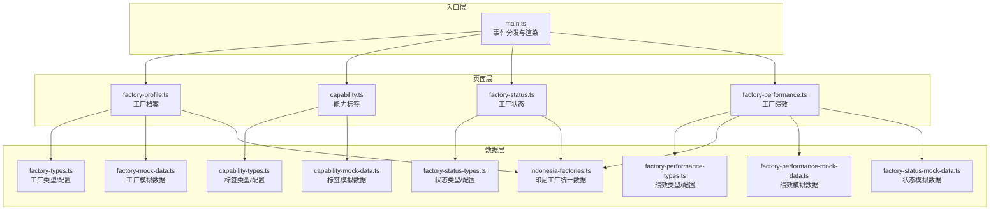
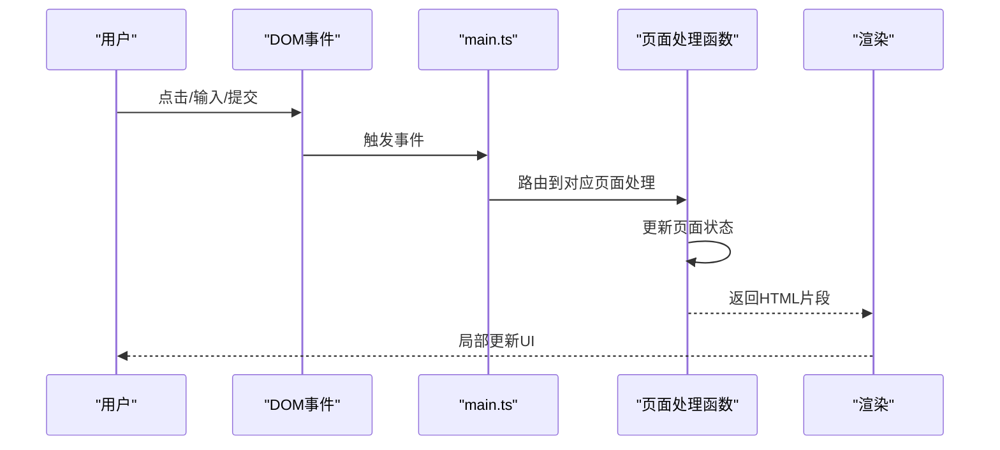
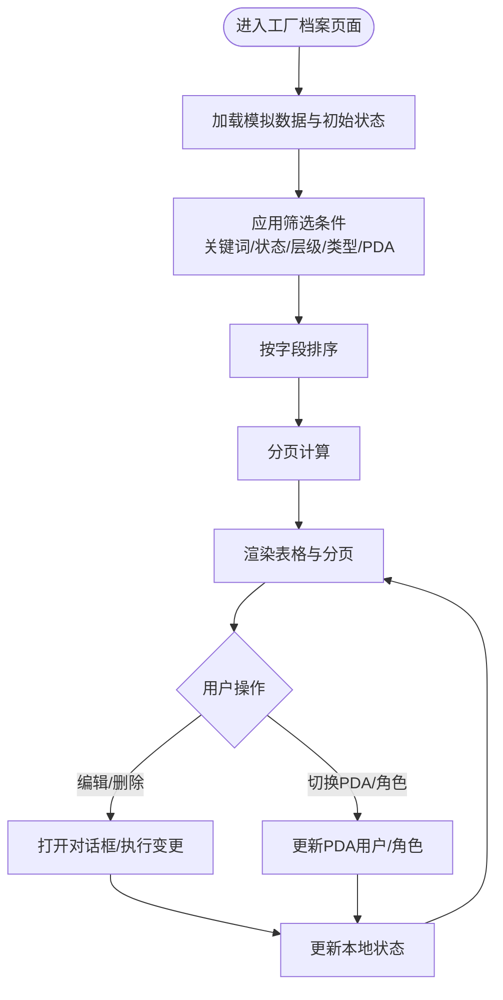
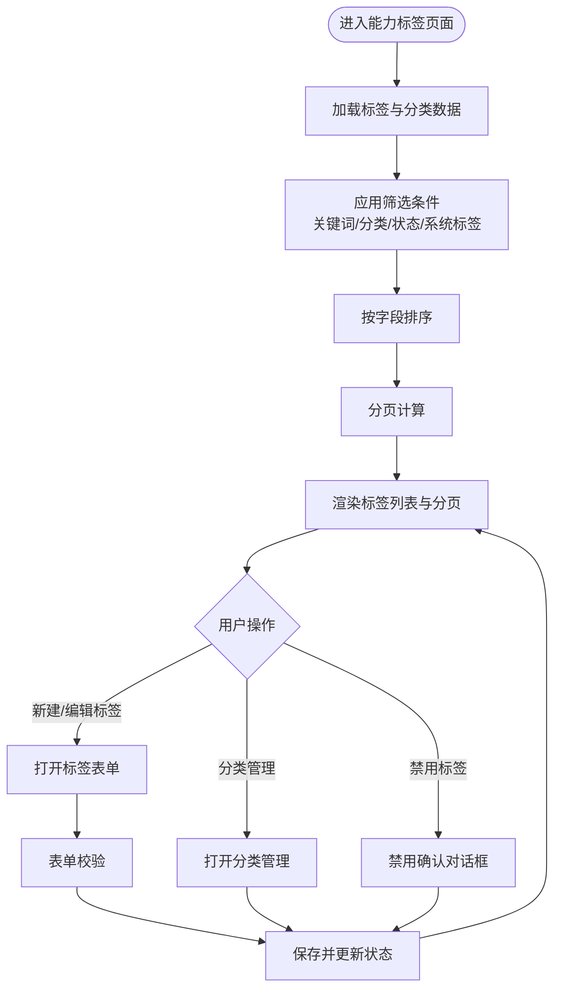
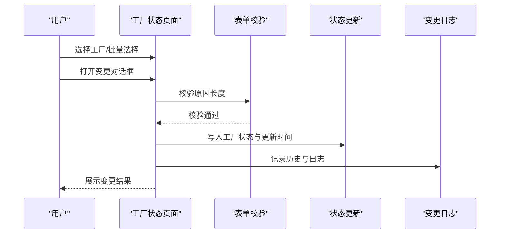
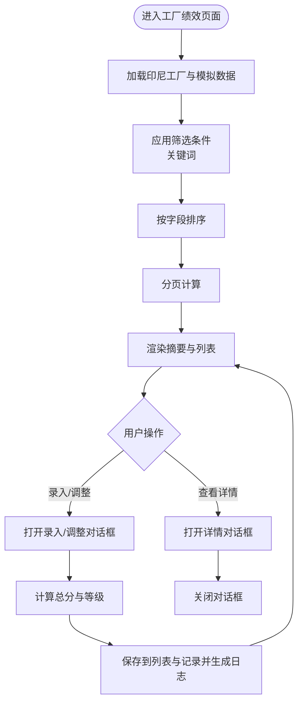
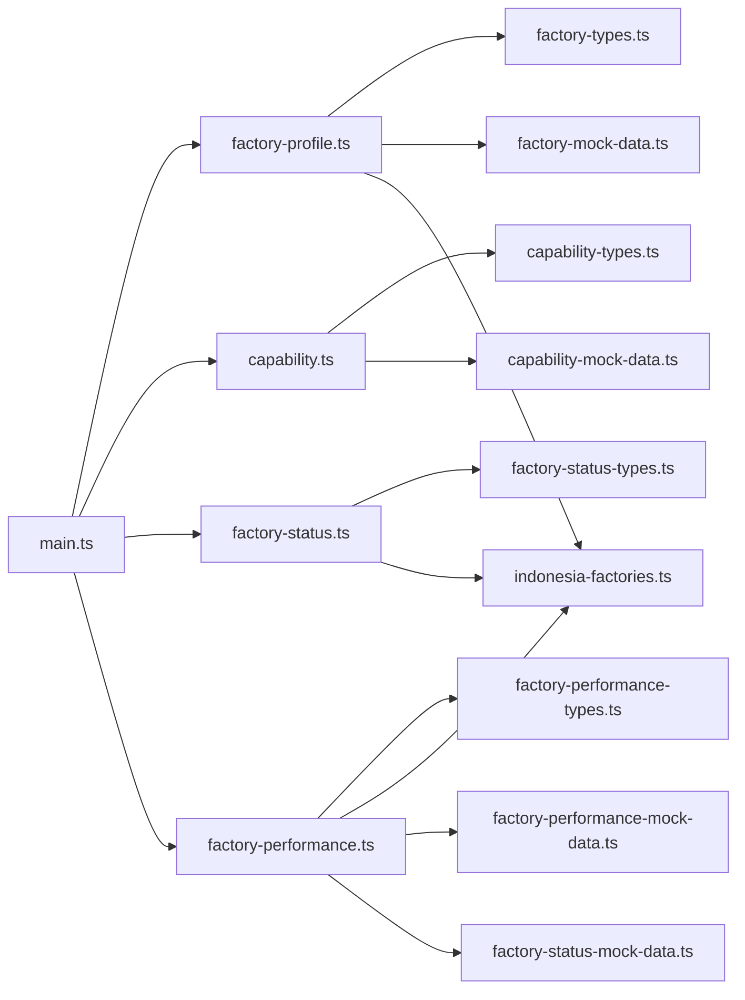

# 工厂管理

<cite>
**本文引用的文件**
- [src/data/fcs/factory-types.ts](file://src/data/fcs/factory-types.ts)
- [src/data/fcs/capability-types.ts](file://src/data/fcs/capability-types.ts)
- [src/data/fcs/factory-status-types.ts](file://src/data/fcs/factory-status-types.ts)
- [src/data/fcs/factory-performance-types.ts](file://src/data/fcs/factory-performance-types.ts)
- [src/data/fcs/factory-mock-data.ts](file://src/data/fcs/factory-mock-data.ts)
- [src/data/fcs/capability-mock-data.ts](file://src/data/fcs/capability-mock-data.ts)
- [src/data/fcs/indonesia-factories.ts](file://src/data/fcs/indonesia-factories.ts)
- [src/data/fcs/factory-performance-mock-data.ts](file://src/data/fcs/factory-performance-mock-data.ts)
- [src/data/fcs/factory-status-mock-data.ts](file://src/data/fcs/factory-status-mock-data.ts)
- [src/pages/factory-profile.ts](file://src/pages/factory-profile.ts)
- [src/pages/capability.ts](file://src/pages/capability.ts)
- [src/pages/factory-status.ts](file://src/pages/factory-status.ts)
- [src/pages/factory-performance.ts](file://src/pages/factory-performance.ts)
- [src/utils.ts](file://src/utils.ts)
- [src/main.ts](file://src/main.ts)
</cite>

## 目录
1. [简介](#简介)
2. [项目结构](#项目结构)
3. [核心组件](#核心组件)
4. [架构概览](#架构概览)
5. [详细组件分析](#详细组件分析)
6. [依赖分析](#依赖分析)
7. [性能考虑](#性能考虑)
8. [故障排查指南](#故障排查指南)
9. [结论](#结论)
10. [附录](#附录)

## 简介
本技术文档围绕工厂管理系统，系统性阐述工厂档案管理、能力标签系统、工厂状态管理与工厂绩效管理四大核心模块。文档从数据模型、业务逻辑、交互流程与界面渲染等维度展开，帮助开发者与产品人员快速理解与扩展系统。

## 项目结构
系统采用“数据层 + 页面层 + 入口事件分发”的前端架构：
- 数据层：集中定义工厂、能力标签、状态与绩效的类型与模拟数据，确保各页面共享一致的数据契约。
- 页面层：每个功能页面独立维护状态、筛选、排序、分页与对话框逻辑，并通过统一的事件分发入口进行交互。
- 入口层：全局监听点击、输入、变更与提交事件，路由到对应页面处理函数，完成局部渲染。

**图表来源**
- [src/main.ts:249-353](file://src/main.ts#L249-L353)
- [src/pages/factory-profile.ts:1-800](file://src/pages/factory-profile.ts#L1-L800)
- [src/pages/capability.ts:1-800](file://src/pages/capability.ts#L1-L800)
- [src/pages/factory-status.ts:1-800](file://src/pages/factory-status.ts#L1-L800)
- [src/pages/factory-performance.ts:1-800](file://src/pages/factory-performance.ts#L1-L800)
- [src/data/fcs/factory-types.ts:1-155](file://src/data/fcs/factory-types.ts#L1-L155)
- [src/data/fcs/capability-types.ts:1-47](file://src/data/fcs/capability-types.ts#L1-L47)
- [src/data/fcs/factory-status-types.ts:1-45](file://src/data/fcs/factory-status-types.ts#L1-L45)
- [src/data/fcs/factory-performance-types.ts:1-59](file://src/data/fcs/factory-performance-types.ts#L1-L59)
- [src/data/fcs/factory-mock-data.ts:1-121](file://src/data/fcs/factory-mock-data.ts#L1-L121)
- [src/data/fcs/capability-mock-data.ts:1-195](file://src/data/fcs/capability-mock-data.ts#L1-L195)
- [src/data/fcs/indonesia-factories.ts:1-951](file://src/data/fcs/indonesia-factories.ts#L1-L951)
- [src/data/fcs/factory-performance-mock-data.ts:1-140](file://src/data/fcs/factory-performance-mock-data.ts#L1-L140)
- [src/data/fcs/factory-status-mock-data.ts:1-95](file://src/data/fcs/factory-status-mock-data.ts#L1-L95)

**章节来源**
- [src/main.ts:249-353](file://src/main.ts#L249-L353)

## 核心组件
- 工厂档案管理：负责工厂基本信息、层级/类型、能力标签、PDA配置与派单资格等字段的维护与展示。
- 能力标签系统：提供标签分类、标签定义、状态与使用计数管理，支撑工厂能力画像。
- 工厂状态管理：提供状态变更、批量变更、历史记录与变更日志，实现工厂合作状态的实时管控。
- 工厂绩效管理：提供KPI指标录入、计算与等级划分、历史记录与风险提示，形成闭环的绩效评估体系。

**章节来源**
- [src/pages/factory-profile.ts:1-800](file://src/pages/factory-profile.ts#L1-L800)
- [src/pages/capability.ts:1-800](file://src/pages/capability.ts#L1-L800)
- [src/pages/factory-status.ts:1-800](file://src/pages/factory-status.ts#L1-L800)
- [src/pages/factory-performance.ts:1-800](file://src/pages/factory-performance.ts#L1-L800)

## 架构概览
系统以“页面事件 -> 页面状态 -> 渲染更新”为主线，配合“全局事件分发器”实现松耦合交互。页面内部通过本地状态管理筛选、排序、分页与对话框，避免跨页面共享复杂状态带来的副作用。

**图表来源**
- [src/main.ts:397-517](file://src/main.ts#L397-L517)

## 详细组件分析

### 工厂档案管理
- 数据模型
  - 工厂基础字段：编码、名称、地址、联系人、电话、创建/更新时间等。
  - 工厂状态与合作模式：支持在合作/暂停/黑名单/未激活与独家/优先/普通三类合作模式。
  - 组织层级与类型：中央/卫星/三方工厂，以及具体类型枚举。
  - 能力标签：以数组形式关联至工厂，便于多维能力展示。
  - PDA配置：是否启用PDA、租户ID等。
  - 流程开始条件：允许派单/竞标/执行/结算的开关。
- 关键逻辑
  - 表单草稿与深拷贝：避免引用污染，保证表单编辑安全。
  - 层级与类型的联动：根据层级动态约束类型选项。
  - PDA用户与角色管理：支持用户增删改、角色启停、权限勾选与复制。
  - 列表筛选/排序/分页：关键词、状态、层级、类型、PDA启用状态过滤；支持按编号/名称/状态/层级排序。
  - 安全渲染：对输出内容进行HTML转义，防止XSS。
- 界面渲染
  - 工厂表格：包含能力标签徽章、PDA启用状态、流程资格徽章、状态徽章等。
  - 分页控件：前后页与页码跳转。
  - PDA面板：用户列表、新增用户抽屉、角色权限配置。

**图表来源**
- [src/pages/factory-profile.ts:500-772](file://src/pages/factory-profile.ts#L500-L772)
- [src/data/fcs/factory-mock-data.ts:89-121](file://src/data/fcs/factory-mock-data.ts#L89-L121)
- [src/data/fcs/indonesia-factories.ts:67-94](file://src/data/fcs/indonesia-factories.ts#L67-L94)

**章节来源**
- [src/data/fcs/factory-types.ts:41-92](file://src/data/fcs/factory-types.ts#L41-L92)
- [src/pages/factory-profile.ts:1-800](file://src/pages/factory-profile.ts#L1-L800)
- [src/data/fcs/factory-mock-data.ts:1-121](file://src/data/fcs/factory-mock-data.ts#L1-L121)
- [src/utils.ts:1-18](file://src/utils.ts#L1-L18)

### 能力标签系统
- 数据模型
  - 标签分类：名称、状态、排序序号。
  - 标签：名称、所属分类、描述、状态、使用计数、是否系统标签、创建/更新时间。
- 关键逻辑
  - 标签与分类的增删改查：支持启用/禁用、编辑、删除确认、查看详情。
  - 分类管理：支持新建/编辑分类、禁用前确认、统计分类下标签数量。
  - 过滤与排序：关键词、分类、状态、系统标签筛选；按名称/使用计数排序。
  - 表单校验：标签名称与分类必填校验。
- 界面渲染
  - 标签列表：徽章化展示状态、系统标签标识、最近更新时间。
  - 分类管理弹窗：分类列表、启用/禁用、编辑、删除确认。
  - 表单抽屉：新建/编辑标签，含名称、分类、描述、状态、系统标签勾选。

**图表来源**
- [src/pages/capability.ts:92-277](file://src/pages/capability.ts#L92-L277)
- [src/data/fcs/capability-mock-data.ts:1-195](file://src/data/fcs/capability-mock-data.ts#L1-L195)
- [src/data/fcs/capability-types.ts:1-47](file://src/data/fcs/capability-types.ts#L1-L47)

**章节来源**
- [src/data/fcs/capability-types.ts:1-47](file://src/data/fcs/capability-types.ts#L1-L47)
- [src/pages/capability.ts:1-800](file://src/pages/capability.ts#L1-L800)
- [src/data/fcs/capability-mock-data.ts:1-195](file://src/data/fcs/capability-mock-data.ts#L1-L195)

### 工厂状态管理
- 数据模型
  - 工厂状态：在合作/暂停/黑名单/未激活。
  - 状态变更历史：记录每次变更的旧状态、新状态、原因、操作人与时间。
  - 变更日志：记录操作类型、目标工厂、变更内容、原因、操作人与时间。
- 关键逻辑
  - 单工厂状态变更：打开变更对话框，校验原因长度（黑名单/暂停至少5字），立即生效并写入历史与日志。
  - 批量状态变更：多选工厂，统一变更，批量写入历史与日志。
  - 历史与日志查看：支持按工厂查看历史，支持查看全部变更日志。
  - 筛选与分页：关键词（名称/编号/联系人/城市）、层级、状态筛选；分页导航。
- 界面渲染
  - 工厂状态表格：层级/类型徽章、当前状态徽章、状态原因、生效时间、最近更新。
  - 变更对话框：单工厂与批量两种模式，原因必填校验。
  - 历史与日志对话框：表格化展示变更记录。

**图表来源**
- [src/pages/factory-status.ts:246-330](file://src/pages/factory-status.ts#L246-L330)
- [src/data/fcs/factory-status-types.ts:19-44](file://src/data/fcs/factory-status-types.ts#L19-L44)
- [src/data/fcs/indonesia-factories.ts:67-94](file://src/data/fcs/indonesia-factories.ts#L67-L94)

**章节来源**
- [src/data/fcs/factory-status-types.ts:1-45](file://src/data/fcs/factory-status-types.ts#L1-L45)
- [src/pages/factory-status.ts:1-800](file://src/pages/factory-status.ts#L1-L800)
- [src/data/fcs/factory-status-mock-data.ts:1-95](file://src/data/fcs/factory-status-mock-data.ts#L1-L95)

### 工厂绩效管理
- 数据模型
  - 绩效指标：准时交付率、残次率、拒单率、争议率、总分、等级、更新时间。
  - 绩效记录：按周期（YYYY-MM）存储指标与等级。
  - 变更日志：记录绩效录入/调整详情。
- 关键逻辑
  - 指标计算：总分=准时率×0.4 + (100-残次率)×0.3 + (100-拒单率)×0.2 + (100-争议率)×0.1，等级A/B/C划分。
  - 风险提示：准时率<90%或残次率>3%触发风险提示。
  - 录入/调整：支持选择工厂与周期，输入各项指标，预览总分与等级，提交后写入列表与记录，并生成日志。
  - 摘要统计：平均准时率、平均残次率、平均拒单率、平均争议率、平均总分。
- 界面渲染
  - 绩效卡片：摘要统计与风险提示。
  - 绩效列表：按总分/准时率/残次率排序。
  - 详情对话框：展示当前指标、等级、风险提示与历史记录。
  - 录入/调整对话框：表单校验、预览计算结果、备注字段。

**图表来源**
- [src/pages/factory-performance.ts:144-227](file://src/pages/factory-performance.ts#L144-L227)
- [src/data/fcs/factory-performance-types.ts:10-59](file://src/data/fcs/factory-performance-types.ts#L10-L59)
- [src/data/fcs/factory-performance-mock-data.ts:1-140](file://src/data/fcs/factory-performance-mock-data.ts#L1-L140)
- [src/data/fcs/indonesia-factories.ts:67-94](file://src/data/fcs/indonesia-factories.ts#L67-L94)

**章节来源**
- [src/data/fcs/factory-performance-types.ts:1-59](file://src/data/fcs/factory-performance-types.ts#L1-L59)
- [src/pages/factory-performance.ts:1-800](file://src/pages/factory-performance.ts#L1-L800)
- [src/data/fcs/factory-performance-mock-data.ts:1-140](file://src/data/fcs/factory-performance-mock-data.ts#L1-L140)

## 依赖分析
- 页面到数据层
  - 工厂档案：依赖工厂类型定义、印尼工厂统一数据与工厂模拟数据。
  - 能力标签：依赖标签类型定义与标签模拟数据。
  - 工厂状态：依赖状态类型定义与印尼工厂统一数据。
  - 工厂绩效：依赖绩效类型定义、印尼工厂统一数据与绩效/状态模拟数据。
- 事件分发
  - 全局事件分发器统一捕获点击、输入、变更与提交事件，路由到对应页面处理函数，避免页面间直接耦合。

**图表来源**
- [src/main.ts:249-353](file://src/main.ts#L249-L353)
- [src/pages/factory-profile.ts:1-800](file://src/pages/factory-profile.ts#L1-L800)
- [src/pages/capability.ts:1-800](file://src/pages/capability.ts#L1-L800)
- [src/pages/factory-status.ts:1-800](file://src/pages/factory-status.ts#L1-L800)
- [src/pages/factory-performance.ts:1-800](file://src/pages/factory-performance.ts#L1-L800)
- [src/data/fcs/factory-types.ts:1-155](file://src/data/fcs/factory-types.ts#L1-L155)
- [src/data/fcs/capability-types.ts:1-47](file://src/data/fcs/capability-types.ts#L1-L47)
- [src/data/fcs/factory-status-types.ts:1-45](file://src/data/fcs/factory-status-types.ts#L1-L45)
- [src/data/fcs/factory-performance-types.ts:1-59](file://src/data/fcs/factory-performance-types.ts#L1-L59)
- [src/data/fcs/factory-mock-data.ts:1-121](file://src/data/fcs/factory-mock-data.ts#L1-L121)
- [src/data/fcs/capability-mock-data.ts:1-195](file://src/data/fcs/capability-mock-data.ts#L1-L195)
- [src/data/fcs/indonesia-factories.ts:1-951](file://src/data/fcs/indonesia-factories.ts#L1-L951)
- [src/data/fcs/factory-performance-mock-data.ts:1-140](file://src/data/fcs/factory-performance-mock-data.ts#L1-L140)
- [src/data/fcs/factory-status-mock-data.ts:1-95](file://src/data/fcs/factory-status-mock-data.ts#L1-L95)

**章节来源**
- [src/main.ts:249-353](file://src/main.ts#L249-L353)

## 性能考虑
- 渲染优化
  - 局部渲染：事件处理后仅重新渲染当前页面区域，减少DOM重绘。
  - 输入/变更监听：区分字段与动作节点，避免不必要的全量重渲染。
- 数据处理
  - 本地状态管理：筛选、排序、分页在页面内完成，降低网络请求压力。
  - 模拟数据：页面使用模拟数据，减少真实接口依赖，提升开发效率。
- 安全与健壮性
  - HTML转义：统一使用工具函数对输出内容进行转义，防止XSS。
  - 表单校验：在前端进行基础校验，减少无效提交。

[本节为通用指导，不涉及特定文件分析]

## 故障排查指南
- 状态变更失败
  - 检查变更原因是否为空或长度不足（黑名单/暂停至少5字）。
  - 确认当前用户角色是否具备修改权限。
- 绩效录入异常
  - 检查各项指标是否在0-100范围内。
  - 确认所选周期与工厂是否正确。
- 能力标签禁用失败
  - 确认分类下是否存在标签，禁用前需确认风险。
- XSS防护
  - 若发现特殊字符未被转义，检查渲染函数是否调用了HTML转义工具。

**章节来源**
- [src/pages/factory-status.ts:228-244](file://src/pages/factory-status.ts#L228-L244)
- [src/pages/factory-performance.ts:337-361](file://src/pages/factory-performance.ts#L337-L361)
- [src/pages/capability.ts:254-277](file://src/pages/capability.ts#L254-L277)
- [src/utils.ts:1-18](file://src/utils.ts#L1-L18)

## 结论
本系统通过清晰的数据模型与页面职责划分，实现了工厂档案、能力标签、状态与绩效的全链路管理。页面内状态管理与事件分发器协同工作，确保了良好的用户体验与可维护性。建议后续在真实数据接入、权限控制与审计日志方面进一步完善。

[本节为总结性内容，不涉及特定文件分析]

## 附录
- 代码示例路径（用于定位实现）
  - 工厂档案数据模型与渲染：[src/data/fcs/factory-types.ts:41-92](file://src/data/fcs/factory-types.ts#L41-L92)，[src/pages/factory-profile.ts:583-655](file://src/pages/factory-profile.ts#L583-L655)
  - 能力标签分类与标签管理：[src/data/fcs/capability-types.ts:5-24](file://src/data/fcs/capability-types.ts#L5-L24)，[src/pages/capability.ts:279-394](file://src/pages/capability.ts#L279-L394)
  - 工厂状态变更与历史记录：[src/data/fcs/factory-status-types.ts:19-44](file://src/data/fcs/factory-status-types.ts#L19-L44)，[src/pages/factory-status.ts:246-330](file://src/pages/factory-status.ts#L246-L330)
  - 工厂绩效计算与等级划分：[src/data/fcs/factory-performance-types.ts:50-59](file://src/data/fcs/factory-performance-types.ts#L50-L59)，[src/pages/factory-performance.ts:144-172](file://src/pages/factory-performance.ts#L144-L172)

[本节为补充说明，不涉及特定文件分析]