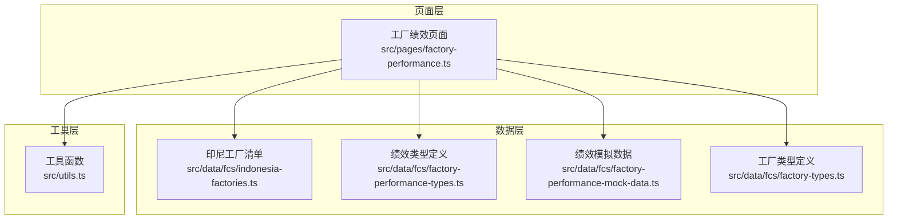
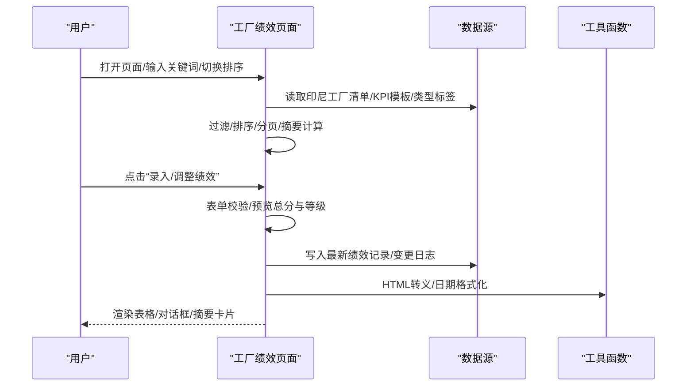
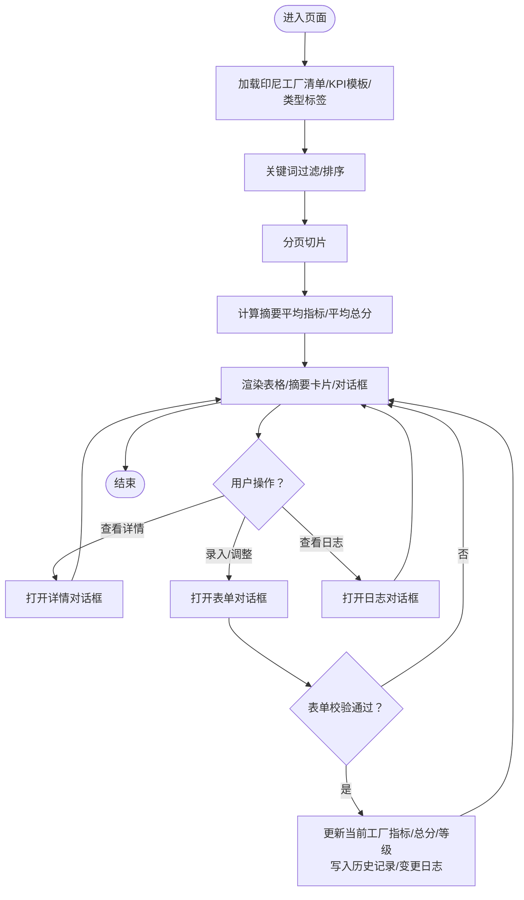
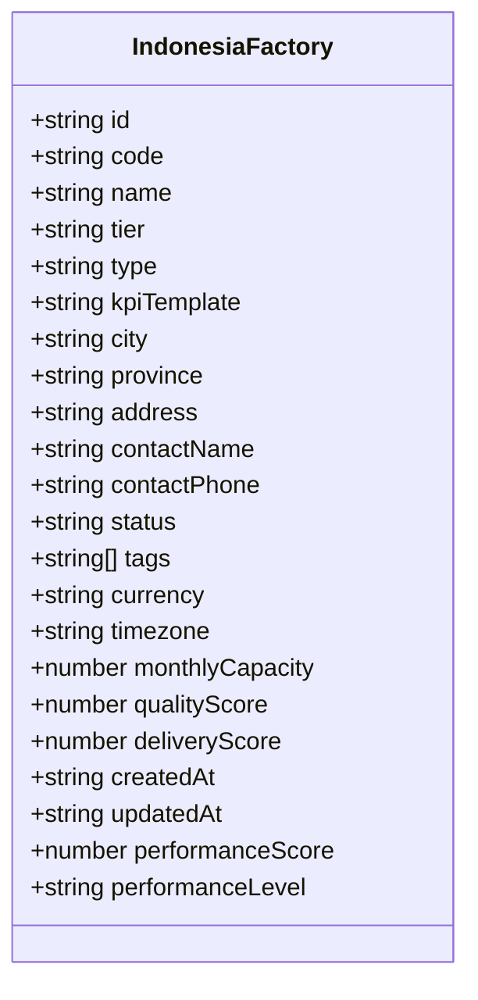
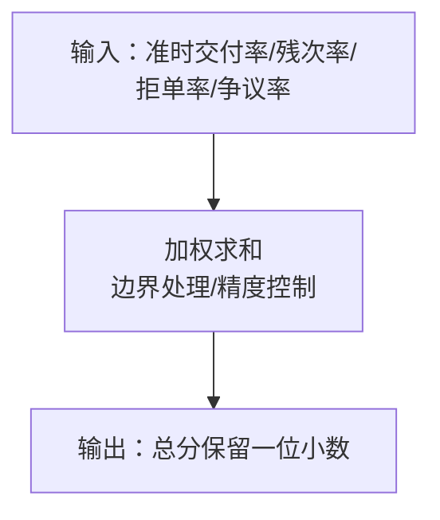
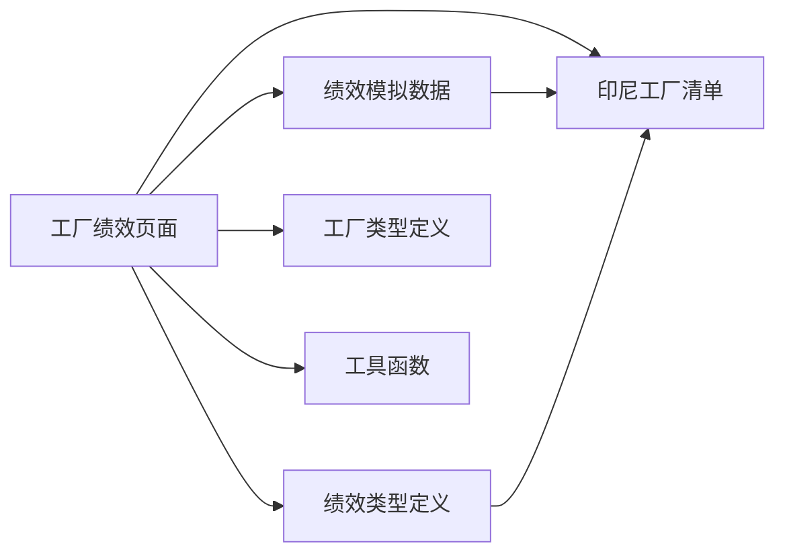

# 工厂绩效管理

<cite>
**本文引用的文件**
- [src/pages/factory-performance.ts](file://src/pages/factory-performance.ts)
- [src/data/fcs/indonesia-factories.ts](file://src/data/fcs/indonesia-factories.ts)
- [src/data/fcs/factory-performance-types.ts](file://src/data/fcs/factory-performance-types.ts)
- [src/data/fcs/factory-performance-mock-data.ts](file://src/data/fcs/factory-performance-mock-data.ts)
- [src/data/fcs/factory-types.ts](file://src/data/fcs/factory-types.ts)
- [src/utils.ts](file://src/utils.ts)
</cite>

## 目录
1. [简介](#简介)
2. [项目结构](#项目结构)
3. [核心组件](#核心组件)
4. [架构总览](#架构总览)
5. [详细组件分析](#详细组件分析)
6. [依赖关系分析](#依赖关系分析)
7. [性能考量](#性能考量)
8. [故障排查指南](#故障排查指南)
9. [结论](#结论)
10. [附录](#附录)

## 简介
本文件面向“工厂绩效管理系统”，围绕印尼工厂的绩效评估体系进行技术文档梳理。系统以“准时交付率、残次率、拒单率、争议率”为核心KPI，采用加权总分与等级划分（A/B/C）的方式进行量化评估，并提供数据采集、统计汇总、风险提示、历史记录与变更日志等功能。页面通过纯前端渲染实现，使用轻量的状态机与工具函数完成数据聚合与可视化展示。

## 项目结构
- 页面层：工厂绩效页面负责交互、表单校验、对话框渲染与分页展示。
- 数据层：印尼工厂清单、KPI模板与层级标签、绩效类型定义与模拟数据。
- 工具层：HTML转义与格式化工具，保障安全输出与日期格式化。

**图示来源**
- [src/pages/factory-performance.ts](file://src/pages/factory-performance.ts)
- [src/data/fcs/indonesia-factories.ts](file://src/data/fcs/indonesia-factories.ts)
- [src/data/fcs/factory-performance-types.ts](file://src/data/fcs/factory-performance-types.ts)
- [src/data/fcs/factory-performance-mock-data.ts](file://src/data/fcs/factory-performance-mock-data.ts)
- [src/data/fcs/factory-types.ts](file://src/data/fcs/factory-types.ts)
- [src/utils.ts](file://src/utils.ts)

**章节来源**
- [src/pages/factory-performance.ts](file://src/pages/factory-performance.ts)
- [src/data/fcs/indonesia-factories.ts](file://src/data/fcs/indonesia-factories.ts)
- [src/data/fcs/factory-performance-types.ts](file://src/data/fcs/factory-performance-types.ts)
- [src/data/fcs/factory-performance-mock-data.ts](file://src/data/fcs/factory-performance-mock-data.ts)
- [src/data/fcs/factory-types.ts](file://src/data/fcs/factory-types.ts)
- [src/utils.ts](file://src/utils.ts)

## 核心组件
- 工厂绩效页面（工厂绩效页面）
  - 负责：筛选、排序、分页、摘要卡片、详情/表单/日志对话框渲染、风险提示、变更日志记录。
  - 关键函数：计算总分、等级、风险检查、月份选项、摘要统计、分页切片、表单校验与提交。
- 印尼工厂清单（indonesia-factories）
  - 提供：工厂层级（中央/卫星/三方）、工厂类型、KPI模板、基础能力与评分字段，作为绩效数据来源。
- 绩效类型定义（factory-performance-types）
  - 提供：KPI字段、周期类型、计算总分的函数与边界处理。
- 绩效模拟数据（factory-performance-mock-data）
  - 提供：预设的绩效列表与按工厂的历史记录，用于演示与测试。
- 工厂类型定义（factory-types）
  - 提供：工厂状态、合作模式、层级与类型的配置映射，支撑页面展示与筛选。
- 工具函数（utils）
  - 提供：HTML转义、类名拼接、日期格式化，保障安全与一致的展示格式。

**章节来源**
- [src/pages/factory-performance.ts](file://src/pages/factory-performance.ts)
- [src/data/fcs/indonesia-factories.ts](file://src/data/fcs/indonesia-factories.ts)
- [src/data/fcs/factory-performance-types.ts](file://src/data/fcs/factory-performance-types.ts)
- [src/data/fcs/factory-performance-mock-data.ts](file://src/data/fcs/factory-performance-mock-data.ts)
- [src/data/fcs/factory-types.ts](file://src/data/fcs/factory-types.ts)
- [src/utils.ts](file://src/utils.ts)

## 架构总览
系统采用“页面状态机 + 数据源 + 工具函数”的轻量架构：
- 页面状态机：集中管理列表、筛选、分页、对话框、表单与错误。
- 数据源：工厂清单与KPI模板、类型标签、模拟绩效数据。
- 工具函数：安全渲染与格式化。

**图示来源**
- [src/pages/factory-performance.ts](file://src/pages/factory-performance.ts)
- [src/data/fcs/indonesia-factories.ts](file://src/data/fcs/indonesia-factories.ts)
- [src/data/fcs/factory-performance-types.ts](file://src/data/fcs/factory-performance-types.ts)
- [src/data/fcs/factory-performance-mock-data.ts](file://src/data/fcs/factory-performance-mock-data.ts)
- [src/data/fcs/factory-types.ts](file://src/data/fcs/factory-types.ts)
- [src/utils.ts](file://src/utils.ts)

## 详细组件分析

### 工厂绩效页面（工厂绩效页面）
- 数据模型
  - 工厂绩效项：包含工厂标识、名称、编码、层级、类型、KPI模板、状态、KPI指标、总分、等级、更新时间。
  - 绩效记录：包含周期、各项指标、总分、等级、备注、更新人与时间。
  - 变更日志：记录每次录入/调整的操作详情与时间戳。
- 计算与规则
  - 总分计算：基于KPI权重的加权求和，保留一位小数；等级划分：≥90为A，≥75为B，否则C。
  - 风险提示：当准时交付率低于阈值或残次率高于阈值时，弹出风险提示。
  - 月份选项：近12个月的YYYY-MM格式。
- 功能流程
  - 列表渲染：支持关键词过滤、按指标排序、分页展示。
  - 摘要统计：对筛选后的列表计算平均指标与平均总分。
  - 对话框：详情、录入/调整、变更日志三类对话框，分别渲染指标明细、表单与历史记录。
  - 表单校验：对必填项与数值范围进行校验，支持预览总分与等级。
  - 提交流程：更新当前工厂的指标与总分/等级，写入历史记录并生成变更日志。

**图示来源**
- [src/pages/factory-performance.ts](file://src/pages/factory-performance.ts)

**章节来源**
- [src/pages/factory-performance.ts](file://src/pages/factory-performance.ts)

### 印尼工厂清单（indonesia-factories）
- 角色与类型
  - 层级：中央工厂、卫星工厂、三方工厂。
  - 类型：按层级约束的多种工厂类型（如印花、染色、裁床、仓储、发货、设计中心等）。
  - KPI模板：针对不同业务场景的KPI模板（车缝、印染、仓储、通用）。
- 字段与用途
  - 包含工厂基础信息、地址、联系方式、状态、标签、货币与时区、月度产能、质量与交付评分、更新时间等。
  - 作为绩效数据的来源，驱动页面的筛选、排序与展示。

**图示来源**
- [src/data/fcs/indonesia-factories.ts](file://src/data/fcs/indonesia-factories.ts)

**章节来源**
- [src/data/fcs/indonesia-factories.ts](file://src/data/fcs/indonesia-factories.ts)

### 绩效类型定义（factory-performance-types）
- 字段与周期
  - 工厂绩效项：包含各项KPI、总分与更新时间。
  - 工厂绩效记录：包含周期类型（周/月）、周期、各项KPI、总分、更新人与备注。
- 计算函数
  - 提供总分计算函数，包含边界处理与精度控制，确保结果在合理范围内。

**图示来源**
- [src/data/fcs/factory-performance-types.ts](file://src/data/fcs/factory-performance-types.ts)

**章节来源**
- [src/data/fcs/factory-performance-types.ts](file://src/data/fcs/factory-performance-types.ts)

### 绩效模拟数据（factory-performance-mock-data）
- 预设数据
  - 提供固定数量的工厂绩效项与按工厂的历史记录，便于演示与测试。
- 使用方式
  - 页面可直接使用模拟数据初始化列表与历史记录，或与真实数据源对接。

**章节来源**
- [src/data/fcs/factory-performance-mock-data.ts](file://src/data/fcs/factory-performance-mock-data.ts)

### 工厂类型定义（factory-types）
- 配置
  - 工厂状态、合作模式、层级与类型的配置映射，支撑页面展示与筛选。
- 用途
  - 用于在页面中展示层级、类型与合作模式的标签样式与文本。

**章节来源**
- [src/data/fcs/factory-types.ts](file://src/data/fcs/factory-types.ts)

### 工具函数（utils）
- 安全与格式化
  - HTML转义：防止XSS注入。
  - 类名拼接：简化条件类名组合。
  - 日期格式化：统一时间显示格式。

**章节来源**
- [src/utils.ts](file://src/utils.ts)

## 依赖关系分析
- 页面依赖数据源与工具函数，形成清晰的单向依赖链。
- 数据源之间存在弱耦合：印尼工厂清单为其他模块提供基础数据；类型定义与模拟数据为页面提供展示与演示数据。
- 工具函数被页面与数据模块共同使用，提升复用性与安全性。

**图示来源**
- [src/pages/factory-performance.ts](file://src/pages/factory-performance.ts)
- [src/data/fcs/indonesia-factories.ts](file://src/data/fcs/indonesia-factories.ts)
- [src/data/fcs/factory-performance-types.ts](file://src/data/fcs/factory-performance-types.ts)
- [src/data/fcs/factory-performance-mock-data.ts](file://src/data/fcs/factory-performance-mock-data.ts)
- [src/data/fcs/factory-types.ts](file://src/data/fcs/factory-types.ts)
- [src/utils.ts](file://src/utils.ts)

**章节来源**
- [src/pages/factory-performance.ts](file://src/pages/factory-performance.ts)
- [src/data/fcs/indonesia-factories.ts](file://src/data/fcs/indonesia-factories.ts)
- [src/data/fcs/factory-performance-types.ts](file://src/data/fcs/factory-performance-types.ts)
- [src/data/fcs/factory-performance-mock-data.ts](file://src/data/fcs/factory-performance-mock-data.ts)
- [src/data/fcs/factory-types.ts](file://src/data/fcs/factory-types.ts)
- [src/utils.ts](file://src/utils.ts)

## 性能考量
- 计算复杂度
  - 过滤与排序：O(n log n)，其中n为工厂数量。
  - 摘要统计：O(n)，一次遍历累加。
  - 分页切片：O(k)，k为每页条目数。
- 优化建议
  - 大列表场景：采用虚拟滚动或服务端分页。
  - 频繁渲染：对计算结果进行缓存，避免重复计算。
  - 数据更新：批量更新状态，减少重渲染次数。
  - 图表渲染：若引入图表，建议使用轻量库并在数据稳定后再渲染。

[本节为通用指导，无需具体文件来源]

## 故障排查指南
- 表单校验失败
  - 现象：提交按钮不可用或出现红色提示。
  - 排查：检查必填项与数值范围（0-100），确认提示文案对应字段。
- 总分/等级异常
  - 现象：总分为负或超过100，等级不在A/B/C。
  - 排查：核对输入指标是否在合法范围；检查计算权重与边界处理逻辑。
- 风险提示未触发
  - 现象：指标低于阈值但未显示风险提示。
  - 排查：确认风险检查函数的阈值设置与调用时机。
- 历史记录缺失
  - 现象：详情对话框中历史记录为空。
  - 排查：确认按工厂的历史记录数据是否存在；检查写入逻辑与键名匹配。

**章节来源**
- [src/pages/factory-performance.ts](file://src/pages/factory-performance.ts)

## 结论
该工厂绩效管理系统以清晰的数据模型与轻量的前端实现，完成了KPI采集、计算、展示与历史追踪的闭环。通过层级与类型标签、KPI模板以及风险提示机制，系统具备良好的可扩展性与可维护性。后续可在图表可视化、服务端集成与性能优化方面进一步增强。

[本节为总结，无需具体文件来源]

## 附录

### KPI计算与权重
- 指标构成
  - 准时交付率、残次率、拒单率、争议率。
- 权重分配
  - 准时交付率：40%
  - 残次率：30%
  - 拒单率：20%
  - 争议率：10%
- 计算公式路径
  - [src/pages/factory-performance.ts](file://src/pages/factory-performance.ts)
  - [src/data/fcs/factory-performance-types.ts](file://src/data/fcs/factory-performance-types.ts)

**章节来源**
- [src/pages/factory-performance.ts](file://src/pages/factory-performance.ts)
- [src/data/fcs/factory-performance-types.ts](file://src/data/fcs/factory-performance-types.ts)

### 绩效等级划分
- 等级标准
  - A：总分≥90
  - B：总分≥75且<90
  - C：总分<75
- 划分逻辑路径
  - [src/pages/factory-performance.ts](file://src/pages/factory-performance.ts)

**章节来源**
- [src/pages/factory-performance.ts](file://src/pages/factory-performance.ts)

### 数据采集与统计机制
- 数据来源
  - 印尼工厂清单：提供基础信息与评分字段。
  - 绩效模拟数据：提供预设列表与历史记录。
- 统计逻辑
  - 过滤、排序、分页与摘要计算。
- 采集与统计路径
  - [src/pages/factory-performance.ts](file://src/pages/factory-performance.ts)
  - [src/data/fcs/indonesia-factories.ts](file://src/data/fcs/indonesia-factories.ts)
  - [src/data/fcs/factory-performance-mock-data.ts](file://src/data/fcs/factory-performance-mock-data.ts)

**章节来源**
- [src/pages/factory-performance.ts](file://src/pages/factory-performance.ts)
- [src/data/fcs/indonesia-factories.ts](file://src/data/fcs/indonesia-factories.ts)
- [src/data/fcs/factory-performance-mock-data.ts](file://src/data/fcs/factory-performance-mock-data.ts)

### 绩效分析算法
- 趋势分析
  - 基于历史记录按周期排序，观察指标变化趋势。
- 对比分析
  - 支持按指标排序与筛选，进行工厂间横向对比。
- 预测分析
  - 当前实现未包含预测算法，可扩展为基于历史趋势的简单外推。
- 分析路径
  - [src/pages/factory-performance.ts](file://src/pages/factory-performance.ts)
  - [src/data/fcs/factory-performance-mock-data.ts](file://src/data/fcs/factory-performance-mock-data.ts)

**章节来源**
- [src/pages/factory-performance.ts](file://src/pages/factory-performance.ts)
- [src/data/fcs/factory-performance-mock-data.ts](file://src/data/fcs/factory-performance-mock-data.ts)

### 报告生成与展示
- 仪表板设计
  - 摘要卡片：展示平均准时交付率、平均残次率、平均拒单率、平均争议率与平均总分。
- 图表类型
  - 当前页面使用进度条与等级徽章展示指标与等级。
- 数据钻取
  - 通过详情对话框查看历史记录与风险提示。
- 展示路径
  - [src/pages/factory-performance.ts](file://src/pages/factory-performance.ts)

**章节来源**
- [src/pages/factory-performance.ts](file://src/pages/factory-performance.ts)

### 数据模型设计
- 工厂绩效项
  - 字段：工厂标识、名称、编码、层级、类型、KPI模板、状态、KPI指标、总分、等级、更新时间。
- 绩效记录
  - 字段：周期、各项指标、总分、等级、备注、更新人与时间。
- 类型定义
  - 周期类型、KPI字段与计算函数。
- 模型路径
  - [src/data/fcs/factory-performance-types.ts](file://src/data/fcs/factory-performance-types.ts)
  - [src/data/fcs/factory-performance-mock-data.ts](file://src/data/fcs/factory-performance-mock-data.ts)

**章节来源**
- [src/data/fcs/factory-performance-types.ts](file://src/data/fcs/factory-performance-types.ts)
- [src/data/fcs/factory-performance-mock-data.ts](file://src/data/fcs/factory-performance-mock-data.ts)

### 可视化渲染实现
- HTML模板与对话框
  - 使用字符串模板拼接渲染表格、摘要卡片与对话框。
- 安全渲染
  - 使用工具函数进行HTML转义，防止XSS。
- 渲染路径
  - [src/pages/factory-performance.ts](file://src/pages/factory-performance.ts)
  - [src/utils.ts](file://src/utils.ts)

**章节来源**
- [src/pages/factory-performance.ts](file://src/pages/factory-performance.ts)
- [src/utils.ts](file://src/utils.ts)