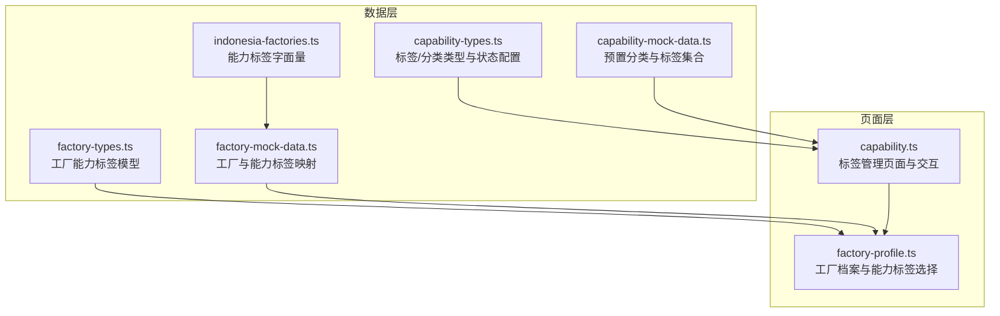
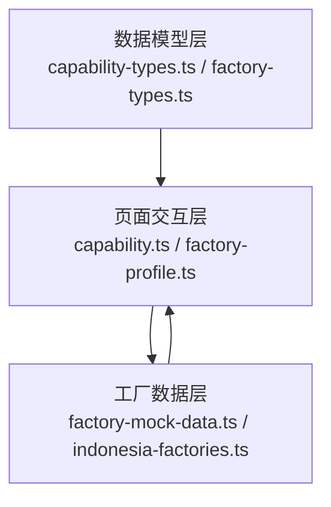
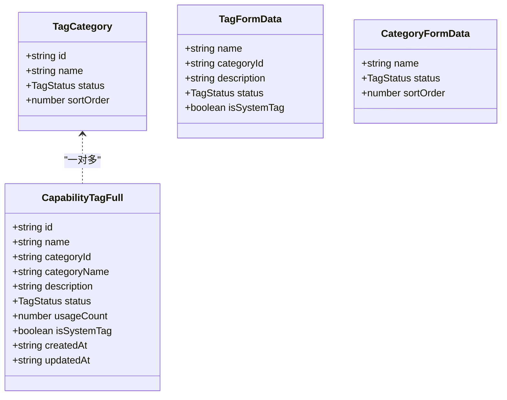
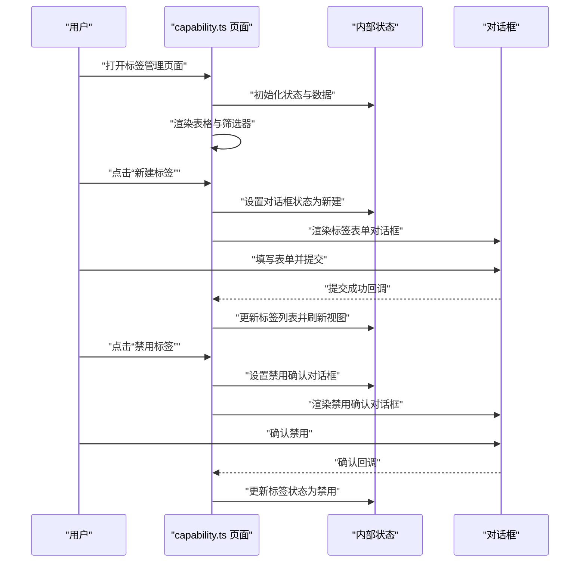
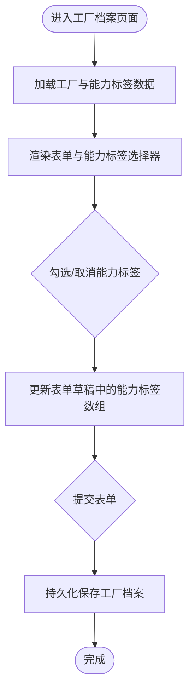
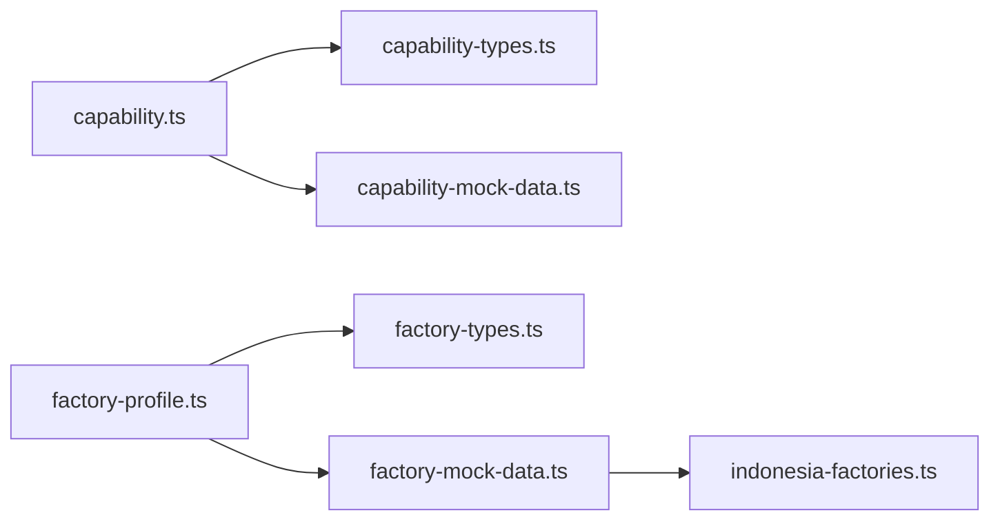

# 能力标签系统

<cite>
**本文引用的文件**
- [capability-types.ts](file://src/data/fcs/capability-types.ts)
- [capability-mock-data.ts](file://src/data/fcs/capability-mock-data.ts)
- [capability.ts](file://src/pages/capability.ts)
- [factory-types.ts](file://src/data/fcs/factory-types.ts)
- [factory-mock-data.ts](file://src/data/fcs/factory-mock-data.ts)
- [factory-profile.ts](file://src/pages/factory-profile.ts)
- [indonesia-factories.ts](file://src/data/fcs/indonesia-factories.ts)
</cite>

## 目录
1. [简介](#简介)
2. [项目结构](#项目结构)
3. [核心组件](#核心组件)
4. [架构总览](#架构总览)
5. [详细组件分析](#详细组件分析)
6. [依赖分析](#依赖分析)
7. [性能考虑](#性能考虑)
8. [故障排查指南](#故障排查指南)
9. [结论](#结论)
10. [附录](#附录)

## 简介
本文件面向“工厂能力标签系统”，系统性梳理标签的分类体系、层级结构、配置管理、与工厂档案的关联、搜索筛选与智能推荐思路，以及前端渲染与数据模型设计。文档以仓库现有代码为基础，结合工厂侧标签与能力模型，给出可落地的实现建议与可视化图示。

## 项目结构
能力标签系统由“标签数据模型与预置数据”、“标签管理页面”、“工厂档案与能力标签关联”三部分组成：
- 数据层：定义标签与分类的数据结构、状态、预置分类与标签集合
- 页面层：提供标签与分类的增删改查、筛选排序、分页与对话框交互
- 关联层：工厂档案中以能力标签形式展示与选择工厂所具备的能力

**图表来源**
- [capability-types.ts:1-47](file://src/data/fcs/capability-types.ts#L1-L47)
- [capability-mock-data.ts:1-195](file://src/data/fcs/capability-mock-data.ts#L1-L195)
- [capability.ts:1-988](file://src/pages/capability.ts#L1-L988)
- [factory-types.ts:1-155](file://src/data/fcs/factory-types.ts#L1-L155)
- [factory-mock-data.ts:1-121](file://src/data/fcs/factory-mock-data.ts#L1-L121)
- [factory-profile.ts:1-1880](file://src/pages/factory-profile.ts#L1-L1880)
- [indonesia-factories.ts:1-200](file://src/data/fcs/indonesia-factories.ts#L1-L200)

**章节来源**
- [capability-types.ts:1-47](file://src/data/fcs/capability-types.ts#L1-L47)
- [capability-mock-data.ts:1-195](file://src/data/fcs/capability-mock-data.ts#L1-L195)
- [capability.ts:1-988](file://src/pages/capability.ts#L1-L988)
- [factory-types.ts:1-155](file://src/data/fcs/factory-types.ts#L1-L155)
- [factory-mock-data.ts:1-121](file://src/data/fcs/factory-mock-data.ts#L1-L121)
- [factory-profile.ts:1-1880](file://src/pages/factory-profile.ts#L1-L1880)
- [indonesia-factories.ts:1-200](file://src/data/fcs/indonesia-factories.ts#L1-L200)

## 核心组件
- 标签与分类数据模型
  - 标签状态：启用/禁用
  - 标签分类：包含排序字段，用于展示顺序控制
  - 完整标签对象：包含分类名、描述、使用计数、是否系统标签、创建/更新时间等
  - 表单数据：标签与分类的表单输入结构
- 标签管理页面
  - 支持关键词搜索、分类过滤、状态过滤、系统标签过滤、按名称/使用次数排序
  - 支持分页浏览
  - 支持新建/编辑标签、查看详情、禁用确认、分类管理（新建/编辑/启用/禁用）
- 工厂档案与能力标签
  - 工厂能力标签模型：包含标签ID、名称与分类维度（生产类别/工艺能力/材料加工）
  - 工厂档案页面：支持在表单中勾选/切换能力标签，保存至工厂对象
  - 预置标签集合：提供常用能力标签字面量，便于映射与展示

**章节来源**
- [capability-types.ts:1-47](file://src/data/fcs/capability-types.ts#L1-L47)
- [capability-mock-data.ts:1-195](file://src/data/fcs/capability-mock-data.ts#L1-L195)
- [capability.ts:1-988](file://src/pages/capability.ts#L1-L988)
- [factory-types.ts:41-46](file://src/data/fcs/factory-types.ts#L41-L46)
- [factory-mock-data.ts:4-39](file://src/data/fcs/factory-mock-data.ts#L4-L39)
- [factory-profile.ts:187-206](file://src/pages/factory-profile.ts#L187-L206)
- [indonesia-factories.ts:128-132](file://src/data/fcs/indonesia-factories.ts#L128-L132)

## 架构总览
能力标签系统采用“数据模型 + 页面交互 + 工厂关联”的分层设计：
- 数据模型层：定义标签与分类的结构、状态与默认配置
- 页面交互层：提供标签与分类的 CRUD、筛选、排序、分页与对话框
- 工厂关联层：在工厂档案中以能力标签形式展示与选择

**图表来源**
- [capability-types.ts:1-47](file://src/data/fcs/capability-types.ts#L1-L47)
- [factory-types.ts:1-155](file://src/data/fcs/factory-types.ts#L1-L155)
- [capability.ts:1-988](file://src/pages/capability.ts#L1-L988)
- [factory-profile.ts:1-1880](file://src/pages/factory-profile.ts#L1-L1880)
- [factory-mock-data.ts:1-121](file://src/data/fcs/factory-mock-data.ts#L1-L121)
- [indonesia-factories.ts:1-200](file://src/data/fcs/indonesia-factories.ts#L1-L200)

## 详细组件分析

### 标签与分类数据模型
- 标签状态与配置
  - 状态枚举：启用/禁用
  - 状态配置：包含标签与颜色映射，用于界面徽标展示
- 标签分类
  - 字段：ID、名称、状态、排序序号
  - 作用：控制分类的展示顺序与启用状态
- 完整标签对象
  - 字段：ID、名称、分类ID与分类名、描述、状态、使用计数、是否系统标签、创建/更新时间
  - 用途：用于标签管理页面的展示与交互
- 表单数据
  - 标签表单：名称、分类、描述、状态、是否系统标签
  - 分类表单：名称、状态、排序序号

**图表来源**
- [capability-types.ts:5-40](file://src/data/fcs/capability-types.ts#L5-L40)

**章节来源**
- [capability-types.ts:1-47](file://src/data/fcs/capability-types.ts#L1-L47)

### 标签管理页面（capability.ts）
- 状态与筛选
  - 内部状态：标签列表、分类列表、关键词、分类过滤、状态过滤、系统标签过滤、排序字段与方向、当前页码、对话框状态、菜单展开状态、表单错误、分类表单状态等
  - 过滤逻辑：支持关键词匹配、分类过滤、状态过滤、系统标签过滤；排序支持按名称与使用次数
- 分页与渲染
  - 分页大小固定，按当前页切片
  - 渲染表格列：名称、分类、状态徽标、使用次数、系统标签标识、更新时间、操作菜单
- 对话框与交互
  - 标签表单对话框：新建/编辑标签，包含名称、分类、描述、状态、系统标签开关
  - 分类管理对话框：新建/编辑分类，启用/禁用分类，禁用前确认分类下的标签数量
  - 查看详情对话框：展示标签的完整信息
  - 禁用确认对话框：禁用标签时弹出二次确认
- 事件处理
  - 支持筛选器变更、排序按钮点击、分页导航、对话框关闭、分类表单提交、标签禁用确认等

**图表来源**
- [capability.ts:51-76](file://src/pages/capability.ts#L51-L76)
- [capability.ts:92-127](file://src/pages/capability.ts#L92-L127)
- [capability.ts:150-252](file://src/pages/capability.ts#L150-L252)
- [capability.ts:279-394](file://src/pages/capability.ts#L279-L394)
- [capability.ts:396-450](file://src/pages/capability.ts#L396-L450)
- [capability.ts:651-807](file://src/pages/capability.ts#L651-L807)

**章节来源**
- [capability.ts:1-988](file://src/pages/capability.ts#L1-L988)

### 工厂档案与能力标签（factory-profile.ts 与 factory-types.ts）
- 工厂能力标签模型
  - 字段：ID、名称、分类（生产类别/工艺能力/材料加工）
  - 用途：在工厂档案中以能力标签形式展示与选择
- 工厂档案页面
  - 表单草稿：包含能力标签数组（以ID集合形式），并在编辑时映射回标签对象
  - 能力标签选择：在表单中勾选/切换能力标签，保存至工厂对象
- 预置标签集合
  - 提供常用能力标签字面量，便于映射与展示
  - 工厂侧标签名称到ID的映射函数，支持从名称生成能力标签对象

**图表来源**
- [factory-types.ts:41-46](file://src/data/fcs/factory-types.ts#L41-L46)
- [factory-profile.ts:187-206](file://src/pages/factory-profile.ts#L187-L206)
- [factory-mock-data.ts:4-39](file://src/data/fcs/factory-mock-data.ts#L4-L39)
- [indonesia-factories.ts:128-132](file://src/data/fcs/indonesia-factories.ts#L128-L132)

**章节来源**
- [factory-types.ts:41-46](file://src/data/fcs/factory-types.ts#L41-L46)
- [factory-profile.ts:187-206](file://src/pages/factory-profile.ts#L187-L206)
- [factory-mock-data.ts:4-39](file://src/data/fcs/factory-mock-data.ts#L4-L39)
- [indonesia-factories.ts:128-132](file://src/data/fcs/indonesia-factories.ts#L128-L132)

### 标签分类体系与层级结构
- 分类维度
  - 生产类别：如成衣、半成品、裁剪等
  - 工艺能力：如车缝、绣花、印花、水洗、染色、后整理等
  - 面料类型：如梭织、针织、牛仔、棉、涤纶、真丝等
  - 认证资质：如BSCI、ISO9001、OEKO-TEX等
  - 规模等级：如小型、中型、大型等
- 层级与继承
  - 分类作为一级维度，标签隶属于分类
  - 标签可标记为系统标签，系统标签通常不可被普通用户删除
  - 使用计数用于统计标签的使用频率，可用于排序与推荐权重

**章节来源**
- [capability-mock-data.ts:3-10](file://src/data/fcs/capability-mock-data.ts#L3-L10)
- [capability-mock-data.ts:12-194](file://src/data/fcs/capability-mock-data.ts#L12-L194)
- [capability-types.ts:1-47](file://src/data/fcs/capability-types.ts#L1-L47)

### 标签配置管理机制
- 创建/编辑/删除/状态控制
  - 新建/编辑：通过标签表单对话框完成，支持必填校验与错误提示
  - 删除：系统标签不可删除；非系统标签可通过禁用达到删除效果
  - 状态控制：启用/禁用切换，禁用前进行二次确认
- 分类管理
  - 新建/编辑分类：支持设置名称、状态与排序序号
  - 启用/禁用分类：禁用前提示该分类下的标签数量，避免影响新工厂选择

**章节来源**
- [capability.ts:150-252](file://src/pages/capability.ts#L150-L252)
- [capability.ts:279-394](file://src/pages/capability.ts#L279-L394)
- [capability.ts:396-450](file://src/pages/capability.ts#L396-L450)
- [capability.ts:651-807](file://src/pages/capability.ts#L651-L807)

### 标签与工厂档案的关联关系
- 关联方式
  - 工厂档案中以能力标签数组的形式存储工厂具备的能力
  - 能力标签包含ID、名称与分类，便于展示与筛选
- 选择与展示
  - 在工厂表单中勾选能力标签，保存为ID数组
  - 列表与详情中以分类维度展示标签，便于快速识别工厂的核心能力

**章节来源**
- [factory-types.ts:41-46](file://src/data/fcs/factory-types.ts#L41-L46)
- [factory-profile.ts:187-206](file://src/pages/factory-profile.ts#L187-L206)
- [factory-mock-data.ts:4-39](file://src/data/fcs/factory-mock-data.ts#L4-L39)

### 搜索与筛选功能实现
- 多标签组合查询
  - 支持关键词搜索（名称模糊匹配）
  - 支持分类、状态、系统标签的多维过滤
  - 排序支持按名称与使用次数
- 智能推荐算法（概念性说明）
  - 基于使用计数与分类热度进行加权排序
  - 结合工厂当前需求与历史选择偏好进行候选集筛选
  - 可扩展为基于标签共现矩阵的协同过滤或基于向量相似度的检索

**章节来源**
- [capability.ts:92-127](file://src/pages/capability.ts#L92-L127)
- [capability.ts:496-542](file://src/pages/capability.ts#L496-L542)

### 标签数据模型设计思路
- 标签对象
  - 包含分类名与分类ID，便于跨页面一致展示与筛选
  - 使用计数用于统计与排序
  - 是否系统标签用于权限控制
- 分类对象
  - 排序序号用于控制展示顺序
  - 状态用于启用/禁用分类
- 工厂侧能力标签
  - 以ID+名称+分类的轻量结构存储，减少冗余
  - 与预置标签集合保持映射关系，便于统一管理

**章节来源**
- [capability-types.ts:13-33](file://src/data/fcs/capability-types.ts#L13-L33)
- [capability-mock-data.ts:12-194](file://src/data/fcs/capability-mock-data.ts#L12-L194)
- [factory-types.ts:41-46](file://src/data/fcs/factory-types.ts#L41-L46)

### 前端渲染与交互实现方案
- 表格渲染
  - 使用状态驱动的渲染函数，根据当前状态动态生成HTML片段
  - 支持排序图标、徽标颜色、系统标签标识等视觉反馈
- 对话框与菜单
  - 通过状态切换控制对话框与下拉菜单的显示/隐藏
  - 事件委托与数据属性绑定，提升交互响应性
- 分页与筛选
  - 固定分页大小，按页切片渲染
  - 筛选器变更自动重置页码并刷新视图

**章节来源**
- [capability.ts:473-634](file://src/pages/capability.ts#L473-L634)
- [capability.ts:651-807](file://src/pages/capability.ts#L651-L807)

## 依赖分析
- 模块耦合
  - capability.ts 依赖 capability-types.ts 与 capability-mock-data.ts 提供的数据结构与预置数据
  - factory-profile.ts 依赖 factory-types.ts 与 factory-mock-data.ts 提供的工厂与能力标签模型
  - factory-mock-data.ts 依赖 indonesia-factories.ts 提供的标签字面量
- 外部依赖
  - 无外部依赖，纯前端实现
- 循环依赖
  - 未发现循环依赖

**图表来源**
- [capability.ts:1-12](file://src/pages/capability.ts#L1-L12)
- [capability-types.ts:1-12](file://src/data/fcs/capability-types.ts#L1-L12)
- [capability-mock-data.ts:1-4](file://src/data/fcs/capability-mock-data.ts#L1-L4)
- [factory-profile.ts:1-17](file://src/pages/factory-profile.ts#L1-L17)
- [factory-types.ts:1-17](file://src/data/fcs/factory-types.ts#L1-L17)
- [factory-mock-data.ts:1-5](file://src/data/fcs/factory-mock-data.ts#L1-L5)
- [indonesia-factories.ts:1-5](file://src/data/fcs/indonesia-factories.ts#L1-L5)

**章节来源**
- [capability.ts:1-12](file://src/pages/capability.ts#L1-L12)
- [capability-types.ts:1-12](file://src/data/fcs/capability-types.ts#L1-L12)
- [capability-mock-data.ts:1-4](file://src/data/fcs/capability-mock-data.ts#L1-L4)
- [factory-profile.ts:1-17](file://src/pages/factory-profile.ts#L1-L17)
- [factory-types.ts:1-17](file://src/data/fcs/factory-types.ts#L1-L17)
- [factory-mock-data.ts:1-5](file://src/data/fcs/factory-mock-data.ts#L1-L5)
- [indonesia-factories.ts:1-5](file://src/data/fcs/indonesia-factories.ts#L1-L5)

## 性能考虑
- 渲染优化
  - 使用分页与虚拟滚动（可选）降低长列表渲染压力
  - 事件委托减少监听器数量
- 数据处理
  - 过滤与排序在内存中进行，建议限制数据规模或引入索引
  - 使用不可变更新策略，避免不必要的重渲染
- 交互体验
  - 对话框与菜单的状态切换尽量局部化，减少全局状态更新

## 故障排查指南
- 表单校验失败
  - 检查必填字段与错误提示是否正确绑定
  - 确认表单提交前的校验逻辑覆盖所有场景
- 禁用分类/标签确认
  - 确保禁用前的确认对话框正确显示标签数量
  - 确认禁用后的状态更新与时间戳更新逻辑
- 分类状态切换
  - 确认启用/禁用切换后，对应标签的分类名同步更新
- 工厂能力标签选择
  - 确认表单草稿中的能力标签数组与实际保存一致
  - 检查标签映射函数是否正确处理未知标签

**章节来源**
- [capability.ts:134-144](file://src/pages/capability.ts#L134-L144)
- [capability.ts:254-277](file://src/pages/capability.ts#L254-L277)
- [capability.ts:396-416](file://src/pages/capability.ts#L396-L416)
- [capability.ts:636-638](file://src/pages/capability.ts#L636-L638)
- [capability.ts:734-748](file://src/pages/capability.ts#L734-L748)
- [factory-profile.ts:165-171](file://src/pages/factory-profile.ts#L165-L171)
- [factory-mock-data.ts:32-39](file://src/data/fcs/factory-mock-data.ts#L32-L39)

## 结论
能力标签系统以清晰的数据模型与直观的页面交互为核心，实现了标签与分类的全生命周期管理，并与工厂档案形成稳定的关联关系。通过关键词搜索、多维过滤与排序，用户可以高效地定位与选择所需能力标签。未来可在推荐算法与性能优化方面进一步增强，以支撑更大规模的数据与更复杂的业务场景。

## 附录
- 代码示例路径（不直接展示代码内容）
  - 标签数据结构定义：[capability-types.ts:13-33](file://src/data/fcs/capability-types.ts#L13-L33)
  - 预置标签与分类：[capability-mock-data.ts:3-194](file://src/data/fcs/capability-mock-data.ts#L3-L194)
  - 标签管理页面渲染与交互：[capability.ts:473-807](file://src/pages/capability.ts#L473-L807)
  - 工厂能力标签模型与表单草稿：[factory-types.ts:41-46](file://src/data/fcs/factory-types.ts#L41-L46), [factory-profile.ts:187-206](file://src/pages/factory-profile.ts#L187-L206)
  - 工厂标签映射与预置标签：[factory-mock-data.ts:4-39](file://src/data/fcs/factory-mock-data.ts#L4-L39), [indonesia-factories.ts:128-132](file://src/data/fcs/indonesia-factories.ts#L128-L132)