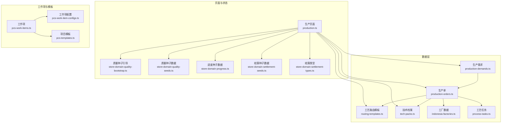
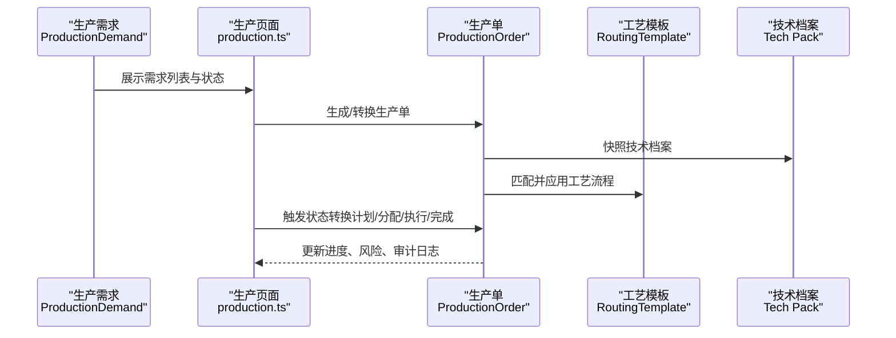
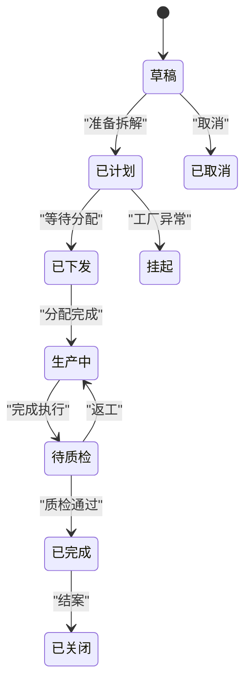
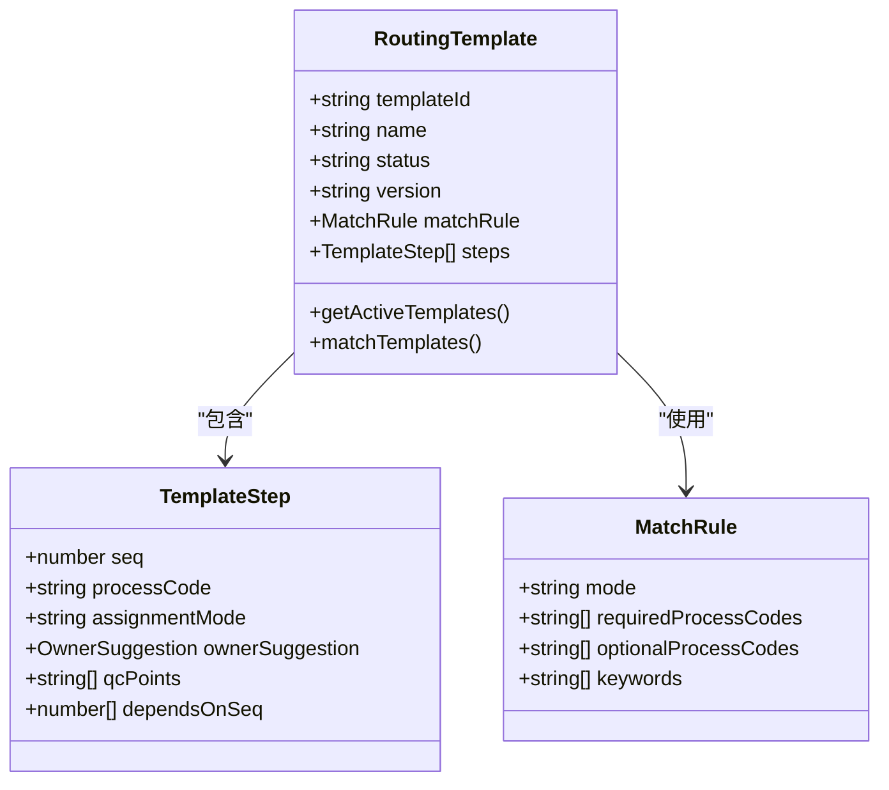
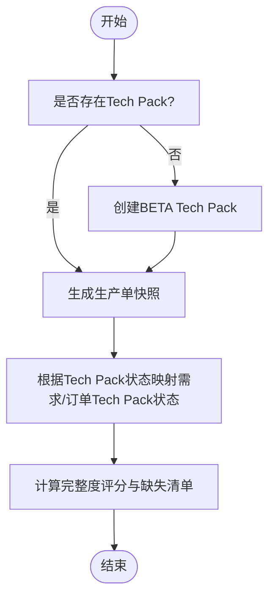
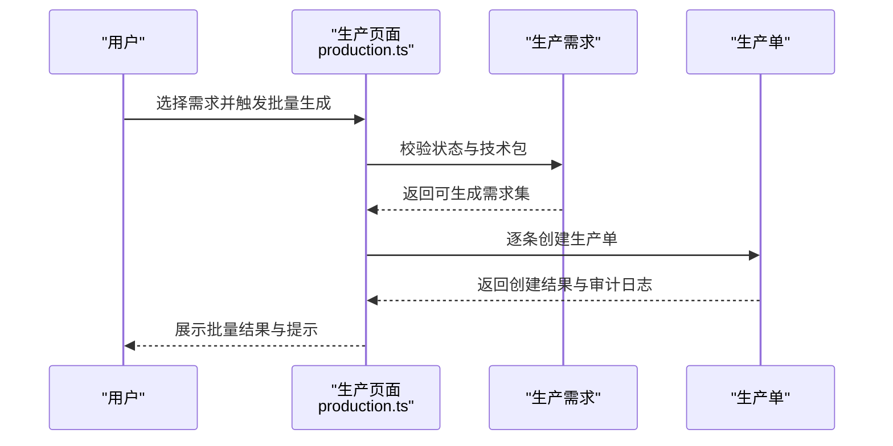
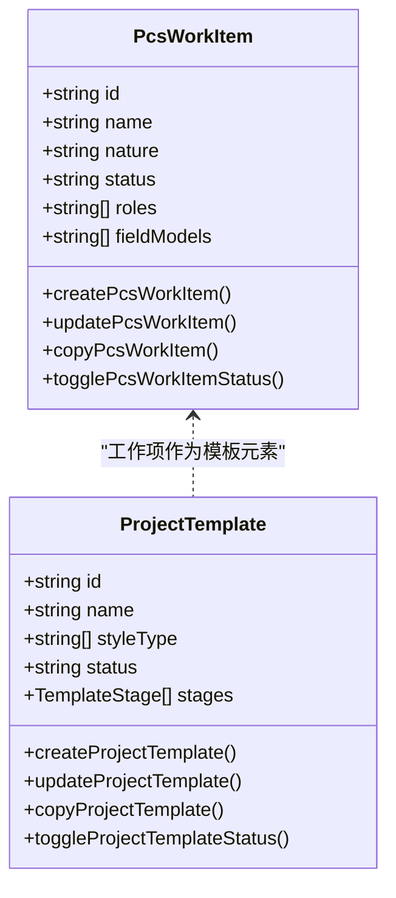
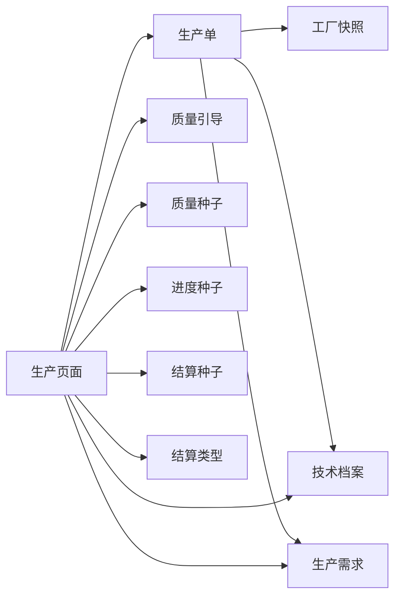

# 生产单管理

<cite>
**本文档引用的文件**
- [production-orders.ts](file://src/data/fcs/production-orders.ts)
- [production-demands.ts](file://src/data/fcs/production-demands.ts)
- [routing-templates.ts](file://src/data/fcs/routing-templates.ts)
- [tech-packs.ts](file://src/data/fcs/tech-packs.ts)
- [production.ts](file://src/pages/production.ts)
- [indonesia-factories.ts](file://src/data/fcs/indonesia-factories.ts)
- [process-tasks.ts](file://src/data/fcs/process-tasks.ts)
- [store-domain-quality-bootstrap.ts](file://src/data/fcs/store-domain-quality-bootstrap.ts)
- [store-domain-quality-seeds.ts](file://src/data/fcs/store-domain-quality-seeds.ts)
- [store-domain-progress.ts](file://src/data/fcs/store-domain-progress.ts)
- [store-domain-settlement-seeds.ts](file://src/data/fcs/store-domain-settlement-seeds.ts)
- [store-domain-settlement-types.ts](file://src/data/fcs/store-domain-settlement-types.ts)
- [pcs-work-items.ts](file://src/data/pcs-work-items.ts)
- [pcs-work-item-configs.ts](file://src/data/pcs-work-item-configs.ts)
- [pcs-templates.ts](file://src/data/pcs-templates.ts)
</cite>

## 目录
1. [引言](#引言)
2. [项目结构](#项目结构)
3. [核心组件](#核心组件)
4. [架构总览](#架构总览)
5. [详细组件分析](#详细组件分析)
6. [依赖关系分析](#依赖关系分析)
7. [性能考虑](#性能考虑)
8. [故障排除指南](#故障排除指南)
9. [结论](#结论)
10. [附录](#附录)

## 引言
本技术文档面向生产单管理系统，围绕生产单生命周期管理（需求接收、创建、计划、执行、完成确认）、数据模型设计（生产单基本信息、产品规格、数量要求、交货日期、客户信息等）、工序工艺字典系统（工艺流程定义、工序标准时间、设备要求、质量标准等参数配置）、技术档案（Tech Pack）管理机制（产品设计图、工艺文件、质量标准、包装要求等技术文档的存储与检索）进行系统化梳理。文档提供状态转换逻辑、数据验证规则与批量操作功能的代码路径指引，帮助开发者与运维人员快速理解与维护系统。

## 项目结构
系统采用模块化组织，核心数据模型位于 `src/data/fcs/`，页面逻辑位于 `src/pages/`，工作项与模板体系位于 `src/data/` 的 PCS 子目录。生产单管理的关键模块包括：
- 生产需求与生产单数据模型
- 工序工艺字典（路由模板）
- 技术档案（Tech Pack）
- 页面交互与状态控制
- 工作项与项目模板体系

**图表来源**
- [production-orders.ts](file://src/data/fcs/production-orders.ts)
- [production-demands.ts](file://src/data/fcs/production-demands.ts)
- [routing-templates.ts](file://src/data/fcs/routing-templates.ts)
- [tech-packs.ts](file://src/data/fcs/tech-packs.ts)
- [production.ts](file://src/pages/production.ts)
- [pcs-work-items.ts](file://src/data/pcs-work-items.ts)
- [pcs-work-item-configs.ts](file://src/data/pcs-work-item-configs.ts)
- [pcs-templates.ts](file://src/data/pcs-templates.ts)

**章节来源**
- [production.ts](file://src/pages/production.ts)
- [production-orders.ts](file://src/data/fcs/production-orders.ts)
- [production-demands.ts](file://src/data/fcs/production-demands.ts)
- [routing-templates.ts](file://src/data/fcs/routing-templates.ts)
- [tech-packs.ts](file://src/data/fcs/tech-packs.ts)
- [pcs-work-items.ts](file://src/data/pcs-work-items.ts)
- [pcs-work-item-configs.ts](file://src/data/pcs-work-item-configs.ts)
- [pcs-templates.ts](file://src/data/pcs-templates.ts)

## 核心组件
- 生产需求（ProductionDemand）：描述来自上游系统的订单需求，包含SPU/SKU明细、优先级、交货日期、技术包状态等。
- 生产单（ProductionOrder）：从需求转换而来，承载工厂快照、技术包快照、分配摘要、任务拆解摘要、风险标志、审计日志等。
- 工艺路由模板（RoutingTemplate）：定义工序流程、分配模式（派单/竞价）、依赖关系、质量检查点等。
- 技术档案（Tech Pack）：包含制版文件、工序表、尺码表、BOM、花型设计、附件等，支持完整度评分与状态管理。
- 页面控制器（production.ts）：负责筛选、分页、对话框、批量操作、状态转换、计划与交货管理、变更管理等。

**章节来源**
- [production-demands.ts](file://src/data/fcs/production-demands.ts)
- [production-orders.ts](file://src/data/fcs/production-orders.ts)
- [routing-templates.ts](file://src/data/fcs/routing-templates.ts)
- [tech-packs.ts](file://src/data/fcs/tech-packs.ts)
- [production.ts](file://src/pages/production.ts)

## 架构总览
生产单管理以“需求→生产单→执行→完成”的闭环为核心，结合工艺路由模板与技术档案，形成可配置、可追溯、可审计的生产管理体系。

**图表来源**
- [production.ts](file://src/pages/production.ts)
- [production-orders.ts](file://src/data/fcs/production-orders.ts)
- [routing-templates.ts](file://src/data/fcs/routing-templates.ts)
- [tech-packs.ts](file://src/data/fcs/tech-packs.ts)

## 详细组件分析

### 生产需求与生产单数据模型
- 生产需求（ProductionDemand）
  - 关键字段：需求标识、来源系统、SPU/SKU明细、优先级、需求状态、技术包状态、交货日期、约束说明、是否已生成生产单等。
  - 状态与优先级映射：支持“待转单/已转单/暂停/已取消”与“紧急/高/普通”。
- 生产单（ProductionOrder）
  - 关键字段：生产单标识、需求标识、工厂快照、技术包快照、分配摘要、任务拆解摘要、风险标志、审计日志、计划与生命周期状态等。
  - 状态机：草稿、等待技术包发布、准备拆解、等待分配、分配中、执行中、完成、取消、挂起。
  - 生命周期状态：草稿、已计划、已下发、生产中、待质检、已完成、已关闭。

**图表来源**
- [production-orders.ts](file://src/data/fcs/production-orders.ts)

**章节来源**
- [production-demands.ts](file://src/data/fcs/production-demands.ts)
- [production-orders.ts](file://src/data/fcs/production-orders.ts)

### 工序工艺字典系统
- 工艺路由模板（RoutingTemplate）
  - 定义步骤序列、工艺编码、分配模式（派单/竞价）、所有者建议（主厂/推荐池）、QC检查点、依赖关系等。
  - 匹配规则：支持自动匹配（基于必需/可选工艺与关键词）与手动匹配。
  - 模板版本与审计：支持版本号递增、复制生成新版本、创建/更新审计日志。
- 工艺任务（process-tasks）
  - 页面中引用，用于任务拆解与执行跟踪。

**图表来源**
- [routing-templates.ts](file://src/data/fcs/routing-templates.ts)

**章节来源**
- [routing-templates.ts](file://src/data/fcs/routing-templates.ts)
- [process-tasks.ts](file://src/data/fcs/process-tasks.ts)

### 技术档案（Tech Pack）管理
- Tech Pack 数据结构
  - 包含制版文件、工艺流程、尺码表、BOM、花型设计、附件等。
  - 完整度评分与缺失清单：按权重统计，覆盖制版、工序、尺码、BOM、花型、附件。
  - 状态：缺失、BETA、已发布。
- 获取与创建
  - 根据SPU获取现有Tech Pack；若不存在则创建BETA版本。
  - 支持更新与版本演进。

**图表来源**
- [tech-packs.ts](file://src/data/fcs/tech-packs.ts)
- [production.ts](file://src/pages/production.ts)

**章节来源**
- [tech-packs.ts](file://src/data/fcs/tech-packs.ts)
- [production.ts](file://src/pages/production.ts)

### 页面交互与批量操作
- 筛选与分页
  - 需求：关键字、状态、技术包状态、是否已生成生产单、优先级、工厂筛选等。
  - 生产单：关键字、状态、技术包状态、是否已拆解、分配进度、分配模式、竞标风险、工厂等级等。
- 对话框与表单
  - 计划编辑、交货仓库设置、变更申请、状态切换模拟、日志查看等。
- 批量操作
  - 批量生成生产单、批量导出、批量状态变更等（具体实现见页面逻辑）。

**图表来源**
- [production.ts](file://src/pages/production.ts)

**章节来源**
- [production.ts](file://src/pages/production.ts)

### 工作项与项目模板体系
- 工作项（PCS Work Item）
  - 支持决策类、执行类等类型，具备角色、字段模型、能力（可复用/可多实例/可回退/可并行）等元数据。
  - 提供编辑器数据、创建/更新/复制/启停等操作。
- 项目模板（PCS Template）
  - 由阶段与工作项组成，支持样式类型（基础款/快时尚款/改版款/设计款）与启用/停用状态。
  - 提供模板复制、版本管理、统计信息等。

**图表来源**
- [pcs-work-items.ts](file://src/data/pcs-work-items.ts)
- [pcs-templates.ts](file://src/data/pcs-templates.ts)
- [pcs-work-item-configs.ts](file://src/data/pcs-work-item-configs.ts)

**章节来源**
- [pcs-work-items.ts](file://src/data/pcs-work-items.ts)
- [pcs-templates.ts](file://src/data/pcs-templates.ts)
- [pcs-work-item-configs.ts](file://src/data/pcs-work-item-configs.ts)

## 依赖关系分析
- 数据依赖
  - 生产单依赖工厂快照、技术包快照、需求快照、分配与任务拆解摘要、风险标志与审计日志。
  - 页面依赖工厂、技术包、质量与结算种子数据进行初始化与状态渲染。
- 模块耦合
  - 页面与数据层松耦合，通过函数式接口访问数据，便于单元测试与替换。
  - 工作项与模板体系与生产流程解耦，通过配置驱动业务流程。

**图表来源**
- [production-orders.ts](file://src/data/fcs/production-orders.ts)
- [production.ts](file://src/pages/production.ts)
- [store-domain-quality-bootstrap.ts](file://src/data/fcs/store-domain-quality-bootstrap.ts)
- [store-domain-quality-seeds.ts](file://src/data/fcs/store-domain-quality-seeds.ts)
- [store-domain-progress.ts](file://src/data/fcs/store-domain-progress.ts)
- [store-domain-settlement-seeds.ts](file://src/data/fcs/store-domain-settlement-seeds.ts)
- [store-domain-settlement-types.ts](file://src/data/fcs/store-domain-settlement-types.ts)

**章节来源**
- [production-orders.ts](file://src/data/fcs/production-orders.ts)
- [production.ts](file://src/pages/production.ts)

## 性能考虑
- 数据访问
  - 使用浅拷贝与深拷贝工具函数避免副作用，减少不必要的对象重建。
  - 列表筛选与分页在前端完成，建议对大数据量场景增加服务端分页与缓存。
- 渲染优化
  - 使用状态机与状态映射减少重复计算，利用虚拟滚动与懒加载提升表格性能。
- 模板匹配
  - 工艺模板匹配算法按必需/可选工艺与关键词评分排序，建议对模板数量较多场景引入索引与缓存。

## 故障排除指南
- 技术包缺失
  - 现象：生产单处于“等待技术包发布/缺失”状态。
  - 排查：确认Tech Pack状态与完整度评分，检查缺失清单；必要时创建BETA版本并补齐。
  - 参考路径：[tech-packs.ts](file://src/data/fcs/tech-packs.ts)
- 工厂异常
  - 现象：生产单挂起或风险标志包含工厂黑名单/暂停。
  - 排查：检查工厂快照状态与标签，更换主厂或调整货权主体。
  - 参考路径：[production-orders.ts](file://src/data/fcs/production-orders.ts)
- 竞价过期/超时确认
  - 现象：分配进度显示过期/超时风险。
  - 排查：检查竞价截止时间、派单确认时效，及时处理拒单与超时。
  - 参考路径：[production-orders.ts](file://src/data/fcs/production-orders.ts)
- 页面交互异常
  - 现象：筛选无效、批量操作失败、状态切换异常。
  - 排查：检查筛选条件与状态机允许转移，确认对话框与表单校验逻辑。
  - 参考路径：[production.ts](file://src/pages/production.ts)

**章节来源**
- [tech-packs.ts](file://src/data/fcs/tech-packs.ts)
- [production-orders.ts](file://src/data/fcs/production-orders.ts)
- [production.ts](file://src/pages/production.ts)

## 结论
本系统通过清晰的数据模型、可配置的工艺模板与技术档案、完善的页面交互与状态机，实现了从需求到生产的全链路管理。工作项与项目模板体系进一步增强了流程的灵活性与可扩展性。建议在生产环境中加强服务端分页与缓存、完善异常监控与告警，持续优化模板匹配与状态转换的用户体验。

## 附录
- 代码示例路径（状态转换逻辑）
  - [deriveLifecycleStatus](file://src/pages/production.ts)
  - [lifecycleAllowedNext](file://src/pages/production.ts)
- 代码示例路径（数据验证规则）
  - [getBatchGeneratableDemandIds](file://src/pages/production.ts)
  - [getFilteredDemands](file://src/pages/production.ts)
  - [getFilteredOrders](file://src/pages/production.ts)
- 代码示例路径（批量操作功能）
  - [批量生成生产单](file://src/pages/production.ts)
  - [批量状态变更](file://src/pages/production.ts)