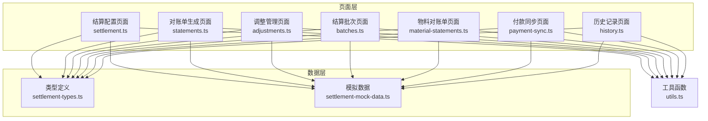
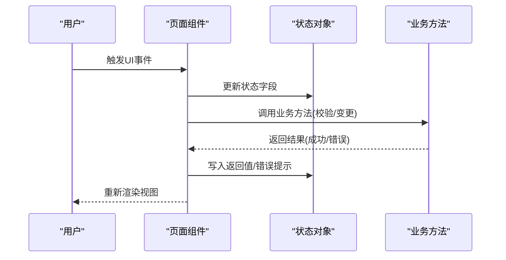
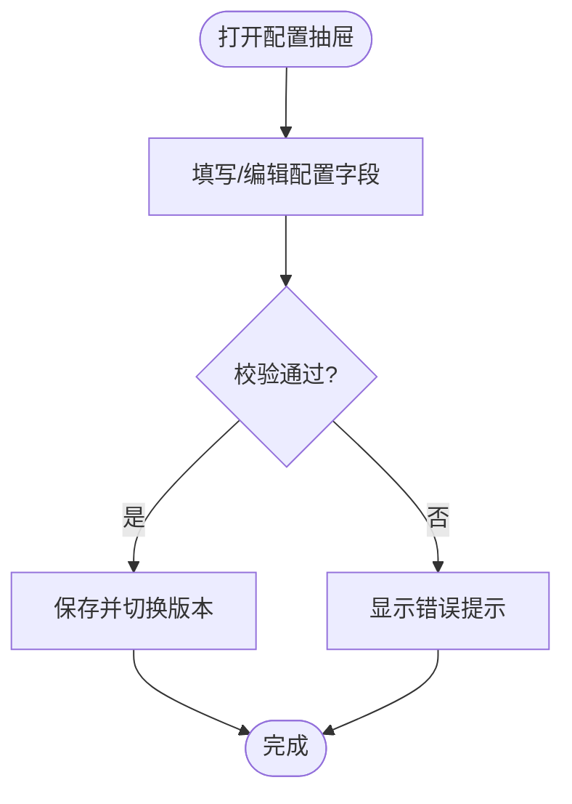
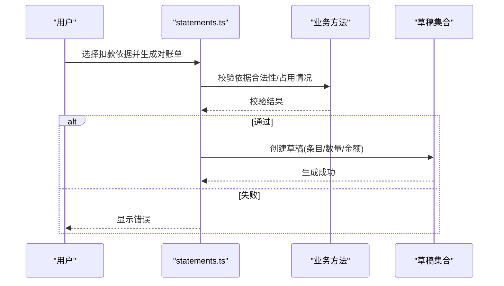
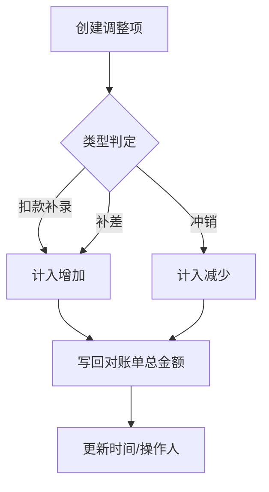
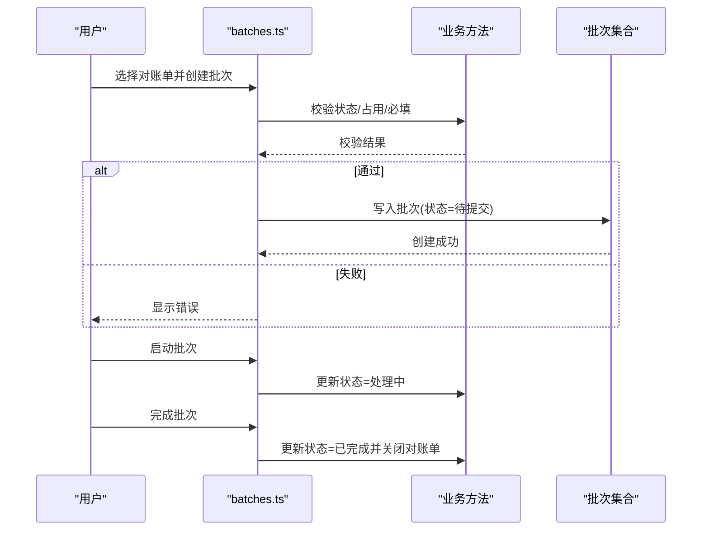
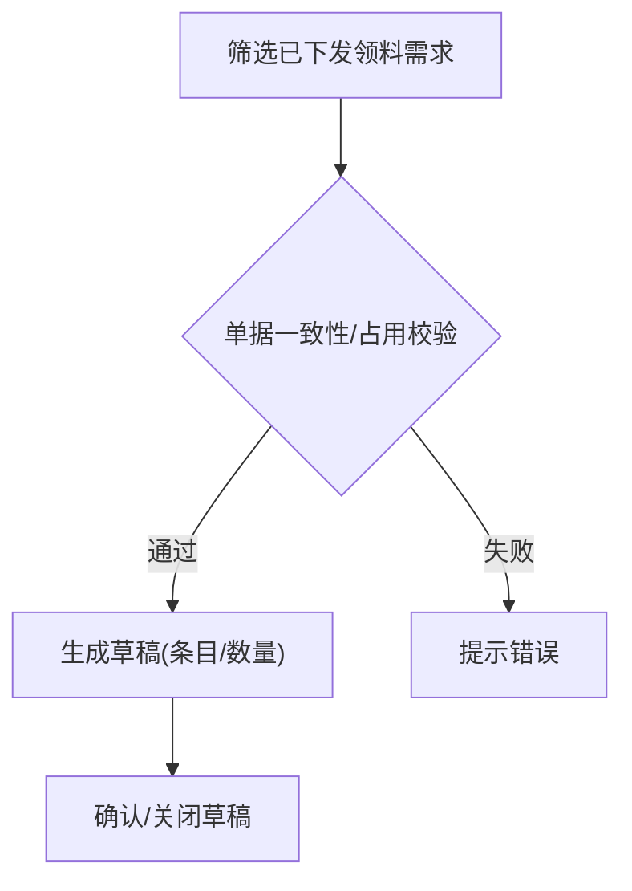
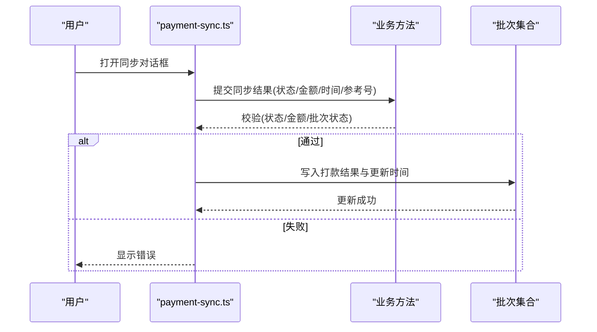
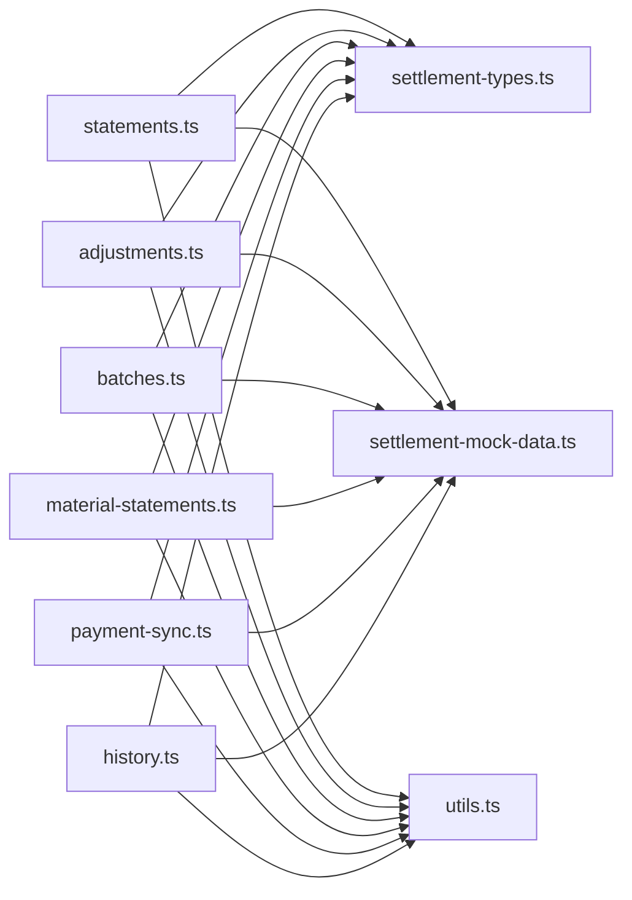

# 结算管理

<cite>
**本文引用的文件**
- [src/pages/settlement.ts](file://src/pages/settlement.ts)
- [src/pages/adjustments.ts](file://src/pages/adjustments.ts)
- [src/pages/batches.ts](file://src/pages/batches.ts)
- [src/pages/statements.ts](file://src/pages/statements.ts)
- [src/pages/history.ts](file://src/pages/history.ts)
- [src/pages/material-statements.ts](file://src/pages/material-statements.ts)
- [src/pages/payment-sync.ts](file://src/pages/payment-sync.ts)
- [src/data/fcs/settlement-types.ts](file://src/data/fcs/settlement-types.ts)
- [src/data/fcs/settlement-mock-data.ts](file://src/data/fcs/settlement-mock-data.ts)
- [src/utils.ts](file://src/utils.ts)
</cite>

## 目录
1. [简介](#简介)
2. [项目结构](#项目结构)
3. [核心组件](#核心组件)
4. [架构总览](#架构总览)
5. [详细组件分析](#详细组件分析)
6. [依赖关系分析](#依赖关系分析)
7. [性能考虑](#性能考虑)
8. [故障排查指南](#故障排查指南)
9. [结论](#结论)
10. [附录](#附录)

## 简介
本文件为“结算管理系统”的全面技术文档，覆盖结算对账、对账单生成、调整处理、结算批次、物料对账、付款同步、历史记录等核心功能模块。文档从架构设计、数据流、处理逻辑、关键算法与异常处理等方面进行深入解析，并通过图示帮助读者快速理解系统运作机制。

## 项目结构
结算管理相关页面与数据位于前端 src 目录下，采用按功能域划分的组织方式：
- 页面层：各功能页面（对账单、调整、批次、物料对账、付款同步、历史）均以独立 TS 文件实现渲染与事件处理。
- 数据层：类型定义与模拟数据分别位于 settlement-types.ts 与 settlement-mock-data.ts，支撑页面逻辑运行。
- 工具层：通用工具函数（如转义、类名拼接）位于 utils.ts，供页面复用。

图表来源
- [src/pages/settlement.ts](file://src/pages/settlement.ts)
- [src/pages/statements.ts](file://src/pages/statements.ts)
- [src/pages/adjustments.ts](file://src/pages/adjustments.ts)
- [src/pages/batches.ts](file://src/pages/batches.ts)
- [src/pages/material-statements.ts](file://src/pages/material-statements.ts)
- [src/pages/payment-sync.ts](file://src/pages/payment-sync.ts)
- [src/pages/history.ts](file://src/pages/history.ts)
- [src/data/fcs/settlement-types.ts](file://src/data/fcs/settlement-types.ts)
- [src/data/fcs/settlement-mock-data.ts](file://src/data/fcs/settlement-mock-data.ts)
- [src/utils.ts](file://src/utils.ts)

章节来源
- [src/pages/settlement.ts](file://src/pages/settlement.ts)
- [src/pages/statements.ts](file://src/pages/statements.ts)
- [src/pages/adjustments.ts](file://src/pages/adjustments.ts)
- [src/pages/batches.ts](file://src/pages/batches.ts)
- [src/pages/material-statements.ts](file://src/pages/material-statements.ts)
- [src/pages/payment-sync.ts](file://src/pages/payment-sync.ts)
- [src/pages/history.ts](file://src/pages/history.ts)
- [src/data/fcs/settlement-types.ts](file://src/data/fcs/settlement-types.ts)
- [src/data/fcs/settlement-mock-data.ts](file://src/data/fcs/settlement-mock-data.ts)
- [src/utils.ts](file://src/utils.ts)

## 核心组件
- 结算配置与账户规则：负责工厂结算配置、默认账户与扣款规则的维护与校验。
- 对账单生成：从扣款依据生成对账单草稿，支持筛选、确认与关闭。
- 调整处理：对账单生效后的补充、补差、冲销等调整项管理。
- 结算批次：将已确认对账单归集为批次，支持批次创建、启动与完成。
- 物料对账：基于已下发的领料需求生成物料对账单草稿。
- 付款同步：登记已完成批次的打款结果（成功/失败/部分打款）。
- 历史记录：汇总已关闭对账单与已完成批次的历史信息。

章节来源
- [src/pages/settlement.ts](file://src/pages/settlement.ts)
- [src/pages/statements.ts](file://src/pages/statements.ts)
- [src/pages/adjustments.ts](file://src/pages/adjustments.ts)
- [src/pages/batches.ts](file://src/pages/batches.ts)
- [src/pages/material-statements.ts](file://src/pages/material-statements.ts)
- [src/pages/payment-sync.ts](file://src/pages/payment-sync.ts)
- [src/pages/history.ts](file://src/pages/history.ts)

## 架构总览
系统采用“页面即控制器”的前端架构，每个页面文件内包含：
- 状态管理：本地内存中的状态对象，承载页面表单、过滤器、对话框等。
- 渲染函数：根据状态生成 HTML 字符串，用于挂载到 DOM。
- 事件处理器：响应用户交互，更新状态并触发重渲染。
- 业务方法：封装对账单、批次、调整、付款同步等核心流程的校验与变更逻辑。

图表来源
- [src/pages/statements.ts](file://src/pages/statements.ts)
- [src/pages/adjustments.ts](file://src/pages/adjustments.ts)
- [src/pages/batches.ts](file://src/pages/batches.ts)
- [src/pages/payment-sync.ts](file://src/pages/payment-sync.ts)

## 详细组件分析

### 结算配置与账户规则
- 功能要点
  - 工厂结算配置：周期类型、计价方式、币种、生效日期等。
  - 默认收款账户：支持设为默认、启用/禁用。
  - 默认扣款规则：质量缺陷、延迟交付、物料损耗等，支持百分比/固定金额。
- 关键算法与校验
  - 表单字段校验与错误提示。
  - 新建版本时，旧版本自动失效的版本切换逻辑。
  - 账户默认状态互斥更新。
- 代码示例路径
  - [配置表单渲染与校验](file://src/pages/settlement.ts)
  - [账户与规则对话框渲染](file://src/pages/settlement.ts)
  - [类型定义与配置映射](file://src/data/fcs/settlement-types.ts)
  - [模拟数据](file://src/data/fcs/settlement-mock-data.ts)

图表来源
- [src/pages/settlement.ts](file://src/pages/settlement.ts)
- [src/data/fcs/settlement-types.ts](file://src/data/fcs/settlement-types.ts)
- [src/data/fcs/settlement-mock-data.ts](file://src/data/fcs/settlement-mock-data.ts)

章节来源
- [src/pages/settlement.ts](file://src/pages/settlement.ts)
- [src/data/fcs/settlement-types.ts](file://src/data/fcs/settlement-types.ts)
- [src/data/fcs/settlement-mock-data.ts](file://src/data/fcs/settlement-mock-data.ts)

### 对账单生成（结算对账）
- 业务逻辑
  - 从“可生成”扣款依据集合中筛选，按结算对象聚合。
  - 生成对账单草稿，包含条目数、总数量、总金额。
  - 支持确认为已确认，关闭为已关闭。
- 关键算法
  - 占用检查：避免同一扣款依据被多个未关闭对账单占用。
  - 合法性校验：依据存在性、可结算状态、对象一致性。
- 代码示例路径
  - [候选扣款依据筛选与聚合](file://src/pages/statements.ts)
  - [生成对账单草稿](file://src/pages/statements.ts)
  - [确认/关闭对账单](file://src/pages/statements.ts)

图表来源
- [src/pages/statements.ts](file://src/pages/statements.ts)

章节来源
- [src/pages/statements.ts](file://src/pages/statements.ts)

### 调整处理（对账单生效后的调整）
- 流程控制
  - 草稿/生效/作废三态流转。
  - 调整项与对账单关联，生效后即时重算对账单金额。
- 关键算法
  - 调整类型：扣款补录、补差、冲销。
  - 影响分析：对账单总金额的正负向累计。
- 代码示例路径
  - [创建调整项](file://src/pages/adjustments.ts)
  - [调整项生效/作废](file://src/pages/adjustments.ts)
  - [对账单重算](file://src/pages/adjustments.ts)

图表来源
- [src/pages/adjustments.ts](file://src/pages/adjustments.ts)

章节来源
- [src/pages/adjustments.ts](file://src/pages/adjustments.ts)

### 结算批次（批次创建与完成）
- 管理机制
  - 候选池：已确认且未被其他未完成批次占用的对账单。
  - 批次创建：批量纳入对账单，生成批次编号与统计信息。
  - 进度跟踪：待提交/处理中/已完成三态。
  - 完成确认：将纳入批次的对账单统一关闭。
- 关键算法
  - 占用去重：确保对账单唯一性。
  - 批次编号生成：带前缀与随机后缀的唯一性保证。
- 代码示例路径
  - [候选对账单池与筛选](file://src/pages/batches.ts)
  - [创建批次](file://src/pages/batches.ts)
  - [启动/完成批次](file://src/pages/batches.ts)

图表来源
- [src/pages/batches.ts](file://src/pages/batches.ts)

章节来源
- [src/pages/batches.ts](file://src/pages/batches.ts)

### 物料对账（领料对账单生成）
- 特殊处理
  - 基于已下发的领料需求生成对账单草稿。
  - 仅允许“部分下发/已下发”状态的领料需求纳入。
- 关键算法
  - 单据一致性校验：同属一个生产单。
  - 占用去重：避免同一领料需求被多个未关闭草稿占用。
- 代码示例路径
  - [候选领料需求筛选](file://src/pages/material-statements.ts)
  - [生成物料对账单草稿](file://src/pages/material-statements.ts)
  - [确认/关闭草稿](file://src/pages/material-statements.ts)

图表来源
- [src/pages/material-statements.ts](file://src/pages/material-statements.ts)

章节来源
- [src/pages/material-statements.ts](file://src/pages/material-statements.ts)

### 付款同步（银行/支付网关对接）
- 接口集成
  - 登记已完成批次的打款结果：成功/失败/部分打款。
  - 可选填写打款金额、时间、参考号与备注。
- 异常处理
  - 非法状态拒绝（仅已完成批次允许同步）。
  - 部分打款必填金额且大于 0。
- 代码示例路径
  - [已完成批次筛选与统计](file://src/pages/payment-sync.ts)
  - [同步打款结果](file://src/pages/payment-sync.ts)
  - [对话框与表单校验](file://src/pages/payment-sync.ts)

图表来源
- [src/pages/payment-sync.ts](file://src/pages/payment-sync.ts)

章节来源
- [src/pages/payment-sync.ts](file://src/pages/payment-sync.ts)

### 历史记录（对账单与批次历史）
- 功能要点
  - 统计已关闭对账单与已完成批次的数量与金额。
  - 展示对账单与批次的历史明细与关联关系。
- 代码示例路径
  - [对账单历史行构造](file://src/pages/history.ts)
  - [批次历史行构造](file://src/pages/history.ts)
  - [过滤与标签](file://src/pages/history.ts)

章节来源
- [src/pages/history.ts](file://src/pages/history.ts)

## 依赖关系分析
- 页面与类型/数据
  - 所有页面均依赖类型定义与模拟数据，保证编译期类型安全与运行期数据可用。
- 页面与工具
  - 页面普遍使用工具函数进行字符串转义与类名拼接，提升安全性与可读性。
- 业务耦合
  - 对账单、批次、调整、付款同步之间存在强关联：批次完成会关闭对账单；调整会影响对账单金额；付款同步依赖已完成批次。

图表来源
- [src/pages/statements.ts](file://src/pages/statements.ts)
- [src/pages/adjustments.ts](file://src/pages/adjustments.ts)
- [src/pages/batches.ts](file://src/pages/batches.ts)
- [src/pages/material-statements.ts](file://src/pages/material-statements.ts)
- [src/pages/payment-sync.ts](file://src/pages/payment-sync.ts)
- [src/pages/history.ts](file://src/pages/history.ts)
- [src/data/fcs/settlement-types.ts](file://src/data/fcs/settlement-types.ts)
- [src/data/fcs/settlement-mock-data.ts](file://src/data/fcs/settlement-mock-data.ts)
- [src/utils.ts](file://src/utils.ts)

章节来源
- [src/pages/statements.ts](file://src/pages/statements.ts)
- [src/pages/adjustments.ts](file://src/pages/adjustments.ts)
- [src/pages/batches.ts](file://src/pages/batches.ts)
- [src/pages/material-statements.ts](file://src/pages/material-statements.ts)
- [src/pages/payment-sync.ts](file://src/pages/payment-sync.ts)
- [src/pages/history.ts](file://src/pages/history.ts)
- [src/data/fcs/settlement-types.ts](file://src/data/fcs/settlement-types.ts)
- [src/data/fcs/settlement-mock-data.ts](file://src/data/fcs/settlement-mock-data.ts)
- [src/utils.ts](file://src/utils.ts)

## 性能考虑
- 内存状态管理：所有业务数据存储于页面本地状态，避免频繁网络请求，适合原型演示场景。
- 渲染策略：采用一次性字符串拼接渲染，简单直接；在数据量增大时建议引入虚拟列表与分页。
- 校验前置：在提交前集中校验，减少无效调用与错误反馈成本。
- 唯一性保障：批次与对账单编号采用带前缀与随机后缀的生成策略，降低冲突概率。

## 故障排查指南
- 对账单生成失败
  - 检查是否存在未满足结算条件的依据、是否已被占用、结算对象是否一致。
  - 参考路径：[生成对账单草稿校验](file://src/pages/statements.ts)
- 调整项生效失败
  - 确认对账单状态为已关闭时不可生效；已作废的调整项不可再次生效。
  - 参考路径：[调整项生效/作废](file://src/pages/adjustments.ts)
- 批次创建失败
  - 确认所选对账单均为已确认且未被其他未完成批次占用。
  - 参考路径：[创建批次校验](file://src/pages/batches.ts)
- 付款同步失败
  - 仅已完成批次允许同步；部分打款必须填写大于 0 的金额。
  - 参考路径：[同步打款结果校验](file://src/pages/payment-sync.ts)
- 物料对账生成失败
  - 仅允许“部分下发/已下发”的领料需求；需同属一个生产单且未被占用。
  - 参考路径：[生成物料对账单草稿校验](file://src/pages/material-statements.ts)

章节来源
- [src/pages/statements.ts](file://src/pages/statements.ts)
- [src/pages/adjustments.ts](file://src/pages/adjustments.ts)
- [src/pages/batches.ts](file://src/pages/batches.ts)
- [src/pages/payment-sync.ts](file://src/pages/payment-sync.ts)
- [src/pages/material-statements.ts](file://src/pages/material-statements.ts)

## 结论
本结算管理系统以页面为中心的前端架构清晰地实现了从对账单生成、调整处理、批次管理到付款同步与历史记录的完整闭环。通过严格的校验与状态机控制，系统在原型阶段即可稳定运行。后续可在数据持久化、权限控制、报表导出与真实支付对接方面进一步扩展。

## 附录
- 代码示例路径索引
  - [对账单生成与状态变更](file://src/pages/statements.ts)
  - [调整项创建/生效/作废](file://src/pages/adjustments.ts)
  - [批次创建/启动/完成](file://src/pages/batches.ts)
  - [物料对账单生成与状态变更](file://src/pages/material-statements.ts)
  - [付款结果同步登记](file://src/pages/payment-sync.ts)
  - [历史记录汇总与过滤](file://src/pages/history.ts)
  - [类型定义与配置映射](file://src/data/fcs/settlement-types.ts)
  - [模拟数据](file://src/data/fcs/settlement-mock-data.ts)
  - [工具函数](file://src/utils.ts)