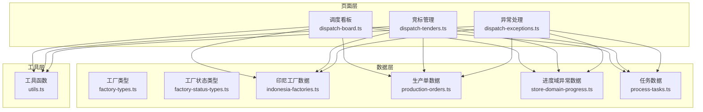
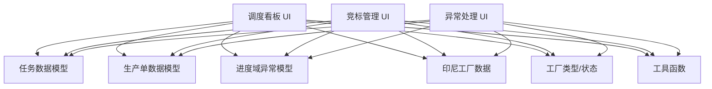
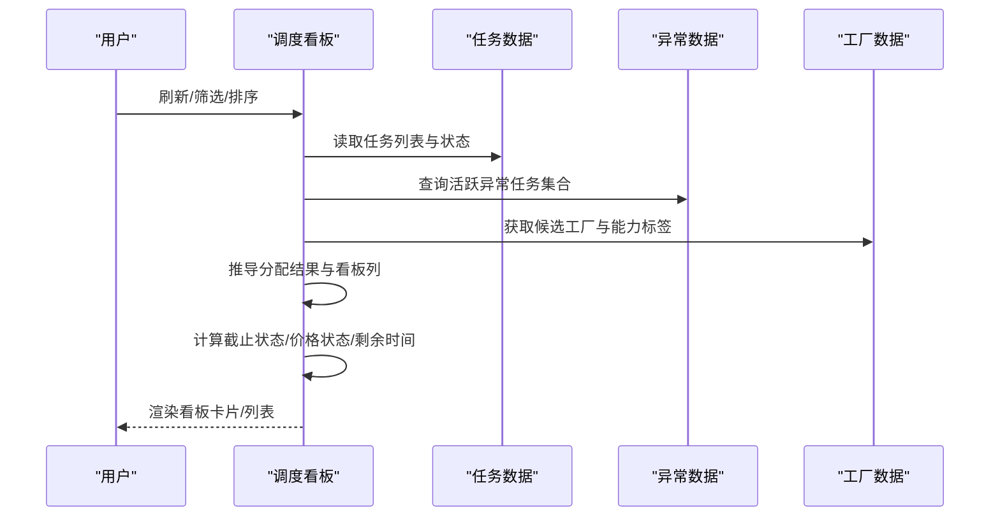
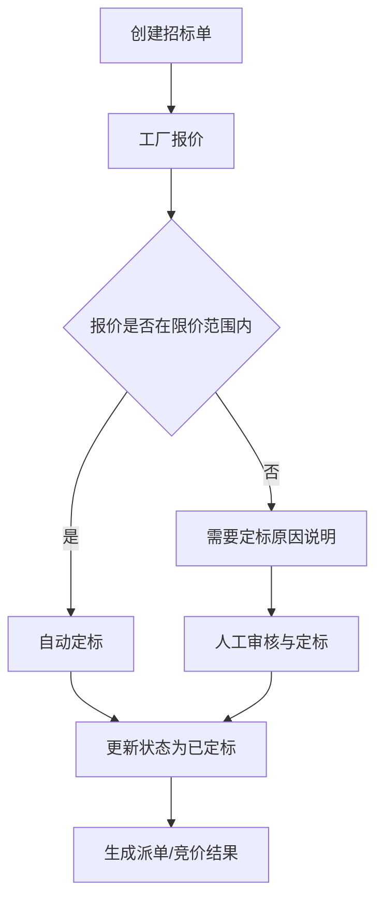
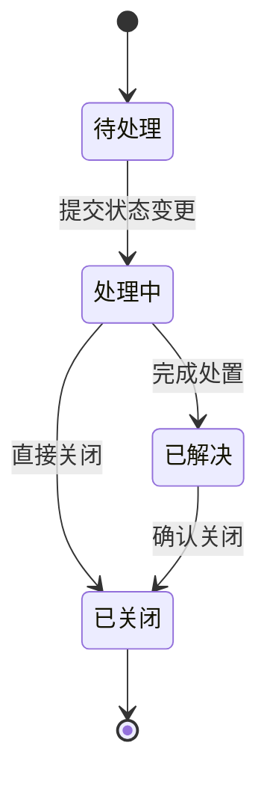
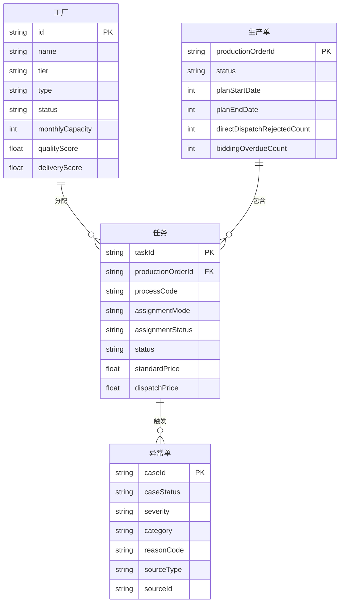
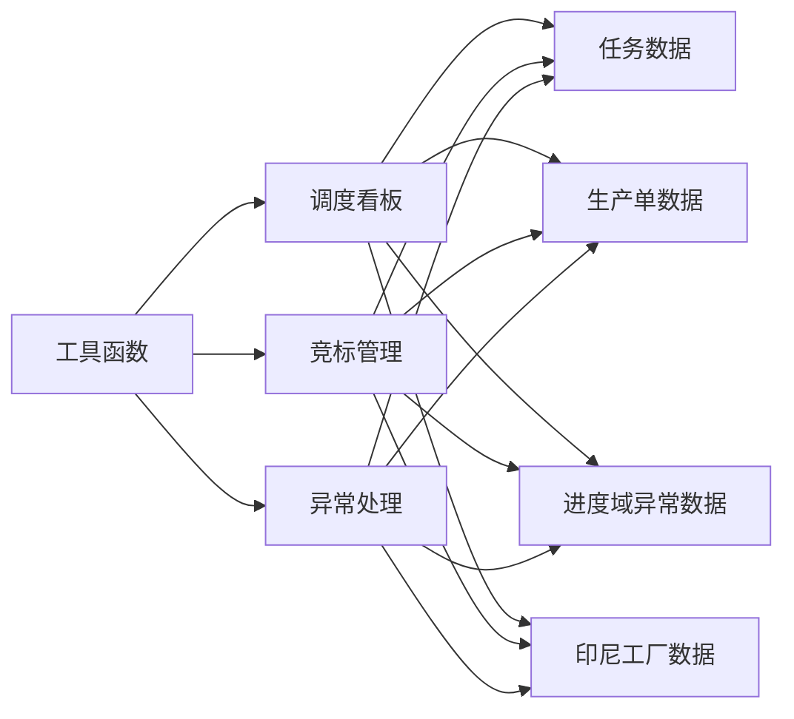

# 调度分配

<cite>
**本文引用的文件**
- [调度看板页面 dispatch-board.ts](file://src/pages/dispatch-board.ts)
- [竞标管理页面 dispatch-tenders.ts](file://src/pages/dispatch-tenders.ts)
- [异常处理页面 dispatch-exceptions.ts](file://src/pages/dispatch-exceptions.ts)
- [工厂类型定义 factory-types.ts](file://src/data/fcs/factory-types.ts)
- [工厂状态类型 factory-status-types.ts](file://src/data/fcs/factory-status-types.ts)
- [印尼工厂数据 indonesia-factories.ts](file://src/data/fcs/indonesia-factories.ts)
- [生产单数据 production-orders.ts](file://src/data/fcs/production-orders.ts)
- [进度域异常数据 store-domain-progress.ts](file://src/data/fcs/store-domain-progress.ts)
- [任务数据 process-tasks.ts](file://src/data/fcs/process-tasks.ts)
- [工具函数 utils.ts](file://src/utils.ts)
</cite>

## 目录
1. [引言](#引言)
2. [项目结构](#项目结构)
3. [核心组件](#核心组件)
4. [架构总览](#架构总览)
5. [详细组件分析](#详细组件分析)
6. [依赖关系分析](#依赖关系分析)
7. [性能考虑](#性能考虑)
8. [故障排查指南](#故障排查指南)
9. [结论](#结论)
10. [附录](#附录)

## 引言
本技术文档围绕调度分配系统，系统性阐述任务调度与工厂分配的整体架构，重点覆盖调度看板、竞标管理、异常处理等核心功能模块，并深入解析实时监控机制、竞标系统实现、异常处理流程与调度算法优化策略。文档以代码级分析为基础，结合可视化图示，帮助读者快速理解系统设计与实现细节。

## 项目结构
系统采用前端页面与数据层分离的组织方式：
- 页面层：调度看板、竞标管理、异常处理等页面组件负责用户交互与视图渲染。
- 数据层：包含工厂、任务、生产单、异常等领域的数据模型与种子数据，提供稳定的模拟数据支撑。
- 工具层：通用工具函数用于安全转义、类名拼接与日期格式化等。

**图表来源**
- [调度看板页面 dispatch-board.ts](file://src/pages/dispatch-board.ts)
- [竞标管理页面 dispatch-tenders.ts](file://src/pages/dispatch-tenders.ts)
- [异常处理页面 dispatch-exceptions.ts](file://src/pages/dispatch-exceptions.ts)
- [工厂类型定义 factory-types.ts](file://src/data/fcs/factory-types.ts)
- [工厂状态类型 factory-status-types.ts](file://src/data/fcs/factory-status-types.ts)
- [印尼工厂数据 indonesia-factories.ts](file://src/data/fcs/indonesia-factories.ts)
- [生产单数据 production-orders.ts](file://src/data/fcs/production-orders.ts)
- [进度域异常数据 store-domain-progress.ts](file://src/data/fcs/store-domain-progress.ts)
- [任务数据 process-tasks.ts](file://src/data/fcs/process-tasks.ts)
- [工具函数 utils.ts](file://src/utils.ts)

**章节来源**
- [调度看板页面 dispatch-board.ts](file://src/pages/dispatch-board.ts)
- [竞标管理页面 dispatch-tenders.ts](file://src/pages/dispatch-tenders.ts)
- [异常处理页面 dispatch-exceptions.ts](file://src/pages/dispatch-exceptions.ts)
- [工厂类型定义 factory-types.ts](file://src/data/fcs/factory-types.ts)
- [工厂状态类型 factory-status-types.ts](file://src/data/fcs/factory-status-types.ts)
- [印尼工厂数据 indonesia-factories.ts](file://src/data/fcs/indonesia-factories.ts)
- [生产单数据 production-orders.ts](file://src/data/fcs/production-orders.ts)
- [进度域异常数据 store-domain-progress.ts](file://src/data/fcs/store-domain-progress.ts)
- [任务数据 process-tasks.ts](file://src/data/fcs/process-tasks.ts)
- [工具函数 utils.ts](file://src/utils.ts)

## 核心组件
- 调度看板：提供任务状态跟踪、工厂负载监控、资源利用率统计与实时更新能力，支持看板与列表两种视图。
- 竞标管理：提供招标单创建、报价管理、定标决策与结果展示，支持价格区间控制与报价进度统计。
- 异常处理：提供异常分类、状态流转、SLA 管理与人工干预机制，支持派单拒单、竞价逾期、交接差异等场景。

**章节来源**
- [调度看板页面 dispatch-board.ts](file://src/pages/dispatch-board.ts)
- [竞标管理页面 dispatch-tenders.ts](file://src/pages/dispatch-tenders.ts)
- [异常处理页面 dispatch-exceptions.ts](file://src/pages/dispatch-exceptions.ts)

## 架构总览
调度分配系统由“页面层-数据层-工具层”三层构成，页面通过数据层提供的模型与种子数据进行渲染与交互；工具层提供通用的安全与格式化能力。

**图表来源**
- [调度看板页面 dispatch-board.ts](file://src/pages/dispatch-board.ts)
- [竞标管理页面 dispatch-tenders.ts](file://src/pages/dispatch-tenders.ts)
- [异常处理页面 dispatch-exceptions.ts](file://src/pages/dispatch-exceptions.ts)
- [工厂类型定义 factory-types.ts](file://src/data/fcs/factory-types.ts)
- [工厂状态类型 factory-status-types.ts](file://src/data/fcs/factory-status-types.ts)
- [印尼工厂数据 indonesia-factories.ts](file://src/data/fcs/indonesia-factories.ts)
- [生产单数据 production-orders.ts](file://src/data/fcs/production-orders.ts)
- [进度域异常数据 store-domain-progress.ts](file://src/data/fcs/store-domain-progress.ts)
- [任务数据 process-tasks.ts](file://src/data/fcs/process-tasks.ts)
- [工具函数 utils.ts](file://src/utils.ts)

## 详细组件分析

### 调度看板组件分析
调度看板负责任务的实时状态跟踪与工厂侧信息展示，核心逻辑包括：
- 任务状态与分配路径推导：根据任务审计日志与分配模式，推导出任务的当前分配结果与所处看板列。
- 实时监控指标：计算剩余时间、截止状态、价格状态与任务状态徽章，辅助判断任务健康度。
- 工厂池与候选工厂：基于印尼工厂数据与任务推荐策略，构建候选工厂集合，支持直接派单与竞价两种路径。
- 异常识别：通过异常数据集识别存在异常的任务，阻断常规分配流程，引导人工介入。

**图表来源**
- [调度看板页面 dispatch-board.ts](file://src/pages/dispatch-board.ts)
- [进度域异常数据 store-domain-progress.ts](file://src/data/fcs/store-domain-progress.ts)
- [印尼工厂数据 indonesia-factories.ts](file://src/data/fcs/indonesia-factories.ts)
- [任务数据 process-tasks.ts](file://src/data/fcs/process-tasks.ts)

**章节来源**
- [调度看板页面 dispatch-board.ts](file://src/pages/dispatch-board.ts)
- [进度域异常数据 store-domain-progress.ts](file://src/data/fcs/store-domain-progress.ts)
- [印尼工厂数据 indonesia-factories.ts](file://src/data/fcs/indonesia-factories.ts)
- [任务数据 process-tasks.ts](file://src/data/fcs/process-tasks.ts)

### 竞标管理系统分析
竞标管理模块涵盖招标单生命周期的关键环节：
- 招标单创建：设置最低/最高限价、竞价截止时间、任务截止时间与工厂池，支持预览与提交。
- 报价管理：展示各工厂报价明细、报价进度摘要与价格偏差，支持定标决策与原因记录。
- 定标决策：在报价截止后，依据限价范围与综合评估规则进行定标，形成最终分配结果。
- 状态统计：提供各状态（招标中、待定标、已定标）的数量统计，便于运营监控。

**图表来源**
- [竞标管理页面 dispatch-tenders.ts](file://src/pages/dispatch-tenders.ts)
- [任务数据 process-tasks.ts](file://src/data/fcs/process-tasks.ts)
- [印尼工厂数据 indonesia-factories.ts](file://src/data/fcs/indonesia-factories.ts)

**章节来源**
- [竞标管理页面 dispatch-tenders.ts](file://src/pages/dispatch-tenders.ts)
- [任务数据 process-tasks.ts](file://src/data/fcs/process-tasks.ts)
- [印尼工厂数据 indonesia-factories.ts](file://src/data/fcs/indonesia-factories.ts)

### 异常处理流程分析
异常处理模块提供完整的异常生命周期管理：
- 异常分类与来源：支持任务、招标单、定标等来源，按严重级别与类别进行归类。
- 状态流转：支持从“待处理”到“处理中”、“已解决”、“已关闭”的状态变更，并记录审计日志。
- SLA 管理：根据严重级别计算 SLA 截止时间，驱动自动化提醒与升级机制。
- 人工干预：提供状态变更对话框与备注输入，支持运营人员进行人工干预与闭环处理。

**图表来源**
- [异常处理页面 dispatch-exceptions.ts](file://src/pages/dispatch-exceptions.ts)
- [进度域异常数据 store-domain-progress.ts](file://src/data/fcs/store-domain-progress.ts)

**章节来源**
- [异常处理页面 dispatch-exceptions.ts](file://src/pages/dispatch-exceptions.ts)
- [进度域异常数据 store-domain-progress.ts](file://src/data/fcs/store-domain-progress.ts)

### 数据模型与关系
系统通过统一的数据模型支撑调度分配的核心业务：

**图表来源**
- [工厂类型定义 factory-types.ts](file://src/data/fcs/factory-types.ts)
- [工厂状态类型 factory-status-types.ts](file://src/data/fcs/factory-status-types.ts)
- [印尼工厂数据 indonesia-factories.ts](file://src/data/fcs/indonesia-factories.ts)
- [生产单数据 production-orders.ts](file://src/data/fcs/production-orders.ts)
- [任务数据 process-tasks.ts](file://src/data/fcs/process-tasks.ts)
- [进度域异常数据 store-domain-progress.ts](file://src/data/fcs/store-domain-progress.ts)

**章节来源**
- [工厂类型定义 factory-types.ts](file://src/data/fcs/factory-types.ts)
- [工厂状态类型 factory-status-types.ts](file://src/data/fcs/factory-status-types.ts)
- [印尼工厂数据 indonesia-factories.ts](file://src/data/fcs/indonesia-factories.ts)
- [生产单数据 production-orders.ts](file://src/data/fcs/production-orders.ts)
- [任务数据 process-tasks.ts](file://src/data/fcs/process-tasks.ts)
- [进度域异常数据 store-domain-progress.ts](file://src/data/fcs/store-domain-progress.ts)

## 依赖关系分析
- 页面对数据的依赖：调度看板与竞标管理页面均依赖任务、生产单、异常与工厂数据；异常处理页面独立依赖进度域异常数据。
- 数据模型间的耦合：任务与生产单存在一对多关系，任务与异常之间通过来源类型建立弱耦合；工厂数据为任务分配提供候选集合。
- 工具函数的跨页面复用：HTML 转义与类名拼接等工具函数被多个页面共享，降低重复逻辑。

**图表来源**
- [调度看板页面 dispatch-board.ts](file://src/pages/dispatch-board.ts)
- [竞标管理页面 dispatch-tenders.ts](file://src/pages/dispatch-tenders.ts)
- [异常处理页面 dispatch-exceptions.ts](file://src/pages/dispatch-exceptions.ts)
- [任务数据 process-tasks.ts](file://src/data/fcs/process-tasks.ts)
- [生产单数据 production-orders.ts](file://src/data/fcs/production-orders.ts)
- [进度域异常数据 store-domain-progress.ts](file://src/data/fcs/store-domain-progress.ts)
- [印尼工厂数据 indonesia-factories.ts](file://src/data/fcs/indonesia-factories.ts)
- [工具函数 utils.ts](file://src/utils.ts)

**章节来源**
- [调度看板页面 dispatch-board.ts](file://src/pages/dispatch-board.ts)
- [竞标管理页面 dispatch-tenders.ts](file://src/pages/dispatch-tenders.ts)
- [异常处理页面 dispatch-exceptions.ts](file://src/pages/dispatch-exceptions.ts)
- [任务数据 process-tasks.ts](file://src/data/fcs/process-tasks.ts)
- [生产单数据 production-orders.ts](file://src/data/fcs/production-orders.ts)
- [进度域异常数据 store-domain-progress.ts](file://src/data/fcs/store-domain-progress.ts)
- [印尼工厂数据 indonesia-factories.ts](file://src/data/fcs/indonesia-factories.ts)
- [工具函数 utils.ts](file://src/utils.ts)

## 性能考虑
- 数据访问与缓存：页面状态集中管理，避免重复请求；对常用查询（如异常任务集合、工厂池）进行本地缓存，减少渲染压力。
- 渲染优化：看板与列表双视图切换时，仅重绘变化区域；报价进度摘要与徽章样式采用轻量级 DOM 更新策略。
- 实时性保障：通过定时刷新与事件驱动更新相结合的方式，确保看板与竞标状态的实时性与一致性。
- 计算复杂度：截止状态与价格状态计算为 O(n) 遍历，建议在大数据量场景下引入分页或虚拟滚动优化。

## 故障排查指南
- 任务阻塞识别：通过异常数据中的“BLOCKED_*”原因与任务状态联动判断，定位阻塞根因（物料、产能、质量、技术、设备等）。
- 异常原因分析：依据异常单的严重级别与类别，结合 SLA 截止时间，确定处理优先级与升级路径。
- 人工干预机制：在派单拒单、竞价逾期、交接差异等场景下，通过异常处理页面进行状态变更与备注记录，确保问题闭环。
- 常见问题定位：
  - 派单拒单：检查工厂状态与产能快照，确认是否存在黑名单或暂停状态。
  - 竞价逾期：核查招标单截止时间与报价数量，必要时手动延长或转为直接派单。
  - 交接差异：核对交接事件的数量差异与原因码，收集证据并走争议流程。

**章节来源**
- [异常处理页面 dispatch-exceptions.ts](file://src/pages/dispatch-exceptions.ts)
- [进度域异常数据 store-domain-progress.ts](file://src/data/fcs/store-domain-progress.ts)
- [印尼工厂数据 indonesia-factories.ts](file://src/data/fcs/indonesia-factories.ts)

## 结论
调度分配系统通过“看板+竞标+异常”的三位一体设计，实现了任务状态的实时监控、工厂报价的透明竞争与异常问题的人工闭环治理。页面层与数据层清晰分离，配合统一的数据模型与工具函数，既保证了系统的可维护性，也为后续扩展（如优先级调度、瓶颈突破策略）提供了良好的基础。

## 附录
- 代码示例路径（不展示具体代码内容）：
  - 调度看板状态推导与徽章渲染：[调度看板页面 dispatch-board.ts](file://src/pages/dispatch-board.ts)
  - 竞标报价统计与定标逻辑：[竞标管理页面 dispatch-tenders.ts](file://src/pages/dispatch-tenders.ts)
  - 异常状态变更与 SLA 计算：[异常处理页面 dispatch-exceptions.ts](file://src/pages/dispatch-exceptions.ts)
  - 工厂类型与状态配置：[工厂类型定义 factory-types.ts](file://src/data/fcs/factory-types.ts)、[工厂状态类型 factory-status-types.ts](file://src/data/fcs/factory-status-types.ts)
  - 印尼工厂数据与能力标签：[印尼工厂数据 indonesia-factories.ts](file://src/data/fcs/indonesia-factories.ts)
  - 生产单状态机与分配摘要：[生产单数据 production-orders.ts](file://src/data/fcs/production-orders.ts)
  - 任务模型与审计日志：[任务数据 process-tasks.ts](file://src/data/fcs/process-tasks.ts)
  - HTML 转义与类名拼接工具：[工具函数 utils.ts](file://src/utils.ts)